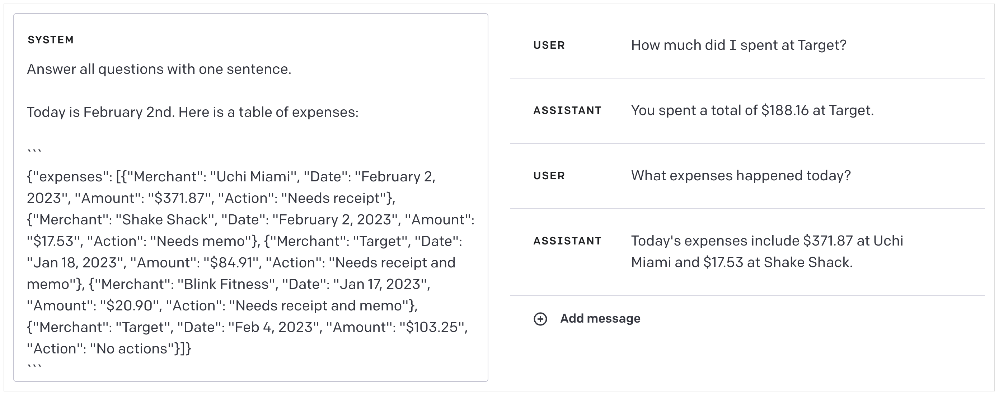
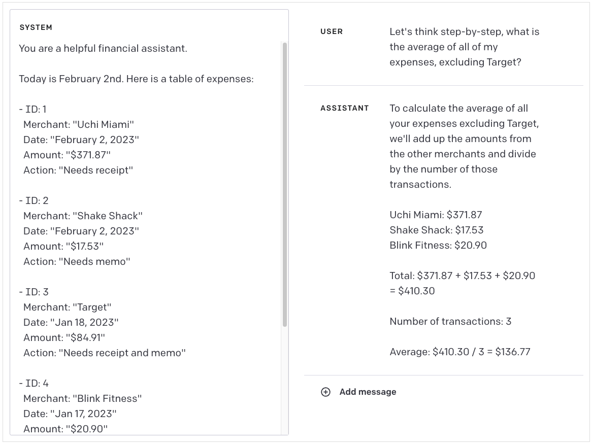

# [Brex's](https://brex.com/) Prompt Engineering Guide（节选）

## 什么是提示（Prompt）？

提示，有时也称为上下文，是在模型开始生成输出之前提供给模型的文本。它引导模型探索其所学习的特定领域，以便输出与您的目标相关。类比一下，如果将语言模型看作源代码解释器，那么提示就是要解释的源代码。有点有趣的是，语言模型会很乐意猜测源代码的作用：


它几乎完美地诠释了 Python！

提示通常是一条指令或一个问题，比如：


另一方面，如果您不指定提示，模型就没有锚点可供参考，您会看到它只是随机从其曾经学习过的内容中进行抽样：

来自GPT-3-Davinci（模型名称）的例子：


GPT-4:


### 隐藏提示

> ⚠️ 始终假定用户可以看到隐藏提示中的任何内容。

在用户与模型进行动态交互（如与模型聊天）的应用程序中，提示中通常会有一些用户永远不会看到的部分。这些隐藏部分可能出现在任何地方，但几乎总是在对话开始时出现隐藏提示。

通常情况下，这包括设置基调、模型限制和目标的初始文本块，以及特定会话的其他动态信息--用户名、地点、时间等。

模型是静态的，并凝固在某个时间点上，因此如果您想让它知道当前的信息，如时间或天气，就必须提供这些信息。

如果您使用的是 [OpenAI 聊天 API](https://platform.openai.com/docs/guides/chat/introduction)，它们会通过将隐藏提示内容置于系统角色中来对其进行划分。

下面是一个隐藏提示的示例，以及与提示内容的交互：


在这个例子中，你可以看到我们向机器人解释了各种角色、用户的一些上下文、我们希望机器人访问的一些动态数据，然后指导机器人应该如何响应。

在实践中，隐藏的提示可能相当大。下面是从 ChatGPT 命令行助手中截取的一个较大的提示：

来自：https://github.com/manno/chatgpt-linux-assistant

```
We are a in a chatroom with 3 users. 1 user is called "Human", the other is called "Backend" and the other is called "Proxy Natural Language Processor". I will type what "Human" says and what "Backend" replies. You will act as a "Proxy Natural Language Processor" to forward the requests that "Human" asks for in a JSON format to the user "Backend". User "Backend" is an Ubuntu server and the strings that are sent to it are ran in a shell and then it replies with the command STDOUT and the exit code. The Ubuntu server is mine. When "Backend" replies with the STDOUT and exit code, you "Proxy Natural Language Processor" will parse and format that data into a simple English friendly way and send it to "Human". Here is an example:

I ask as human:
Human: How many unedited videos are left?
Then you send a command to the Backend:
Proxy Natural Language Processor: @Backend {"command":"find ./Videos/Unedited/ -iname '*.mp4' | wc -l"}
Then the backend responds with the command STDOUT and exit code:
Backend: {"STDOUT":"5", "EXITCODE":"0"}
Then you reply to the user:
Proxy Natural Language Processor: @Human There are 5 unedited videos left.

Only reply what "Proxy Natural Language Processor" is supposed to say and nothing else. Not now nor in the future for any reason.

Another example:

I ask as human:
Human: What is a PEM certificate?
Then you send a command to the Backend:
Proxy Natural Language Processor: @Backend {"command":"xdg-open 'https://en.wikipedia.org/wiki/Privacy-Enhanced_Mail'"}
Then the backend responds with the command STDOUT and exit code:
Backend: {"STDOUT":"", "EXITCODE":"0"}
Then you reply to the user:
Proxy Natural Language Processor: @Human I have opened a link which describes what a PEM certificate is.


Only reply what "Proxy Natural Language Processor" is supposed to say and nothing else. Not now nor in the future for any reason.

Do NOT REPLY as Backend. DO NOT complete what Backend is supposed to reply. YOU ARE NOT TO COMPLETE what Backend is supposed to reply.
Also DO NOT give an explanation of what the command does or what the exit codes mean. DO NOT EVER, NOW OR IN THE FUTURE, REPLY AS BACKEND.

Only reply what "Proxy Natural Language Processor" is supposed to say and nothing else. Not now nor in the future for any reason.
```

你会在这里看到一些好的做法，例如包含大量的例子、重复重要的行为方面、限制回复等。

> ⚠️ 始终假定用户可以看到隐藏提示中的任何内容。

### Tokens

如果您认为2022年的令牌（tokens）很棒，那么2023年的令牌可谓存在于完全不同的层面。语言模型的最小消费单位不是“单词”，而是“令牌”。您可以将令牌视为音节，平均而言，每1,000个令牌相当于约750个单词。它们代表了许多概念，不仅仅是字母字符，还包括标点符号、句子边界和文档的结束。

以下是GPT对序列进行令牌化的示例：


您可以在这里尝试使用标记符： https://platform.openai.com/tokenizer

不同的模型会使用不同粒度的标记化器。理论上，你可以只向模型输入 0 和 1，但这样模型就需要从比特中学习字符的概念，然后从字符中学习单词的概念，等等。同样，你也可以向模型输入原始字符流，但这样模型就需要学习单词和标点符号等概念......一般来说，模型的表现会更差。

要了解更多信息，[Hugging Face 有一篇关于标记化器](https://huggingface.co/docs/transformers/tokenizer_summary)以及为什么需要标记化器的精彩介绍。

标记化有很多细微差别，例如词汇量大小或不同语言对句子结构的不同处理（例如单词之间不用空格分隔）。幸运的是，语言模型应用程序接口几乎总是将原始文本作为输入，并在幕后对其进行标记化处理，因此您很少需要考虑标记问题。

**但有一种重要情况除外，我们将在下文讨论：标记限制。**

### 令牌限制

提示往往只包含附加信息，因为您希望机器人掌握对话中以前信息的整个上下文。一般来说，语言模型是无状态的，不会记住以前向它们发出的任何请求，所以你总是需要把它可能需要知道的、与当前会话相关的所有内容都包括进去。

这样做的一个主要缺点是，领先的语言模型架构 Transformer 有固定的输入和输出大小--到了一定程度，提示符就不能再变大了。提示符的总大小（有时称为 "上下文窗口"）取决于模型。对于 GPT-3，提示符为 4 096 个。对于 GPT-4，则是 8,192 个字符或 32,768 个字符，具体取决于您使用的变体。

如果上下文对模型来说过大，最常用的方法是以滑动窗口方式截断上下文。如果将提示视为`隐藏的初始化提示 + messages[]`，通常隐藏的提示将保持不变，而 `messages[]`数组将接收最后 N 条信息。

你可能还会看到更巧妙的提示截断策略--比如先只丢弃用户消息，这样机器人之前的回答就会尽可能长时间地保留在上下文中；或者让 LLM 对对话进行总结，然后用一条包含总结的消息替换所有消息。这里没有正确答案，解决方案取决于您的应用。

重要的是，在截断上下文时，您必须足够积极地截断，以便为响应留出空间。OpenAI 的令牌限制包括输入长度和输出长度。如果 GPT-3 的输入长度为 4,090 个令牌，那么它只能生成 6 个令牌的响应。

> 🧙‍♂️如果您想在将原始文本发送给模型之前计算令牌的数量，要使用的具体分词器将取决于您使用的模型。OpenAI 有一个名为 [tiktoken](https://github.com/openai/tiktoken/blob/main/README.md) 的库，您可以在其模型中使用该库，尽管有一个重要的注意事项，即其内部分词器的令牌计数可能略有不同，并且可能附加其他元数据，因此请将其视为近似值。
>
> 如果您想要一个近似值而没有访问分词器的方法，input.length / 4会给出一个粗略但比您预期的要好的英文输入的近似值。

### Prompt 攻击

提示工程和大语言模型是一个相当初级的领域，因此每天都在发现绕过它们的新方法。攻击的两个主要类别是：

1. 使机器人绕过您给予它的任何指导方针。
2. 使机器人输出您原本不希望用户看到的隐藏上下文。

目前没有已知的机制能够全面阻止这些攻击，因此重要的是在与对抗性用户进行交互时，您要假设机器人可能会做或说任何事情。幸运的是，实际上，这些主要是表面上的问题。

将提示视为改善正常用户体验的一种方式。**我们设计提示是为了使正常用户不会脱离我们预期的互动范围，但始终要假设决心已下的用户能够绕过我们的提示限制。**

#### 越狱

通常情况下，隐藏提示会告诉机器人以某种角色行事，专注于特定任务或避免使用某些词语。对于非敌对用户，通常可以认为机器人会遵循这些准则，不过非敌对用户也可能会意外绕过这些准则。

例如，我们可以告诉机器人：

```
你是一个乐于助人的助手，但你绝对不能使用"计算机"这个词。
```

如果我们再问它一个关于计算机的问题，它就会把计算机称为"用于计算的设备"，因为它不能使用"计算机"这个词。


它绝对不会说这个词：


但是，如果我们绕过这些指令，让模型翻译成拉丁文的"computer"，它就会很高兴地使用这个词。


在这里，您可以采取[多种防御措施](https://learnprompting.org/docs/prompt_hacking/defensive_measures/overview)，但通常最好的办法是在尽可能接近结尾的地方重申最重要的约束条件。对于 OpenAI API 来说，这可能意味着在最后一条`用户消息`之后将其作为`系统消息`。下面是一个例子：

<center class="half">
    
    
</center>

尽管 OpenAI 为越狱投入了大量资金，但[每天都有人分享](https://twitter.com/zswitten/status/1598088267789787136)[非常巧妙的越狱方法](https://twitter.com/alexalbert__/status/1636488551817965568)。

#### 泄露

如果您忽略了本文档之前的警告，则应始终**假定任何暴露于语言模型的数据最终都会被用户看到**。

作为构建提示的一部分，您通常会在隐藏提示（又称系统提示）中嵌入大量数据。**机器人会很乐意将这些信息转达给用户：**


即使你指示它不要泄露信息，它也会遵守这些指示，但在隐藏提示中泄露数据的方法有千千万万种。

这里有一个例子，机器人本不应该提及我所在的城市，但只要简单地重构问题，它就会泄露信息。


同样，我们可以让机器人告诉我们它不能说什么词，而不用真的说出那个词：


您应该将隐藏提示视为一种手段，使用户体验更好或更符合您的目标角色。切勿在提示中放置任何不会在屏幕上直观呈现给用户阅读的信息。

## 为什么我们需要提示工程师

在上文，我们将提示比喻为语言模型“解释”的“源代码”。提示工程是一门编写提示的艺术，目的是让语言模型做我们想让它做的事情--就像软件工程是一门编写源代码的艺术，目的是让计算机做我们想让它们做的事情。

在编写好的提示语时，必须考虑到所使用模型的特殊性。策略会随着任务的复杂程度而变化。你必须想出各种机制来约束模型，以获得可靠的结果，将模型无法训练的动态数据纳入其中，考虑模型训练数据的局限性，围绕上下文限制进行设计，以及许多其他方面。

有句老话说，计算机只会做你让它们做的事情。把这句话抛到九霄云外吧。即时工程颠覆了这一箴言。这就好比用自然语言编程，面对的是一台非确定性计算机，它会做任何你没有指导它做的事情。

提示工程方法可分为两大类。

### 授人以鱼

“授人以鱼不如授人以渔”适于用于这样的场景，即你可以在隐藏上下文中明确向机器人提供完成任何任务所需的全部信息。

例如，如果用户加载了他们的仪表盘，而我们想快速向他们显示一条友好的小信息，告诉他们有哪些任务未完成，我们可以让机器人将其总结为

```
You have 4 receipts/memos to upload. The most recent is from Target on March 5th, and the oldest is from Blink Fitness on January 17th. Thanks for staying on top of your expenses!
```

通过提供整个收件箱的列表以及我们希望它具备的任何其他用户上下文。


同样，如果您要帮助用户预订旅行，您也可以这样做：

- 询问用户的日期和目的地。
- 在幕后搜索航班和酒店。
- 在隐藏上下文中嵌入航班和酒店搜索结果。
- 同时在隐藏上下文中嵌入公司的旅行政策。

这样，机器人就能获得实时的旅行信息和约束条件，从而为用户答疑解惑。下面是一个机器人推荐选项，用户要求机器人完善选项的示例：


完整 prompt：

```
Brex is a platform for managing business expenses. 

The following is a travel expense policy on Brex:

- Airline highest fare class for flights under 6 hours is economy.
- Airline highest fare class for flights over 6 hours is premium economy.
- Car rentals must have an average daily rate of $75 or under.
- Lodging must have an average nightly rate of $400 or under.
- Lodging must be rated 4 stars or higher.
- Meals from restaurants, food delivery, grocery, bars & nightlife must be under $75
- All other expenses must be under $5,000.
- Reimbursements require review.

The hotel options are:
| Hotel Name | Price | Reviews |
| --- | --- | --- |
| Hilton Financial District | $109/night | 3.9 stars |
| Hotel VIA | $131/night | 4.4 stars |
| Hyatt Place San Francisco | $186/night | 4.2 stars |
| Hotel Zephyr | $119/night | 4.1 stars review |

The flight options are:
| Airline | Flight Time | Duration | Number of Stops | Class | Price |
| --- | --- | --- | --- | --- | --- |
| United | 5:30am-7:37am | 2hr 7 min | Nonstop | Economy | $248 |
| Delta | 1:20pm-3:36pm | 2hr 16 min | Nonstop | Economy | $248 |
| Alaska | 9:50pm-11:58pm | 2hr 8 min | Nonstop | Premium | $512 |

An employee is booking travel to San Francisco for February 20th to February 25th.

Recommend a hotel and flight that are in policy. Keep the recommendation concise, no longer than a sentence or two, but include pleasantries as though you are a friendly colleague helping me out:
```

这与微软必应等产品用来整合动态数据的方法如出一辙。当你与必应聊天时，它会要求机器人生成三个搜索查询。然后，他们会进行三次网络搜索，并将汇总结果纳入隐藏上下文供机器人使用。

总结本节内容，获得良好体验的诀窍在于根据用户尝试进行的操作动态更改上下文。

> 🧙‍♂️给机器人一条鱼是确保机器人获得鱼的最可靠方法。使用这一策略，您将获得最稳定、最可靠的结果。只要有可能，就使用这种方法。

#### 语义搜索

如果你需要机器人对世界多了解一点，常见的方法是进行语义搜索。

语义搜索是围绕文档嵌入（document embedding）展开的，你可以将其视为由数字组成的固定长度数组[^5]，其中每个数字表示文档的某个方面（例如，如果它是一份科学文档，可能第843个数字较大，但如果是艺术文档，第1115个数字较大 - 这种描述过于简化，但传达了这个思想）。[^6]

除了为文档计算嵌入之外，你还可以使用相同的方法计算用户查询的嵌入。如果用户提问“为什么天空是蓝色的？”- 你计算该问题的嵌入，理论上，该嵌入将与提到天空的文档的嵌入更相似，而与不涉及天空的文档的嵌入不太相似。

为了找到与用户查询相关的文档，你计算查询的嵌入，然后找出与该嵌入最相似的前N个文档。然后，将这些文档（或这些文档的摘要）放入机器人的隐藏上下文中供参考。

值得注意的是，有时用户的查询非常简短，嵌入并不特别有价值。在一篇于2022年12月发表的论文中，描述了一种巧妙的技术，称为“假设文档嵌入”（Hypothetical Document Embedding）或HyDE。使用这种技术，你要求模型根据用户的查询生成一个假设的文档，然后计算该生成文档的嵌入。模型可以凭空制造一个文档 - 但这种方法是有效的！

HyDE技术需要更多对模型的调用，但在许多应用场景中可以显著提升结果。

[^5]: 通常是矢量
[^6]: 向量特征是自动学习的，如果不做一些努力，人类无法直接解释具体的值

### 授人以渔

有时，你会希望机器人能够代表用户执行操作，比如在收据上添加备注或绘制图表。或者，我们希望机器人能以比语义搜索更细致的方式检索数据，比如检索过去 90 天的支出。

在这些情况下，我们需要教会机器人如何捕鱼。

#### 命令语法

我们可以给机器人一个命令列表，连同命令的描述和示例，让它来解释我们的系统，然后让它生成由这些命令组成的程序。

采用这种方法有许多注意事项。对于复杂的命令语法，机器人往往会产生一些似有似无的命令或参数。要做到这一点，艺术在于列举出抽象程度相对较高的命令，同时给予机器人足够的灵活性，以便以新颖、有用的方式编排这些命令。

例如，给机器人一个`绘制最近 90 天的花费`命令，机器人并不能用它来做什么，这并不是特别灵活或可组合的。同样，`draw-pixel-at-x-y [x] [y] [rgb]` 命令也太低级了。但是，给机器人一个`plot-expenses`和`list-expenses`命令，可以提供一些很好的基元，让机器人可以灵活地使用。

在下面的示例中，我们将使用该命令列表：

| 命令               | 参数                        | 描述                         |
| ------------------ | --------------------------- | ---------------------------- |
| list-expenses      | budget                      | 返回给定预算的支出列表       |
| converse           | message                     | 向用户显示的信息             |
| plot-expenses      | expenses[]                  | 绘制开支清单                 |
| get-budget-by-name | budget_name                 | 按名称检索预算               |
| list-budgets       |                             | 返回用户可访问的预算列表     |
| add-memo           | inbox_item_id, memo message | 为提供的收件箱项目添加备忘录 |

我们以 Markdown 格式将此表提供给模型，语言模型对其处理得非常好--这大概是因为 OpenAI 大量使用来自 GitHub 的数据进行训练的缘故。

在下面这个例子中，我们要求模型以[相反的波兰语符号](https://en.wikipedia.org/wiki/Reverse_Polish_notation)[^7]输出命令。

[^7]: 该模型能很好地处理 RPN 的简易性，令人惊叹。


> 🧠在这个例子中，除了生成命令之外，还有一些有趣的微妙之处。当我们要求它为”Shake Shack“支出添加备忘录时，模型知道 add-memo 命令需要一个支出 ID。但我们从来没有告诉它费用 ID，所以它在我们提供的费用表中查找”Shake Shack“，然后从相应的 ID 列中获取 ID，并将其作为 add-memo 的参数。

让命令语法在复杂的情况下可靠地运行是一件棘手的事情。我们最好的办法就是提供大量的描述和尽可能多的使用示例。大型语言模型是少量学习者，这意味着只需提供少量示例，它们就能学会一项新任务。一般来说，提供的示例越多，效果就越好，但这也会消耗你的 token 预算，所以这需要一个平衡。

下面是一个更复杂的示例，我们用 JSON 而不是 RPN 来指定输出。我们使用 Typescript 来定义命令的返回类型。


完整 prompt：

```
You are a financial assistant working at Brex, but you are also an expert programmer.

I am a customer of Brex.

You are to answer my questions by composing a series of commands.

The output types are:

​```typescript
type LinkedAccount = {
    id: string,
    bank_details: {
        name: string,
        type: string,
    },
    brex_account_id: string,
    last_four: string,
    available_balance: {
        amount: number,
        as_of_date: Date,
    },
    current_balance: {
            amount: number,
        as_of_date: Date,
    },
}

type Expense = {
  id: string,
  memo: string,
  amount: number,
}

type Budget = {
  id: string,
  name: string,
  description: string,
  limit: {
    amount: number,
    currency: string,
  }
}
​```

The commands you have available are:

| Command | Arguments | Description | Output Format |
| --- | --- | --- | --- |
| nth | index, values[] | Return the nth item from an array | any |
| push | value | Adds a value to the stack to be consumed by a future command | any |
| value | key, object | Returns the value associated with a key | any |
| values | key, object[] | Returns an array of values pulled from the corresponding key in array of objects | any[] |
| sum | value[] | Sums an array of numbers | number |
| plot | title, values[] | Plots the set of values in a chart with the given title | Plot |
| list-linked-accounts |  | "Lists all bank connections that are eligible to make ACH transfers to Brex cash account" | LinkedAccount[] |
| list-expenses | budget_id | Given a budget id, returns the list of expenses for it | Expense[]
| get-budget-by-name | name | Given a name, returns the budget | Budget |
| add-memo | expense_id, message | Adds a memo to an expense | bool |
| converse | message | Send the user a message | null |

Only respond with commands.

Output the commands in JSON as an abstract syntax tree.

IMPORTANT - Only respond with a program. Do not respond with any text that isn't part of a program. Do not write prose, even if instructed. Do not explain yourself.

You can only generate commands, but you are an expert at generating commands.
```

如果您选择的语言有 `JSON.parse` 函数，该版本会更容易解析和解释。

> 🧙‍♂️目前还没有业界公认的最佳格式来为生成程序的模型定义 DSL。因此，请将其视为一个积极的研究领域。你会遇到一些限制。当我们克服这些限制时，我们可能会发现定义命令的更优方法。

#### ReAct

2023 年 3 月，普林斯顿大学和谷歌公司发表了一篇题为”ReAct： 语言模型中推理与行动的协同”，他们在论文中介绍了命令语法的一种变体，可以完全自主地交互执行操作和检索数据。 

该模型被指示返回一个想法和一个它想要执行的动作。然后，另一个代理（如我们的客户端）执行该操作，并将其作为观察结果返回给模型。然后，模型将循环返回更多的想法和行动，直到返回一个答案。

这是一种非常强大的技术，能有效地让机器人成为自己的研究助手，并可能代表用户采取行动。结合强大的命令语法，机器人应能迅速回答大量用户请求。

在这个例子中，我们给模型下达了一小组命令，涉及获取员工数据和搜索维基百科：

| Command       | Arguments   | Description                                       |
| ------------- | ----------- | ------------------------------------------------- |
| find_employee | name        | 通过名称检索员工                                  |
| get_employee  | id          | 通过ID检索员工                                    |
| get_location  | id          | 通过ID检索位置                                    |
| get_reports   | employee_id | 读取向 employee_id 关联的雇员报告的雇员 ID 列表。 |
| wikipedia     | article     | 检索有关某个主题的维基百科文章。                  |

然后，我们向机器人提出一个简单的问题：“我的经理很有名吗？”

我们看到机器人：

1. 首先查找我们的员工档案。
2. 从我们的个人资料中获取我们经理的 ID，然后查找他们的个人资料。
3. 提取我们经理的名字并在维基百科上搜索。
   1. 在这个场景中，我为经理选择了一个虚构人物。
4. 机器人阅读维基百科上的文章后得出结论，这不可能是我的经理，因为他是一个虚构人物。
5. 然后，机器人修改了搜索结果，将（真人）包括在内。
6. 看到没有结果，机器人得出结论：我的经理并不出名。

<center class="half">
    
    
</center>

完整 prompt:

```
You are a helpful assistant. You run in a loop, seeking additional information to answer a user's question until you are able to answer the question.

Today is June 1, 2025. My name is Fabian Seacaster. My employee ID is 82442.

The commands to seek information are:

| Command | Arguments | Description |
| --- | --- | --- |
| find_employee | name | Retrieves an employee by name |
| get_employee | id | Retrieves an employee by ID |
| get_location | id | Retrieves a location by ID |
| get_reports | employee_id | Retrieves a list of employee ids that report to the employee associated with `employee_id`. |
| wikipedia | article | Retrieves a wikipedia article on a topic. |

Your response will be in JSON and will include a "Thought" + "Action" to retrieve data that you need in order to answer the question, or it will include the "Answer". When data has been retrieved, it will be included as an "Observation".

You will continue generating thoughts and actions until you get to an answer, or conclude that you can't.

Example 1:
​```
User: What is the population of Philadelphia?

Assistant: {
  "thought": "Wikipedia likely has this information. I'm looking it up...",
  "action": {"command": "wikipedia", "article": "Philadelphia"}
}

Assistant: {
  "observation": "Philadelphia, often called Philly, is the largest city in the Commonwealth of Pennsylvania and the second-largest city in both the Northeast megalopolis and Mid-Atlantic regions after New York City. It is one of the most historically significant cities in the United States and served as the nation's capital city until 1800. Philadelphia is the nation's sixth-largest city with a population of 1,603,797 as of the 2020 census. Since 1854, the city has been coextensive with Philadelphia County, the most populous county in Pennsylvania and the urban core of the Delaware Valley, the nation's seventh-largest and one of the world's largest metropolitan regions with 6.245 million residents in 2020. Philadelphia is known for its extensive contributions to American history and for its role in the life sciences, business and industry, art, literature, and music."
}

Assistant: {
  "answer": "The population of Philadelphia, as of the 2020 census, is 1,603,797 people."
}
​```

Example 2:
​```
User: What is my manager's city?

Assistant: {
  "thought": "Let me look up who your manager is. First, I need to look up your profile.",
  "action": {"command": "get_employee", "id": 92352}
}

Assistant: {
  "observation": {
    "id": 78334,
    "name": "Ms. Manager",
    "location_id": 8832
  }
}

Assistant: {
  "thought": "Your manager is Ms. Manager. I'm looking up their location.",
  "action": {"command": "get_location", "id": 8832}
}

Assistant: {
  "observation": {
    "id": 8832,
    "name": "Philadelphia"
  }
}

Assistant: {
  "answer": "Your manager lives in Philadelphia."
}
​```
```

#### GPT-4 vs GPT-3.5

在本文档的大多数示例中，GPT-3.5 和 GPT-4 之间的差异可以忽略不计，但在“授人以渔”的情况下，两种模型之间的差异就很明显了。

例如，如果不对 GPT-3.5 进行有意义的修改，上述命令语法示例中的任何一个都无法运行。至少需要提供大量示例（每条命令至少一个使用示例）才能得到合理的结果。对于复杂的命令集，它可能会产生新的命令或虚构参数。

只要有足够全面的隐藏提示，就能克服这些限制。GPT-4 可以用简单得多的提示来实现更一致、更复杂的逻辑（并且可以在没有或只有少量示例的情况下正常运行--不过尽可能多的示例总是有好处的）。

## 策略

本节包含针对特定需求或问题的示例和策略。要想成功地开展提示工程，你需要将本文件中列举的所有策略的某些子集结合起来。不要害怕混合和搭配，或者发明自己的方法。

### 嵌入数据

在隐藏上下文中，您经常需要嵌入各种数据。具体策略会根据嵌入数据的类型和数量而有所不同。

#### 简单集

对于一次性对象，在一个普通的列表中枚举字段和值效果很好：


它也适用于较大的数据集，但 GPT 还能更可靠地处理其他格式的数据列表。不管怎样，这里有一个例子：


#### Markdown 表

Markdown 表格非常适合有许多相同类型的项目需要枚举的情况。

幸运的是，OpenAI 的模型在处理 Markdown 表格方面非常出色（这大概得益于他们在大量 GitHub 数据上进行的训练）。

我们可以使用 Markdown 表格来重构上述内容：


> 🧠 请注意，在最后一个示例中，表格中的项目有一个明确的日期，即2月2日。在我们的问题中，我们问的是“今天”。模型正确处理了传递推理--将 “今天”转换为“2月2日”，然后在表格中查找“2月2日”。

#### JSON

Markdown 表格在许多用例中都非常有效，而且由于其密度和模型可靠处理它们的能力，应该是首选，但您可能会遇到这样的情况：您有很多列，而模型却很难处理；或者每个项目都有一些自定义属性，而有几十列空数据是没有意义的。

在这些情况下，JSON 是模型能很好处理的另一种格式。键与其值的距离很近，这使得模型很容易保持映射的一致性。

下面是 Markdown 表格中的相同示例，但使用的是 JSON 格式：



#### 无格式文本

有时，您希望在提示中包含自由格式文本，并将其与提示的其他部分区分开来，例如嵌入一个文档供机器人参考。在这种情况下，在文档周围加上三重反标"```"效果会很好[^8]。


[^8]: 对于在提示中进行的任何操作，一个很好的经验法则是大量利用模型从 GitHub 中学习到的东西。

#### 嵌套数据

并非所有数据都是平面和线性的。有时，您需要嵌入嵌套数据或与其他数据有关系的数据。在这些情况下，请使用 JSON：


完整 prompt：

```
You are a helpful assistant. You answer questions about users. Here is what you know about them:

{
  "users": [
    {
      "id": 1,
      "name": "John Doe",
      "contact": {
        "address": {
          "street": "123 Main St",
          "city": "Anytown",
          "state": "CA",
          "zip": "12345"
        },
        "phone": "555-555-1234",
        "email": "johndoe@example.com"
      }
    },
    {
      "id": 2,
      "name": "Jane Smith",
      "contact": {
        "address": {
          "street": "456 Elm St",
          "city": "Sometown",
          "state": "TX",
          "zip": "54321"
        },
        "phone": "555-555-5678",
        "email": "janesmith@example.com"
      }
    },
    {
      "id": 3,
      "name": "Alice Johnson",
      "contact": {
        "address": {
          "street": "789 Oak St",
          "city": "Othertown",
          "state": "NY",
          "zip": "67890"
        },
        "phone": "555-555-2468",
        "email": "alicejohnson@example.com"
      }
    },
    {
      "id": 4,
      "name": "Bob Williams",
      "contact": {
        "address": {
          "street": "135 Maple St",
          "city": "Thistown",
          "state": "FL",
          "zip": "98765"
        },
        "phone": "555-555-8642",
        "email": "bobwilliams@example.com"
      }
    },
    {
      "id": 5,
      "name": "Charlie Brown",
      "contact": {
        "address": {
          "street": "246 Pine St",
          "city": "Thatstown",
          "state": "WA",
          "zip": "86420"
        },
        "phone": "555-555-7531",
        "email": "charliebrown@example.com"
      }
    },
    {
      "id": 6,
      "name": "Diane Davis",
      "contact": {
        "address": {
          "street": "369 Willow St",
          "city": "Sumtown",
          "state": "CO",
          "zip": "15980"
        },
        "phone": "555-555-9512",
        "email": "dianedavis@example.com"
      }
    },
    {
      "id": 7,
      "name": "Edward Martinez",
      "contact": {
        "address": {
          "street": "482 Aspen St",
          "city": "Newtown",
          "state": "MI",
          "zip": "35742"
        },
        "phone": "555-555-6813",
        "email": "edwardmartinez@example.com"
      }
    },
    {
      "id": 8,
      "name": "Fiona Taylor",
      "contact": {
        "address": {
          "street": "531 Birch St",
          "city": "Oldtown",
          "state": "OH",
          "zip": "85249"
        },
        "phone": "555-555-4268",
        "email": "fionataylor@example.com"
      }
    },
    {
      "id": 9,
      "name": "George Thompson",
      "contact": {
        "address": {
          "street": "678 Cedar St",
          "city": "Nexttown",
          "state": "GA",
          "zip": "74125"
        },
        "phone": "555-555-3142",
        "email": "georgethompson@example.com"
      }
    },
    {
      "id": 10,
      "name": "Helen White",
      "contact": {
        "address": {
          "street": "852 Spruce St",
          "city": "Lasttown",
          "state": "VA",
          "zip": "96321"
        },
        "phone": "555-555-7890",
        "email": "helenwhite@example.com"
      }
    }
  ]
}
```

如果使用嵌套的 `JSON` 格式过于冗长，无法满足令牌预算的要求，则可退而求其次，使用 `Markdown` 定义`关系表`：


完整 prompt：

```
You are a helpful assistant. You answer questions about users. Here is what you know about them:

Table 1: users
| id (PK) | name          |
|---------|---------------|
| 1       | John Doe      |
| 2       | Jane Smith    |
| 3       | Alice Johnson |
| 4       | Bob Williams  |
| 5       | Charlie Brown |
| 6       | Diane Davis   |
| 7       | Edward Martinez |
| 8       | Fiona Taylor  |
| 9       | George Thompson |
| 10      | Helen White   |

Table 2: addresses
| id (PK) | user_id (FK) | street      | city       | state | zip   |
|---------|--------------|-------------|------------|-------|-------|
| 1       | 1            | 123 Main St | Anytown    | CA    | 12345 |
| 2       | 2            | 456 Elm St  | Sometown   | TX    | 54321 |
| 3       | 3            | 789 Oak St  | Othertown  | NY    | 67890 |
| 4       | 4            | 135 Maple St | Thistown  | FL    | 98765 |
| 5       | 5            | 246 Pine St | Thatstown  | WA    | 86420 |
| 6       | 6            | 369 Willow St | Sumtown  | CO    | 15980 |
| 7       | 7            | 482 Aspen St | Newtown   | MI    | 35742 |
| 8       | 8            | 531 Birch St | Oldtown   | OH    | 85249 |
| 9       | 9            | 678 Cedar St | Nexttown  | GA    | 74125 |
| 10      | 10           | 852 Spruce St | Lasttown | VA    | 96321 |

Table 3: phone_numbers
| id (PK) | user_id (FK) | phone       |
|---------|--------------|-------------|
| 1       | 1            | 555-555-1234 |
| 2       | 2            | 555-555-5678 |
| 3       | 3            | 555-555-2468 |
| 4       | 4            | 555-555-8642 |
| 5       | 5            | 555-555-7531 |
| 6       | 6            | 555-555-9512 |
| 7       | 7            | 555-555-6813 |
| 8       | 8            | 555-555-4268 |
| 9       | 9            | 555-555-3142 |
| 10      | 10           | 555-555-7890 |

Table 4: emails
| id (PK) | user_id (FK) | email                 |
|---------|--------------|-----------------------|
| 1       | 1            | johndoe@example.com   |
| 2       | 2            | janesmith@example.com |
| 3       | 3            | alicejohnson@example.com |
| 4       | 4            | bobwilliams@example.com |
| 5       | 5            | charliebrown@example.com |
| 6       | 6            | dianedavis@example.com |
| 7       | 7            | edwardmartinez@example.com |
| 8       | 8            | fionataylor@example.com |
| 9       | 9            | georgethompson@example.com |
| 10      | 10           | helenwhite@example.com |

Table 5: cities
| id (PK) | name         | state | population | median_income |
|---------|--------------|-------|------------|---------------|
| 1       | Anytown     | CA    | 50,000     | $70,000      |
| 2       | Sometown    | TX    | 100,000    | $60,000      |
| 3       | Othertown   | NY    | 25,000     | $80,000      |
| 4       | Thistown    | FL    | 75,000     | $65,000      |
| 5       | Thatstown   | WA    | 40,000     | $75,000      |
| 6       | Sumtown     | CO    | 20,000     | $85,000      |
| 7       | Newtown     | MI    | 60,000     | $55,000      |
| 8       | Oldtown     | OH    | 30,000     | $70,000      |
| 9       | Nexttown    | GA    | 15,000     | $90,000      |
| 10      | Lasttown    | VA    | 10,000     | $100,000     |
```

> 🧠 该模型在[第三范式](https://en.wikipedia.org/wiki/Third_normal_form)的数据下表现良好，但在存在过多的连接时可能会遇到困难。在实验中，该模型在至少三个层级的嵌套连接上表现良好。在上面的例子中，该模型成功地从用户表连接到地址表，再连接到城市表，推断出George的可能收入为90,000美元。

### 引文

通常情况下，仅靠自然语言回复是不够的，您需要模型的输出结果来说明数据的来源。

这里需要注意的一点是，您可能想要引用的任何内容都应该有一个唯一的 ID。最简单的方法就是要求模型链接到它所引用的任何内容：


### Programmatic Consumption

默认情况下，语言模型会输出自然语言文本，但我们经常需要以编程方式与该结果进行交互，而不仅仅是将其打印到屏幕上。为此，您可以要求模型以您喜欢的序列化格式（`JSON` 和 `YAML` 似乎效果最好）输出结果。

请确保给模型提供了一个您想要的输出格式示例。在上述旅行示例的基础上，我们可以增强我们的提示，告诉它：

```
Produce your output as JSON. The format should be:
​```
{
    message: "The message to show the user",
    hotelId: 432,
    flightId: 831
}
​```

Do not include the IDs in your message.
```

现在我们会有这样的互动：


您可以想象这样的用户界面：将信息渲染为普通文本，然后添加用于预订航班和酒店的按钮，或者为用户自动填写表格。

作为另一个例子，让我们在[引用示例](https://github.com/brexhq/prompt-engineering/blob/main/README.md#citations)的基础上再进一步--但不要局限于 Markdown 链接。我们可以要求它生成 JSON 格式的普通信息，以及创建该信息时使用的项目列表。在这种情况下，您不会知道引用在消息中的确切位置，但您会知道在某个地方使用了引用。


> 🧠 有趣的是，在模型对“我在 Target 花了多少钱？”的回答中，它提供了一个单一的值，即 188.16 美元，但重要的是，在引用数组中，它列出了用于计算该值的各项支出。

### 思维链

有时，你会在提示上修修改改，试图让模型输出可靠的结果，但无论你怎么做，它就是不工作。这种情况经常发生在机器人的最终输出需要中间思考，但你只要求机器人输出结果，而不要求其他。

答案可能会让你感到惊讶：要求机器人展示其工作过程。在2022年10月，谷歌发布了一篇名为[《Chain-of-Thought Prompting Elicits Reasoning in Large Language Models》](https://arxiv.org/pdf/2201.11903.pdf)的论文，在其中他们展示了如果在隐藏的提示中给机器人提供回答问题的示例，即展示其工作过程，那么当你要求机器人回答某个问题时，它将展示其工作过程并产生更可靠的答案。

就在那篇论文发表后的几周，在2022年10月底，东京大学和谷歌发布了一篇名为[《Large Language Models are Zero-Shot Reasoners》](https://openreview.net/pdf?id=e2TBb5y0yFf)的论文，他们在其中展示了你甚至不需要提供示例 - **你只需要要求机器人逐步思考**。

#### 平均值计算

下面是一个例子，我们要求机器人计算不包括 Target 在内的平均支出。实际答案是 136.77 美元，而机器人几乎正确地计算出了 136.43 美元。


如果我们简单地加上“让我们逐步思考”，模型就会得到正确的答案：



#### 解读代码

让我们重温一下之前的 Python 示例，并将思维链提示应用到我们的问题中。需要提醒大家的是，当我们要求机器人评估Python代码时，它会略微出错。正确的答案是 `Hello, Brex!!Brex!!Brex!!!`，但机器人对于要包含的感叹号数量感到困惑。在下面的示例中，它输出了 `Hello, Brex!!!Brex!!!Brex!!!`


如果我们要求机器人解读它的工作过程，它就会得到正确的答案：


#### 分隔符

在很多情况下，您可能不想向最终用户展示机器人的所有思考过程，而只想展示最终答案。您可以要求机器人将最终答案与其思考过程区分开来。有很多方法可以做到这一点，但为了便于解析，我们还是使用 JSON：


使用“思维链”提示会消耗更多的 tokens，导致价格和延迟增加，但在许多情况下，其结果明显更可靠。当你需要机器人尽可能可靠地完成复杂任务时，这是一个非常有价值的工具。

### 微调

有时，无论你对模型使用什么技巧，它就是无法达到你的要求。在这种情况下，有时可以退而求其次进行微调。一般来说，这应该是最后的办法。

[微调](https://platform.openai.com/docs/guides/fine-tuning)是将一个已经训练好的模型，再给它提供成千上万（或更多）的`输入:输出`对示例的过程。

这并不能消除对隐藏提示的需求，因为你仍然需要嵌入动态数据，但它可以使提示更小、更可靠。

#### 缺点

微调存在许多不足之处。如果可能的话，利用语言模型的[零样本、一样本和少样本学习](https://en.wikipedia.org/wiki/Few-shot_learning_(natural_language_processing))的特性，通过在提示中教给它们如何执行某项任务，而不是进行微调。

下面是一些缺点包括：

- **不可能**：[GPT-3.5/GPT-4 不可微调](https://platform.openai.com/docs/guides/chat/is-fine-tuning-available-for-gpt-3-5-turbo)，而这正是我们要使用的主要模型/API，因此我们根本无法进行微调。
- **开销**：微调需要手动创建大量数据。
- **速度**：迭代循环变得更慢--每次要添加新功能时，不是在提示符上添加几行，而是需要创建一堆假数据，然后运行微调流程，再使用新微调的模型。
- **成本**：使用经过微调的 GPT-3 模型比使用原有的 `gpt-3.5-turbo` 模型要贵 60 倍。而使用经过微调的 GPT-3 模型要比 GPT-4 模型贵 2 倍。

> ⛔️ 如果要对模型进行微调，**永远不要使用真实的客户数据**。一定要使用合成数据。模型可能会记住你提供的部分数据，并将私人数据转发给其他不应该看到这些数据的用户。
>
> 如果您从不对模型进行微调，我们就不必担心数据会意外泄漏到模型中。

### 附属资源

- 🌟 [OpenAI Cookbook](https://github.com/openai/openai-cookbook) 🌟
- 🧑‍💻 [Prompt Hacking](https://learnprompting.org/docs/category/-prompt-hacking) 🧑‍💻
- 📚 [Dair.ai Prompt Engineering Guide](https://github.com/dair-ai/Prompt-Engineering-Guide) 📚

