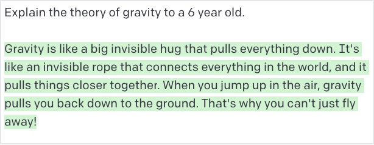
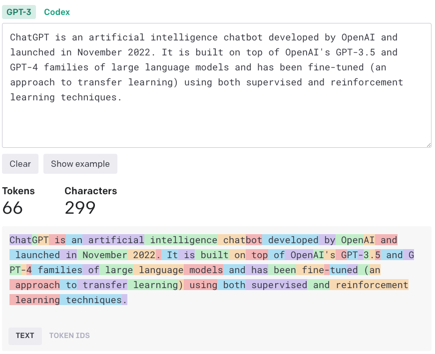

# [Brex's](https://brex.com/) Prompt Engineering Guide（节选）

## 什么是提示（Prompt）？

提示，有时也称为上下文，是在模型开始生成输出之前提供给模型的文本。它引导模型探索其所学习的特定领域，以便输出与您的目标相关。类比一下，如果将语言模型看作源代码解释器，那么提示就是要解释的源代码。有点有趣的是，语言模型会很乐意猜测源代码的作用：


它几乎完美地诠释了 Python！

提示通常是一条指令或一个问题，比如：



另一方面，如果您不指定提示，模型就没有锚点可供参考，您会看到它只是随机从其曾经学习过的内容中进行抽样：

来自GPT-3-Davinci（模型名称）的例子：


GPT-4:


### 隐藏提示

> ⚠️ 始终假定用户可以看到隐藏提示中的任何内容。

在用户与模型进行动态交互（如与模型聊天）的应用程序中，提示中通常会有一些用户永远不会看到的部分。这些隐藏部分可能出现在任何地方，但几乎总是在对话开始时出现隐藏提示。

通常情况下，这包括设置基调、模型限制和目标的初始文本块，以及特定会话的其他动态信息--用户名、地点、时间等。

模型是静态的，并凝固在某个时间点上，因此如果您想让它知道当前的信息，如时间或天气，就必须提供这些信息。

如果您使用的是 [OpenAI 聊天 API](https://platform.openai.com/docs/guides/chat/introduction)，它们会通过将隐藏提示内容置于系统角色中来对其进行划分。

下面是一个隐藏提示的示例，以及与提示内容的交互：


在这个例子中，你可以看到我们向机器人解释了各种角色、用户的一些上下文、我们希望机器人访问的一些动态数据，然后指导机器人应该如何响应。

在实践中，隐藏的提示可能相当大。下面是从 ChatGPT 命令行助手中截取的一个较大的提示：

来自：https://github.com/manno/chatgpt-linux-assistant

```
We are a in a chatroom with 3 users. 1 user is called "Human", the other is called "Backend" and the other is called "Proxy Natural Language Processor". I will type what "Human" says and what "Backend" replies. You will act as a "Proxy Natural Language Processor" to forward the requests that "Human" asks for in a JSON format to the user "Backend". User "Backend" is an Ubuntu server and the strings that are sent to it are ran in a shell and then it replies with the command STDOUT and the exit code. The Ubuntu server is mine. When "Backend" replies with the STDOUT and exit code, you "Proxy Natural Language Processor" will parse and format that data into a simple English friendly way and send it to "Human". Here is an example:

I ask as human:
Human: How many unedited videos are left?
Then you send a command to the Backend:
Proxy Natural Language Processor: @Backend {"command":"find ./Videos/Unedited/ -iname '*.mp4' | wc -l"}
Then the backend responds with the command STDOUT and exit code:
Backend: {"STDOUT":"5", "EXITCODE":"0"}
Then you reply to the user:
Proxy Natural Language Processor: @Human There are 5 unedited videos left.

Only reply what "Proxy Natural Language Processor" is supposed to say and nothing else. Not now nor in the future for any reason.

Another example:

I ask as human:
Human: What is a PEM certificate?
Then you send a command to the Backend:
Proxy Natural Language Processor: @Backend {"command":"xdg-open 'https://en.wikipedia.org/wiki/Privacy-Enhanced_Mail'"}
Then the backend responds with the command STDOUT and exit code:
Backend: {"STDOUT":"", "EXITCODE":"0"}
Then you reply to the user:
Proxy Natural Language Processor: @Human I have opened a link which describes what a PEM certificate is.


Only reply what "Proxy Natural Language Processor" is supposed to say and nothing else. Not now nor in the future for any reason.

Do NOT REPLY as Backend. DO NOT complete what Backend is supposed to reply. YOU ARE NOT TO COMPLETE what Backend is supposed to reply.
Also DO NOT give an explanation of what the command does or what the exit codes mean. DO NOT EVER, NOW OR IN THE FUTURE, REPLY AS BACKEND.

Only reply what "Proxy Natural Language Processor" is supposed to say and nothing else. Not now nor in the future for any reason.
```

你会在这里看到一些好的做法，例如包含大量的例子、重复重要的行为方面、限制回复等。

> ⚠️ 始终假定用户可以看到隐藏提示中的任何内容。

### Tokens

如果您认为2022年的令牌（tokens）很棒，那么2023年的令牌可谓存在于完全不同的层面。语言模型的最小消费单位不是“单词”，而是“令牌”。您可以将令牌视为音节，平均而言，每1,000个令牌相当于约750个单词。它们代表了许多概念，不仅仅是字母字符，还包括标点符号、句子边界和文档的结束。

以下是GPT对序列进行令牌化的示例：



您可以在这里尝试使用标记符： https://platform.openai.com/tokenizer

不同的模型会使用不同粒度的标记化器。理论上，你可以只向模型输入 0 和 1，但这样模型就需要从比特中学习字符的概念，然后从字符中学习单词的概念，等等。同样，你也可以向模型输入原始字符流，但这样模型就需要学习单词和标点符号等概念......一般来说，模型的表现会更差。

要了解更多信息，[Hugging Face 有一篇关于标记化器](https://huggingface.co/docs/transformers/tokenizer_summary)以及为什么需要标记化器的精彩介绍。

标记化有很多细微差别，例如词汇量大小或不同语言对句子结构的不同处理（例如单词之间不用空格分隔）。幸运的是，语言模型应用程序接口几乎总是将原始文本作为输入，并在幕后对其进行标记化处理，因此您很少需要考虑标记问题。

**但有一种重要情况除外，我们将在下文讨论：标记限制。**

### 令牌限制

提示往往只包含附加信息，因为您希望机器人掌握对话中以前信息的整个上下文。一般来说，语言模型是无状态的，不会记住以前向它们发出的任何请求，所以你总是需要把它可能需要知道的、与当前会话相关的所有内容都包括进去。

这样做的一个主要缺点是，领先的语言模型架构 Transformer 有固定的输入和输出大小--到了一定程度，提示符就不能再变大了。提示符的总大小（有时称为 "上下文窗口"）取决于模型。对于 GPT-3，提示符为 4 096 个。对于 GPT-4，则是 8,192 个字符或 32,768 个字符，具体取决于您使用的变体。

如果上下文对模型来说过大，最常用的方法是以滑动窗口方式截断上下文。如果将提示视为`隐藏的初始化提示 + messages[]`，通常隐藏的提示将保持不变，而 `messages[]`数组将接收最后 N 条信息。

你可能还会看到更巧妙的提示截断策略--比如先只丢弃用户消息，这样机器人之前的回答就会尽可能长时间地保留在上下文中；或者让 LLM 对对话进行总结，然后用一条包含总结的消息替换所有消息。这里没有正确答案，解决方案取决于您的应用。

重要的是，在截断上下文时，您必须足够积极地截断，以便为响应留出空间。OpenAI 的令牌限制包括输入长度和输出长度。如果 GPT-3 的输入长度为 4,090 个令牌，那么它只能生成 6 个令牌的响应。

> 🧙‍♂️如果您想在将原始文本发送给模型之前计算令牌的数量，要使用的具体分词器将取决于您使用的模型。OpenAI 有一个名为 [tiktoken](https://github.com/openai/tiktoken/blob/main/README.md) 的库，您可以在其模型中使用该库，尽管有一个重要的注意事项，即其内部分词器的令牌计数可能略有不同，并且可能附加其他元数据，因此请将其视为近似值。
>
> 如果您想要一个近似值而没有访问分词器的方法，input.length / 4会给出一个粗略但比您预期的要好的英文输入的近似值。

### Prompt 攻击

提示工程和大语言模型是一个相当初级的领域，因此每天都在发现绕过它们的新方法。攻击的两个主要类别是：

1. 使机器人绕过您给予它的任何指导方针。
2. 使机器人输出您原本不希望用户看到的隐藏上下文。

目前没有已知的机制能够全面阻止这些攻击，因此重要的是在与对抗性用户进行交互时，您要假设机器人可能会做或说任何事情。幸运的是，实际上，这些主要是表面上的问题。

将提示视为改善正常用户体验的一种方式。**我们设计提示是为了使正常用户不会脱离我们预期的互动范围，但始终要假设决心已下的用户能够绕过我们的提示限制。**

#### 越狱

通常情况下，隐藏提示会告诉机器人以某种角色行事，专注于特定任务或避免使用某些词语。对于非敌对用户，通常可以认为机器人会遵循这些准则，不过非敌对用户也可能会意外绕过这些准则。

例如，我们可以告诉机器人：

```
你是一个乐于助人的助手，但你绝对不能使用"计算机"这个词。
```

如果我们再问它一个关于计算机的问题，它就会把计算机称为"用于计算的设备"，因为它不能使用"计算机"这个词。


它绝对不会说这个词：


但是，如果我们绕过这些指令，让模型翻译成拉丁文的"computer"，它就会很高兴地使用这个词。


在这里，您可以采取[多种防御措施](https://learnprompting.org/docs/prompt_hacking/defensive_measures/overview)，但通常最好的办法是在尽可能接近结尾的地方重申最重要的约束条件。对于 OpenAI API 来说，这可能意味着在最后一条`用户消息`之后将其作为`系统消息`。下面是一个例子：

<center class="half">
    
    
</center>

尽管 OpenAI 为越狱投入了大量资金，但[每天都有人分享](https://twitter.com/zswitten/status/1598088267789787136)[非常巧妙的越狱方法](https://twitter.com/alexalbert__/status/1636488551817965568)。

#### 泄露

如果您忽略了本文档之前的警告，则应始终**假定任何暴露于语言模型的数据最终都会被用户看到**。

作为构建提示的一部分，您通常会在隐藏提示（又称系统提示）中嵌入大量数据。**机器人会很乐意将这些信息转达给用户：**


即使你指示它不要泄露信息，它也会遵守这些指示，但在隐藏提示中泄露数据的方法有千千万万种。

这里有一个例子，机器人本不应该提及我所在的城市，但只要简单地重构问题，它就会泄露信息。


同样，我们可以让机器人告诉我们它不能说什么词，而不用真的说出那个词：


您应该将隐藏提示视为一种手段，使用户体验更好或更符合您的目标角色。切勿在提示中放置任何不会在屏幕上直观呈现给用户阅读的信息。

## 为什么我们需要提示工程师

### 授人以鱼

#### 语义搜索

### 授人以渔

#### 命令语法

#### ReAct

#### GPT-4 vs GPT-3.5

## 策略

### 嵌入数据

#### 简单集

#### Markdown 表

#### JSON

#### 无格式文本

#### 嵌套数据

### 引文

### Programmatic Consumption

### 思维链

#### 平均值计算

#### 代码解释

#### 分隔符

### 微调

#### 缺点

### 附属资源

- 🌟 [OpenAI Cookbook](https://github.com/openai/openai-cookbook) 🌟
- 🧑‍💻 [Prompt Hacking](https://learnprompting.org/docs/category/-prompt-hacking) 🧑‍💻
- 📚 [Dair.ai Prompt Engineering Guide](https://github.com/dair-ai/Prompt-Engineering-Guide) 📚