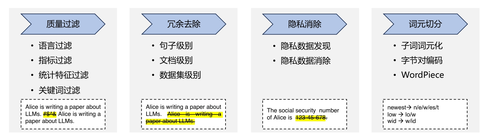

# 大语言模型：从理论到实践

## Transformer 模型

Transformer 架构是一种基于自注意力机制（self-attention）的深度学习模型，最初由 Vaswani 等人在 2017 年提出，并在其论文["Attention is All You Need"](https://arxiv.org/abs/1706.03762)中进行了详细描述。它在处理序列数据时避免了传统的循环神经网络（RNN）结构，而是采用了一种全新的架构。

Transformer 架构主要由两个部分组成：编码器（Encoder）和解码器（Decoder）。

1. 编码器（Encoder）：
   - 输入嵌入（Input Embedding）：将输入序列中的每个单词或标记转换为向量表示。
   - 位置编码（Positional Encoding）：为了捕捉输入序列中的位置信息，为每个输入位置提供一个位置编码，它包含了关于单词在序列中位置的信息。
   - 自注意力机制层（Self-Attention Layer）：自注意力机制允许模型在编码每个输入词时对其它输入词进行加权关注，从而捕捉到输入序列中的全局上下文信息。
   - 前馈神经网络层（Feed-Forward Neural Network Layer）：对自注意力机制的输出进行非线性变换和特征提取。
2. 解码器（Decoder）：
   - 目标嵌入（Target Embedding）：将目标序列的每个单词或标记转换为向量表示。
   - 位置编码（Positional Encoding）：与编码器相同，为了捕捉目标序列中的位置信息，为每个目标位置提供一个位置编码。
   - 自注意力机制层（Self-Attention Layer）：类似于编码器，解码器也使用自注意力机制来逐步生成目标序列，**每个位置的生成依赖于前面已经生成的部分。**
   - 编码器-解码器注意力机制层（Encoder-Decoder Attention Layer）：解码器通过编码器-解码器注意力机制来关注输入序列的不同位置以获取上下文信息。
   - 前馈神经网络层（Feed-Forward Neural Network Layer）：与编码器相同，对自注意力机制和编码器-解码器注意力机制的输出进行非线性变换和特征提取。
   - 输出层（Output Layer）：通过线性变换和 Softmax 函数将解码器的隐藏状态映射到目标序列的概率分布，从中选择最可能的单词作为当前位置的输出。

> 在编码器和解码器的结构中，主要涉及到四个模块：
>
> 1. 注意力层：使用多头注意力（Multi-Head Attention）机制整合上下文语义，它使得序列中任意两个单词之间的依赖关系可以直接被建模而不基于传统的循环结构，从而更好地解决文本的长程依赖。
> 2. 位置感知前馈层（Position-wise FFN）：通过全连接层对输入文本序列中的每个单词表示进行更复杂的变换。
> 3. 残差连接：对应图中的 Add 部分。它是一条分别作用在上述两个子层当中的直连通路，被用于连接它们的输入与输出。从而使得信息流动更加高效，有利于模型的优化。具体来说，在编码器和解码器的每个子层中，输入通过一个残差连接直接添加到该子层的输出上。这样可以保留原始输入的信息，并允许梯度更容易地反向传播。
> 4. 层化归一：对应图中的 Norm 部分。作用于上述两个子层的输出表示序列中，对表示序列进行层归一化操作，并对每个特征维度进行标准化。这种标准化操作有助于缓解梯度消失和梯度爆炸问题，并提高模型的训练稳定性。具体来说，对于每个子层的输入，层归一化通过减去均值、除以标准差，并使用可学习的参数进行缩放和平移。

Transformer 架构通过自注意力机制和前馈神经网络的组合，实现了对输入序列的编码和对输出序列的解码。它在自然语言处理任务中取得了很大的成功，并且已经成为该领域的重要基础模型。由于并行计算的能力，Transformer 架构还具备较高的计算效率。


图：基于transformer的编码器和解码器结构

从上图我们也可以了解到输入输出的工作流程：

- 输入
  - 输入序列编码：将输入序列中的每个单词或标记转换为向量表示。这可以通过使用嵌入层（Embedding Layer）来完成，其中每个单词被映射到一个实数向量。
  - 位置编码：为了捕捉输入序列中的位置信息，需要为每个输入位置提供一个位置编码。位置编码是一个与单词嵌入具有相同维度的向量，它包含了关于单词在序列中位置的信息。
  - 输入编码器：经过位置编码后，输入序列被送入多个编码器层。每个编码器层由自注意力机制（Self-Attention Mechanism）和前馈神经网络（Feed-Forward Neural Network Layer）组成。自注意力机制用于对输入序列中的单词进行加权关注，以获取全局上下文信息。前馈神经网络用于对加权后的信息进行非线性变换和特征提取。
- 输出
  - 解码器输入：解码器的输入是目标序列的前一个单词以及编码器的输出。类似于编码器输入，目标序列的单词也被嵌入为向量表示，并进行位置编码。
  - 解码器层：解码器由多个解码器层组成，每个解码器层包含自注意力机制、编码器-解码器注意力机制（用于关注输入序列的不同位置）和前馈神经网络。自注意力机制用于生成目标序列中的每个位置，编码器-解码器注意力机制用于关注输入序列的不同位置以获取上下文信息，前馈神经网络用于特征提取和非线性变换。
  - 输出层：解码器的最后一层通过线性变换和 Softmax 函数将解码器的隐藏状态映射到目标序列的概率分布。根据该概率分布，可以选择具有最高概率的单词作为当前位置的输出，并将其作为下一个解码器输入的一部分。

## 基于 HuggingFace 的预训练语言模型实践

- 安装 HuggingFace Transformer 库。

  ```
  pip install transformer
  ```

- 加载预训练语言模型（BEAT，GPT等）。

- 准备数据集，可以在 Dataset 库中下载常见的大规模数据集。

- 训练词元分析器（Tokenizer），通过分词技术（BERT 采用 WordPiece 分词）；根据训练语料中的词频决定是否将一个完整的词
  切分为多个词元。

- 预处理语料集合，将训练好的词元分析器进行处理，如文档长度超过一定数量，就会直接进行截断处理。

- 模型训练。

- 模型使用。

## LLaMA 模型

LLaMA 也是用的 Transformer 架构。与前面讲的 Transformer 架构不同的地方包括采用了**前置层归一化（Pre-normalization）**并使用 **RMSNorm归一化函数（NormalizingFunction）**、激活函数更换为 SwiGLU，并使用了**旋转位置嵌入（Rotary Positional Embeddings,RoP）**。整体 Transformer 架构与 GPT-2 类似：


图：GPT-2 模型架构

LLaMA 模型在之前的 Transformer 模型架构的基础上，对注意力机制进行了优化：

**稀疏注意力机制优化**：稀疏注意力机制可以分为基于位置和基于内容两类。

1. 基于位置的稀疏注意力机制：

   - **全局注意力（Global Attention）**：引入全局节点以增强模型对长距离依赖关系的建模能力。
   - **带状注意力（Band Attention）**：限制 Query 只与相邻的几个节点进行交互，利用数据的局部性。
   - **膨胀注意力（Dilated Attention）**：通过增加空隙来扩大感受野，类似于 CNN 中的 Dilated Conv。
   - **随机注意力（Random Attention）**：通过随机采样提升非局部的交互能力。
   - **局部块注意力（Block Local Attention）**：使用多个不重叠的块来限制信息交互。

2. 基于内容的稀疏注意力机制：

   根据输入数据来创建稀疏注意力，其中一种简单的方法是选择与给定查询具有高相似度的键。例如，Routing Transformer 使用 K-means 聚类方法对查询和键进行聚类，每个查询只与其所属簇中的键进行交互。

现有的稀疏注意力模型通常是上述基于位置的稀疏注意力机制的组合或者基于内容的稀疏注意力机制。其中一些典型的模型包括：

- Star-Transformer：使用带状注意力和全局注意力的组合，通过共享的全局注意力连接非相邻节点。
- Longformer：使用带状注意力和内部全局节点注意力的组合，并通过扩张窗口的注意力增加感受野。
- Extended Transformer Construction（ETC）：利用带状注意力和外部全局节点注意力的组合，还引入掩码机制处理结构化输入，并采用对比预测编码进行预训练。
- BigBird：使用带状和全局注意力，以及额外的随机注意力来近似全连接注意力。同时，它还揭示了稀疏编码器和稀疏解码器的使用可以模拟任何图灵机。

**FlashAttention 算法优化**：

除此 LLaMA 还利用了 GPU 硬件的特殊设计，用 **FlashAttention 算法**通过减少全局内存的访问量来提高计算效率，并避免了中间注意力矩阵的存储。这些显存类型和算法的选择对于 GPU 计算的速度、大小和访问限制都起着重要的作用。

> NVIDIA GPU 中的显存分为全局内存（Global memory）、本地内存（Local memory）、共享内存（Shared memory）、寄存器内存（Register memory）、常量内存（Constant memory）和纹理内存（Texture memory）六大类。
>
> 全局内存和本地内存位于板卡 RAM 存储芯片上，具有读写能力。全局内存是所有线程都可以访问的，而本地内存只能由当前线程访问。全局内存和本地内存使用的是高带宽显存（HBM），容量较大。然而，全局内存的带宽虽然较高，但当所有线程同时访问时，平均带宽仍然较低。
>
> 共享内存和寄存器内存位于 GPU 芯片上，容量较小。共享内存只能在**同一个 GPU 线程块**内的线程之间共享访问，而寄存器内存仅限于**同一个线程内部访问**。共享内存的容量较小但速度非常快，远高于全局内存的访问速度。
>
> 常量内存用于存储在运行时保持不变的常量数据，可以在全局内存和纹理内存之间进行选择。纹理内存用于存储纹理数据，通常用于图像处理等任务。
>
> 在自注意力机制中，传统的计算方法需要引入两个中间矩阵 S 和 P，并将它们存储到全局内存中。这样的计算过程会占用大量的显存带宽并成为计算效率的瓶颈。为了避免从全局内存中读取和写入注意力矩阵，FlashAttention 算法利用 GPU 硬件的特殊设计，通过在块内逐步计算 Softmax 函数来减少全局内存的访问量。**FlashAttention 算法没有将中间注意力矩阵 S 和 P 整体写入全局内存，而是通过分块写入和存储归一化因子的方式，在后向传播中快速重新计算片上注意力，从而提高了运行速度并减少了内存使用。**
>
> NVIDIA GPU 内存架构图：
>
> 

## 模型训练数据

### 数据来源

大模型训练数据，必须要有可靠的数据来源。

大语言模型训练所需的数据来源大体上可以分为通用数据和专业数据两大类。

- **通用数据 （General Data）**：包括网页、图书、新闻、对话文本等内容。通用数据具有规模大、多样性和易获取等特点，因此可以支持大语言模型的构建语言建模和泛化能力。
- **专业数据（Specialized Data）**：包括多语言数据、科学数据、代码以及领域特有资料等数据。通过在预训练阶段引入专业数据可以有效提供大语言模型的任务解决能力。

### 数据处理

数据质量对于模型的影响非常大。因此在收集到各类型数据之后，需要对数据进行处理，去除低质量数据、重复数据、有害信息、个人隐私等内容。

典型的数据处理过程如图所示，主要包含**质量过滤**、**冗余去除**、**隐私消除**、**词元切分**等几个步骤。



**质量过滤**：过滤低质量数据的两种方法：基于分类器的方法和基于启发式的方法。

- **基于分类器**的方法通过训练文本质量判断模型，使用一组精选文本进行训练。这些分类器会对给定的网页或文本进行评分，以确定其内容质量。通过使用这些分类器，可以对数据集进行评估并选择合适的阈值来过滤低质量数据。然而，基于分类器的方法可能会删除包含方言或口语的高质量文本，从而损失一定的多样性。
- **基于启发式**的方法则使用一组设计精良的规则来消除低质量文本。这些规则包括语言过滤、指标过滤、统计特征过滤和关键词过滤。语言过滤可以根据语言模型的关注范围来过滤掉其他语言的文本。指标过滤可以利用评测指标如困惑度（Perplexity）来过滤非自然的句子。统计特征过滤可以通过计算标点符号分布、符号字比（Symbol-to-WordRatio）和句子长度等统计特征来过滤低质量数据。关键词过滤根据特定的关键词集识别和删除文本中的噪声或无用元素。

**冗余去除**：重复数据会降低模型的多样性并可能导致训练过程不稳定，影响模型性能，所以需要进行数据去重。一般是通过各种比对算法来检测相似度来对内容进行去重。如常用的方法是通过计算表面特征相似度（如 n-gram 重叠比例）来检测并删除重复文档。将文档拆分为段落，对每个段落进行规范化处理，并计算段落的哈希码，利用哈希码进行重复判断。

**隐私消除**：在训练数据时如果涉及到用户数据的隐私则需要消除，实现方式一般是采用基于规则的算法。

**词元切分**：传统方法使用预先确定的词表，并使用特殊符号"[UNK]"表示未知词。词表的选择对模型性能有影响，过小的词表会增加未登录词比例，影响性能；过大的词表会导致数据稀疏问题。为了解决未登录词问题，一种方法是使用字符级别的表示，但难以学习跨度较大的构词模式。为此，提出了**子词词元化方法，维护一个词元词表，将单词拆分为词元，并为每个词元计算向量表示**。这样可以较好地处理未登录词的问题。词元分析是将文本切分成词元序列的过程，其中字节对编码（BPE）是一种常用的子词词元模型，通过统计字节对的出现频率并合并高频字节对来构建词元词表。

BPE 词元切分的过程图如下：


> BPE（Byte Pair Encoding）是一种常用的词元分析算法，用于将词序列切分成词元序列。它先确定词元词表，然后按照从长到短的顺序遍历词表中的词元，将词序列中的全词或未完全切分的部分与词元进行匹配，并将其切分为词元和剩余部分的序列。这样，BPE努力将词序列切分成已知的词元。
>
> BART 和 LLaMA 采用了字节级 BPE 作为分词方法。
>
> 除了字节集 BPE 次元分析算法，还有 WordPiece、Unigram 算法。
>
> WordPiece 是一种类似于 BPE 的算法，它使用语言模型对所有可能的词元对进行评分，并选择使得训练数据似然概率增加最多的词元对进行合并
>
> Unigram 词元分析则从一个大的词元集合开始，迭代地删除词元，直到达到预期的词汇表大小为止。Unigram 使用期望最大化（EM）算法来估计词元的概率，并通过动态规划算法找到最佳的词元切分方式。

### 数据分析

影响数据分析主要是三个方面：数据规模、数据质量、数据多样性。

## 分布式训练

随着语言模型参数量和所需训练数据量的急速增长，单个机器上有限的资源已无法满足需要。这时候就需要设计**分布式训练（Distributed Training）**系统来解决海量的计算和内存资源要求问题。

在分布式训练系统环境下需要将一个模型训练任务拆分成多个子任务，并将子任务分发给多个计算设备，从而解决资源瓶颈。这里面涉及到如**集群架构**、**并行策略**、**模型架构**、**内存优化**、**计算优化**等一系列的技术。

**分布式训练 （Distributed Training）是指将机器学习或深度学习模型训练任务分解成多个子任务，并在多个计算设备上并行地进行训练。**

上面提到的计算设备包括**中央处理器（Central Processing Unit，CPU）**、**图形处理器（Graphics ProcessingUnit，GPU）**、**张量处理器（Tensor Processing Unit，TPU）**以及**神经网络处理器（Neural networkProcessing Unit，NPU）**等。

虽然分布式训练/计算能带来巨大的好处，但同样需要克服一些困难：

- **计算墙**：单个计算设备所能提供的计算能力与大语言模型所需的总计算量之间存在巨大差异。2022 年 3 年发布的 NVIDIA H100 SXM 的单卡 FP16 算力也只有 2000 TFLOPs，而 GPT-3则需要 314 ZFLOPs 的总算力，两者相差了 8 个数量级。

  > TFLOPs 和 ZFLOPs 是衡量计算机系统或处理器在处理浮点数（包括单精度和双精度浮点数）计算方面的能力的常用度量单位。它们代表**每秒浮点运算的数量**。
  >
  > 1. TFLOPs：TFLOPs是“每秒一万亿次浮点运算”（Trillion Floating Point Operations Per Second）的缩写。1 TFLOP等于每秒执行一万亿次浮点运算。
  > 2. ZFLOPs：ZFLOPs是“每秒一千万亿次浮点运算”（Zetta Floating Point Operations Per Second）的缩写。1 ZFLOP等于每秒执行一千万亿次浮点运算。

- **显存墙**：单个计算设备无法完整存储一个大语言模型的参数。GPT-3 包含 1750 亿参数，如果采用 FP16 格式进行存储，需要 700GB（1750 * 4 byte） 的计算设备内存空间，而 NVIDIA H100 GPU 只有 80 GB 显存

- **通信墙**：分布式训练系统中各计算设备之间需要频繁地进行**参数传输和同步**。由于通信的延迟和带宽限制，这可能成为训练过程的瓶颈。GPT-3 训练过程中，如果分布式系统中存在 128 个模型副本，那么在每次迭代过程中至少需要传输 89.6TB 的梯度数据。而截止 2023 年 8 月，单个 InfiniBand 链路仅能够提供不超过 800Gb/s 带宽。

### 分布式训练并行策略

首先我们来看下单设备模型以及分布式训练系统的训练过程图


图：单设备模型训练系统


图：两节点数据并行训练系统

针对大语言模型多层神经网络的执行过程，可以由一个计算图（Computational Graph）表示。这个图有多个相互连接的算子（Operator），每个算子实现一个神经网络层（Neural Network Layer），而参数则代表了这个层在训练中所更新的的权重。

一个计算图的执行过程可以分为前向计算和反向计算两个阶段。

- **前向计算**：是将数据读入第一个算子，计算出相应的输出结构，然后依此重复这个前向计算过程，直到最后一个算子结束。
- **反向计算**：是根据优化函数和损失，每个算子依次计算出梯度，并利用梯度更新本地的参数。在反向计算结束后，该数据小批次的计算完成，系统就会读取下一个数据小批次，继续下一轮的模型参数更新。

如果要进行分布式训练，那么可以从数据和模型两个维度进行切分。

### 数据并行

数据并行是对数据进行切分（Partition），并将同一个模型复制到多个设备上，并行执行不同的数据分片。

对训练样本进行数据**拆分**，每个计算设备都会根据本地样本计算损失误差得到梯度Gi（i 为加速卡编号），并将本地梯度 Gi 进行广播。所有计算设备需要**聚合**其他加速度卡给出的梯度值，然后使用平均梯度公式对模型进行更新，完成该批次训练。

数据并行可以通过增加计算设备，有效提升整体训练吞吐量；但要求每个设备上都备份一份模型，显存占用比较高。

### 模型并行

模型并行（Model Parallelism）是将模型中的算子分发到多个设备分别完成。往往用于解决单节点内存不足的问题。以包含 1750 亿参数的
GPT-3 模型为例，如果模型中每一个参数都使用 32 位浮点数表示，那么模型需要占用 700GB（即175G× 4 Bytes）内存。以2022 年 3 月 NVIDIA 发布的 H100 加速卡也仅支持 80GB 显存，无法将整个模型完整放入其中。

模型切分又分为两种形式：

1）按模型的层切分到不同设备，即层间并行或算子间并行（Inter-operator Parallelism），也称之为**流水线并行（Pipeline Parallelism，PP）**；

2）将计算图层内的参数切分到不同设备，即层内并行或算子内并行（Intra-operator Parallelism），也称之为**张量并行（Tensor Parallelism，TP）**。

#### 流水线并行

**流水线并行**将模型的各个层分段处理，并将每个段分布在不同的计算设备上，使得前后阶段能够流水式、分批进行工作。然而，传统的流水线并行策略会导致计算设备的平均使用率降低，形成了模型并行气泡（Model Parallelism Bubble）或流水线气泡（Pipeline Bubble）。


图：普通流水线并行

为了减少并行气泡，提高计算效率，提出了一些改进策略。其中，GPipe 方法将小批次进一步划分为微批次，并利用流水线并行方案，每次处理一个微批次的数据。这样可以在一定程度上减少并行气泡。然而，GPipe 仍然会产生并行气泡，因为只有一个 Mini-batch 中所有的前向计算完成后，才能开始执行后向计算。


图：GPipe 策略流水线并行

为了进一步提高计算效率，提出了1F1B流水线策略，即一个前向通道和一个后向通道。1F1B引入了任务调度机制，使得下游设备能够在等待上游计算的同时执行其他可并行的任务，从而提高设备的利用率。1F1B有非交错式和交错式两种调度模式。

在**非交错式调度模式**中，计算设备按顺序执行一次前向计算，然后进行一次后向计算，直到完成最后一次后向计算。这种模式在节省内存方面表现更好，但需要与GPipe一样的时间来完成一轮计算。

在**交错式调度模式**中，每个设备可以处理流水线中多个阶段的子集任务。每个设备在流水线中被分配到多个阶段，从而更好地利用流水线并行的优势。这种模式不仅在内存消耗方面表现出色，还能够提高计算效率，使得大型模型的并行系统能够更高效地完成计算任务。


图：1F1B 流水线并行策略

#### 张量并行

张量并行是将大型张量分割成小块，在多个计算设备上并行地处理这些小块，并将它们的计算结果合并以加快处理速度。这种并行计算策略可以提高大规模数据集或模型的处理效率。

我们可以将张量看作是一个多维数组或矩阵的扩展。张量是一种常见的数据结构，用于存储和处理大量的数据。

### 混合并行

同时要对数据和模型进行切分。

### 计算设备内存优化

当前大语言模型训练通常采用 Adam 优化算法，除了需要每个参数梯度之外，还需要一阶动量（Momentum）和二阶动量（Variance）。该算法对计算设备内存的占用增大。为了降低内存占用，大多数系统已经采用了混合精度训练（Mixed Precision Training）来优化。即同时存在 FP16 （16 位浮点数）或者 BF16 （Bfloat16）和 FP32（32 位浮点数）两种格式的数值，但这会带来梯度消失和模型不稳定的问题，这时候会用到**动态损失缩放 （Dynamic Loss Scaling）**和**混合精度优化器（Mixed Precision Optimizer）**等优化手段。

> 一阶动量表示参数的一阶导数或梯度。一阶动量告诉我们当前参数的变化方向是朝着梯度的方向还是相反方向。如果一阶动量的值很大，说明参数变化很快，而如果一阶动量的值很小，说明参数变化较慢。
>
> 二阶动量则是参数的二阶导数或梯度的平方。你可以将其理解为参数更新的速率或步长。二阶动量告诉我们参数更新的幅度大小，即参数每次更新的幅度是多少。如果二阶动量的值很大，说明参数更新的幅度较大，而如果二阶动量的值很小，说明参数更新的幅度较小。
>
> 参数变化的快慢在机器学习和优化算法中具有重要的意义：
>
> 1. 收敛速度：参数变化的快慢可以影响模型的收敛速度。如果参数更新得太慢，模型可能需要更多的迭代才能收敛到最优解。相反，如果参数更新得太快，可能会导致模型在最优解附近来回震荡而无法稳定下来。因此，控制参数变化的速度可以帮助模型更快地收敛到最优解。
> 2. 避免过拟合：快速的参数变化可以帮助模型避免过拟合。过拟合是指模型在训练数据上表现很好，但在新数据上表现较差的情况。通过使用适当的参数变化速度，可以防止模型在训练数据上过度拟合，使其更具有泛化能力。
> 3. 稳定性：参数变化的快慢也与模型的稳定性相关。如果参数变化过大或不稳定，模型可能会变得不稳定，导致输出结果的波动或不一致性。通过控制参数变化的速度，可以增加模型的稳定性，使其在不同的输入上产生一致的输出结果。
> 4. 局部最优解：参数变化的速度可以影响模型是否陷入局部最优解。如果参数变化过慢，可能会使得模型陷入局部最优解而无法找到全局最优解。通过适当的参数变化速度，可以增加模型跳出局部最优解的机会，更好地探索参数空间。

除去参数模型所占内存之外，还有剩余状态（Residual States），包括激活值（Activation）、各种临时缓冲区（Buffer）以及无法使用的显存碎片（Fragmentation）等。


图：混合精度优化过程

#### 零冗余优化器（Zero Redundancy Data Parallelism，ZeRO）

冗余优化器目标就是针对模型状态的存储进行去除冗余的优化。ZeRO 使用分区的方法，即将模型状态量分割成多个分区，每个计算设备只
保存其中的一部分。这样整个训练系统内只需要维护一份模型状态，减少了内存消耗和通信开销。ZeRO包括三种分区方法：

1. ZeRO-1：**对 Adam 优化器状态进行分区**。模型参数和梯度仍然在每个计算设备上保存一份，但Adam状态被分割成多个分区。每个计算设备所需的内存减少为原来的1/4左右，即约为原来内存消耗的四分之一。
2. ZeRO-2：**对模型梯度进行分区**。模型参数仍然在每个计算设备上保存一份，但是梯度被分割成多个分区。每个计算设备所需的内存减少为原来的1/8左右，即约为原来内存消耗的八分之一。
3. ZeRO-3：**对模型参数进行分区**。模型参数被分割成多个分区，并且每个计算设备只保存其中的一部分参数。每个计算设备所需的内存消耗趋向于零，特别适用于大规模计算设备的训练，因为每个设备只需维护部分参数。


图：ZeRO 零冗余优化器

### 分布式训练的集群架构

主要有两种常见架构：**参数服务器架构（Parameter Server，PS）**和**去中心化架构（Decentralized Network）。**

> 分布式集群架构往往设备之间的通讯成为了性能瓶颈，但绝大多数都是靠硬件加速技术来避免，如 NVIDIA H100 采用高带宽内存（High-Bandwidth Memory，HBM）可以提供 3350GB/s 的带宽。NVIDIA HGX H100 8 GPU 服务器，采用了 NVLink 和 NVSwitch（NVLink 交换机）技术。
>
> NVLink 是一种高速、低延迟的专有接口技术，由 NVIDIA开发，用于连接多个图形处理器（GPU）之间或GPU与主机之间的通信。
>
> NVSwitch 用于连接多个GPU（图形处理单元）的专用交换机，旨在提供高带宽、低延迟和可扩展性，以支持大规模并行计算和通信。

#### 参数服务器架构


训练过程又分为同步训练和异步训练。

#### 去中心化架构

去中心化架构中，没有中央服务器或控制节点，而是由节点之间进行直接通信和协调。好处是减少通信瓶颈，提高系统的可扩展性。

训练过程中，节点之间需要周期性地交换参数更新和梯度信息。可以通过**集合通信（Collective communication，CC）**技术来实现，常用通信原语包括 Broadcast、Scatter、Reduce、All-Reduce、Gather、All-Gather、Reduce-Scatter、All-to-All 等。

