# 模型上下文协议

MCP 是一种开放式协议，它规范了应用程序向 LLM 提供上下文的方式。把 MCP 想象成人工智能应用的 USB-C 端口。正如 USB-C 提供了将设备连接到各种外设和配件的标准化方式一样，MCP 也提供了将人工智能模型连接到不同数据源和工具的标准化方式。

## 核心组件

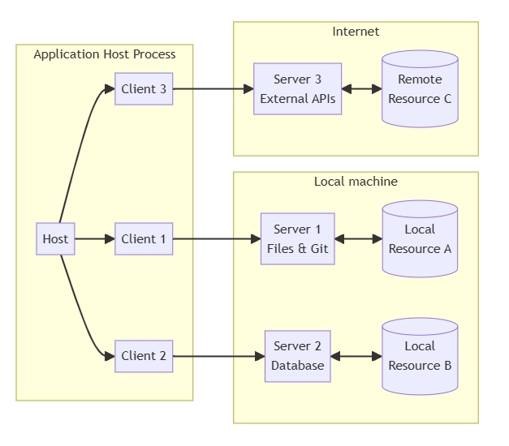

### 主机（Host）

主机进程充当容器和协调器：

- 创建和管理多个客户端实例
- 控制客户端连接权限和生命周期
- 执行安全策略和同意要求
- 处理用户授权决策
- 协调人工智能/LLM 集成和采样
- 管理跨客户端的上下文聚合

### 客户端（Clients）

每个客户端都由主机创建，并维护一个隔离的服务器连接：

- 为每个服务器建立一个有状态会话
- 处理协议协商和能力交换
- 双向路由协议消息
- 管理订阅和通知
- 维护服务器之间的安全边界

主机应用程序创建并管理多个客户端，每个客户端与特定服务器的关系为 1:1。

### 服务器（Servers）

服务器提供专门的环境和功能：

- 通过 MCP 基元公开资源、工具和 prompt
- 独立运行，职责集中
- 通过客户端接口请求采样
- 必须遵守安全限制
- 可以是本地进程或远程服务

## 设计原则

MCP 基于几个关键的设计原则构建，这些原则为其架构和实施提供了依据：

1. 服务器应该非常容易构建
   - 主机应用程序处理复杂的协调责任
   - 服务器专注于特定的、定义明确的功能
   - 简单的接口可最大限度地减少实施开销
   - 清晰的分离可实现代码的可维护性
2. 服务器应该具有高度的可组合性
   - 每台服务器都可单独提供重点功能
   - 多台服务器可无缝组合
   - 共享协议可实现互操作性
   - 模块化设计支持可扩展性
3. 服务器不能够读取整个对话、 也不能 “看到”其他服务器
   - 服务器只接收必要的上下文信息
   - 完整的对话历史保留在主机中
   - 每个服务器连接都保持隔离
   - 跨服务器交互由主机控制
   - 主机进程强制执行安全边界
4. 功能可逐步添加到服务器和客户端
   - 核心协议提供所需的最小功能
   - 可根据需要协商附加功能
   - 服务器和客户端独立发展
   - 协议设计用于未来可扩展性
   - 保持向后兼容性

## 消息类型

MCP 基于 [JSON-RPC 2.0](https://www.jsonrpc.org/specification) 定义了三种核心消息内容：

- **Requests（请求）**：带有方法和参数的双向信息，期望得到响应
- **Responses（响应）**：成功结果或与特定请求 ID 匹配的错误结果
- **Notifications（通知）**： 单向消息不需要任何响应

每种消息类型的结构和传送语义都遵循 JSON-RPC 2.0 规范。

## 能力协商

模式上下文协议使用基于能力的协商系统，客户端与服务端在初始化阶段需明确声明各自支持的功能特性。这些能力声明将决定会话期间可用的协议功能及基础操作。

- 服务器声明的功能包括资源订阅、工具集成和prompt 模板
- 客户端声明的功能包括采样支持和通知处理
- 在整个会话期间，双方都必须尊重所声明的功能
- 如需扩展功能支持，可通过协议扩展机制进行协商补充。

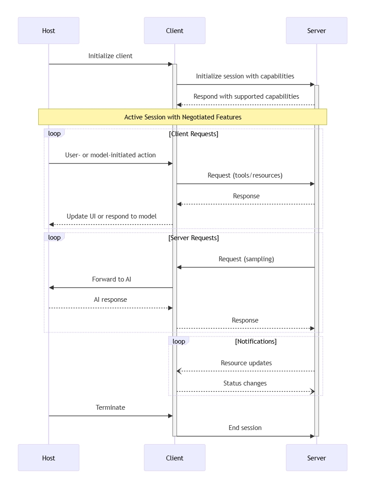

每种功能都会在会话期间解锁特定的协议功能。例如：

- 实施的[服务器功能](#服务器)必须在服务器的功能中公布
- 发送资源订阅通知要求服务器声明订阅支持
- 工具调用要求服务器声明工具功能
- [采样](#客户端)要求客户端在其功能中声明支持

这种功能协商确保客户端和服务器清楚了解支持的功能，同时保持协议的可扩展性。

## 基本协议

MCP 客户端和服务器之间的所有信息都必须遵循 [JSON-RPC 2.0](https://www.jsonrpc.org/specification) 规范。该协议定义了三种基本消息类型：

| 类型 | 描述                   | 要求                       |
| ---- | ---------------------- | -------------------------- |
| 请求 | 为启动操作而发送的消息 | 必须包含唯一 ID 和方法名称 |
| 响应 | 为回复请求而发送的消息 | 必须包含与请求相同的 ID    |
| 通知 | 无回复的单向消息       | 必须不包含 ID              |

响应又可细分为成功或错误。结果可以遵循任何 JSON 对象结构，而错误至少必须包括错误代码和信息。

### 协议层

模型上下文协议由几个共同工作的关键组件组成： 

- 基本协议：核心 JSON-RPC 消息类型 
- 生命周期管理：连接初始化、能力协商和会话控制
- 服务器功能：服务器提供的资源、提示和工具 
- 客户端功能：客户端提供的采样和根目录列表 
- 公用功能：日志记录和参数补全等跨领域问题

所有实施都必须支持基本协议和生命周期管理组件。其他组件可根据应用的具体需求实施。

这些协议层在实现客户端与服务器之间丰富交互的同时，还建立了清晰的分隔关系。模块化设计允许实施方案准确支持所需的功能。

有关不同组件的更多详情，请参阅以下页面：

- [生命周期](#生命周期)
- [资源](#资源)
- [Prompts](#Prompts)
- [工具](#工具)
- [日志](#日志)
- [采样](#采样)

### 权限

认证和授权目前不属于MCP 规范的核心部分，但我们正在考虑未来如何引入它们。欢迎加入 [GitHub Discussions](https://github.com/modelcontextprotocol/specification/discussions)，与我们一起塑造该协议的未来！

客户端和服务器**可以（MAY）**自行协商自定义的认证和授权策略。

### **模式（Schema）**

协议的完整规范以[TypeScript 模式（schema）](http://github.com/modelcontextprotocol/specification/tree/main/schema/2024-11-05/schema.ts)进行定义。这是所有协议消息和结构的**唯一可信来源（source of truth）**。

此外，还提供了一个 [JSON Schema](http://github.com/modelcontextprotocol/specification/tree/main/schema/2024-11-05/schema.json)，它是从 TypeScript 源文件自动生成的，可用于各种自动化工具。

### 消息

所有 MCP 消息**必须（MUST）**遵循 [JSON-RPC 2.0 规范](https://www.jsonrpc.org/specification)。协议定义了三种消息类型：

#### 请求（Requests）

请求可以由客户端发送到服务器，或由服务器发送到客户端。

```json
{
  "jsonrpc": "2.0",
  "id": "string | number",
  "method": "string",
  "params": {
    "key": "unknown"
  }
}
```

- 请求**必须**包含 ID，ID 可以是字符串或整数。
- 不同于 JSON-RPC 基础规范，ID 不能为 `null`。
- 请求 ID 在同一会话中不能重复使用。

#### 响应（Responses）

响应用于回复请求。

```json
{
  "jsonrpc": "2.0",
  "id": "string | number",
  "result": {
    "key": "unknown"
  },
  "error": {
    "code": "number",
    "message": "string",
    "data": "unknown"
  }
}
```

- 响应必须包含与请求相同的 ID。
- 必须包含 `result` 或 `error`，但不能同时包含两者。
- 错误代码必须是整数。

#### 通知（Notifications）

通知可以由客户端发送到服务器，或由服务器发送到客户端，并且不期望得到响应。

```json
{
  "jsonrpc": "2.0",
  "method": "string",
  "params": {
    "key": "unknown"
  }
}
```

- 通知不能包含 ID。

### 生命周期

模型上下文协议 (MCP) 为客户端-服务器连接定义了严格的生命周期，以确保适当的能力协商和状态管理。

1. **初始化**： 能力协商和协议版本协议
2. **运行**：正常协议通信
3. **关闭**：优雅地终止连接

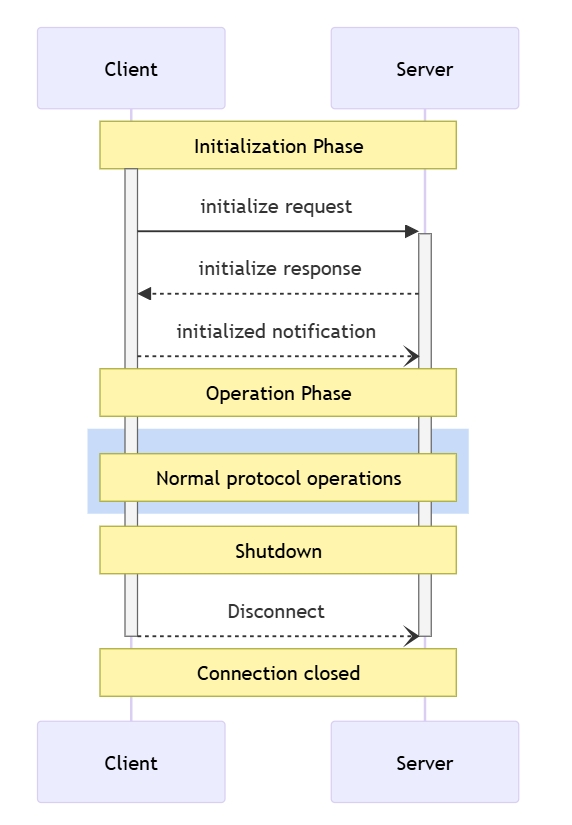

#### 生命周期阶段

##### **初始化**

初始化阶段必须是客户端与服务器之间的首次交互。在此阶段，客户端和服务器将：

- 建立协议版本兼容性
- 交换和协商能力
- 共享实现细节

客户端必须通过发送包含以下内容的初始化请求来启动该阶段：

- 支持的协议版本
- 客户端能力
- 客户端实施信息

```json
{
  "jsonrpc": "2.0",
  "id": 1,
  "method": "initialize",
  "params": {
    "protocolVersion": "2024-11-05",
    "capabilities": {
      "roots": {
        "listChanged": true
      },
      "sampling": {}
    },
    "clientInfo": {
      "name": "ExampleClient",
      "version": "1.0.0"
    }
  }
}
```

服务器必须用自己的能力和信息做出响应：

```json
{
  "jsonrpc": "2.0",
  "id": 1,
  "result": {
    "protocolVersion": "2024-11-05",
    "capabilities": {
      "logging": {},
      "prompts": {
        "listChanged": true
      },
      "resources": {
        "subscribe": true,
        "listChanged": true
      },
      "tools": {
        "listChanged": true
      }
    },
    "serverInfo": {
      "name": "ExampleServer",
      "version": "1.0.0"
    }
  }
}
```

初始化成功后，客户端必须发送初始化通知，以表明它已准备好开始正常操作：

```json
{
  "jsonrpc": "2.0",
  "method": "notifications/initialized"
}
```

- 在服务器响应 `initialize` 请求之前，客户端不应发送 [pings](#ping) 以外的请求。
- 服务器在收到 `initialize` 通知之前，不应发送除 [ping](#ping) 和[日志记录](#日志)之外的其他请求。

###### 版本协商

在初始化请求中，客户端**必须**发送其支持的协议版本，并且**应当**发送其支持的最新版本。

如果服务器支持客户端请求的协议版本，则**必须**返回相同的版本。否则，服务器**必须**返回其支持的另一个协议版本，并且**应当**选择其支持的最新版本。

如果客户端不支持服务器返回的协议版本，则**应当**断开连接。

###### 能力协商

客户端和服务器的能力（capabilities）确定了在会话期间可用的可选协议功能。

关键能力包括：

| **类别**   | **能力**     | **描述**                     |
| ---------- | ------------ | ---------------------------- |
| **客户端** | roots        | 能够提供文件系统根目录       |
| **客户端** | sampling     | 支持 LLM 采样请求            |
| **客户端** | experimental | 描述对非标准实验性功能的支持 |
| **服务器** | prompts      | 提供提示模板                 |
| **服务器** | resources    | 提供可读取的资源             |
| **服务器** | tools        | 暴露可调用的工具             |
| **服务器** | logging      | 发送结构化日志消息           |
| **服务器** | experimental | 描述对非标准实验性功能的支持 |

能力对象还可以描述子能力（sub-capabilities），例如：

- `listChanged`：支持列表更改通知（适用于 `prompts`、`resources` 和 `tools`）。
- `subscribe`：支持订阅单个项目的更改（仅适用于 `resources`）。

##### **操作（Operation）**

在操作阶段，客户端和服务器根据协商的能力（capabilities）交换消息。

双方应当（SHOULD）：

- 遵守协商的协议版本。
- 仅使用成功协商的能力。

##### **关闭（Shutdown）**

在关闭阶段，一方（通常是客户端）会正常终止协议连接。协议没有定义特定的关闭消息，而是使用底层传输机制来指示连接终止：

###### stdio 传输

对于 `stdio` [传输](#传输)，客户端**应当（SHOULD）**按以下步骤关闭连接：

1. 首先，关闭子进程（服务器）的输入流。
2. **等待服务器退出**，如果服务器在合理时间内没有退出，则发送 `SIGTERM` 信号。
3. 如果服务器在 `SIGTERM` 之后仍未退出，则发送 `SIGKILL` 信号强制终止。

服务器**可以（MAY）**通过**关闭输出流**并退出进程来主动发起关闭。

###### **HTTP 传输**

对于 `HTTP` [传输](#传输)，关闭方式是**关闭相关的 HTTP 连接**。

#### 错误处理（Error Handling）

实现（implementations）应当**准备好处理以下错误情况**：

- **协议版本不匹配**（Protocol version mismatch）。
- **未能协商所需能力**（Failure to negotiate required capabilities）。
- **初始化请求超时**（Initialize request timeout）。
- **关闭超时**（Shutdown timeout）。

此外，所有请求都应当设置适当的超时机制，以防止连接挂起和资源耗尽。

示例：初始化错误（Example initialization error）

```json
{
  "jsonrpc": "2.0",
  "id": 1,
  "error": {
    "code": -32602,
    "message": "Unsupported protocol version",
    "data": {
      "supported": ["2024-11-05"],
      "requested": "1.0.0"
    }
  }
}
```

###  传输

MCP 目前定义了两种标准传输机制进行客户端-服务器通信：

1. [stdio](#stdio) —— 通过标准输入（stdin）和标准输出（stdout）进行通信。
2. [HTTP + Server-Sent Events (SSE)](#HTTP SSE) —— 通过 HTTP 及服务器推送事件（SSE）进行通信。

客户端应当（SHOULD）在可能的情况下支持 `stdio` 传输方式。

此外，客户端和服务器也可以以插件化的方式（pluggable fashion） 实现[自定义传输](#自定义传输)机制。

#### stdio

在 `stdio` 传输模式下：

- 客户端启动 MCP 服务器作为子进程。
- 服务器从标准输入（stdin）接收 JSON-RPC 消息，并将响应写入标准输出（stdout）。
- 消息以换行符（newline）分隔，并且**消息内部不能包含换行符**。
- 服务器可以将 UTF-8 日志消息写入标准错误（stderr），客户端可以选择捕获、转发或忽略这些日志。
- 服务器不能在 stdout 输出任何非 MCP 消息的数据。
- 客户端不能在 stdin 发送任何非 MCP 消息的数据。

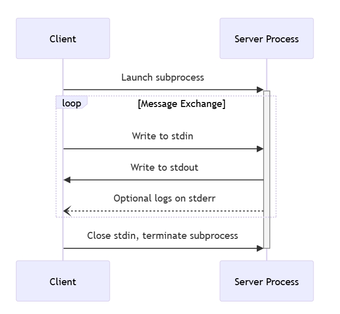

#### HTTP SSE

在**SSE（服务器推送事件）**传输模式下，服务器作为独立进程运行，并能够处理多个客户端连接。

服务器必须提供两个端点（endpoints）：

1. **SSE 端点** —— 供客户端建立连接并接收来自服务器的消息。
2. **HTTP POST 端点** —— 供客户端发送消息到服务器。

当客户端连接到服务器时，服务器必须发送一个 `endpoint` 事件，其中包含一个 URI，客户端应使用该 URI 发送消息。所有后续的客户端消息必须通过 HTTP POST 请求发送到该端点。

服务器的消息会以 SSE `message` 事件的形式发送，消息内容以JSON 格式编码，并存放在事件数据（event data）中。

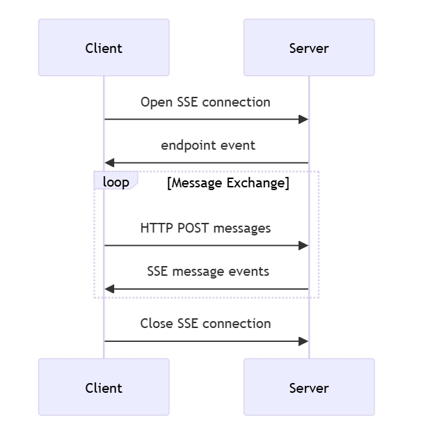

#### 自定义传输

客户端和服务器可根据自己的具体需要，实施额外的自定义传输机制。该协议与传输无关，可在任何支持双向消息交换的通信通道上实施。

选择支持自定义传输的实现者必须确保它们保留了 MCP 定义的 JSON-RPC 消息格式和生命周期要求。自定义传输应记录其特定的连接建立和消息交换模式，以帮助实现互操作性。

### 版本

模型上下文协议使用基于字符串的版本标识符，格式为 `YYYY-MM-DD`，以表示向后不兼容更改的最后日期。

> 在协议更新时，只要变更能保持向后兼容性，协议版本就不会递增。这样就可以在保持互操作性的同时进行增量改进。

版本协商在[初始化](#初始化)过程中进行。客户端和服务器可以同时支持多个协议版本，但必须就会话使用的单一版本达成一致。

如果版本协商失败，协议会提供适当的错误处理，允许客户端在找不到与服务器兼容的版本时优雅地终止连接。

### 公共类

#### ping

模型上下文协议包括一个可选的 ping 机制，允许任何一方验证对方是否仍有响应，连接是否有效。

ping 请求是不带参数的标准 JSON-RPC 请求：

```json
{
  "jsonrpc": "2.0",
  "id": "123",
  "method": "ping"
}
```

接收方必须立即做出**空回复**：

```json
{
  "jsonrpc": "2.0",
  "id": "123",
  "result": {}
}
```

如果在合理的超时时间内未收到响应，发送方可以：

- 认为连接已失效
- 终止连接
- 尝试重新连接程序

**实现注意事项**

- 实现应定期发出 ping 以检测连接健康状况
- ping 的频率应可配置
- 超时应适合网络环境
- 应避免过度 ping 以减少网络开销

**错误处理**

- 超时应视为连接失败
- 多次 ping 失败可能会触发连接重置
- 实现应记录 ping 失败以进行诊断

#### 取消

模型上下文协议（MCP）支持通过通知消息取消正在处理的请求。任何一方都可以发送取消通知，表示先前发出的请求应予终止。

**取消流程**

当一方要取消正在处理的请求时，会发送包含以下内容的 `notifications/cancelled` 通知：

- 要取消的请求的 ID
- 可选的原因字符串，可记录或显示

```json
{
  "jsonrpc": "2.0",
  "method": "notifications/cancelled",
  "params": {
    "requestId": "123",
    "reason": "User requested cancellation"
  }
}
```

**行为要求**

1. 取消通知只能引用以下请求
   - 以前曾向同一方向发出
   - 被认为仍在进行中的请求
2. 客户端不得取消 `initialize` 请求
3. 取消通知的接收方应当：
   - 停止处理已取消的请求
   - 释放相关资源
   - 不发送对已取消请求的响应
4. 如果出现以下情况，接收方可以忽略取消通知：
   - 引用的请求未知
   - 处理已完成
   - 请求无法取消
5. 取消通知的发送者应忽略随后到达的对该请求的任何响应

**时间考虑因素**

由于网络延迟，取消通知可能会在请求处理完成后到达，也可能会在响应已发送后到达。

双方必须从容应对这些竞赛条件：

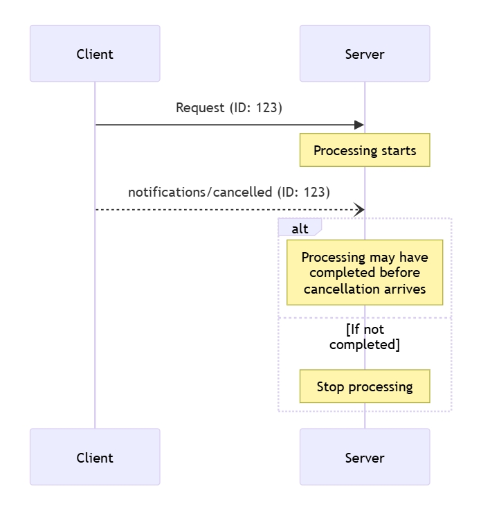

**实现注意事项**

- 双方都应记录取消原因以便调试
- 应用程序用户界面应说明何时请求取消

**错误处理**

无效的取消通知应予以忽略：

- 未知请求 ID
- 已经完成的请求
- 畸形通知

这样既保持了通知的“触发即忘（fire and forget）”特性，又允许在异步通信中出现竞赛条件。

#### 进度

模型上下文协议 (MCP) 支持通过通知消息对长期运行的操作进行可选的进度跟踪。任何一方都可以发送进度通知，提供有关操作状态的更新。

**进度流**

当一方希望接收请求的进度更新时，它会在请求元数据中包含一个进度令牌（`progressToken`）。

- 进度令牌必须是字符串或整数值

- 进度令牌可由发送方通过任何方式选择，但在所有活动请求中必须是唯一的。

  ```json
  {
    "jsonrpc": "2.0",
    "id": 1,
    "method": "some_method",
    "params": {
      "_meta": {
        "progressToken": "abc123"
      }
    }
  }
  ```

接收方可以发送包含以下内容的进度通知：

- 原始进度标记
- 目前的进度值
- 可选的总值

```json
{
  "jsonrpc": "2.0",
  "method": "notifications/progress",
  "params": {
    "progressToken": "abc123",
    "progress": 50,
    "total": 100
  }
}
```

- `progress` 必须随每次通知而增加，即使 `total` 未知。
- `progress` 和 `total` 可以是浮点数。

**行为要求**

1. 进度通知只能引用以下标记：

   - 在主动请求中提供
   - 与正在进行的操作相关
2. 进度请求的接收方可以：
   - 选择不发送任何进度通知
   - 以其认为合适的频率发送通知
   - 如果未知，则省略 `total`

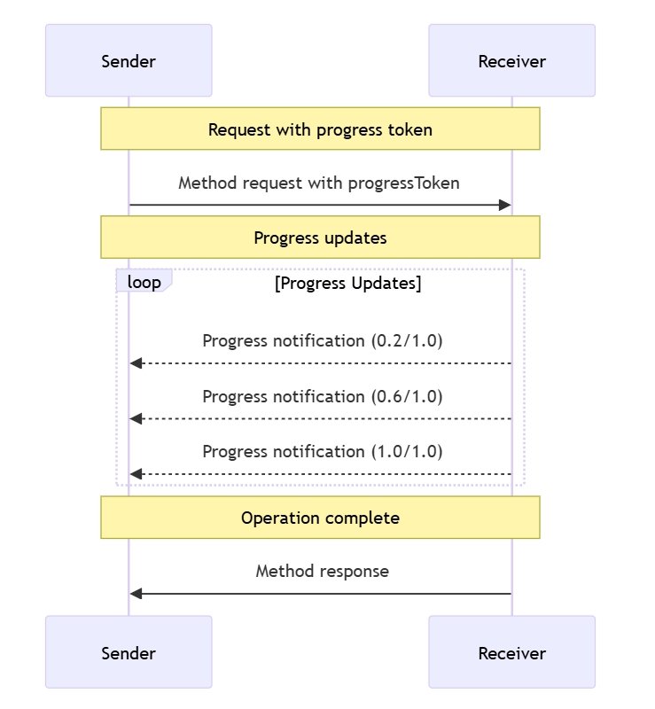

**实现注意事项**

- 发送方和接收方应跟踪活动进度标记
- 双方应实施速率限制，以防止泛洪
- 完成后必须停止进度通知

## 服务器功能

服务器为 **MCP** 提供了构建语言模型上下文的基本组件。这些原语（primitives）使客户端、服务器和语言模型之间的交互更加丰富。

1. **Prompts（提示）** —— 预定义模板或指令，用于引导语言模型的交互。
2. **Resources（资源）** —— 结构化数据或内容，为模型提供额外的上下文信息。
3. **Tools（工具）** —— 可执行函数，允许模型执行操作或检索信息。

每种原语在 MCP 生态系统中的控制方式如下：

| **原语（Primitive）** | **控制方式（Control）**                | **描述（Description）**             | **示例（Example）**                                    |
| --------------------- | -------------------------------------- | ----------------------------------- | ------------------------------------------------------ |
| **Prompts（提示）**   | 用户控制（User-controlled）            | 由用户选择触发的交互式模板          | 斜杠命令（Slash commands）、菜单选项（Menu options）   |
| **Resources（资源）** | 应用程序控制（Application-controlled） | 由客户端附加和管理的上下文数据      | 文件内容（File contents）、Git 历史记录（Git history） |
| **Tools（工具）**     | 模型控制（Model-controlled）           | 暴露给 LLM 的函数，使其能够执行操作 | API POST 请求、文件写入                                |

### Prompts

模型上下文协议（MCP）为服务器向客户端公开提示（Prompts）模板提供了一种标准化的方式。提示允许服务器提供与语言模型交互的结构化信息和指令。客户端可以发现可用的提示，检索其内容，并提供参数对其进行定制。

#### 用户交互模型

提示是为用户控制而设计的，这意味着它们从服务器暴露给客户端时，用户可以明确地选择使用它们。

通常情况下，提示会通过用户界面中的用户启动命令触发，这样用户就能自然地发现并调用可用的提示。

例如，斜线命令：


不过，实施者可以根据自己的需要，通过任何接口模式公开提示信息--协议本身并没有规定任何特定的用户交互模式。

#### 能力

支持提示的服务器必须在[初始化](#初始化)过程中声明提示能力：

```json
{
  "capabilities": {
    "prompts": {
      "listChanged": true
    }
  }
}
```

`listChanged` 表示当可用提示列表发生变化时，服务器是否会发出通知。

#### 协议信息

##### 列出提示

要检索可用的提示，客户端需发送 `prompts/list` 请求。此操作支持[分页](#分页)。

**Request**：

```json
{
  "jsonrpc": "2.0",
  "id": 1,
  "method": "prompts/list",
  "params": {
    "cursor": "optional-cursor-value"
  }
}
```

**Response**：

```json
{
  "jsonrpc": "2.0",
  "id": 1,
  "result": {
    "prompts": [
      {
        "name": "code_review",
        "description": "Asks the LLM to analyze code quality and suggest improvements",
        "arguments": [
          {
            "name": "code",
            "description": "The code to review",
            "required": true
          }
        ]
      }
    ],
    "nextCursor": "next-page-cursor"
  }
}
```

##### 获取提示

要获取特定的提示，客户端需要发送 `prompts/get` 请求。参数可通过完成 API [自动完成](#completion)。

**Request**：

```json
{
  "jsonrpc": "2.0",
  "id": 2,
  "method": "prompts/get",
  "params": {
    "name": "code_review",
    "arguments": {
      "code": "def hello():\n    print('world')"
    }
  }
}
```

**Response**：

```json
{
  "jsonrpc": "2.0",
  "id": 2,
  "result": {
    "description": "Code review prompt",
    "messages": [
      {
        "role": "user",
        "content": {
          "type": "text",
          "text": "Please review this Python code:\ndef hello():\n    print('world')"
        }
      }
    ]
  }
}
```

##### 列表变更通知

当可用提示列表发生变化时，声明了 `listChanged` 功能的服务器应发送通知：

```json
{
  "jsonrpc": "2.0",
  "method": "notifications/prompts/list_changed"
}
```

#### 消息流程

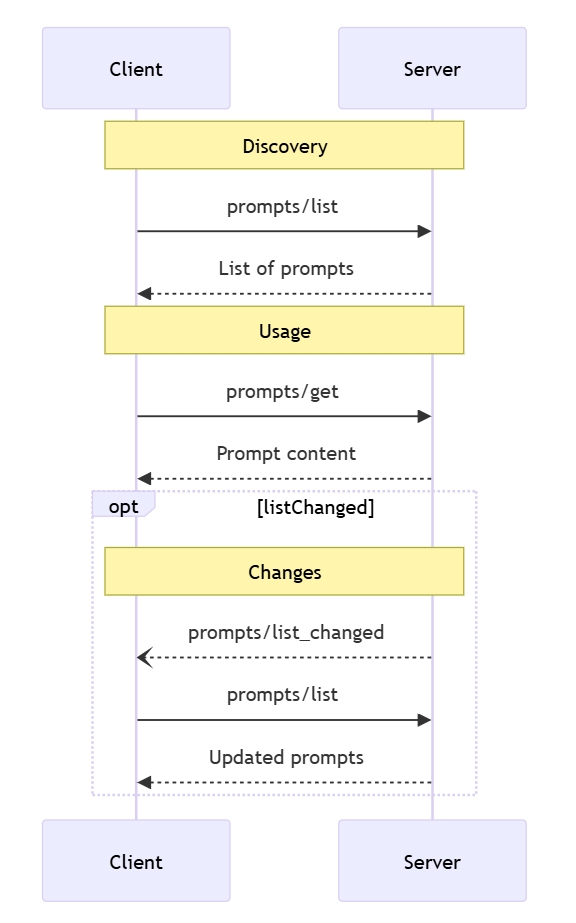

#### 数据类型

##### Prompt

提示符定义包括：

- `name`: 提示符的唯一标识符
- `description`：可选的人可读描述
- `arguments`：可选的自定义参数列表

##### PromptMessage

提示中的信息可包括：

- `role`：“user”或“assistant”，表示说话者
- `content`： 以下内容类型之一：

**文本内容**

```json
{
  "type": "text",
  "text": "The text content of the message"
}
```

**图像内容**

```json
{
  "type": "image",
  "data": "base64-encoded-image-data",
  "mimeType": "image/png"
}
```

图像数据必须经过 base64 编码，并包含有效的 MIME 类型。这样就能在视觉上下文非常重要的情况下实现多模态交互。

**嵌入资源**

嵌入式资源允许在消息中直接引用服务器端资源：

```json
{
  "type": "resource",
  "resource": {
    "uri": "resource://example",
    "mimeType": "text/plain",
    "text": "Resource content"
  }
}
```

资源可包含文本或二进制（blob）数据，并且必须包括

- 一个有效的资源 URI
- 适当的 MIME 类型
- 文本内容或经 base64 编码的 blob 数据

嵌入式资源可使提示语将服务器管理的内容（如文档、代码示例或其他参考资料）直接无缝整合到对话流中。

**错误处理**

服务器应针对常见故障返回标准 JSON-RPC 错误：

- 提示名称无效：`-32602`（参数无效）
- 缺少所需参数： `-32602`（无效参数）
- 内部错误：`-32603`（内部错误）

**实现注意事项**

1. 服务器应在处理前验证提示符参数
2. 客户端应处理大型提示符列表的分页
3. 双方应尊重能力协商

**安全**

实现必须仔细验证所有提示符输入和输出，以防止注入攻击或对资源的未经授权访问。

### 资源

模型上下文协议（MCP）为服务器向客户端公开资源提供了一种标准化的方式。资源允许服务器共享为语言模型提供上下文的数据，如文件、数据库模式或特定于应用程序的信息。每个资源都由 URI 唯一标识。

#### 用户交互模型

MCP 中的资源设计为应用程序驱动，由主机应用程序根据自身需要决定如何整合上下文。

例如，应用程序可以

- 通过用户界面元素，以树形或列表视图的方式公开资源，供用户明确选择
- 允许用户搜索和过滤可用资源
- 根据启发式方法或人工智能模型的选择，实现自动包含上下文的功能


不过，实现者可以根据自己的需要，通过任何接口模式公开资源--协议本身并不强制要求采用任何特定的用户交互模式。

#### 能力

支持资源的服务器必须声明 `resources` 能力：

```json
{
  "capabilities": {
    "resources": {
      "subscribe": true,
      "listChanged": true
    }
  }
}
```

该功能支持两个可选功能：

- `subscribe`：客户端是否可以订阅单个资源的变更通知。
- `listChanged`：当可用资源列表发生变化时，服务器是否会发出通知。

`subscribe` 和 `listChanged` 都是可选的，服务器可以两者都不支持，也可以两者都支持：

```json
{
  "capabilities": {
    "resources": {} // Neither feature supported
  }
}
```

```json
{
  "capabilities": {
    "resources": {
      "subscribe": true // Only subscriptions supported
    }
  }
}
```

```json
{
  "capabilities": {
    "resources": {
      "listChanged": true // Only list change notifications supported
    }
  }
}
```

#### 协议信息

##### 列出资源

要发现可用资源，客户端会发送 `resource/list` 请求。此操作支持[分页](#分页)。

**Request**：

```json
{
  "jsonrpc": "2.0",
  "id": 1,
  "method": "resources/list",
  "params": {
    "cursor": "optional-cursor-value"
  }
}
```

**Response**：

```json
{
  "jsonrpc": "2.0",
  "id": 1,
  "result": {
    "resources": [
      {
        "uri": "file:///project/src/main.rs",
        "name": "main.rs",
        "description": "Primary application entry point",
        "mimeType": "text/x-rust"
      }
    ],
    "nextCursor": "next-page-cursor"
  }
}
```

##### 读资源

检索资源内容，客户端发送 `resources/read` 请求：

**Request**：

```json
{
  "jsonrpc": "2.0",
  "id": 2,
  "method": "resources/read",
  "params": {
    "uri": "file:///project/src/main.rs"
  }
}
```

**Response**：

```json
{
  "jsonrpc": "2.0",
  "id": 2,
  "result": {
    "contents": [
      {
        "uri": "file:///project/src/main.rs",
        "mimeType": "text/x-rust",
        "text": "fn main() {\n    println!(\"Hello world!\");\n}"
      }
    ]
  }
}
```

##### 资源模板

资源模板允许服务器使用 [URI 模板](https://datatracker.ietf.org/doc/html/rfc6570)公开参数化资源。参数可通过完成 [API 自动完成](#completion)。

**Request**：

```json
{
  "jsonrpc": "2.0",
  "id": 3,
  "method": "resources/templates/list"
}
```

**Response**：

```json
{
  "jsonrpc": "2.0",
  "id": 3,
  "result": {
    "resourceTemplates": [
      {
        "uriTemplate": "file:///{path}",
        "name": "Project Files",
        "description": "Access files in the project directory",
        "mimeType": "application/octet-stream"
      }
    ]
  }
}
```

##### 列表变更通知

当可用资源列表发生变化时，声明了 `listChanged` 功能的服务器应发送通知：

```json
{
  "jsonrpc": "2.0",
  "method": "notifications/resources/list_changed"
}
```

##### 订阅

协议支持对资源变化的可选订阅。客户端可以订阅特定资源，并在资源发生变化时接收通知：

**订阅请求**：

```json
{
  "jsonrpc": "2.0",
  "id": 4,
  "method": "resources/subscribe",
  "params": {
    "uri": "file:///project/src/main.rs"
  }
}
```

**更新通知**：

```json
{
  "jsonrpc": "2.0",
  "method": "notifications/resources/updated",
  "params": {
    "uri": "file:///project/src/main.rs"
  }
}
```

#### 消息流

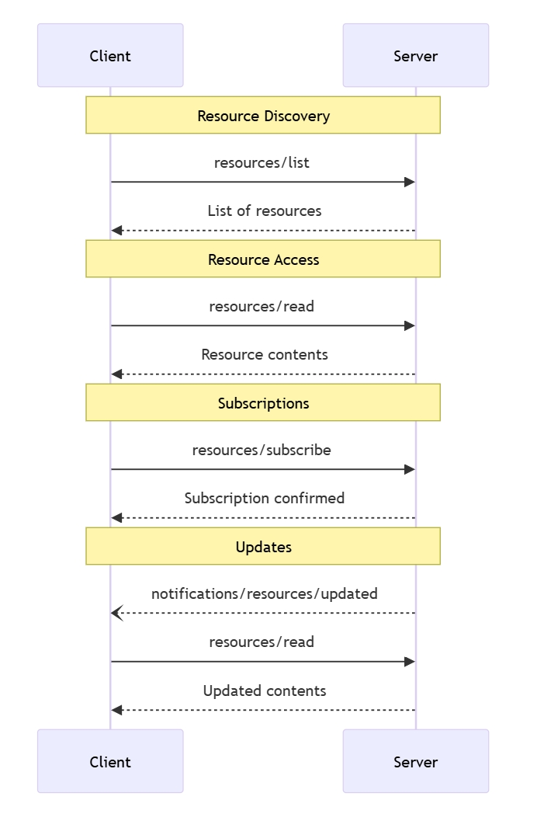

#### 数据类型

##### Resource

一个资源定义包含：

- `uri`：资源的唯一标识符
- `name`人类可读名称
- `description`：可选描述
- `mimeType`： 可选的 MIME 类型

##### 资源内容

资源能包含文本或二进制数据：

**文本内容**

```json
{
  "uri": "file:///example.txt",
  "mimeType": "text/plain",
  "text": "Resource content"
}
```

**二进制内容**

```json
{
  "uri": "file:///example.png",
  "mimeType": "image/png",
  "blob": "base64-encoded-data"
}
```

#### 常用 URI 方案

协议定义了几种标准 URI 方案。本列表并非详尽无遗--实施者可自由使用其他自定义 URI 方案。

**https://**

用于表示网络上的可用资源。

只有当客户机能够直接从网上获取和加载资源时，服务器才应使用此方案，也就是说，客户机不需要通过 MCP 服务器读取资源。

对于其他用例，即使服务器本身将通过互联网下载资源内容，服务器也应倾向于使用其他 URI 方案或定义自定义方案。

**file://**

用于标识行为类似于文件系统的资源。不过，这些资源并不需要映射到实际的物理文件系统。

MCP 服务器可以使用 [XDG MIME 类型](https://specifications.freedesktop.org/shared-mime-info-spec/0.14/ar01s02.html#id-1.3.14)（如 `inode/directory`）标识 file:// 资源，以表示没有标准 MIME 类型的非正常文件（如目录）。

**git://**

Git 版本控制集成。

#### 错误处理

服务器应针对常见故障返回标准 JSON-RPC 错误：

- 未找到资源：`-32002`
- 内部错误： `-32603`

```json
{
  "jsonrpc": "2.0",
  "id": 5,
  "error": {
    "code": -32002,
    "message": "Resource not found",
    "data": {
      "uri": "file:///nonexistent.txt"
    }
  }
}
```

#### 安全考虑

1. 服务器必须验证所有资源 URI
2. 应对敏感资源实施访问控制
3. 必须对二进制数据进行正确编码
4. 操作前必须检查资源权限

### 工具

模型上下文协议（MCP）允许服务器公开可由语言模型调用的工具。工具可使模型与外部系统交互，如查询数据库、调用 API 或执行计算。每个工具都有一个唯一的名称，并包含描述其模式的元数据。

#### 用户交互模型

MCP 中的工具被设计为由模型控制，这意味着语言模型可以根据对上下文的理解和用户的提示自动发现和调用工具。

但是，实现者可以根据自己的需要，通过任何界面模式自由地公开工具，协议本身并不强制要求采用任何特定的用户交互模式。

> 出于信任、安全和保障的考虑，环路中应该始终有一个人能够拒绝工具调用。
>
> 应用程序应当：
>
> - 提供用户界面，明确说明哪些工具被暴露在人工智能模型中
> - 在调用工具时插入清晰的可视化指示器
> - 向用户提供操作确认提示，以确保有人在整个回路中

#### 能力

支持工具的服务器必须声明 `tools` 能力：

```
{
  "capabilities": {
    "tools": {
      "listChanged": true
    }
  }
}
```

`listChanged` 表示服务器是否会在可用工具列表发生变化时发出通知。

#### 协议消息

##### 列出工具

要发现可用工具，客户端会发送 `tools/list` 请求。此操作支持[分页](#分页)。

**Request**：

```json
{
  "jsonrpc": "2.0",
  "id": 1,
  "method": "tools/list",
  "params": {
    "cursor": "optional-cursor-value"
  }
}
```

**Response**：

```json
{
  "jsonrpc": "2.0",
  "id": 1,
  "result": {
    "tools": [
      {
        "name": "get_weather",
        "description": "Get current weather information for a location",
        "inputSchema": {
          "type": "object",
          "properties": {
            "location": {
              "type": "string",
              "description": "City name or zip code"
            }
          },
          "required": ["location"]
        }
      }
    ],
    "nextCursor": "next-page-cursor"
  }
}
```

##### 调用工具

为了调用工具，客户端发送 `tools/call` 请求：

**Request**：

```json
{
  "jsonrpc": "2.0",
  "id": 2,
  "method": "tools/call",
  "params": {
    "name": "get_weather",
    "arguments": {
      "location": "New York"
    }
  }
}
```

**Response**：

```json
{
  "jsonrpc": "2.0",
  "id": 2,
  "result": {
    "content": [
      {
        "type": "text",
        "text": "Current weather in New York:\nTemperature: 72°F\nConditions: Partly cloudy"
      }
    ],
    "isError": false
  }
}
```

##### 列表变更通知

当可用工具列表发生变化时，声明了 `listChanged` 功能的服务器应发送通知：

```json
{
  "jsonrpc": "2.0",
  "method": "notifications/tools/list_changed"
}
```

#### 消息流

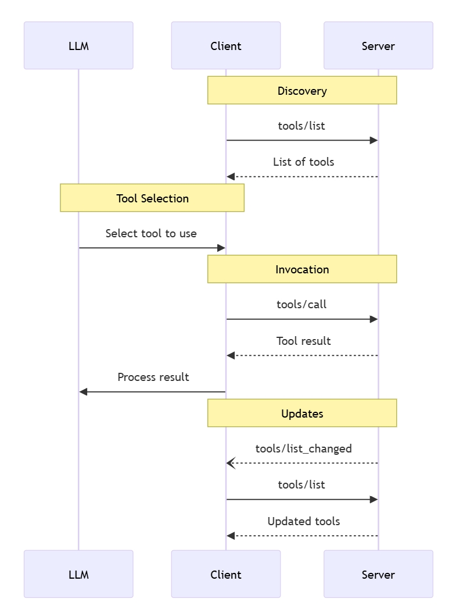

#### 数据类型

##### Tool

一个工具定义包含：

- `name`：工具的唯一标识符
- `description`： 功能的人可读描述
- `inputSchema`： 定义预期参数的 JSON 模式

##### Tool 结果

工具结果可包含多个不同类型的内容项：

**文本内容**

```json
{
  "type": "text",
  "text": "Tool result text"
}
```

**图像内容**

```json
{
  "type": "image",
  "data": "base64-encoded-data",
  "mimeType": "image/png"
}
```

**嵌入资源**

可将[资源](#资源)嵌入到一个 URI 后面，以提供额外的上下文或数据，客户端随后可订阅或再次获取该 URI：

```json
{
  "type": "resource",
  "resource": {
    "uri": "resource://example",
    "mimeType": "text/plain",
    "text": "Resource content"
  }
}
```

#### 错误处理 

工具使用两种错误报告机制：

1. **协议错误**： 标准 JSON-RPC 错误，如
   - 未知工具
   - 无效参数
   - 服务器错误
2. **工具执行错误**：在工具结果中报告，`isError: true`：
   - API 故障
   - 输入数据无效
   - 业务逻辑错误

协议错误示例：

```json
{
  "jsonrpc": "2.0",
  "id": 3,
  "error": {
    "code": -32602,
    "message": "Unknown tool: invalid_tool_name"
  }
}
```

工具执行错误示例：

```json
{
  "jsonrpc": "2.0",
  "id": 4,
  "result": {
    "content": [
      {
        "type": "text",
        "text": "Failed to fetch weather data: API rate limit exceeded"
      }
    ],
    "isError": true
  }
}
```

#### 安全考虑因素 

1. 服务器必须：
   - 验证所有工具输入
   - 实施适当的访问控制
   - 限制工具调用率
   - 净化工具输出
2. 客户端应该：
   - 提示用户确认敏感操作
   - 在调用服务器之前向用户显示工具输入，以避免恶意或意外的数据外泄
   - 在将工具结果传给 LLM 之前进行验证
   - 对工具调用实施超时
   - 为审计目的记录工具使用情况

### 公共类

#### Completion

模型上下文协议（MCP）为服务器提供了一种标准化方式，可为提示和资源 URI 提供参数自动完成建议。这样，用户在输入参数值时就能获得上下文建议，从而获得丰富的类似集成开发环境的体验。

##### 用户交互模型 

MCP 中的补全功能旨在支持类似于集成开发环境代码补全的交互式用户体验。

例如，应用程序可以在用户键入时在下拉菜单或弹出菜单中显示补全建议，并能从可用选项中进行筛选和选择。

不过，实现者可以根据自己的需要，通过任何接口模式来显示补全功能，协议本身并不强制要求采用任何特定的用户交互模式。

##### 协议信息 

**请求完成**

要获得完成建议，客户端需要发送一个 `completion/complete` 请求，通过引用类型指定要完成的内容：

**Request**：

```json
{
  "jsonrpc": "2.0",
  "id": 1,
  "method": "completion/complete",
  "params": {
    "ref": {
      "type": "ref/prompt",
      "name": "code_review"
    },
    "argument": {
      "name": "language",
      "value": "py"
    }
  }
}
```

**Response**：

```json
{
  "jsonrpc": "2.0",
  "id": 1,
  "result": {
    "completion": {
      "values": ["python", "pytorch", "pyside"],
      "total": 10,
      "hasMore": true
    }
  }
}
```

**引用类型（Reference Types）**

MCP 协议支持两种类型的补全引用（completion references）：

| **类型（Type）** | **描述（Description）**           | **示例（Example）**                                 |
| ---------------- | --------------------------------- | --------------------------------------------------- |
| `ref/prompt`     | 通过名称引用一个提示（prompt）    | `{"type": "ref/prompt", "name": "code_review"}`     |
| `ref/resource`   | 通过 URI 引用一个资源（resource） | `{"type": "ref/resource", "uri": "file:///{path}"}` |

**完成结果**

服务器会返回一个按**相关性**排序的完成值数组，其中包括：

- 每个响应最多 100 个项目
- 可选的可用匹配总数
- 布尔型，表示是否存在其他结果

##### 消息流

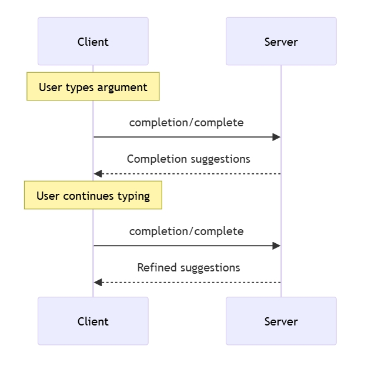

##### 数据类型

**CompleteRequest**

- `ref`: `PromptReference` 或 `ResourceReference`
- `argument`： 包含的对象：
  - `name`：参数名称
  - `value`：当前值

**CompleteResult**

- `completion`： 对象包含：
  - `values`： 建议数组（最多 100）
  - `total`： 可选的匹配总数
  - `hasMore`： 附加结果标志

##### 实施注意事项 

1. 服务器应该：
   - 返回按相关性排序的建议
   - 酌情实施模糊匹配
   - 限制完成请求的比率
   - 验证所有输入
2. 客户端应该：
   - 缓冲快速完成请求
   - 酌情缓存完成结果
   - 从容处理缺失或部分结果

##### 安全性 

实现时必须：

- 验证所有完成输入
- 实施适当的速率限制
- 控制对敏感建议的访问
- 防止基于填写的信息泄露

#### 日志

模型上下文协议（MCP）为服务器向客户端发送结构化日志信息提供了一种标准化方式。客户端可通过设置最低日志级别来控制日志记录的繁琐程度，而服务器则会发送包含严重程度级别、可选日志记录器名称和任意 JSON 序列化数据的通知。

##### 用户交互模型 

实施者可根据自己的需要，通过任何接口模式公开日志记录，协议本身并不强制要求采用任何特定的用户交互模式。

##### 功能 

发出日志消息通知的服务器必须声明 `logging` 功能：

```json
{
  "capabilities": {
    "logging": {}
  }
}
```

##### 日志级别

该协议遵循 [RFC 5424](https://datatracker.ietf.org/doc/html/rfc5424#section-6.2.1) 规定的标准 Syslog 严重性级别：

| 级别          | 描述             | 示例用例          |
| ------------- | ---------------- | ----------------- |
| **debug**     | 详细的调试信息   | 函数的进入/退出点 |
| **info**      | 一般信息性消息   | 操作进度更新      |
| **notice**    | 正常但重要的事件 | 配置更改          |
| **warning**   | 警告条件         | 使用已弃用的功能  |
| **error**     | 错误条件         | 操作失败          |
| **critical**  | 严重条件         | 系统组件故障      |
| **alert**     | 必须立即采取行动 | 检测到数据损坏    |
| **emergency** | 系统不可用       | 完全系统故障      |

##### 协议消息

**设置日志级别**

要配置最小日志级别，客户端可以发送 `logging/setLevel` 请求：

```json
{
  "jsonrpc": "2.0",
  "id": 1,
  "method": "logging/setLevel",
  "params": {
    "level": "info"
  }
}
```

**日志消息通知**

服务器使用 `notifications/message` 发送日志消息通知：

```json
{
  "jsonrpc": "2.0",
  "method": "notifications/message",
  "params": {
    "level": "error",
    "logger": "database",
    "data": {
      "error": "Connection failed",
      "details": {
        "host": "localhost",
        "port": 5432
      }
    }
  }
}
```

##### 消息流

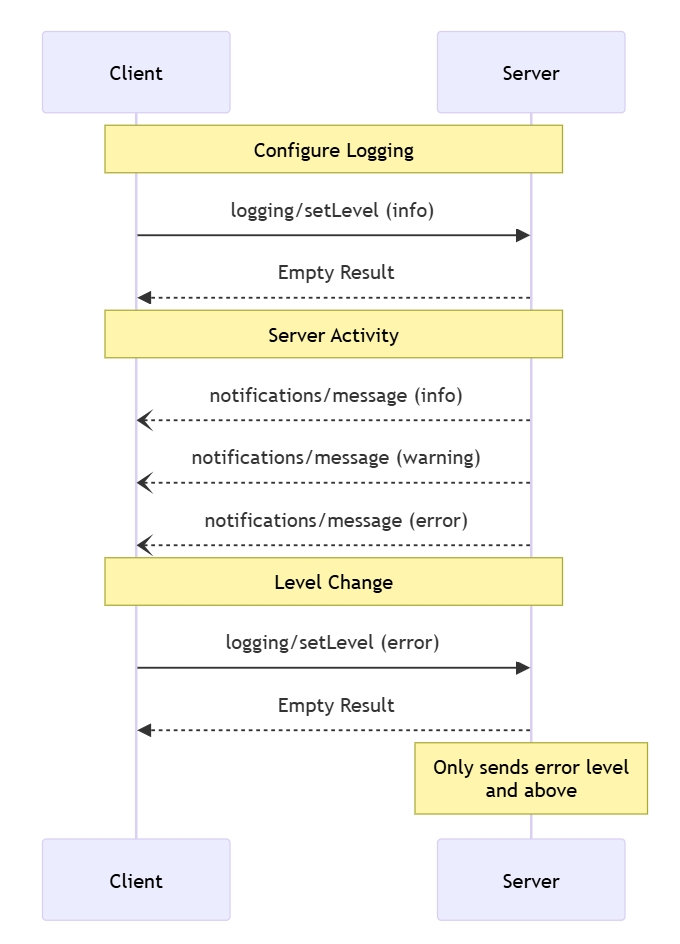

##### 错误处理

服务器应针对常见故障返回标准 JSON-RPC 错误：

- 无效日志级别：`-32602`（无效参数）
- 配置错误： `-32603`（内部错误）

##### 实施注意事项

服务器应当：

- 限制日志信息的速率
- 在数据字段中包含相关上下文
- 使用一致的日志记录器名称
- 删除敏感信息

客户端可以：

- 在用户界面中显示日志信息
- 实施日志过滤/搜索
- 可视化显示严重程度
- 持久保存日志信息

#####  安全性

日志信息不得包含以下内容：

- 凭据或机密
- 个人识别信息
- 可能有助于攻击的内部系统细节

实现应当：

- 限制信息的速率
- 验证所有数据字段
- 控制日志访问
- 监控敏感内容

#### 分页

模型上下文协议 (MCP) 支持对可能返回大型结果集的列表操作进行分页。分页允许服务器将结果分成较小的块而不是一次全部返回。

在通过互联网连接外部服务时，分页尤其重要，但对于本地集成也很有用，可以避免大型数据集的性能问题。

##### 分页模型

MCP 中的分页使用基于**不透明游标**的方法，而不是编号页面。

- **游标**是一个不透明的字符串标记，代表结果集中的一个位置
- 页面大小由服务器决定，可能不是固定的
  响应格式

##### 返回格式

当服务器发送包括以下内容的响应时，开始分页：

- 当前结果页
- 如果存在更多结果，可选择 `nextCursor` 字段

```json
{
  "jsonrpc": "2.0",
  "id": "123",
  "result": {
    "resources": [...],
    "nextCursor": "eyJwYWdlIjogM30="
  }
}
```

##### 请求格式

收到游标后，客户端可以通过发出包含该游标的请求来继续分页：

```json
{
  "jsonrpc": "2.0",
  "method": "resources/list",
  "params": {
    "cursor": "eyJwYWdlIjogMn0="
  }
}
```

##### 分页流

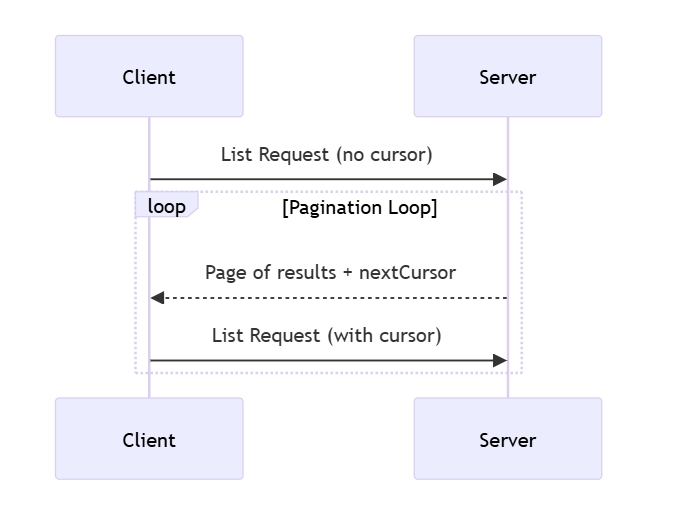

##### 支持分页的操作

以下 MCP 操作支持分页：

- `resources/list` - 列出可用资源
- `resources/templates/list` - 列出资源模板
- `prompts/list` - 列出可用提示
- `tools/list` - 列出可用工具

##### 实现指南

服务器应当：

- 提供稳定的游标
- 优雅地处理无效游标

客户端应当：

- 将丢失的 `nextCursor` 视为结果的结束
- 同时支持分页和非分页流

客户端必须将游标视为不透明标记：

- 不要假定游标格式
- 不要尝试解析或修改游标
- 不要跨会话持久化游标

##### 错误处理

无效游标应导致代码为 `-32602`（无效参数）的错误。

## 客户端功能

客户机可执行附加功能，以丰富已连接的 MCP 服务器：

### Roots

模型上下文协议（MCP）提供了一种标准化的方式，让客户端向服务器公开文件系统“**根（roots）**”。根定义了服务器在文件系统中的操作边界，使服务器能够了解它们可以访问哪些目录和文件。服务器可以向支持客户端请求根列表，并在列表发生变化时接收通知。

#### 用户交互模型

MCP 中的根通常通过工作区或项目配置接口公开。

例如，实施方案可以提供一个工作区/项目选择器，允许用户选择服务器应该访问的目录和文件。这可以与从版本控制系统或项目文件自动检测工作区相结合。

不过，实现者可以根据自己的需要，通过任何接口模式公开根目录，协议本身并不强制要求采用任何特定的用户交互模式。

#### 功能

支持根的客户端必须在[初始化](#初始化)过程中声明 `roots` 功能：

```json
{
  "capabilities": {
    "roots": {
      "listChanged": true
    }
  }
}
```

`listChanged` 表示当根列表发生变化时，客户端是否会发出通知。

#### 协议消息

##### 列出根

要检索根，服务器会发送 `root/list` 请求：

```json
{
  "jsonrpc": "2.0",
  "id": 1,
  "method": "roots/list"
}
```

**响应**：

```json
{
  "jsonrpc": "2.0",
  "id": 1,
  "result": {
    "roots": [
      {
        "uri": "file:///home/user/projects/myproject",
        "name": "My Project"
      }
    ]
  }
}
```

##### 根列表变更

当根变更时，客户端支持 `listChanged` 必须发送一个变更通知：

```json
{
  "jsonrpc": "2.0",
  "method": "notifications/roots/list_changed"
}
```

#### 消息流

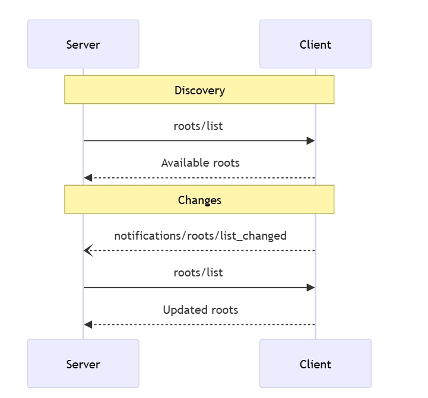

#### 数据类型

##### 根

根定义包括：

- `uri`：根的唯一标识符。在当前规范中，它必须是 `file://` URI。
- `name`：可选的人类可读名称，用于显示目的。

不同用例的根示例：

**项目目录**

```json
{
  "uri": "file:///home/user/projects/myproject",
  "name": "My Project"
}
```

**多仓储**

```json
[
  {
    "uri": "file:///home/user/repos/frontend",
    "name": "Frontend Repository"
  },
  {
    "uri": "file:///home/user/repos/backend",
    "name": "Backend Repository"
  }
]
```

#### 错误处理

客户端应针对常见故障返回标准 JSON-RPC 错误：

- 客户端不支持根：`-32601`（未找到方法）
- 内部错误：`-32603`

示例错误：

```json
{
  "jsonrpc": "2.0",
  "id": 1,
  "error": {
    "code": -32601,
    "message": "Roots not supported",
    "data": {
      "reason": "Client does not have roots capability"
    }
  }
}
```

#### 安全考虑

客户端必须

- 只公开具有适当权限的根
- 验证所有根 URI 以防止路径遍历
- 实施适当的访问控制
- 监控根的可访问性

服务器应当：

- 处理根不可访问的情况
- 在操作过程中尊重根的边界
- 根据提供的根验证所有路径

#### 实施指南

客户端应当： 

- 在将根暴露给服务器之前提示用户同意
- 为根管理提供清晰的用户界面
- 在暴露之前验证根的可访问性
- 监控根的更改

服务器应当：

- 在使用之前检查根的能力
- 从容应对根列表的更改
- 在操作中尊重根的边界
- 适当缓存根信息

### 采样

模型上下文协议（MCP）为服务器通过客户端请求语言模型的 LLM 采样（“完成”或“生成”）提供了一种标准化的方式。该流程允许客户端保持对模型访问、选择和权限的控制，同时使服务器能够利用人工智能功能--无需服务器 API 密钥。服务器可请求基于文本或图像的交互，并可选择在提示中包含来自 MCP 服务器的上下文。

#### 用户交互模型

MCP 中的采样功能可让 LLM 调用嵌套在其他 MCP 服务器功能中，从而让服务器实现代理行为。

实现者可通过任何适合其需要的接口模式自由公开采样，协议本身并不强制要求采用任何特定的用户交互模式。

> 出于信任、安全和保障考虑，环路中应始终有一个能够拒绝采样请求的人。
>
> 应用程序应当：
>
> - 提供用户界面，使用户能够轻松直观地审查采样请求
> - 允许用户在发送前查看和编辑提示
> - 在发送前显示生成的响应以供审查

#### 能力

支持采样的客户端必须在[初始化](#初始化)过程中声明 `sampling` 能力：

```json
{
  "capabilities": {
    "sampling": {}
  }
}
```

#### 协议消息

##### 创建消息

要请求生成语言模型，服务器会发送 `sampling/createMessage` 信息请求：

**Request**：

```json
{
  "jsonrpc": "2.0",
  "id": 1,
  "method": "sampling/createMessage",
  "params": {
    "messages": [
      {
        "role": "user",
        "content": {
          "type": "text",
          "text": "What is the capital of France?"
        }
      }
    ],
    "modelPreferences": {
      "hints": [
        {
          "name": "claude-3-sonnet"
        }
      ],
      "intelligencePriority": 0.8,
      "speedPriority": 0.5
    },
    "systemPrompt": "You are a helpful assistant.",
    "maxTokens": 100
  }
}
```

**Response**：

```json
{
  "jsonrpc": "2.0",
  "id": 1,
  "result": {
    "role": "assistant",
    "content": {
      "type": "text",
      "text": "The capital of France is Paris."
    },
    "model": "claude-3-sonnet-20240307",
    "stopReason": "endTurn"
  }
}
```

#### 消息流

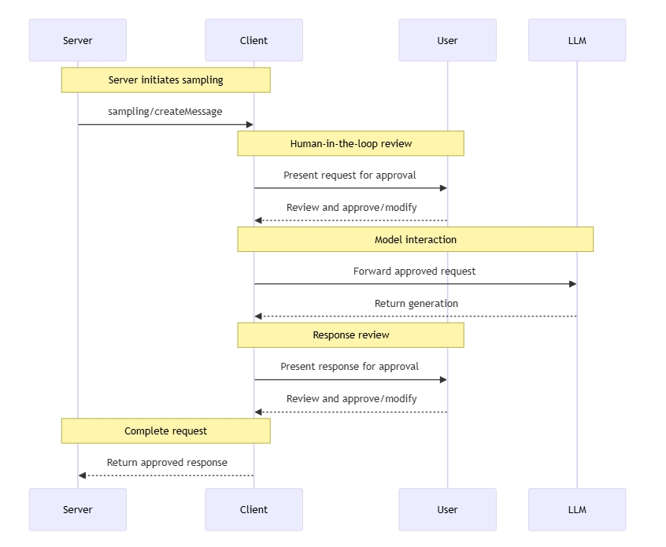

#### 数据类型

##### 消息

采样消息包含：

**文本内容**

```
{
  "type": "text",
  "text": "The message content"
}
```

**图像内容**

```
{
  "type": "image",
  "data": "base64-encoded-image-data",
  "mimeType": "image/jpeg"
}
```

##### 模型引用

MCP 中的模型选择需要谨慎的抽象，因为服务器和客户端可能使用不同的人工智能提供商提供的不同模型。服务器不能简单地通过名称请求特定模型，因为客户端可能无法获得该模型，或者更愿意使用不同提供商的等效模型。

为了解决这个问题，MCP 实现了一个偏好系统，将抽象的能力优先级与可选的模型提示相结合：

**能力优先级**

服务器通过三个标准化的优先级值（0-1）来表达自己的需求：

- `costPriority`：成本最小化有多重要？值越高模型越便宜。
- `speedPriority`：低延迟有多重要？值越高模型越快。
- `intelligencePriority`：高级功能有多重要？数值越高，性能越强的机型越受欢迎。

**机型提示**

优先级有助于根据特性选择机型，而 `hints` 则允许服务器建议特定的机型或机型系列：

- 提示被视为子字符串，可灵活匹配模型名称
- 多个提示按优先顺序进行评估
- 客户端可将提示映射到来自不同提供商的等效模型
- 提示是建议性的--客户可进行最终模型选择

例如：

```json
{
  "hints": [
    { "name": "claude-3-sonnet" }, // Prefer Sonnet-class models
    { "name": "claude" } // Fall back to any Claude model
  ],
  "costPriority": 0.3, // Cost is less important
  "speedPriority": 0.8, // Speed is very important
  "intelligencePriority": 0.5 // Moderate capability needs
}
```

客户端处理这些偏好，从可用选项中选择合适的模型。例如，如果客户端无法访问 Claude 模型，但有 Gemini，它可能会根据类似的功能将 `sonnet` 提示映射到 `gemini-1.5-pro`。

#### 错误处理

客户端应针对常见的失败情况返回错误：

错误示例：

```
{
  "jsonrpc": "2.0",
  "id": 1,
  "error": {
    "code": -1,
    "message": "User rejected sampling request"
  }
}
```

#### 安全考虑

- 客户端应实施用户批准控制
- 双方应验证信息内容
- 客户端应尊重模型偏好提示
- 客户端应实施速率限制
- 双方必须适当处理敏感数据