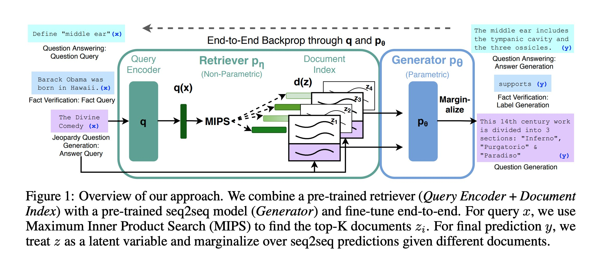
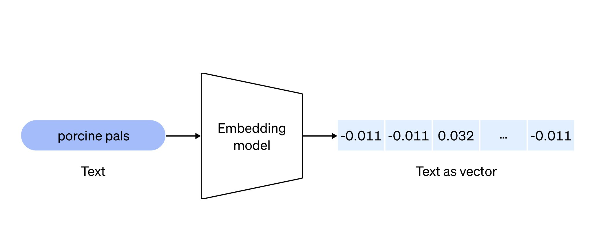
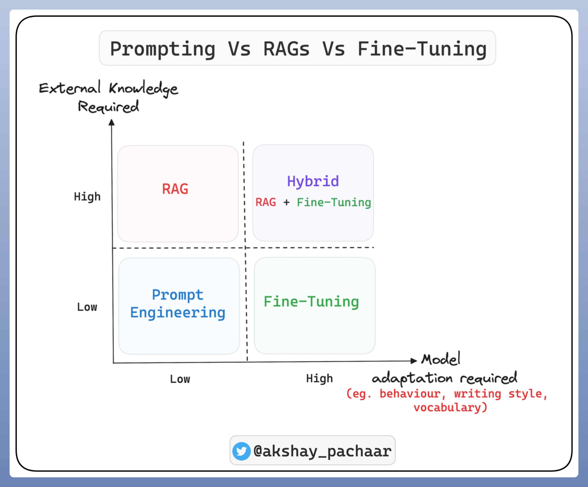

# RAG(Retrieval Augmented Generation)

**RAG (Retrieval Augmented Generation)** 是一种用于自然语言处理任务的模型架构，它结合了检索和生成两个关键组件。[RAG](https://arxiv.org/abs/2005.11401) 最初是在2020年由谷歌提出的。

传统的生成模型（如语言模型）通常通过输入一个上下文，并使用该上下文生成一个输出序列。然而，这种生成方式可能会导致输出不够准确或不符合特定需求的问题。

RAG 引入了**检索组件**，它通过在大规模的文档集合中检索相关信息来增强生成过程。具体而言，RAG 使用一种称为“DPR（Dense Passage Retrieval）”的技术，该技术通过对文档进行编码和索引化，能够高效地从文档集合中检索相关的段落或句子。

RAG 模型的架构包括两个主要组件：**检索器（Retriever）**和**生成器（Generator）**。检索器负责从文档集合中检索相关的信息，生成器则基于检索到的信息和输入上下文生成最终的输出。

RAG 的一个重要应用是在问答系统中。在这种情况下，**检索器可以从大量的文档中检索与用户提出的问题相关的段落或句子，生成器则使用检索到的信息和问题上下文来生成最终的回答。**

即，**RAG 是一种结合了检索和生成的模型架构，能够通过检索相关信息来增强生成过程，提高生成结果的准确性和相关性。**

## RAG 应用

RAG 要解决的一个问题非常简单：如何让语言模型使用外部知识（External Knowledge）进行生成。 通常，pre-train 模型的知识存储在参数中，这就导致了模型不知道训练集之外的知识（例如搜索数据、行业的 knowledge）。 之前的做法是有新的知识就再重新在 pre-train 的模型上去微调（finetune）。

这样的方式会有几个问题： 

1. 每次有新的知识后都需要进行 finetune 
2. 训练模型的成本是很高的，于是这篇论文提出了 RAG 的方法，pre-train 的模型是能够理解新的知识的，**那么我们直接把要让模型理解的新知识通过 prompt 的方式给它即可。** 

所以一个最小的 RAG 系统就是由 3 个部分组成的： 

1. 语言模型 
2. 模型所需要的外部知识集合（以 vector 的形式存储） 
3. 当前场景下需要的外部知识

### 1) 语言模型

2023 年以来，出现了大量的开源 & 闭源的基座模型，基本上都能够在上面构建 RAG 系统 最常见的方式就是： 

- GPT-3.5/4 + RAG（闭源方案） 
- Llama2 / Mistral + RAG（开源方案）

### 2) 模型所需要的外部知识集合

现在应该大家都了解了 embedding 模型了，包括 embedding 数据的召回。**embedding 本质上就是把数据转化为向量，然后通过余弦相似度来找到最匹配的两个或多个向量。**knowledge -> chunks -> vector user query -> vector

这个模块分成两个部分： 

1. embedding 模型 

2. 存储 embedding vector 的数据库

   前者基本上都使用 OpenAI 的 embedding 模型，后者可选方案非常多，包括 [Pinecone](https://www.pinecone.io/)，国内团队的 [Zilliz](https://zilliz.com/)，开源的 [Chroma](https://www.trychroma.com/)，在关系型数据库上构建的 [pgvector](https://github.com/pgvector/pgvector) 等。

   但是从第一性原理思考，模块 2 个目的是为了存储外部的知识集合，并在需要的时候进行召回。这一步并不一定需要 embedding 模型，传统的搜索匹配在某些场景下可能效果更好（Elasticsearch）。

   如 [http://devv.ai](https://t.co/AgfDhVEASK) 采用的方式是 embedding + 传统的 relation db + Elasticsearch。 并在每个场景下都做了很多优化，一个思路是在 encoding knowledge 的时候做的工作越多，在 retrieve 的时候就能够更快 & 更准确（先做工 & 后做工的区别）。

   我们使用 Rust 构建了整套 knowledge index 包括： 

   - GitHub  代码数据 
   - 开发文档数据
   - 搜索引擎数据

3. 更好地召回当前场景下需要的外部知识

   根据优先做工的法则，我们在 encoding 的时候对于原始的 knowledge 数据做了很多处理： 

   - 对代码进行程序分析 
   - 对开发文档进行逻辑级别的 chunk 分块
   - 对网页信息的提取 & page ranking 优化

(节选自：[https://twitter.com/Tisoga/status/1731478506465636749]

> Embedding 模型：
>
> Embedding 模型是一种人工智能模型，它将文本或其他内容转换为数值向量的形式，从而可以计算内容之间的相似度或相关性。Embedding 层在深度学习中被广泛使用，它可以将高维稀疏特征到低维稠密特征的转换，从而提高模型的效率和准确性。
>
> 具体更多信息可以详见：[一文读懂Embedding的概念，以及它和深度学习的关系 - 知乎 (zhihu.com)](https://zhuanlan.zhihu.com/p/164502624)

## 提示工程、RAGs 与微调的对比

这是每位搭建基于大语言模型（LLM）应用的 AI 工程师都面临的关键选择。

要理解这个决策的指导原则，我们首先得明白这些术语的含义。

### 提示工程

所谓提示，指的是你输入的文本，大语言模型就根据这个输入来生成回应。 这实际上是一种精确的输入方法，旨在引导模型产生相应的输出。 模型的输出将基于其已有的知识。

### RAGs（检索增强生成）

当你将提示工程与数据库查询结合，以获得含丰富上下文的答案时，这就是所谓的 RAG。

生成的输出将基于数据库中现有的知识。

### 微调

微调是指使用特定任务的数据调整大语言模型的参数，使其在某一领域内专业化。

比如，一个语言模型可以在医学文献上进行微调，从而更擅长回答健康护理相关的问题。

这就好比对一位已经技艺娴熟的工人进行额外培训，让他们在特定领域成为专家。

那么，我们如何决定采取哪种方法呢？

有两个关键的指导参数，一个是对外部知识的需求，另一个是模型适应性的需求。

尽管前者的含义较为明确，模型适应性则意味着改变模型的行为、词汇、写作风格等。

例如，一个预训练的大语言模型可能在总结公司会议记录时遇到挑战，因为会议中可能穿插了一些特定的内部术语。

因此，**微调更多的是关于改变结构（行为）而非知识，而对于 RAGs 则正好相反**。

**当你需要生成基于定制知识库的输出，同时保持大语言模型的词汇和写作风格不变时，你可以选择使用 RAGs。**

如果你不需要上述任一功能，那么提示工程就是你的选择。

如果你的应用既需要定制知识又需要改变模型的行为，那么采用混合方案（RAGs + 微调）将是更佳选择。

（本节转自：）

