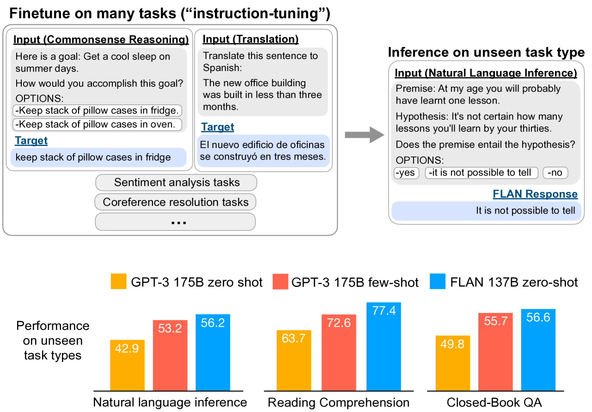
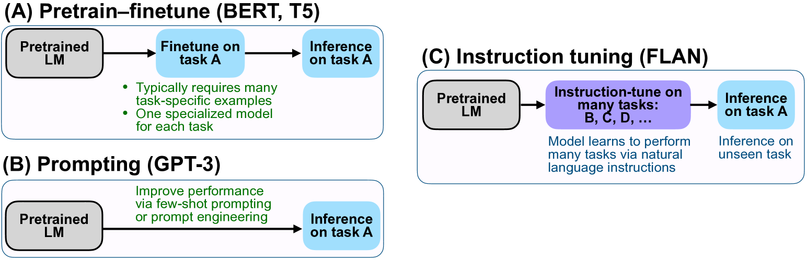
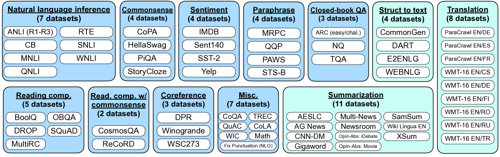
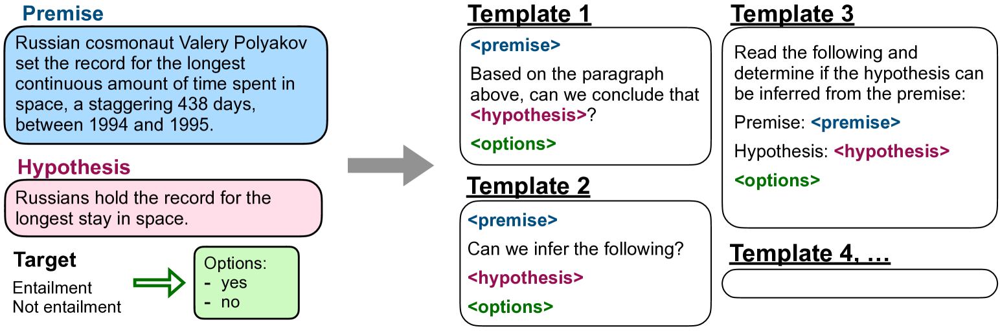
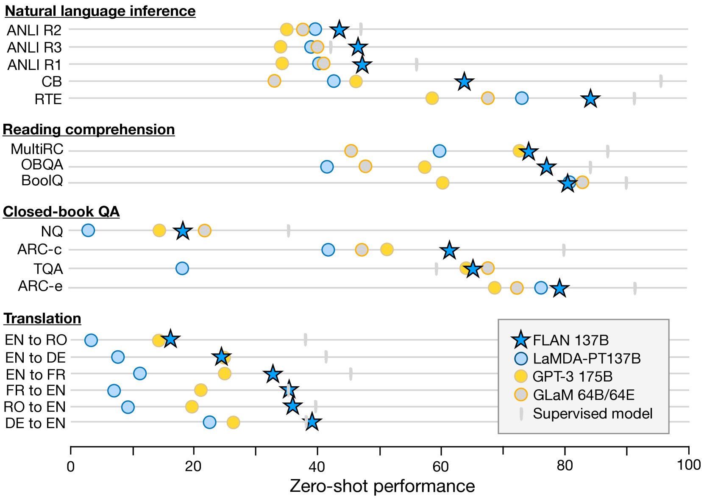
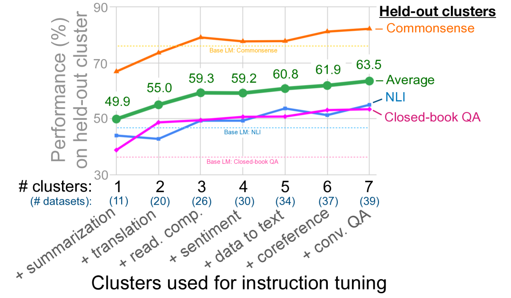
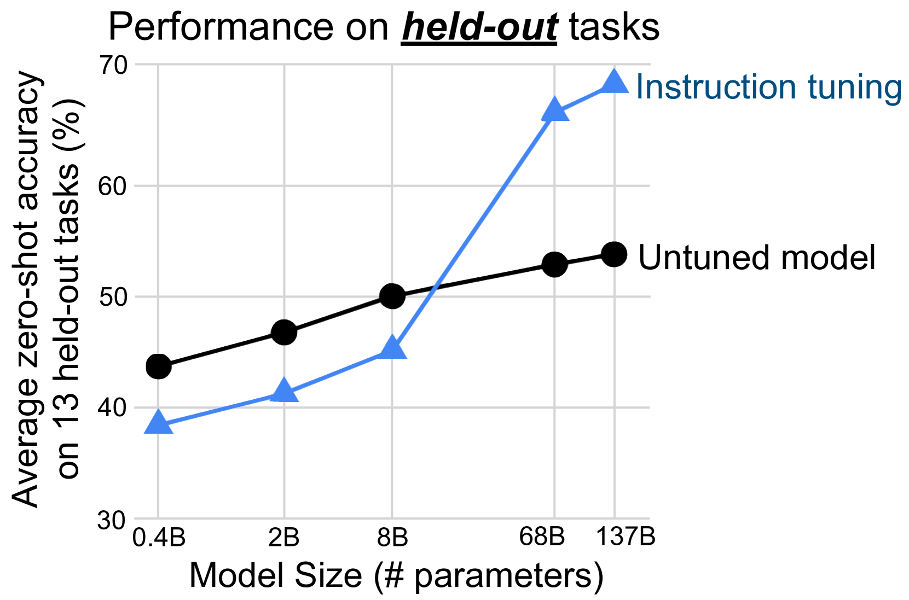
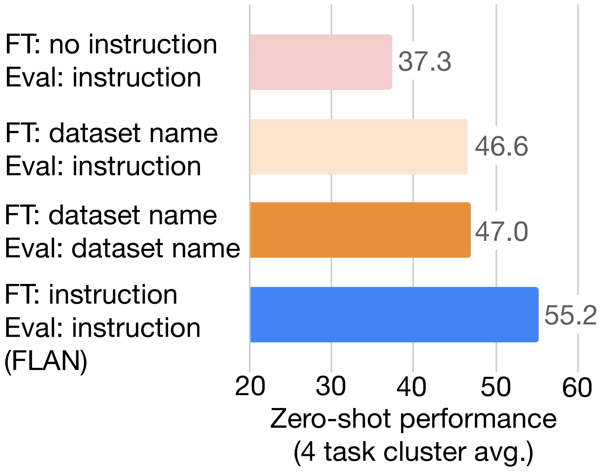
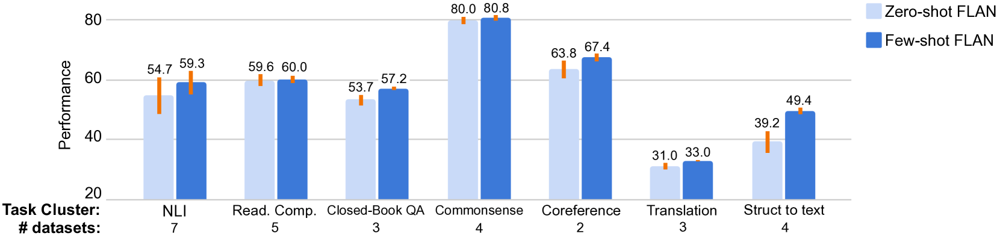
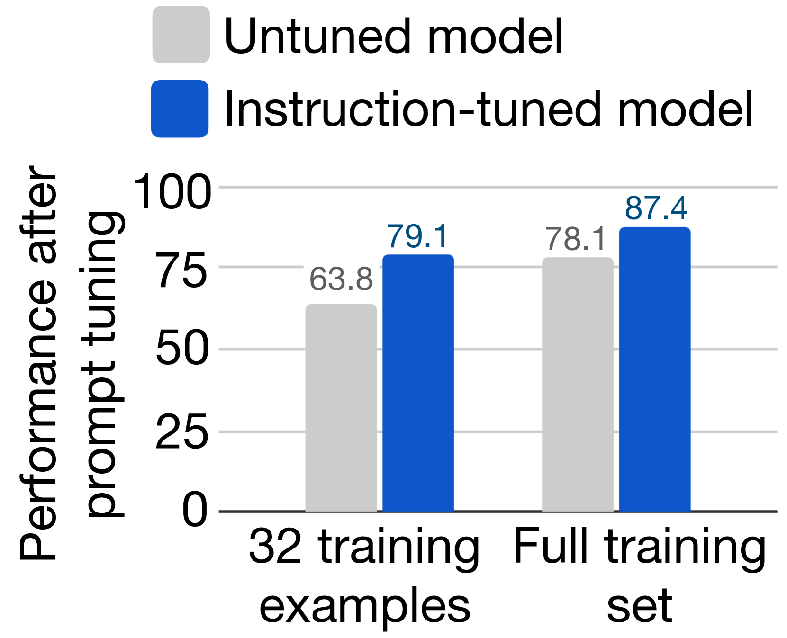

# 微调的语言模型——零样本学习器

论文地址：https://arxiv.org/abs/2109.01652

## 抽象

本文探讨了一种提高语言模型零样本学习能力的简单方法。我们表明，指令调优——对通过指令描述的数据集集合进行语言模型微调，这样大大提高了未见过的任务的零样本性能。

我们使用了一个含有 137B 个参数的预训练语言模型，并通过自然语言指令模板对其进行微调，在超过 60 个自然语言处理数据集上进行了验证。我们评估了这个经过指令微调的模型，称之为 FLAN。FLAN 显著提升了其未修改版本的性能，并在我们评估的 25 个数据集中，有 20 个数据集超过了零样本 175B 的 GPT-3。FLAN 甚至在 ANLI、RTE、BoolQ、AI2-ARC、OpenbookQA 和 StoryCloze 等任务上远远超过了少样本学习的 GPT-3。消融研究表明，微调数据集的数量、模型规模和自然语言指令对于指令微调的成功至关重要。

图 1：上图：指令微调和 FLAN 概述。指令调优在表述为指令的任务组合上微调预训练的语言模型。在推理时，我们评估一个未见过的任务类型；例如，当指令调优期间没有看到 NLI 任务时，我们可以评估自然语言推理（NLI）模型。

下图：与零样本和少样本 GPT-3 相比，零样本 FLAN 在三种未见过的任务类型上的性能，其中指令调优大大提高了我们评估的十分之一的性能。NLI 数据集：ANLI R1–R3、CB、RTE。阅读理解数据集：BoolQ、MultiRC、OBQA。闭卷 QA 数据集：ARC-easy、ARC-challenge、NQ、TriviaQA。

## 引言

大规模的语言模型（LM），例如 GPT-3（Brown 等人，2020 年），已被证明可以很好地执行小样本学习。然而，他们在零样本学习方面不太成功。例如，GPT-3 在阅读理解、问答和自然语言推理等任务上的零样本性能远不如少样本性能。一个潜在的原因是，如果没有少量样本样本，模型很难在与预训练数据格式不相似的提示上表现良好。

在本文中，我们探索了一种简单的方法来提高大型语言模型的零样本性能，这将扩大其对更广泛受众的影响。我们利用直觉，即 NLP 任务可以通过自然语言指令来描述，例如“这部电影评论的情绪是积极的还是消极的？”或“将'你好吗'翻译成中文”。我们采用一个包含 137B 参数的预训练语言模型，并执行指令调优——在通过自然语言指令表达的 60 多个 NLP 数据集的混合上微调模型。我们将这个生成的模型称为 FLAN，即 Finetuned Language Net。

为了评估 FLAN 在未见过的任务上的零样本性能，我们根据任务类型将 NLP 数据集分成不同的聚类，并保留每个聚类用于评估，同时在其他聚类上对 FLAN 进行指令微调。例如，如图1所示，为了评估FLAN在自然语言推理方面的表现能力，我们在其他各种 NLP 任务上对模型进行指令微调，包括常识推理、翻译和情感分析等。通过这种设置，确保 FLAN 在指令微调过程中未见过任何自然语言推理任务，然后评估其进行零样本自然语言推理的能力。

我们的评估表明，FLAN 显著提高了基础 137B 参数模型的零样本性能。在我们评估的 25 个数据集中的 20 个数据集上，FLAN 的零样本也优于 175B 参数 GPT-3 的零样本，甚至在 ANLI、RTE、BoolQ、AI2-ARC、OpenbookQA 和 StoryCloze 上大大优于 GPT-3 的 few-shot。在消融研究中，我们发现增加指令调优中任务集群的数量可以提高未见过的任务的性能，并且指令调优的好处只有在足够的模型规模下才会显现出来。

指令调整是一种简单的方法，如图2所示，它结合了预训练-微调和提示范式的优点，通过使用微调的监督来提高语言模型对推理时文本交互的响应能力。我们的实证结果显示，语言模型在仅使用指令描述的任务上表现出有希望的能力。用于 FLAN 的指令调整数据集的源代码可以在 https://github.com/google-research/flan 上公开获取。

图 2：指令调优与预训练微调和提示的比较。

## 2. FLAN：指令调优改善零样本学习

指导优化的动机在于提高语言模型响应 NLP 指令的能力。其思想是通过监督方式教导语言模型执行通过指令描述的任务，使语言模型学会遵循指令，甚至在面对未见过的任务时也能胜任。为了评估在未见过的任务上的性能，我们将数据集按任务类型分组成集群，并保留每个任务集群用于评估，同时对所有其余集群进行指导优化。

### 2.1 任务和模板

由于从头创建包含许多任务的指导优化数据集需要大量资源，我们将研究界现有的数据集转换为指导性格式。我们整合了 62 个公开可用于 TensorFlow 数据集的文本数据集，包括语言理解和语言生成任务，组成一个单一的混合数据集。图 3 展示了这些数据集 — 每个数据集被分类到 12 个任务集群中，每个集群中的数据集属于同一类型的任务。每个数据集的描述、大小和示例都在附录 G 中展示。

针对每个数据集，我们手动撰写了十个独特的模板，使用自然语言指令描述该数据集的任务。虽然大多数十个模板描述了原始任务，为了增加多样性，对于每个数据集，我们还包括了最多三个“扭转任务”的模板（例如，对于情感分类，我们包括了要求生成电影评论的模板）。然后，我们在所有数据集的混合上对预训练语言模型进行指导优化，每个数据集中的示例都使用该数据集的随机选择的指令模板格式化。图 4 展示了一个自然语言推理数据集的多个指令模板。

### 2.2 评估拆分

我们对 FLAN 在指导优化中未曾见过的任务上的表现非常感兴趣，因此明确定义什么算作未见任务十分关键。有些先前的研究是通过不允许相同的数据集在训练中出现来定义未见任务，但我们采用了一个更为保守的定义，利用了图 3 中的任务集群。在这项工作中，我们仅在评估时将数据集 𝒟 视为未见，如果 𝒟 所属的任何任务集群中的数据集在指导优化过程中都没有出现。比如，如果 𝒟 是一个蕴涵任务，那么在指导优化中没有出现任何蕴涵数据集，而我们是在其他所有集群上进行了指导优化。

因此，为了评估零样本 FLAN 在 𝒟 任务集群上的表现，我们对 𝒟 模型进行指导优化，其中每个模型保留了一个不同的任务集群以进行评估。

### 2.3 可选分类

对于特定任务的输出空间，要么是几个类别中的一个（分类），要么是自由文本（生成）。由于 FLAN 是一个经过指导优化的仅解码语言模型，它自然以自由文本形式进行响应，因此在生成任务中不需要进一步的修改。

对于分类任务，先前的研究（Brown等人，2020年）采用了一种排名分类方法，例如，只考虑了两个输出（“是”和“否”），并选择概率较高的一个作为模型的预测。尽管这个过程在逻辑上是合理的，但不完美之处在于答案的概率分布可能在表达每个答案的方式上存在不良分布（例如，大量表示“是”的替代方式可能降低了分配给“是”的概率）。因此，我们包括了一个“options”后缀，在分类任务的末尾附加“OPTIONS”令牌，以及该任务的输出类别列表。这样一来，模型在回答分类任务时就能意识到哪些选择是期望的。示例中对“options”的使用显示在图1中的 NLI 和常识示例中。

### 2.4 训练内容

模型架构和预训练。在我们的实验中，我们使用 LaMDA-PT，这是一种密集的从左到右、仅解码器的 transformer 语言模型，具有 137B 参数（Thoppilan 等人，2022 年）。该模型在一组 Web 文档（包括带有计算机代码的文档）、对话数据和维基百科上进行预训练，并使用 SentencePiece 库将 32k 词汇表标记成 2.49T BPE 令牌（Kudo & Richardson，2018）。大约10%的预训练数据是非英语的。请注意，LaMDA-PT 只有语言模型预训练（参见 LaMDA，它针对对话进行了微调）。

指令微调程序。FLAN 是 LaMDA-PT 的指令微调版本。我们的指令调优管道混合了所有数据集，并从每个数据集中随机采样。为了平衡不同大小的数据集，我们将每个数据集的训练样本数量限制为 30k，并遵循示例比例混合方案（[Raffel et al.， 2020](https://ar5iv.labs.arxiv.org/html/2109.01652?_immersive_translate_auto_translate=1#bib.bib97)），混合率最大为 3k。

我们使用 Adafactor Optimizer（[Shazeer & Stern，2018 年](https://ar5iv.labs.arxiv.org/html/2109.01652?_immersive_translate_auto_translate=1#bib.bib112)）微调所有模型，以 30k 梯度步长，批量大小为 8,192 个标记，学习率为 3e-5。微调中使用的输入序列长度和目标序列长度分别为 1024 和 256。我们使用打包（[Raffel 等人，2020 年](https://ar5iv.labs.arxiv.org/html/2109.01652?_immersive_translate_auto_translate=1#bib.bib97)）将多个训练示例组合成一个序列，使用特殊的 EOS 令牌将输入与目标分开。在具有 128 个内核的 TPUv3 上，此指令调优大约需要 60 小时。对于所有评估，我们都会报告针对 30k 步训练的最终检查点的结果。

## 3. 结果

我们在自然语言推理、阅读理解、闭卷 QA、翻译、常识推理、共指解析（coreference resolution）和结构到文本方面评估 FLAN。如 [§2.2](#2.2 评估拆分) 所述，我们通过将数据集分组到任务集群中并保留每个集群进行评估，同时对所有剩余的集群进行指令调整（即，每个评估任务集群使用不同的检查点）来评估未见过的任务。对于每个数据集，我们评估所有模板的性能平均值，这代表了给定典型自然语言指令的预期性能。由于开发集有时可用于手动提示工程（Brown 等人，2020 年），对于每个数据集，我们还使用具有最佳开发集性能的模板获得测试集性能。

为了进行比较，我们使用与 GPT-3 相同的提示报告了 LaMDA-PT 的零样本和少样本结果（因为 LaMDA-PT 不适合没有指令调整的自然指令）。该基线提供了指令调整帮助程度的最直接消融。指令调优显著改善了大多数数据集上的 LaMDA-PT。

我们还展示了 GPT-3 175B（Brown 等人，2020 年）和 GLaM 64B/64E（Du 等人，2021 年）的零样本性能，如他们各自的论文所报道的那样。使用最好的开发模板，零样本 FLAN 在 25 个数据集中的 20 个数据集上优于零样本 GPT-3，甚至在 10 个数据集上超过了 GPT-3 的少样本性能。使用最好的开发模板，零样本 FLAN 在 19 个可用数据集中的 13 个数据集上优于零样本 GLaM，在 19 个数据集中的 11 个数据集上优于单样本 GLaM。

总体而言，我们观察到指令调优对于自然语言化为指令的任务（例如，NLI、QA、翻译、结构到文本）非常有效，而对直接表述为语言建模的任务效果较差，在这些任务中，指令在很大程度上是多余的（例如，常识推理和共指解析任务被格式化为完成不完整的句子或段落）。自然语言推理、阅读理解、闭卷 QA 和翻译的结果总结在图 5 中，如下所述。

图 5：与 LaMDA-PT 137B、GPT-3 175B 和 GLaM 64B/64E 相比，FLAN 在自然语言推理、阅读理解、闭卷 QA 和翻译方面的零样本性能。FLAN 的性能是每个任务最多 10 个教学模板的平均值。监督模型是 T5、BERT 或平移模型（在附录的表 2 和表 1 中指定）

**自然语言推理（NLI）**。在五个 NLI 数据集上，模型必须确定假设是否正确，给定某些前提，FLAN 的性能大大优于所有基线。正如 Brown 等人（[2020](https://ar5iv.labs.arxiv.org/html/2109.01652?_immersive_translate_auto_translate=1#bib.bib14) 年）所指出的，GPT-3 与 NLI 作斗争的一个原因可能是 NLI 示例不太可能自然出现在无监督的训练集中，因此被尴尬地表述为句子的延续。对于 FLAN，我们将 NLI 表述为更自然的问题“是否意味着？”，从而实现更高的性能。

**阅读理解。**在阅读理解方面，当模型被要求回答有关所提供段落的问题时，FLAN 优于 MultiRC（[Khashabi 等人，2018](https://ar5iv.labs.arxiv.org/html/2109.01652?_immersive_translate_auto_translate=1#bib.bib54)）和 OBQA（[Mihaylov 等人，2018](https://ar5iv.labs.arxiv.org/html/2109.01652?_immersive_translate_auto_translate=1#bib.bib81)）的基线。在 BoolQ 上（[Clark 等人，2019a](https://ar5iv.labs.arxiv.org/html/2109.01652?_immersive_translate_auto_translate=1#bib.bib18)），FLAN 的性能大大优于 GPT-3，尽管 LaMDA-PT 已经在 BoolQ 上实现了高性能。

**闭卷 QA。**对于闭卷 QA，它要求模型在不访问包含答案的特定信息的情况下回答有关世界的问题，FLAN 在所有四个数据集上都优于 GPT-3。与 GLaM 相比，FLAN 在 ARC-e 和 ARC-c 上具有更好的性能（[Clark等人，2018](https://ar5iv.labs.arxiv.org/html/2109.01652?_immersive_translate_auto_translate=1#bib.bib20)），而在 NQ 上的性能略低（[Lee等人，2019](https://ar5iv.labs.arxiv.org/html/2109.01652?_immersive_translate_auto_translate=1#bib.bib63)；[Kwiatkowski等人，2019](https://ar5iv.labs.arxiv.org/html/2109.01652?_immersive_translate_auto_translate=1#bib.bib59)）和TQA（[Joshi等人，2017](https://ar5iv.labs.arxiv.org/html/2109.01652?_immersive_translate_auto_translate=1#bib.bib53)）。

**翻译。**与 GPT-3 类似，LaMDA-PT 的训练数据大约 90% 是英语，并且包括一些其他语言的文本，这些文本不是专门用于训练模型执行机器翻译的。我们还评估了 GPT-3 论文中评估的三个数据集的 FLAN 在机器翻译方面的性能：来自 WMT'14 的法语-英语（[Bojar 等人，2014](https://ar5iv.labs.arxiv.org/html/2109.01652?_immersive_translate_auto_translate=1#bib.bib10)），以及来自 WMT'16 的德语-英语和罗马尼亚语-英语（[Bojar 等人，2016](https://ar5iv.labs.arxiv.org/html/2109.01652?_immersive_translate_auto_translate=1#bib.bib11)）。与 GPT-3 相比，FLAN 在所有六项评估中都优于零样本 GPT-3，尽管在大多数情况下它的表现不如少样本 GPT-3。与 GPT-3 类似，FLAN 在翻译成英语方面表现出色，与监督翻译基线相比具有优势。然而，从英语翻译成其他语言相对较弱，正如预期的那样，因为 FLAN 使用英语句分词器，并且大多数预训练数据都是英语。

**其他任务。**尽管我们看到了上述任务集群的强大结果，但指令调优的一个局限性是，它不会提高许多语言建模任务的性能（例如，常识推理或表述为句子完成的共指解析任务）。对于七项常识推理和共指解析任务（参见附录中的表 2），FLAN 仅在七项任务中的三项上优于 LaMDA-PT。这个负结果表明，当下游任务与原始语言建模预训练目标相同时（即，在指令在很大程度上是冗余的情况下），指令调优是没有用的。最后，我们在附录的表 2 和表 1 中报告了情感分析、翻译检测和结构转文本的结果，以及 GPT-3 结果不可用的其他数据集。一般来说，零样本 FLAN 优于零样本 LaMDA-PT，与少样本 LaMDA-PT 相当或更好。

## 4. 消融研究与进一步分析

### 4.1 指令调整集群数

由于我们论文的核心问题是指令调优如何提高模型在未见过的任务上的零样本性能，因此在第一次消融中，我们研究了指令调优中使用的集群和任务的数量如何影响性能。对于此设置，我们将 NLI、闭卷 QA 和常识推理作为评估集群，并使用剩余的七个集群进行指令调整。

我们显示了 1 到 7 个指令调优集群的结果，其中集群按每个集群任务数的递减顺序添加。

图 6 显示了这些结果。正如预期的那样，我们观察到，当我们在指令调优中添加额外的集群和任务（情感分析集群除外）时，三个保持集群的平均性能有所提高，这证实了我们提出的指令调优方法对新任务的零样本性能的好处。更有趣的是，对于我们测试的七个集群，性能似乎没有饱和，这意味着随着更多的集群添加到指令调优中，性能可能会进一步提高。值得注意的是，这种消融不允许我们得出关于哪个指令调优集群对每个评估集群贡献最大的结论，尽管我们看到情感分析集群的附加值很小。

图 6：在指令调优中添加额外的任务集群可提高保留任务集群的零样本性能。评估任务如下。常识：CoPA、HellaSwag、PiQA 和 StoryCloze。NLI：ANLI R1–R3、QNLI、RTE、SNLI 和 WNLI。闭卷 QA：ARC easy、ARC challenge、Natural Questions 和 TriviaQA。

图 7：虽然指令调优有助于大型模型泛化到新任务，但对于小型模型来说，它实际上损害了对未见过的任务的泛化，这可能是因为所有模型容量都用于学习指令调优任务的混合。

### 4.2 缩放定律

正如 [Brown 等人（2020）](https://ar5iv.labs.arxiv.org/html/2109.01652?_immersive_translate_auto_translate=1#bib.bib14)表明，对于较大的模型，语言模型的零样本和少样本能力显着提高，我们接下来探讨指令调优的好处如何受到模型规模的影响。使用与之前消融研究相同的簇拆分，我们评估了指令微调对大小为 422M、2B、8B、68B 和 137B 参数的模型的影响。

根据图7所示的结果，我们可以看到，对于拥有约 1000 亿参数的两个模型，指令调整显著提高了在保留任务上的性能，这与我们论文中的先前结果是一致的。然而，对于拥有 8 亿及更小规模的模型，指令调整实际上会对保留任务的性能产生负面影响，这个结果令人深思。这个结果的一个可能解释是，对于小规模模型来说，在指令调整期间学习大约 40 个任务已经填满了整个模型容量，导致这些模型在新任务上的表现较差。根据这个解释，对于更大规模的模型，指令调整填满了部分模型容量，但同时也教会了这些模型如何遵循指令，使它们能够利用剩余容量来推广到新任务上。

### 4.3 指令的作用

在最后的消融研究中，我们探讨了指令在微调中的作用，因为一种可能性是性能提升完全来自多任务微调，并且模型可以在没有指令的情况下表现良好。因此，我们考虑了两种没有说明的微调设置。在无模板设置中，仅向模型提供输入和输出（例如，对于翻译，输入为“The dog runs.”，输出为“Le chien court.”）。在数据集名称设置中，每个输入都以任务和数据集的名称为前缀（例如，对于法语翻译，输入将是“[Translation： WMT'14 to French] The dog runs.”）

我们将这两种消融与 FLAN 的微调程序进行比较，后者使用自然指令（例如，“*Please translate this sentence to French: ‘The dog runs.’*”）。我们对图 5 中的四个保留聚类进行评估。对于无模板设置，我们在零样本推理期间使用了 FLAN 指令（因为如果我们不使用模板，模型将不知道要执行什么任务）。对于仅根据数据集名称进行微调的模型，我们报告了 FLAN 指令以及使用数据集名称的零样本性能。图 8 显示了结果——两种消融配置的性能都比 FLAN 差得多，这表明使用指令进行训练对于在未见过的任务上实现零样本性能至关重要。

图 8：使用从微调（FT）中删除指令的模型的消融研究结果。

### 4.4 带有少样本示例的说明

到目前为止，我们专注于零样本设置中的指令微调。在这里，我们研究了在推理时可以使用少量样本样本时如何使用指令调优。少样本设置的格式建立在零样本格式之上。对于某些输入 $x$ 和输出 $y$，让我们用 instruct(x) 表示零样本指令。然后，给定 k 小样本示例 $(x_i,y_j)^k_{i=1}$和新输入 x，小样本设置的指令格式为”$instruct(x1) ⊕ y1 ⊕ instruct(x2) ⊕ y2...⊕ instruct(x)$“，其中 ⊕ 表示字符串连接，中间插入分隔符标记。在训练和推理时，从训练集中随机抽取样本，样本数量上限为 16 个，因此总序列长度小于 960 个标记。我们的实验使用与 [§3](#3. 结果) 相同的任务拆分和评估程序，因此仅在推理时使用未见过的任务的少量样本示例。

如图 9 所示，与零样本 FLAN 相比，少样本示例提高了所有任务集群的性能。示例对于具有大型/复杂输出空间的任务特别有效，例如结构化到文本、翻译和闭卷 QA，这可能是因为示例有助于模型更好地理解输出格式。此外，对于所有任务集群，少样本 FLAN 模板之间的标准偏差较低，表明对提示工程的敏感性降低。

图 9：向 FLAN 添加少样本示例是提高指令调优模型性能的补充方法。橙色条表示模板之间的标准偏差，在每个任务集群的数据集级别取平均值。

### 4.5 指令调优促使提示调优

图 10：指令调优模型对提示调优的连续输入响应更好。在给定数据集上提示调优时，在指令调优期间看不到与该数据集相同的集群中的任何任务。显示的性能是 SuperGLUE 开发集的平均值。

正如我们所看到的，指令调优提高了模型对指令的响应能力，因此，如果 FLAN 确实更适合执行 NLP 任务，那么在使用软提示执行推理时，它也应该获得更好的性能，由通过提示调优优化的前置连续变量表示（[Li & Liang，2021](https://ar5iv.labs.arxiv.org/html/2109.01652?_immersive_translate_auto_translate=1#bib.bib69);[Lester 等人，2021](https://ar5iv.labs.arxiv.org/html/2109.01652?_immersive_translate_auto_translate=1#bib.bib65)）。作为进一步的分析，我们根据 [§2.2](#2.2 评估拆分) 的集群拆分为每个SuperGLUE（[Wang等人，2019a](https://ar5iv.labs.arxiv.org/html/2109.01652?_immersive_translate_auto_translate=1#bib.bib121)）任务训练连续提示，这样当对任务进行提示调整时，同一集群中没有任务 𝒯 在 𝒯 指令调整期间看到。我们的提示调整设置遵循 Lester 等人 （2021） 的程序，只是我们使用提示长度 10，权重衰减 1e-4，并且没有在注意力分数上使用辍学;我们在初步实验中发现，这些变化提高了LaMDA-PT的性能。

图 10 显示了这些快速调优实验的结果，既使用完全监督的训练集，又在只有 32 个训练样本的低资源设置中进行。我们看到，在所有场景中，FLAN 的快速调优效果都优于 LaMDA-PT。在许多情况下，特别是对于资源不足的设置，FLAN 上的提示调优甚至比 LaMDA-PT 上的提示调优提高了 10% 以上。这个结果以另一种方式举例说明了指令调优如何导致一个更适合执行 NLP 任务的检查点。

## 5 相关工作

我们的工作涉及几个广泛的研究领域，包括零样本学习、提示、多任务学习和 NLP 应用程序的语言模型（[Radford 等人，2019](https://ar5iv.labs.arxiv.org/html/2109.01652?_immersive_translate_auto_translate=1#bib.bib96);[Raffel 等人，2020](https://ar5iv.labs.arxiv.org/html/2109.01652?_immersive_translate_auto_translate=1#bib.bib97);[Brown 等人，2020](https://ar5iv.labs.arxiv.org/html/2109.01652?_immersive_translate_auto_translate=1#bib.bib14);[Efrat & Levy，2020](https://ar5iv.labs.arxiv.org/html/2109.01652?_immersive_translate_auto_translate=1#bib.bib33);[Aghajanyan 等人，2021](https://ar5iv.labs.arxiv.org/html/2109.01652?_immersive_translate_auto_translate=1#bib.bib1);[Li & Liang，2021](https://ar5iv.labs.arxiv.org/html/2109.01652?_immersive_translate_auto_translate=1#bib.bib69)，除其他外）。我们在扩展的相关工作部分（附录 D）中描述了这些广泛领域的先前工作，在这里我们描述了两个范围较窄的子领域，它们可能与我们的工作最密切相关。

我们要求模型响应指令的方式类似于基于 QA 的任务制定（[Kumar 等人，2016](https://ar5iv.labs.arxiv.org/html/2109.01652?_immersive_translate_auto_translate=1#bib.bib58);[McCann et al.，2018](https://ar5iv.labs.arxiv.org/html/2109.01652?_immersive_translate_auto_translate=1#bib.bib79)），旨在通过将 NLP 任务转换为上下文中的 QA 来统一 NLP 任务。尽管这些方法与我们的方法非常相似，但它们主要侧重于多任务学习而不是零样本学习，并且——正如 [Liu 等人（2021）](https://ar5iv.labs.arxiv.org/html/2109.01652?_immersive_translate_auto_translate=1#bib.bib74)所指出的那样——它们通常不是通过使用预训练 LM 中的现有知识来激励的。此外，我们的工作在模型规模和任务范围方面都取代了最近的工作，如[Chai et al.（2020）](https://ar5iv.labs.arxiv.org/html/2109.01652?_immersive_translate_auto_translate=1#bib.bib15)和[Zhong et al.（2021）](https://ar5iv.labs.arxiv.org/html/2109.01652?_immersive_translate_auto_translate=1#bib.bib138)。

语言模型的成功导致了对模型遵循指令的能力的初步研究。最近，[Mishra 等人（2021）](https://ar5iv.labs.arxiv.org/html/2109.01652?_immersive_translate_auto_translate=1#bib.bib83)使用小样本示例对指令微调 140M 参数 BART，并评估其在未见过的任务上的小样本能力——这类似于我们第 4.4 节中的小样本指令调整结果。这一有希望的结果（以及 [Ye 等人（2021）](https://ar5iv.labs.arxiv.org/html/2109.01652?_immersive_translate_auto_translate=1#bib.bib131)的结果表明，即使在较小的模型规模下，对一系列任务进行微调也能提高看不见任务的少量性能。[Sanh 等人（2021）](https://ar5iv.labs.arxiv.org/html/2109.01652?_immersive_translate_auto_translate=1#bib.bib107)在类似于我们的设置中微调 T5，发现零样本学习可以在 11B 参数的模型中得到改进。在与我们相似的模型规模下，OpenAI 的 InstructGPT 模型通过微调和强化学习进行训练，以产生人类评分者更喜欢的输出（[Ouyang 等人，2022](https://ar5iv.labs.arxiv.org/html/2109.01652?_immersive_translate_auto_translate=1#bib.bib89)）。

## 6 讨论

我们的论文探讨了零样本提示中的一个简单的问题：在一组表述为指令的任务上微调模型是否能提高其在未见过的任务上的性能？我们通过指令调优来操作这个问题，这是一种简单的方法，结合了预训练微调和提示范式的吸引人的方面。我们的指令调优模型 FLAN 提高了未调优模型的性能，并在我们评估的大多数任务上超过了零样本 GPT-3。消融研究表明，未见过的任务的性能会随着指令调优任务集群的数量而提高，有趣的是，指令调优的性能改进只有在足够的模型规模下才会出现。此外，指令调优可以与其他提示方法相结合，例如少样本提示和提示微调。

大规模语言模型的多样化功能引起了人们对专业模型（每个任务一个模型）和通才模型（一个模型用于许多任务;[Arivazhagan 等人，2019](https://ar5iv.labs.arxiv.org/html/2109.01652?_immersive_translate_auto_translate=1#bib.bib2);[Pratap 等人，2020](https://ar5iv.labs.arxiv.org/html/2109.01652?_immersive_translate_auto_translate=1#bib.bib93)），我们的研究对此具有潜在意义。尽管人们可能期望标记数据在改进专业模型方面发挥最自然的作用，但指令优化演示了如何使用标记数据来帮助大型语言模型执行许多看不见的任务。换言之，指令调优对跨任务泛化的积极影响表明，特定任务的训练是对通用语言建模的补充，并激发了对通才模型的进一步研究。

至于我们研究的局限性，在将任务分配给集群时存在一定程度的主观性（尽管我们试图使用文献中公认的分类），并且我们只探索使用通常单个句子的相对较短的指令（参见给众包工作者的详细说明）。我们评估的一个局限性是，单个示例可能出现在模型的预训练数据中，其中包括网络文档，尽管在事后分析（[附录 C](https://ar5iv.labs.arxiv.org/html/2109.01652?_immersive_translate_auto_translate=1#A3)）中，我们没有发现任何证据表明数据重叠对结果产生了重大影响。最后，FLAN 137B 的规模使其服务成本高昂。未来关于指令调优的工作可能包括收集/生成更多的任务集群进行微调、跨语言实验，使用 FLAN 生成用于训练下游分类器的数据，以及使用微调来改善模型在偏差和公平性方面的行为（[Solaiman & Dennison，2021](https://ar5iv.labs.arxiv.org/html/2109.01652?_immersive_translate_auto_translate=1#bib.bib114)）。

## 7 结论

本文探索了一种简单的方法，可以大规模提高语言模型执行纯粹基于指令的零样本任务的能力。我们的指令调优模型 FLAN 与 GPT-3 相比具有优势，并表明了大规模语言模型遵循指令的潜在能力。我们希望我们的论文能够促进对基于指令的 NLP、零样本学习以及使用标记数据来改进大型语言模型的进一步研究。

## 道德考量

这项工作使用语言模型，[Bender & Koller（2020）](https://ar5iv.labs.arxiv.org/html/2109.01652?_immersive_translate_auto_translate=1#bib.bib6)、 [Brown et al.（2020）](https://ar5iv.labs.arxiv.org/html/2109.01652?_immersive_translate_auto_translate=1#bib.bib14)、Bender et al.（2021）、Patterson et al.，（2021）等讨论了其风险和潜在危害。由于我们在本文中的贡献不是预训练语言模型本身，而是对指令调优如何影响语言模型在看不见的任务上的零样本性能的实证研究，因此我们还强调了两个相关的伦理考虑因素。首先，标记的数据集（例如我们用于微调的数据集）可能包含不良偏差，并且这些偏差可以传播到模型在下游任务上的零样本应用程序中。其次，指令调整模型可能需要更少的数据和专业知识才能使用;这种较低的获取门槛可以增加这种模式的收益和相关风险。

## 环境因素

我们使用与 [Austin et al.（2021）](https://ar5iv.labs.arxiv.org/html/2109.01652?_immersive_translate_auto_translate=1#bib.bib3)相同的预训练语言模型。预训练模型的能源成本和碳足迹分别为 451 MWh 和 26 tCO2e。用于微调 FLAN 的额外指令调优梯度步长不到预训练步数的 2%，因此估计的额外能量成本相对较小。