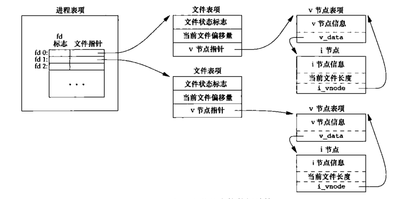
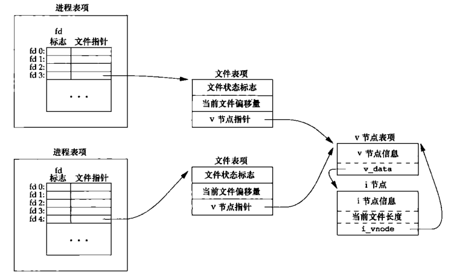
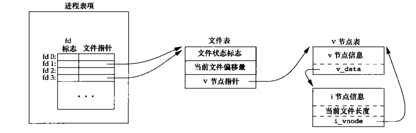
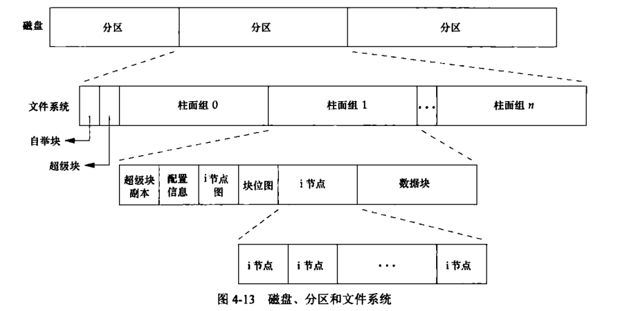
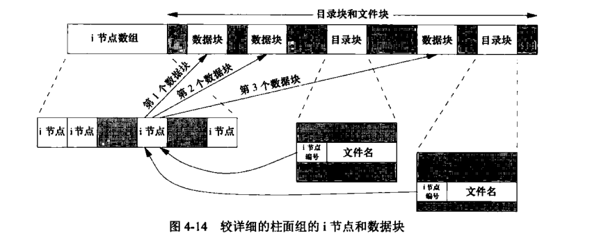
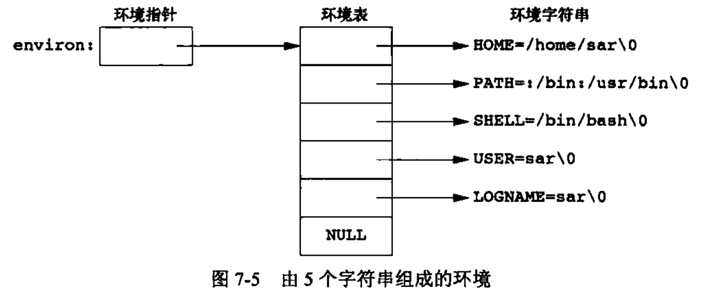
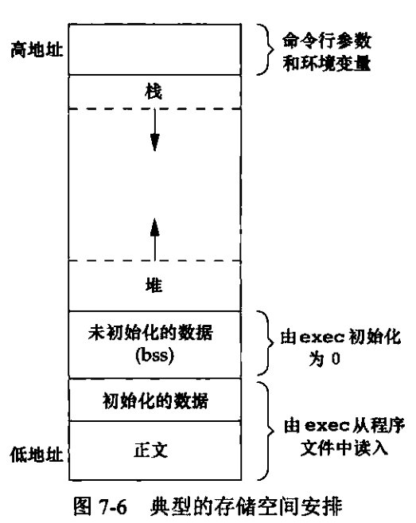
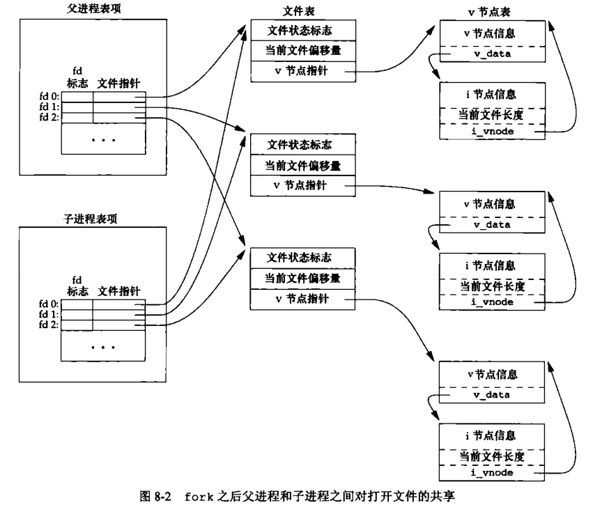
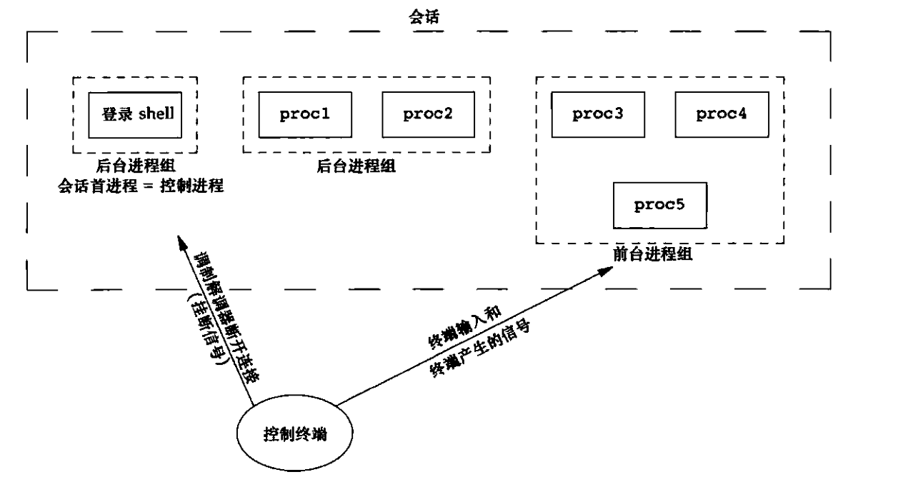
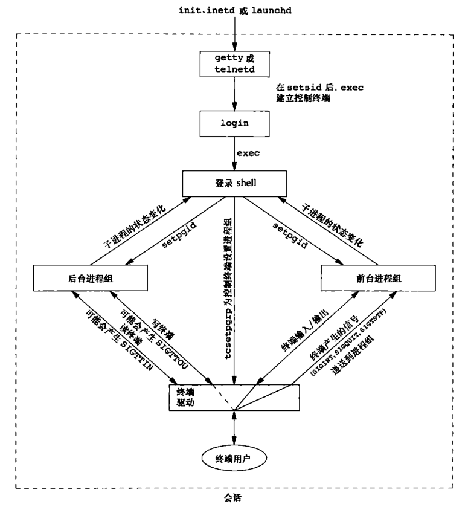

# Unix 环境高级编程(APUE)

## 概念

**文件描述符**：非负整数，操作系统内核用以标识一个特定进程正在访问的的文件。在读写文件时，可以使用这个文件描述符。

**不带缓冲的I/O**: 函数 open、read、write、lseek 以及 close 属于不带缓冲的 I/O

**标准I/O**：标准函数提供了带缓冲的接口。性能更好，是最佳选择。

**程序**：是一个存储在磁盘上某个目录的可执行文件。**内核使用 `exec` 函数将程序读入内存并执行**。

**进程和进程ID**：程序的执行者就是进程，系统在开启一个进程时都会分配一个唯一的数字标识符，即称为进程ID。

**进程控制**：通过系统提供的三个函数控制进程；`fork`、`exec`、`waitpid`

**线程和线程ID**：通常一个进程只有一个控制线程——**某一时刻执行的一组机器指令**。一个进程内的所有线程都共享同一个地址空间、文件描述符、栈以及进程相关的属性。

**用户ID**：一个非负整数的数字，标识一个用户。ID 为 0 表示用户为根用户（root）。

**组ID**：标识用户的组，被用于将若干用户集合到项目和部门中去。这种机制允许同组的各个成员之间共享资源（文件）。

**信号**：用于通知系统发生了某种情况。如中断处理信号，用 signal 函数捕获信号

**时间**

- **时钟时间**：也叫墙上时间（wall clock time）；它标识进程运行的时间总量。
- 用户 CPU 时间：表示执行用户指令所用的时间。
- 系统 CPU 时间：表示该进程执行内核程序所经历的时间。

**系统调用**：进入操作系统内核的入口函数

## 文件I/O

### 文件描述符

在 Unix 系统中，文件描述符约定成俗：

- 文件描述符0：表示进程的标准输入
- 文件描述符1：表示标准输入
- 文件描述符2：表示标准错误

### 文件共享

UNIX 系统支持不同的进程共享打开文件。

UNIX 内核使用三种数据结构表示打开的文件信息：

- 每个进程在进程表中都有一个记录项，记录项中包含一张打开**文件描述符表**，可将其视为一个矢量，每个描述符占用一项。与每个文件描述符相关联的是：
  - 文件描述符标志（close_on_exec）
  - **指向文件表项的指针**
- 内核为所有打开文件维持一个**文件表**。每个文件表项包含：
  - 文件状态标识（读、写、追加、同步和非阻塞）
  - 当前文件偏移量
  - **指向该文件 v 节点表项的指针**
- 每个打开文件（或设备）都有一个 v 节点（v-node）结构。v 节点包含了文件类型和对此文件进行各种操作函数的指针。这些信息都是在打开文件时从磁盘上读入内存的，所以文件相关的信息都是随时可用的

关系图如下



不同的进程打开同一个文件的结构图如下



每个进程打开文件时都有自己的文件描述符表（即图中的进程表项）和文件表项，单只有一个 v-node 表项。这是因为对于文件表项，每个进程都要有它自己对该文件的偏移量。

> 关于文件共享，在《深入理解计算机系统》也有深入讲到
>
> 具体详见：https://github.com/MarsonShine/Books/blob/8002f0865f6f93c29677971d579a87e62dfeca29/CSAPP/docs/io.md#%E7%B3%BB%E7%BB%9F%E7%BA%A7-io

> 多个进程对同一个文件并发写入怎么办？
>
> 一般情况下，进程A 访问文件 F 时，写入内容并将偏移量（调用 `lseek` 方法）移到了 1500 处，这是发生内核切换；进程 B 访问文件 F，并将 F 文件的当前偏移量从 1500 移到了 1600。因为内容已经写入，所以内核将 v-node 表项中的文件长度更新为 1600。然后内核又进行切换回到了进程 A，当 A 调用 `write` 时，就从其当前文件偏移量（1500）处开始将数据写入到文件。这样就覆盖了进程 B 刚写入的内容了。
>
> 所以要解决这种并发问题，我们要将 “定位文件当前位置，写” 这两个动作（函数）合并为一个函数，这样就成为了一个“**原子操作**”。也就是说当内核发生切换时，在写操作之前，都将进程的当前偏移量设置到该文件的结尾处。函数 `pread`,`pwrite `就是这个作用。

#### 如何共享同一个文件表项？



通过调用函数 `dup`、`dup2` 就可以复制一个已有的文件描述符。这些函数会返回新描述符与参数 fd **共享同一个文件表项**。

### 高速缓存一致性

UNIX 系统实现在内核中设有**缓冲区高速缓存**或**页高速缓存**，大多数磁盘 I/O 都通过缓冲区进行。当向文件写入文件时，**先将数据复制到缓冲区中，然后排入队列，稍后会写入磁盘**。这个过程称之为“**延迟写（delayed write）**”

有缓存就会带来数据一致性的问题，当内核需要重用缓冲区来存放其它磁盘的数据时，它会把所有延迟写数据块写入磁盘。为了保证磁盘上实际文件内容与缓冲区上的内容保持一致，UNIX 提供了 `sync、fsync` 和 `fdatasync` 三个函数同步数据。

## 文件和目录

文件类型分类如下：

1. 普通文件（regular file）。最常用的文件类型，这种文件包含了某种形式的数据（二进制还是文本格式）
2. 目录文件（directory file）。**这种文件包含了其它文件的名字以及指向这些文件有关信息的指针**。对一个目录文件具有读权限的任一进程都可以读该目录的内容，但只有内核可以直接写目录文件。
3. 块特殊文件（block special file）。这种类型的文件提供对设备（如磁盘）带缓冲的访问，每次访问以固定长度为单位进行。
4. 字符特殊文件（character special file）。该文件提供不带缓冲的访问，每次访问长度可变。系统中所有设备要么是字符特殊文件，要么是块特殊文件。
5. FIFO。该文件用于进程间通信，也成为命名管道（named pipe）
6. 套接字（socket）。这种文件类型用于进程间的网络通信。
7. 符号链接（symbolic link）。这种类型文件指向另一个文件。

### 文件访问权限

与进程相关的 ID 有 6 个或更多

- 实际用户ID
- 实际组ID

表示进程的所属

- 有效用户ID
- 有效组ID

用户文件访问权限检查

- 保存的设置用户ID
- 保存的设置组ID

由 exec 函数保存

------

`stat.st_mode` 表示对文件的访问权限。每个文件包含 9 个访问权限位，被分为 3 大类：

1. 用户权限
   1. S_IRUSR：用户读
   2. S_IWUSR：用户写
   3. S_IXUSR：用户执行
2. 组权限
   1. S_IRGRP：组读
   2. S_IWGRP：组写
   3. S_IXGRP：组执行
3. 其它权限
   1. S_IROTH：其它读
   2. S_IWOTH：其它写
   3. S_IXOTH：其它执行

如果进程拥有此文件（进程的有效用户 ID 等于文件的所有者 ID），则按用户访问权限批准或拒绝对该文件的访问。如果进程并不拥有该文件，但进程属于某个组，则按组访问权限进行授权和拒绝对该文件的访问。

#### 函数 access & faccessat

函数 `access` 和 `faccessat` 是按实际用户 ID 和实际组 ID 进行访问权限测试的。

## 文件系统

Unix 把磁盘分成一个或多个分区。每个分区都可以包含一个文件系统。i-node 是固定长度的记录项，包含了文件的大部分信息。



其中 i 节点和数据块结构如下图：



上图显示有多个目录块同时指向一个 i 节点。每个 i 节点都有一个链接计数器，表示的就是指向该节点的目录块数。**只有当 i 节点的链接计数器显示为 0 时才能删除该文件。**这也就解释了为什么“解除对一个文件的链接”操作并不意味着“释放该文件所占用的磁盘块”。因此删除目录项的函数被称为 `unlink`。

> 还有一种链接是符号链接(symbolic link)。符号链接文件的实际内容（在数据块中）包含了该符号链接所指向的文件名字。

i 节点包含了文件有关的所有信息：**文件类型**、**文件访问**、**文件访问权限**、**文件长度**和**指向文件数据块的指针**等。`stat` 结构中的大多数信息都取自 i 节点。只有两项重要数据放在目录项中：文件名和 i 节点编号。

当在不更换文件系统的情况下为一个文件重命名，该文件的实际内容并为移动，只需要构造一个指向现有 i 节点的新目录块，并删除老的目录块。这样 i 节点的链接计数不用改变。

> 内核是如何删除文件的？
>
> **只有当链接计数为 0 时，该文件的内容才可以删除**。另一个条件也会阻止删除文件的内容：只要有进程打开了这个文件，其内容也不能删除。关闭一个文件时，内核首先检查打开该文件的进程个数；如果进程个数为 0，内核再去检查其链接个数；如果链接计数也为 0，那么就可以删除该文件的内容。

## 符号链接

符号链接是对一个文件的间接指针，它与硬链接有所不同，硬链接直接指向文件的 i 节点。引入符号链接的原因是为了避开硬链接的一些限制：

- 硬链接要求链接和文件位于同一个文件系统。
- 只有超级用户才能创建指向目录的硬链接（在底层文件系统支持的情况下）

对符号链接以及指向它向何种对象并无任何文件系统限制，任何用户都能创建指向目录的符号链接。

```sh
mkdir foo					# 创建一个新目录
touch foo/a					# 创建一个 0 长度的文件
ln -s ../foo foo/testdir	# 创建一个符号链接
ls -l foo
```

我们可以凭空创建一个符号链接，通过 `ls` 就能查看到具体的文件信息：

```sh
ln -s /no/such/file myfile	# 创建一个符号链接
ls myfile	# 查看一个本不存在的文件
cat myfile	# 查看文件内容
ls -l myfile	# 查看文件属性
```

ls 提示文件 myfile 存在，但是 cat 文件时却会报没有文件的错误。其原因就是因为 myfile 符号链接导致的。

## 标准I/O库

### 临时文件

使用 `tmpnam` 和 `tempnam` 都存在一个问题：在返回唯一的路径名和用该名字创建文件之间存在一个窗口期，在这个时间窗口内，可能会存在另一个进程用相同的文件名创建文件。这个时候就应该使用 `tmpfile` 和 `mkstemp` 函数创建文件就可以避免这个问题。

## 时间和日期

unix 系统内核提供的时间服务是计算自协调世界时(Coordinated Universal Time, UTC)公元 1970 年 1 月 1 日 00:00:00 这一特定时间以来经过的秒数。

## main 函数执行

c 程序总是从 main 函数执行的。

```c
int main(int argc, char *argv[]);
```

其中 argc 是命令行参数的数目，argv 是指向参数的各个指针所构成的数组。

当内核执行 c 程序时（使用的是 exec 函数），在调用 main 之前会先调用一个特殊的**启动例程**。**可执行程序文件将此启动例程指定为程序执行的起始地址**——这是由连接编辑器设置的，而连接编辑器则由 c 编译器调用。启动例程从内核取得命令行参数和环境变量值，然后为调用 main 函数做好准备。

### 进程终止

进程终止包含三个方面：

1. 正常终止：1）从 main 返回。2）调用退出函数；如（`exit`,`_exit`,`_Exit`）
2. 多线程：1）最后一个线程从启动例程返回。2）从最后一个线程调用 `pthread_exit`
3. 错误异常：1）调用 `abord`。2）接到一个信号。3）最后一个线程对取消请求做出响应

当执行一个程序时，调用 `exec` 的进程可以将命令行参数传递给新的程序。

> 当进程调用 `exec` 函数时，该进程被完全替换为新程序。
>
> 注意，调用 exec 函数并不创建新进程，所以前后进程的 ID 并没有改变。

### 环境表

每个程序都会接受一个**环境表**。与参数表一样，环境表也是一个**字符指针组**，其中每个指针包含一个以 null 结束的 C 字符串的地址。全局变量 `environ` 包含了该指针数组的地址：`extern char **environ`



## C 程序的存储空间

C 程序一直是由以下几个部分组成：

- **正文段**。这是由 CPU 执行的机器指令部分。通常，正文段是可共享的，所以即使是频繁执行的程序在存储器中也只需要有一个副本，**并且正文段是只读的，目的是为了防止篡改**。

- **初始化数据段**。它包含了程序中明确地赋初值的变量。

- **未初始化数据段**。即 bss 段，这一名称来源于早期汇编程序一个操作符，意思是“由符号开始的块”（block started by symbol），在程序开始执行之前，内核将此段中的数据初始化为 0 或空指针。如函数外的申明：`long sum[1000]`，这种变量就存储在非初始化数据段中。

- **栈。自动变量以及每次函数调用时所需保存的信息都保存在此段中。每次函数调用时，其返回地址以及调用者的环境信息（如某些机器寄存器的值）都存放在此段中**。

  在函数调用时会在栈上自动分配临时变量。比如在调用递归函数时，每次调用自身时都会开辟新的栈帧，因此一次函数调用中的变量集不会影响另一次函数调用所用的变量集。

- **堆。**一般进行动态存储分配。

其经典的结构图如下：



## 存储空间分配

unix 系统中有三个函数用于**存储空间动态分配**。

1. `malloc`，分配指定字节数的存储区。此存储区中的初始值不确定。
2. `calloc`，为指定数量指定长度的对象分配存储空间。该空间中的每一位（bit）都初始化为 0。
3. `realloc`，增加或减少以前分配区的长度。当增加长度时，可能需要将以前分配区的内容复制到另一个足够大的分配区（扩容操作）。

函数 `free` 释放指针指向的存储空间。被释放的空间会被送入可用至**存储区池**，以方便后续在某个时候调用上述三个方法进行再分配。

## 资源限制函数

每个进程都有一组资源限制，分为软硬两种类型：

- 软限制
- 硬选址

```
struct rlimit {
	rlim_t rlim_cur;	// 软限制
	rlim_t rlim_max;	// 硬限制
}
```

在更改资源限制时，必须要求满足下面要求：

1. 任何一个进程都可以将一个软限制值更改为小于或等于硬限制值。
2. 任何一个进程都可以降低硬限制值，但它必须大于或等于软限制值。
3. 只有超级用户才可以提高硬限制值。

| 限制              | 描述                                                         |
| ----------------- | ------------------------------------------------------------ |
| RLIMIT_AS         | 进程总的可用存储空间的最大长度。（`sbrk`,`mmap`）            |
| RLIMIT_CORE       | core文件的最大字节数，如果值为0，则阻止创建文件              |
| RLIMIT_CPU        | CPU时间的最大量值（秒），当超过软限制值时，向进程发送`SIGXCPU`信号 |
| RLIMIT_DATA       | 数据段的最大字节长度（初始化数据+非初始化+堆）。             |
| RLIMIT_FSIZE      | 可以创建的文件的最大字节长度。当超过此软件时，则向该进程发送`SIGXCPU`信号。 |
| RLIMIT_MEMLOCK    | 一个进程使用`mlock(2)`能够锁定在存储空间中的最大字节长度。   |
| RLIMIT_MSGQUEUE   | 进程为POSIX消息队列可分配的最大存储字节数。                  |
| RLIMIT_NICE       | 为了影响进程的调度优先级，nice可设置为最大值。               |
| RLIMIT_NOFILE     | 每个进程能打开的最大文件数。更改此限制将影响到`sysconf`函数在参数`_SC_OPEN_MAX`返回的值 |
| RLIMIT_NPROC      | 每个实际用户ID可拥有的最大子进程数                           |
| RLIMIT_NPTS       | 用户可同时打开的伪终端的最大数量。                           |
| RLIMIT_RSS        | 最大驻内存集字节长度（resident set size in bytes）。如果可用物理存储器很少，则内核将从进程处取回超过RSS的部分 |
| RLIMIT_SBSIZE     | 在任意给定时刻，一个用户可以占用的套接字缓存区的最大长度（字节） |
| RLIMIT_SIGPENDING | 一个进程可排队的信号最大数量。这个限制时 sigqueue 函数实施的。 |
| RLIMIT_STACK      | 栈的最大字节长度。                                           |
| RLIMIT_SWAP       | 用户可消耗的交换空间的最大字节数。                           |
| RLIMIT_VMEM       | 进程总的可用存储空间的最大长度。（`sbrk`,`mmap`）            |

### 为什么不能将一个指针返回给一个自动变量？

**因为当函数返回时，原本该函数所用的存储空间将由下一个调用的函数的栈帧所使用。所以如果还存在其它部分引用这部分的地址，这就会产生冲突和混乱。所以这个时候应该使用全局存储空间为这些变量分配空间。**

## 进程部分

系统中有一些专用进程。

进程 ID 为 0 的进程通常是**调度进程**，通常也被称为交换进程（swapper）。**该进程是内核的一部分**，它不执行任何磁盘上的程序，因此也被称为系统进程。

进程 ID 为 1 的进程通常是 `init` 进程，在自举过程结束时由内核调用。init 进程通常读取与系统相关的初始化文件（`/etc/rc*`，`/etc/inittab`，`/etc/init.d`等文件）,并将系统引导到一个状态。**init 进程不会终止**。注意，init 进程是用户进程而非内核进程。

还有如进程 ID 为 2 的页守护进程（paged daemon），负责支持虚拟存储器系统的分页操作。

### fork

一个进程调用 `fork` 函数会创建一个新的进程。

fork 函数被调用一次，会返回两次。两次返回的区别是：**子进程返回的是 0，而父进程返回值则是新建子进程的进程 ID。**

子进程和父进程都继续执行 fork 调用之后的指令。子进程是父进程的副本。例如，子进程获得父进程的数据空间、堆、栈的副本。

> 注意：是子进程所拥有父进程的副本，不是共享相同的存储空间。

**当子进程要修改某些数据时，就会触发写时复制（COW），内核为该修改的区域生成一个副本（通常是虚拟存储系统的一“页”）供子进程修改。**也即就是说，在子进程对变量做出的修改是不会影响到父进程中该变量中的值。

#### fork 下的文件共享

fork 还有一个特性是：父进程打开的所有文件描述符都会被复制到子进程中，共享同一个文件的偏移量。那么当父子进程同时对该文件进行写操作该如何呢？

如果父进程的标准输出已重定向，那么子进程写到该标准输出时，它将更新与父进程共享的该文件的偏移量。假设当父进程等待子进程时，子进程写到标准输出，而在子进程终止后，父进程也会写到标准输出上，并且知道其输出会追加在子进程所写的数据之后。

> 当两个进程对同一个文件进行写操作，会发生内容覆盖。如果要拒绝这种情况发生，应该使用文件锁定机制。



如果父进程和子进程各自执行不同的程序段，那么在这种情况下，父进程和 fork 子进程会各自关闭它们不需使用的文件描述符，这样就不会干扰对方使用文件描述符了。

fork 一般有两种用法：

1. 一个父进程希望复制自己，使父进程和子进程同时执行不同的代码段。这在网络服务进程中非常常见，父进程等待客户端的服务请求。当请求到达时，父进程调用 `fork`，使子进程处理此请求。父进程则继续等待下一个服务请求。
2. 一个进程要执行不同的程序。这是对 `shell` 是常见的情况。在这种情况下，子进程从 `fork` 返回后立即调用 `exec`。

> 还有一个函数与 `fork` 相似 —— `vfork`。
>
> vfork 创建一个新进程，但是它是用于执行 `exec` 一个新程序。但是它并不将父进程的地址空间完全复制到子进程中，所以不能用它来修改数据等。
>
> 值得注意的是，**vfork 保证了子进程先运行**，在它调用了 `exec` 或 `exit` 之后父进程才有可能被调度执行。

### 进程终止

进程终止的时候如何通知其它父进程呢？

程序终止的时候，会通过将**“退出状态”**传参过去，然后内核会产生一个**“终止状态”**来说明异常终止的原因。这样其该进程的父进程就能通过 `wait/waitpid` 方法获取这个状态。

> 这种方式通过**“信号（SIGCHLD）”**实现的。信号是一种软中断，用于通知进程发生了某件事。该子进程终止时，它会向父进程发送一个 SIGCHLD 信号。然后父进程就能通过 `wait/waitpid` 等系统调用来等待子进程终止并处理 SIGCHLD 信号。

那么如果父进程在子进程之前终止会发生什么呢？

**内核会将该进程的父进程都会改为 init 进程。这是因为在 Linux 中，每个进程都必须有一个父进程，而当父进程终止时，内核需要将该进程的父进程设置为其他进程。如果没有其他进程可用，则将其设置为 init 进程。init 进程是所有进程的祖先，它是系统启动时第一个运行的用户级进程。**

> 在 Linux 中，当父进程在子进程终止之前终止时，内核会将该进程的父进程都会改为 init 进程。**这意味着子进程不会立即终止，而是由 init 进程领养**。如果子进程已经终止，则它们将成为**孤儿进程**，并由 init 进程收养。
>
> **孤儿进程：一个父进程退出，而它的一个或多个子进程还在运行，那么那些子进程将成为孤儿进程。孤儿进程将被 init 进程所领养，并由 init 进程对它们完成状态收集工作。**具体表现为：init 进程会循环调用 `wait/waitpid`。这样当知道该进程的终止状态后就会进而处理后续的清理工作。
>
> **僵死进程：一个进程使用 fork 创建子进程，如果子进程退出，而父进程并没有调用 wait 或 waitpid 获取子进程的状态信息，那么子进程的进程描述符仍然保存在系统中。这种进程称之为僵死进程。**

### waitid vs waitpid

`waitid` 和 `waitpid` 都是等待子进程的状态改变。`waitpid` 可以控制它所等待的进程，而 `waitid` 提供了更精确的控制，**可以选择等待哪个子进程的状态改变**。`waitid` 可以通过 `idtype` 和 `id` 这两个参数选择要等待的子进程。例如，`idtype == P_PID` 表示等待进程 ID 与 id 匹配的子进程。

> 关于 waitid 函数参数详解，可见：[Ubuntu Manpage: wait, waitpid, waitid - wait for process to change state](https://manpages.ubuntu.com/manpages/focal/en/man2/wait.2.html)

### 多进程竞争

如果一个进程希望等待一个子进程终止，则它必须调用 wait 函数中的一个。如果一个进程要等待其父进程终止，则可以使用如下代码：

```c++
while (gettpid() != 1)
	sleep(1)
```

很显然，这种轮询的方式非常耗费 CPU 资源。为此，UNIX 提供一种**信号**发送和接收的方法避免这种情况。

fork 在通常情况下，经常会遇到父子进程互相协作的场景。如父进程会用子进程 ID 更新日志文件中的一个记录，而子进程则可能要为父进程创建一个文件。**所以在一个进程完成操作之后要通知到对方，并且在继续运行之前，要等待另一方完成其操作**。示例代码如下：

```c
#include "apue.h"
TELL_WAIT(); // 为 TELL_XXX 和 WAIT_XXX 设置事情。
if ((pid = fork()) < 0)
    err_sys("fork error");
else if (pid == 0) { // 子进程
    // 子进程继续执行要做的事情 ...
    TELL_PARENT(getppid()); // 通知父进程
    WAIT_PARENT(); // 等待父进程
    // 子进程继续执行
    exit(0);
}
// 父进程继续执行要做的事情 ...
TELL_CHILD(pid);    // 通知子进程
WAIT_CHILD();// 等待子进程
// 父进程继续执行
exit(0);
```

通过一个例子来查看多进程发生竞争时会发生什么？以及如何通过信号修复。

一个由子进程输出，另一个由父进程输出：

```c
#include "apue.h"

static void charatatime(char *);

int main(void)
{
    pid_t pid;
    if ((pid == fork()) < 0) {
        err_sys("fork error");
    } else if (pid == 0) { // 子进程
        charatatime("output from child\n");
    } else {// 父进程
        charatatime("output from parent\n");
    }
    exit(0);
}

static void charatatime(char *str)
{
    char *ptr;
    int c;
    setbuf(stdout, NULL); // 设置无缓冲
    for (ptr = str; (c = *ptr++) != 0;)
        putc(c, stdout);
}
```

fork 之后无法控制两个进程的执行顺序，所以在执行过程会频繁的在两个进程之间切换。

下面是通过信号机制来避免竞争问题的代码段：

```CQL
#include "apue.h"

static void charatatime(char *);

int main(void)
{
    pid_t pid;
    TELL_WAIT();
    if ((pid == fork()) < 0) {
        err_sys("fork error");
    } else if (pid == 0) { // 子进程
        WAIT_PARENT(); // 等待父进程
        charatatime("output from child\n");
    } else {// 父进程
        charatatime("output from parent\n");
        TELL_CHILD(pid);    // 通知子进程
    }
    exit(0);
}

static void charatatime(char *str)
{
    char *ptr;
    int c;
    setbuf(stdout, NULL); // 设置无缓冲
    for (ptr = str; (c = *ptr++) != 0;)
        putc(c, stdout);
}
```

### 解释器

Unix 解释器是一种文本文件，其起始行的形式是：`#! pathname [optional-argument]`。其中 pathname 是绝对路径显示指定，就是解释器。所有的 UNIX 系统都支持解释器文件。最常用的就是 `#! /bin/sh`。解释器文件可以将程序隐藏起来，也就是说解释器文件本身是一个程序，可以被解释器（/bin/sh）编译的文件，在 UNIX 最常见的就是 shell 脚本。

### 切换用户ID和用户组ID

在UNIX系统中，每个进程都有一个**有效用户 ID** 和一个**有效组 ID**，用于确定该进程的权限。如果进程需要执行需要更高权限的操作，则需要更改其用户ID和组ID。例如，一个普通用户不能更改系统中的某些文件，但是如果该用户更改了自己的用户 ID和组 ID，就可以获得更高的权限并更改这些文件。

下面是一个 at 程序的示例，at 程序用于在指定的时间运行某个命令。该示例程序需要更高的权限才能创建和写入 at 作业文件，因此需要更改其用户 ID和组 ID：

```c
#include <stdio.h>
#include <stdlib.h>
#include <unistd.h>

int main(int argc, char *argv[]) {
    uid_t uid;
    gid_t gid;

    if (argc < 3) {
        fprintf(stderr, "Usage: %s time command [arg ...]\n", argv[0]);
        exit(EXIT_FAILURE);
    }

    uid = getuid();
    gid = getgid();

    seteuid(getuid());
    setegid(getgid());

    /* create and write to at job file */
    /* ... */

    seteuid(uid);
    setegid(gid);

    return 0;
}
```

在这个示例程序中，首先获取了当前进程的用户 ID 和组 ID，然后调用 `seteuid` 和 `setegid` 函数将进程的有效用户 ID 和有效组 ID 更改为当前用户 ID 和组 ID。

然后，程序创建和写入 at 作业文件，完成操作后再将进程的有效用户 ID 和有效组 ID 更改回原始值。

这样，该程序就可以在需要更高权限的情况下执行特定的操作，并在完成后恢复进程的原始权限，以确保安全性。

### 进程调度

进程调度是基于调度优先级的粗粒度机制。调度策略和调度优先级是由内核决定的。进程可以通过调整 `nice` 值选择以更低的优先级运行（调整 `nice` 值降低它对 CPU 的占用情况）。

进程可以通过调用 `nice` 函数来获取或更改值（只影响该进程的调度优先级，不影响其它进程）。

### 进程组

每个进程组有一个组长进程，组长进程的进程组 ID 就是创建进程组时进程 ID。

进程组组长可以创建一个进程组、创建该组中的进程，然后终止。只要在该组中还有任意一个进程，则该进程组就一直存在，这与创建该进程组的组长进程是否终止无关。从进程组创建开始到其中最后一个进程离开为止的时间区间就称为进程组的生命周期。某个进程组的最后一个进程可以终止也可以转移到另一个进程组。

### 控制终端



程序与控制终端交互，必须通过执行 `open("/dev/ttyN")` 函数实现交互。当然如果进程中没有一个控制终端，那么 `/dev/tty` 就不可用。

> UNIX 系统中的 `/dev/tty` 是一个特殊的文件，它表示当前进程的终端。它不一定是一个虚拟控制台设备（即 `/dev/tty n`），也可以是一个伪终端，一个串口等。如果你的进程没有一个终端，那么 /dev/tty 文件就不可用。比如守护进程就是这样的。你可以从 /dev/tty 读取和写入数据实现与终端的交互。

前台、后台作业以及终端驱动程序的作业控制流程：



### 孤儿进程组

前面已经说到什么是孤儿进程；而孤儿进程组是指一个进程组中所有进程的父进程都已经终止，而它们自己还在运行。这种情况下，内核会向该进程组中的每个进程发送一个 `SIGHUP` 信号，然后再发送 `SIGCONT` 信号，这样就能结束这些进程了。

> 为什么要结束孤儿进程？
>
> 当一个终端控制进程终止后，那么这个终端可以用来建立一个新的会话。这就会产生潜在的问题：原来旧的会话（一个或者多个进程组的集合）中的任意一个进程可以再次访问这个终端。所以为了防止这类问题的产生，就引入了孤儿进程组的概念。

> SIGHUP 是一种终止信号，它会让进程停止运行并退出。当内核向一个进程组中的每个进程发送 SIGHUP 信号时，这些进程会收到一个挂起信号，然后再收到一个 SIGCONT 信号，以此来结束这些进程。
>
> SIGCONT 是一个继续信号，它会让一个被挂起的进程继续运行。当内核向一个进程组中的每个进程发送 SIGHUP 信号时，这些进程会收一个挂起信号，然后再收到一个 SIGCONT 信号，以此来结束这些进程。

## 信号

### 中断的系统调用

当进程正在执行一个低俗系统调用而阻塞期间捕获到了一个信号，则该系统调用就会被中断而不再继续执行。该系统调用返回出错，其 errno 设置为 EINTR。系统将系统调用为两类：低速系统调用和其它系统调用；低速系统调用是指进程可能会永久阻塞的一类系统调用，包括：read、write、open、select、wait 等。对于这些函数，如果他们被中断，则可以**重启**他们。

这样会提高计算机的运行效率，它协调了外部设备速度慢和 CPU 处理速度块的矛盾，维持系统可靠正常运行。如果遇到异常情况，CPU 可以通过发起中断来维持系统稳定，满足实时处理要求，可以保证一些处理优先级高的程序优先处理。

### 可重入函数

可重入函数是指一个可以被多个任务调用的过程，任务在调用时不用担心数据是否出错。一个可重入的函数简单来说就是**可以被中断的函数**，也就是说，可以在这个函数执行的任何时刻中断它，转入 OS 调度下去执行另一段代码，而返回控制时不会出现什么错误。

而不可重入的函数由于使用了一些系统资源，如全局变量区，中断向量表等，所有它被中断的话，可能会出现问题，这类函数时不能运行在多任务环境下的。

> 通俗的讲：
>
> 可重入函数是指在多线程或信号处理程序中可以被安全地并发调用的函数。这些函数不会使用任何静态数据，也不会修改任何全局变量，因此可以被多个线程或信号处理程序同时调用，而不会出现竞争条件。
>
> 不可重入函数是指在多线程或信号处理程序中不能被安全地并发调用的函数。这些函数可能使用静态数据或全局变量，或者在执行期间修改它们，因此不能同时被多个线程或信号处理程序调用，否则可能会出现竞争条件和数据损坏。

### 信号集

每个进程都有一个信号屏蔽字（signal mask），它规定了当前要阻塞递送到该进程的信号集。对于每种可能的信号，该屏蔽字都有一位与之对应。对于某种情况，若对应其位置，则它当前是被阻塞的。进程可以调用 sigprocmask 来检测和更改其当前信号屏蔽字。

#### kill & raise

`kill` 函数的第一个参数 `pid` 可以有四种不同的情况：

1. `pid > 0`：发送信号给进程 ID 为 `pid` 的进程。
2. `pid == 0`：发送信号给与调用进程属于同一进程组的所有进程，但不包括调用进程本身。
3. `pid == -1`：发送信号给所有有权向其发送信号的进程，除了进程 ID 等于 1 的进程（init 进程）。
4. `pid < -1`：发送信号给进程组 ID 等于 `pid` 绝对值的所有进程，但不包括发送进程本身。

这些情况可以用于不同的场景，例如向指定进程发送信号、向同一进程组的所有进程发送信号、向所有进程发送信号等。

> raise(signo) 就等价于 kill(getpid(), signo)

#### sigprocmask

```c
void pr_mask(const char *str)
{
    sigset_t sigset;
    int errno_save;

    errno_save = errno; // 保存 errno
    if (sigprocmask(0, NULL, &sigset) < 0) {
        err_ret("sigprocmask error");
    } else {
        printf("%s", str);
        if (sigismember(&sigset, SIGINT)) // 检查 SIGINT 信号是否在信号屏蔽字中
            printf(" SIGINT");
        if (sigismember(&sigset, SIGQUIT)) // 检查 SIGQUIT 信号是否在信号屏蔽字中
            printf(" SIGQUIT");
        if (sigismember(&sigset, SIGUSR1)) // 检查 SIGUSR1 信号是否在信号屏蔽字中
            printf(" SIGUSR1");
        if (sigismember(&sigset, SIGALRM)) // 检查 SIGALRM 信号是否在信号屏蔽字中
            printf(" SIGALRM");

        /* remaining signals can go here  其他信号可以在这里添加 */

        printf("\n");
    }

    errno = errno_save; // 恢复 errno
}
```

`sigprocmask(0, NULL, &sigset)` 是一个系统调用，它的作用是获取或修改进程的信号屏蔽字。其中第一个参数 0 表示不修改信号屏蔽字，第二个参数为 NULL 表示不需要保存原来的信号屏蔽字，第三个参数 &sigset 表示获取当前的信号屏蔽字并保存到 sigset 变量中。

如果 `sigprocmask` 调用成功，返回值为 0，否则返回值为 -1，并且设置全局变量 errno 表示错误原因。因此，`sigprocmask(0, NULL, &sigset) < 0` 的判断就是判断 `sigprocmask` 调用是否失败。如果失败，就会执行 `err_ret("sigprocmask error")` 函数，打印错误信息并退出程序。如果成功，就会继续执行后面的代码，打印当前进程的信号屏蔽字中包含哪些信号。

#### sigsetjmp & siglongjmp

在信号处理程序中，当一个信号到达时，内核会中断当前进程的正常执行流程，转而执行信号处理程序。在信号处理程序中，如果直接使用 `longjmp` 函数进行跳转，会导致一些问题，例如跳转后的代码可能会覆盖一些寄存器的值，从而影响到原来的程序执行流程。这种跳转方式被称为“非局部转移”。

为了解决这个问题，我们可以使用 `sigsetjmp` 和 `siglongjmp` 这两个函数。它们与 `setjmp` 和 `longjmp` 函数的作用类似，**但是它们会保存和恢复信号屏蔽字，从而保证在跳转后，进程的信号屏蔽字不会被改变，从而避免了一些潜在的问题。**

因此，在信号处理程序中，如果需要进行跳转，应当使用 `sigsetjmp` 和 `siglongjmp` 这两个函数，而不是 `setjmp` 和 `longjmp` 函数。

#### abord 

`abort`函数用于异常终止程序的执行。当程序调用 `abort` 函数时，它会向进程发送一个 `SIGABRT` 信号，导致进程异常终止。在进程异常终止时，会执行一些清理工作，例如关闭打开的文件、释放分配的内存等。

`abort` 函数的主要作用是在程序出现无法恢复的错误时，快速地终止程序的执行。例如，当程序遇到一个无法处理的错误时，可以调用 `abort` 函数来终止程序的执行，以避免进一步的错误发生。

需要注意的是，`abort` 函数不会执行任何清理工作，例如关闭文件或释放内存。因此，在调用 `abort` 函数之前，应该先执行必要的清理工作，以避免资源泄漏等问题。

## 线程

### 自选锁

自旋锁在**非抢占式内核**中是非常有用的：除了提供互斥机制之外，它们会阻塞中断，这样中断处理程序就不会让系统陷入死锁状态，因为它需要获取已被加锁的自旋锁（把中断想成是另一种抢占）。在这种类型的内核中，中断处理不能休眠，因此它们能用的同步原语只能是自旋锁。

但是在用户层，自旋锁就不是很有用了。运行在分时调度类中的用户层线程在两种情况下可以取消调度：当它们的时间片到期时，或者具有更高调度优先级的线程就绪变成可运行时。在这些情况下，如果线程拥有自旋锁，它就会进入休眠状态，阻塞在锁上的其它线程自选的时间可能要比预期的时间要长。

### 屏障（barrier）

屏障是用户协调多个协程并行工作的同步机制。屏蔽允许每个线程等待，直到协作所有线程都到达某一点，然后从该点继续执行。`pthread_join` 方法就是一种屏障，允许一个线程等待，直到另一个线程退出。

屏障对象的概念更广，它们允许任意数量的线程等待，直到所有线程完成处理的工作，而线程也不需要退出。所有线程到达屏障后可以继续工作。