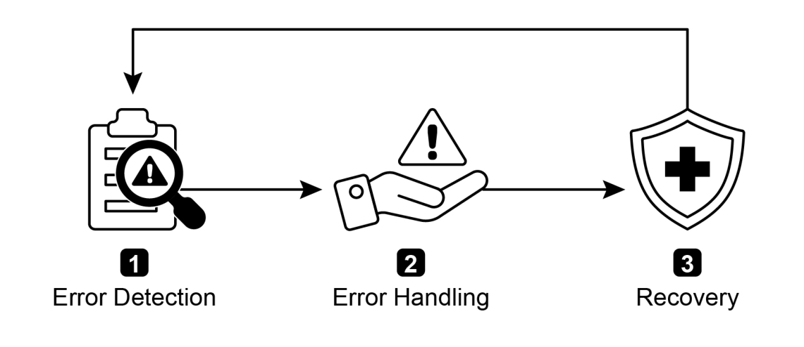
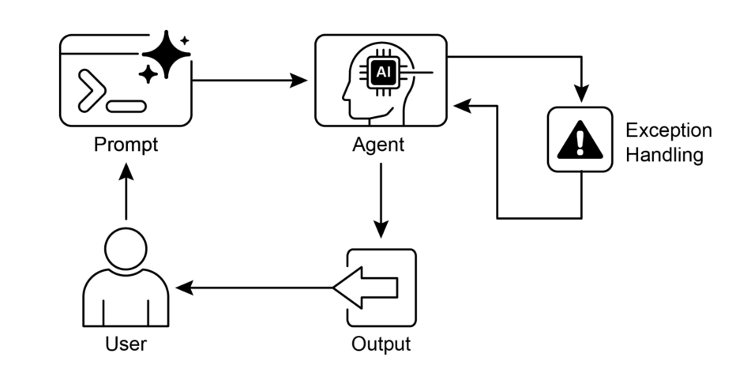

# 第十二章：异常处理与恢复机制

为确保智能体在多样化的现实环境中可靠运行，必须使其能够应对突发状况、错误及系统故障。正如人类能适应意外障碍，智能体需要配备健全的机制来检测问题、启动恢复程序，或至少确保受控的失效流程。这一核心需求构成了"异常处理与恢复"模式的基础。

该模式致力于构建具备超强韧性与自适应能力的智能体，使其在各类异常与困难情境下仍能维持不间断的功能运行与操作完整性。它强调通过前瞻性预案与响应式策略的结合，保障系统持续稳定运作，即便面临挑战也不中断。这种适应能力对智能体在复杂多变环境中成功运作至关重要，最终提升其综合效能与可信度。

处理突发事件的能力不仅确保AI系统具备智能性，更赋予其稳定可靠的特性，从而增强用户对系统部署与性能的信心。集成全面监控与诊断工具可进一步强化智能体快速识别和解决问题的能力，预防潜在运行中断，确保在动态变化条件下实现更平滑的操作。这类先进系统对维护AI操作的整体性与高效性具有关键作用，持续增强其应对复杂性与不确定性的能力。

该模式常与"反思机制"结合使用。例如当首次尝试失败触发异常时，反思流程可分析故障原因，并通过优化策略（如改进提示词）重新执行任务，从而解决错误。

## 异常处理与恢复模式概述

异常处理与恢复模式旨在解决AI智能体应对运行故障的需求。该模式需预先识别潜在问题（如工具错误、服务不可用等），并制定相应缓解策略，包括错误日志记录、重试机制、备用方案、优雅降级及通知告警等。同时强调通过状态回滚、根因分析、自我修正与问题升级等恢复机制，使智能体回归稳定运行状态。实施此模式可显著提升AI智能体的可靠性与鲁棒性，使其在不确定环境中持续运作。典型应用场景包括：聊天机器人处理数据库错误、交易机器人应对金融数据异常、智能家居代理解决设备故障等。该模式确保智能体在遭遇复杂性与故障时仍能保持有效运行。



图1：AI智能体异常处理与恢复核心组件

### 错误检测

通过精细监控实时识别运行异常，具体表现为：工具输出无效或格式错误、特定API错误（如404/500状态码）、服务响应超时、返回内容逻辑混乱或偏离预期格式等。还可引入其他智能体或专用监控系统进行主动异常探测，在问题升级前及时拦截。

### 错误处理

发现错误后需执行预设响应方案：将错误细节完整记录至日志供后续分析（日志记录）；对瞬时错误尝试重试操作（可调整参数）；启用备用方案维持部分功能（降级应对）；若无法立即完全恢复，则保持有限功能运行（优雅降级）；必要时向管理员或其他智能体发送告警（通知机制）。

### 恢复机制

此阶段致力于使系统恢复稳定运行：通过回滚近期变更消除错误影响（状态回滚）；深入分析根本原因以防复发；借助自修正机制调整智能体逻辑或参数（重新规划）；复杂场景下可将问题移交人工或上级系统处理（升级机制）。

通过实施这套健全的异常处理与恢复模式，AI智能体可从脆弱系统转变为强韧可靠的运行组件，即使在高度不确定的挑战性环境中也能保持高效运作与快速恢复能力，最大限度减少停机时间，确保用户获得持续稳定的服务体验。

## 实际应用与典型案例

异常处理与恢复机制对于部署在非理想现实场景中的智能体至关重要，以下是典型应用场景：

- **客服聊天机器人**

  当聊天机器人访问客户数据库遭遇服务临时中断时，不应直接崩溃，而需检测API错误、告知用户当前系统异常，可建议稍后重试或将问题转接人工客服。

- **自动化金融交易**

  交易机器人在执行订单时若触发"资金不足"或"市场休市"错误，需记录异常日志，避免重复无效操作，同时通知用户或自动调整投资策略。

- **智能家居控制**

  控制智能灯具的代理因网络故障或设备失灵无法开灯时，应检测失败状态并进行重试。若持续未响应，则通知用户操作失败并建议人工干预。

- **数据处理代理**

  批处理文档时若发现文件损坏，代理应跳过异常文件并记录错误，继续处理其他文件，最终汇总报告失效文件而非中断整个流程。

- **网络爬虫代理**

  遭遇验证码、网页结构变更或服务器错误（如404/503）时，需通过暂停操作、切换代理或记录失效链接等方式实现优雅应对。

- **工业机器人**

  机械臂抓取组件因定位偏差失败时，需通过传感器反馈检测异常，尝试重新校准并重试操作。若持续失败则预警操作员或切换备用组件。

总之，该模式是构建智能体的基石，使其在现实复杂场景中不仅具备智能性，更拥有可靠性与韧性，最终实现用户友好的交互体验。

## 实践代码示例（ADK）

异常处理与恢复机制对系统鲁棒性与可靠性至关重要。以智能体应对工具调用失败为例，此类故障可能源于工具输入错误或依赖的外部服务异常。

```python
from google.adk.agents import Agent, SequentialAgent
# Agent 1: Tries the primary tool. Its focus is narrow and clear.
primary_handler = Agent(
    name="primary_handler",
    model="gemini-2.0-flash-exp",
    instruction="""
Your job is to get precise location information.
Use the get_precise_location_info tool with the user's provided
address.
    """,
    tools=[get_precise_location_info]
)
# Agent 2: Acts as the fallback handler, checking state to decide its
action.
fallback_handler = Agent(
    name="fallback_handler",
    model="gemini-2.0-flash-exp",
    instruction="""
Check if the primary location lookup failed by looking at
state["primary_location_failed"].
- If it is True, extract the city from the user's original query and
use the get_general_area_info tool.
- If it is False, do nothing.
	""",
	tools=[get_general_area_info]
)

# Agent 3: Presents the final result from the state.
response_agent = Agent(
    name="response_agent",
    model="gemini-2.0-flash-exp",
    instruction="""
Review the location information stored in state["location_result"].
Present this information clearly and concisely to the user.
If state["location_result"] does not exist or is empty, apologize
that you could not retrieve the location.
    """,
    tools=[] # This agent only reasons over the final state.
)

# The SequentialAgent ensures the handlers run in a guaranteed order.
robust_location_agent = SequentialAgent(
    name="robust_location_agent",
    sub_agents=[primary_handler, fallback_handler, response_agent]
)
```

代码通过 ADK 的 `SequentialAgent` 构建了一个包含三个子代理的强韧地理位置检索系统：主处理器（primary_handler）首先尝试使用 `get_precise_location_info` 工具获取精确位置；备用处理器（fallback_handler）通过检查状态变量判断主操作是否失败，若失败则从用户查询提取城市名并使用 `get_general_area_info` 工具；响应处理器（response_agent）最终审核状态中的位置信息并向用户呈现结果，若检索失败则发出致歉。`SequentialAgent` 确保三代理按预设顺序执行，形成分层式位置检索架构。

## 模式概览

**场景描述**：现实环境中运行的AI智能体难免遭遇工具故障、网络异常、数据无效等突发问题。若无结构化异常管理机制，智能体在意外故障面前将显得脆弱不可靠，难以在关键场景中保持稳定运行。

**核心价值**：本模式通过标准化方案构建韧性智能体，使其具备故障预见、管理与自恢复能力。涵盖主动错误检测（如监控工具输出/API响应）与响应策略（日志记录、瞬时错误重试、降级方案），针对严重问题还可执行状态回滚、计划调整或人工介入等恢复协议。这种系统化方法确保智能体在不确定环境中维持操作完整性。

**适用原则**：所有部署在动态现实环境中的AI智能体，只要存在系统故障、工具错误、网络波动或不可预测输入的可能，且操作可靠性是核心需求时，均应采用此模式。

### 可视化摘要



图2：异常处理模式流程图

## 核心要点

- 异常处理与恢复是构建鲁棒智能体的基石
- 该模式涵盖错误检测、优雅处理与恢复策略实施
- 错误检测包括工具输出验证、API错误码识别与超时监控
- 处理策略含日志记录、重试机制、降级方案与通知告警
- 恢复机制致力于通过诊断、自修正或问题升级重建稳定状态
- 本模式确保智能体在不可预测的现实环境中持续有效运行

### 本章总结

本章深入探讨了异常处理与恢复模式，该模式通过系统化方法使AI智能体具备识别异常、实施恰当响应（如日志记录、重试与降级策略）并恢复稳定状态的能力。通过跨领域实际案例验证了该模式在处理现实复杂性与潜在故障方面的有效性，表明配备异常处理能力能显著提升智能体在动态环境中的可靠性与适应性。