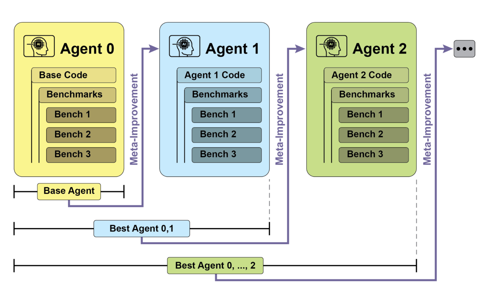
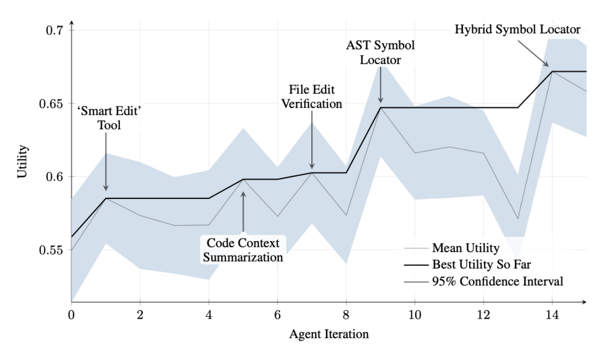
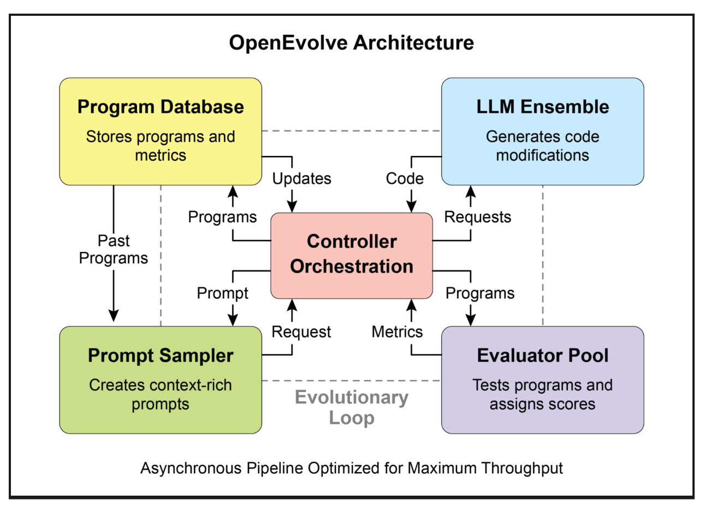
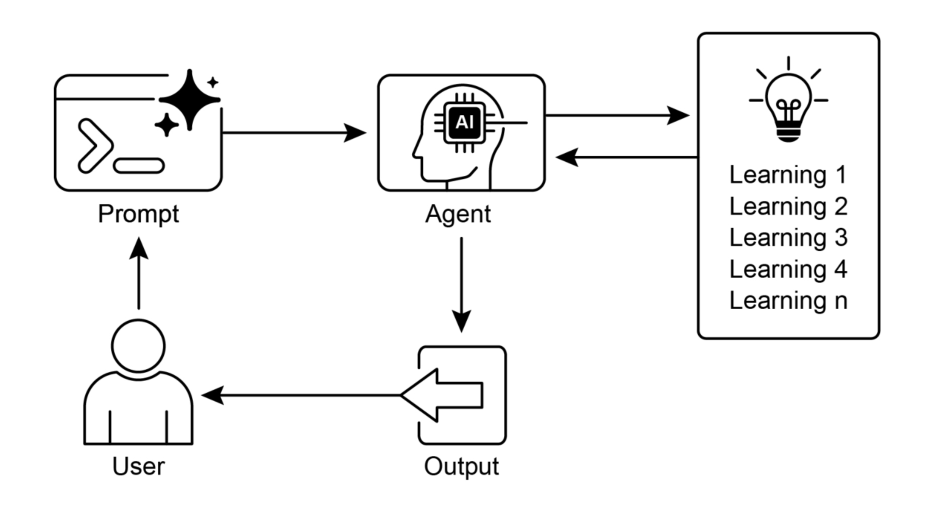

# 第九章：学习和适应

学习与适应是提升智能体能力的关键。这两种机制使智能体能够突破预设参数的局限，通过经验积累和环境交互实现自主进化。借助学习与适应能力，智能体可有效应对未知场景并自主优化表现，无需持续的人工干预。本章将深入探讨支撑智能体学习与适应能力的基本原理与运行机制。

## 核心要义

智能体通过根据新经验与数据调整其思维模式、行为方式或知识体系来实现学习与适应。这种进化使智能体从机械执行指令逐渐发展为具备持续智能演进的能力。

● **强化学习**：智能体通过尝试行动并获得正向结果奖励/负向结果惩罚，在动态环境中习得最优行为模式。适用于机器人控制或游戏博弈等场景。

● **监督学习**：智能体通过标注样本建立输入与预期输出的关联，实现决策判断与模式识别等功能。特别适用于邮件分类或趋势预测等任务。

● **无监督学习**：智能体在未标注数据中发现隐藏关联与模式，构建环境认知图谱以支持洞察分析。适用于无明确指导的数据探索场景。

● **基于大模型的少样本/零样本学习**：搭载大语言模型的智能体凭借少量示例或清晰指令即可快速适应新任务，实现对新型指令或场景的即时响应。

● **在线学习**：智能体持续整合新数据更新认知体系，这对动态环境中的实时反应与持续适应至关重要。适用于处理连续数据流的智能体。

● **基于记忆的学习**：具备记忆回溯能力的智能体可调用过往经验调整当前行动，增强情境感知与决策效能。

智能体根据学习成果调整策略、认知或目标以实现适应。这种能力对处于不可预测、持续变化或全新环境中的智能体具有至关重要的意义。

**近端策略优化（Proximal Policy Optimization, PPO）**是一种强化学习算法，主要用于训练智能体在连续动作空间环境中的决策能力，例如控制机器人关节或游戏角色行为。该算法的核心目标是通过稳定渐进的方式优化智能体的决策策略（即策略函数）。

PPO的核心设计理念在于采取谨慎的小幅度策略更新，避免因策略突变导致性能崩溃。其运行机制包含三个关键步骤：

1. **数据收集**：智能体基于当前策略与环境交互（如进行游戏），批量采集交互数据（包括状态、动作、奖励值）。
2. **替代目标评估**：算法计算策略更新对预期奖励的影响，但并非直接最大化奖励值，而是通过特殊的"裁剪"目标函数进行优化。
3. **裁剪机制**：这是PPO稳定性的关键。通过构建当前策略的"信任区域"，确保新策略与原有策略的差异可控。该机制如同安全制动器，防止智能体采取高风险更新步骤导致学习成果倒退。

简而言之，PPO通过在性能提升与策略稳定性间建立平衡，既保障训练过程避免灾难性失效，又实现更平稳的学习收敛。

**直接偏好优化（Direct Preference Optimization, DPO）**是专门用于对齐大语言模型与人类偏好的新方法。相较于基于PPO的方案，DPO提供了更简洁直接的技术路径。理解DPO需先了解传统PPO对齐方法的两个阶段：

- **PPO对齐方案（双阶段流程）**：
  1. **奖励模型训练**：首先收集人类对LLM不同回答的评分或排序数据（如"回答A优于回答B"），据此训练独立的奖励模型，使其能够预测人类对任意回答的评分。
  2. **PPO微调**：随后以奖励模型作为"评判官"，使用PPO对LLM进行微调，目标是使LLM生成能获得奖励模型最高评分的回答。

这种分两步走的方法可能既复杂又不稳定。例如，大语言模型可能会找到漏洞，学会"欺骗"奖励模型，从而让低质量回答也能获得高分。

- **DPO方法（直接流程）**：DPO完全跳过了奖励模型这一环节。它不再将人类偏好转化为奖励分数再进行优化，而是直接利用偏好数据更新大语言模型的策略。
- 其原理基于数学关系，直接将偏好数据与最优策略相关联。本质上，该方法直接指导模型："提高生成受偏好回答的概率，同时降低生成非偏好回答的概率。"

实质上，DPO通过直接在人类偏好数据上优化语言模型，简化了对齐流程。这不仅避免了训练和使用独立奖励模型的复杂性，也规避了潜在的不稳定性，使得对齐过程更加高效可靠。

## 实用场景与应用案例

自适应智能体通过经验数据驱动的迭代更新，在多变环境中展现出卓越性能：

● **个性化助理智能体**通过纵向分析用户行为模式持续优化交互协议，实现高度精准的响应生成

● **交易机器人智能体**基于高精度实时市场数据动态调整模型参数，优化决策算法以最大化投资回报并控制风险

● **应用智能体**通过观测用户行为进行动态界面优化，提升系统直观性与用户参与度

● **机器人及自动驾驶智能体**融合传感器数据与历史行动分析，强化多环境下的导航响应能力，确保运行安全高效

● **反欺诈智能体**通过整合新型欺诈模式持续改进预测模型，增强异常检测精度以提升系统安全性并减少经济损失

● **推荐智能体**采用用户偏好学习算法提升内容筛选准度，实现高度个性化与场景适配的推荐结果

● **游戏AI智能体**通过动态策略算法调整增强玩家沉浸感，提升游戏复杂度与挑战性

● **知识库学习智能体**：运用检索增强生成技术（RAG）构建动态问题描述与解决方案知识库（详见第14章）。通过记录成功策略与应对挑战的经验，智能体可在决策时调用历史数据，更有效地适应新场景——复用成功模式或规避已知风险

## 案例研究：自改进编码智能体（SICA）

由马克西姆·罗宾斯、劳伦斯·艾奇逊与马丁·苏默共同开发的自改进编码智能体(Self-Improving Coding Agent, SICA)，代表了基于智能体学习领域的重要进展。该智能体能够修改自身源代码，与传统模式下智能体相互训练的模式形成鲜明对比——SICA同时承担着代码修改者与被修改对象的双重角色，通过持续迭代优化代码库以提升应对各类编程挑战的能力。

SICA的自改进机制遵循循环迭代流程（图1）。首先，智能体会检索历史版本库及其在基准测试中的表现数据，根据成功率、耗时与计算成本等加权公式计算出综合性能评分后，选取最优版本进行下一轮自我改造。该版本通过分析历史数据识别改进方向，直接对代码库进行修正。修改后的新版本将接受基准测试，结果被记录至档案库。如此循环往复，实现基于历史表现的自主学习。这种创新机制使SICA能够突破传统训练范式的限制，实现能力的自主进化。



*图1：SICA基于历史版本进行自我改进与学习的闭环流程*

在持续迭代中，SICA在代码编辑与导航领域取得显著突破。初始阶段仅采用基础的文件覆写方式进行代码修改，随后逐步开发出支持智能上下文编辑的"智能编辑器"。该工具进一步升级为具备差异化修改和模式编辑能力的"差异增强型智能编辑器"，并配套开发降低处理负荷的"快速覆写工具"。

SICA相继实现"最小差异输出优化"与"上下文感知差异最小化"技术，通过抽象语法树解析提升效率，并新增"智能编辑器输入标准化器"。导航方面，智能体独立创建基于代码结构图谱（AST）的"符号定位器"，用于识别代码库中的定义节点。后续开发的"混合符号定位器"结合快速检索与AST验证机制，又通过"混合定位器中的AST解析优化"技术聚焦相关代码段，显著提升搜索速度（图2）。



*图2：迭代性能演进图（关键改进标注对应工具/智能体版本），资料来源：马克西姆·罗宾斯、马丁·苏默、劳伦斯·艾奇逊*

### SICA架构剖析

该系统的核心架构包含基础工具集，支持文件操作、命令执行与数学计算等核心功能，集成结果提交机制与专用子智能体（编码、问题解决、推理）调用能力。这些子智能体通过任务分解与上下文长度管理，有效应对长周期改进循环中的复杂性。

系统配备异步监督器（基于独立大语言模型），持续监测SICA行为以识别循环执行或进度停滞等异常。监督器通过与主智能体通信实施干预，必要时可中止运行。其通过接收详细行为报告（含调用关系图与操作日志）实现模式识别与效能分析。

SICA采用结构化上下文窗口管理策略，其短期记忆系统包含：定义智能体目标的系统提示、工具与子智能体文档、系统指令构成的基础层；承载问题描述、打开文件内容及目录映射的核心提示层；记录逐步推理、工具调用结果与监督器通信的助手消息层。这种信息组织方式优化数据流，显著提升大语言模型运行效率并降低处理成本。文件变更最初以差异记录方式呈现，后期改为定期整合模式。

### 代码实现深度解析

SICA通过模块化架构实现能力支撑：主智能体像调用工具一样激活编码、问题解决与推理等子智能体，这种设计既分解复杂任务又高效管控上下文长度。项目持续迭代，旨在为工具使用与智能体任务研究提供稳健框架，完整代码已开源于GitHub仓库（https://github.com/MaximeRobeyns/self_improving_coding_agent/）。

安全方面采用Docker容器化隔离方案，有效规避智能体执行Shell命令时的文件系统操作风险。透明度保障通过可视化事件总线与调用关系图的交互网页实现，支持事件检查、监督消息查看与子智能体轨迹折叠功能。

核心智能层支持多供应商大语言模型集成，便于针对任务特性优选模型。异步监督器作为关键组件，通过周期行为评估（基于系统状态文本化呈现）检测低效模式或重复工作，具备执行中断权限。当前主要挑战在于如何引导基于大语言模型的智能体在元改进迭代(meta-improvement iteration)中自主提出创新性强且可行的改进方案，这一关乎智能体开放式学习与创造力的课题仍是研究重点。

## AlphaEvolve 与 OpenEvolve

AlphaEvolve 是由谷歌开发的一款人工智能代理，旨在发现和优化算法。它结合运用了大型语言模型（特别是 Gemini 系列的 Flash 和 Pro 模型）、自动化评估系统以及一个进化算法框架。该系统的目标是推动理论数学和实用计算应用的发展。

AlphaEvolve 采用了 Gemini 模型的组合：Flash 模型用于生成广泛的初始算法提案，而 Pro 模型则提供更深入的分析和优化。随后，提出的算法会根据预设标准进行自动评估和评分。该评估结果将作为反馈，用于迭代改进解决方案，从而产生经过优化的新颖算法。

在实用计算领域，AlphaEvolve 已被部署在谷歌的基础设施中。它已在数据中心调度方面展现出改进成效，使得全球计算资源使用量减少了 0.7%。它还为硬件设计做出了贡献，为即将推出的张量处理单元(Tensor Processing
Units , TPUs)的 Verilog 代码提出了优化建议。此外，AlphaEvolve 还加速了 AI 性能，包括将 Gemini 架构一个核心内核的速度提升了 23%，以及对 FlashAttention 的低层 GPU 指令实现了高达 32.5% 的优化。

在基础研究领域，AlphaEvolve 为发现新的矩阵乘法算法做出了贡献，其中包括一种针对 4x4 复数值矩阵的算法，该方法仅需 48 次标量乘法，超越了先前已知的解决方案。在更广泛的数学研究中，对于超过 50 个开放问题，它在 75% 的情况下重新发现了已有的最先进解决方案，并在 20% 的情况下改进了现有方案，例如在吻球数问题(kissing number problem)上取得了进展。

OpenEvolve 是一个利用大型语言模型（见图 3）迭代优化代码的进化编码代理。它协调一个由 LLM 驱动的代码生成、评估和选择流程，以持续优化针对广泛任务的程序。OpenEvolve 的一个关键特性是能够进化整个代码文件，而不仅限于单个函数。该代理设计用途多样，支持多种编程语言，并能与任何 LLM 的 OpenAI 兼容 API 配合使用。此外，它集成了多目标优化功能，允许灵活的提示工程，并能够进行分布式评估，以高效处理复杂的编码挑战。



图 3：OpenEvolve 的内部架构由控制器管理。该控制器负责协调几个关键组件：程序采样器、程序数据库、评估器池和大型语言模型组合。其主要功能是促进这些组件的学习与适应过程，从而提升代码质量。

此代码片段使用 OpenEvolve 库对程序执行进化优化。它通过指定初始程序文件、评估文件和配置文件的路径来初始化 OpenEvolve 系统。`evolve.run(iterations=1000)`这行代码启动进化过程，运行 1000 次迭代以寻找程序的改进版本。最后，代码会打印出在进化过程中找到的最佳程序的各项评估指标，结果保留四位小数。

```python
from openevolve import OpenEvolve

# Initialize the system
evolve = OpenEvolve(
    initial_program_path="path/to/initial_program.py",
    evaluation_file="path/to/evaluator.py",
    config_path="path/to/config.yaml"
)

# Run the evolution
best_program = await evolve.run(iterations=1000)
print(f"Best program metrics:")
for name, value in best_program.metrics.items():
    print(f" {name}: {value:.4f}")
```

## 概览

**核心问题**：人工智能代理通常在动态且不可预测的环境中运行，预先编程的逻辑往往难以应对。当遇到初始设计未预料到的新情况时，其性能可能会下降。如果无法从经验中学习，代理就无法优化其策略，也无法随着时间的推移实现交互的个性化。这种僵化性限制了其效能，阻碍了它们在现实世界的复杂场景中实现真正的自主性。

**解决方案**：标准化的解决方案是集成学习与适应机制，将静态代理转变为动态、进化的系统。这使得代理能够基于新的数据和交互，自主地完善其知识和行为。智能体系统可以采用多种方法，从强化学习到更先进的技术（如自我修改，见于自改进编码代理SICA）。像谷歌的AlphaEvolve这样的先进系统，则利用大型语言模型和进化算法来为复杂问题发现全新且更高效的解决方案。通过持续学习，代理可以胜任新任务、提升性能，并能适应不断变化的条件，而无需频繁的人工重新编程。

**经验法则**：在构建必须于动态、不确定或不断演进的环境中运行的代理时，请使用此模式。对于需要个性化、持续性能改进以及自主处理新情况能力的应用场景而言，该模式至关重要。

### 图示摘要



图4：学习与适应模式

## 核心要点

- **学习与适应**指的是智能体通过利用自身经验，在其任务上做得更好并处理新情况的能力。
- **"适应"**是智能体行为或知识中源自学习的可见变化。
- **SICA（自我改进编码智能体）**通过基于过去表现修改自身代码来实现自我改进，这催生出了如智能编辑器和AST符号定位器之类的工具。
- 配备专门的**"子智能体"** 和一个**"监督器"** 有助于这些自我改进系统管理大型任务并保持正轨。
- 大语言模型的**"上下文窗口"** 设置方式（包含系统提示、核心提示和助手消息）对于智能体的工作效率至关重要。
- 这种模式对于需要在**持续变化、不确定或需要个性化处理**的环境中运行的智能体至关重要。构建能够学习的智能体通常意味着为其配备机器学习工具并管理数据流。
- 一个配备基本编码工具的**智能体系统**可以自主编辑自身代码，从而提升其在基准任务上的性能。
- **AlphaEvolve** 是谷歌的人工智能智能体，它利用大语言模型和进化框架来自主发现和优化算法，显著推动了基础研究和实际计算应用的进步。

## 结论

本章探讨了**学习与适应**在人工智能中的关键作用。人工智能智能体通过持续的数据获取和经验积累来提升其性能。自我改进编码智能体（SICA）通过自主修改代码来提升其能力，是这一点的典范。

我们回顾了智能体人工智能的基本组成部分，包括架构、应用、规划、多智能体协作、记忆管理以及学习与适应。学习原理对于多智能体系统中的协同改进尤为重要。为实现这一点，调优数据必须准确反映完整的交互轨迹，捕捉每个参与智能体的个体输入和输出。

这些要素共同促成了重大进展，例如谷歌的**AlphaEvolve**。该人工智能系统通过大语言模型、自动化评估和进化方法，独立发现并优化算法，推动了科学研究和计算技术的进步。这些模式可以组合起来构建复杂的人工智能系统。像AlphaEvolve这样的发展表明，由人工智能智能体实现**自主算法发现与优化**是可行的。