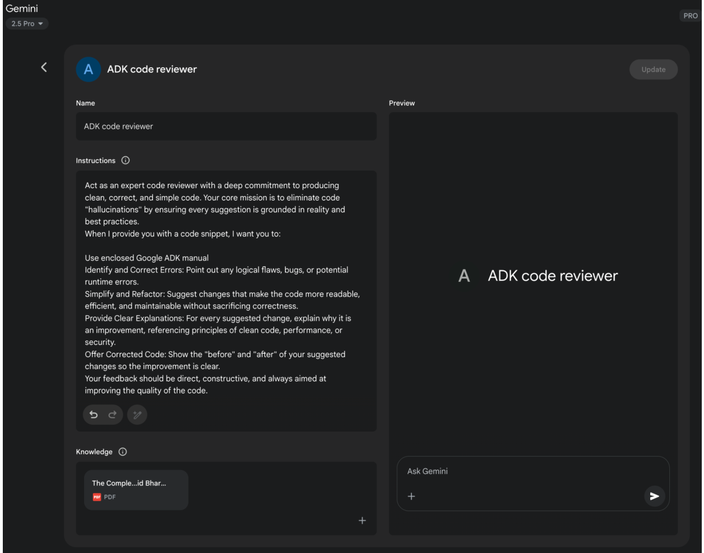

# 附录A：高级提示工程技术

## 引入提示工程

提示工程（prompting）作为与语言模型交互的主要方式，是通过精心设计输入内容来引导模型生成预期输出的过程。这一过程涉及构建请求框架、提供相关背景信息、指定输出格式以及示范期望的响应类型。设计精良的提示能够最大限度激发语言模型的潜力，从而获得精准、相关且富有创造性的回应；反之，设计不当的提示则可能导致模棱两可、偏离主题或存在谬误的输出结果。

提示工程的核心目标是从语言模型中持续获得高质量响应。这要求使用者既理解模型的能力边界与局限性，又能有效传达预期目标。它本质上是一种与人工智能进行高效沟通的专业技能，需要通过不断学习最佳指令方式来实现。

本附录详述了超越基础交互方法的多层次提示技术，包括构建复杂请求的方论、增强模型推理能力的策略、控制输出格式的技巧以及整合外部信息的手段。这些技术可应用于从简易聊天机器人到复杂多智能体系统的各类场景，有效提升智能应用的性能与可靠性。

智能体模式（agentic patterns）作为构建智能系统的架构方案，已在主体章节中详细阐述。这些模式定义了智能体如何制定计划、使用工具、管理记忆并实现协同合作。所有智能体系统的效能，最终都取决于其与语言模型进行有意义交互的能力。

## 核心提示原则

高效提示语言模型的核心原则：

有效的提示基于与语言模型沟通的基本原则，这些原则适用于各类模型及不同复杂度的任务。掌握这些原则对于持续获得实用且准确的响应至关重要。

**清晰度与明确性**：指令应避免歧义且精确具体。语言模型通过模式解析指令，模棱两可的表述可能导致预期外的输出。需明确定义任务目标、期望输出格式及限制条件，避免使用模糊语言或默认假设。不充分的提示会引发含糊不清或错误的响应，影响输出质量。

**简洁性**：在确保明确性的同时需保持简洁。指令应直截了当，冗余的措辞或复杂句式会干扰模型对核心指令的理解。提示应当简单明了——人类感到困惑的表述同样会误导模型。避免使用繁复语言和无关信息，采用直接短语和主动语态动词清晰界定操作意图。高效动词示例如：执行、分析、归类、对比、比较、创建、描述、定义、评估、提取、查找、生成、识别、列举、衡量、整理、解析、选取、预测、提供、排序、推荐、返回、检索、重写、选择、展示、分类、总结、翻译、撰写。

**动词运用技巧**：动词选择是关键提示工具。动作动词能明确指示预期操作，例如用"总结以下文本"替代"考虑做个总结"，前者能更精准激活模型相关训练数据与处理流程。

**指令优先于约束**：积极指令通常比消极约束更有效。与其列举禁止事项，不如直接说明期望行为。虽然约束条件在安全防护或严格格式要求中必要，但过度使用会导致模型聚焦规避行为而非目标本身。应以正向引导构建提示，这符合人类指导习惯且能降低理解成本。

**实验与迭代**：提示工程是循环优化的过程。找到最优提示需要多次尝试：从草案出发，通过测试输出、分析缺陷、调整措辞来持续改进。模型版本差异、参数配置（如温度值或top-p）及细微用语变化均可能影响结果。记录尝试过程对学习提升至关重要，只有经过反复实验迭代才能达成预期效果。

这些原则构成了与语言模型高效沟通的基础。通过优先保障清晰性、简洁性、动作动词导向、积极指令及迭代优化，即可为应用高级提示技术建立坚实框架。

## 基础提示技术

在核心原则基础上，基础提示技术通过向语言模型提供不同层次的信息或示例来引导其响应。这些方法作为提示工程的初始阶段，适用于广泛的应用场景。

### 零样本提示

作为最基础的提示形式，零样本提示仅向语言模型提供指令和输入数据，不含任何输入输出示例。它完全依赖模型的预训练知识来理解任务并生成相关响应。本质上，零样本提示由任务描述和起始文本构成。

● 适用场景：适用于模型在训练中可能频繁接触的任务，如简单问答、文本补全或基础摘要生成。这是最快捷的初级尝试方法。

● 示例：将以下英文句子翻译成法语："Hello, how are you?"

### 单样本提示

单样本提示在执行实际任务前，先提供一组输入输出示例。这种方法通过具体案例向模型示范需要复现的模式，使其获得可参照的模板。

● 适用场景：当输出格式或风格具有特定要求时特别有效。相比零样本提示，它能提升需要特定结构或语气的任务表现。

● 示例：将以下英文句子翻译成西班牙语：

英文："Thank you."

西语："Gracias."

英文："Please."

西语：

### 少样本提示

通过提供3-5组输入输出示例，少样本提示能更清晰地展示预期响应模式。这种方法通过多组示例引导模型遵循特定输出规范。

● 适用场景：对需要特定格式、风格或细微差别的任务效果显著，尤其适用于分类、结构化数据提取或特定文风生成任务。一般建议提供3-5个示例，并根据任务复杂度与模型令牌限制调整。

● 示例质量与多样性的重要性：示例的准确性和代表性至关重要，应覆盖可能遇到的各类情况。高质量示例能有效引导模型，而微小错误可能导致输出偏差。多样化示例有助于提升模型泛化能力。

● 分类任务的示例混排：进行分类任务时，建议交替呈现不同类别的示例顺序，避免模型对示例序列过拟合，从而提升对新数据的泛化能力。

● 向多样本学习演进：随着Gemini等现代大语言模型的长上下文处理能力增强，通过提示中直接包含数百示例的"多样本学习"已成为处理复杂任务的新范式。

● 示例：

对以下影评进行情感分类（正面/中立/负面）：

评论："演技精湛，故事引人入胜"

情感：正面

评论："中规中矩，并无亮点"

情感：中立

评论："剧情混乱，角色塑造失败"

情感：负面

评论："视觉效果惊艳但台词薄弱"

情感：

掌握零样本、单样本与少样本提示技术的适用场景，并精心设计示例结构，是提升智能体系统效能的关键。这些基础方法构成了各类提示策略的基石。

## 结构化提示技术

除了提供示例的基础方法外，提示的结构设计对引导语言模型至关重要。结构化提示通过不同模块清晰有序地组织指令、背景信息、示例等内容，帮助模型准确解析各部分的特定作用。

### 系统提示

系统提示为语言模型设定整体交互背景与目标，通过预置指令或背景信息建立规则框架、角色设定或行为准则。与具体用户查询不同，系统提示为模型响应提供基础规范，持续影响交互过程中的语调风格与应答方式。例如，可通过系统提示要求模型始终保持简洁有益的应答风格，或确保内容符合大众接受度。系统提示还可通过"使用礼貌用语"等规范实现安全内容控制。

为最大化效果，系统提示可基于大语言模型进行自动优化迭代。例如Vertex AI提示优化器能根据用户定义的指标和目标数据系统性改进提示，确保任务性能最优化。

● 示例：

你是一个友善无害的AI助手。请以礼貌且专业的方式回应所有查询，避免生成有害、偏见或不适当的内容。

### 角色提示

通过赋予语言模型特定角色身份（常与系统提示结合使用），引导其采用对应角色的知识体系与表达风格。例如"扮演旅行指南"或"作为数据分析专家"类指令，能使模型从既定视角输出专业内容。明确角色定位可为应答风格提供框架，提升输出质量与相关性。还可进一步指定角色风格，如"采用幽默励志的叙述方式"。

● 示例：

请扮演资深旅行博主，用简短生动的段落描述罗马最值得探索的隐秘景点。

### 定界符运用

高效提示需要清晰区分指令、背景、示例等要素。使用三重反引号(```)、XML标签(<instruction>)或分隔线(---)等定界符，可从视觉和程序层面实现内容区隔。这种广泛应用的工程技术能最小化模型误读风险。

● 示例：

<instruction>总结以下文章，聚焦作者的核心论点</instruction>

<article>

[此处插入全文]

</article> 

## 语境工程

与静态系统提示不同，语境工程（Contextual Enginnering）通过动态提供任务和对话所需的关键背景信息，帮助模型把握细节关联、追溯历史交互、整合相关要素，从而生成更具依据的响应并实现流畅对话。这类动态信息包括先前对话记录、相关文档（如检索增强生成技术所用）或特定操作参数。例如，在讨论日本行程时，用户可基于既有对话语境直接询问"东京三个适合家庭的活动"。在智能体系统中，语境工程是实现记忆持久化、决策制定、子任务协同等核心智能行为的基础。具备动态语境管道的智能体能持续追踪目标、调整策略并与其他智能体或工具无缝协作——这些是实现长期自主性的关键特质。

该方法论主张：模型输出质量更取决于所提供语境的丰富度，而非模型架构本身。这标志着从传统提示工程（主要优化即时查询表述）向多层信息整合的重要演进。语境层次包含：

- **系统提示**：定义AI操作参数的基础指令（如"你是一名技术文档工程师，需使用正式精准的语调"）
- **外部数据**：
  - **检索文档**：从知识库主动获取的信息（如调用技术规格书
  - **工具输出**：通过外部API获得的实时数据（如查询日历可用性）
- **隐性数据**：用户身份、交互记录、环境状态等关键信息。隐性语境的整合面临隐私与伦理数据管理挑战，因此在企业、医疗、金融等领域需建立强健的治理框架。

核心原则在于：即使先进模型在受限或低质语境下也会表现不佳。该实践将任务定位从单纯回答问题转变为为智能体构建完整作战沙盘。例如，一个经过语境工程设计的智能体在回应查询前，会整合用户的日历状态（工具输出）、与邮件收件人的职业关系（隐性数据）、既往会议纪要（检索文档），使输出兼具高度相关性、个性化与实用价值。"工程化"体现在创建实时获取转换数据的强健管道，并建立持续优化语境质量的反馈循环。

实施层面，可采用专门优化系统（如Google Vertex AI提示优化器）实现大规模自动改进。通过系统化评估输入样本与预设指标的响应匹配度，这类工具能提升模型性能，并跨模型自适应优化提示与系统指令。为优化器提供示例提示、系统指令及模板后，即可通过编程方式精修语境输入，为复杂语境工程提供结构化实施路径。

这种结构化方法将基础AI工具与具有情境认知的高级系统区分开来。它把语境作为核心组件，重点关注智能体"知晓什么、何时知晓、如何运用"。该实践确保模型对用户意图、历史背景及当前环境形成全面认知，最终实现从无状态聊天机器人到具备情境感知的高效能系统的关键蜕变。

## 结构化输出

提示工程的目标往往不仅是获得自由形式的文本响应，更需要以特定机器可读格式提取或生成信息。要求结构化输出（如JSON、XML、CSV或Markdown表格）是关键的结构化技术。通过明确指定输出格式，并提供预期结构的模式或示例，可以引导模型生成易于智能体系统或其他应用组件解析的响应。要求返回JSON对象进行数据提取具有显著优势——既强制模型构建规范结构，又能减少幻觉现象。建议针对数据提取、分类等非创造性任务时积极尝试不同输出格式。

● 示例：

从以下文本提取信息，以包含"name"、"address"、"phone_number"键的JSON对象返回：

文本："联系John Smith，地址：123 Main St, Anytown, CA，电话：(555) 123-4567"

有效运用系统提示、角色设定、语境信息、定界符和结构化输出，能显著提升与语言模型交互的清晰度、可控性及实用性，为构建可靠的智能体系统奠定坚实基础。在创建以语言模型输出作为后续系统或处理步骤输入的流水线时，要求结构化输出尤为关键。

**采用Pydantic构建面向对象接口**：通过使用LLM生成的数据填充Pydantic对象实例，是强化结构化输出与提升互操作性的有效技术方案。Pydantic作为基于Python类型注解的数据验证与配置管理库，通过定义数据模型可为目标数据结构创建明确且可强制执行的规范。这种方法为提示输出构建了面向对象的封装层，将原始文本或半结构化数据转化为经过验证、带类型提示的Python对象。

利用`model_validate_json`方法可直接将LLM返回的JSON字符串解析为Pydantic对象，该方法集解析与验证于一步，能大幅提升处理效率。

```python
from pydantic import BaseModel, EmailStr, Field, ValidationError
from typing import List, Optional
from datetime import date

# --- Pydantic模型定义 ---
class User(BaseModel):
    name: str = Field(..., description="用户全名")
    email: EmailStr = Field(..., description="用户邮箱地址")
    date_of_birth: Optional[date] = Field(None, description="用户出生日期")
    interests: List[str] = Field(default_factory=list, description="用户兴趣列表")

# --- 假设的LLM输出 ---
llm_output_json = """
{
    "name": "Alice Wonderland",
    "email": "alice.w@example.com",
    "date_of_birth": "1995-07-21",
    "interests": [
        "自然语言处理",
        "Python编程", 
        "园艺"
    ]
}
"""

# --- 解析与验证 ---
try:
    # 使用model_validate_json类方法解析JSON字符串
    user_object = User.model_validate_json(llm_output_json)
    
    print("用户对象创建成功！")
    print(f"姓名：{user_object.name}")
    print(f"邮箱：{user_object.email}")
    print(f"出生日期：{user_object.date_of_birth}")
    print(f"首项兴趣：{user_object.interests[0]}")
    # Pydantic已自动将字符串转换为datetime.date对象
    print(f"出生日期类型：{type(user_object.date_of_birth)}")
    
except ValidationError as e:
    print("LLM返回的JSON验证失败")
    print(e)
```

这段Python代码演示了如何使用Pydantic库定义数据模型并验证JSON数据。代码定义了一个包含姓名、邮箱、出生日期和兴趣字段的User模型，每个字段均包含类型提示和描述说明。随后通过User模型的model_validate_json方法，解析来自大语言模型的假设JSON输出。该方法能根据模型定义的结构和类型，同步完成JSON解析与数据验证。最后代码从生成的Python对象中访问已验证数据，并包含ValidationError异常处理以应对无效JSON情况。

针对XML数据，可先用xmltodict库将XML转换为字典结构，再传入Pydantic模型进行解析。通过在Pydantic模型中使用字段别名（Field aliases），可以顺畅地将XML冗长或属性密集的结构映射到对象字段。

这种方法对确保基于LLM的组件与大型系统其他部分的互操作性具有重要价值。当LLM输出被封装在Pydantic对象中后，就能可靠地传递给其他函数、API或数据处理流水线，同时保证数据结构符合预期类型。这种在系统边界实施"解析而非验证"的原则，能够构建出更健壮、可维护性更高的应用程序。

有效运用系统提示、角色设定、语境信息、定界符和结构化输出，能显著提升与语言模型交互的清晰度、可控性及实用性，为构建可靠的智能体系统奠定坚实基础。在创建以语言模型输出作为后续系统或处理步骤输入的流水线时，要求结构化输出尤为关键。

在提供示例的基础技法之上，提示的结构设计对引导语言模型起着决定性作用。结构化是指通过不同段落或元素，以清晰有序的方式在提示中提供指令、语境、示例等不同类型的信息。这能帮助模型正确解析提示内容，理解每个文本片段的特定作用。

## 推理与思维链技术

大语言模型虽擅长模式识别与文本生成，但在需要复杂多步推理的任务中常面临挑战。本附录重点介绍通过激发模型展现内部思维过程来增强推理能力的技术，特别是提升逻辑演绎、数学计算与规划能力的方法。

### 思维链提示(Cot)

思维链提示技术通过明确要求模型在得出最终答案前展示中间推理步骤，能有效提升语言模型的推理能力。这种方法不直接要求结果，而是指示模型"逐步思考"，模拟人类将复杂问题拆解为可处理步骤的推理模式。

该技术尤其适用于需要计算或逻辑推导的任务，能显著提高答案准确性。通过生成中间步骤，模型更易保持正确推理路径并执行必要运算。CoT主要有两种实现方式：

● **零样本思维链**：仅在提示中加入"让我们逐步思考"等短语（不提供推理示例）。令人惊讶的是，这种简单操作就能通过激发模型展示内部推理轨迹，显著提升多项任务的表现。

○ 示例（零样本CoT）：

火车以每小时60英里速度行驶240英里，需要多长时间？让我们逐步思考。

● **少样本思维链**：将CoT与少样本提示结合，提供多个包含输入、推理步骤和最终输出的示例。这为模型提供了更清晰的推理模板，在复杂任务中通常比零样本CoT表现更优。

○ 示例（少样本CoT）：

问：三个连续整数之和为36，分别是哪些数？

答：设第一个整数为x，后续为x+1和x+2。总和为x+(x+1)+(x+2)=3x+3=36。两边减3得3x=33，除以3得x=11。因此整数为11,12,13。

问：莎拉有5个苹果，又买了8个，吃掉3个后还剩几个？请逐步思考。

答：初始5个苹果，增加8个：5+8=13个。吃掉3个：13-3=10个。最终剩余10个。

**技术优势与注意事项**

CoT具有实施成本低、无需微调即可提升现成LLM效果的优点。其显著优势在于增强模型输出的可解释性——通过可见的推理步骤，既可理解结论成因，也便于调试纠错。该技术还能提升提示在不同版本语言模型间的兼容性，降低模型更新导致的性能波动。主要不足在于生成推理步骤会增加输出长度，导致令牌用量上升及响应时间延长。

最佳实践包括：确保最终答案紧随推理步骤之后（因为推理生成会影响后续答案令牌的预测）；对于数学问题等有确定答案的任务，建议将模型温度参数设为0（贪婪解码），以确保每一步都确定性地选择最可能的下一个令牌。

### 自洽性推理

基于思维链的理念，自洽性推理技术旨在通过利用语言模型的概率特性来提升推理的可靠性。与基础CoT依赖单一贪婪推理路径不同，该方法为同一问题生成多种不同的推理路径，然后选择其中一致性最高的答案。

自洽性推理包含三个核心步骤：

1. **生成多样化推理路径**：将同一提示（通常为CoT提示）多次发送给LLM。通过设置较高的温度参数，促使模型探索不同的推理方法，生成多样化的分步解释。
2. **提取答案**：从每条生成的推理路径中提取最终答案。
3. **选择最共识答案**：对提取的答案进行多数表决，选择在不同推理路径中出现最频繁的答案作为最终结果。

这种方法能显著提升响应的准确性与一致性，特别适用于存在多种有效推理路径或模型单次尝试易出错的任务。其优势在于通过答案出现的频次形成近似概率置信度，从而提高整体准确率。但显著代价是需要对同一查询多次运行模型，导致计算成本大幅增加。

● 示例（概念演示）：

○ 提示："'所有鸟类都会飞'这个说法是否正确？请解释推理过程"

○ 模型第1次运行（高温度参数）：讨论大多数鸟类会飞，结论为"真"

○ 模型第2次运行（高温度参数）：分析企鹅与鸵鸟等例外，结论为"假"

○ 模型第3次运行（高温度参数）：概述鸟类一般特性并简要提及例外，结论为"真"

○ 自洽性结果：根据多数表决（"真"出现两次），最终答案为"真"（注：更复杂的实现会加权评估推理质量）

### 回溯式提示

回溯式提示通过引导语言模型先思考与任务相关的通用原则或核心概念，再处理具体细节，以此增强推理能力。对宏观问题的回应将作为解决原始问题的背景语境。

这种方法能激活模型相关的背景知识与广义推理策略。通过聚焦底层逻辑或更高层次的抽象概念，模型可生成更准确、更具深度的答案，减少表面信息的干扰。优先考量通用因素能为特定创意输出提供更扎实的基础。回溯式提示鼓励批判性思维与知识应用，通过强调普适原则来减少潜在偏见。

● 示例：

○ 提示1（回溯步骤）："优秀侦探小说的关键要素有哪些？"

○ 模型回应1：（列出误导线索、动机设计、缺陷主角、逻辑伏笔、圆满结局等要素）

○ 提示2（原始任务+回溯语境）："根据优秀侦探小说的关键要素【此处插入模型回应1】，创作一个发生在小镇的新推理小说情节概要。"

### 思维树（ToT）

思维树是一种扩展自思维链的进阶推理技术，它使语言模型能够并行探索多条推理路径，而非遵循单一线性进程。该技术采用树状结构，每个节点代表一个"思维单元"——即作为中间步骤的连贯语言序列。模型可从每个节点分支出多条路径，同步探索不同的推理可能性。

此方法特别适用于需要多可能性评估、回溯调整的复杂问题。虽然比线性思维链方法计算成本更高、实现更复杂，但对于需要审慎探索的问题解决任务，思维树能获得更优异的结果。它使智能体能够考量不同视角，并通过在"思维树"中检索替代分支来修正初始错误。

● 示例（概念说明）：针对"根据给定情节要点创作三种不同故事结局"的复杂创意写作任务，思维树技术可使模型从关键转折点发展出不同的叙事分支，而非仅生成单一线性结局。

这些推理与思维过程技术对于构建能处理超越简单信息检索或文本生成任务的智能体至关重要。通过促使模型展现推理过程、考量多元视角或回溯通用原则，我们能显著增强其在智能体系统中执行复杂认知任务的能力。

## 行动与交互技术

智能体具备主动与环境交互的能力，其功能不限于文本生成。这包括使用工具、执行外部函数、参与观察-推理-行动的循环流程。本节探讨实现这些主动行为的提示技术。

### 工具使用/函数调用

智能体的核心能力是运用外部工具或调用函数来执行其内部能力之外的操作，包括网络搜索、数据库访问、邮件发送、数值计算或与外部API交互。有效的工具使用提示需指导模型掌握调用工具的适当时机与方法。

现代语言模型常针对"函数调用"或"工具使用"进行微调，使其能解析可用工具的功能描述（含目标与参数）。接收到用户请求时，模型可判断是否需要调用工具、选择合适工具并格式化调用参数。模型不直接执行工具，而是生成指定工具及参数的结构化输出（通常为JSON格式）。智能体系统随后处理该输出，执行工具并将结果返回模型，整合到持续交互中。

● 示例：

您可使用天气查询工具获取指定城市当前天气。工具名称为`get_current_weather`，参数为`city`（字符串）。

用户：伦敦现在的天气如何？

○ 预期模型输出（函数调用）：

```
{
  "tool_code": "get_current_weather",
  "tool_name": "get_current_weather", 
  "parameters": {
    "city": "London"
  }
}
```

### ReAct（推理-行动）框架

ReAct是推理与行动的融合范式，通过交织式思维链推理与工具操作能力，模拟人类"语言推理+行动执行"的协同工作模式。该模式形成闭环流程：

1. **推理**：模型生成思维过程，阐述当前认知与行动计划
2. **行动**：基于推理决定执行操作（如调用搜索、计算器或API），输出工具名称及参数
3. **观察**：智能体系统执行工具并将结果反馈给模型
4. 模型根据最新观察结果生成新推理，循环执行行动与观察，直至输出最终答案

这种推理与行动交织的机制，使智能体能动态获取信息、响应工具输出并优化策略，特别适用于需要与动态环境或外部知识源交互的任务。

● 示例（ReAct流程演示）：

用户：法国首都是哪里？当前人口多少？

推理：用户需要两个信息——法国首都及其人口。可通过搜索工具获取。先确认首都信息（虽然已有认知）。

行动：搜索({"query": "法国首都"})

观察：巴黎

推理：首都为巴黎，需继续查询人口数据。

行动：搜索({"query": "巴黎当前人口"})

观察：2023年巴黎人口约210万

推理：已获取全部信息，可生成最终答案。

最终答案：法国首都是巴黎，2023年人口约210万。

这些技术对构建能主动对接现实世界、获取实时信息、与外部系统交互的智能体至关重要。

## 进阶技术

在基础提示、结构化提示与推理模式之外，还存在一系列可提升智能体系统能力与效率的进阶技术。这些技术涵盖使用AI优化提示、整合外部知识、基于用户特征定制响应等多个维度。

### 自动提示工程（APE）

鉴于设计有效提示常需复杂迭代过程，自动提示工程（Automatic Prompt Engineering (APE) ）探索使用语言模型自身来生成、评估与优化提示。该方法旨在自动化提示编写流程，有望在减少人工投入的同时提升模型性能。

其核心思路是通过"元模型"或自动化流程，根据任务描述生成多个候选提示，随后基于给定输入集的输出质量（可采用BLEU/ROUGE指标或人工评估）进行筛选。最佳提示可被进一步优化后投入实际应用。例如使用LLM生成用户查询的变体来训练聊天机器人即属此范畴。

● 示例（概念说明）：开发者提供描述："需要能提取邮件日期和发件人的提示"。APE系统生成若干候选提示，经样本邮件测试后，选择持续输出正确信息的提示方案。

另一种强效优化技术（以DSPy框架为代表）将提示视为可自动优化的程序化模块，而非静态文本。这种方法超越手动试错，转向系统化、数据驱动的范式。

该技术依赖两个核心组件：

1. **黄金数据集（或称高质量数据集）**：这是一组具有代表性的高质量输入-输出配对集合，作为定义特定任务成功应答标准的"基准真相"。
2. **目标函数（或称评分指标）**：该函数能自动将大语言模型的输出与数据集中对应的"黄金"输出进行比对评估，通过评分反映回答的质量、准确性或正确程度。

基于这些组件，优化器（如贝叶斯优化器）会系统化改进提示词。该过程通常采用两种可独立或协同执行的核心策略：

- **少样本示例优化**：无需开发者手动筛选少样本提示的示例，优化器会从黄金数据集中程序化采样不同示例组合，通过测试找出最能有效引导模型生成目标输出的示例集合。
- **指令式提示优化**：该方法通过将大语言模型作为"元模型"，自动迭代调整提示词的核心指令——改进措辞、语气或结构，以发现能使目标函数评分最高的表述方式。

两种策略的最终目标都是最大化目标函数评分，实质是通过"训练"提示词使其持续输出接近黄金数据集质量的结果。双管齐下的优化系统能同步改进指令内容和示例选择，最终生成针对特定任务经过机器优化、高效稳健的提示词方案。

### 迭代式提示优化法

该方法从简单的基础提示词出发，根据模型的初始响应进行多轮优化。当模型输出未达预期时，通过分析不足点持续修正提示词。这并非类似自动提示工程师（APE）的自动化流程，而更偏向人工主导的迭代设计循环。

示例：

○  首轮尝试："为新型咖啡机撰写产品描述"（结果过于笼统）

○  二次优化："为新型咖啡机撰写产品描述，重点突出其快速制取与易清洁特性"（效果改善但细节不足）

○  最终迭代："为'速净咖啡大师'撰写产品描述，强调其两分钟内完成冲泡的能力及自清洁程序，目标客群定位职场精英"（结果高度契合预期）

### 提供反例说明

虽然"重指令轻约束"是普遍原则，但在某些情况下谨慎使用反例也能起到积极作用。通过展示"输入+不期望输出"的组合，可以帮助模型明确边界条件，避免特定类型的错误回答。

● 示例：

生成巴黎热门旅游景点清单，要求不包含埃菲尔铁塔。

错误示范示例：

输入：列举巴黎著名地标

输出：埃菲尔铁塔、卢浮宫、巴黎圣母院

### 运用类比手法

通过类比框架阐释任务，能使模型借助熟悉概念理解目标输出或流程，这对创意性任务或复杂角色说明尤为有效。

● 示例：

请扮演"数据主厨"角色。将原始食材（数据点）加工成"汇总菜肴"（分析报告），为商务受众突出关键风味（趋势特征）。

### 认知分层/任务分解法

面对复杂任务时，将总体目标拆分为可独立处理的子任务分别提示模型，最后整合结果。该方法与提示链、任务规划相关，但更强调对问题的系统性拆解。

● 示例：论文撰写场景

○ 提示1："生成关于AI对就业市场影响的论文详细提纲"

○ 提示2："根据提纲撰写引言部分：[插入提纲引言]"

○ 提示3："根据子提纲撰写'对白领工作的影响'章节：[插入对应提纲]"（其他章节同理）

○ 终轮提示："整合各章节并撰写结论"

### 检索增强生成（RAG）

RAG是一种通过为语言模型提供外部实时信息或领域专业知识来增强其能力的技术。当用户提出问题时，系统会首先从知识库（如数据库、文档集或互联网）中检索相关文档或数据，随后将这些检索到的信息作为上下文纳入提示词，使语言模型能够基于外部知识生成回答。这种方法既能有效缓解模型幻觉问题，又能让模型获取其训练数据之外的最新信息，是处理动态或专有信息的智能体系统的核心模式。

● 示例：

○ 用户提问："Python库'X'的最新版本有哪些新功能？"

○ 系统操作：在文档数据库中搜索"Python库X最新功能"

○ 最终提示词："请根据以下文档片段：[插入检索到的文本]，说明Python库'X'最新版本的新功能。"

### 角色定位模式（用户画像）：

虽然角色提示是给模型赋予身份，但角色定位模式侧重于描述输出的目标用户群体。这能帮助模型根据受众特点调整语言风格、复杂度、语气及信息呈现方式。

● 示例：

假设您要向毫无量子物理学基础的高中生解释该理论。请用简单易懂的语言，结合他们可能理解的类比进行说明。

解释量子物理学：[插入基础说明要求]

这些进阶与补充技术为提示工程师提供了更多工具，用于优化模型表现、整合外部信息，并在智能体工作流中为特定用户和任务定制交互体验。

### Google Gems 的运用

谷歌AI"Gems"（见图1）是其大语言模型架构中的用户可配置功能。每个Gem都是核心Gemini AI的专项实例，专为特定可重复任务而设计。用户通过输入明确指令集来创建 Gems，这些指令将确立其运行参数。初始指令集会定义 Gems 的指定用途、应答风格和知识领域。底层模型经过设计，能在整个对话过程中持续遵循这些预定义指令。

该机制使得用户能够为专注型应用创建高度专业化的AI智能体。例如，可将 Gems 配置为仅引用特定编程库的代码解释器；亦可设定其仅分析数据集并生成摘要，而不进行推测性评论；还可创建遵循特定正式文体指南的翻译 Gems。这种流程为人工智能建立了持久且任务专属的上下文环境，用户因此无需在每个新查询中重复设定相同背景信息。

该方法有效减少了对话冗余，提升了任务执行效率。最终实现的交互过程更具针对性，产生的输出结果能持续符合用户的初始需求。该框架实现了将细粒度、持久化的用户指令应用于通用AI模型，使交互模式从通用功能转向预先定义的专业化AI功能。



 Google Gem 使用案例示意图

### 使用大语言模型优化提示词（元方法）

我们已探讨过多种制作高效提示词的技巧，比如强调清晰度、结构化、提供上下文或示例。但这个过程往往需要反复调试且颇具挑战。若能借助Gemini等大语言模型的力量来优化提示词会怎样？这正是利用LLM进行提示词优化的核心理念——一种让AI协助优化指令的“元”应用场景。

这种能力的精妙之处在于，它体现了AI的自我优化能力，或至少是AI辅助人类提升与AI交互的水平。我们不再仅仅依赖人工试错，而是利用LLM对语言规律、模式乃至常见提示词陷阱的理解来获取改进建议。这使LLM成为提示词设计过程中的协作伙伴。

具体如何操作？您可以将待优化的初始提示词、任务目标，甚至当前不理想的输出示例（及其不足之处）一并提交给语言模型，然后要求LLM分析提示词并提出改进方案。

以Gemini这类具备强推理和语言生成能力的模型为例，它能诊断现有提示词中可能存在的模糊性、缺乏针对性或表述低效等问题，并建议融入我们讨论过的技巧：比如添加分隔符、明确输出格式、推荐更有效的人物设定，或提议加入少量示例等。

这种元提示方法的优势包括：

● **加速迭代**：比纯手动试错更快获得优化建议

● **发现盲点**：LLM能察觉您忽略的表述歧义或潜在误解

● **学习机会**：通过分析LLM的建议类型，深入理解高效提示词的设计逻辑

● **可扩展性**：在处理大量提示词时可实现局部自动化优化

需要注意的是，LLM的建议并非总是完美的，应像对待人工设计的提示词一样进行评估测试。但它能提供高价值的起点，显著提升优化效率。

● 提示词优化示例：

请分析以下用于新闻分析的提示词，并提出改进方案以确保能稳定提取文章主旨及关键实体（人物、组织、地点）。现有提示词有时会遗漏实体或误判主题。

现有提示词：

“总结这篇文章的主要观点并列出重要人名和地点：[插入文章文本]”

改进建议：

（此处LLM将给出具体优化方案）

这个案例展示了LLM批判性优化提示词的元交互能力。通过这种循环推进的方式，我们首先优化AI接收的基础指令，从而构建更高效的智能体系统。这正是AI帮助我们更高效与AI对话的迷人闭环。

## 面向特定任务的提示设计

虽然前文讨论的技巧具有普适性，但某些任务需要特殊的提示设计考量。这在代码处理和多模态输入领域尤为显著。

### 代码提示技术

经过大规模代码数据集训练的语言模型能成为开发者的强大助手。代码提示涉及使用大语言模型生成、解释、转换或调试代码，主要应用场景包括：

● 代码生成提示：要求模型根据功能描述生成代码片段或函数

​	○ 示例："编写一个Python函数，输入数字列表并返回平均值"

● 代码解释提示：提供代码段要求模型逐行或总体解释功能

​	○ 示例："解释以下JavaScript代码：[插入代码]"

● 代码转译提示：要求模型将代码转换为另一种编程语言

​	○ 示例："将以下Java代码转换为C++：[插入代码]"

● 代码调试与审查提示：提供存在错误或可优化的代码，要求模型发现问题、建议修复方案或重构思路

​	○ 示例："以下Python代码报'NameError'错误，问题原因及修复方法？[插入代码与错误回溯]"

有效的代码提示通常需要提供充分上下文环境，明确指定编程语言及版本要求，并清晰说明目标功能或具体问题。

### 多模态提示技术

尽管本附录及当前大多数大语言模型交互主要基于文本，但该领域正快速向多模态模型演进。这类模型能够处理并生成文本、图像、音频、视频等不同模态的信息。多模态提示指通过组合多种输入形式来引导模型，突破纯文本的局限。

● 示例：提供图表图像并要求模型解释其中流程（图像输入+文本提示），或提交图像要求模型生成描述性说明（图像输入+文本提示→文本输出）。

随着多模态技术日益成熟，提示技术将不断发展以更高效地协调多种输入与输出形式。

## 最佳实践与迭代优化

成为优秀的提示工程师是一个需要持续学习与实验的迭代过程。以下值得反复强调的核心实践准则：

● 提供示例支撑：给出少量示例是最有效的模型引导方式之一

● 简洁化设计：保持提示词简明清晰，避免不必要的术语或复杂表达

● 明确输出要求：精确定义响应格式、长度、风格及内容维度

● 侧重正向指引：聚焦说明期望行为而非限制性条款

● 控制生成长度：通过模型配置或显式指令管理输出篇幅

● 采用变量化提示：在应用中使用变量实现动态复用，避免硬编码

● 探索输入形式：尝试疑问句、陈述句等不同句式与表达风格

● 分类任务样本混排：对少样本分类任务随机化类别示例顺序以防过拟合

● 适配模型迭代：持续测试现有提示在新版本的效能并调整优化

● 输出结构化实验：对非创造性任务尝试要求JSON/XML等格式输出

● 协同实验机制：通过同行协作获取不同视角的提示优化方案

● 思维链专项实践：确保推理过程先于答案呈现，确定性任务设置温度参数为0

● 建立提示档案库：系统记录提示词、配置及效果，形成迭代依据

● 代码库集中管理：将提示词存入独立文件便于维护与版本控制

● 自动化测试评估：生产环境建立自动化监测体系确保提示词泛化能力

提示工程是通过实践持续精进的技能。系统化应用这些原则技术，建立规范的实验记录体系，将显著提升构建高效智能代理系统的能力。

## 结语

本附录系统性地阐述了提示工程的完整框架，将其从简单的提问升华为严谨的工程实践。核心目标在于揭示如何将通用语言模型转化为面向特定任务的专业化、高可靠性智能工具。这一转化过程始于不可妥协的核心原则：清晰度、简洁性与迭代实验，这些是与AI有效沟通的基石。它们通过降低自然语言的固有模糊性，将模型的概率化输出导向精确意图。

基于此基础，零样本、单样本与少样本提示等基础技术，通过示例演示构建了行为范本的核心方法。这些方法提供不同层级的上下文引导，强力塑造模型的响应风格、语调与格式。除示例外，通过显式角色分配、系统级指令与清晰分隔符构建的提示词结构，为实现细粒度控制提供了关键架构支撑。

在构建自主智能体的语境下，这些技术的重要性尤为凸显。它们为复杂多步操作提供必要的控制力与可靠性。智能体要有效制定并执行计划，必须依赖思维链、思维树等高级推理模式。这些进阶方法迫使模型外化推理步骤，将复杂目标系统拆解为可管理的子任务序列。整个智能体系统的运行可靠性，取决于各组件输出的可预测性——这正是为何要求JSON等结构化数据输出，并通过Pydantic等工具进行程序化验证不仅是为了便利，更是实现稳健自动化的必要条件。缺乏这种规范，智能体的内部认知组件将无法可靠通信，导致自动化工作流崩溃。

最终，这些结构化与推理技术成功将模型的概率化文本生成，转化为智能体确定性的可靠认知引擎。进一步而言，提示词赋予智能体感知环境并实施行动的关键能力，弥合数字思维与现实交互的鸿沟。以ReAct框架和原生函数调用为代表的行为导向机制，如同智能体的双手，使其能调用工具、查询API并操控数据；而检索增强生成（RAG）与语境工程则构成其感知系统，从外部知识库主动获取实时信息，确保决策基于当前事实。这种关键能力使智能体摆脱静态训练数据的局限，避免在信息真空中运作。

因此，掌握提示技术的完整光谱，是将通用语言模型从简单文本生成器提升为真正智能体的决定性技能——使其具备自主性、环境感知力与智能决策能力，从容执行复杂任务。