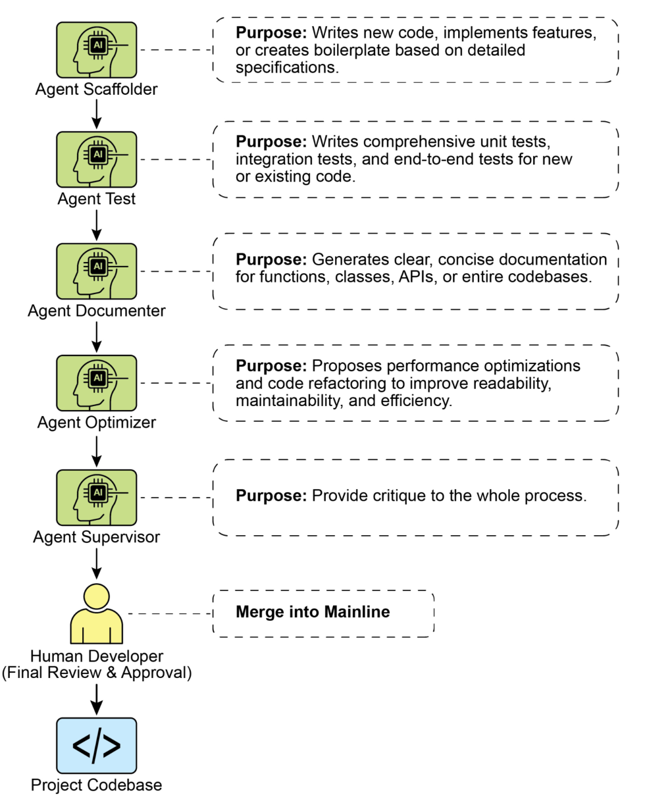

# 附录 G - 编码代理

##  Vibe Coding：一个起点

 “Vibe coding” 已成为快速创新和创意探索的强大技术。这种实践依靠使用大型语言模型生成初始草稿、概述复杂逻辑或构建快速原型，从而显著降低最初的阻力。它对于克服“空白页”问题极为有价值，使开发者能够快速从模糊概念过渡到可触摸、可运行的代码。Vibe coding 在探索不熟悉的 API 或测试新颖的架构模式时尤其有效，因为它绕过了对完美实现的即时需求。生成的代码往往充当创意催化剂，为开发者提供一个可以批判、重构和扩展的基础。其主要优势在于能够加速软件生命周期中初步探索和构思阶段。然而，尽管 vibe coding 在头脑风暴中表现出色，要开发健壮、可扩展且可维护的软件，则需要更结构化的方法，从纯生成转向与专业编码代理的协作伙伴关系。

## Agents as Team Members

尽管最初的浪潮聚焦于原始代码生成——适用于创意阶段的 “vibe code”——行业现在正在向更集成、更强大的生产工作范式转变。最有效的开发团队并不仅仅将任务委派给代理；他们正在通过一套复杂的编码代理来增强自身。这些代理就像不知疲倦的专业团队成员，放大人类的创造力，并显著提升团队的可扩展性与开发速度。

这一演变也反映在行业领袖的言论中。2025 年初，Alphabet CEO Sundar Pichai 指出，在 Google，“超过 30% 的新代码现在由我们的 Gemini 模型协助或生成，从根本上改变了我们的开发速度。”微软也提出了类似的说法。这一行业范围的转变表明真正的前沿不是取代开发者，而是赋能他们。目标是一种增强式关系：人类引导架构愿景与创造性问题解决，而代理则承担测试、文档和评审等专业化、可扩展的任务。

本章提出了一个组织人类—代理团队的框架，基于这样一个核心理念：人类开发者担任创意负责人和架构师，而 AI 代理作为倍增器发挥作用。这个框架建立在三个基本原则之上：

1. **以人为主导的协作编排**（Human-Led Orchestration）：开发者是团队负责人和项目架构师。他们始终在循环中，负责统筹工作流程、设定高层目标并做出最终决策。代理虽强大，但只是支持性的协作者。开发者决定调用哪个代理、提供必要的上下文，且最重要的是，对代理生成的任何输出进行最终判断，以确保其符合项目的质量标准和长期愿景。
2. **上下文至上**：代理的表现完全依赖于其上下文的质量和完整性。一个强大的 LLM 如果缺乏良好上下文也毫无用处。因此，本框架强调由人类主导、精细化的上下文策划方法。避免自动化、黑箱式的上下文检索。开发者负责为其代理团队成员准备完美的“简报”，其中包括：
    ○ **完整代码库**：提供所有相关源代码，使代理能够理解现有的模式和逻辑。
    ○ **外部知识**：提供特定文档、API 定义或设计文档。
    ○ **人类简报**：明确阐述目标、需求、拉取请求描述和风格指南。
3. **直接模型访问**：为了取得最先进的成果，代理必须由能够直接访问前沿模型（如 Gemini 2.5 PRO、Claude Opus 4、OpenAI、DeepSeek 等）的能力驱动。使用弱模型或将请求通过会模糊或截断上下文的中间平台路由会降低性能。此框架基于在人类负责人与底层模型的原生能力之间建立最纯粹的对话，从而确保每个代理都能在其峰值潜力下运行。

该框架被构建为由多个专门代理组成的团队，每个代理都为开发生命周期中的核心功能而设计。人类开发者作为中央协作者，负责任务委派与结果整合。

## 核心组件

为了有效利用前沿大型语言模型，本框架将明确的开发角色分配给一组专业代理。这些代理不是独立的应用程序，而是通过精心设计的、具有角色特定性的提示与上下文，在同一个 LLM 内被调用的概念化角色（persona）。这种方法确保模型的广泛能力能够精确聚焦于手头任务——从编写初始代码到进行细致而批判性的审查。

**The Orchestrator: 人类开发者**：在这一协作框架中，人类开发者充当 Orchestrator，是 AI 代理的中央智能与最终权威。
 ○ 角色：团队负责人、架构师以及最终决策者。Orchestrator 定义任务、准备上下文，并验证所有代理完成的工作。
 ○ 界面：开发者自己的终端、编辑器，以及所选代理的原生 Web 界面。

**The Context Staging Area**：作为成功代理交互的基础，这个区域用于开发者精心准备完整且与任务相关的简报。
 ○ 角色：为每个任务提供专属工作区，确保代理接收完整准确的简报。
 ○ 实现方式：一个临时目录（task-context/），其中包含用于目标说明的 markdown 文件、代码文件以及相关文档。

**The Specialist Agents**：通过针对性提示，我们可以构建一个专业代理团队，每个代理都针对某一特定开发任务进行优化。

○ **The Scaffolder Agent：实现者（Implementer）**
 ■ 目的：根据详细规范编写新代码、实现功能或创建样板代码。
 ■ 调用提示："You are a senior software engineer. Based on the requirements in 01_BRIEF.md and the existing patterns in 02_CODE/, implement the feature..."

○ **The Test Engineer Agent：质量守护者（Quality Guard）**
 ■ 目的：为新代码或现有代码编写全面的单元测试、集成测试和端到端测试。
 ■ 调用提示："You are a quality assurance engineer. For the code provided in 02_CODE/, write a full suite of unit tests using [Testing Framework, e.g., pytest]. Cover all edge cases and adhere to the project's testing philosophy."

○ **The Documenter Agent：记录者（Scribe）**
 ■ 目的：为函数、类、API 或整个代码库生成清晰简洁的文档。
 ■ 调用提示："You are a technical writer. Generate markdown documentation for the API endpoints defined in the provided code. Include request/response examples and explain each parameter."

○ **The Optimizer Agent：重构伙伴（Refactoring Partner）**
 ■ 目的：提出性能优化和代码重构方案，以改善可读性、可维护性和效率。
 ■ 调用提示：
 "Analyze the provided code for performance bottlenecks or areas that could be refactored for clarity. Propose specific changes with explanations for why they are an improvement."

○ **The Process Agent：代码监管者（Code Supervisor）**
 ■ Critique：代理进行初步审查，识别潜在错误、风格违规和逻辑缺陷，类似静态分析工具。
 ■ Reflection：代理分析自身的批评意见，综合发现、优先排序关键问题、剔除吹毛求疵或低影响的建议，并为开发者提供高层次、可执行的总结。
 ■ 调用提示：You are a principal engineer conducting a code review. First, perform a detailed critique of the changes. Second, reflect on your critique to provide a concise, prioritized summary of the most important feedback."

最终，这种以人为主导的模型在开发者的战略指导与代理的战术执行之间形成强大的协同作用。开发者因此能够摆脱日常事务，将精力集中在最能创造价值的创意性与架构性挑战上。

## 实践实施

### 配置清单

 为了有效落实人类—代理团队框架，推荐采用以下设置方法，在保持控制力的同时提升效率。

1. **获取前沿模型的访问权限**

   为至少两个领先的大型语言模型（如 Gemini 2.5 Pro 和 Claude 4 Opus）准备安全的 API 密钥。这种双提供商策略可以用于比较分析，并避免单一平台的限制或停机风险。这些凭据应像其他生产密钥一样安全管理。

2. **实现本地上下文编排器**
   不要依赖临时脚本，而应使用轻量级 CLI 工具或本地代理运行器来管理上下文。这些工具应允许你在项目根目录中定义一个简单的配置文件（如 context.toml），指定要汇总到 LLM 提示负载中的文件、目录甚至 URL。这样可确保你能在每次请求中对模型可见的内容保持完全、透明的控制。

3. **建立版本控制的提示库**
   在项目的 Git 仓库中创建一个专用的 /prompts 目录。将各个专业代理的调用提示（如 reviewer.md、documenter.md、tester.md）以 markdown 文件存储其中。将提示当作代码处理，使团队全员能够随着时间协作、优化并进行版本管理，从而改进提供给 AI 代理的指令。

4. **将代理工作流集成到 Git Hooks 中**
   使用本地 Git hooks 自动化你的评审节奏。例如，可配置 pre-commit hook 自动触发 Reviewer Agent 对已暂存的变更进行审查。代理生成的“批评 + 反思”摘要可直接呈现在终端中，使你在提交之前即可获得即时反馈，将质量保障步骤直接内嵌进开发流程。

图1：代码规范示例

### 领导增强型团队的原则

成功领导此框架需要从单兵作战转变为人类—AI 团队的领导者，并遵循以下原则：
 ● **保持架构主导权**
你的角色是设定战略方向并拥有高层架构。你定义“做什么”和“为什么”，并利用代理团队加速“怎么做”。你是设计的最终裁决者，确保所有组件与项目的长期愿景和质量标准保持一致。

● **掌握撰写简报的艺术**
代理输出的质量直接取决于其输入的质量。掌握撰写简报的艺术，为每一个任务提供清晰、明确、全面的上下文。将你的提示视为提交给一位能力极强的新团队成员的完整简报包，而不仅仅是一条命令。

● **充当最终质量关卡**
代理的输出永远是建议，而非命令。将 Reviewer Agent 的反馈视为强大信号，但你是最终质量关卡。运用你的领域专业知识和项目背景，验证、质疑并批准所有更改，守护代码库的完整性。

● **参与迭代式对话**
最佳结果来自对话，而非独白。如果代理的初次输出不完美，不要丢弃它——对其进行优化。提供纠正性反馈、补充说明上下文，并提示其再次尝试。这种迭代式对话尤为关键，特别是在与 Reviewer Agent 协作时，其“反思”输出本身就是合作讨论的起点，而非最终报告。

## 总结

增强式开发的未来已经到来。独行开发者的时代正让位于一个新范式：开发者领导由专业化 AI 代理组成的团队。这个模型不会削弱人的角色；反而通过自动化日常任务、扩大个人影响力和实现过去难以想象的开发速度，使人的角色得到提升。

通过将战术执行交给代理，开发者可以将认知精力投入真正重要的事情：战略创新、稳健的架构设计，以及构建令用户愉悦的产品所需的创造性问题解决。根本关系已被重新定义：不再是人类与机器的对抗，而是人类创造力与 AI 的协作，共同作为一个无缝集成的团队运作。