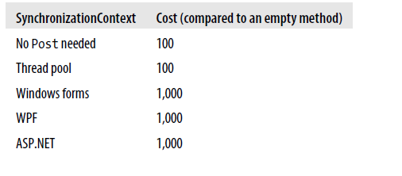

# 异步代码的性能

你可能选择使用异步代码，是因为从性能上来考虑的。无论是 UI 应用程序的响应能力，还是服务器的吞吐能力，或者能够使用 actors 来并发，你都需要了解这整个实际上这些改变都是值得的。

考虑异步代码的性能，你必须要查看比较每个情况下相关的选择。这节，我们讲涉及：

- 对于长时间运行的操作场景，那么潜在的可能异步
- 对于非长时间运行的操作场景，在这种情况下是没必要执行异步的
- 比较异步代码与标准代码，哪块是长时间操作
- 比较异步代码与手动异步代码

我们也将讨论一点有用的优化措施，关于如果你发现在你的应用程序中，正是由于异步机制引起额外的性能消耗问题。

## 测量异步消耗

异步方法机制在同等情况下毫无疑问的要比同步方法使用了更多的处理周期，并且线程之间的切换会增加额外的延迟（性能消耗）。也就是说异步方法的性能上有额外的消耗，这是很有可能的。应用程序的性能依赖于其他线程正在做的事，缓存行为，以及其他未可知的因素。处理器的使用与延迟增加之间也是有区别的，因为一个异步系统能够执行一个正在队列等待的请求，能够很容易的不经 CPU 给一个操作增加时间。所以我只是给你一个数量级的分析，最接近的因子是 10。我使用普通方法调用的开销作为比较的基准线。我的笔记本电脑每秒可以调用一个方法大概一亿次。

## 异步与阻塞之间的长时操作比较

使用异步代码的通常的理由是一个长时间运行的操作，这样你可以执行异步，充分使用资源。在 UI 代码中，除非这个操作确保非常，否则通常都是值得使用异步来保持 UI 的响应能力。在服务端代码，权衡更加微妙，你正在使用阻塞线程的额外的内存来换取异步方法额外处理器的开销。

异步方法的开销，它实际异步运行依赖于它是否需要使用同步上下文（SynchronizationContext.Post）线程切换。如果这么做，那么主要的开销就是为了恢复到正确的方法位置来执行的线程切换。那也就是说当前的同步上下文造成了很大的不同。我的意思是通过运行这个方法来测量开销，它什么也不做，只是等待 Task.Yield，但它总能异步完成：

```c#
async Task AlexsMethod()
{
    await Task.Yield();
}
```

下面的表格是表明异步方法在执行和恢复下的开销



我们是否愿为线程开销买单，这取决于 被调用的原始代码的 SynchronizationContext，只要 SynchronizationContext 所在的线程都能完成 Task。

- 如果它们（指场景，消耗）都是相同，那么这里就不需要 Post到原始的 SynchronizationContext，并且方法能够通过完成 Task 的线程被恢复，同步，作为完成 Task 的一部分。
- 如果原始调用者有 SynchronizationContext，但是与完成 Task 的线程不一样，我们就需要去 Post，产生了表中描述的高消耗。这也发生了如果完成者线程没有 SynchronizationContext 的情况。
- 如果原始调用者没有 SynchronizationContext —— 举个例子，在控制台应用程序，然后发生什么取决于完成线程的 SynchronizationContext。如果存在 SynchronizationContext，.NET 会假定这个线程是重要的，并且调度我们的方法在线程池中恢复。如果这个完成线程没有 SynchronizationContext，或者只是在默认的线程池中的一个，它就会在相同的线程上同步的恢复我们的方法。

> 理论上，当比较在相同的线程恢复这个方法在我的这个数量级下，.NET 线程池是非常快的，线程切换的开销是不会展示出来的的。综上所述，我们没必要去担心完成线程的 SynchronizationContext。

这些规则的意思就是异步方法链将驱使招致一个昂贵的线程切换，当要恢复深入的方法的时候。之后，SynchronizationContext 就会相同，并且剩下的方法能够很便宜的（指开销相对小）恢复。同样在 UI 应用程序下也是非常昂贵的。但是在这个程序中，如果你不使用异步代码的话，这对用户来说不是好的体验，这明显不是一个好的选择。如果你正在做一个网络请求，并且要花费 500 毫秒，为响应 UI 花费一个毫秒级开销是值得的。 

> 不幸的是，WPF 经常新建了 SynchronizationContext 对象，所以在 WPF 上下，异步代码的深度堆栈恢复每个方法会招致大量的消耗。Windows 窗体 以及 Win8 应用程序则不会有这个问题。

这种权衡在服务端的代码要更加深思熟虑，举个例子，ASP.NET 应用程序。异步代码是否值得，这很大的取决于你的服务是否有内存上的使用瓶颈，因为最大的消耗就是很多的线程使用了很多内存。很多因素能引起你的同步应用程序消耗内存的时间要比它消耗处理器的时间更快，包括：

- 你调用了相对较长的长时间操作
- 你通过使用更多的线程来并行长时间操作
- 更多的请求调用长时间运行的操作，而不是通过内存缓存服务
- 生成响应不要求更多的处理器时间

要知道只有一种方式去测量你服务器的内存使用。如果内存使用存在问题，并且内存被太多线程使用，异步就是一个好的解决方案。它更多的使用 CPU，但是当服务器耗尽内存，并且 CPU 充足，那么这就不是问题。

要记住，异步方法总是要比同步方法使用更多的处理器，实际上不同的地方很少，并且在你的应用程序中更容易的控制其他事。

## 长时间运行的操作下的异步代码优化

如果你的异步代码真正的执行异步，如我们所见，最大的开销在于 SynchronizationContext 上调用了 Post，它会引起线程切换。这点我们在 “Choosing Not to Use SynchronizationContext” 章节有讲过了，你可以使用 ConfigureAwait 来选择不 Post，这样就会避免因线程切换引起的开销，除非它真的必要的。如果你的代码在 WPF UI 线程调用，它就会更加有用（通过调用 ConfigureAwait）避免重复调用 Post。

其他的调用线程上下文，会通过 ExecutionContext 捕捉，这也是开销的源头，当你写异步方法的时候。我们在 “Context” 小节也看到了，.NET 会在每处await 的地方捕捉并且重新存储异常上下文。如果你不需要使用到 ExecutionContext，这个捕捉和存储的默认上下文的处理会被优化，并且非常便宜（指性能）。如果你使用任何关于 ExecutionContext 捕捉的上下文，它就会变得非常昂贵。所以，要避免使用 CallContext，LogicalCallContext，或者模拟（impersonation）异步来提高性能。

## 异步与手动异步之间的比较

如果你已经存在 UI 代码了，它通过一些表单的手动异步技术可能避免响应能力问题。这些有一些潜在的优化方法，包括：

- 新起一个线程
- 使用 ThreadPool.QueueUserWorkItem 的后台线程来执行长时间运行的工作
- 使用后台工作线程
- 手动恢复异步API

所有涉及的方法至少有一个转回到 UI 线程来展示结果给用户，异步代码会自动做同样的事。在这些方法中，这是隐式的（举个例子，BackgroundWorker.RunWorkerCompleted 事件）,与此同时，你需要显示的调用 BeginInvoke 方法。

在速度上，这些方法之间的差异有少许不同，从新建线程来看，它是显得很慢。异步是至少要比他们都要快的，如果你避免之前说的注意事项 ExecutionContext。实际上，我发现它要比其他方法会更快。

因为它是轻量快速的，因为代码更加具有可读性，在上面引入的那些技术中我总是原因使用异步。

## 在非长时间操作下异步与阻塞的比较

一个共同的场景就是写一个方法，它偶尔会花相对较长的时间，但是 99% 的时间里非常快。网络请求缓存就是一个例子，大部分的请求都能由缓存处理。这种操作是否选择使用异步代码将依赖于代码异步完成时通常情况下的开销，而不是在 1% 情况下的开销。

要记住，await 关键字实际上不会在不需要的时候暂停方法，这种情况下，它会被赋予已经完成的 Task。这个方法包含了 await 的方法，它也能异步完成，然后已经返回已经完成的任务。在那种方式，异步方法的整个链都能同步返回。

异步方法甚至在他们同步运行的时候，不可避免的要比它们的非异步版本的要慢。现在，通过资源释放这是没有优势的。所谓的异步方法不是异步的，所谓的阻塞方法也不是阻塞。但是在 1% 的情况的异步优势，缓存无法服务于请求，那将会变得很大，那么无论什么情况下都是值得写异步代码的。

他们从一个缓存中同步返回快慢完全取决于异步代码与同步代码之间的快慢。

再次重申，这很难去精准测量，因为它取决很多场景。我发现同样调用一个空的方法 10 次，异步方法是要比非异步方法要慢的。

这听起来是说异步代码要比非异步代码慢，但是要记住，这个只是纯消耗。在实际中，这是在你实际工作正在的做的事情有关的。例如，你在 **Dictionary<string,string>** 同样调用 10 次空方法，消耗是相同的。

## 非长时间运行的操作下的异步优化

同步完成的异步方法开销（大约是空的非异步方法的 10 倍）主要来自几个不同的地方。其中大部分都是不可避免的，例如正在运行的编译器生成器代码，调用框架，并且可能会由于异步方法的异常处理行为而丢失优化。

其中最大可以避免的消耗部分就是堆上的对象分配。分配对象是非常便宜的。然而，分配越多的对象就意味着垃圾回收器必须经常运行，这种消耗是非常昂贵的，当这个对象在垃圾回收期间任然处于使用状态。

异步机制主要目的就是尽可能的少分配对象。这也就是为什么状态机是结构体（就好像 **AsyncTaskMethodBuilder**）而不是 class 的原因。如果异步方法暂停，它们只需要异步到堆上就可以了。

**Task** 不是结构体，但是它却总是需要分配内存到堆上。对于这个，.NET 有一些预先分配的任务，它们在异步方法同步完成的时候使用，并且它们共同返回一个值，例如：

- 非泛型，通过完成的 Task
- Task<bool> 返回 true 或 false
- Task<int> 包括一个整形的值
- Task<T> 包含 null

如果你正在写高性能的缓存，并且它们都不适用，你能通过缓存完成的 Task  而不是一个具体的值来避免分配。但是几乎不值得这样做，因为你可能会在代码的其他地方分配对象。

总结，同步完成的异步方法已经非常快了，并且进一步优化他们是很难的。如果你的应用程序没有你预料的快时，并且你发现垃圾回收的确是一个问题的时候，只有考虑到花时间在缓存任务上努力。

## 异步性能概述

异步代码做同样的事总是比同步代码使用更多的处理器时间，它们在处理异步通常的比较不同的地方也很小。在服务端，需要权衡额外的线程所带来的内存占用比。在 UI 代码中，当使用 actors 来实现并发性时，异步代码都要比实现了手动异步模式要快，所以我们应该使用它。

最后，当一个操作经常需要马上完成时，使用异步代码是没有坏处的，因为它只比同等的非异步代码慢一丁点。