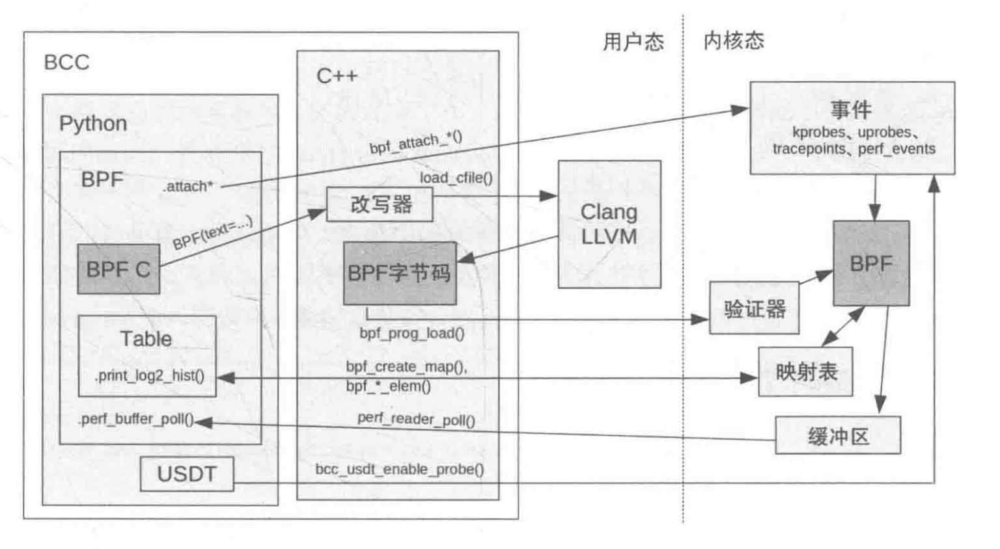
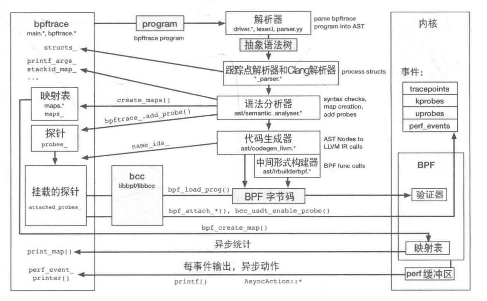
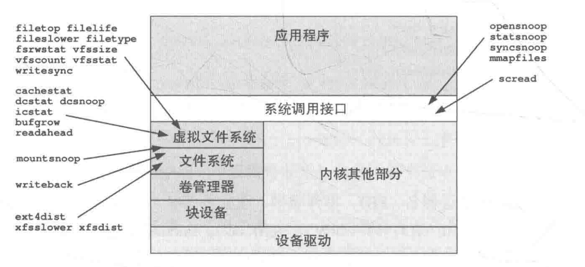
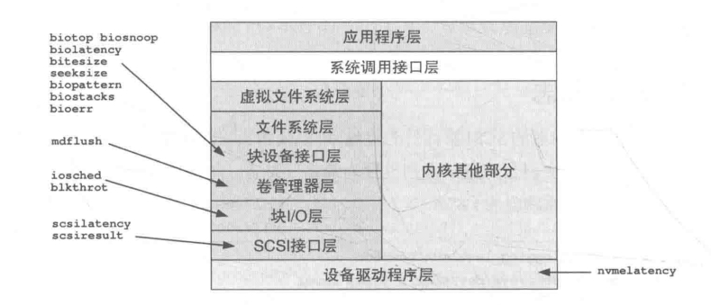
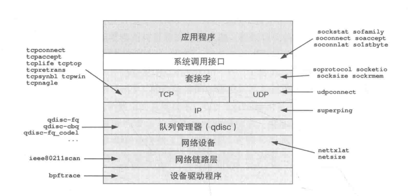

# BPF之巅

## BPF、eBPF

BPF 的全称是伯克利数据包过滤器（Berkeley Package Filter，BPF）。

BPF 提供了一种在各种内核事件和应用程序事件发生时运行一小段程序的机制，在这种机制下就催生了很多新的编程技术。该技术将**内核变得可编程**，允许用户（包括非专业内核开发人员）定制和控制他们的系统，以解决现实问题。

BPF 是一个非常灵活而高校的技术，由指令集、存储对象和辅助函数等几部分组成。由于它采用了虚拟指令集规范，因此也可以视作一种虚拟机实现。这些指令由 Linux 内核的 **BPF 运行时模块**执行；该运行时提供两种运行机制：一个**解释器**和将 BPF 指令动态转换为本地化指令的**即时（JIT）编译器**。

BPF 指令必须先经过验证器（verifer）的安全性检查，以确保 BPF 程序本身不会崩溃和损坏内核。

BPF 目前主要的应用领域是：网络、可观测性和安全。

而 eBPF 是在 BPF 的拓展（extend Berkeley Package Filter）。

现在我们普遍提到的 BPF 其实就是指的 eBPF。

BPF 宣称“一次编译，到处运行”（Compile Once-Run Everywhere）的项目，即旨在支持将 BPF 程序**一次性编译为字节码**，保存后分发至其它机器执行。

## 辅助函数

### bpf_probe_read()

`bpf_probe_read()` 是一个特别重要的辅助函数。BPF 中的内存访问仅限于 BPF 寄存器和栈空间（BPF 映射表）。如果需要访问其它内存（如 BPF 之外的其它内核地址），就必须经过 `bpf_probe_read()` 函数来读取。这个函数会进行安全性校验，内部会检查函数即将访问的内存页是否已经映射在内存中，如果不在则直接返回错误，这样就保证了在 probe 上下文中不会发生缺页中断。这个函数是实现 tracing、monitoring、package processing 等功能的基础。

> 检查缺页中断的原因是提高安全性。因为如果发生缺页中断处理程序，则会暴露以下风险：
>
> 1. 缺页中断会陷入内核态，这样会打断 BPF 程序的执行。BPF 运行在内核态下的沙盒环境中，由自己独立的寄存器状态和栈空间。触发了缺页中断会保存并切换掉当前 BPF 的上下文转而去处理中断服务程序。这种上下文切换一是有开销，二是该操作是不可见的，容易位置的错误（如寄存器值、栈空间内容被修改等）。
> 2. 缺页中断的页面加载可能会被攻击者利用，加载恶意代码。

## kprobes

**kprobes**是 Linux 内核中得一种动态跟踪机制，运行在运行时安全地对内核的各种函数进行 hook，**不需要重启内核**。

它执行过程如下：

1. 在将要 hook 的目标函数地址中的字节内容复制并保存（目的是单步断点指令，腾出一个位置来”插播“运行应用程序）。也就是注册 kprobes。
2. 当内核执行到目标地址断点时，该断点处理函数会检查这个断点是否有 kprobes 注册的，如果有就会执行 kprobes 函数注册的自定义处理程序。
3. 在处理程序执行期间，可以访问内核状态，也可以调用原内核函数。
4. 原始指令会继续执行，指令流继续。
5. 当执行结束后或不需要 kprobes 时，原始的字节内容会被复制回目标地址上，这样指令就回到了它们最初始的状态。

bcc 和 bpftrace 就用到了这个接口。

## uprobes

**uprobes** 与 kprobes 类似，只不过 uprobes 是用户级动态追踪机制，可以用于跟踪和分析用户空间程序的执行。

uprobes 可以在用户态程序的以下位置插入自定义函数（hook）：函数入口、特定偏移处和函数返回处。

它的执行过程与 kprobes 是一致的。

## BCC

**BCC**由三个部分组成。

- 一个 C++ 前端 API，用于内核态的 BPF 程序的编制，包括：
  - 一个预处理宏，负责将内存引用转换为 `bpf_probe_read()` 函数调用（在未来的内核中，还包括使用 bpf_probe_read() 的变体）。
- 一个 C++ 后端驱动：
  - 使用 Clang/LLVM 编译 BPF 程序。
  - 将 BPF 程序装载到内核中。
  - 将 BPF 程序挂载到事件上。
  - 对 BPF 映射表进行读/写。
- 用于编写 BCC 工具的语言前端：Python、C++ 和 Lua。

下面是 BCC 的内部架构图：





### BCC 装载 BPF 程序的执行过程

1. 创建 Python BPF 对象，将 BPF C 程序传递给该 BPF 对象。
2. 使用 **BCC 改写器**对 BPC C 程序进行预处理，将内存访问替换为 `bpf_probe_read()`调用。
3. 使用 Clang 将 BPF C 程序编译为 **LLVM IR**。
4. 使用 BCC codegen 根据需要增加额外的 LLVM IR。
5. **LLVM 将 IR 编译为 BPF 字节码**。
6. 如果用到了映射表，就创建这些映射表。
7. 字节码被传送到内核，并经过 BPF 验证器的检查。
8. 事件被启用，BPF 程序被挂载到事件上。
9. BCC 程序通过映射表或 `perf_event` 缓冲区读取数据。

上述内容其实我们可以简化一下：

- 开发者用 Python 编写的 BPF 程序，BCC 前端进行检查和分析，最后输出 C 语言代码。
- LLVM 将 C 语言代码编译生成 **BPF 字节码**。
- 通过调用 BPF 的系统调用函数（辅助函数），将 BPF 字节码加载到内核的 BPF 虚拟机。
- 在虚拟机触发事件调用时（加载 BPF 字节码），就会触发编写的处理函数。

## bpftrace

**bpftrace**已经演变成为了一种编程语言。这些 bpftrace 特性会按照事件源、动作和一般特性。

下面是一个检查 IO 负载情况的 bpftrace 代码：

```bash
#!/usr/bin/bpftrace

// 在磁盘IO开始时记录时间戳 
BEGIN
{
    printf("Tracing disk I/O... Hit Ctrl-C to end.\n");
}

// 追踪bio请求结构
tracepoint:block:block_rq_issue
{
  @start[tid] = nsecs; 
}

// 追踪bio请求完成
tracepoint:block:block_rq_complete
{
  @ns[tid] = nsecs - @start[tid];
  @bytes[tid] = args->bytes; 
  delete(@start[tid]);
}

// 聚合结果
END
{
  clear(@start);
  printf("Duration (ns)  Bytes \n");
  print(@ns, @bytes);
  clear(@ns); 
  clear(@bytes);
}
```

这个程序使用了 `tracepoint` 追踪块设备 IO 的发出和完成时刻。记录每次 IO 的字节数和持续时间，最终聚合打印出总体结果，反映 IO 负载情况。

## BPF 的可观测领域

BPF 非常适合使用在系统的可观测领域。通过 BPF 程序可以在 CPU 调度器和系统调用事件中埋点；用 krobes 来跟踪内核态、uprobes 来跟踪用户态，以及还可以用**性能监控计数器（Performance Minitoring Counter，PMC）**获取定时采样 CPU 数据等。

### 检测工具

#### 与 CPU 相关的工具

| 工具       | 分析对象 | 描述                                  |
| ---------- | -------- | ------------------------------------- |
| execsnoop  | 调度     | 列出新进程的运行信息                  |
| exitsnoop  | 调度     | 列出进程运行时长和退出的原因          |
| runglat    | 调度     | 统计CPU运行队列的延迟信息             |
| runglen    | 调度     | 统计CPU运行队列的长度                 |
| rungslower | 调度     | 当运行队列中等待时长超过闯值时打印    |
| cpudist    | 调度     | 统计在CPU上运行的时间                 |
| cpufreq    | CPU      | 按进程来采样CPU运行频率信息           |
| profile    | CPU      | 采样CPU运行的调用栈信息               |
| offcputime | 调度     | 统计线程脱离CPU时的跟踪信息和等待时长 |
| syscount   | 系统调用 | 按类型和进程统计系统调用次数          |
| argdist    | 系统调用 | 可以用来进行系统调用分析              |
| trace      | 系统调用 | 可以用来进行系统调用分析              |
| funccount  | 软件     | 统计函数调用次数                      |
| softirqs   | 中断     | 统计软中断时间                        |
| hardirgs   | 中断     | 统计硬中断时间                        |
| smpcalls   | 内核     | 统计SMP模式下的远程CPU调用信息        |
| llcstat    | PMC      | 按进程统计LLC命中率                   |

#### 与内存相关的监测工具

| 工具   | 分析对象                     | 描述                                |
| ------ | ---------------------------- | ----------------------------------- |
| dmesg  | 内核日志                     | OOM Killer 事件的详细信息           |
| swapon | 内核统计数据                 | 换页设备的使用量                    |
| free   | 内核统计数据                 | 全系统的内存用量                    |
| ps     | 内核统计数据                 | 每进程的统计信息，包括内存用量      |
| pmap   | 内核统计数据                 | 按内存段列出进程内存用量            |
| vmstat | 内核统计数据                 | 各种各样的统计信息，包括内存        |
| sar    | 内核统计数据                 | 可以显示换页错误和页扫描的频率      |
| perf   | 软件事件、硬件统计、硬件采样 | 内存相关的PMC统计信息和事件采样信息 |

BPF 工具

| 工具      | 分析对象 | 描述                                      |
| --------- | -------- | ----------------------------------------- |
| oomkill   | 00M      | 展示 OOM Killer 事件的详细信息            |
| memleak   | 调度     | 展示可能有内存泄漏的代码路径              |
| mmapsnoop | 系统调用 | 跟踪全系统的 `mmap() `调用                |
| brkstack  | 系统调用 | 展示 (`brk()`) 调用对应的用户态代码调用栈 |
| shmsnoop  | 系统调用 | 跟踪共享内存相关的调用信息                |
| faults    | Faults   | 按用户调用栈展示缺页错误                  |
| ffaults   | Faults   | 按文件名展示缺页错误                      |
| vmscan    | VM       | 测量 VM 扫描器的收缩和回收时间            |
| drsnoop   | VM       | 跟踪直接回收时间，并且显示延迟信息        |
| swapin    | VM       | 按进程展示页换入信息                      |
| hfaults   | Faults   | 按进程展示巨页的缺页错误信息              |

分析策略：

1. 检查系统信息中是否有 00M Killer 杀掉进程的信息(例如，使用 `dmesg`)。
2. 检查系统中是否配置了换页设备，以及使用的换页空间大小;并且检查这些换页设备是否有活跃的 I/0 操作(例如，使用 `swap`、`iostat`、`vmstat`)。
3. 检查系统中空闲内存的数量，以及整个系统的缓存使用情况（例如，使用 `fee`）。
4. 按进程检查内存用量(例如，使用 `top` 和 `ps`）。
5. 检查系统中缺页错误的发生频率，并且检查缺页错误发生时的调用栈信息，这可以解释 RSS 增长的原因。
6. 检查缺页错误和哪些文件有关。
7. 通过跟踪 `brk()` 和 `mmap()` 调用来从另一个角度审查内存用量。
8. 使用 PMC 测量硬件缓存命空率和内存访问(最好启用 PEBS)，以便分析导致内存 I/O 发生的函数和指令信息(例如，使用 `perf`)。

下面代码片段是使用 btrace 查询 Linux 服务器中与内存相关的多种指标（内存分配、缺页、回收等）信息的代码:

```bash
#!/usr/bin/bpftrace

// OOM Killer
kprobe:oom_kill_process {
  @oom[pid, comm] = count();
}

// 用户态内存分配  
uprobe:/usr/lib/libc.so.6:malloc {
  @malloc[pid, comm] = count();
}

uprobe:/usr/lib/libc.so.6:free {
  @free[pid, comm] = count();  
}

// 内存映射
kprobe:sys_mmap {
  @mmap[pid, comm] = count();
}

// 缺页错误
kprobe:handle_mm_fault {
  @minfault[pid, comm] = count();
}

// vmscan 
kprobe:try_to_free_pages {
  @vmscan[pid, comm] = count();
}

// 直接回收
kprobe:__vm_enough_memory {
  @directreclaim[pid, comm] = count();
}  

// 页换入换出
software:major-faults:1 {
  @majflt[pid, comm] = count();
}

software:page-faults:1 {
  @minflt[pid, comm] = count();
}

END {
  clear(@oom);
  clear(@malloc);
  clear(@free);
  clear(@mmap); 
  clear(@minfault);
  clear(@vmscan);
  clear(@directreclaim);
  clear(@majflt);
  clear(@minflt);
}
```

#### 与文件系统相关的监测工具



| 工具       | 目标     | 描述                                     |
| ---------- | -------- | ---------------------------------------- |
| opensnoop  | 系统调用 | 跟踪文件打开信息                         |
| statsnoop  | 系统调用 | 跟踪 stat 调用的各种变体                 |
| syncsnoop  | 系统调用 | 跟踪 sync 调用以及各种变体，带时间戳信息 |
| mmapfiles  | 系统调用 | 统计 mmap 涉及的文件                     |
| scread     | 系统调用 | 统计 read 涉及的文件                     |
| fmapfault  | 系统调用 | 统计文件映射相关的缺页错误               |
| filelife   | VFS      | 跟踪短时文件，按秒记录它们的生命周期     |
| vfsstat    | VFS      | 统计常见的 VFS 操作                      |
| vfscount   | VFS      | 统计所有的 VFS 操作                      |
| vfssize    | VFS      | 展示 VFS 读/写的尺寸                     |
| fsrwstat   | VFS      | 按文件系统类型展示 VFS 读/写数量         |
| fileslower | VFS      | 展示较慢的文件读/写操作                  |
| filetop    | VFS      | 按 IOPS 和字节数排序展示文件             |
| filetype   | VFS      | 按文件类型和进程显示 VFS 读/写操作       |
| writesync  | VFS      | 按 sync 开关展示文件写操作               |
| cachestat  | 页缓存   | 页缓存相关统计                           |
| writeback  | 页缓存   | 展示写回事件和对应的延迟信息             |
| dcstat     | Dcache   | 目录缓存命中率统计信息                   |
| dcsnoop    | Dcache   | 跟踪目录缓存的查找操作                   |
| mountsnoop | VFS      | 跟踪系统中的挂载和卸载操作 (mount)       |
| xfsslower  | XFS      | 统计过慢的 XES 操作                      |
| xfsdist    | XFS      | 以直方图统计常见的 XFS 操作延迟          |
| ext4dist   | ext4     | 以直方图统计常见的 ext4 操作延迟         |
| icstat     | Icache   | inode 缓存的命中率统计                   |
| bufarow    | 缓冲缓存 | 按进程和字节数统计缓冲缓存的增长         |
| readahead  | VFS      | 展示预读取的命中率和效率                 |

下面代码段是使用 btrace 查询 Linux 服务器文件系统相关指标的代码：

```bash
#!/usr/bin/bpftrace

// VFS calls
kprobe:vfs_read, vfs_write {
  @vfs[func] = count();
} 

// 文件系统调用
kprobe:sys_open, sys_close {
  @fs[func] = count();
}

// 文件系统tracepoints
tracepoint:ext4:ext4_da_write_begin, ext4:ext4_da_write_end {
  @ext4[probe] = count(); 
}

// 写回和预读取
kprobe:wbc_writeback_start, wbc_writeback_end {
  @wb[func] = count();
}

kprobe:ra_submit, ra_end {
  @readahead[func] = count();
}

// 缓存
kprobe:mark_page_accessed {
  @pagecache = count(); 
}

kprobe:dget, dput {
  @dcache = count();
}

kprobe:iget, iput {
  @icache = count();
}

kprobe:mark_buffer_dirty {
  @buffercache = count();
}
  
END {
  clear(@vfs);
  clear(@fs);
  clear(@ext4);
  clear(@wb);
  clear(@readahead);
  clear(@pagecache);
  clear(@dcache);
  clear(@icache);
  clear(@buffercache);
}
```

#### 与磁盘相关的监测工具



| 工具        | 目标      | 介绍                              |
| ----------- | --------- | --------------------------------- |
| biolatency  | 块I/O     | 以直方图形式统计块I/O延迟         |
| biosnoop    | 块I/O     | 按PID和延迟闽值跟踪块I/O          |
| biotop      | 块I/O     | top工具的磁盘版:按进程统计块I/O   |
| bitesize    | 块I/O     | 按进程统计磁盘I/O请求尺寸直方图   |
| seeksize    | 块I/O     | 展示IO寻址(seek)的平均距离        |
| biopattern  | 块I/O     | 识别随机/顺序式磁盘访问模式       |
| biostacks   | 块I/O     | 展示磁盘I/O相关的初始化软件栈信息 |
| bioerr      | 块I/O     | 跟踪磁盘错误                      |
| mdflush     | MD        | 跟踪MD的写空请求                  |
| iosched     | I/O sched | 统计I/O调度器的延迟               |
| scsilatency | SCSI      | 展示SCSI命令延迟分布情况          |
| scsiresult  | SCSI      | 展示SCSI命令结果代码              |
| nvmelatency | NVME      | 统计NVME驱动程序的命今延迟        |

下面代码段是使用 btrace 查询 Linux 服务器磁盘系统相关指标的代码：

```bash
#!/usr/bin/bpftrace

// 块I/O层
kprobe:__make_request {
  @blockrq[func] = count();
}

kprobe:submit_bio {
  @blocksubmit[func] = count();  
}

// IO调度层
kprobe:blk_queue_bio {
  @ioreq[func] = count();
}  

kprobe:blk_peek_request, blk_dequeue_request {
  @sched[func] = count();
}

// SCSI层
kprobe:scsi_dispatch_cmd_start {
  @scsi[func] = count();
}

// NVMe驱动层 
kprobe:nvme_setup_cmd {
  @nvme[func] = count();
}

kprobe:nvme_submit_io {
  @nvmesubmit[func] = count();
}

END {
  clear(@blockrq);
  clear(@blocksubmit);
  clear(@ioreq);
  clear(@sched);
  clear(@scsi);
  clear(@nvme);
  clear(@nvmesubmit);
}
```

#### 与网络相关的监测工具

传统工具：

| 工具    | 目标         | 介绍                               |
| ------- | ------------ | ---------------------------------- |
| ss      | 内核统计     | 网络套接字统计                     |
| ip      | 内核统计     | IP统计                             |
| nstat   | 内核统计     | 网络软件栈统计                     |
| netstat | 内核统计     | 显示网络软件栈统计和状态的复合工具 |
| sar     | 内核统计     | 显示网络和其他统计信息的复合工具   |
| nicstat | 内核统计     | 网络接口统计                       |
| ethtool | 驱动程序统计 | 网络接口驱动程序统计               |
| tcpdump | TCP抓包      | 抓包分析                           |

BPF工具：



| 工具           | 目标   | 介绍                                   |
| -------------- | ------ | -------------------------------------- |
| sockstat       | 套接字 | 套接字统计信息总览                     |
| sofamily       | 套接字 | 按进程统计新套接字协议                 |
| soprotocol     | 套接字 | 按进程统计新套接字传输协议             |
| soconnect      | 套接字 | 跟踪套接字的IP协议主动连接的细节信息   |
| soaccept       | 套接字 | 跟踪套接字的IP协议被动连接的细节信息   |
| socketio       | 套接字 | 套接字细节信息统计，包括IO 统计        |
| socksize       | 套接字 | 按进程展示套接字IO尺寸直方图           |
| sormem         | 套接字 | 展示套接字接收缓冲区用量和溢出情况     |
| soconnlat      | 套接字 | 统计IP套接字连接延迟，带调用栈信息     |
| solstbyte      | 套接字 | 统计IP套接字的首字节延迟               |
| tepconnect     | TCP    | 跟踪TCP主动连接(connect))              |
| tcpaccept      | TCP    | 跟踪TCP被动连接(accept))               |
| tcplife        | TCP    | 跟踪TCP连接时长，带连接细节信息        |
| tcptop         | TCP    | 按目的地展示TCP发送和接收吞吐量        |
| tcpretrans     | TCP    | 跟踪TCP重传，带地址和TCP状态           |
| tcpsynbl       | TCP    | 以直方图展示TCP SYN积压队列            |
| tcpwin         | TCP    | 跟踪TCP发送中的阻塞窗口的细节信息      |
| tcpnagle       | TCP    | 跟踪TCP中nagle算法的用量，以及发送延迟 |
| udpconnect     | UDP    | 通过库函数调用跟踪DNS查找延迟          |
| gethostlatency | DNS    | 跟踪IP入栈显式阻塞通知(ECN)的细节      |
| ipecn          | IP     | 测量网络软件栈中的ICMPecho时间         |
| superping      | ICMP   | 展示 FQ 队列管理器的延迟               |
| qdisc-fq(..)   | qdisc  | 展示网络设备I/O尺寸                    |
| netsize        | 网络   | 展示网络设备发送延迟                   |
| nettxlat       | 网络   | 展示网络设备发送延迟                   |
| skbdrop        | skbs   | 跟踪sk_buff丢弃情况，带内核调用栈信息  |
| skblife        | skbs   | 在网络软件栈各层之间跟踪 sk_buf 的延迟 |
| ieee80211scan  | Wifi   | 跟踪 IEEE802.11 WiFi 扫描情况          |

下面代码段使用 btrace 查询 Linux 服务器网络相关指标的代码:

```bash
#!/usr/bin/bpftrace

// 套接字层
kprobe:inet_csk_accept, tcp_v4_connect {
  @sock[func] = count();
} 

// TCP相关
kprobe:tcp_sendmsg, tcp_cleanup_rbuf {
  @tcp[func] = count(); 
}

// 网卡队列
kprobe:dev_queue_xmit {
  @qlen = hist(args->len); 
}

// 连接统计
kprobe:tcp_connect {
  @connect = count();
}

// 连接的时间
kretprobe:tcp_connect /@retval == 0/ {
  @tstart[tid] = nsecs; 
}

// 连接延迟
kretprobe:tcp_connect /@retval == 0/ {
  @tdelay[tid] = nsecs - @tstart[tid];
  printf("connection time: %d ns\n", @tdelay[tid]);
  delete(@tstart[tid]);  
}

// 首字节延迟
kretprobe:tcp_recvmsg {
  @tfristbyte[tid] = nsecs - @tdelay[tid];
}
// 重传指标 
kprobe:tcp_retransmit_skb {
  @retrans = count();
}

END {
  clear(@sock); 
  clear(@tcp);
  clear(@qlen);
  clear(@connect);
  clear(@retrans);
}
```

