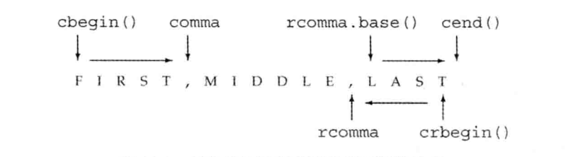

# 迭代器

## 流迭代器

从标准输入流读取数据，再存入一个vector:

```c++
istream_iterator<int> in_iter(cin);	// 从cin读取int
istream_iterator<int> eof; // 尾后迭代器
while (in_iter != eof) // 当输入流中还有数据读取时
{
		// 后置递增运算读取流，返回迭代器的旧值
		// 解引用迭代器，获取流的前一个值
		vec.push_back(*in_iter++);
}
```

当然我们可以直接利用vector的构造函数重载：

```c++
istream_iterator<int> in_iter(cin), eof;
vector<int> vec(in_iter, eof);
```

输出迭代器绑定流：

```c++
ostream_iterator<int> out_iter(cout, " ");
for (auto e : vec)
		*out_iter++ = e;
cout << endl;
```

输出迭代器`out_iter`绑定了一个`cout`输出流。在给这个迭代器赋值，实际上就是奖值写到`cout`。

也可以通过下面的范围取值方式打印值

```c++
copy(vec.begin(), vec.end(), out_iter);
cout << endl;
```

## 处理类类型

只要定义了输入运算符（`>>`）以及输出运算符（`<<`），都可以为其定义流迭代器（`istream_iterator`,`ostream_iterator`）

```c++
// 定义迭代器
istream_iterator<Sales_item> item_iter(cin), eof;
ostream_iterator<Sales_item> out_iter(cout, "\n");
Sales_item sum = *item_iter++;
while (item_iter != eof) {
		// 如果当前交易记录存在相同的ISBN
		if (item_iter->isbd() == sum.isbn())
				sum += *item_iter++;
		else {
				out_iter = sum;
				sum = *item_iter++;
		}
}
out_iter = sum;
```


## 迭代器惰性求值

将迭代器绑定到一个流时，标准库是可以允许延迟执行的（惰性求值）。只有在访问（解引用）具体迭代器才会真正读取数值。

## 反序迭代器（reverse_iterator）

通过一个例子来体现普通迭代器的`begin/cbegin,end/cend,crbegin,crend`的区别：

```c++
std::string s("FIRST,MIDDLE,LAST");
// 取第一个单词
auto comma = std::find(s.cbegin(), s.cend(), ',');
std::cout << std::string(s.cbegin(), comma) << std::endl;
// 取最后一个单词
auto rcomma = std::find(s.crbegin(), s.crend(), ',');
std::cout << std::string(s.crbegin(), rcomma) << std::endl; // 输出TSAL，不是预期的结果，因为反序输出了LAST
// 正确写法
std::cout << std::string(rcomma.base(), s.cend()) << std::endl;
```

具体的关系与区别可以通过下面的图直接的看出来。



​												反向迭代器与普通迭代器的关系

