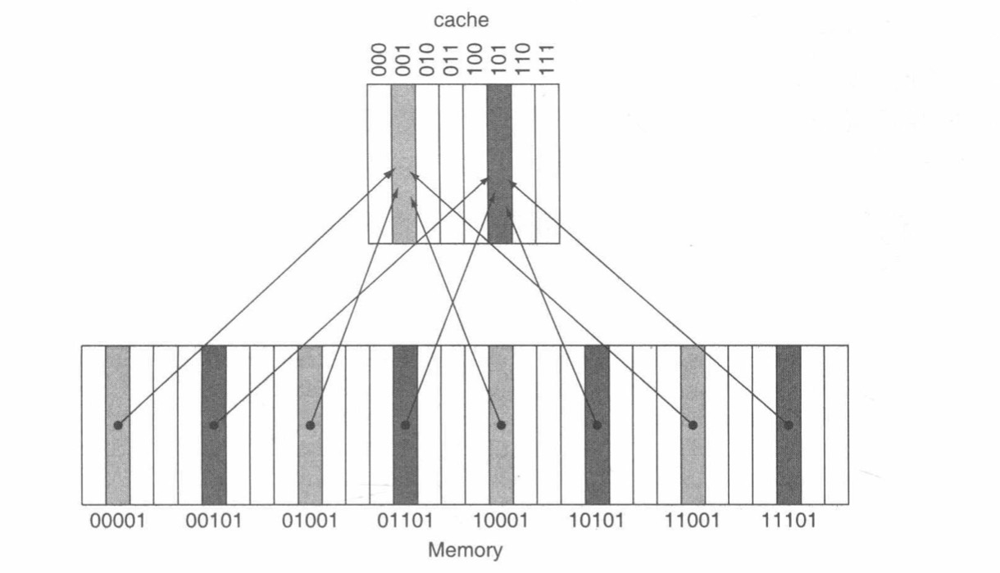
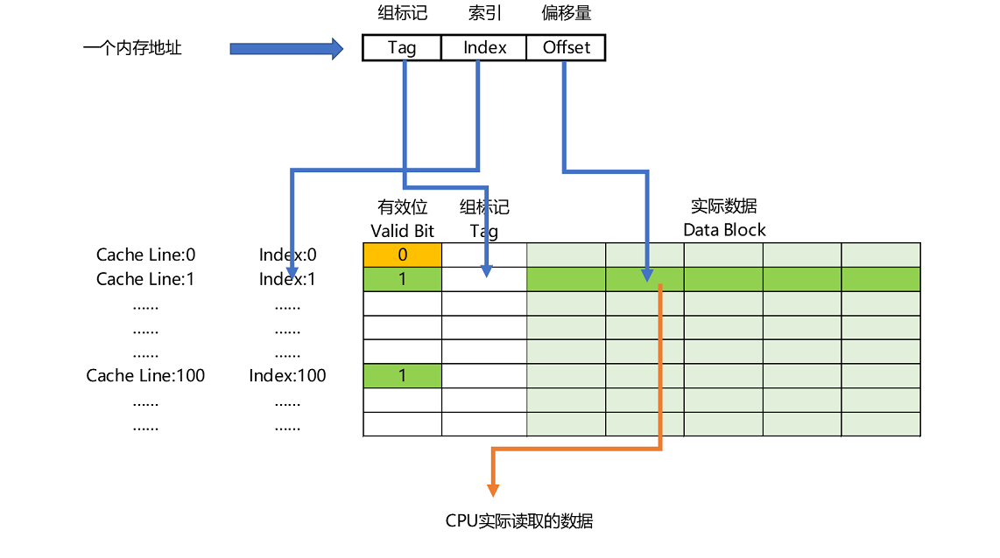
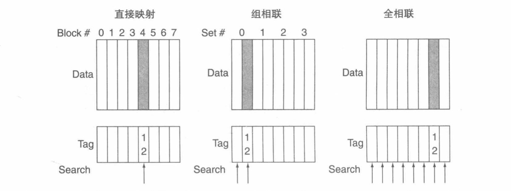
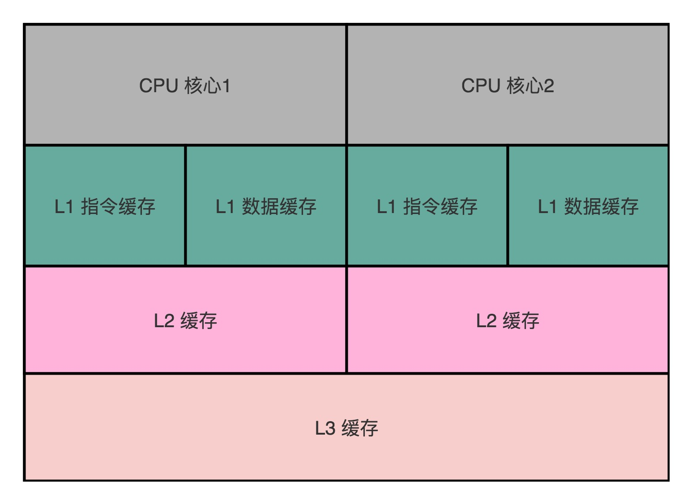
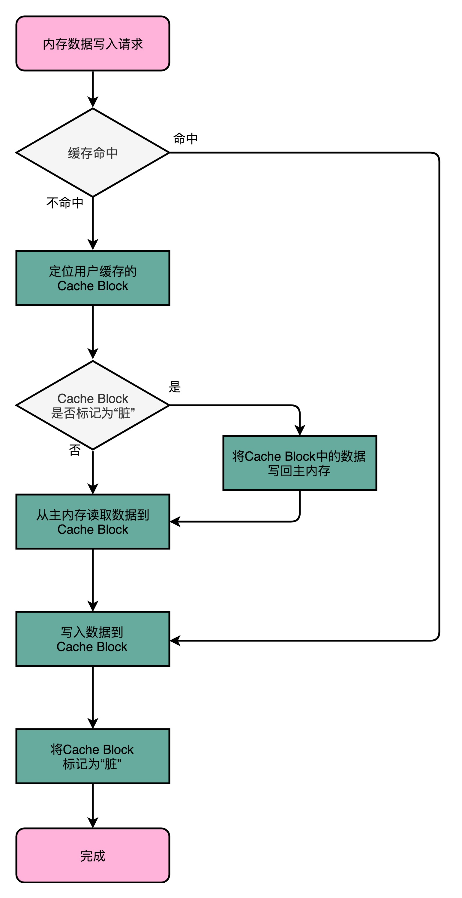

# 深入理解缓存

这片主要是从CPU的层面讲如何利用的缓存的，以及缓存是如何运行的。

我们知道CPU里面是有高速缓存的，主要为了将热指令和数据提前缓存到里面提高CPU的运算力。而缓存的策略就是之前提到的[缓存层次结构-局部性原理](memory-hierarchy.md#内存管理与优化策略——局部性原理（Principle of Locatily）)。在讲CPU读取指令与数据如何利用缓存之前，必须要先知道CPU的缓存结构。

靠近CPU越近的，速度越快。其中以SRAM作为高速缓存（L1级缓存），面积是最小的，价格方面也是最贵的。其查询速度达到了0.5ns。

往下就是L2级缓存，查询速度达到了4ns。（注意：**此时L1，L2是每个CPU核都有独立的缓存块**）

再往下就是L3级缓存（注意：**L3是多个CPU核共享的缓存块，往下都是共享的**）。

再往下就是DRAM结构的主存了，查询速度已经变为了100ns。

那么整成一个如下表格：

| 存储器      | 存储结构 | 访问延时 | 说明        |
| ----------- | -------- | -------- | ----------- |
| L1 Cache    | SRAM     | 0.5～2ns | 核心CPU独享 |
| L2 Cache    | SRAM     | 4ns      | 核心CPU独享 |
| L3 Cache    | SRAM     | 10ns     | 整个CPU共享 |
| Memory 主存 | DRAM     | 100ns    |             |
| 硬盘        | SSD      | 150μs    |             |
| 硬盘        | HDD      | 10ms     |             |

那么CPU取指令/数据到寄存器时，首先是从L1缓存取的，如果发现没有命中缓存就会继续往下找L2缓存，同样如果没有就继续往下找L3、主存最后到硬盘。取到数据之后就会把数据从最底层的缓存回写到L1缓存。之后再取同样的指令/数据就会命中缓存直接µs级就能获取到信息了。

那么CPU又是如何知道目标信息是否在缓存中呢？

## 缓存映射

首先我们得从简单的直接缓存映射开始说起，什么是直接缓存映射，**首先CPU拿到数据的时候已知的就是目标数据的地址，于是就直接基于这个地址来分配cache的具体位置**。这种查找映射方式就被称为**直接缓存映射（direct mapped）**。而映射的规则也很简单：

```
addr % cache_number; 
其中 addr 为目标地址，cache_number 为缓存块的数据块数量
```

举个例子，假设我们的主存分为64个块，分别为0～63号。一共有8个缓存数据块。用户想要访问32号内存块。那么如果32号内存块在缓存中，那么它一定分布在第0号缓存块中（32%8 = 0）。这里面还有计算的小技巧：如果cache的块数是2的幂，则取模运算非常简单，只需要取地址的n次幂的低n位即可。那么还是以上面的例子说明，一个8个数据块的缓存就是2的3次幂，即使用地址的最低3位来查找。那么对32的二进制表示就是`100000`取低三位就是000，对应位置0的缓存块地址。如下图所示：



那么即使这样能找到具体的缓存块，但是像这样的取模算法会有很多数据会分布到相同缓存块中，那么CPU又是如何知道在缓存块的具体哪个位置呢？

这就需要用到缓存块其它的有效信息了：在每个缓存中都会存储一个**组标签（Tag）**。这个组标记会记录记录了当前地址的信息，这些信息可以用来确定目标数据项是否在cache中。组标签只需要记录地址的高位部分，用这个部分来表明请求字是否在cache中。如上面的32的低三位是000，而剩下的高位就是100。

除此之外，还需要一种方法能够判断cache中的数据块中是否保存了有效信息。如当处理器启动时，cache中没有有效数据，标签位都是无意义的。为了解决这个问题我们可以添加一个有效位（valid bit），用来表示该缓存块中的数据是否有效。如果有效位为0，那么即使组标签和缓存项中有数据，CPU都会选择直接访问内存，重新加载数据。

**CPU在读取数据的时候，并不是要读取一整个 Block，而是读取一个他需要的整数。这样的数据，我们叫作 CPU 里的一个字（Word）。具体是哪个字，就用这个字在整个 Block 里面的位置来决定。这个位置，我们叫作偏移量（Offset）。**

这个时候我们就要更改之前的说法了，我们之前是把内存的数据项的地址分为两部分，即地位部分表示的cache索引，高位部分表示的组标签。而现在就是要把内存数据项地址分成三部分：

1. 高位表示的组标签
2. 低位表示的cache索引
3. 以及数据块中用来定位请求字的具体位置的偏移量

整体结构图如下：



那么CPU从内存中获取数据到缓存中所经过的步骤就可以总结为以下几步：

1. 根据内存数据项的地址低位得出cache的索引
2. 根据索引得出具体的缓存块，并通过缓存块上的有效位得知cache中的数据是否有效
3. 根据内存数据项的地址高位和cache块中的组标签，确认该cache中的数据就是这次要找的数据
4. 然后根据偏移量从Data Block中读取对应的实际数据。

整个cache的查找过程就是这样的了。实际上我们现代CPU几乎很少使用这种直接映射缓存方法了，实际上用的**组相连高速缓存（set associative cache）**。

像直接缓存映射这种方式，我们从上面的图可以看这种方式**一个数据块只能定位一个位置**。而组相连高速缓存是有多个缓存行（Cache Line）为一组（至少是2个缓存行）。**一个数据块可以放置组内的多个缓存行内**。组相连高速缓存里面有一个特例，就是数据块可以放在缓存的任意位置，这种就被称为“**全相连高速缓存**”。但是全相连会让每个cache都有一个比较器可以并行地进行比较。这些比较器增加了硬件开销，这就会导致缓存的量很少。

## 组相连高速缓存

**在一个组相连缓存中，每一个数据块可以存放的位置数量是固定（至少是2）的**。每个数据块有n个位置可放的组相连缓存就被称为**n路组相连缓存**。映射的过程其实跟直接缓存映射的过程几乎是一样的。

一个数据块通过低位来定位到具体的某一组的索引，然后就会在这个组中所有的数据块都要一一进行比较。前面我们知道直接缓存映射的公式是`addr % cache_number`。而组相连映射规则是`addr % group_number`。

> 组相连缓存映射的过程，我们其实可以借用哈希链表的思路去理解。首先我们通过目标数据地址计算出组索引，然后组索引后面就是一个链表，沿着这个链表一个一个比较是否命中目标数据项。

最后我们通过《计算机组成与设计》的图标和例子来加深一下映射规则的印象



已知目标数据地址为12。该cache被分为8个数据块：

- 直接映射：12 % 8 = 4。那么cache的数据块为4。然后根据具体的offset找到唯一的位置数据。
- 组相连：12 % 4 = 0。那么目标数据就在第0组，然后在这2个数据块中一一比较目标数据。
- 全相连：目标地址数据块可以放置任意缓存数据块中。

组相连有什么好处呢？这样会提高缓存命中率，更加灵活的替换策略。

> 关于替换策略的内容其实非常复杂，比如有利用[局部性原理](memory-hierarchy.md#内存管理与优化策略——局部性原理（Principle of Locatily）)的，也有最不常用策略（Least-Frequently-Used,LFU）、最近最少使用（Least-Recently-Used,LRU）等。

## 缓存一致性问题

我们从文章的开头的缓存结构表中已经知道了，L1、L2级高速缓存是每个CPU核独有的，而L2级以下是所有CPU核心数共享的。如下面的简易图：



​										(图来源《深入浅出计算机组成原理-高速缓存（下）》)

关于缓存的读我们已经知道了，那么当出现缓存写的时候该如何更新缓存呢？如何保持主存和CPU缓存的数据一致性呢？

如果我们先更新CPU缓存，然后在更新主存。那么当其它CPU核此时还没有发现缓存已经被改了（因为L1，L2独享）；

如果我们先更新主存，那么CPU缓存的数据是不是会立即失效呢？

通常为了解决缓存数据一致性的问题，最简单的方式就是通过**写直达**的方式

### 写直达（Write-Through）

当遇到内存写请求时，首先判断该数据是否已经在缓存中。如果命中缓存，那么就把数据写入到对应的缓存块中；然后继续写入到主存中结束。

如果缓存没有命中，则直接将数据写入到主存。

这种方式理解起来非常简单，实现也很简单。但是问题也很明显，这种方式的性能非常慢。因为每次操作都会操作主存。其实这种方式相当于缓存和主存的同步。

### 写回（Write-Back）

而写回这种解决方案就是为了改善上述写直达的问题的。**当遇到数据写入操作时，我们不是每次都写入主存，而是先写到CPU缓存中。只有当CPU缓存里的数据要被替换时才会将数据写入到主内存中。

具体过程为，如果写入的数据在CPU缓存中，那么我们就只更新该缓存里面的数据。同时还会标记这个缓存数据块是脏（Dirty，表示该缓存被更新过）的，有了这个标示就相当于向那些想访问该数据缓存的CPU宣告，这个缓存已经和主存不一致了。

如果写入的数据对应的缓存数据块放的已经其它地址的数据了（说明在此之前有其它请求来改过），就得继续看该数据块是否是脏的。如果是脏的，那么就得先把缓存数据块中的数据写入到主存中。**紧接着将该数据写回到CPU缓存中，同时将其标记为脏的。**

从这个过程可以看出来，不是每次操作都会直接操作主存。在缓存命中的情况下，都是只用修改CPU缓存即可。性能自然要比写直达更好。

最后给出《深入浅出计算机组成原理-高速缓存（下）》中的流程图加深上述步骤的理解：



上述两种方式其实只是解决了CPU缓存和主存数据一致性的问题。但还是没有解决在多核CPU/多线程下的各自缓存数据一致性的问题。

> 其实还有一种解决缓存和主存数据一致性的方法就是**写缓冲（Write-Buffer）**。该缓冲保存的是等待写回主存的数据。数据写入缓存的同时也写入带该缓冲队列中，之后处理器就回继续执行。如果该队列元素满了，就会发生阻塞，CPU必须停顿流水线知道写缓冲队列中有元素释放。

假设CPU0进行写缓存操作，同步了CPU0下的高速缓存和主存的数据。但是此时CPU1对目标缓存访问时还是以前的数据（CPU1的L1，L2高速缓存没有及时同步）。这个时候就会导致数据的不一致了。

那么这种情况该如何解决呢？就是接下来要讲的MESI协议。

### MESI协议

还是以上面提到的例子进行说明。为了解决这种缓存不一致的问题，我们必须要引入一种同步的机制，将多个CPU核各自的超速缓存的数据进行同步。

如何实现呢？总共要实现两个部分

#### 写传播（Write-Propagation）

就如名字一样，一个CPU核的缓存更新了，就必须将值传播至其它CPU核心对应的缓存数据块更新。

#### 事务串行化（Transaction Serialization）

这个也很好理解，就像数据库的串行化一样，要保证事物更改的顺序性。这样才能保证数据的一种性。那么要实现这种串行化，那必然要引入锁的概念了，谁拿到了更新该缓存数据块的锁，谁就有写入缓存的权利。

而实现了这两种方法比较常见的就是**总线嗅探(Bus Snooping)**。它实现写传播（即多CPU核之间的数据传播），一种实现方式是，就是说将要该的目标数据通过IO总线来传播到所有的CPU核心并响应请求。

基于总线嗅探，可以划分很多不同的缓存一致性协议。这里还是专讲MESI协议，它是一种**写失效（Write Invalidate）**的协议。**在这个协议里，只有一个CPU核心负责去写入数据，其它核心只是同步去读取这个写入。在这个CPU写入缓存之后，会发出一个请求通知其它的CPU该缓存数据块已失效。而其它的CPU只是接受这个结果并将设置对应的缓存失效即可。**

> 相对于写失效协议，还有一种协议是**写广播（Write Broadcast）**协议。即一个写缓存请求会广播给其它所有CPU核心，同时更新各个CPU核心中的目标缓存数据。

到底什么是MESI？其实就是对应CPU缓存的四个状态：

- M(Modify)：代表已修改（就是前文提到的脏数据）
- E(Exclusive)：独占
- S(Shared)：共享
- I(Invalidated)：失效

M和I这个很好理解，就不在赘述了。这里着重讲讲E、S。

E：表示各自CPU核心自己管理自己的缓存，就是说多个CPU可以各自修改自己缓存中的数据，同样就不需要通知到其它CPU核心。在独占状态下，如果收到了来自IO总线的读取缓存请求，这个时候就会进入S状态。

S：**在共享状态下，各个CPU核心目标缓存都是一致的，所以这个时候如果要对缓存中的值进行写入修改操作，那么此时不能直接修改目标缓存数据块，而是先向所有的其它CPU核心发起一个广播请求，将其它CPU核心里面的缓存设置成无效状态，然后再更新缓存中的数据。**

> MESI协议其实是MSI的优化版本，相较于MSI，MESI减少了与[MSI协议](https://zh.wikipedia.org/wiki/MSI%E5%8D%8F%E8%AE%AE)相关的主存事务的数量，显著提高了性能。

