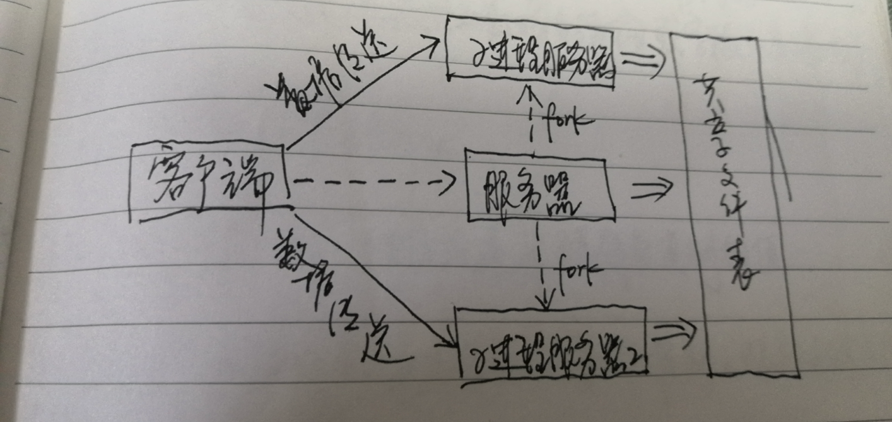

# 并发编程

现实中哪些场景会涉及到并发呢？

访问缓慢的 I/O 设备：在进行 I/O 访问时，会执行异步操作，内核切换上下文执行其他程序。这样能充分发挥多核的优势，并行计算等。

OS 提供三种方法实现并发：

1. 进程；每个处理（即逻辑控制流）都是一个独立的进程，每个进程都有自己独立的虚拟内存区域
2. I/O 多路复用：在同一个进程下，显式调度自己的逻辑流，转换为状态机，所有的流都共享一个地址空间（因为都是在同一个进程下运行）
3. 线程：是进程上下文中的逻辑流，是进程的一个最小的执行单元，有内核调度，行为上是上面两种方式的结合体：像进程一样由内核调度，又想 I/O 多路复用一样共享同一个地址空间。

## 进程实现并发

每个处理都是一个进程，这个是有明显的优势的。因为每个进程都有自己独立的地址空间，这样就不会发生数据被其他进程访问修改覆盖的情况了。但同样也带了缺点：两个进程之间很难通信，这只能通过 IPC 机制实现，并且开销非常大，所以性能大打折扣，运行起来很缓慢。具体的执行图我画了一个草图如下：

## I/O 多路复用

I/O 多路复用其核心是用 select 函数，要求内核挂起一个进程，只有在一个或多个 I/O 事件发生后，才将控制权返回给应用程序。select 函数会检测到输入事件，会创建一个新的逻辑流（即状态机），再而继续执行状态转移，完成之后就删除状态机。

这里面细节很多，主要在于循环读取 select 函数检测两种不同类型的输入类型：

1. 新客户端的连接请求
2. 已存在的客户端的已建立连接描述符准备读取的请求

每个客户端请求都会创建一个状态机来进行状态转移。

优点：共用一个进程，所以共享数据很容易，并且不需要执行进程上下文切换来调度逻辑流。性能较之进程来说是非常高的。

缺点：编码非常复杂，并且无法利用多核 CPU 的优势。

## 线程并发编程

线程是一个进程的最小执行单元。一个线程包括（线程 ID、指针、数据、栈、程序计数器以及寄存器和条件码）。因为在同一个进程下， 所以共享进程中的虚拟内存。我们现在用的最多的实现并发手段就是基于线程。

这里面还要牵涉到并发问题，多个线程对共享变量读写造成对整个程序结果的影响。为了解决这个问题，引入了**信号量**

### 信号量

信号量是通过一个变量来控制解决多线程访问共享变量的一种方法。具体过程如下：

1. 访问共享变量，信号量 -1（即上锁）
2. 另一个新城过程访问这个变量，发现这个信号量 =0，则挂起线程（即等待）
3. 直到占有锁的线程处理完成逻辑并释放锁，将信号量 +1
4. 则挂起的线程就会受到通知知道这个信号量不等于 0，则相继占有锁，将信号量继续 +1（上锁）

信号量解决的场景有很多，大体上分为以下几种：

1. 生产者-消费者问题：对一个共享的含有 n 个槽的有效缓冲队列进行读写。

2. 读写者问题：读可以无限制读，不需要枷锁。而写操作需要独占锁。这个问题又裂变为两种问题：

   1. 读多写少，即读者优先
   2. 写多读少，即写着优先

   要注意，因为存在优先权利，所以就存在另一种操作可能永远不会执行的可能。

我们还好分清楚“并发程序”、”并行程序“之间的关系。**并行程序是并发程序的真子集**。

要注意，线程不是开的越多越好，在 CPU 核芯数一定的情况下，如 8 核 CPU，如果我们线程开到 8 个，就会发现时间计算能力提升的非常明显。一旦大于 8 个时就会发现提升的不明显了，因为由于开启的线程比核芯数高，内核会频繁的进行线程上下文切换。这个操作虽然较之与进程上下文切换开销大，但是本身这个操作的开销还是有一定影响的。

## 硬件事务内存

**硬件事务内存（Hardware Transactional Memory，HTM）** 是一种并发控制技术，它利用处理器的硬件支持来管理对内存的并发访问，类似于数据库中的事务。HTM 旨在简化多线程程序的开发，同时提高并发操作的效率。

HTM 提供一种机制，允许开发者标记代码块为事务区块。在这些区块内的所有内存操作都被视为一个原子操作，即要么所有操作都成功执行，要么都不执行。这通过处理器自动处理内存访问冲突和状态恢复来实现。

硬件事务内存的优势：

1. **缓存一致性开销**：在传统的锁或其他同步原语中，多个线程或核心修改共享数据时，经常需要频繁地同步缓存行（缓存一致性）。这个过程中常常会导致缓存行在多个核心间移动，产生所谓的“缓存缺失”（cache misses），增加延迟和降低性能。

   HTM 能够最小化这种缓存缺失，因为在 HTM 事务执行期间，所有的读写操作都被局限在本地处理器的缓存中。只有当事务提交时，修改才会被写回到主内存中。如果事务在未遇到冲突的情况下成功完成，这种方法可以减少跨核心的数据传输和同步，从而减少缓存缺失。

2. **动态划分数据结构的能力**：在并发程序中，数据结构如哈希表、链表或树经常需要细粒度的锁来控制并发访问。这些锁机制往往固定并且复杂，需要程序员精确地控制和管理。HTM 提供了一种更加动态的方式来处理数据结构的并发修改。事务可以覆盖对数据结构的任意部分的修改，而不需要预先定义锁的粒度。这意味着 HTM 能够根据实际运行时的情况，动态地划分哪些部分的数据是属于同一事务的，从而更灵活地优化并发操作。

3. **有大量可用的应用程序的事实**

硬件事务内存的劣势：

1. **有限的事务大小**：由于HTM事务的状态需要存储在CPU的缓存中，过大的事务可能因为超出缓存容量而失败。
2. **中止和回滚**：HTM事务可能因为多种原因被中止，包括缓存溢出、长时间执行导致超时、系统调用、页错误、以及与其他事务的冲突等。中止和回滚会导致事务的重试，增加系统开销，降低性能。频繁的中止尤其在高冲突环境下，可能导致性能严重下降。
3. **冲突处理**：在并发环境中，当多个事务尝试同时修改同一块数据时，会发生冲突。HTM 通过中止其中一个或多个冲突事务来解决冲突，这种处理方式可能导致一些事务频繁中止，特别是在冲突概率高的应用中。
4. **缺乏前向执行的保证**：在某些情况下，事务可能无法完成执行并成功提交，例如，由于硬件或系统限制，事务可能不得不中止。这种不确定性意味着开发者不能完全依赖 HTM 来保证事务的完成，可能需要实现备用的软件路径来处理事务中止的情况。
5. **兼容性问题**：不是所有的硬件平台都支持HTM。此外，不同硬件厂商的HTM实现可能不兼容。
6. **不可撤销操作**：HTM设计为支持可撤销的操作，但对于某些操作，如I/O操作或特定的系统调用，它们是不可撤销的。这意味着 HTM 不能用于包含这类操作的事务。事务中包含不可撤销操作时，必须采取其他同步机制。
7. **语义差异**：不同处理器和系统对HTM的实现可能有所不同，导致语义上的差异。这种差异可能导致在不同系统或不同处理器架构上运行相同的程序时表现不一致，增加了编程的复杂性和可移植性问题。