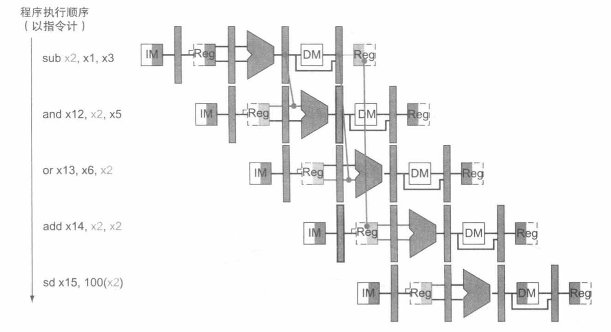
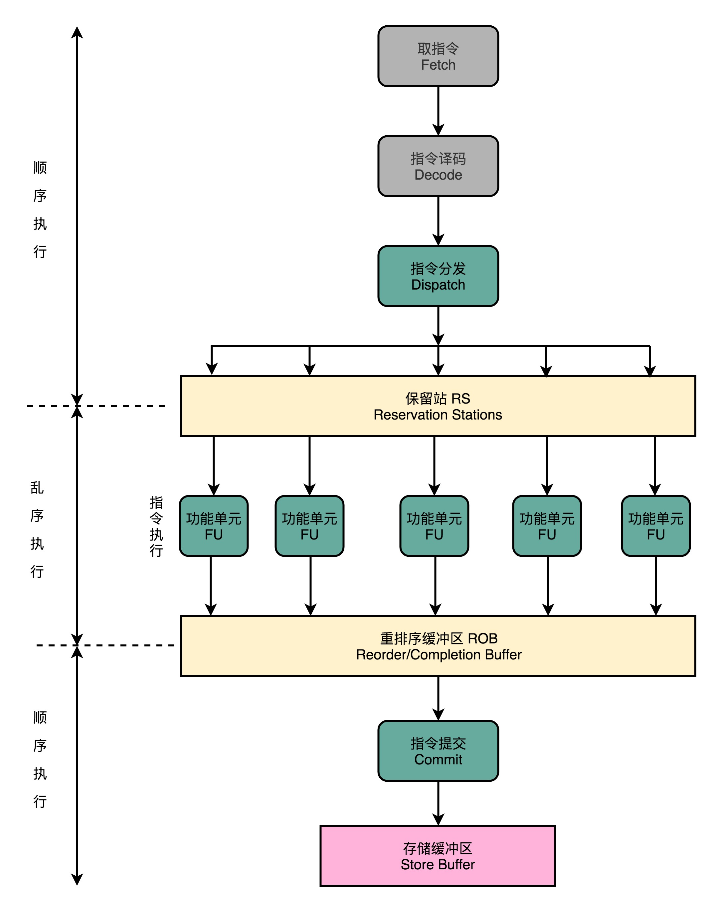

# CPU冒险之旅

我们现在已经知道CPU的流水线设计了。它提高了指令的并行度，增加了CPU的吞吐率。

但是这整个过程惊心动魄，充满了”冒险“。

现在我们要聊一聊CPU流水线中的三大冒险

## 结构冒险

问题：结构冒险本质上对同一个硬件资源的竞争。即CPU在同一个时钟周期要运行计算机指令的两个不同阶段（如一个指令读取阶段，另一个是访存阶段）。但是现实却是不可能发生的事情。**同一个时钟周期无法同时执行两个指令阶段**。

解决方案：因为其根本原因就是资源不够用，所以我们自然就很容易想到通过增加资源解决问题。如对于取指令和访问内存数据这两个阶段各自拥有地址译码器来存放指令和数据，实际上就是通过把CPU的高速缓存拆分成两个部分：1 指令缓存；2 数据缓存。这样就会互不干扰

## 数据冒险

数据冒险是最容易发生的冒险。是指指令之间的数据有前后依赖关系，分为三种

### 先读后写

伪码如下：

```
int a = 1
int b = 2
a = b + a
b = a + b
```

这种就是计算a的值就先得知道b写后的值。后续b的值也依赖于a的计算结果。

### 先写后读

```
int a = 1
int b = 2
a = a + 2
b = a + 3
```

b的结算结果就是依赖a的结果，a先取指计算写回寄存器然后下一条指令读取a的结果值继续参与运算。

### 写后再写

```
int a = 1
a = 2
```

像上面这些有数据依赖（如第二条指令的读取数据结果是第一条指令的输出结果），那么此时第二条指令执行必须要等第一条指令执行完才行。

我们知道CPU指令的运行过程被设计成流水线的，每个阶段不能跳过必须执行，所以就只能在受到依赖的阶段中执行空操作。这种操作也被称为**流水线停顿（也叫流水线冒泡）**。并且后续的阶段也会因为流水线停顿，也要插入空操作（是因为指令对齐）。

这无疑非常损耗性能。优化手段是通过分支预测，乱序执行指令，后面会讲到。

### 操作数前推

解决方案就是通过将哪些依赖的指令结果前移到下一个指令的前置寄存器中就可以不用等待了。其结构图如下



就如上图一样，为了达到操作数前推，所以我们必须要新增一个电路，将这个指令结果作为信号输出到下一个指令中的相关阶段输入。所以从硬件层面上操作数前推又叫操作数旁路（就如在对应的指令寄存器插入一个管子引流到下一个）。

从上面的图我们也知道这种优化手段只能在这种**前一条指令的执行结果输出作为后一条指令的输入，而不需要等待访存阶段再从寄存器中取出来**。

如果不是这种情况，如一条指令是在访存阶段才有结果，后一条指令还是在执行阶段，这样后面这条指令就必须停顿一个时钟周期了。在这种情况我们就可以通过乱序执行的方式优化这个问题。

### 乱序执行

乱序其实就是在流水线中增加了两个统一中间处理层：所有从取指译码获得的指令都会进入第一个中间层，这个中间层我们称为保留站（Reservation Station）。这个处理层会找到互相依赖以及没有依赖关系的指令，并优先将没有依赖的指令分发到后面的功能单元。然后将所有的指令都交给功能单元执行完成之后又会进入另一个中间层统一处理。这个中间层为冲排序缓冲区（Reorder/Completion Buffer），它负责这些结果又重新排序成之前取指的顺序输出。这样就会让”外界“觉得整个指令过程还是有序的。**只有排在前面的指令都已经完成了才会提交指令完成整个指令的运算结果。而这些结果不是直接写到内存或高速缓存的，而是先经由存储缓冲区，然后由缓冲区再写入主存中。**

整个过程流程如下图



​														(图来自极客时间《计算机组成原理》)

以一个例子来理解实际的运行过程：

```
int a = b + c
int d = a + e
int z = x + y
```

d的计算依赖a的结果，但z的计算结果跟a，d没有任何关系。所以在d等待a的执行结果时，先执行z是完全可行的。

## 控制冒险

还有一种情况就是上面都不满足的时候，也就是遇到控制跳转的时候，需要知道执行的是具体哪个分支指令。如下代码

```
if (n == 0)
	a = 1
else
	b = 2
```

当判断跳转指令（if/else,for/while）随着判断结果的不同，会执行不同的指令。所以必须要等到判断结果值执行完成之后更新PC之后，CPU才知道下一条具体要执行的指令是什么。这个时候我们通过由两种方案

### 缩短分支延迟

第一种方案就是尽量缩短分支延迟，因为有些指令如条件跳转，以及判断比较两个指令操作其实都不需要完整的执行整个周期，如add/sub，jump等指令就不需要访存和写回阶段，可以直接在寄存器完成计算。其实就是将依赖的数据与指令前推到上一个阶段（如从执行阶段的设计到的指令如add，sub提前到译码阶段），所以就需要像数据冒险一样新增一个电路信号传递这些信息。

缩短分支延迟还不能彻底解决，因为比较的结果肯定还是要等到执行阶段后的，所以剩下的操作就交给了分支预测。

### 分支预测

分支预测分为两种类型：第一种就是静态预测

其实就是简单的不预测，直接顺序行的执行后面的指令。如果预测对了就更好，如果预测错了就返回去继续预测另一个分支。这种准确率肯定不高。

那么第二种预测就是动态预测。

动态预测实际上就是根据某种预测算法（根据前面分支的结果来分析后面的分支将要发生的结果）。如何实现呢？

这里讲两种算法，一种就是**1位分支预测缓存**来表明一个分支是否发生了跳转。这种算法内部是采用1个比特位来记录分支的跳转情况。用白话描述就是，假设这个分支上一次发生了跳转，那么我就假定下一次也会发生跳转。如果这次没有发生跳转，那么我就假定下一次也不会发生跳转。

这种预测算法其实有一个明显的问题，一旦发生与之前不同的结果，就会造成两次预测错误，而不是一次。这个很好理解。假设有这样一个场景：

有一行代码中发生了9次跳转，之后产生1次未跳转。那么在这个分支预测就会在第一次以及最后一次预测中失败。最后一次预测失败这个不用多说，而第一次迭代分支预测错误是由于上一次迭代的最后一次被设置为了不跳转。

在1位分支预测缓存的基础上，再多加1位来记录这个跳转的状态，那么相对来说就更准确了。2位分支预测缓存可以记录四种状态，它会根据上一个分支的”变化的频率“来设置对应的状态值。其实这有点像权重分配一样。

#### 分支预测错误的代价

前面在讲分支预测错误的时候一笔带过了。其实分支预测错事有很大的性能损耗的，这个损耗程度与CPU流水线深度成正比，流水线阶段越多，要恢复的寄存器数据和指令也就越多，损耗就越大。

分支预测错了就会执行清理操作，把从开始预测后的执行操作与指令全部清理，如丢弃已经取出来的指令，以及相关阶段寄存器中的值等。

