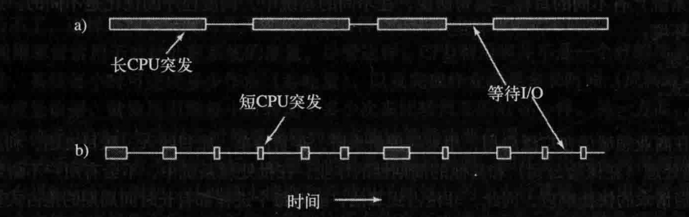

# 操作系统的调度机制

当机器出现并发程序时，如果只有一个 CPU 可用（CPU 资源不够），那么就必须选择下一个要运行的进程。在操作系统中，完成选择工作的这一部分称为调度程序 (scheduler)，该程序使用的算法称为调度算法(scheduling algorithm)。

操作系统的调度机制一般分为两种：IO 密集型任务和 CPU 密集型任务。

并且随着 CPU 速度的提升，更多的进程倾向于成为 I/O 密集型。这是因为 CPU 的改进速度比磁盘的改进速度更快。这种情况下，对于 I/O 密集型进程的调度和处理变得更为重要。

上图 a 为 CPU 密集型，b 为 I/O 密集型；

## IO 密集型任务

IO 密集型任务的主要特点是任务执行过程中涉及大量的输入/输出操作，例如读写文件、网络通信等。在这种任务中，CPU 等待 IO 操作完成的时间比较长，而实际的计算操作时间相对较短。

调度机制：为了提高效率和性能，IO密集型任务通常采用**异步**或**非阻塞**的方式进行处理。任务提交后，CPU 可以立即切换到执行其他任务，而不需要等待 IO 操作完成。当IO操作完成后，通过回调或事件通知的方式再进行处理。

## CPU 密集型任务

CPU密集型任务的主要特点是任务执行过程中需要大量的计算操作，而涉及的IO操作相对较少。在这种任务中，CPU 执行计算操作的时间较长，而等待 IO 操作完成的时间相对较短。

调度机制：CPU 密集型任务通常采用**抢占式**的调度机制。操作系统会为每个任务分配一定的时间片，在时间片用完之后，操作系统会强制剥夺当前任务的执行权，将CPU分配给其他等待执行的任务。这样可以有效避免某个 CPU 密集型任务长时间占用CPU资源而导致其他任务无法得到充分执行的情况。

## 调度算法

操作系统的调度机制一般是根据不同的业务场景需要灵活调度的，一般来说分为三大类：批处理、实时系统、交互式系统；

### 批处理

在批处理场景中，一般是不会有用户选择长时间在等待处理程序的返回，因此非常适合**非抢占式调度算法**，这样可以减少线程/进程的切换而提高了系统性能。

- **先来先服务（FCFS）**：谁先到谁就先处理，这样一般有一个问题，如果这是一个 I/O 密集型的程序，那么则会影响整个程序的吞吐量。这时其实可以通过抢占式来避免这个问题。
- **最短作业优先（SJF）**：估计执行时间最短的作业优先执行。这样可以最小化作业的平均等待时间，提高系统的整体性能。所以该算法需要对作业的执行时间进行预测或估计，以确定下一个要执行的作业。如果预测不准确，可能导致长作业等待时间增加。

- **最短剩余时间优先（SRTF）**：调度器会动态地选择剩余执行时间最短的作业来执行，即每次选择剩余时间最短的作业来运行。SRTF 算法可以进一步减少作业的等待时间，提高系统的响应性。它需要实时地跟踪作业的剩余执行时间并进行调度（是 SJF 的变体），这可能会增加调度器的开销。

### 交互式

在交互式系统中，为了提高用户程序的响应能力，**抢占式调度算法**是必须的，这样可以合理的调度不同优先级的程序，以避免有进程/线程饿死。

调度机制会优先选择那些与用户交互相关的任务，并尽快将 CPU 分配给它们，以提供良好的用户体验。

1. **轮转调度（Round Robin Scheduling）**：
   - 轮转调度是一种基于时间片的调度算法，每个任务被分配一个固定的时间片，当时间片用尽后，任务被暂停并放回队列的尾部，让其他任务执行。
   - 轮转调度能够公平地分配CPU时间，确保每个任务都有机会执行。它适用于多任务环境下，特别是交互式系统中，因为它可以提供快速的响应时间。
2. **优先级调度（Priority Scheduling）**：
   - 优先级调度根据任务的优先级来安排执行顺序。每个任务都被赋予一个优先级值，优先级高的任务优先执行。该算法通常用于交互式系统，以确保高优先级任务能够及时响应用户的输入。
   - 优先级调度可以是静态的，即在任务创建时分配优先级，也可以是动态的，根据任务的状态和实时需求来动态调整优先级。
3. **多级队列调度（Multilevel Queue Scheduling）**：
   - 多级队列调度将任务分为多个队列，每个队列具有不同的优先级。不同优先级的队列可能采用不同的调度策略，如轮转调度、优先级调度等。
   - 交互式系统中，通常将用户交互相关的任务放置在高优先级队列，而将后台任务放置在低优先级队列。这样可以确保用户的输入得到及时响应，同时保证后台任务的执行。
4. **保证调度（Guaranteed Scheduling）**：
   - 保证调度是一种为实时任务提供保证性能的调度策略。在保证调度中，为实时任务分配固定的 CPU 时间，确保它们按时完成。保证调度通常用于对实时性要求非常高的系统，如航空航天等领域。如：在一个有 n 个进程运行的系统中，若所有的进程都等价，则每个进程将获得 1/n 的 CPU 时间。
5. **最短进程优先（Shortest Process Next, SPN）**：
   - 最短进程优先调度算法选择估计执行时间最短的进程优先执行。这样可以最小化进程的平均等待时间和响应时间。它适用于交互式系统中，以提供快速的响应和较低的延迟。特别是在可以与 SJF 结合的场景下效果将非常好。
6. **彩票调度（Lottery Scheduling）**：
   - 彩票调度是一种基于**概率**的调度策略。每个任务被分配一定数量的彩票，当进行调度时，从彩票池中随机选择一张彩票，持有该彩票的任务获得执行机会。
   - 彩票调度可以实现公平分享和资源分配，较高优先级的任务持有更多彩票，因此有更高的中奖概率。它适用于多任务环境中公平性要求较高的场景。
7. **公平分享调度（Fair Share Scheduling）**：
   - 公平分享调度是一种按照任务组或用户进行资源分配和调度的策略。它确保每个任务组或用户能够公平地分享系统资源，避免某个任务组或用户独占资源。如：如果用户 1 启动 9 个进程而用户 2 启动 1 个进程，使用轮转或相同优先级调度算法，那么用户 1 将得到 90%的 CPU 时间，而用户 2 只得到 10% 的CPU时间；公平分享调度很好的解决这种场景。
   - 公平分享调度通常根据任务组或用户的权重进行资源分配，较高权重的任务组或用户获得更多的资源份额。这种调度策略常用于多用户环境中，以确保公平性和资源平衡。

### 实时系统

然而在实时系统中，调度机制会更加严格，主要关注任务的实时性和可靠性。实时系统要求任务能够按照预定的时间要求进行响应和完成，因此调度机制需要具备以下特点：

1. **硬实时和软实时**：实时系统可以分为硬实时和软实时两种类型。硬实时要求任务必须在严格的时间约束内完成，否则会导致系统故障或安全问题。软实时则允许任务在一定的时间范围内完成，但超过时间限制可能会降低系统性能。

2. **优先级调度**：实时系统中，任务通常被赋予不同的优先级，根据优先级来进行调度。高优先级的任务优先获得CPU的执行时间，以确保其及时响应和完成。优先级调度可以基于静态优先级或动态优先级，动态优先级允许根据任务的实时需求动态调整优先级。

3. **周期性调度**：实时任务通常具有周期性的执行模式，即任务按照一定的时间间隔重复执行。调度机制需要确保任务在每个周期内按时启动并完成，以满足系统对实时性的要求。

4. **中断处理**：实时系统中，中断的处理也是非常重要的。当出现硬件或软件中断时，调度机制需要尽快响应中断事件，并按照优先级处理中断，以确保系统能够及时处理关键事件。

5. **预防优先级反转**：实时系统中，可能存在优先级反转的问题。优先级反转指的是一个低优先级的任务占用了一个高优先级任务所需的共享资源，导致高优先级任务无法及时完成。调度机制需要采取适当的措施，如优先级继承或优先级翻转，来解决优先级反转问题。

   > **优先级反转（Priority Inversion）**：是多线程编程中的一个问题，它发生在高优先级线程被阻塞在一个被低优先级线程占用的资源上，而中优先级线程不断运行，导致高优先级线程无法及时执行。这个现象会导致系统中优先级高的任务无法按预期优先级得到执行，从而影响系统的性能和实时性。
   >
   > 假设我们有三个线程：高优先级线程（H），中优先级线程（M），和低优先级线程（L）。它们的优先级依次为 H > M > L。
   >
   > 1. 低优先级线程L获取了一个共享资源（比如一个互斥锁）。
   > 2. 高优先级线程H需要这个共享资源，于是它被阻塞在这个资源上，等待L释放资源。
   > 3. 在H等待的过程中，中优先级线程M开始执行，因为它的优先级高于L，但低于H。
   >
   > 由于H被L阻塞，而M的优先级高于L，调度器会优先执行M。只要M有可运行的任务，L就无法继续执行，因此也不能释放H需要的资源。结果是高优先级线程H被中优先级线程M间接阻塞，导致优先级反转。
   >
   > 解决方案：
   >
   > **优先级继承协议（Priority Inheritance Protocol）**
   >
   > 优先级继承协议是解决优先级反转的一种常见方法。它的基本思想是，当一个低优先级线程持有高优先级线程所需的资源时，低优先级线程会临时“继承”高优先级线程的优先级，以确保它能尽快完成任务并释放资源。
   >
   > 1. 低优先级线程L获取了一个共享资源。
   > 2. 高优先级线程H需要这个资源，被阻塞在资源上。
   > 3. L临时“继承”了H的高优先级，使得调度器优先执行L，以便L能尽快完成任务并释放资源。
   > 4. 一旦L释放了资源，它的优先级会恢复到原来的低优先级。

   