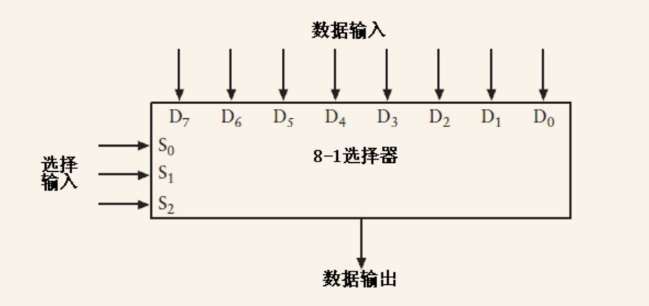
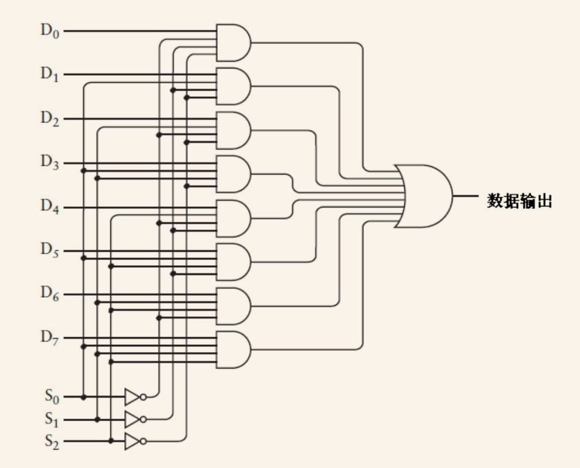

# CPU存储和门电路

CPU有很多功能，其中就有数据存储的功能。那么CPU是如何控制值的存储呢？

核心知识就是门电路：通过组合不同的门电路控制电平的高低来达到不同的目的。下面会将到各种电路相关的术语，以及相关的概念与目的。

## 反馈

是由两个或非门连接而成的，左边的或非门的输出是右边或非门的输入，而右边或非门的输出是左边或非门的输入。这种连接方式就称之为反馈（feeback）；

这种方式是CPU实现自动化运作的基础。

## 触发器

通过上述的将一端的输入成为另一端的输出，可以组合成CPU最核心的触发器（Flip-Flop），它可以实现同时两个开关都断开的情况下，灯泡还是亮着的，有时也不亮。当开关都断开时，电路有两个稳定态，这类电路就被称为触发器。

这种电路为什么说核心呢，正是因为它才会让CPU有存储状态的功能。——触发器可以保持信息，通过组合电路它可以记住上一次的运行结果。

在触发器里，又分多钟触发器

### R-S触发器

R-S触发器是最简单的触发器，R是复位，指控制电平为0（即低电平）；S为置位，控制电平为1（即高电平）。

它的作用是记住哪个输入端的最终状态为1。

### D型触发器

R-S触发器只能记住哪个输入端的最终状态的信息，但是无法知道具体某个特定时间点的信号是0还是1。这个时候就需要D型触发器了，它也有两个输入，一个是数据端（D），另一个输入被称为保持位。

保持位的作用就是标示是否要记住值：当保持位被置位1时（默认为0），就表示数据端的值就会在电路系统中被记住了。为0时就表示随后的输入对电路不会有任何影响。当保持位置为1之后，就会变回0，这样在已经记住了上一次操作的值（通过锁存器记录值），之后的数据端的输入无论怎么变化都不会对电路产生任何影响了。

> 锁存器：当操作端的信号（数据输入端）被写进电路时，就说这个值已被存储到电路中了。就像上面说的，当写操作输入端为0，数据输入信号的状态对输出无影响。就好像将这个值锁住了一样。这是一位的存储，如果是多位，那么就需要多个1位锁存器连接起来。

D型触发器里面又分多种

#### 电平触发的D型触发器

这个触发器是指保持位输入为某一特定电平（如高电平），触发器才会保存数据端的输入。

#### 边沿触发的D型触发器

与电平触发不同，而边沿触发器是只有在时钟从0跳到1时，才会引起输出的改变。（*注意，是从0到1时，而不是电平触发的等于1*）

组成结构由两个R-S触发器连接而成。

在电平触发器中，当时钟输入为0时，数据端输入的任何改变都不会影响输出；而边沿触发器，当时钟变为1时，数据端输入的改变也不会影响输出。**只有在时钟输入从0变为1的瞬间，数据端的输入才会影响边沿触发器的输出。**

## 分频器

在之前反馈一节提到，通过这种方式可以实现CPU的自主运行（即振荡器）。实际上这种构造可能会存在问题。这种触发器的输出同时又是自己的输入，如果振荡器是由状态来询迅速变换的继电器构成，其输出与构成触发器的继电器相连，那么这里面就可能会发生继电器的速度跟不上振荡器上下变换的速度。所以这里就需要用到分频器（frequency divider）。

分频器：振荡器的频率为20Hz（20个周期的时间为1s），那么输出频率就是它的一半即10Hz。

分频器可以嵌套，即一个分频器的输出可以称为另一个分频器的输入。

## 存储器组织结构

我们将8个触发器连在一起是“8位行波计数器”。这个有一个特点，就是上一个触发器的输出是下一个触发器的时钟输入。所以这种状态变化是一层层往下传递的，所以整个过程是有延迟的（也叫门延迟）。其中一种性能优化手段就是“超前进位加法器”（其实也叫并行同步计数器）。这种计数器的所有状态都是同一时刻改变的（但是这会增加电路的复杂性）。

我们知道CPU取指和数据都从CPU缓存取的，这里面就有RAM。而RAM就是通过这些电路元件组合层的。

### RAM的结构

在讲RAM结构之前，我们首先需要知道1位锁存器的结构图

​														1位锁存器

而多位锁存器就是拼接起来，如8位锁存器

RAM又叫随机访问存储器（Random Access Memory）。它是由三大件构成的

- 8-1选择器
- 3-8译码器
- 8个锁存器

#### 8-1选择器

8-1选择器指8个数据输入端选择其中一个给输出端。如何控制呢？这就需要三个开关（即三个选择输入端）做控制了（$2^3$）。其结构图如下

8-1选择器的主要组成元件如下：

1. 3个反向器
2. 8个4端口输入与门
3. 1个8端口输入或门

其8-1选择器内部结构图如下

**其主要目的就是通过门电路连接8个1位锁存器，通过逻辑门电路来控制从一个输入信号端写入数据，还能从一个输出信号端识别数据。通过上述结构方式达到控制使用8-1选择器对8个锁存器进行选择操作，并输出**。

其完整的结构图如下

#### 3-8译码器

在8位锁存器之上还有一个电路设备来控制8位锁存器的输入。因为并不是所有的信号都是一起发到这8位锁存器的。它们之间可能还会有严格的顺序要求。而这是3-8位姨妈期的作用了。

**3-8译码器的输出端口共有8个。在任何时刻，译码器只会有一个锁存器的输出位1，其它都位0。每个输出结果都受3个信号的排列组合影响**。结构如下

这个时候我们再将8位锁存器组装起来就是完整的RAM结构了，如下图

以上所讲的是最基础的能单独存储8个bit的RAM。事实上我们可以组装更大的RAM阵列。阵列大小是根据地址输入端数量的大小决定的。