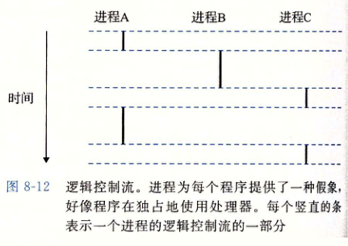
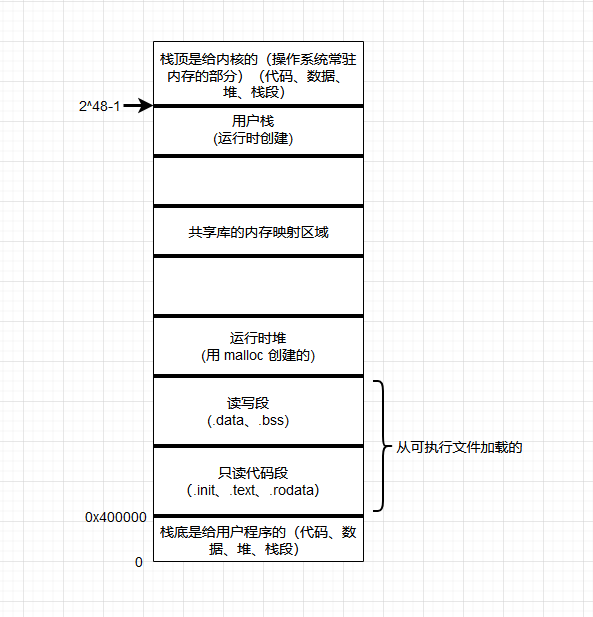

# 异常控制流(Exception Control Flow)

像非本地跳转，即跳转到了非预期的栈地址，正常情况下代码运行正常会返回预期的内存地址，但是由于某种原因（硬件、操作系统以及应用层）发生突变，导致突然转到其它函数的内存地址。

具体表现为高阶语言如 C# 用 `try catch` 捕捉异常，没有正常 return，而是由于某种原因进入了 `catch` 段。

理解 ECF：

- **ECF 是操作系统用来实现 I/O、进程和虚拟内存的基本机制**。
- **ECF 提供了用户态内核态之间的交互**。应用程序通过使用 trap 的系统调用的 ECF 形式，像操作系统请求服务。比如像磁盘写数据、从网络读取数据、创建一个新进程以及终止当前进程等一些操作都是通过**系统调用**完成的
- **ECF 是计算机系统中实现并发的基本机制。**具体例子：中断应用程序执行的异常处理程序，在时间上重叠执行的进程和线程，以及中断应用程序执行的信号处理程序。

发生异常的过程：

异常就是控制流中的突变，用来响应处理器状态中的变化。发生状态变化的事件原有有很多种，比如虚拟内存缺页、算术溢出等。当处理器检测到有异常发生时（状态事件），它会通过一张**异常表(启动时就创建了)**的跳转表，然后进行**系统间接调用**，到一个专门设计用来处理这些异常的操作系统子程序（异常处理程序），根据映射（异常编号）找到对应的处理程序继续往下运行。一般会发生下面 3 种情况：

1. 处理程序将控制**返回给当前指令**，也就是事件发生时正在执行的指令
2. 处理程序将控制**返回下一条指令**，如果没有异常也会正常执行下一条指令
3. 处理程序终止被中断的程序

异常类型

| 类比            | 原因                | 异步/同步 | 返回行为           |
| --------------- | ------------------- | --------- | ------------------ |
| 中断(interrupt) | 来自 I/O 设备的信号 | 异步      | 总是返回下一个指令 |
| 陷阱(trap)      | 有意的异常          | 同步      | 总是返回下一个指令 |
| 故障(fault)     | 潜在可恢复的异常    | 同步      | 可能返回到当前指令 |
| 终止(abort)     | 不可恢复的异常      | 同步      | 不会返回           |

陷阱最重要的用途就是在用户态和内核态之间提供一个像过程一样的接口，叫做**系统调用（system call）**。

故障则可能回在异常中恢复，就能将控制权返回到引起故障的指令，然后重新执行。如果无法修复则会引起内核中的 abord 例程，abord 例程会终止应用程序。其中最典型的例子就是虚拟内存缺页处理程序，当指令引用一个虚拟地址，而该虚拟地址根据地址解析协议解除对应的物理地址又不存在，而会发生缺页异常，将控制前转交给缺页处理程序，如果程序从磁盘加载适当的页面，然后将指令交回给引发异常处的指令，然后重新执行一次，如果这个时候物理页存在则会像没有任何事一样正常往下执行。

## 进程

异常是允许操作系统内核提供进程概念的基本构造块。

进程：**一个执行中程序的实例**。系统中每个程序都运行在某个进程的上下文中。进程上下文是由程序**正确运行所需的状态**组成。这个状态包括：程序代码和数据、栈、通用目的寄存器的内容、程序计数器、环境变量以及打开文件描述的集合。

**逻辑控制流：**在系统中通常有很多应用程序在运行，给我们一种假象，好像我们的程序独占使用处理器以及独占系统内存。这是因为逻辑控制流控制的，多个进程**轮流使用处理器**。每个进程执行它的流的一部分，然后被抢占（preempted）（暂时挂起），然后轮到其它进程。

**并发流：**计算机系统的逻辑流有很多形式，异常处理程序、进程、信号处理程序、线程等都是逻辑流的例子。

一个逻辑流的执行在时间上与另一个流重叠这就是并发流(concurrent flow)。

多个流并发地执行的一般称为并发。一个进程与其它进程轮流运行的概念称为多任务。一个进程执行它的控制流的一部分的每个时间段称为时间片(time slice)。就如上面图所示，进程 A 的流由两个时间片组成。

独占内存是因为每个今晨运行都分配了一个私有地址空间，这在进程内是可见的，对于其它进程来说是不允许访问的。进程内存地址结构图

