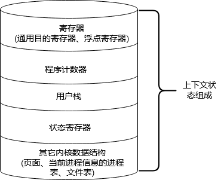

# 异常控制流(Exception Control Flow)

像非本地跳转，即跳转到了非预期的栈地址，正常情况下代码运行正常会返回预期的内存地址，但是由于某种原因（硬件、操作系统以及应用层）发生突变，导致突然转到其它函数的内存地址。

具体表现为高阶语言如 C# 用 `try catch` 捕捉异常，没有正常 return，而是由于某种原因进入了 `catch` 段。

理解 ECF：

- **ECF 是操作系统用来实现 I/O、进程和虚拟内存的基本机制**。
- **ECF 提供了用户态内核态之间的交互**。应用程序通过使用 trap 的系统调用的 ECF 形式，像操作系统请求服务。比如像磁盘写数据、从网络读取数据、创建一个新进程以及终止当前进程等一些操作都是通过**系统调用**完成的
- **ECF 是计算机系统中实现并发的基本机制。**具体例子：中断应用程序执行的异常处理程序，在时间上重叠执行的进程和线程，以及中断应用程序执行的信号处理程序。

发生异常的过程：

异常就是控制流中的突变，用来响应处理器状态中的变化。发生状态变化的事件原有有很多种，比如虚拟内存缺页、算术溢出等。当处理器检测到有异常发生时（状态事件），它会通过一张**异常表(启动时就创建了)**的跳转表，然后进行**系统间接调用**，到一个专门设计用来处理这些异常的操作系统子程序（异常处理程序），根据映射（异常编号）找到对应的处理程序继续往下运行。一般会发生下面 3 种情况：

1. 处理程序将控制**返回给当前指令**，也就是事件发生时正在执行的指令
2. 处理程序将控制**返回下一条指令**，如果没有异常也会正常执行下一条指令
3. 处理程序终止被中断的程序

异常类型

| 类比            | 原因                | 异步/同步 | 返回行为           |
| --------------- | ------------------- | --------- | ------------------ |
| 中断(interrupt) | 来自 I/O 设备的信号 | 异步      | 总是返回下一个指令 |
| 陷阱(trap)      | 有意的异常          | 同步      | 总是返回下一个指令 |
| 故障(fault)     | 潜在可恢复的异常    | 同步      | 可能返回到当前指令 |
| 终止(abort)     | 不可恢复的异常      | 同步      | 不会返回           |

陷阱最重要的用途就是在用户态和内核态之间提供一个像过程一样的接口，叫做**系统调用（system call）**。

故障则可能回在异常中恢复，就能将控制权返回到引起故障的指令，然后重新执行。如果无法修复则会引起内核中的 abord 例程，abord 例程会终止应用程序。其中最典型的例子就是虚拟内存缺页处理程序，当指令引用一个虚拟地址，而该虚拟地址根据地址解析协议解除对应的物理地址又不存在，而会发生缺页异常，将控制前转交给缺页处理程序，如果程序从磁盘加载适当的页面，然后将指令交回给引发异常处的指令，然后重新执行一次，如果这个时候物理页存在则会像没有任何事一样正常往下执行。

## 进程

异常是允许操作系统内核提供进程概念的基本构造块。

进程：**一个执行中程序的实例**。系统中每个程序都运行在某个进程的上下文中。进程上下文是由程序**正确运行所需的状态**组成。这个状态包括：程序代码和数据、栈、通用目的寄存器的内容、程序计数器、环境变量以及打开文件描述的集合。

**逻辑控制流：**在系统中通常有很多应用程序在运行，给我们一种假象，好像我们的程序独占使用处理器以及独占系统内存。这是因为逻辑控制流控制的，多个进程**轮流使用处理器**。每个进程执行它的流的一部分，然后被抢占（preempted）（暂时挂起），然后轮到其它进程。

**并发流：**计算机系统的逻辑流有很多形式，异常处理程序、进程、信号处理程序、线程等都是逻辑流的例子。

一个逻辑流的执行在时间上与另一个流重叠这就是并发流(concurrent flow)。

多个流并发地执行的一般称为并发。一个进程与其它进程轮流运行的概念称为多任务。一个进程执行它的控制流的一部分的每个时间段称为时间片(time slice)。就如上面图所示，进程 A 的流由两个时间片组成。

独占内存是因为每个今晨运行都分配了一个私有地址空间，这在进程内是可见的，对于其它进程来说是不允许访问的。进程内存地址结构图

## 内核模式和用户模式

内核模式又叫超级用户模式，拥有最高权限，可以执行任何指令集，并且可以访问系统中的任何内存位置。

用户模式就无法访问内核中的信息（内存，数据），也无法执行一些特权指令（停止处理器、改变模式位、或者发起一个 I/O 操作）

进程从用户模式进入到内核模式**唯一的方法就是通过像中断、故障或者系统调用这样的异常控制流**。当发生异常是，就会将控制权交给异常处理程序，处理器将模式由用户模式更改为内核模式。

## 上下文切换

**操作系统内核使用一种“上下文切换”的较高层次的异常控制流来实现多任务的**。

内核为每个进程都维护一个上下文。上下文就是内核重新启动一个被抢占的进程所需的**状态**。

先来认识一些基本操作概念：

- 在进程执行的某些时刻，内核可以决定抢占当前运行的进程，并重新开始一个先前被抢占的进程。这种决策就是**调度**(scheduling)，是由调度管理器的代码管理的。当内核选择一个新的进程运行时 ，我们就说内核**调度**了这个进程。

调度做了如下三件事情：

1. 保存当前进程的上下文。
2. 恢复某个之前被抢占的进程时保存的上下文。
3. 将控制权传递给这个新恢复的进程。

上下文切换过程示意图：

进程 A 一开始在用户模式运行，随后发起一个 read 请求，发起系统调用，让对应的异常处理来使用户模式进入到内核模式。**在内核中处理来自磁盘控制器的 DMA（直接内存访问） 传输，在这段时间是需要一定时间消耗的，这个时候进程 B 不会一直等待内存访问的影响，进程会再次切换到用户模式运行一段时间，直到接受到磁盘控制器发出的一个中断信号表示已经将数据传送到了内存。**于是内核就执行一个从进程 B 到进程 A 的上下文切换，将控制权返回给在 A 进程系统调用 read 之后的那条指令。然后进程 A 继续运行。

> fork 创建子进程，在主进程会返回子进程的 PID，而在子进程中 fork 会返回 0；
>
> fork 与 execve 的区别：fork 函数在新的子进程中运行相同的程序，新的子进程是父进程的一个复制品。**execve 函数是当前进程上下文中加载并运行一个新的程序**。它会**覆盖**当前进程的地址空间，但是并没有创建一个新建的进程。新的程序仍然有相同的 PID，并且集成了调用 execve 函数时已打开的文件描述符

## 信号

允许进程和内核中断其它进程。每个信号都对应一个信号类型（系统事件），它提供一种通知机制，通知用户层内核发送中夺冠异常。

如果进程执行一些非法指令，内核就会发送一个对应的异常信号给用户进程。然后用户层就会有一个函数（信号处理程序）来接收并处理来自内核的中断信号。例如平时的键盘输入，就是靠内核发送一个键盘异常信号来完成的。

信号只能允许不同类别的信号只有一个待处理信号。同类型的信号如果多次发送请求，那么接收端就会选择直接丢弃。

那么信号处理程序如何处理多进程并发的问题呢（修改共享状态）？

1. 让处理程序尽量小而简单（做到事情越少越好）
2. 调用那些异步信号安全的函数（其实就是进程安全的函数）
3. 保存和恢复 errno
4. 阻塞所有信号，保护堆共享全局变量的访问。
5. 标明 volatile 变量，告诉编译器不要缓存该变量，每次都从内存读取。

## 非本地跳转

是一种用户层的异常控制流形式，它直接从一个方法跳转到另一个当前正在执行的函数，而不需要经过正常的调用-返回序列。这是通过 `setjmp` 和 `longjmp` 函数实现的。

运行过程：main 函数首先调用 setjmp 函数**保存当前的调用环境**，然后调用其它函数，这个函数（也可能是调用另一个函数）可能会发生错误（另一个函数错误），就会调用 longjmp 函数从 setjmp 返回。setjmp 返回值对应着具体的错误码（错误类型），随后可以被解码，且在代码的某处位置进行处理。sigsetjmp 和 siglongjmp 是表示可以被信号处理程序使用的版本。其中 siglongjmp 可以跳转任何地方，使用它时需要小心（如在释放内存前调用了 siglongjmp，就会发生内存泄露）。

> 拿高阶语言如 Java 来比较的话，try 语句中的 catch 就相当于 setjmp 函数，而 throw 就相当于 longjmp 函数。

