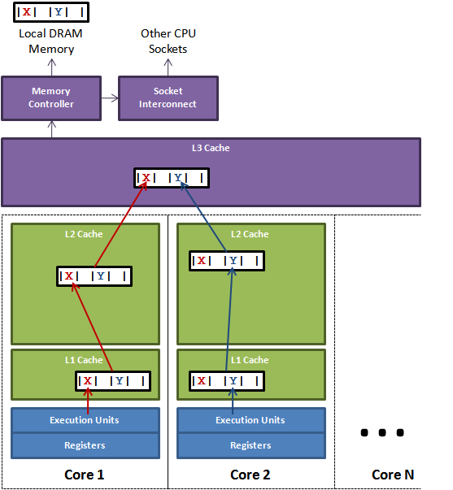
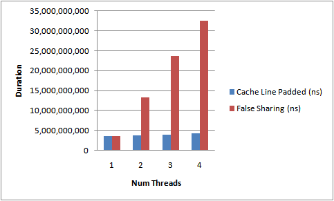

# 伪共享（False Sharing）

本文介绍了内存如何以**缓存行(cache line)**为单位存储，缓存行是连续字节的2的幂，通常为 32-256，其中最常见的缓存行大小为 64 字节。当多个线程修改共享同一缓存行的独立变量时，会出现伪共享这一术语。在 SMP 系统中，缓存行上的写竞争是影响并行线程可扩展性的最大限制因素。伪共享是被描述为默默影响性能的元凶，因为从代码角度看它并不明显。

为了实现与线程数成线性比例的可扩展性，必须确保没有两个线程写入相同的变量或缓存行。两个线程写入相同变量可以通过代码追踪发现。要知道独立变量是否共享同一缓存行，我们需要了解内存布局，或者可以使用工具来告诉我们。Intel VTune 是一种性能分析工具。本文将介绍Java对象的内存布局以及如何使用填充来避免伪共享。



上图说明了伪共享的问题。在 Core1 上运行的线程想要更新变量`X`，而在 Core2 上运行的线程想要更新变量`Y`。不幸的是，这两个热点变量存在于同一缓存行中。**每个线程都会争夺缓存行的所有权以便更新它**。如果 Core1 获得所有权，则缓存子系统将需要使 Core2 相应的缓存行失效。当 Core2 获得所有权并执行其更新时，然后会告诉 Core1 使其缓存行的副本失效。这将通过 L3 缓存来回反弹，极大地影响性能。如果竞争的 Core 位于不同的套接字上并且还必须跨套接字互连，则问题将进一步恶化。

## Java 内存布局

对于 Hotspot  JVM，所有对象都有一个2字(2-word)头部对象。第一个是“标记”字，由 24 位哈希码和 8 位标志组成，例如锁定状态，或者可以替换为锁对象。第二个是对象的类的引用。数组有一个额外的字表示数组的大小。为了提高性能，每个对象都对齐到 8 字节粒度的边界。因此，为了在打包时效率高，对象字段按以下顺序从声明顺序重新排序，基于字节大小：

1. 双精度(8)和长整型(8) 
2. 整数(4)和浮点数(4)
3. 短整数(2)和字符(2) 
4. 布尔(1)和字节(1)
5. 引用(4/8)
6. 重复子类字段

有了这些知识，我们可以在任何字段之间填充一个缓存行，有 7 个长整型。在 [Disruptor](http://code.google.com/p/disruptor/) 中，我们在 [RingBuffer](http://code.google.com/p/disruptor/source/browse/trunk/code/src/main/com/lmax/disruptor/RingBuffer.java) 光标和 [BatchEventProcessor](http://code.google.com/p/disruptor/source/browse/trunk/code/src/main/com/lmax/disruptor/BatchEventProcessor.java) 序列周围填充缓存行。

为了展示性能影响，让我们使用几个线程分别更新自己的独立计数器。这些计数器将是易失性长整型，以便全局可以看到它们的进展：

```java
public final class FalseSharing
    implements Runnable
{
    public final static int NUM_THREADS = 4; // change
    public final static long ITERATIONS = 500L * 1000L * 1000L;
    private final int arrayIndex;

    private static VolatileLong[] longs = new VolatileLong[NUM_THREADS];
    static
    {
        for (int i = 0; i < longs.length; i++)
        {
            longs[i] = new VolatileLong();
        }
    }

    public FalseSharing(final int arrayIndex)
    {
        this.arrayIndex = arrayIndex;
    }

    public static void main(final String[] args) throws Exception
    {
        final long start = System.nanoTime();
        runTest();
        System.out.println("duration = " + (System.nanoTime() - start));
    }

    private static void runTest() throws InterruptedException
    {
        Thread[] threads = new Thread[NUM_THREADS];

        for (int i = 0; i < threads.length; i++)
        {
            threads[i] = new Thread(new FalseSharing(i));
        }

        for (Thread t : threads)
        {
            t.start();
        }

        for (Thread t : threads)
        {
            t.join();
        }
    }

    public void run()
    {
        long i = ITERATIONS + 1;
        while (0 != --i)
        {
            longs[arrayIndex].value = i;
        }
    }

    public final static class VolatileLong
    {
        public volatile long value = 0L;
        public long p1, p2, p3, p4, p5, p6; // comment out
    }
}
```

## 结果

运行上述代码，同时增加线程数并添加/删除缓存线填充，得到如下图所示的结果。在下面。这是在我的4核 Nehalem 上测试运行的持续时间。



上面的测试清楚地显示了伪共享的影响，它导致了耗时的增长。如果没有缓存行争用，我们将在线程方面实现近线性扩展。这不是一个完美的测试，因为我们无法确定 `VolatileLongs` 将在内存中被放置在哪里。它们是独立的对象。然而，经验表明，同时分配的对象往往会被放置在一起。因此，可以看出，伪共享可能会成为一个默默的性能杀手。注意：请阅读我的关于伪共享的进一步探索的[博客](http://mechanical-sympathy.blogspot.com/2011/08/false-sharing-java-7.html)。

## 原文链接

https://mechanical-sympathy.blogspot.com/2011/07/false-sharing.html

> 伪共享的维基百科
>
> 在计算机科学中，伪共享是一种性能下降的使用模式，可能出现在具有分布式连贯缓存的系统中，其大小为缓存机制所管理的最小资源块。**当一个系统参与者试图定期访问没有被另一方改变的数据，但该数据与正在被改变的数据共享一个缓存块时，尽管缺乏逻辑上的必要性，缓存协议可能会迫使第一个参与者重新加载整个缓存块**。
>
> 到目前为止，这个术语最常见的用法是在现代的多处理器CPU缓存中，内存是以小的两个字的2次幂为单位进行缓存的（例如，64个对齐的、连续的字节）。**如果两个处理器对同一内存地址区域的独立数据进行操作，系统中的缓存一致性机制可能会迫使整条线通过总线或互连线进行每一次数据写入，除了浪费系统带宽外，还迫使内存停滞**。在某些情况下，消除伪共享可以带来数量级的性能提升。[2]伪共享是自动同步缓存协议的固有产物，也可能存在于分布式文件系统或数据库等环境中，但目前的普遍性仅限于RAM缓存。

## 伪共享以及如何避免它

原文地址：https://docs.oracle.com/cd/E19205-01/819-5270/6n7c71veg/index.html

在 OpenMP 应用中不小心使用共享内存结构会导致性能低下和可扩展性有限。多个处理器更新内存中相邻的共享数据会导致多处理器互连上的流量过大，实际上会导致计算的序列化。

### 什么是伪共享

大多数高性能处理器，如 UltraSPARC 处理器，在慢速内存和 CPU 的高速寄存器之间插入了一个缓存缓冲区。访问一个内存位置会导致包含所请求的内存位置的实际内存片断（缓存行）被复制到缓存中。对同一内存位置或其周围位置的后续引用可能会从高速缓存中得到满足，直到系统确定有必要保持高速缓存和内存之间的一致性。

**然而，来自不同处理器的同一高速缓存行中的单个元素的同时更新会使整个高速缓存线失效，尽管这些更新在逻辑上是相互独立的。缓存行中单个元素的每次更新都会将该行标记为无效。其他处理器在访问同一行的不同元素时，会看到该行被标记为无效。他们被迫从内存或其他地方获取该行的最新副本，即使被访问的元素没有被修改。这是因为缓存的一致性是以缓存行为基础来维护的，而不是针对单个元素。因此，互连流量和开销都会增加。另外，在缓存线更新的过程中，对该线中的元素的访问被抑制了。**

这种情况被称为伪共享。如果这种情况经常发生，OpenMP 应用程序的性能和可扩展性将受到很大影响。

当所有下列情况发生时，假共享会降低性能：

1. 共享的数据被多个处理器修改。
2. 多个处理器在同一高速缓存行中更新数据。
3. 这种更新发生得非常频繁（例如，在一个紧密循环中）。

请注意，在循环中只读的共享数据不会导致伪共享。

### 减少伪共享

仔细分析那些在应用程序执行过程中起主要作用的并行循环，可以发现由伪共享引起的性能可扩展性问题。一般来说，可以通过以下方式减少伪共享：

- 尽可能地使用私有数据。
- 利用编译器的优化功能来消除内存加载和存储。

在特定情况下，在处理较大的问题规模时，伪共享的影响可能不太明显，因为可能会有较少的共享。解决伪共享的技术在很大程度上取决于具体的应用。在某些情况下，改变数据的分配方式可以减少伪共享。在其他情况下，改变迭代到线程的映射，给每个线程每个块更多的工作（通过改变 `chunksize` 值）也可以导致伪共享的减少。