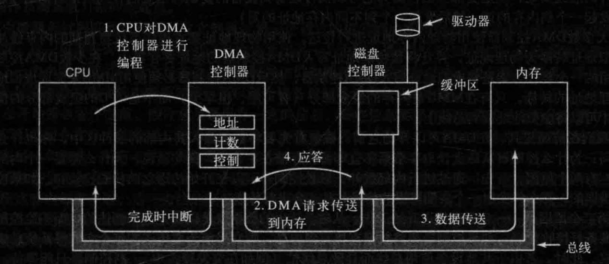

# 系统级 I/O

健壮性 IO 提供两个特性：

- 无缓冲的输入输出函数。直接在主存和文件之间传输数据，没有应用级缓存。这对**二进制数据读写到网络**和从**网络读写二进制**非常重要。
- 有缓冲的输出输出函数。允许你高效地从文件中读取文本行和二进制数据，这些文件的内容缓存在应用级缓冲区内。减少了系统调用的次数。

对于文件操作来说，系统级 I/O 统一了操作规范：

1. 打开文件，一个应用程序通过内核打开一个文件，用描述符来记录这个文件相关信息。
2. 打开文件有三个标准文件：标准输入、标准输出和标准错误
3. 改变当前文件的位置。每打开一个文件，内核都会记录当前文件位置值 k，当然也可以选择设置位置偏移
4. 读写文件
5. 关闭文件，释放文件占用的资源避免发生内存泄漏

内核利用三个相关的数据结构来共享文件：

- 描述符表(descriptor table) 。每个进程都有一个单独的描述符表，他的表项是由进程打开的文件描述符来索引的。每个打开的描述符表项指向的是文件表的一个表项。
- 文件表(file table)。打开文件的集合是由一张文件表来表示的，所有进程都共享这个表。每个文件表由文件位置、引用计数、以及一个指向 v-node 表的指针。
- v-node 表。同文件表，所有进程都共享这个 v-node 表。每个表项包含 stat 结构中的大多数信息，如文件类型和文件大小等

在读取文件的时候，首先要打开(Open)指定文件 file1获得一个文件描述符 fd1；这个文件描述符是一个数字，记录的是文件表中的表项(也就是文件表的索引)。然后就能根据 fd1 快速找到文件表，里面记录的是 **file1 的位置**、还有**引用该文件的计数器**（假设还有其他进程在访问这个文件，那么这个计数器就会自增）以及一直指向 **v-node 表的表项指针**。

这个 v-node 表记录的就是具体文件的元数据信息，如文件大小、类型、访问模式（只读、写）等。

所以通过这种链接关系，我们就很容易的实现多进程之间的文件共享。例如多个程序访问相同的文件，那么就会有如下关系：

- 两个独立的文件描述符 fd1，fd2。它们分别指向不同的文件表（也有可能指向相通的文件表）
- 文件表里面的 v-node 表项指针指向的是相通的 v-node。

## I/O 流

I/O 标准库将打开的文件抽象为一个流。对于程序而言，**流 = 文件描述符 + 流缓冲区**

流缓冲区的目的与 RIO 的缓冲区目的是一样的，减少 I/O 的系统调用的开销。即一次读一个字节与一次读10个字节到缓冲区，然后后面 9 次读取字节都不需要经过 I/O 的系统调用了。

Linux 内核使用三个相关的数据结构来表示打开的文件。**描述符表中的表项**指向**打开文件表中的表项**，而打开文件表中的表项又指向 **v-node 表中的表项**。

**每个进程都有自己的描述符表，而所有的进程共享同一个文件打开表和 v-node 表**。

## I/O 设备内存访问

I/O 设备访问内存地址主要有三种不同技术。

1. I/O 设备访问内存地址（Programmed I/O）:
   - 在没有 DMA 的情况下，IO 设备通过 CPU 的程序输入/输出（PIO）来进行数据传输。
   - CPU 完全占用整个读取或写入操作的持续时间，无法执行其他工作。
   - 这种方式会导致 CPU 无法跟上数据传输速率，或者需要在相对较慢的 IO 数据传输过程中执行其他工作（整个过程是阻塞的）。
2. I/O 内存映射（Memory-mapped I/O）:
   - I/O 内存映射是一种将设备寄存器映射到 CPU 地址空间的技术，允许 CPU 直接访问设备寄存器，而不需要通过专门的 I/O 指令。
   - 这种技术允许 CPU 像访问内存一样访问设备寄存器，提高了访问效率。
3. DMA（Direct Memory Access）:
   - DMA 允许某些硬件设备直接与主系统内存通信，并在不使用 CPU 处理的情况下传输数据。
   - DMA 机制使得 I/O 设备可以独立地访问主系统内存，而不需要 CPU 的全程干预，从而提高了数据传输速率和 CPU 的可用性。

> PIO（Programmed I/O），是一种用于处理 I/O 设备和内存交互的技术。在 PIO 中，CPU 通过执行程序指令来控制数据的传输，包括从 I/O 设备读取数据或向 I/O 设备写入数据。在 PIO 中，CPU通常需要完全占用整个读取或写入操作的持续时间，因此在此期间无法执行其他工作。这种方式会导致CPU无法跟上数据传输速率，或者需要在相对较慢的 I/O 数据传输过程中执行其他工作。因此，PIO 相对于其他技术而言效率较低，但在一些简单的应用场景中仍然可以发挥作用。

### 直接内存映射（DMA）

DMA（Direct Memory Access）是计算机系统的一种功能，允许某些硬件子系统独立于中央处理单元（CPU）直接访问主系统内存。

具有 DMA 通道的计算机可以比没有 DMA 通道的计算机以更少的 CPU 开销与设备之间传输数据。同样，多核处理器内部的处理电路可以在不占用处理器时间的情况下，将数据传输到和从其本地内存，从而允许计算和数据传输并行进行。DMA 还可以用于内存之间的数据复制或移动。DMA 可以将昂贵的内存操作，如大型复制或分散-聚集操作，从 CPU 转移到专用的 DMA 引擎。DMA 的实现示例是 I/O 加速技术。DMA 在网络芯片和内存计算架构中很有用。

DMA 控制器包含三个寄存器：**地址寄存器**、**字计数寄存器**和**控制寄存器**。为了在内存中找到目标位置，使用地址寄存器。字计数寄存器计算需要传输的输入数据中的字数。最后，控制寄存器指定传输模式。DMA 控制器通过特殊的数据通道在内存和辅助设备之间传输数据。有两种类型的通道：**数据通道**和**控制通道**。数据通道传输实际数据，而控制通道用于调节 DMA 控制器的操作。

DMA 技术加快了数据传输和内存操作的速度，有助于操作系统正确分配负载。然而，连接到网络计算机（NC）的计算机系统无法使用 DMA 控制器进行数据传输。连接到 NC 时，计算机系统必须依赖 CPU 来帮助进行数据传输。此外，在使用 DMA 进行数据传输时，可能会遇到缓存一致性问题。

我们首先来看一下在没有 DMA 下，磁盘如何读取数据。

首先，磁盘控制器从磁盘驱动器串行地、一位一位地读一个块(一个或多个扇区)，直到将整块信息放入控制器的内部缓冲区中。接着，它计算校验和，以保证没有读错误发生。然后控制器产生一个中断。当操作系统开始运行时，它重复地从控制器的缓冲区中一次一个字节或一个字地读取该块的信息，并将其存人内存中。

而 DMA 过程则不是这样：CPU 通过设置 DMA 控制器的寄存器对它进行编程，所以 DMA 控制器知道将什么数据传送到什么地方（即上图的步骤1）。DMA 控制器还要向磁盘控制器发出一个命令，通知它从磁盘读数据到其内部的缓冲区中，并且对校验和进行检验。如果磁盘控制器的缓冲区中的数据是有效的，那么 DMA 就可以开始了。

**DMA 控制器**通过在总线上发出一个读请求到磁盘控制器而发起 DMA 传送（图中步骤2）。该读请求看起来与任何其他读请求是一样的，并且磁盘控制器并不知道或者并不关心它是来自 CPU 还是来自 DMA 控制器。一般情况下，要写的内存地址在总线的地址线上，所以当磁盘控制器从其内部缓冲区中读取下一个字的时候，它知道将该字写到什么地方。写到内存是另一个标准总线周期（步骤3）。当写操作完成时，磁盘控制器在总线上发出一个应答信号到 DMA 控制器（步骤4）。于是，DMA 控制器步增要使用的内存地址，并且步减字节计数。如果字节计数仍然大于0，则重复第 2 步到第 4 步，直到字节计数到达 0。此时，DMA 控制器将中断 CPU 以便计 CPU 知道传送现在已经完成了。当操作系统开始工作时，用不着将磁盘块复制到内存中，因为它已经在内存中了。

## 磁盘

### 磁盘臂调度算法

磁盘臂调度算法是一种用于管理磁盘臂移动的算法。它的目的是提高磁盘的访问效率，减少磁盘臂的平均寻道时间。

磁盘臂是磁盘驱动器中用于读写数据的机械臂。它可以移动到不同的柱面（磁道）来访问数据。寻道是指磁盘臂移动到目标柱面的过程。寻道时间是磁盘访问延迟的主要组成部分。

磁盘臂调度算法可以根据不同的策略来决定磁盘臂的移动顺序。常见的磁盘臂调度算法包括：

- **先来先服务 (FCFS)**：根据请求到达的顺序来调度磁盘臂的移动。
- **最短寻道时间优先 (SSTF)**：选择距离当前磁头最近的请求来调度。
- **电梯算法 (SCAN)**：磁盘臂从当前位置向一个方向移动，直到没有请求为止，然后反向移动。
- **循环扫描 (CSCAN)**：与电梯算法类似，但磁盘臂在到达最外侧或最内侧后会立即反向移动。

**FCFS** 算法简单易行，但可能会导致较长的平均寻道时间，因为磁盘臂可能需要多次移动来访问相邻的柱面。

**SSTF** 算法可以有效地减少平均寻道时间，但可能会导致饥饿现象，因为距离磁盘臂较远的请求可能一直得不到服务。

**电梯算法**和**循环扫描算法**可以平衡 FCFS 和 SSTF 算法的优点，在提高效率的同时避免饥饿现象。

### 稳定存储器

当一个写命令发给它时，磁盘要么正确的写数据，要么什么也不做，让现有的数据完整无缺的留下，这种事物般的特性，我们就称为**稳定存储器**。

稳定存储器有三种操作：稳定写、稳定读和崩溃恢复。

**稳定写**

稳定写操作确保数据块被正确地写入两个驱动器上。具体步骤如下：

1. 将数据块写入驱动器 1。
2. 从驱动器 1 读回数据块，并进行校验。
3. 如果校验成功，则结束操作。
4. 如果校验失败，则重复步骤 1 和 2，直到成功为止。
5. 如果连续多次尝试都失败，则将数据块重映射到一个备用块上，并重复步骤 1 到 4。

**稳定读**

稳定读操作确保从两个驱动器上读取到的数据块是相同的。具体步骤如下：

1. 从驱动器 1 读取数据块。
2. 进行 ECC 校验。
3. 如果校验成功，则结束操作。
4. 如果校验失败，则重复步骤 1 和 2，直到成功为止。
5. 如果所有尝试都失败，则从驱动器 2 读取数据块。

**崩溃恢复**

崩溃恢复操作在系统崩溃后恢复数据的一致性。具体步骤如下：

1. 扫描两个驱动器，比较对应的块。
2. 如果两个块都相同，则什么都不做。
3. 如果只有一个块有错误，则用另一个块覆盖它。
4. 如果两个块都不同，则将驱动器 1 上的块写入驱动器 2。

## 时钟

时钟在多道程序设计系统中扮演着至关重要的角色。它负责维护时间，并且防止某个进程垄断中央处理器（CPU）。

它可以是硬件设备、软件程序或两者的组合。

1. **时钟硬件**：时钟硬件通常是计算机系统中的一个独立组件，用于提供精确的时间基准。它通常由一个**晶体振荡器**驱动，产生稳定的振荡信号。这个信号被分频器分频，得到更低频率的时钟信号，用于同步计算机内部各个组件的操作。时钟硬件的频率通常以赫兹（Hz）表示，如兆赫兹（MHz）或千兆赫兹（GHz）。
2. **时钟软件**：时钟软件是计算机操作系统中的一部分，用于管理和控制系统的时间。它负责与时钟硬件交互，获取时钟的计数值或时间戳，并提供系统时间和日期的功能。时钟软件还可以提供时钟同步、时间调整和时区管理等功能。
3. **软定时器**：软定时器是在软件层面上实现的一种计时器机制。它通常通过编程方式设置，用于在特定时间间隔或特定事件发生后触发特定的操作。软定时器可以用于实现延迟操作、定时任务、周期性任务等。它的精度通常受软件调度和处理器性能等因素的影响。

软定时器可以基于系统时钟或自己的时钟源进行计时。它们通常在操作系统内核或应用程序中实现，并通过设置定时器的计数器、回调函数等参数来定义定时器的行为。