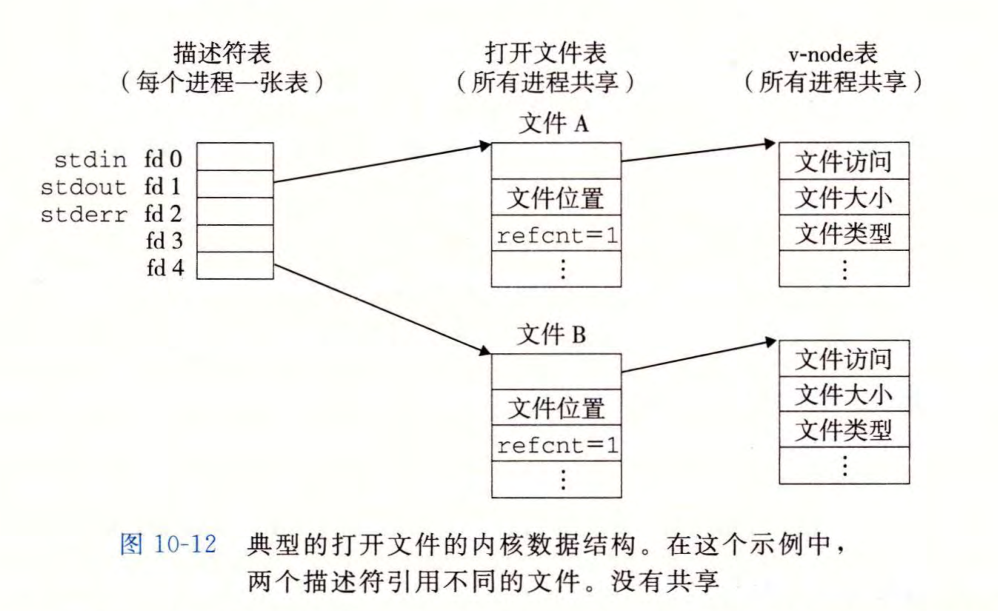
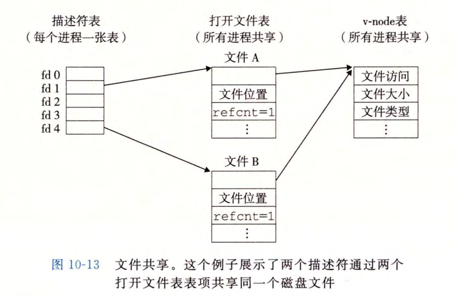

# 系统级 I/O

健壮性 IO 提供两个特性：

- 无缓冲的输入输出函数。直接在主存和文件之间传输数据，没有应用级缓存。这对**二进制数据读写到网络**和从**网络读写二进制**非常重要。
- 有缓冲的输出输出函数。允许你高效地从文件中读取文本行和二进制数据，这些文件的内容缓存在应用级缓冲区内。减少了系统调用的次数。

对于文件操作来说，系统级 I/O 统一了操作规范：

1. 打开文件，一个应用程序通过内核打开一个文件，用描述符来记录这个文件相关信息。
2. 打开文件有三个标准文件：标准输入、标准输出和标准错误
3. 改变当前文件的位置。每打开一个文件，内核都会记录当前文件位置值 k，当然也可以选择设置位置偏移
4. 读写文件
5. 关闭文件，释放文件占用的资源避免发生内存泄漏

内核利用三个相关的数据结构来共享文件：

- 描述符表(descriptor table) 。每个进程都有一个单独的描述符表，他的表项是由进程打开的文件描述符来索引的。每个打开的描述符表项指向的是文件表的一个表项。
- 文件表(file table)。打开文件的集合是由一张文件表来表示的，所有进程都共享这个表。每个文件表由文件位置、引用计数、以及一个指向 v-node 表的指针。
- v-node 表。同文件表，所有进程都共享这个 v-node 表。每个表项包含 stat 结构中的大多数信息，如文件类型和文件大小等

在读取文件的时候，首先要打开(Open)指定文件 file1获得一个文件描述符 fd1；这个文件描述符是一个数字，记录的是文件表中的表项(也就是文件表的索引)。然后就能根据 fd1 快速找到文件表，里面记录的是 **file1 的位置**、还有**引用该文件的计数器**（假设还有其他进程在访问这个文件，那么这个计数器就会自增）以及一直指向 **v-node 表的表项指针**。

这个 v-node 表记录的就是具体文件的元数据信息，如文件大小、类型、访问模式（只读、写）等。

所以通过这种链接关系，我们就很容易的实现多进程之间的文件共享。例如多个程序访问相同的文件，那么就会有如下关系：

- 两个独立的文件描述符 fd1，fd2。它们分别指向不同的文件表（也有可能指向相通的文件表）
- 文件表里面的 v-node 表项指针指向的是相通的 v-node。

## I/O 流

I/O 标准库将打开的文件抽象为一个流。对于程序而言，**流 = 文件描述符 + 流缓冲区**

流缓冲区的目的与 RIO 的缓冲区目的是一样的，减少 I/O 的系统调用的开销。即一次读一个字节与一次读10个字节到缓冲区，然后后面 9 次读取字节都不需要经过 I/O 的系统调用了。

Linux 内核使用三个相关的数据结构来表示打开的文件。**描述符表中的表项**指向**打开文件表中的表项**，而打开文件表中的表项又指向 **v-node 表中的表项**。

**每个进程都有自己的描述符表，而所有的进程共享同一个文件打开表和 v-node 表**。

