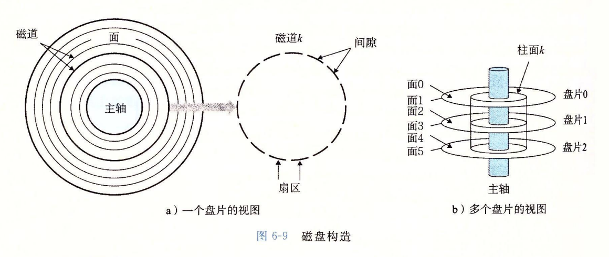
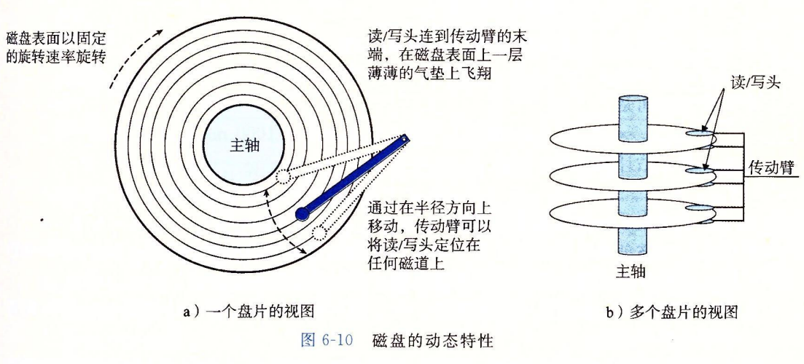
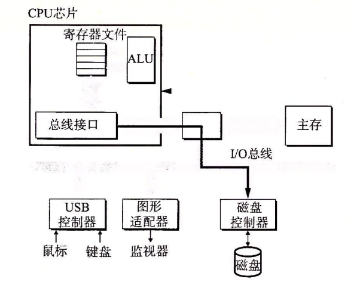
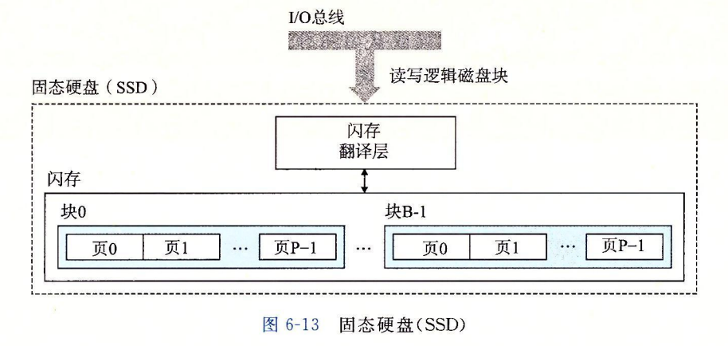

# 存储层次结构

存储器系统是一个具有不同容量、成本和访问时间的存储设备的层次结构。CPU 寄存器保存最常用的数据，CPU 高速缓存紧靠 CPU，容量很小，速度很快。主存容量比较大，速度也快但是没有高速缓存块。磁盘容量最大，也是最便宜的，但是速度不快。

## 随机访问存储器（RAM）

主要分为两类：（静态存储器）SRAM 和 DRAM

SRAM：主要作为 CPU 的高速缓存存储器，速度要比 DRAM 块。SRAM 将每个位存储在一个双稳态的存储器单元里。一个存储单元使用一个 6 晶体管电路来实现的。这个电路可以无限期保持在两个不同的电压配置或状态之一。并且不受电波干扰，当干扰因素消除时，就会自动回复稳定值。

DRAM：主要为主存使用。SRAM 将每个位存储为对一个电容的充电。这个电容非常小，容易收到干扰，一旦被干扰就永远不会恢复。看着好像 DRAM 没什么用处，实则不然。一是计算机运行的时钟周期是以纳秒来衡量的，而 DRAM 单元一般会在 10~100 毫秒时间内失去电荷（收到干扰），所以这么一比较就会发现这段时间而言保持的相对比较长了。二是内存系统本身是通过**周期性的读出，然后重写来刷新内存的每一位**。

优劣势对比：

SRAM：每位晶体管数有 6 个，所以耗电也高，成本高，速度块，对外干扰因素不敏感

DRAM：每位晶体管数有 1 个，成本相对低，速度相对 SRAM 慢，对外干扰因素敏感

> RAM 全称：Random-Access Memory；

DRAM 在读取数据是通过内部的一个内存控制器来控制的，通过行请求脉冲（Row-Access Strobe）将地址发送给 DRAM，然后就是列请求脉冲（Column Access Strobe）。反过来也是类似的，将内容作为响应发送给内存控制器。

非易失性存储器：相比 SRAM，RAM 这两种易失性（断电会丢失信息）的随机存储内存，还有一个非易失性粗出其，其中一个现代最重要的就是闪存（flash memory），它是基于**电子可擦除 PROM**（Electrically Erasable PROM，EEPROM）拓展的。还有一种被称为**可擦写可编程 ROM**（Erasable Programmable ROM,EPROM）

## 如何访问主存

**数据流是通过总线的共享电子电路在处理器和 DRAM 主存之间来回交互的**。每次 CPU 和主存之间的数据传送都是通过一系列步骤来完成的，这些步骤被称为**事务总线（bus transaction）**。读事务从主存传输数据到 CPU。写事务从 CPU 传输数据到主存。

总线是由一组并行的导线，能携带地址信息、数据和控制信号。控制线携带的信号会同步事务，会标识当前正在处理的事务操作的类别。

	

内存总线：连接 I/O桥接器和主存

I/O桥接器：将系统总线的电子信号翻译成内存总线的电子信号。

拿一个指令具体来描述 CPU 发生了什么

```c
movq  A, %rax
```

1. 地址 A 的内容被加到寄存器 %rax 中。
2. CPU 上的总线接口的电路在系统总线上发起读事务
   1. CPU 将地址 A 放到系统总线上
   2. I/O 桥将信号传递给内存总线
   3. 主存感觉到了在内存总线上的地址信号，从内存总线上读地址，从 DRAM 取出数据并写入到内存总线
3. I/O 桥将内存总线信号翻译成系统总线信号，并沿系统总线传递
4. CPU 感觉到系统总线上的地址数据，从总线上读数据，并将数据复制到寄存器 %rax 中。

```c
movq  %rax, A
```

1. CPU 将地址 A 放到内存总线。主存读出这个地址，并等待数据字
2. CPU 将数据放入总线上
3. 主存从总线读数据字，并存储到地址 A

## 磁盘



主轴：盘片以固定的旋转速率旋转，像电脑硬件标识的 5400~15000 转每分钟（Revolution Per Minute，RPM）说的就是这个指标，转速越大代表寻道的效率就越高。

每个磁盘表面都是由一组磁道（track）的同心圆组成。每个磁道被划分为一个扇区（sector）。每个扇区包含相等数量的数据位。扇区之间由间隙（gap）分隔开，这些间隙不存储数据位。是用来存储标识扇区的格式化位。

磁盘的容量决定因素：

- 记录密度（recording density）（位/英寸）：磁道每英寸的段中可以放入的位数
- 磁道密度（track density）（道/英寸）：从盘片中心出发半径上一英寸的段内可以有的磁道数。
- 面密度（areal density）（位/平方英寸）：记录密度与磁道密度的乘积。

磁盘容量计算公式：
$$
磁盘容量 = \frac{字节数}{扇区} × \frac{平均扇区数}{磁道} × \frac{磁道数}{表面} × \frac{表面数}{盘片} × \frac{盘片数}{磁盘}
$$
例子：现在有一个磁盘，有 5 个盘片，每个扇区 512 字节，每个面 2000 条磁道，每条磁道平均 300 个扇区。那么这个磁盘的容量是多少？

根据公式：
$$
磁盘容量 = \frac{512字节数}{扇区} × \frac{300平均扇区}{磁道} × \frac{2000磁道}{表面} × \frac{2表面}{盘片} × \frac{5盘片}{磁盘}
\\=512×300×2000×2×5\qquad\qquad\quad\quad\quad\quad\;\;\\=30720000000字节\qquad\qquad\qquad\qquad\qquad\;\;\;\;
\;\;\;\;\\=30.72GB\qquad\qquad\qquad\qquad\qquad\qquad\qquad\;\;\;\;\;
$$


磁盘用读写头来独写数据，存储在磁盘表面的位。读写头连接到传动臂（上图蓝色），沿着半径轴前后移动传动臂来驱动读/写头在定位盘面上的任意磁道上。这个过程被称为寻道（seek）。一旦定位到了目标内容，读/写头就能感知到这些数据，既能读取也能修改。多个盘片有多个传动臂，读写头垂直分布，行动一致。磁盘以扇区大小的块来读写数据。对扇区的访问时间主要有三个因素：寻道时间（seek time）、旋转时间（rotational latency）和传递时间（transfer time）。

操作系统执行 I/O 操作时，磁盘的操作过程：

首先要知道磁盘内部构造是复杂的，但是磁盘本身隐藏了这个因素，以一个简单的外表（呈现一个视图）体现出来，一个 B 个扇区大小的逻辑块的序列，划分编号为 0，1，...，B-1。磁盘封装中有一个很小的硬件/固件设备，被称为**磁盘控制器**，**它维护逻辑块号和实际（物理）磁盘扇区之间的映射关系**。

如果操作系统要执行一个 I/O 操作，例如读一个磁盘扇区的数据到主存，**操作系统会发送一个命令到磁盘控制器，磁盘控制器会读取某个逻辑块号。控制器上的固件会执行一个快速对照表查询，将一个逻辑块号翻译成一个（盘面，磁道，扇区）的三元组，这个三元组唯一标识对应的物理扇区（这个过程很像 ARP 虚拟内存地址映射物理内存地址的过程）。控制器上的硬件会解析这个三元组，将读/写头移动到合适的柱面，等待扇区移动到读/写头下，将读/写头感知到的位放到控制器上的一个缓冲区上，然后将它们复制到主存中。**

> 格式化磁盘容量为什么要比实际厂家标注的要少？
>
> 一是因为格式化包括用标识扇区的信息填写扇区之间的间隙，间隙是不存储任何数据信息的，也就是不使用它们。
>
> 二是每个区中预留了一组柱面作为备用，如果一个区中一个或多个柱面在磁盘使用的过程中坏掉了，那么还可以使用这些备用的柱面。

## I/O 设备

计算机都是通过 I/O 总线来与那些 I/O 输入输出设备（图形卡，鼠标，显示器，键盘等）交互的。例如 Intel 的**外围设备互连（Peripheral Component Interconnect，PCI）总线**连接到 CPU 和主存的。

从上面的计算机 CPU，IO 结构图就能得知 I/O 总线设计成与 CPU 无关的。Windows 和 Mac 都能通过 PCI 连接。

有三种类似不同的设备连接到 I/O 总线：

1. USB 控制器（通用串行总线（Universal Serial Bus，USB））是连接 USB 总线设备的一个中转机构，USB 是一个非常广泛使用的协议，像 U盘、鼠标、键盘、调制解调器、数码相机、外部磁盘和固态硬盘。**USB3.0 的最大传输速度为 625MB/s，USB3.1 的最大传输速度为 1250MB/s。**
2. 图形适配器，包含硬件和软件逻辑，负责代表 CPU 在显示器上显示图像。
3. 主机总线适配器，将一个或多个磁盘连接到 I/O 总线，使用的是主机总线接口定义的一个协议。这里有两个最常用的磁盘接口：SCSI 和 SATA 接口。SCSI 比 SATA 要快，但同时价格要比 SATA 贵。SCSI 支持多个磁盘控制器，而 SATA 支持一个。

> I/O 总线根据现在的技术发展，在现代系统中，共享的 PCI 总线已经被 PCIe（PCI express）总线取代，PCIe 是一组高速串行、通过开关连接的点到点链路。它的最大吞吐量为 16GB/s，比 PCI 高出一个数量级，PCI 最大吞吐量为 533MB/s。



上图表示 CPU 通过 I/O 内存映射技术来实现与磁盘沟通，向 I/O 设备发送命令。实现原理是在使用内存映射 I/O 的系统中，**会有专门一个空间地址是为了与 I/O 设备通信保留的**。这个地址被称为 **I/O 端口**。**CPU 通过命令、逻辑块号和目的内存地址写到磁盘相关的内存映射地址，从而发起一个读操作。**

磁盘控制器接收到一个读指令后，它将逻辑块翻译成一个扇区地址，读该扇区的内容，然后将这些内容直接传送到主存，不需要 CPU 的干涉。设备可以直接执行读/写事务，这个过程称为**直接内存访问**（Direct Memory Access，DMA）。这种数据传输又叫 DMA transfer。

**在 DMA 传输完毕后，磁盘扇区的内容被保存到主存种，磁盘控制通过执行中断信号来通知 CPU。这里面主要的过程就是通过中断发出信号给 CPU 上的外部引脚上，这会让 CPU 中断当前执行的工作跳转来处理这个信号，然后返回之前被中断的地方。**

## 固态硬盘（SSD）



中间的闪存翻译层是将 I/O 总线传输过来的 CPU 指令的读写逻辑块翻译成对应的物理内存块，与磁盘控制器的角色作用一样。

SSD 读性能要比写性能快一个数量级。

**一个闪存由 B 个块的序列组成，一个块由 P 个页组成。通常页的大小一般是 512字节~4KB，块是由 32~128 页组成，块的大小通常是 16KB~512KB。**

固态硬盘是有使用寿限的，一个块被擦重新覆盖的次数大约在 100000 次，一旦磨损就永远不能使用了。

