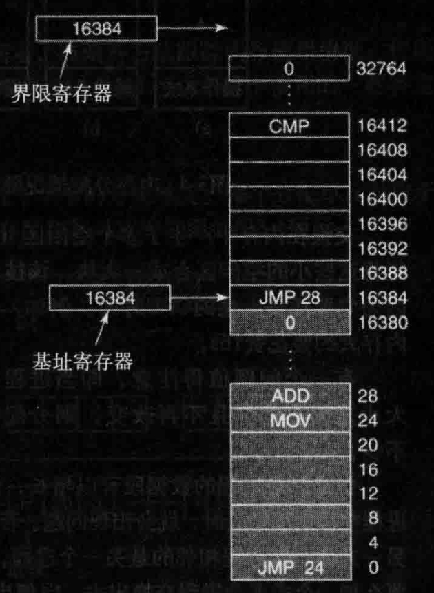
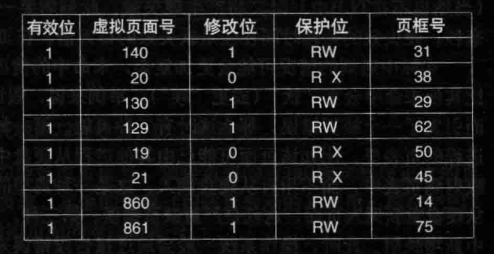
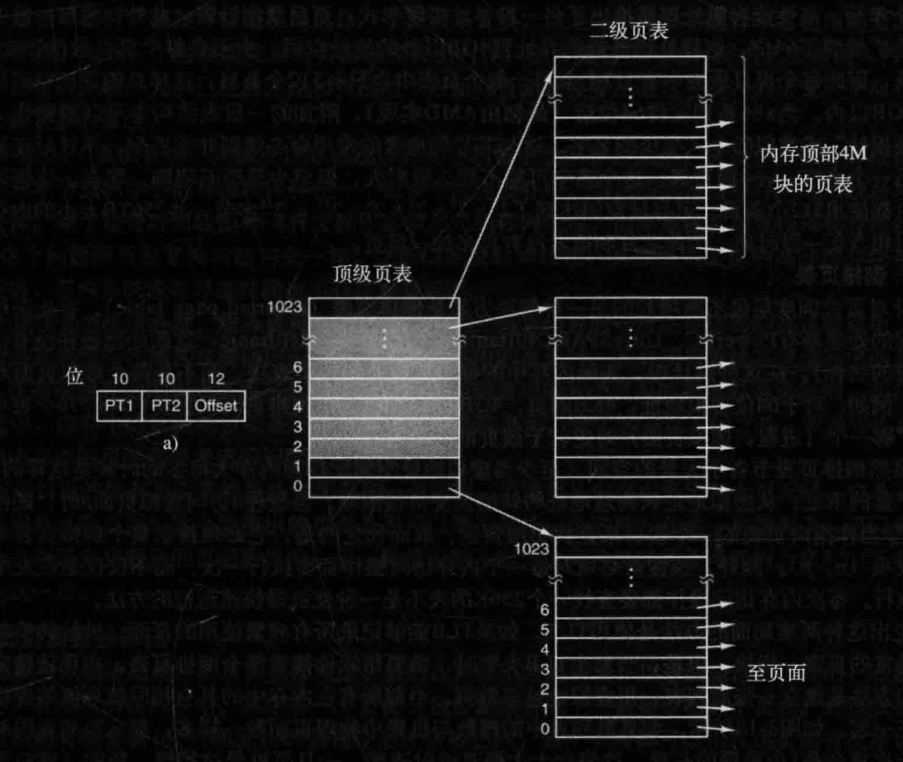

# 操作系统的内存管理

每个应用程序都有自己独立的内存地址空间，操作系统需要把程序中的地址映射到对应的物理内存地址。这个简单的解决办法是使用**动态重定位**，简单地把每个进程的地址空间映射到物理内存的不同部分，所使用的经典办法是给每个 CPU 配置两个特殊硬件寄存器，通常叫作**基址寄存器**和**界限寄存器**，用于支持内存保护和地址转换。

1. 基址寄存器（Base Register）：基址寄存器存储了一个基地址（Base Address），用于指示一个存储区域的起始位置。当使用基址寄存器时，计算的地址是相对于该基地址的偏移量。基址寄存器允许程序以相对地址的方式来访问内存，而不需要直接指定绝对物理地址。通过改变基址寄存器的值，可以让程序访问不同的内存区域。
2. 界限寄存器（Limit Register）：界限寄存器存储了一个地址范围的界限（Limit）。界限寄存器定义了一个内存区域的大小，限制了程序可以访问的地址范围。在进行内存访问时，系统会检查所请求的地址是否在界限寄存器定义的范围内，从而实现内存保护的功能。如果地址超出了界限寄存器所定义的范围，系统会触发异常或错误。

当使用基址寄存器和界限寄存器时，程序装载到内存中连续的空闲位置且装载期间无须重定位，如图所示：

**当一个进程运行时程序的起始物理地址装载到基址寄存器中，程序的长度装载到界限寄存器中**。当第一个程序运行时，装载到这些硬件寄存器中的基址和界限值分别是0和16 384。当第二个程序运行时，这些值分别是 16384 和 32768。

通常计算机的物理内存是有限的，每启动一个进程都需要占用一定的物理内存空间。当运行的进程达到一定数量阈值的时候，计算机就会因内存不足出现各种问题。

这个时候在遇到物理内存超载的情况下，可以**交换**技术和**虚拟内存**技术来避免内存不足的问题。

- **交换 (swapping)技术**，即把一个进程完整调入内存，使该进程运行一段时间，然后把它存回磁盘。空闲进程主要存储在磁盘上，所以当它们不运行时就不会占用内存。（操作系统可以将不活动的进程或页面交换到辅助存储设备上，从而释放内存空间给其他进程使用。当需要恢复被交换出去的进程时，操作系统将其再次交换到内存中并继续执行。）交换技术可以有效地扩展系统的可用内存空间，但在交换过程中会引入较高的延迟。
- **虚拟内存 (virtual-memory)**，该策略甚至能使程序在只有一部分被调入内存的情况下运行。

## 跟踪已分配的内存管理

在动态分配内存时，操作系统需要有效地跟踪内存的使用情况，以便能够分配和释放可用的内存块。两种常见的方法是**位图**和**空闲区链表**。

- **位图（Bitmap）**：位图是一种使用位来表示内存块状态的数据结构。每个内存块对应于位图中的一个位。当一个内存块被分配时，对应的位被标记为已用；当一个内存块被释放时，对应的位被标记为未用。位图可以使用一个数组或一个位向量来实现。位图的优点是占用的内存空间相对较小，因为每个内存块仅需要一个位来进行表示。然而，对于大型内存系统，位图可能会占用较多的内存空间，并且在查找可用内存块时需要进行位运算操作。

- **空闲区链表（Free List）**：空闲区链表是一种使用链表来跟踪可用内存块的数据结构。链表中的每个节点表示一个空闲内存块，**节点包含该内存块的起始地址和大小**。当一个内存块被分配时，对应的节点从链表中移除；当一个内存块被释放时，一个新的节点被插入到链表中，以保持链表按地址有序。空闲区链表的优点是可以灵活地分配和释放内存块，尤其适用于动态大小的内存分配。然而，空闲区链表可能会占用较多的内存空间来存储链表节点的信息。

  空闲区链表当需要为新的内存分配请求找到合适的内存块时，可以使用不同的分配算法来搜索空闲区链表：

  - **首次适应（First Fit）**：首次适应算法从链表的头部开始搜索，找到第一个大小大于等于待分配内存的空闲块。这是一种简单直接的算法，但可能导致较大的内部碎片，因为找到的空闲块可能比请求的内存稍大。
  - **下次适应（Next Fit）**：下次适应算法是首次适应算法的一种变种。它从上次分配的位置开始搜索，找到第一个满足大小要求的空闲块。这种算法对于连续分配的情况具有一定的性能优势，因为它可以避免频繁地从链表头开始搜索。
  - **最佳适应（Best Fit）**：最佳适应算法搜索整个空闲区链表，找到最小的满足大小要求的空闲块。这种算法可以最小化内存的碎片化，但可能导致较长的搜索时间和性能开销。
  - **最坏适应（Worst Fit）**：最坏适应算法搜索整个空闲区链表，找到最大的满足大小要求的空闲块。这种算法可以最大程度地减少外部碎片，但可能导致较长的搜索时间和较差的内存利用率。

## 虚拟内存

**虚拟内存技术**将物理内存和外部存储（通常是硬盘）结合起来，为每个进程提供一个抽象的、连续的地址空间。虚拟内存将进程的地址空间划分为固定大小的页面（或称为页），并按需将这些页面加载到物理内存中。当进程访问一个尚未加载到内存的页面时，操作系统会将其从外部存储器中加载到内存中。同时，操作系统使用页面置换算法（如 LRU）来管理内存中的页面，以便根据需要置换页面。关于虚拟内存更多详情可详见：[虚拟内存](vm.md)

### 地址转换

页表的目的是把虚拟页面映射为页帧。从数学角度说，页表是一个函数，它的参数是虚拟页号，结果是物理页框（页帧）。通过这个函数可以把虚拟地址中的虚拟页面域替换成页帧域，从而形成物理地址。一个典型的页表项结构如图：

- “在不在”位：也叫“有效位”，1 表示该表项有效，可以直接使用。0 表示该表项对应的虚拟页面找不到匹配的物理内存地址，则会引起一个缺页中断。
- 保护(protection)位：指出一个页允许什么类型的访问。最简单的形式是这个域只有一位，0 表示读/写，1 表示只读。一个更先进的方法是使用三位，各位分别对应是否启用读、写、执行该页面。
- 修改 (modified)位：为了记录页面的使用状况，在写入一页时由硬件自动设置修改位。该位在操作系统重新分配页框时是非常有用的。如果一个页面已经被修改过(即它是“脏”的)，则必须把它写回磁盘。如果一个页面没有被修改过 (即它是“干净”的)，则只简单地把它丢弃就可以了，因为它在磁盘上的副本仍然是有效的。这一位有时也被称为脏位 (dirty bit)，因为它
  反映了该页面的状态。
- 访问 (referenced)位：不论是读还是写，系统都会在该页面被访问时设置访问位。它的值被用来帮助操作系统在发生**缺页中断**时选择要被淘汰的页面。不再使用的页面要比正在使用的页面更适合淘汰（各种缓存更新算法）。
- 高速缓存禁止位：标明是否读取缓存。假如操作系统正在紧张地循环等待某个I/0设备对它刚发出的命令作出响应，保证硬件是不断地从设备中读取数据而不是访问一个旧的被高速缓存的副本，这种情况下高速缓存位就非常重要。

页面的映射功能要求非常快，所以在实现上引入了一个用来加速映射的硬件——**转换检测缓冲区（TLB）**，这个小小的硬件设备将虚拟地址直接映射到物理地址上，而不必再访问表，也称为“相联存储器”或“快表”。这个表项记录了一个页面相关的信息：虚拟页号、页面的修改位、保护码和该页对应的物理页框（页帧）号：

> 例如，假设一条 1 字节指令要把一个寄存器中的数据复制到另一个寄存器。在不分页的情况下，这条指令只访问一次内存，即从内存中取指令。有了分页机制后，会因为要访问页表而引起更多次的内存访问。由于执行速度通常被 CPU 从内存中取指令和数据的速度所限制，所以两次访问内存才能实现一次内存访问会使性能下降一半。在这种情况下，没人会采用分页机制。

TLB 是如何工作的：将一个虚拟地址放入 MMU 中进行转换时，硬件首先通过将该虚拟页号与 TLB 中所有表项同时(即并行)进行匹配，判断虚拟页面是否在其中。如果发现了一个有效的匹配并且要进行的访问操作并不违反保护位，则将页框号直接从 TLB 中取出而不必再访问页表。如果虚拟页号确实是在 TLB 中，但指令试图在一个只读页面上进行写操作，则会产生一个保护错误，就像对页表进行非法访问一样。当虚拟页号不在 TLB 中时会怎样呢? 

如果 MMU 检测到没有有效的匹配项，就会进行正常的页表查询。接着从 TLB 中淘汰一个表项，然后用新找到的页表项代替它。这样，如果这一页面很快被再次访问，第二次访问 TLB 时自然将会命中。当一个表项被清除出 TLB 时，将修改位复制到内存中的页表项，而除了访问位，其他的值不变。当页表项中从页表中装入 TLB 中时，所有的值都来自内存。

除了引入 TLB 加速虚拟地址到物理地址的转换之外，还要解决一个大内存的虚拟地址空间问题。

### 多级页表

一种常见的方法是使用二级页表。在这种方案中，虚拟地址被划分为两个部分，高级页表和低级页表。高级页表用于将虚拟地址转换为中间地址，而低级页表用于将中间地址转换为物理地址。这种方式可以有效地减小每个页表的大小，同时提供了灵活的地址映射机制。也可以在二级页表的基础上继续拓展为多级拓展，每个级别的页表只负责一部分地址空间的映射，从而降低了每个页表的大小和访问的复杂性。

引入多级页表的原因是避免把全部页表一直保存在内存中，特别是那些从不需要的页表就不应该保留。比如一个需要 12MB 内存的进程，其最底端是 4MB 的程序正文段，后面是 4MB 的数据段，顶端是 4MB 的堆栈段，在数据段上方和堆栈段下方之间是大量根本没有使用的空闲区。

以上图二级页表为例：二级页表是如何工作的呢？在左边是顶级页表，它有 1024 个表项，对应于 10 位的 PT1 域。当一个虚拟地址被送到 MMU 时，MMU 首先提取 PT1 域并把该值作为访问顶级页表的索引。因为整个 4GB（即32位）虚拟地址空间已经按 4KB 大小分块，所以顶级页表中这 1024 个表项的每一个都表示 4M 的块地址范围。

由索引顶级页表得到的表项中含有二级页表的地址或页框号。顶级页表的表项 0 指向程序正文的页表，表项 1 指向数据的页表，表项 1023 指向堆栈的页表，其他的表项(用阴影表示的)未用。现在把 PT2 域作为访问选定的二级页表的索引，以便找到该虚拟页面的对应页框号。

### 倒排页表

与传统的页表不同，倒排页表是基于物理内存而不是虚拟地址空间来组织和查找页面映射关系。

**倒排页表**的基本思想是将**物理页框作为索引**，每个索引项存储了对应页框的虚拟页号和进程标识符（PID）。通过这种方式，可以根据物理页框来查找对应的虚拟页号和进程标识符，从而进行反向的地址映射。

在传统的页表中，每个进程都有自己的页表，用于将其虚拟地址映射到物理地址。而在倒排页表中，所有进程共享一个全局的页表。因为这个页表采用了散列表，所以查询速度非常快。缺点就是随之而来的哈希碰撞和更新开销。

