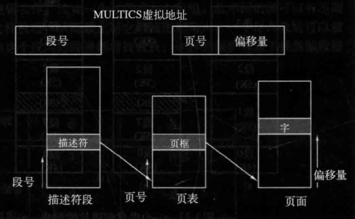

# 操作系统的内存管理

每个应用程序都有自己独立的内存地址空间，操作系统需要把程序中的地址映射到对应的物理内存地址。这个简单的解决办法是使用**动态重定位**，简单地把每个进程的地址空间映射到物理内存的不同部分，所使用的经典办法是给每个 CPU 配置两个特殊硬件寄存器，通常叫作**基址寄存器**和**界限寄存器**，用于支持内存保护和地址转换。

1. 基址寄存器（Base Register）：基址寄存器存储了一个基地址（Base Address），用于指示一个存储区域的起始位置。当使用基址寄存器时，计算的地址是相对于该基地址的偏移量。基址寄存器允许程序以相对地址的方式来访问内存，而不需要直接指定绝对物理地址。通过改变基址寄存器的值，可以让程序访问不同的内存区域。
2. 界限寄存器（Limit Register）：界限寄存器存储了一个地址范围的界限（Limit）。界限寄存器定义了一个内存区域的大小，限制了程序可以访问的地址范围。在进行内存访问时，系统会检查所请求的地址是否在界限寄存器定义的范围内，从而实现内存保护的功能。如果地址超出了界限寄存器所定义的范围，系统会触发异常或错误。

当使用基址寄存器和界限寄存器时，程序装载到内存中连续的空闲位置且装载期间无须重定位，如图所示：

**当一个进程运行时程序的起始物理地址装载到基址寄存器中，程序的长度装载到界限寄存器中**。当第一个程序运行时，装载到这些硬件寄存器中的基址和界限值分别是0和16 384。当第二个程序运行时，这些值分别是 16384 和 32768。

通常计算机的物理内存是有限的，每启动一个进程都需要占用一定的物理内存空间。当运行的进程达到一定数量阈值的时候，计算机就会因内存不足出现各种问题。

这个时候在遇到物理内存超载的情况下，可以**交换**技术和**虚拟内存**技术来避免内存不足的问题。

- **交换 (swapping)技术**，即把一个进程完整调入内存，使该进程运行一段时间，然后把它存回磁盘。空闲进程主要存储在磁盘上，所以当它们不运行时就不会占用内存。（操作系统可以将不活动的进程或页面交换到辅助存储设备上，从而释放内存空间给其他进程使用。当需要恢复被交换出去的进程时，操作系统将其再次交换到内存中并继续执行。）交换技术可以有效地扩展系统的可用内存空间，但在交换过程中会引入较高的延迟。
- **虚拟内存 (virtual-memory)**，该策略甚至能使程序在只有一部分被调入内存的情况下运行。

## 跟踪已分配的内存管理

在动态分配内存时，操作系统需要有效地跟踪内存的使用情况，以便能够分配和释放可用的内存块。两种常见的方法是**位图**和**空闲区链表**。

- **位图（Bitmap）**：位图是一种使用位来表示内存块状态的数据结构。每个内存块对应于位图中的一个位。当一个内存块被分配时，对应的位被标记为已用；当一个内存块被释放时，对应的位被标记为未用。位图可以使用一个数组或一个位向量来实现。位图的优点是占用的内存空间相对较小，因为每个内存块仅需要一个位来进行表示。然而，对于大型内存系统，位图可能会占用较多的内存空间，并且在查找可用内存块时需要进行位运算操作。

- **空闲区链表（Free List）**：空闲区链表是一种使用链表来跟踪可用内存块的数据结构。链表中的每个节点表示一个空闲内存块，**节点包含该内存块的起始地址和大小**。当一个内存块被分配时，对应的节点从链表中移除；当一个内存块被释放时，一个新的节点被插入到链表中，以保持链表按地址有序。空闲区链表的优点是可以灵活地分配和释放内存块，尤其适用于动态大小的内存分配。然而，空闲区链表可能会占用较多的内存空间来存储链表节点的信息。

  空闲区链表当需要为新的内存分配请求找到合适的内存块时，可以使用不同的分配算法来搜索空闲区链表：

  - **首次适应（First Fit）**：首次适应算法从链表的头部开始搜索，找到第一个大小大于等于待分配内存的空闲块。这是一种简单直接的算法，但可能导致较大的内部碎片，因为找到的空闲块可能比请求的内存稍大。
  - **下次适应（Next Fit）**：下次适应算法是首次适应算法的一种变种。它从上次分配的位置开始搜索，找到第一个满足大小要求的空闲块。这种算法对于连续分配的情况具有一定的性能优势，因为它可以避免频繁地从链表头开始搜索。
  - **最佳适应（Best Fit）**：最佳适应算法搜索整个空闲区链表，找到最小的满足大小要求的空闲块。这种算法可以最小化内存的碎片化，但可能导致较长的搜索时间和性能开销。
  - **最坏适应（Worst Fit）**：最坏适应算法搜索整个空闲区链表，找到最大的满足大小要求的空闲块。这种算法可以最大程度地减少外部碎片，但可能导致较长的搜索时间和较差的内存利用率。

## 虚拟内存

**虚拟内存技术**将物理内存和外部存储（通常是硬盘）结合起来，为每个进程提供一个抽象的、连续的地址空间。虚拟内存将进程的地址空间划分为固定大小的页面（或称为页），并按需将这些页面加载到物理内存中。当进程访问一个尚未加载到内存的页面时，操作系统会将其从外部存储器中加载到内存中。同时，操作系统使用页面置换算法（如 LRU）来管理内存中的页面，以便根据需要置换页面。关于虚拟内存更多详情可详见：[虚拟内存](vm.md)

### 地址转换

页表的目的是把虚拟页面映射为页帧。从数学角度说，页表是一个函数，它的参数是虚拟页号，结果是物理页框（页帧）。通过这个函数可以把虚拟地址中的虚拟页面域替换成页帧域，从而形成物理地址。一个典型的页表项结构如图：

- “在不在”位：也叫“有效位”，1 表示该表项有效，可以直接使用。0 表示该表项对应的虚拟页面找不到匹配的物理内存地址，则会引起一个缺页中断。
- 保护(protection)位：指出一个页允许什么类型的访问。最简单的形式是这个域只有一位，0 表示读/写，1 表示只读。一个更先进的方法是使用三位，各位分别对应是否启用读、写、执行该页面。
- 修改 (modified)位：为了记录页面的使用状况，在写入一页时由硬件自动设置修改位。该位在操作系统重新分配页框时是非常有用的。如果一个页面已经被修改过(即它是“脏”的)，则必须把它写回磁盘。如果一个页面没有被修改过 (即它是“干净”的)，则只简单地把它丢弃就可以了，因为它在磁盘上的副本仍然是有效的。这一位有时也被称为脏位 (dirty bit)，因为它
  反映了该页面的状态。
- 访问 (referenced)位：不论是读还是写，系统都会在该页面被访问时设置访问位。它的值被用来帮助操作系统在发生**缺页中断**时选择要被淘汰的页面。不再使用的页面要比正在使用的页面更适合淘汰（各种缓存更新算法）。
- 高速缓存禁止位：标明是否读取缓存。假如操作系统正在紧张地循环等待某个I/0设备对它刚发出的命令作出响应，保证硬件是不断地从设备中读取数据而不是访问一个旧的被高速缓存的副本，这种情况下高速缓存位就非常重要。

页面的映射功能要求非常快，所以在实现上引入了一个用来加速映射的硬件——**转换检测缓冲区（TLB）**，这个小小的硬件设备将虚拟地址直接映射到物理地址上，而不必再访问表，也称为“相联存储器”或“快表”。这个表项记录了一个页面相关的信息：虚拟页号、页面的修改位、保护码和该页对应的物理页框（页帧）号：

> 例如，假设一条 1 字节指令要把一个寄存器中的数据复制到另一个寄存器。在不分页的情况下，这条指令只访问一次内存，即从内存中取指令。有了分页机制后，会因为要访问页表而引起更多次的内存访问。由于执行速度通常被 CPU 从内存中取指令和数据的速度所限制，所以两次访问内存才能实现一次内存访问会使性能下降一半。在这种情况下，没人会采用分页机制。

TLB 是如何工作的：将一个虚拟地址放入 MMU 中进行转换时，硬件首先通过将该虚拟页号与 TLB 中所有表项同时(即并行)进行匹配，判断虚拟页面是否在其中。如果发现了一个有效的匹配并且要进行的访问操作并不违反保护位，则将页框号直接从 TLB 中取出而不必再访问页表。如果虚拟页号确实是在 TLB 中，但指令试图在一个只读页面上进行写操作，则会产生一个保护错误，就像对页表进行非法访问一样。当虚拟页号不在 TLB 中时会怎样呢? 

如果 MMU 检测到没有有效的匹配项，就会进行正常的页表查询。接着从 TLB 中淘汰一个表项，然后用新找到的页表项代替它。这样，如果这一页面很快被再次访问，第二次访问 TLB 时自然将会命中。当一个表项被清除出 TLB 时，将修改位复制到内存中的页表项，而除了访问位，其他的值不变。当页表项中从页表中装入 TLB 中时，所有的值都来自内存。

除了引入 TLB 加速虚拟地址到物理地址的转换之外，还要解决一个大内存的虚拟地址空间问题。

### 多级页表

一种常见的方法是使用二级页表。在这种方案中，虚拟地址被划分为两个部分，高级页表和低级页表。高级页表用于将虚拟地址转换为中间地址，而低级页表用于将中间地址转换为物理地址。这种方式可以有效地减小每个页表的大小，同时提供了灵活的地址映射机制。也可以在二级页表的基础上继续拓展为多级拓展，每个级别的页表只负责一部分地址空间的映射，从而降低了每个页表的大小和访问的复杂性。

引入多级页表的原因是避免把全部页表一直保存在内存中，特别是那些从不需要的页表就不应该保留。比如一个需要 12MB 内存的进程，其最底端是 4MB 的程序正文段，后面是 4MB 的数据段，顶端是 4MB 的堆栈段，在数据段上方和堆栈段下方之间是大量根本没有使用的空闲区。

以上图二级页表为例：二级页表是如何工作的呢？在左边是顶级页表，它有 1024 个表项，对应于 10 位的 PT1 域。当一个虚拟地址被送到 MMU 时，MMU 首先提取 PT1 域并把该值作为访问顶级页表的索引。因为整个 4GB（即32位）虚拟地址空间已经按 4KB 大小分块，所以顶级页表中这 1024 个表项的每一个都表示 4M 的块地址范围。

由索引顶级页表得到的表项中含有二级页表的地址或页框号。顶级页表的表项 0 指向程序正文的页表，表项 1 指向数据的页表，表项 1023 指向堆栈的页表，其他的表项(用阴影表示的)未用。现在把 PT2 域作为访问选定的二级页表的索引，以便找到该虚拟页面的对应页框号。

### 倒排页表

与传统的页表不同，倒排页表是基于物理内存而不是虚拟地址空间来组织和查找页面映射关系。

**倒排页表**的基本思想是将**物理页框作为索引**，每个索引项存储了对应页框的虚拟页号和进程标识符（PID）。通过这种方式，可以根据物理页框来查找对应的虚拟页号和进程标识符，从而进行反向的地址映射。

在传统的页表中，每个进程都有自己的页表，用于将其虚拟地址映射到物理地址。而在倒排页表中，所有进程共享一个全局的页表。因为这个页表采用了散列表，所以查询速度非常快。缺点就是随之而来的哈希碰撞和更新开销。

### 内存映射文件

内存映射文件（Memory-mapped file）是一种将文件内容映射到进程虚拟地址空间的技术。通过内存映射文件，可以将文件的内容视为内存中的一部分，从而可以直接在内存中对文件进行读取和写入操作，而无需通过传统的文件 IO 接口。

内存映射文件的基本原理如下：

1. 创建映射：首先，通过操作系统提供的系统调用（如`mmap()`），将文件映射到进程的虚拟地址空间。在这个过程中，操作系统会将文件的某个区域与进程的一段连续虚拟内存进行关联。
2. 虚拟地址映射：操作系统会为这个映射区域分配一段虚拟地址，并将其映射到物理内存中的相应位置。这样，对于进程来说，文件的内容就像是存储在内存中的一部分数据一样，可以直接通过内存访问来读取和写入。
3. 内存访问：一旦映射建立完成，进程可以像访问普通内存一样，通过对映射区域的读写操作来访问文件的内容。这样做可以避免频繁的文件IO操作，从而提高了读写性能（如传统 I/O 系统调用会增加用户态和内核态上下文切换开销）。
4. 同步和持久化：对于内存映射文件的写操作，通常是异步的。这意味着写入的数据首先被缓存在内存中，而不是立即写入到文件中。操作系统会负责在适当的时机将内存中的数据同步到文件，以保证数据的持久性。

内存映射文件的优点：

1. 性能提升：由于文件内容直接映射到内存中，可以避免频繁的文件 IO 操作，从而提高了读写性能。
2. 简化编程：通过内存映射文件，可以将文件的内容当作内存中的数据来处理，这简化了编程逻辑，使得对文件的访问更加灵活和方便。
3. 共享内存：多个进程可以通过内存映射文件来共享数据，从而实现进程间的通信和数据共享。

> 注意：
>
> 在共享内存时，如果出现多个进程对映射文件同时进行修改时，会出现并发问题。

## 页面置换算法

由于内存有限，操作系统不能一次性把进程的所有空间全部加载进来。只能加载部分内容，运行时加载后续的内容。所以才会出现“缺页中断处理程序“，当出现缺页中断时，操作系统会把内存中不常用的页面换出内存，存进磁盘，用来存储新访问的内容。这里面就涉及到不同的置换算法：

- 最优页面算法：标记哪些页面时最不常用的，然后将其置换。这是最理想的置换算法，但不可实现。
- 最近未使用（NRU）算法：它根据页面的最近访问情况和修改情况将页面分为四类，然后选择其中一类中的页面进行置换。这四类分别是：未被访问且未被修改、未被访问但已被修改、已被访问但未被修改、已被访问且已被修改。
- FIFO 算法：它总是选择最早进入内存的页面进行置换。
- 第二次机会算法：是基于FIFO算法的一种改进，它使用一个位来标记页面是否被访问过。当页面被选中进行置换时，如果该页面的标记位为1，则将其标记位重置为0，并放到队列的末尾；如果标记位为0，则选择该页面进行置换。这样可以保留那些最近被访问的页面。
- 时钟算法：是一种基于环形链表的页面置换算法。它使用一个指针来顺序扫描页面，当需要进行页面置换时，时钟算法会检查指针指向的页面，如果该页面的访问位为1，则将其访问位重置为0，并将指针移到下一个页面；如果访问位为0，则选择该页面进行置换。
- 最近最少使用（LRU）算法：根据页面的历史访问顺序进行置换，选择最长时间未被访问的页面进行置换。LRU 算法的优点是可以较好地适应程序的局部性原理，但缺点是实现相对复杂，需要维护访问历史记录。
- 最不经常使用（NFU）算法：是一种基于页面访问频率的置换算法。它会为每个页面维护一个访问计数器，当需要进行页面置换时，选择访问计数最小的页面进行置换。这样可以保留那些访问频率较高的页面。
- 老化算法：它基于页面的访问历史来进行决策。这个算法会为每个页面维护一个计数器，用于记录页面的访问次数。当需要进行页面置换时，老化算法会选择访问次数最少的页面进行置换。这样做的好处是可以保留那些经常被访问的页面，减少了频繁访问的页面被置换出去的可能性。
- 工作集时钟算法：工作集模型是指进程当前正在使用的页面的集合。工作集时钟算法会为每个页面设置一个**访问位**和**修改位**。当页面被访问时，访问位会被设置为1；当页面被修改时，修改位会被设置为1。算法会使用一个时钟指针来扫描页面，如果扫描到的页面的访问位为1，则将其重置为0；如果访问位为0，则检查修改位，如果修改位也为0，则认为这个页面可以被置换出去。这样可以保留那些最近被访问的页面，同时也考虑了页面的修改情况。

## 缺页中断处理

都说缺页中断处理是一个非常耗时的操作，具体一个缺页中断处理程序步骤如下：

1. **硬件陷入内核**，在堆栈中保存程序计数器。大多数机器将当前指令的各种状态信息保存在特殊的 CPU 寄存器中。

2. 启动一个汇编代码例程保存通用寄存器和其他易失的信息，以免被操作系统破坏。这个例程将操作系统作为一个函数来调用。

3. 当操作系统发现一个缺页中断时，尝试发现需要哪个虚拟页面。通常一个硬件寄存器包含了这一信息，如果没有的话，操作系统必须检索程序计数器，取出这条指令，用软件分析这条指令，看看它在缺页中断时正在做什么。

   > 这里的”硬件寄存器“指的实际上就是**页表基址寄存器（Page Table Base Register,PTBR）**，是一种泛指。如在 x86 架构中指的就是 CR3 寄存器。它们都用于存储页表的物理地址。通过这个寄存器就能确认引起缺页的虚拟页面的地址。
   >
   > 但并不是所有的硬件平台都提供这么一种寄存器，所以如果操作系统没有这样一个寄存器就会通过读取程序计数器的值获取当前指令的地址，然后通过解析指令可以确定正在执行的指令所涉及的虚拟页面，从而能找到引起缺页中断的页面。

4. 一旦知道了发生缺页中断的虚拟地址，操作系统检查这个地址是否有效，并检查存取与保护是否一致。如果不一致，向进程发出一个信号或杀掉该进程。如果地址有效且没有保护错误发生，系统则检查是否有空闲页框。如果没有空闲页框，执行页面置换算法寻找一个页面来淘汰。

5. 如果选择的页框“脏”了（并发操作），安排该页写回磁盘，并发生一次**上下文切换**，挂起产生缺页中断的进程，让其他进程运行直至磁盘传输结束。无论如何，该页框被标记为忙，以免因为其他原因而被其他进程占用。

6. 一旦页框“干净”后（无论是立刻还是在写回磁盘后），操作系统查找所需页面在磁盘上的地址,通过磁盘操作将其装入。该页面正在被装入时，产生缺页中断的进程仍然被挂起，并且如果有其他可运行的用户进程，则选择另一个用户进程运行。

7. 当磁盘中断发生时，表明该页已经被装入，页表已经更新可以反映它的位置，页框也被标记为正常状态。

8. 恢复发生缺页中断指令以前的状态，程序计数器重新指向这条指令。

9. 调度引发缺页中断的进程，操作系统返回调用它的汇编语言例程。

10. 该例程恢复寄存器和其他状态信息，返回到用户空间继续执行，就好像缺页中断没有发生过一样。

> 引入缺页中断处理之后，要重新启动引起中断之前的指令。这里面有非常复杂的处理过程：
>
> 
>
> 考虑一个有双地址指令的 CPU，比如 Motorola 680x0，这是一种在嵌入式系统中广泛使用的CPU。例如，指令
> `MOVE.L #6(A1),2(A0)`为6字节(见上图)。为了重启该指令，操作系统要知道该指令第一个字节的位置。在陷阱发生时，程序计数器的值依赖于引起缺页中断的那个操作数以及 CPU 中微指令的实现方式。
>
> 从地址 1000 处开始的指令进行了 3 次内存访问:指令字本身和操作数的 2 个偏移量。程序计数器可能在 1000、1002 和 1004 时发生缺页中断，对操作系统来说要准确地判断指令是从哪儿开始的通常是不可能的。如果发生缺页中断时程序计数器是 1002，操作系统无法弄清在 1002 位置的字是与 1000 的指令有关的内存地址（比如，一个操作数的位置），还是一个操作码。
>
> 更糟的是早之前的一些 680x0 体系结构的寻址方式采用自动增量，这也意味着执行这条指令的副作用是会增量一个或多个寄存器。使用自动增量模式也可能引起错误。这依赖于微指令的具体实现，这种增量可能会在内存访问之前完成，此时操作系统必须在重启这条指令前将软件中的寄存器减量。自动增量也可能在内存访问之后完成，此时，它不会在陷人时完成而且不必由操作系统恢复。自动减量也会出现相同的问题。自动增量和自动减量是否在相应访存之前完成随着指令和CPU模式的不同而不同。
>
> 要解决这个问题就是通过使用一个**隐藏的内部寄存器**。这些隐藏寄存器用于保存指令执行前的寄存器状态，以便在指令重新执行时恢复寄存器的值。在每条指令执行前，将程序计数器（PC）的值复制到隐藏寄存器中，以保存指令执行前的PC值。
>
> 此外，某些计算机架构可能还提供了第二个隐藏寄存器，用于记录哪些寄存器已经执行自动增量或自动减量操作，以及增减的数量。通过这个隐藏寄存器，操作系统可以了解在指令执行前哪些寄存器受到了自动增量或自动减量的影响。

## 内存分段和分页

**分段（Segmentation）**的是将进程的地址空间分为逻辑上相关的段（segments），每个段具有相对独立的意义和大小。每个段都有自己的段基址（segment base）和段限长（segment limit）。当进程访问内存时，通过段选择子（segment selector）和段表（segment table）来确定对应的段基址和段限长，然后将逻辑地址转换为物理地址。

上述图是编译表的分段内存，其中共有 5 个独立的段。

分段可以更好地支持动态增长和共享。每个段可以根据需要进行动态增长，而不需要移动整个进程。此外，不同进程可以共享同一个段，从而节省内存空间。然而，分段可能导致内存碎片和复杂的地址转换过程。

> 因为在分段中，每个段都可以是大小不同的，因此进程的地址空间在逻辑上是由不连续的段组成的（特别是在发生内存碎片化之后）。也由于段大小不一样，所以在进行地址转换的时候会有额外的转换开销，可能需要多级表结构。
>
> 而分页是将进程的地址空间分为固定大小的页面，所以地址转换可以通过单级页表或多级页表来实现，这样就更简单且高效（主要是大小固定，且可以利用高速缓存 TLB 机制）。

**分页（Paging）**是将进程的地址空间划分为固定大小的页面（pages），同时将物理内存划分为与页面大小相同的页框（page frames）。每个页面都有唯一的页号（page number）。当进程访问内存时，逻辑地址被分为页号和页内偏移量，通过页表（page table）将页号映射到相应的页框号，然后将页框号和页内偏移量组合成物理地址。

### MULTICS 操作系统的内存分段和分页结合实现

MULTICS 多用户操作系统使用了一种将分段和分页结合的方式进行内存管理。

1. 段表（Segment Table）和段描述符（Segment Descriptor）：

   - 每个MULTICS程序都有一个段表，其中的每个表项对应一个段。
   - 段表本身也被看作一个段，并被分页。
   - 段描述符是段表中的每个表项，用于描述一个段的属性和位置。
   - 段描述符包含了以下信息：
     - 段是否在内存中的标志。只要一个段的任何一部分在内存中，该段就被认为是在内存中。
     - 如果一个段在内存中，段描述符会包含一个指向该段页表的指针。
     - 段大小、保护位和其他相关条目。

   

2. 分页：

   - 每个段被看作一个虚拟地址空间，并进行分页。
   - 一般情况下，页面大小为  1024 个字，即一个页面由 1024 个字构成。
   - 段内地址分为页号和页内的字。
   - 物理地址是24位，并且页面按照64字节的边界对齐，因此在描述符中只需要18位来存储页表地址。

3. 地址结构：

   - MULTICS中的地址由两部分构成：段和段内地址。
   - 段内地址进一步分为页号和业内的字（业内偏移量）。

   

   地址到内存地址的转换如下图所示：

   

在进行内存访问时，会执行下面的算法。

1. 根据段号找到段描述符。
2. 检查该段的页表是否在内存中。如果在，则找到它的位置；如果不在，则产生一个段错误。如果访问违反了段的保护要求就发出一个越界错误(陷阱)。
3. 检查所请求虚拟页面的页表项，**如果该页面不在内存中则产生一个缺页中断**，如果在内存就从页表项中取出这个页面在内存中的起始地址。
4. 把偏移量加到页面的起始地址上得到要访问的字在内存中的地址。
5. 最后进行读或写操作。

## 文件系统

### 日志文件系统

在传统的文件系统中，文件和元数据的写入通常是随机的，这可能导致写入放大和性能下降。而**日志文件系统（Log-structured File System，LFS）**通过将所有的写操作转换为顺序写入，提高了写入性能和效率。

日志文件系统的核心思想是将写操作追加到一个顺序写的日志（log）中，而不是直接写入原始的文件位置。这个日志称为日志区（log area），它由固定大小的日志块（log block）组成。

当操作系统接收到写操作时，它会将数据和相关的元数据写入日志区的一个新日志块中。这些写操作以追加的方式写入，而不是覆盖原有数据。写入日志区的过程非常高效，因为顺序写入比随机写入更快。

然后，操作系统会定期或在特定的触发条件下，将日志区的内容从日志块复制到文件系统的主存储区。这个过程称为**日志回放（log replay）**，它会按照顺序读取日志块并将数据写入文件系统的正确位置。

由于写入操作是追加到日志中的，日志文件系统可以提供较高的写入性能和效率。同时，通过将写入操作记录在日志中，日志文件系统还具有较好的可靠性。在系统崩溃或断电后，可以通过日志回放来恢复文件系统的一致性。

> 注意日志文件系统中的日志区域是持久化的

### 虚拟文件系统

虚拟文件系统（Virtual File System, VFS）是一种抽象层，用于在操作系统中统一管理不同文件系统的访问。

在计算机操作系统中，不同的文件系统（如 FAT32、NTFS、EXT4 等）具有不同的数据结构和访问方式。为了提供通用的文件系统访问接口，操作系统引入了VFS 层。

VFS 充当了文件系统和应用程序之间的接口，它隐藏了底层文件系统的细节，提供了一组通用的系统调用和操作接口供应用程序使用。通过使用 VFS，应用程序可以使用相同的接口来访问不同的文件系统，而无需关心底层文件系统的具体实现。

VFS 层提供了一些重要的抽象概念：

1. 文件描述符（File Descriptor）：应用程序通过文件描述符来引用打开的文件。文件描述符是一个整数值，它在应用程序和 VFS 之间建立了连接。
2. 文件表（File Table）：VFS 维护了一个文件表，记录了系统中打开的文件的信息，包括文件的属性、访问权限和指向文件节点的指针。
3. 虚拟路径（Virtual Path）：VFS 使用虚拟路径来表示文件在文件系统中的位置。虚拟路径可以是绝对路径（从根目录开始）或相对路径（相对于当前工作目录）。

通过使用 VFS，应用程序可以通过统一的接口来进行文件操作，无论是读取、写入、创建、删除文件，还是遍历目录和获取文件属性等操作都可以通过相同的系统调用来完成。这样，应用程序开发人员可以更方便地编写跨平台的代码，而不需要关心底层文件系统的差异。

### 磁盘文件搜索时间计算

假设磁盘每道有 1MB，其旋转时间为 8.33ms，平均寻道时间为 5ms。以毫秒(ms)为单位，读取一个 k 个字节的块所需要的时间是寻道时间、旋转延迟和传送时间之和是多少？

1. **寻道时间（Seek Time）**：寻道时间是指磁头从当前磁道移动到目标磁道所需的时间。根据题目中给出的平均寻道时间为5ms，我们可以直接使用这个数值作为寻道时间。
2. **旋转延迟（Rotational Latency）**：旋转延迟是指等待目标数据块旋转到磁头下方的时间。所以在这个问题中，我们假设使用标准的磁盘旋转速度为 7200 转/分钟来估计。这意味着每秒钟磁盘旋转 7200/60 = 120 圈，每圈的时间为 1/120 秒（约为 8.33 ms）。旋转延迟为半圈的时间，即 8.33 ms/2 = 4.165 ms。
3. **传送时间（Transfer Time）**：传送时间是指将目标数据块从磁盘传送到内存所需的时间。在这个问题中，我们可以根据题目中给出的磁盘每道有 1MB，以及要读取的 k 个字节的块大小，来计算传送时间。传送时间可以根据块大小和磁盘每秒传输的数据量来计算。假设磁盘的传输速率为 X MB/秒，则传送时间为 (k/X) 秒。由于未提供磁盘的传输速率，我们可以假设一个合理的值，例如，假设磁盘传输速率为 1000 MB/秒，则传送时间为 (k / 1000) 秒。

即：5 + 4.165 + (k/1000) * 8.33