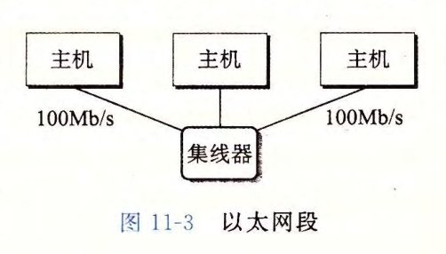
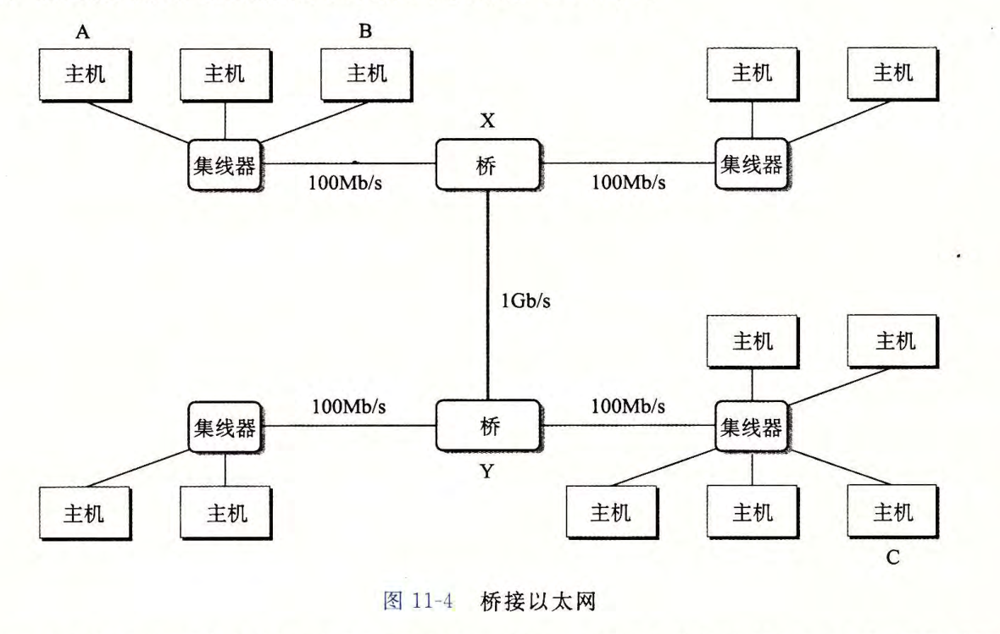
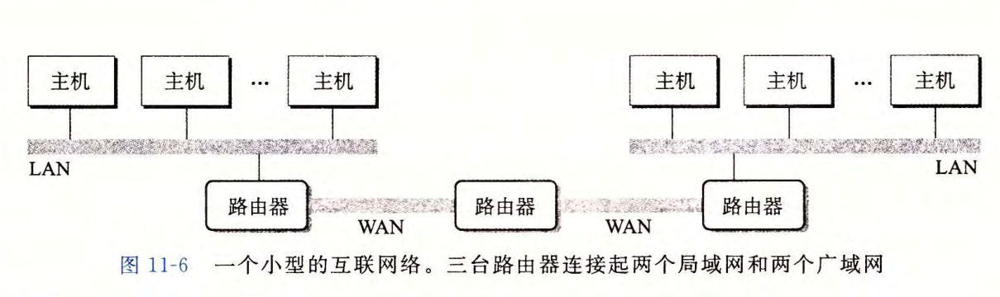
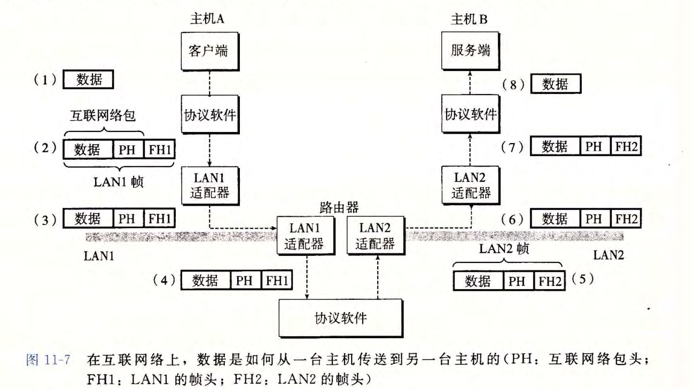

# 网络

对于主机而言，网络只不过是另一个 I/O 设备，是数据源和数据接收方。

一个插到 I/O 总线拓展槽的适配器提供了到网络的物理接口。**从网络上接受数据通过适配器在经过 I/O 总线和内存总监将数据复制给主存。**相反，数据也能从主存输出到网络

从物理硬件上来看，网络最底层是指 ”LAN(Local Area Network)“ 本地局域网。现今使用最广泛的技术是**以太网(Ethernet)**。

**以太网(Ethernet segment)** 是由一些电缆和一个叫集线器的小盒子组成的。一端连接主机的适配器，另一端连接到集线器的一个端口上。集线器会不加分辨的将接收的请求数据复制到其它所有的端口上。在以太网段内，主机会发送一个帧给其它所有的主机，这个帧的结构是固定的：

- 固定数量的头部，用来标识此帧的**源和目的地址**以及**帧长**
- 有效载荷

用**网桥（bridge）**可以将多个以太网段组成一个大的**局域网**，称为**桥接以太网(bridge Ethernet)**。

网桥会自动发现发送的数据包是否在同一段网段，如主机 A 发送数据给主机 B，当该帧到达网桥 X 时，它发现是在同一个网段会丢弃该帧，从而节省宽带。

再往上层，我们可以用**路由器**将多个不兼容（不同网段）的局域网连接起来，组成一个 internet。每台路由器对于它所连接的每个网络都有一个适配器。路由器也能连接高速点对点电话连接，称为“WAN(Wide-Area Network，广域网)”。

网段彼此不兼容的主机如何发送数据？

解决方案就是：一层运行在每台主机和路由器上的**协议软件**，它消除了不同网络之间的差异 。

这种协议必须提供两种能力：

- 命名机制。互联网通过**统一的主机地址格式**来消除这些差异
- 传输机制。通过定义一种把数据位捆绑成不连续的片（包）的统一方式来消除差异。包由**包头**和**有效载荷**组成。其中包头包含源地址、目标地址；而有效载荷就是要传输的数据位。

目前使用最多的就是 **TCP/IP 协议**。

如果将 WAN1 的主机 A 数据传输到 WAN2 的主机 B，那么发生的过程即：

首先有个概念，局域网帧由两个部分组成：**互联网络包 + 帧头**；

而互联网洛包由两个部分组成：**数据（有效载荷）和包头（包含源和目的地址）**

1. 主机 A 上的**客户端发起一个系统调用，从客户端 A 的虚拟地址空间复制数据到内核缓冲区**
2. 然后根据统一好的软件协议（即TCP/IP）将数据帧包装成统一的格式（统一数据格式以及命名格式）；即创建 WAN1 帧，该帧包含网络包和帧头。其中网络包的包头是寻址到 WAN2 的主机 B 的。然后 LAN1 帧头寻址到路由器。然后将该帧发送给适配器。
3. 路由器上的 WAN1 设配器接收（从电缆接收）该帧，并交由软件协议解析帧
4. 根据软件协议解析出来目的地址和有效载荷（数据），并用该目的地址作为路由表缓存起来并转发包到目的地址。**路由器剥落原来的 LAN1 的帧头，加上寻址 B 的新的 LAN2 帧头**。

TCP/IP 协议实际上是一个协议族，每一个都代表不同的功能。**IP 协议提供基本的命名方法和递送机制**，因为给其它客户端发送网络数据包的时候是不可靠的（可能会丢包，延时等）。UDP（Ureliable Datagram Protocol，不可靠数据报协议）就拓展了 IP 协议，包可以再进程间传输，而不是在主机间。

## Sockect