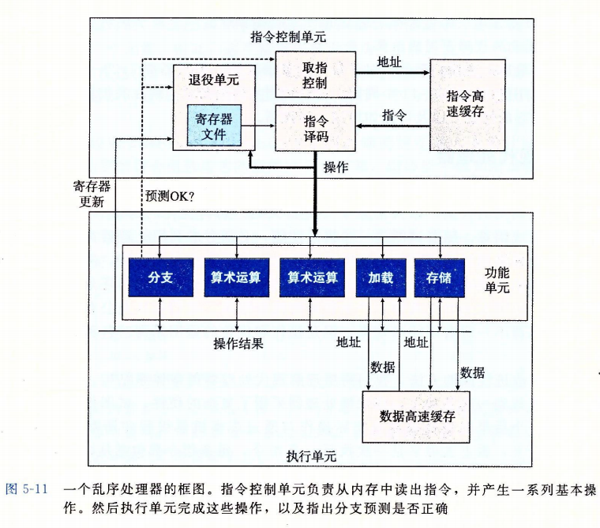

# 优化程序性能

程序优化的点一般从两个方面入手：

1. 选择一组适合的算法与数据结构
2. 我们必须要写出能够让编译器更加有效的优化，能转成高效可执行的代码。

我要编写对编译器友好的代码，能够让编译器更好的优化。所以我们得知道编译器优化的限制：

1. 内存别名使用（memory aliasing）：存在两个指令指向的内存地址相同。这对于编译器来说，在执行优化时就必须考虑假设两个指针可能会指向同一个内存地址，所以就不会执行优化。例如：

   ```c
   x = 1000; y = 3000;
   *q = y;
   *p = x;
   t1 = *q;
   ```

   t1 的计算指依赖于指针 p 和 q 是否指向同一个地址，如果相同 t1 等于 1000，不同 t1 等于 3000；这就给编译器造成了一个困扰，因为这会影响值的正确性，所以这就会限制编译器的优化策略。

2. 函数调用，考虑下面这个例子：

   ```c
   long f();
   long func1() {
   	return f() + f() + f() + f();
   }
   long func2() {
   	return 4 * f();
   }
   ```

   这很容易就让人觉得 func1 和 func2 的结果是一样的，并且 func2 性能更高，只调用了一次 func。但是编译器会这么优化么，如果 `f()` 函数是带有状态的函数，那么这种优化就给结果带来意外的错误，比如函数 `f()` 的内容是这样的：

   ```c
   int counter = 0;
   long f() {
   	return counter++;
   }
   ```

   所以编译器也会考虑到这种情况，从而不会选择优化像 func2 那样的函数。

   但是可以用内联函数来优化函数调用，就是将上面的 4 次函数调用，变成一个方法体：

   ```c
   long func1Inline() {
   	long t = counter++;
   	t += counter++;
   	t += counter++;
   	t += counter++;
   	return t;
   }
   ```

   这样的话，编译器就可能会优化成以下内容：

   ```c
   long func1opt() {
   	long t = 4 * counter + 6;
   	counter += 4;
   	return t;
   }
   ```

   ## 性能度量标准——每元素的周期数（CPE）

   每元素周期数（Cycles Per Element）。处理器活动的顺序是由时钟控制的，时钟提供某个频率的信号，通常用*千兆赫兹（GHz）*表示，即十亿周期每秒来表示。

   > 例如一个系统有 ”4GHz“ 处理器，说明这个处理器时钟运行频率为每秒 4 × 10^9 个周期
   >
   > 1纳秒 = 10^-9秒；1皮秒 = 10^-12秒；4GHz 的时钟周期为 0.25 纳秒，或者 250 皮秒。

## 消除循环的低效率

在做循环操作时，要注意一些导致重复计算的操作，消除这种重复计算的操作，在循环下的性能提升是很客观的。有时候编译器不会自动帮我们做优化，就像前面说的，编译器不知道我们循环调用的这个方法是不是有副作用的，并且有些分析能力超过了目前编译器的分析能力，所以程序员必须自己转换。看下面例子：

```c
void lower1(char* s) {
	long i;
	for (i = 0; i < strlen(s); i++)
	{
		if (s[i] >= 'A' && s[i] <= 'Z') {
			s[i] -= ('A' - 'a');
		}
	}
}

void lower_fast(char* s) {
	long i;
    long len = strlen(s);
	for (i = 0; i < len; i++)
	{
		if (s[i] >= 'A' && s[i] <= 'Z') {
			s[i] -= ('A' - 'a');
		}
	}
}
```

其中 `strleng(s)` 是计算字符串的长度，实现方式使用的遍历字符串。所以上面这段程序在循环的时候，每次都会计算 `strlen(s)`，所以时间复杂度是字符串长度 len 的平方。

就像前面说的，编译器分析的时候不知道这个方法 `strlen` 是不是有状态副作用的，所以不会选择自动缓存一个临时变量 `long len = strlen(s);` ，所以才需要自己做转换。

> 现在有些高级语言的编译器已经实现了这种自动转换的优化，如 C# JIT 就会检测到这种在循环中调用方法，会选择优化转换。

## 减少过程调用

过程调用会占用栈内存，会带来性能开销，还是阻碍编译器对程序的进一步的优化。特别是在循环体中，如果能减少其中的过程（方法）调用，那么就会节省空间和一些不必要的计算从而提升性能。比如看下面例子：

```c
void combine2(vec_ptr v, data_t* dest) {
	long i;
	long length = vec_length(v);
	*dest = IDENT;
	for (i = 0; i < length; i++)
	{
		data_t val;
		get_vec_element(v, i, &val);
		*dest = *dest OP val;
	}
}
int get_vec_element(vec_ptr v, long index, data_t* dest) {
	if (index < 0 || index >= v->len)	/* 做边界检查，带来了程序的安全性，但是作为代价，性能会有点损失 */
		return 0;
	*dest = v->data[index];
	return 1;
}
```

`combine2` 循环体中，每次都会调用 `get_vec_element` 来获取指定索引的元素，而在这个方法中还有对边界的检查，就像前面说的，这会增强程序的安全性，但是伴随而来的就是性能的损失。如果我们直接不要循环体中的这个过程调用，直接换成数组偏移量的操作，并且从代码场景来看，索引都是符合数组范围的，所以完全不需要增加边界检查。当然有人会质疑这种转换会降低代码可读性和维护性，但这就是性能优化的必经之路。优化如下：

```c
/* 直接访问数组结构 */
void combine3(vec_ptr v, data_t* dest) {
	long i;
	long length = vec_length(v);
	data_t* data = get_vec_start(v);
	*dest = IDENT;
	for (size_t i = 0; i < length; i++)
	{
		*dest = *dest OP data[i];
	}
}
```

## 消除不必要的内存引用

在方法 `combine3` 中，循环体中的赋值 `*dest = *dest OP data[i]`，观察这不的 x86-64 代码就可以得知这个合并计算实际上在每次迭代时，积累变量的数值都是要从内存读出再写入到内存的，这样的读写很浪费 CPU 资源，因为每次迭代开始时从 dest 得出的值就是上次迭代写入的值。

我们可以改写成下面的代码，用一个临时变量来存储迭代计算的值，最后再循环外做一次性赋值来减少不必要的内存独写操作：

```c
void combine4(vec_ptr v, data_t* dest) {
	long i;
	long length = vec_length(v);
	data_t* data = get_vec_start(v);
	data_t acc = IDENT;

	for (size_t i = 0; i < length; i++)
	{
		acc = acc OP data[i];
	}
	*dest = acc;
}
```

## 现代处理器

要想更好的提升程序的性能，必要理解处理器的工作原理，虽然构造一个处理器极为复杂。大量的晶体管被集成到一块很小的芯片上，现代微处理器采用了复杂的硬件，试图使程序性能最大化。所以我们要意识到，再代码级上，看上去处理器是一次执行一条指令，每条指令都是从寄存器或内存读取值，执行一个操作，并把结果回写到寄存器或内存中。实际上，处理器是同时对多条指令求值的，这个过程被称为*指令级并行*。所以在处理器上必须要用一种精密的机制来保证这些并行执行的指令导致的结果不会出错。

现在处理器一般有两种会最大化的影响性能：

1. 延迟界限（latency bound）：在下一条指令开始之前，这条指令必须结束。
2. 吞吐界限（throughput bound）：这就是 CPU 处理单元的最原始的计算能力，这个是程序性能的终极性能限制。

实际上处理器在每个时钟周期都是乱序执行多个指令的，它不要求指令顺序与机器级程序中的顺序一致。那么为什么最后执行的最后结果却不会错呢？

处理器整体设计有两个部分：

1. 指令控制单元（Instruction Control Unit）：负责从内存中读出指令序列，并根据这些指令序列生成一组针对程序数据的基本操作。
2. 执行单元（Execution Unit）：执行 ICU 生成的这些基本操作。



由图中可以看出，不同的功能单元负责执行不同的操作，这些功能单元在构造处理器的时候就会以晶体管的形式添加进来，往后随着时间的推移，后续的微处理器能够添加越来越多的功能单元，就能组合更多的操作，提升了每个单元的性能。以Intel Core Haswell 为例，有 8 个功能单元，编号为 0~7：

0：整数运算、浮点乘、整数和浮点数除法、分支

1：整数运算、浮点加、整数乘、浮点乘

2：加载、地址计算

3：加载、地址计算

4：存储

5：整数运算

6：整数运算、分支

7：存储、地址计算。

那么如何在乱序指令中保证结果的正确性呢？

在 ICU 中，退役单元（retirement unit）记录正在进行的处理，并确保它遵循机器级程序的顺序语义。退役单元控制这些寄存器的更新。一旦指令的操作完成，并且所有引起这条指令的分支点都要确认为预测正确的，那么这条指令才能退役（retired）。所有对程序寄存器的更新都可以被实际执行了。如果发生错误（预测错误），这条指令就会被清空（flushed），不会改变程序当前的状态。

所以退役单元的作用就是保证这条指令的所有分支都预测对了，并且都执行了才会改变程序寄存器状态。

## 循环展开

循环展开其实就是一种减少循环次数，但增加计算元素数量的一种程式变换。比如数组求和，一次计算两个数之和，那么循环次数就能减半：

```c
void sum(float a[], float p[], long n) {
	long i = 0;
	p[0] = a[0];
	for(i = 1; i< n-1; i+=2) {
		float mid_val = p[i-1] + a[i];
		p[i] = mid_val;
		a[i+1] = mid_val + a[i+1];
	}
	if( i < n) {
		p[i] = p[i-1] + a[i];
	}
}
```

循环展开优化两个方面的性能：

1. 减少了对程序结果关系不大的操作的数量，如循环索引计算和条件分支
2. 提供了一些方法，进一步变化代码，减少整个计算中关键路径上的操作数量。

## 提高并行性

我们还可以通过将一组合并运算分割成两个或更多的部分，并最后在合并结果来提高性能。比如计算一组数组的和，那么在循环时，我们可以在循环中计算两组，一种是奇数之和，另一种是偶数之和。最后合并结果。

```c
void combine6(vec_ptr v, data_t* dest) {
	long i = 0;
	long length = vec_length(v);
	long limit = length - 1;
	data_t* data = get_vec_start(v);
	data_t acc0 = IDENT;
	data_t acc1 = IDENT;

	for (i = 0; i < limit; i+2)
	{
		acc0 = acc0 OP data[i];
		acc1 = acc1 OP data[i + 1];
	}
	// 剩下的
	for (; i < length; i++)
	{
		acc0 = acc0 OP data[i];
	}
	*dest = acc0 OP acc1;
}
```

这里不仅用到了函数展开，还用到了两路并行。

往更进一步还有优化，就是运算的结合律，计算运算时改变计算的顺序，这样在编译器内部会对某些指令操作进行重排序、优化和抽象来减少操作次数。