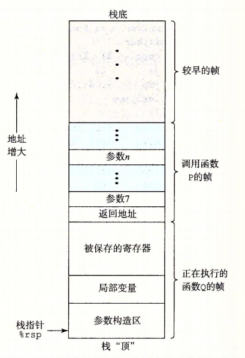

# 运行栈

过程是软件中一种很重要的抽象。它是代码的封装，它用一组入参和一个可选的返回治实现了某种功能。不同的语言，过程的形式多样化：函数、方法、子例程（subroutine）、处理函数等等。但是它们都有一些共性：

- 传递控制。再进入过程 Q 的时候，程序计数器必须设置为 Q 的代码的起始位置，然后在返回时，要把程序计数器设置成 Q 的代码结束位置的后面指令的地址。
- 传递数据。P 必须能够向 Q 提供一个或多个参数，Q 必须能够向 P 返回一个值
- 分配和释放内存。Q 可能需要为局部变量分配空间，在返回前，要释放这些空间。

用一句话描述就是，过程的实现就是先描述控制，再描述数据传递，最后是内存管理。

过程的调用机制是用了 “栈” 这种数据结构进行内存管理的，因为调用过程就是 “先进后出” 的过程。再过程 P 调用过程 Q 的例子中，可以看到当 Q 再执行时，P 以及所有向上追溯到 P 的调用链的过程都是暂时被挂起的。当 P 调用 Q 时，控制和数据信息添加到栈尾。当 P 返回时，这些信息都会被释放。

当过程需要的空间超过了寄存器能够存放的大小时，就会被分配到栈空间上。这个部分称为过程的栈帧（stack fram）。

​												(图引用自《深入理解计算机系统》)

正在运行的过程总是再栈顶。当 P 调用 Q 时，会把返回地址压入栈中，表示当 Q 返回时，要从 P 的哪个位置继续往下执行。