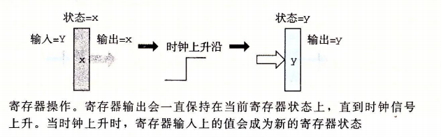

# 处理器体系架构

处理器必须执行一系列的指令，每条指令都行某个简单操作，比如两数相加。**指令被编码为由一个或多个字节序列组成的二进制格式**。一个处理器支持的指令和指令的字节级编码就称为它的指令集体系结构（Instruction-Set Architecture，ISA）。不同的处理器厂家，都有不同的 ISA。

一个程序在一个机器上运行，就不能在另一种机器上运行。随着科技不断的发展，处理器也会不断升级，复杂性也会相应提高，即使如此处理器的升级还是会跟不同的型号的 ISA 保持兼容的。这是因为 ISA 在编译器编写者和处理器设计人员之间提供了一个概念抽象层，即编译器编写者只需要知道允许哪些指令运行，以及它们是如何编码的；反过来处理器设计者只要设计出执行这些指令的处理器即可。

**流水线化的处理器（pipelined processor）在执行指令整个过程被分为 5 个步骤，每个步骤都由一个独立的硬件部分或阶段（stage）来处理。指令步经流水线的各个阶段，且每个时间周期都有一个指令进入流水线。**所以处理器能同时执行 5 个不同解决的指令。但是为了保持原有的指令集顺序，就要求处理很多冒险或冲突（hazard）情况，冒险指的是一条指令的位置或操作数依赖于其它仍在流水线中的指令。

## 指令集体系结构

顶一个指令集体系结构包括定义各种**状态单元、指令集和它们的编码、一组编程规范和异常事件处理。**

内存方面使用**虚拟地址**来引用内存位置。这是**用硬件和操作系统软件联合起来讲虚拟地址翻译成物理地址**，来指明实际内存中哪个地方。

指令编码：每条指令需要 1~10 个字节不等。第一条字节表明指令的类型，这个字节分为两部分：

1. 高 4 位是代码部分。代码值为：0~0xB。
2. 低 4 位是功能部分。只有一组相关指令公用一个代码时才有用

​														图引用自《深入理解计算机系统》

指令集的一个重要性质：**字节编码必须有唯一的解释。任意一个字节序列要么时唯一的指令序列的编码，要么就不是一个合法的字节序列。给定了这个字节，我们就可以决定所有其它附加字节的长度和含义。这个性质保证了处理器可以无二异的处理目标代码程序。**

举个例子：十六进制表示指令 rmmovq %rsp, 0x123456789abcd(%rdx) 的字节编码。

首先从上面的指令集的图就能看出类型指令 rmmovq 第一个字节为 40。源寄存器 %rsp 在 rA 位置上，而目标地址（基址寄存器）%rdx 在 rB 字段中。所以我们也可以得知寄存器指示符字节为 42。最后偏移量编码放在 8 字节的常数中。即在 0x123456789abcd 前面填充 0 使之满足 8 个字节，变成字节序列 00 01 23 45 67 89 ab cd。写成按字节反序就是 cd ab 89 67 45 23 01 00。将它们连接起来就能得到最终的指令的编码 4042cdab896745230100。

异常代码值表示：

| 代码值 | 名字 |         含义         |
| :----: | :--: | :------------------: |
|   1    | AOK  |       正常操作       |
|   2    | HLT  | 遇到器执行 halt 指令 |
|   3    | ADR  |     遇到非法地址     |
|   4    | INS  |     遇到非法指令     |

处理器在遇到异常时通常会调用一个异常处理i程序，这个过程被指定用来处理遇到的某种类型的异常。

## 组合电路

将很多的逻辑门组合成一个网，就能构建计算块（computational block），称为组合电路（combinational circuits）。构建组合电路有以下一些限制：

- 每个逻辑门的输入必须连接到下述选项之一：
  - 一个系统输入（又叫主输入）
  - 某个存储单元的输出
  - 某个逻辑门的输出
- 两个或多个逻辑门的输出不能连接在一起。否则它们就可能会使线上信号矛盾，可能会导致一个不合法的电压或电路故障
- 这个网必须是无环的。即网中不能有路径经过一系列的门而形成一个回路，这样的回路会导致该网络计算的函数有歧义。

组合电路从本质上讲，是不存储任何信息的。只是响应输入信号，产生等于输入的某个函数的输出。

为了产生**时序电路**（sequential circuit），也就是有状态且在这个状态上进行计算的系统，必须要引入按位存储信息的设备。存储设备都是由同一个**时钟**，**时钟是一个周期性信号，决定什么时候把新值加载到设备中**。主要由两类存储器设备：

- 时钟寄存器（简称寄存器）存储单个位或字。时钟周期控制寄存器加载输入值
- 随机访问存储器（简称内存）存储多个字，用地址来选择读还是写哪个字。随机访问存储器的例子包括：1) 处理器的虚拟内存地址，硬件和软件操作系统结合起来使处理可以在一个很大的地址空间内访问任意的字；2) 寄存器文件，寄存器标识符作为地址（%rax~%r14）。

这里的寄存器在硬件和机器级编程时有两个含义，对于硬件，硬件寄存器是**直接将它的输入和输出线连接到电路的其它部分**。而对于机器级编程中，寄存器代表的是 CPU 可寻址的字。

硬件寄存器作为电路不同部分中的组合逻辑之间的屏障，每当每个时钟到达上升时，值就会从寄存器的输入传送到输出。

> 大多数硬件寄存器都是稳定状态，产生的输出就等于当前的状态。信号沿着寄存器前面的组合逻辑传播，这时就会产生一个新的寄存器输入，但是只要这个时候时钟时**低电位**的，寄存器的输出就保持不变，一旦时钟变成高电位的时候，输入信号就会加载到寄存器中）

寄存器文件由两个读端口，一个写端口。这样一个多端口随机访问存储器允许同时进行多个读或写操作。

向寄存器文件写入字是由时钟信号控制的。