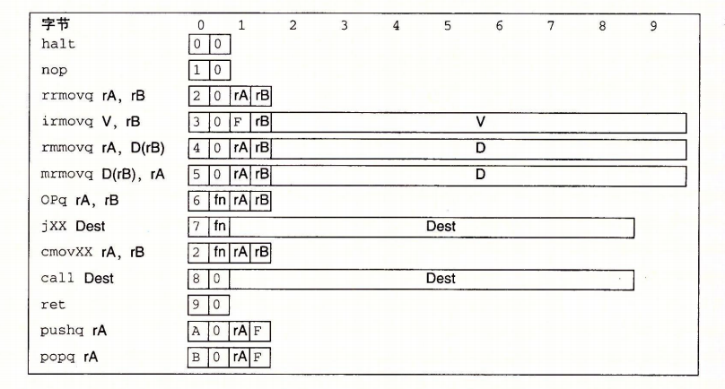
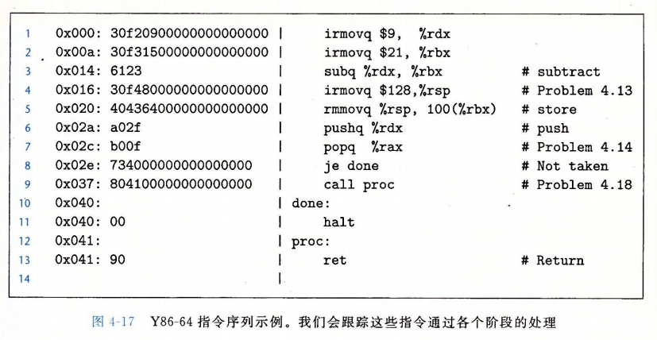
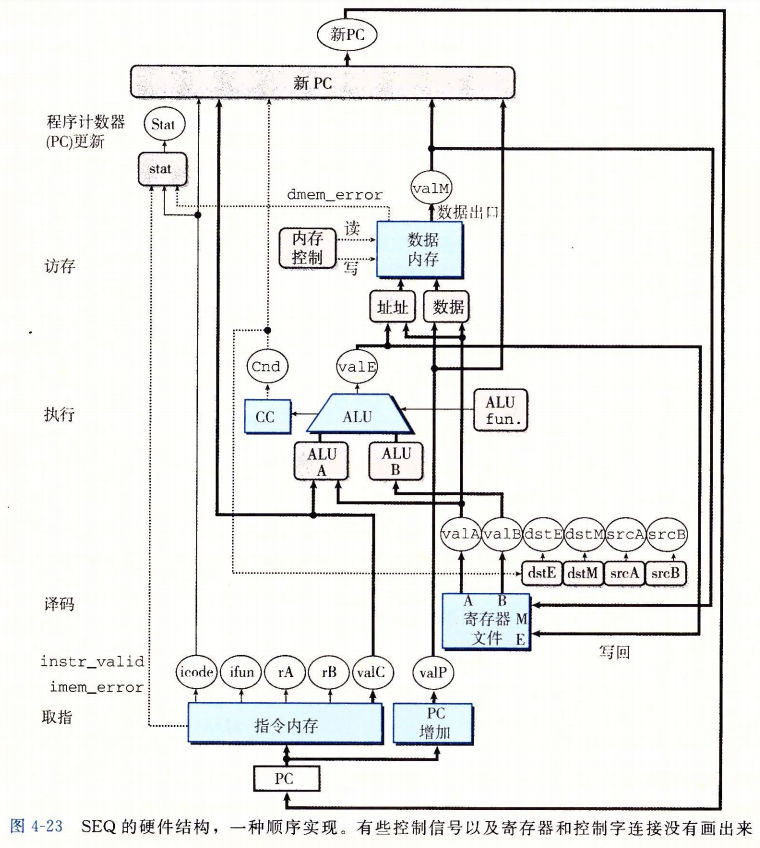
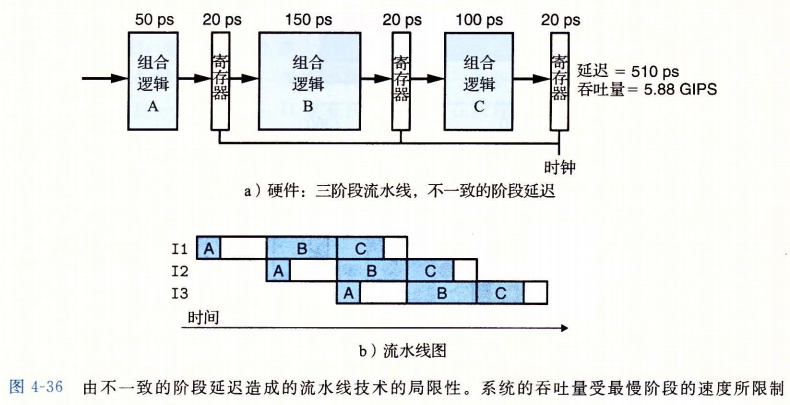

# 处理器体系架构

处理器必须执行一系列的指令，每条指令都行某个简单操作，比如两数相加。**指令被编码为由一个或多个字节序列组成的二进制格式**。一个处理器支持的指令和指令的字节级编码就称为它的指令集体系结构（Instruction-Set Architecture，ISA）。不同的处理器厂家，都有不同的 ISA。

一个程序在一个机器上运行，就不能在另一种机器上运行。随着科技不断的发展，处理器也会不断升级，复杂性也会相应提高，即使如此处理器的升级还是会跟不同的型号的 ISA 保持兼容的。这是因为 ISA 在编译器编写者和处理器设计人员之间提供了一个概念抽象层，即编译器编写者只需要知道允许哪些指令运行，以及它们是如何编码的；反过来处理器设计者只要设计出执行这些指令的处理器即可。

**流水线化的处理器（pipelined processor）在执行指令整个过程被分为 5 个步骤，每个步骤都由一个独立的硬件部分或阶段（stage）来处理。指令步经流水线的各个阶段，且每个时间周期都有一个指令进入流水线。**所以处理器能同时执行 5 个不同解决的指令。但是为了保持原有的指令集顺序，就要求处理很多冒险或冲突（hazard）情况，冒险指的是一条指令的位置或操作数依赖于其它仍在流水线中的指令。

## 指令集体系结构

顶一个指令集体系结构包括定义各种**状态单元、指令集和它们的编码、一组编程规范和异常事件处理。**

内存方面使用**虚拟地址**来引用内存位置。这是**用硬件和操作系统软件联合起来讲虚拟地址翻译成物理地址**，来指明实际内存中哪个地方。

指令编码：每条指令需要 1~10 个字节不等。第一条字节表明指令的类型，这个字节分为两部分：

1. 高 4 位是代码部分。代码值为：0~0xB。
2. 低 4 位是功能部分。只有一组相关指令公用一个代码时才有用

​														图引用自《深入理解计算机系统》

指令集的一个重要性质：**字节编码必须有唯一的解释。任意一个字节序列要么是唯一的指令序列的编码，要么就不是一个合法的字节序列。给定了这个字节，我们就可以决定所有其它附加字节的长度和含义。这个性质保证了处理器可以无二异的处理目标代码程序。**

举个例子：十六进制表示指令 rmmovq %rsp, 0x123456789abcd(%rdx) 的字节编码。

首先从上面的指令集的图就能看出类型指令 rmmovq 第一个字节为 40。源寄存器 %rsp 在 rA 位置上，而目标地址（基址寄存器）%rdx 在 rB 字段中。所以我们也可以得知寄存器指示符字节为 42。最后偏移量编码放在 8 字节的常数中。即在 0x123456789abcd 前面填充 0 使之满足 8 个字节，变成字节序列 00 01 23 45 67 89 ab cd。写成按字节反序就是 cd ab 89 67 45 23 01 00。将它们连接起来就能得到最终的指令的编码 4042cdab896745230100。

异常代码值表示：

| 代码值 | 名字 |         含义         |
| :----: | :--: | :------------------: |
|   1    | AOK  |       正常操作       |
|   2    | HLT  | 遇到器执行 halt 指令 |
|   3    | ADR  |     遇到非法地址     |
|   4    | INS  |     遇到非法指令     |

处理器在遇到异常时通常会调用一个异常处理i程序，这个过程被指定用来处理遇到的某种类型的异常。

## 组合电路

将很多的逻辑门组合成一个网，就能构建计算块（computational block），称为组合电路（combinational circuits）。构建组合电路有以下一些限制：

- 每个逻辑门的输入必须连接到下述选项之一：
  - 一个系统输入（又叫主输入）
  - 某个存储单元的输出
  - 某个逻辑门的输出
- 两个或多个逻辑门的输出不能连接在一起。否则它们就可能会使线上信号矛盾，可能会导致一个不合法的电压或电路故障
- 这个网必须是无环的。即网中不能有路径经过一系列的门而形成一个回路，这样的回路会导致该网络计算的函数有歧义。

组合电路从本质上讲，是不存储任何信息的。只是响应输入信号，产生等于输入的某个函数的输出。

为了产生**时序电路**（sequential circuit），也就是有状态且在这个状态上进行计算的系统，必须要引入按位存储信息的设备。存储设备都是由同一个**时钟**，**时钟是一个周期性信号，决定什么时候把新值加载到设备中**。主要由两类存储器设备：

- 时钟寄存器（简称寄存器）存储单个位或字。时钟周期控制寄存器加载输入值（**程序计数器、条件码寄存器**）
- 随机访问存储器（简称内存）存储多个字，用地址来选择读还是写哪个字。随机访问存储器的例子包括：1) 处理器的虚拟内存地址，硬件和软件操作系统结合起来使处理可以在一个很大的地址空间内访问任意的字；2) 寄存器文件，寄存器标识符作为地址（%rax~%r14）。（**寄存器文件，数据内存，指令内存**）

这里的寄存器在硬件和机器级编程时有两个含义，对于硬件，硬件寄存器是**直接将它的输入和输出线连接到电路的其它部分**。而对于机器级编程中，寄存器代表的是 CPU 可寻址的字。

硬件寄存器作为电路不同部分中的组合逻辑之间的屏障，每当每个时钟到达上升时，值就会从寄存器的输入传送到输出。

> 大多数硬件寄存器都是稳定状态，产生的输出就等于当前的状态。信号沿着寄存器前面的组合逻辑传播，这时就会产生一个新的寄存器输入，但是只要这个时候时钟是**低电位**的，寄存器的输出就保持不变，一旦时钟变成高电位的时候，输入信号就会加载到寄存器中，寄存器输出的值就变成了最新的值）

寄存器文件由两个读端口，一个写端口。这样一个多端口随机访问存储器允许同时进行多个读或写操作。

向寄存器文件写入字是由时钟信号控制的。寄存器文件既可以读也可以写，那么如果我们尝试对一个寄存器文件同时读写呢？

如果更新一个寄存器，同时在读端口上用同一个寄存器ID，我们会看到从一个旧值变新值的过程。

## 指令顺序执行过程

处理一条指令通常需要很多步骤，将它们组织成统一的执行序列，即使指令之间的差异很大，但是都遵循这个统一的序列。序列主要分为以下几个阶段：

- 取指（fetch）：取指阶段从内存读取指令字节，地址为程序计数器（PC）的值。从指令中抽取出来的指令指示符字节的两个四位部分，称为 icode（指令代码）和 ifun（指令功能）。
- 译码（decode）：从寄存器文件读入最多两个操作数，得到的值通常称为 ”valA，valB“。
- 执行（execute）：在此阶段，算术/逻辑单元（ALU）要么执行指令知名的操作（根据 ifun 的值），计算内存引用的地址，那么增加或减少指针地址。在这个阶段得到的值被称为 ”valE“，此阶段也可是设置条件码，控制是否跳转，选择运行代码分支。
- 访存（memory）：写入数据到内存，或在内存中读出数据为 valM。
- 写回（write back）：此阶段最多可以写两个结果到寄存器文件。
- 更新PC：将程序计数器设置成下一个指令的地址。

处理器会不断循环上面这六个阶段。执行指令的过程包括很多处理步骤，不仅要执行指令的操作，还要计算地址、更新栈指针地址以及确定下一条指令的地址。

在执行阶段，判断跳转指令执行时，会产生一个**一位信号 Cnd**。在更新 PC 阶段，就会检查这个标志位，如果这个标志位为 1，就将 PC 设为 valC（跳转目标），如果为 0，就设为 valP（下一条指令地址）。

举个过程调用指令得六个阶段的过程：

第 9 行的 call proc 指令，从上图得知开始目标地址为 0x037。下一个指令是 0x040，这两个地址差能得知这里面有 9 个字节，组成了 `804100000000000000`，所以我们得知第一个字节内容为 `0x80`，第二个字节内容为 `0x041`(这个地址是由 `0x0000000000000041` 按字节反过来的形式) 。也就是目标调用地址。而后续过程调用结束，PC 就会 + 9 来释放空间，返回过程调用的下一个地址。具体 6 个执行阶段过程如下：

| 阶段   | call proc                                                 | call 0x41 |
| ------ | --------------------------------------------------------- | --------- |
| 取值   | icode: ifun ⬅ M1[PC]  valC ⬅ M8[PC+1] valP ⬅ PC + 9 |           |
| 译码   | valB ⬅ R[%rsp]                                            |           |
| 执行   | valE ⬅ valB + (- 8)                                       |           |
| 访存   | M8[valE] ⬅ valP                                           |           |
| 写回   | R[%rsp] ⬅ valE                                            |           |
| 更新PC | PC ⬅ valC                                                 |           |

注意：**其中的 Mx[address] 这个意思是说访问（读或写）内存位置 address 处的 x 个字节**

## SEQ 硬件结构

硬件单元与指令执行 6 大阶段的关联：

- 取值：将程序计数器寄存器作为地址，指令内存读取指令的字节。PC 增加器计算 valP，即增加了程序计数器。

- 译码：寄存器文件由两个读端口，A 和 B。从这两个端口同时读取寄存器值 valA 和 valB

- 执行：根据指令的类型，将算术/逻辑单元用于不同的目的。整数操作，执行指令指定的运算。其它指令则会作为一个加法器来计算增加或减少栈指针，或者计算有效地址，或者只是简单的加 0，将一个输入变成输出。

  条件码寄存器比较特殊，有三个条件码位。ALU负责计算条件码的新值。当执行**条件传送指令**时，根据**条件码**和**传送条件**来计算决定是否更新目标寄存器。同样，当执行一条**跳转指令**时，根据**条件码**和**跳转类型**来计算分支信号 Cnd。

- 访存：数据内存读出或写入内存字。指令和数据内存访问的都是相同的地址，但是用于不同的目的。

- 写回：寄存器文件有两个写端口，端口 E 是用来写 ALU 计算的值，端口 M 用来写从数据内存中读取的值。

- PC 更新：程序计数器从 valP 中选择新值，为**下一条指令的地址**；valC 调用指令或跳转指令指定的**目标地址**；valM，从内存读取的**返回地址**

SEQ 这种实现方法的缺点就是太慢了，它要求必须在一个时钟周期内要完成上面的 6 个阶段。如果处理一条 ret 指令，那么它就要执行**从指令内存读取指令，从寄存器文件中读出栈指针，ALU 将栈指针 +8，为了得到程序计数器的下一个值，还要从内存中读出返回地址**。

这种方式不能充份利用硬件单元，因为每个单元只能在整个时钟周期的一部分时间内才被使用。

## 流水线设计

流水线的原理就是车间工作一样，把整个流程拆分若干个小的但独立的流程，这样就能允许在同一时间操作不同的独立的部分流程。比如自助餐场景，从拿碗筷，到自主选菜，拿饮料，结账这几个流程，客户可以依次过来，在同一时刻已经拿了碗筷的客户就会到下一个阶段选菜，于此同时没有拿碗筷的就会拿碗筷并进入下一个流程。这样就不会像上面 SEQ 那种实现方式一样，在同一时刻等客户从拿碗筷开始一直到结账，才能轮到下一个客户，这样效率是很低的。

这样的设计有点就是明显提高了系统的吞吐量。吞吐量公式为：
$$
吞吐量 = \frac{1条指令}{(20+300)ps}\cdot\frac{1000ps}{1ns}\approx3.12GIPS(每秒千兆条指令);
其中 1ns = 10^{-9}s;1ps = 10^{-12}s
$$

由图可知，这三个组合逻辑最慢的是第二阶段 150 ps，所以加上寄存器加载时间一起延迟就是 170 ps，根据上面的公式代入进来就能得出吞吐量为 5.88 GIPS。这从另一方面也知道了由于不一致的阶段延迟造成的局限性，那么对于硬件设计者来说，将系统计算设计划分成一组相同延迟的阶段是一个挑战。