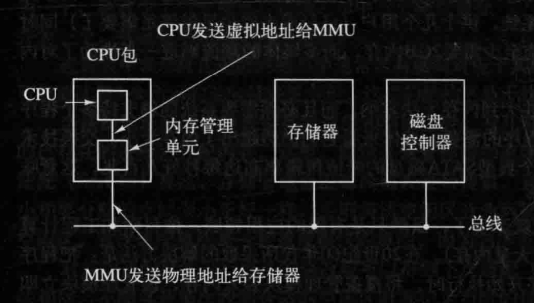
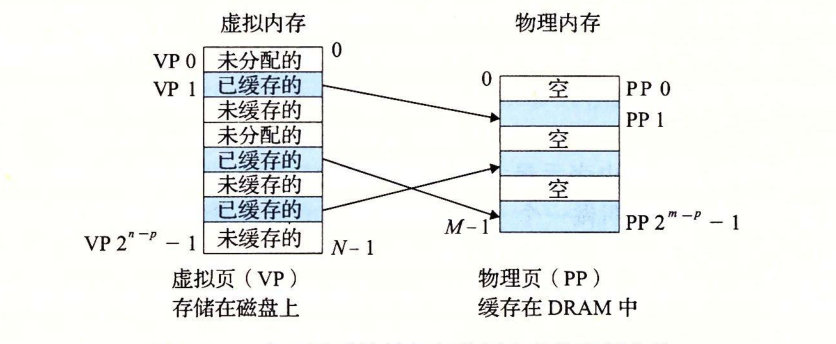
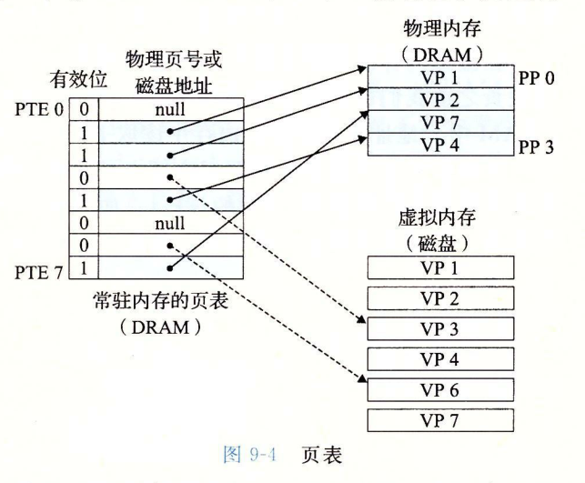
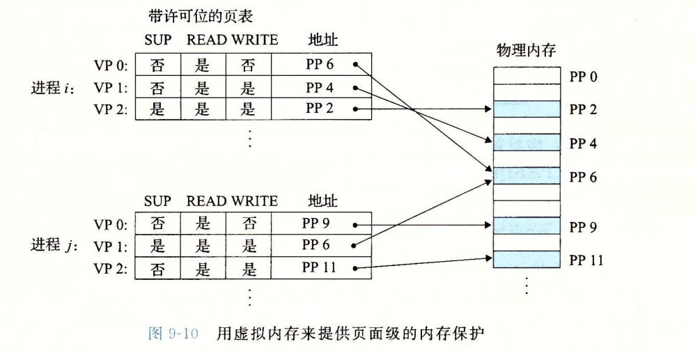

# 虚拟内存

## 背景

首先我们要带着疑问思考一下，为什么计算机系统会引入虚拟内存（VM）的概念？

首先要了解程序在刚开始的运行过程：在通过编译器一系列动作将源代码打包生成可执行文件后，装载器就要分析并读取这个可执行文件（PE/ELF），读取对应的指令和数据并加载到主存中。所以就必须得为这些指令和数据开辟一段连续的内存空间，好方便CPU一条条顺序的往下执行。我们把这个过程称为了“物理寻址”。物理寻址虽然简单直接，但是却有很明显的问题：

- 物理内存是有限的（很久之前物理内存很小），而要执行这些程序就必须将整个程序的内容加载进来，这样很容易导致内存不够用。
- 并且计算机是要并行执行多个进程的，但是由于每个进程都需要内存空间，很有可能这些地址已经被其他进程占用了，因此会导致很多意料之外的问题。

所以科学家就为解决这个问题引入了一个中间概念——虚拟内存，它是作为主存的一个抽象概念。

每个进程都有自己的虚拟内存以及进程之间的虚拟内存都是私密的，无法彼此访问。然后仅由虚拟内存通过**内存管理单元（MMU）**再映射（页表映射）到具体的物理内存。

为了充分提高内存利用率，为此还将虚拟内存按照固定的大小分成一段段内存段（segment）。但也带了内存碎片化的问题

> 关于内存碎片化：因为执行程序必须要开辟一段连续的内存空间，所以才会导致内存碎片的问题。如一个内存整段是500M，A程序分配了100M，B程序分配了150M，C程序分配150M，D程序分配100M。现在有A，C程序的空间回收，并要运行一个内存大小为200M的E程序。但由于这两段释放的内存段不是连续的，所以都没法给E程序分配内存，但实际上这个时候空闲的内存大小为250M。这就是内存碎片带来的内存浪费的问题的。

为了解决碎片化的问题，采取了内存交换（Swap）的方法来将这些碎片化的内存压缩成一段新的连续内存空间。其原理是，将E程序的指令和数据先分配到磁盘中，然后整理压缩现有的内存段，然后再将E程序从磁盘加载回内存中来。

从内存交换的过程来看，我们知道这是要与磁盘打交道的，磁盘运行速度非常慢，所以频繁使用内存交换那么性能上会大打折扣。所以我们要尽可能的减少内存交换发生。

为此内存页就是为了解决这个问题的，将整个虚拟内存分割成大小固定的内存页，并按照**按需调度页面**的方式动态地将每个程序所运行的相关的指令和数据加载到内存中，而不用像最开始说要把整个程序的指令和数据都加载进来。

> DRAM，SRAM，虚拟内存
>
> 这三者的关系很想我们平时用的多级缓存的概念。首先CPU执行指令是需要从主存中读取到寄存器执行的，虽然是这一句话，实际上整个过程用到了SRAM，DRAM，虚拟内存技术。CPU在执行指令是首先会从SRAM查看是否已经缓存好了，如果好了直接从SRAM（L1、L2、L3）中获取，如果高速缓存中没有就会走DRAM，如果DRAM页没有就会往下虚拟内存继续找。这个虚拟内存如果是已分配的，那么就会根据映射表直接寻址到物理内存。如果是未分配的就会触发缺页中断处理程序通知进程进入到操作系统内存，选择一个牺牲页，在磁盘中寻址到对应的内容替换至牺牲页。

## 映射细节

进程与进程之间是共享 CPU 以及主存资源的。**运行的进程太多，会因为占据的内存太多（也有可能也是 CPU 不堪重负）导致其中一些进程无法运行，特别是不同的进程可能存在会修改另一个进程的内存，这样会导致意想不到的严重的后果。**

这个时候虚拟内存就起到了至关重要的作用了，它能很好的管理内存并且少出错。是主存的一种抽象概念。

虚拟内存还是硬件异常、硬件地址翻译、主存、磁盘文件和内核软件的完美交互。它给每个进程都分配一个大且私有的地址空间，这样互不干扰，减少出错的可能性。

它主要提供三个能力：

1. 它将主存看成是一个存储在磁盘上的地址空间的高速缓存，主存只保留活动区域，根据需要把数据在磁盘和主存之间来回传输。
2. 它为每个进程提供了一致的地址空间，简化了内存管理。进而简化了链接、在进程间共享数据、进程的内存分配以及程序加载。
3. 它保护了每个进程的地址空间不被其他进程破坏。它是通过在每条页面条目中加入保护为，从而简化了内存保护。

虚拟内存几乎遍及了计算机所有层面，可以创建和销毁内存片（chunk）、**将内存片映射到具体的磁盘文件的某个部分**，以及和其他进程共享内存。

在以前都是用的“物理寻址”的方式来传输数据的，CPU 运行加载指令时会生成一个物理地址，通过内存总线传输给主存，主存根据物理地址取出对应的值返回给 CPU，CPU 将值存储到寄存器上。

后来后于运行的数据越来越多，物理内存又是有限的，所以现有的物理内存规格已经完全不满足现有需要了，所以“虚拟内存寻址”的方式出现了。

虚拟内存是通过虚拟地址访问内存，**通过地址翻译硬件根据物理内存中的页面查询映射出真是的物理地址**，然后再将对应的数据返回给 CPU 指寄存器上。

这里还要熟悉几个专有名词：

- VP：VM 系统通过将虚拟内存分割固定尺寸的块称为虚拟页（Virtual Page，VP）
- PP：物理内存被分割固定尺寸的块就被称为物理页（Physical Page，PP），物理页也被称为“页帧”。

虚拟页面总过包括三种状态：

1. 未分配：VM 系统还未分配的页，这不占用任何磁盘空间
2. 缓存的：当前已缓存再物理内存（主存）中的虚拟页
3. 未缓存的：已分配的页但是没有缓存到物理内存上

例如上图就可以知道，VP 1 是已缓存的，因为在物理内存中的 PP1 中有 VP1。VP0、VP3 等是未分配的，VP2 等是未缓存的。

一般我们通过 DRAM 缓存来描述虚拟内存系统的缓存，SRAM 缓存是 CPU 与主存（L1，L2，L3 ）之间的高速缓存。

## 如何判断物理内存是否已经存在了虚拟内存

那么虚拟内存系统一定是要有某种方法能得知一个虚拟页是否已经缓存到物理内存上的。

就像前面提到的，内存管理单元中的地址翻译硬件根据物理内存中的页面来查询是否缓存在物理内存的。具体如何知道的呢？

首先要了解的是页面是个怎样的数据结构：

页表就是一个页表条目（Page Tabel Entry，PTE）的数组，每个 PTE 都由一个**有效位**和磁盘地址组成的。其中有效位 0 代表未缓存，1 代表已缓存。

**如果通过页表能查询到对应的物理内存，这就代表页命中。例如 CPU 想读取 VP2 的虚拟内存中的数据，那么这时候地址翻译硬件就会通过页面查询每个页表条目，发现 PTE2 能成功映射对应的物理地址（有效位也为 1）。**

**如果没有查询到对应的物理地址，说明就是缺页（如上图查找的 VP3）。缺页会造成不小的性能损失，会触发一个缺页异常中断信号，内核接受到这个信号找到对应的缺页异常处理程序来处理缺页，该程序会在物理内存中按照一定的算法选择出要替代的页，这被称为“牺牲页”，这个例子选择了 PP3，如果 PP3 中的 VP4 发生了更改，则会将 VP4 回写至磁盘。然后内核会继续将 VP3 从磁盘复制到物理内存的 PP3 中，然后更新对应的页面 PTE3。最后当异常处理程序返回时，重新启动导致缺页的指令，这时该 VP3 已经成功缓存到物理内存，所以会正常处理。**

缺页的这一过程看似是非常损耗性能的，其实由于内存的局部性，它保证了在任意时刻，程序将趋向于在一个较小的活动页面集合上工作，这个集合被称为工作集。初始开销，也就是将工作集页面调度到内存之后，接下来就是对这个工作集的引用的操作，不会产生额外的磁盘 IO。

## 虚拟内存是如何保护进程内存的

前面我们已经知道地址翻译硬件在解析的过程中会读取一个 PTE，那么从这个 PTE 上额外分配位来表示对应的权限，来控制一个虚拟页面内容的访问。其结构如下

SUP 表示进程是否必须运行在内核模式下才能访问该页面

READ 表示页面读权限

WRITE 表示页面写权限

现在操作系统通过将虚拟内存片和磁盘上的文件片关联起来，来初始化虚拟内存片，这个过程称为**内存映射**。内存映射为共享数据、创建新的进程以及加载程序提供了一种高效的机制。