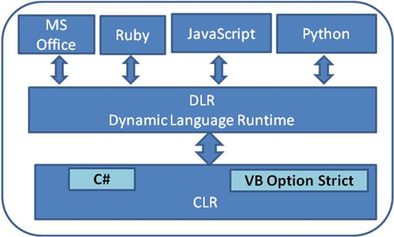

# 一文带你了解 C# DLR 的世界

很在就之前，我写了一片文章[dynamic结合匿名类型 匿名对象传参](https://www.cnblogs.com/ms27946/p/4976330.html)，里面我以为DLR内部是用反射实现的。因为那时候是心中想当然的认为只有反射能够在运行时解析对象的成员信息并调用成员方法。后来也是因为其他的事一直都没有回过头来把这一节知识给补上，正所谓亡羊补牢，让我们现在来大致了解一下DLR吧。

DLR 全称是 Dynamic Language Runtime（动态语言运行时）。这很容易让我们想到同在C#中还有一个叫 CLR 的东西，它叫 Common Language Runtime。那这两者有什么关系呢？这个后续再说

DLR 是 C#4.0 新引进来的概念，其主要目的就是为了**动态绑定与交互**。

# C#关键字 dynamic

DLR 首先定义了一个核心类型概念，即动态类型。即在运行时确定的类型，动态类型的成员信息、方法等都只在运行时进行绑定。与CLR的静态类型相反，静态类型都是在C#编译期间通过一系列的规则匹配到最后的绑定。

将这种动态进行绑定的过程它有点类似反射，但其内部却和反射有很大的不同。这个稍微会谈到。

由动态类型构成的对象叫动态对象。

DLR一般有下列特点：

1. 把CLR的所有类型全部隐式转成`dynamic`。如`dynamic x = GetReturnAnyCLRType()`
2. 同样，dynamic几乎也可以转换成CLR类型。
3. 所有含有动态类型的表达式都是在运行期进行动态计算的。

DLR发展到现在，我们几乎都使用了动态类型关键字 `dynamic`以及还有引用DLR的类库 Dapper等。

在我们不想创建新的静态类做DTO映射时，我们第一时间会想到动态类型。也经常性的将dynamic作为参数使用。

这时候我们就要注意一些 dynamic 不为大多人知的一些细节了。

**不是只要含有 dynamic 的表达式都是动态的。**

什么意思呢，且看这段代码`dynamic x = "marson shine";`。这句代码很简单，就是将字符串赋值给动态类型 x。

大家不要以为这就是动态类型了哦，其实不是，如果单单只是这一句的话，C#编译器在编译期间是会把变量 x 转变成静态类型 object 的，等价于`object x = "marson shine";`。可能有些人会惊讶，为什么C#编译器最后会生成object类型的代码。这就是接下来我们要注意的。

**dynamic 于 object 的不可告人的关系**

其实如果你是以 dynamic 类型为参数，那么实际上它就是等于 object 类型的。换句话说，dynamic在CLR级别就是object。其实这点不用记，我们从编译器生成的C#代码就知道了。

> 这里我用的是dotpeek查看编译器生成的c#代码。
>
> 这里顺便想问下各位，有没有mac下c#反编译的工具。求推荐

所以我们在写重载方法时，是不能以 object 和 dynamic 来区分的。

```c#
void DynamicMethod(object o);
void DynamicMethod(dynamic d);	// error 编译器无法通过编译:已经存在同名同形参的方法
```

如果说 dynamic 与 object 一样，那么它与 DLR 又有什么关系呢？

其实微软提供这么一个关键字，我认为是方便提供创建动态类型的快捷方式。而真正于动态类型密切相关的是命名空间`System.Dynamic`下的类型。主要核心类`DynamicObject,ExpandoObject,IDynamicMetaObjectProvider` ，关于这三个类我们这节先不谈。

# DLR探秘

首先我们来大致了解C#4.0加入的重要功能 DLR，在编译器中处于什么层次结构。

在这里我引用 https://www.codeproject.com/Articles/42997/NET-4-0-FAQ-Part-1-The-DLR 这片文章的一副结构图的意思



```
动态编程 = CLR + DLR
```

这足以说明 DLR 在C#中的位置，虽然名字与CLR只有一个字母之差，但是它所处的层次其实是在CLR之上的。我们知道编译器将我们写的代码转换成IL，然后经由CLR转换成本地代码交由CPU执行可执行程序。那么实际上，**DLR 是在编译期间和运行期做了大量工作。最后还是会将C#代码转换成CLR静态语言，然后再经由 CLR 将代码转换成本地代码执行**（如调用函数等）。

现在我们来简要介绍一下DLR在编译期间做了什么。

到这里就不得不以例子来做说明了，我们就上面的例子稍加改造一下：

```c#
// program.cs
dynamic x = "marson shine";
string v = x.Substring(6);
Console.WriteLine(v);
```

为了节省篇幅，我简化并改写了难看的变量命名以及不必要的注释。生成的代码如下：

```c#
			object obj1 = (object) "marson shine";
      staticCallSite1 = staticCallSite1 ?? CallSite<Func<CallSite, object, int, object>>.Create(Binder.InvokeMember(CSharpBinderFlags.None, "Substring", (IEnumerable<Type>) null, typeof (Example), (IEnumerable<CSharpArgumentInfo>) new CSharpArgumentInfo[2]
      {
        CSharpArgumentInfo.Create(CSharpArgumentInfoFlags.None, (string) null),
        CSharpArgumentInfo.Create(CSharpArgumentInfoFlags.UseCompileTimeType | CSharpArgumentInfoFlags.Constant, (string) null)
      }));

      object obj2 = ((Func<CallSite, object, int, object>) staticCallSite1.Target)((CallSite) staticCallSite1, obj1, 6);
        staticCallSite2 = staticCallSite2 ?? CallSite<Action<CallSite, Type, object>>.Create(Binder.InvokeMember(CSharpBinderFlags.ResultDiscarded, "WriteLine", (IEnumerable<Type>) null, typeof (Example), (IEnumerable<CSharpArgumentInfo>) new CSharpArgumentInfo[2]
        {
          CSharpArgumentInfo.Create(CSharpArgumentInfoFlags.UseCompileTimeType | CSharpArgumentInfoFlags.IsStaticType, (string) null),
          CSharpArgumentInfo.Create(CSharpArgumentInfoFlags.None, (string) null)
        }));

      ((Action<CallSite, Type, object>) staticCallSite2.Target)((CallSite) staticCallSite2, typeof (Console), obj2);
```

上问的两个变量`staticCallSite1,staticCallSite2` 是静态变量，起到缓存的作用。

 这里涉及到了DLR核心三个概念

1. ExpressTree（表达式树）：通过CLR运行时用抽象语法树（AST）生成代码并执行。并且它也是用来与动态语言交互的主要工具（如Python，JavaScript 等）
2. CallSite（调用点）：当我们写的调用动态类型的方法，这就是一个调用点。这些调用都是静态函数，是能够缓存下来的，所以在后续的调用，如果发现是相同类型的调用，就会更快的运行。
3. Binder（绑定器）：除了调用点之外，系统还需要知道这些方法如何调用，就比如例子中的通过调用`Binder.InvokeMember`方法，以及是那些对象类型调用的方法等信息。绑定器也是可以缓存的

# 总结

DLR运行过程我们总结起来就是，在运行时DLR利用编译运行期间生成的**表达式树**、**调用点**、**绑定器**代码，以及缓存机制，我们就可以做到计算的重用来达到高性能。在很早前从老赵的[表达式树缓存系列](http://blog.zhaojie.me/2009/05/expression-cache-7-optimization.html)文章也指出了，利用表达式树缓存性能最接近直接调用（当然不包括IL编程）。

现在我们就知道了为什么DLR能干出与反射相同的效果，但是性能要远比反射要高的原因了。

# 补充说明

刚看到评论里的同学提到了reflection与dynamic的性能测试比较，发现反射性能占据明显的优势。事实上，从那个例子来看，恰恰说明了DLR的问题。这里我先列出他的测试代码

```c#
const int Num = 1000 * 100;
{
    var mi = typeof(XXX).GetMethod("Go");
    var go1 = new XXX();
    for (int i  = 0; i  < Num; i++)
    {
        mi.Invoke(go1, null);
    }
}
{
    dynamic go1 = new XXX();
    for (int i  = 0; i  < Num; i++)
    {
        go1.Go();
    }
}
```

在这个测试中，已经将反射出来的元数据信息缓存到局部变量 mi，所以在调用方法的时候，实际上用到的是已经缓存下来的 mi。那么在没有缓存优势的情况，说明DLR性能是不如 `MethodInfo+Invoke` 的。

其实在文章总结的时候也强调了，**利用缓存机制达到多次重复计算的重用**来提高性能

那么我们在看一个例子：

```c#
public void DynamicMethod(Foo f) {
    dynamic d = f;
    d.DoSomething();
}

public void ReflectionMethod(Foo f) {
    var m = typeof(Foo).GetMethod("DoSomething");
    m?.Invoke(f, null);
}
```

方法 DoSomething 只是一个空方法。现在我们来看执行结果

```c#
// 执行时间
var f = new Foo();
Stopwatch sw = new Stopwatch();
int n = 10000000;
sw.Start();
for (int i = 0; i < n; i++) {
    ReflectionMethod(f);
}
sw.Stop();
Console.WriteLine("ReflectionMethod: " + sw.ElapsedMilliseconds + " ms");

sw.Restart();
for (int i = 0; i < n; i++) {
    DynamicMethod(f);
}
sw.Stop();
Console.WriteLine("DynamicMethod: " + sw.ElapsedMilliseconds + " ms");

// 输出
ReflectionMethod: 1923 ms
DynamicMethod: 223 ms
```

这里我们就能明显看出执行时间的差距了。实际上DLR的执行过程我用下面伪代码表示

```c#
public void DynamicMethod(Foo f) {
    dynamic d = f;
    d.DoSomething();
}
// 以下是DLR会生成大概的代码
static DynamicCallSite fooCallSite;
public void ReflectionMethod(Foo f) {
    object d = f;
    if(fooCallSite == null) fooCallSite = new DynamicCallSite();
    fooCallSite.Invoke("Foo",d);
}
```

编译器在编译上述方法`DynamicMethod`时，会询问一次这个调用点调用的方法的类型是否是同一个，如果是则直接将已经准备好的调用点 fooCallSite 进行调用，否则则像文章之前说的，会生成调用点，绑定器绑定成员信息，根据AST将表达式生成表达式树，将这些都缓存下来。在进行计算（调用）。

正因为我们知道了DLR的一些内幕，所以我们自然也知道了注意该如何用 DLR，以及关键字 dynamic。比如我们现在知道了C#编译器会将 dynamic 等同 object 对待。那么我们在使用的时候一定要注意不要被“莫名其妙”的被装箱了，导致不必要的性能损失了。

至于 DLR 的应用，特别是结合动态语言进行编程，来达到静态语言动态编程的目的。其实DLR刚出来之际，就有了如 IronPython 这样的开源组件。这是另外一个话题，并且我们在做实际应用的情况也很少，所以就没有展开来讲了。

参数资料：

1. https://www.codeproject.com/Articles/42997/NET-4-0-FAQ-Part-1-The-DLR
2. 《深入理解C#》