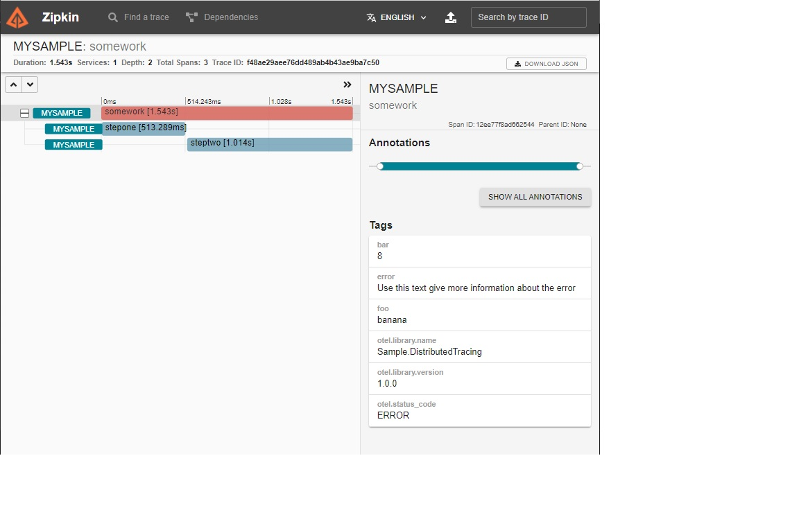

# 分布式追踪探测器

这篇文章适用于：✔️ .NET Core 2.1 及以后版本 ✔️ .NET Framework 4.5 及以后版本

.NET 应用程序可以使用 [System.Diagnostics.Activity](https://learn.microsoft.com/en-us/dotnet/api/system.diagnostics.activity) API 进行检测，以产生分布式跟踪遥测。一些工具化被内置到标准的 .NET 库中，但你可能想添加更多的工具，使你的代码更容易被诊断。在本教程中，你将添加新的自定义分布式追踪探测器。请参阅集合教程，了解更多关于记录该仪器产生的遥测数据的信息。

## 预备要求

.NET Core 2.1 SDK 或更高版本

## 创建初始化项目

首先，你将创建一个使用 OpenTelemetry 收集遥测数据的示例应用程序，但还没有任何仪器。

```
dotnet new console
```

针对 .NET 5 及以后版本的应用程序已经内置了必要的分布式跟踪 API。对于以较早的 .NET 版本为目标的应用程序，请添加 [System.Diagnostics.DiagnosticSource NuGet 包](https://www.nuget.org/packages/System.Diagnostics.DiagnosticSource/)，版本为 5 或更高。

```
dotnet add package System.Diagnostics.DiagnosticSource
```

添加 [OpenTelemetry](https://www.nuget.org/packages/OpenTelemetry/) 和 [OpenTelemetry.Exporter.Console NuGet 包](https://www.nuget.org/packages/OpenTelemetry.Exporter.Console/)，它们将被用来收集遥测数据。

```
dotnet add package OpenTelemetry
dotnet add package OpenTelemetry.Exporter.Console
```

用这个例子的源代码替换生成的 Program.cs 的内容：

```c#
using OpenTelemetry;
using OpenTelemetry.Resources;
using OpenTelemetry.Trace;
using System;
using System.Threading.Tasks;

namespace Sample.DistributedTracing
{
    class Program
    {
        static async Task Main(string[] args)
        {
            using var tracerProvider = Sdk.CreateTracerProviderBuilder()
                .SetResourceBuilder(ResourceBuilder.CreateDefault().AddService("MySample"))
                .AddSource("Sample.DistributedTracing")
                .AddConsoleExporter()
                .Build();

            await DoSomeWork("banana", 8);
            Console.WriteLine("Example work done");
        }

        // All the functions below simulate doing some arbitrary work
        static async Task DoSomeWork(string foo, int bar)
        {
            await StepOne();
            await StepTwo();
        }

        static async Task StepOne()
        {
            await Task.Delay(500);
        }

        static async Task StepTwo()
        {
            await Task.Delay(1000);
        }
    }
}
```

该应用程序还没有监测，所以没有显示跟踪信息：

```
> dotnet run
Example work done
```

### 最佳实践

只有应用程序开发人员需要引用一个可选的第三方库来收集分布式跟踪遥测数据，如本例中的 OpenTelemetry。.NET 库的作者可以完全依赖 System.Diagnostics.DiagnosticSource 中的API，它是 .NET 运行时的一部分。这确保了库可以在广泛的 .NET 应用中运行，而不管应用开发者对使用哪个库或供应商来收集遥测数据的偏好。

## 添加基本的探测

应用程序和库使用 [System.Diagnostics.ActivitySource](https://learn.microsoft.com/en-us/dotnet/api/system.diagnostics.activitysource) 和 [System.Diagnostics.Activity](https://learn.microsoft.com/en-us/dotnet/api/system.diagnostics.activity) 类添加分布式跟踪仪器。

### ActivitySource

首先创建一个 ActivitySource 的实例。ActivitySource 提供了创建和启动 Activity 对象的 API。在 Main() 上面添加静态 ActivitySource 变量，在 using 语句中添加 `using System.Diagnostics`。

```c#
using OpenTelemetry;
using OpenTelemetry.Resources;
using OpenTelemetry.Trace;
using System;
using System.Diagnostics;
using System.Threading.Tasks;

namespace Sample.DistributedTracing
{
    class Program
    {
        private static ActivitySource source = new ActivitySource("Sample.DistributedTracing", "1.0.0");

        static async Task Main(string[] args)
        {
            ...
```

### 最佳实践

- 创建一次 ActivitySource，将其存储在一个静态变量中，只要需要就可以使用该实例。每个库或库的子组件都可以（而且通常应该）创建自己的源。如果你预计应用程序开发人员会喜欢能够独立地启用和禁用源中的 Activity 遥测，请考虑创建一个新的源而不是重复使用现有的源。
- 传递给构造函数的源名称必须是唯一的，以避免与任何其他源冲突。如果在同一个程序集内有多个源，请使用一个包含程序集名称和可选组件名称的分层名称，例如， `Microsoft.AspNetCore.Hosting`。如果一个程序集正在为第二个独立的程序集中的代码添加仪器，那么该名称应该基于定义 ActivitySource 的程序集，而不是其代码被仪器化的程序集。
- 版本参数是可选的。我们建议你提供版本，以防你发布多个版本的库，并对被检测的遥测数据进行修改。

> 注意
>
> OpenTelemetry 使用 "Tracer" 和 "Span" 这两个交替术语。在 .NET 中，'ActivitySource' 是 Tracer 的实现，Activity 是 'Span' 的实现。.NET 的活动类型早于 OpenTelemetry 规范，为了在 .NET 生态系统中保持一致性和 .NET 应用程序的兼容性，原始的 .NET 命名被保留下来。

### Activity

使用 ActivitySource 对象来启动和停止围绕有意义的工作单位的活动对象。用这里的代码更新 DoSomeWork()：

```c#
static async Task DoSomeWork(string foo, int bar)
{
    using (Activity activity = source.StartActivity("SomeWork"))
    {
        await StepOne();
        await StepTwo();
    }
}
```

运行该应用程序现在显示正在记录的新活动：

```
> dotnet run
Activity.Id:          00-f443e487a4998c41a6fd6fe88bae644e-5b7253de08ed474f-01
Activity.DisplayName: SomeWork
Activity.Kind:        Internal
Activity.StartTime:   2021-03-18T10:36:51.4720202Z
Activity.Duration:    00:00:01.5025842
Resource associated with Activity:
    service.name: MySample
    service.instance.id: 067f4bb5-a5a8-4898-a288-dec569d6dbef
```

### 注意

- [ActivitySource.StartActivity](https://learn.microsoft.com/en-us/dotnet/api/system.diagnostics.activitysource.startactivity) 同时创建和启动活动。所列的代码模式是使用 using 块，它在执行该块后会自动处置创建的 Activity 对象。处置 Activity 对象将停止它，所以代码不需要明确地调用 [Activity.Stop()](https://learn.microsoft.com/en-us/dotnet/api/system.diagnostics.activity.stop#system-diagnostics-activity-stop)。这就简化了编码模式。
- [ActivitySource.StartActivity](https://learn.microsoft.com/en-us/dotnet/api/system.diagnostics.activitysource.startactivity) 在内部确定是否有任何监听器在记录该活动。如果没有注册的监听器或者有监听器不感兴趣，StartActivity() 将返回 null 并避免创建 Activity 对象。这是一种性能优化，以便代码模式仍可用于频繁调用的函数中。

## 选项：填充标签

活动支持名为 Tags 的键值对数据，通常用于存储任何可能对诊断有用的工作参数。更新 DoSomeWork() 以包括它们：

```c#
static async Task DoSomeWork(string foo, int bar)
{
    using (Activity activity = source.StartActivity("SomeWork"))
    {
        activity?.SetTag("foo", foo);
        activity?.SetTag("bar", bar);
        await StepOne();
        await StepTwo();
    }
}
```

```
> dotnet run
Activity.Id:          00-2b56072db8cb5a4496a4bfb69f46aa06-7bc4acda3b9cce4d-01
Activity.DisplayName: SomeWork
Activity.Kind:        Internal
Activity.StartTime:   2021-03-18T10:37:31.4949570Z
Activity.Duration:    00:00:01.5417719
Activity.TagObjects:
    foo: banana
    bar: 8
Resource associated with Activity:
    service.name: MySample
    service.instance.id: 25bbc1c3-2de5-48d9-9333-062377fea49c

Example work done
```

### 最佳实践

- 如上所述，由 [ActivitySource.StartActivity](https://learn.microsoft.com/en-us/dotnet/api/system.diagnostics.activitysource.startactivity) 返回的 activity 可能是空的。C# 中的 null-coalescing 操作符 `?.` 是一个方便的简写，只在 activity 不为 null 时调用 [Activity.SetTag](https://learn.microsoft.com/en-us/dotnet/api/system.diagnostics.activity.settag)。其行为与写法相同：

  ```c#
  if(activity != null)
  {
      activity.SetTag("foo", foo);
  }
  ```

- OpenTelemetry 提供了一套推荐的[惯例](https://github.com/open-telemetry/opentelemetry-specification/tree/main/specification/trace/semantic_conventions)，用于在代表常见类型的应用工作的 Activity 上设置 Tag。

- 如果你正在对有高性能要求的函数进行探测，[Activity.IsAllDataRequested](https://learn.microsoft.com/en-us/dotnet/api/system.diagnostics.activity.isalldatarequested#system-diagnostics-activity-isalldatarequested) 是一个提示，它表明是否有监听 Activities 的代码打算读取辅助信息，如 Tags。如果没有监听器会读取它，那么被仪器化的代码就没有必要花费 CPU 周期来填充它。为了简单起见，本示例没有应用这种优化。

## 选项：添加事件

事件是带有时间戳的消息，可以将任意的附加诊断数据流附加到 Activity 上。在活动中添加一些事件：

```c#
static async Task DoSomeWork(string foo, int bar)
{
    using (Activity activity = source.StartActivity("SomeWork"))
    {
        activity?.SetTag("foo", foo);
        activity?.SetTag("bar", bar);
        await StepOne();
        activity?.AddEvent(new ActivityEvent("Part way there"));
        await StepTwo();
        activity?.AddEvent(new ActivityEvent("Done now"));
    }
}
```

```
> dotnet run
Activity.Id:          00-82cf6ea92661b84d9fd881731741d04e-33fff2835a03c041-01
Activity.DisplayName: SomeWork
Activity.Kind:        Internal
Activity.StartTime:   2021-03-18T10:39:10.6902609Z
Activity.Duration:    00:00:01.5147582
Activity.TagObjects:
    foo: banana
    bar: 8
Activity.Events:
    Part way there [3/18/2021 10:39:11 AM +00:00]
    Done now [3/18/2021 10:39:12 AM +00:00]
Resource associated with Activity:
    service.name: MySample
    service.instance.id: ea7f0fcb-3673-48e0-b6ce-e4af5a86ce4f

Example work done
```

### 最佳实践

- 事件被存储在一个内存列表中，直到它们可以被传送，这使得这种机制只适合于记录数量不多的事件。对于大量或无限制的事件，最好使用专注于此任务的日志 API，如 [ILogger](https://learn.microsoft.com/en-us/aspnet/core/fundamentals/logging/)。ILogger 还能确保无论应用开发者是否选择使用分布式跟踪，都能获得日志信息。ILogger 支持自动捕获活动的活动 ID，因此通过该 API 记录的消息仍然可以与分布式跟踪相关联。

## 选项：添加状态

OpenTelemetry 允许每个活动报告一个[状态](https://github.com/open-telemetry/opentelemetry-specification/blob/main/specification/trace/api.md#set-status)，代表工作的通过/失败的结果。.NET 目前没有为此目的提供强类型的 API，但有一个使用标签的既定惯例：

- `otel.status_code` 是用于存储 `StatusCode` 的标签名称。StatusCode 标签的值必须是字符串 "UNSET"、"OK" 或 "ERROR" 中的一个，它们分别对应 StatusCode 中的 Unset、Ok 和 Error 枚举。
- `otel.status_description` 是用于存储可选的 `Description` 的标签名称。

更新 DoSomeWork() 来更改状态：

```c#
static async Task DoSomeWork(string foo, int bar)
{
    using (Activity activity = source.StartActivity("SomeWork"))
    {
        activity?.SetTag("foo", foo);
        activity?.SetTag("bar", bar);
        await StepOne();
        activity?.AddEvent(new ActivityEvent("Part way there"));
        await StepTwo();
        activity?.AddEvent(new ActivityEvent("Done now"));

        // Pretend something went wrong
        activity?.SetTag("otel.status_code", "ERROR");
        activity?.SetTag("otel.status_description", "Use this text give more information about the error");
    }
}
```

## 选项：添加额外的活动

活动可以被嵌套以描述更大的工作单元的一部分。这对于那些可能无法快速执行的代码部分很有价值，或者可以更好地定位来自特定外部依赖的故障。尽管这个样本在每个方法中都使用了一个活动，但这完全是因为额外的代码已经被最小化了。在一个更大和更现实的项目中，在每个方法中使用一个活动会产生极其冗长的跟踪，所以不建议这样做。

更新 StepOne 和 StepTwo，在这些独立的步骤周围添加更多的跟踪：

```c#
static async Task StepOne()
{
    using (Activity activity = source.StartActivity("StepOne"))
    {
        await Task.Delay(500);
    }
}

static async Task StepTwo()
{
    using (Activity activity = source.StartActivity("StepTwo"))
    {
        await Task.Delay(1000);
    }
}
```

```
> dotnet run
Activity.Id:          00-9d5aa439e0df7e49b4abff8d2d5329a9-39cac574e8fda44b-01
Activity.ParentId:    00-9d5aa439e0df7e49b4abff8d2d5329a9-f16529d0b7c49e44-01
Activity.DisplayName: StepOne
Activity.Kind:        Internal
Activity.StartTime:   2021-03-18T10:40:51.4278822Z
Activity.Duration:    00:00:00.5051364
Resource associated with Activity:
    service.name: MySample
    service.instance.id: e0a8c12c-249d-4bdd-8180-8931b9b6e8d0

Activity.Id:          00-9d5aa439e0df7e49b4abff8d2d5329a9-4ccccb6efdc59546-01
Activity.ParentId:    00-9d5aa439e0df7e49b4abff8d2d5329a9-f16529d0b7c49e44-01
Activity.DisplayName: StepTwo
Activity.Kind:        Internal
Activity.StartTime:   2021-03-18T10:40:51.9441095Z
Activity.Duration:    00:00:01.0052729
Resource associated with Activity:
    service.name: MySample
    service.instance.id: e0a8c12c-249d-4bdd-8180-8931b9b6e8d0

Activity.Id:          00-9d5aa439e0df7e49b4abff8d2d5329a9-f16529d0b7c49e44-01
Activity.DisplayName: SomeWork
Activity.Kind:        Internal
Activity.StartTime:   2021-03-18T10:40:51.4256627Z
Activity.Duration:    00:00:01.5286408
Activity.TagObjects:
    foo: banana
    bar: 8
    otel.status_code: ERROR
    otel.status_description: Use this text give more information about the error
Activity.Events:
    Part way there [3/18/2021 10:40:51 AM +00:00]
    Done now [3/18/2021 10:40:52 AM +00:00]
Resource associated with Activity:
    service.name: MySample
    service.instance.id: e0a8c12c-249d-4bdd-8180-8931b9b6e8d0

Example work done
```

请注意，StepOne 和 StepTwo 都包括一个指向 SomeWork 的 ParentId。控制台对工作的嵌套树没有很好的可视化，但许多 GUI 查看器，如 [Zipkin](https://github.com/open-telemetry/opentelemetry-dotnet/blob/main/src/OpenTelemetry.Exporter.Zipkin/README.md)，可以将其显示为甘特图：



## 选项：ActivityKind

Activities 有一个 [Activity.Kind](https://learn.microsoft.com/en-us/dotnet/api/system.diagnostics.activity.kind) 属性，它描述了 Activity、其父级和子级之间的关系。默认情况下，所有新的 Activity 都被设置为 [Internal](https://learn.microsoft.com/en-us/dotnet/api/system.diagnostics.activitykind#system-diagnostics-activitykind-internal)，这适合于在应用程序中作为内部操作的 Activity，它没有远程的父或子。其他类型可以使用 [ActivitySource.StartActivity](https://learn.microsoft.com/en-us/dotnet/api/system.diagnostics.activitysource.startactivity) 的 kind 参数来设置。关于其他选项，请参阅 [System.Diagnostics.ActivityKind](https://learn.microsoft.com/en-us/dotnet/api/system.diagnostics.activitykind).

## 选项：链接

当工作发生在批处理系统中时，一个单一的 Activity 可能同时代表许多不同的请求进行工作，每个请求都有自己的 trace-id。尽管 Activity 被限制为只有一个父级，但它可以使用 System.Diagnostics.ActivityLink 链接到其他的跟踪 ID。每个 ActivityLink 都有一个 ActivityContext，它存储了被链接的 Activity 的 ID 信息。 ActivityContext 可以使用 Activity.Context 从进程中的 Activity 对象中获取，也可以使用 ActivityContext.Parse(String, String) 从序列化的 ID 信息中解析出它。

```c#
void DoBatchWork(ActivityContext[] requestContexts)
{
    // Assume each context in requestContexts encodes the trace-id that was sent with a request
    using(Activity activity = s_source.StartActivity(name: "BigBatchOfWork",
                                                     kind: ActivityKind.Internal,
                                                     parentContext: null,
                                                     links: requestContexts.Select(ctx => new ActivityLink(ctx))
    {
        // do the batch of work here
    }
}
```

与可以按需添加的事件和标签不同，链接必须在 StartActivity( ) 期间添加，并且在之后是不可改变的。