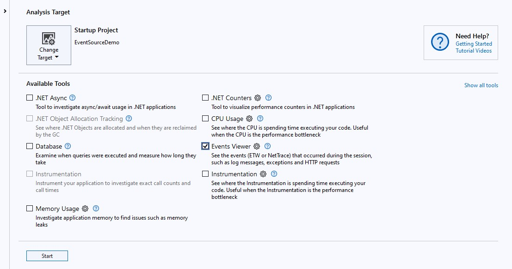
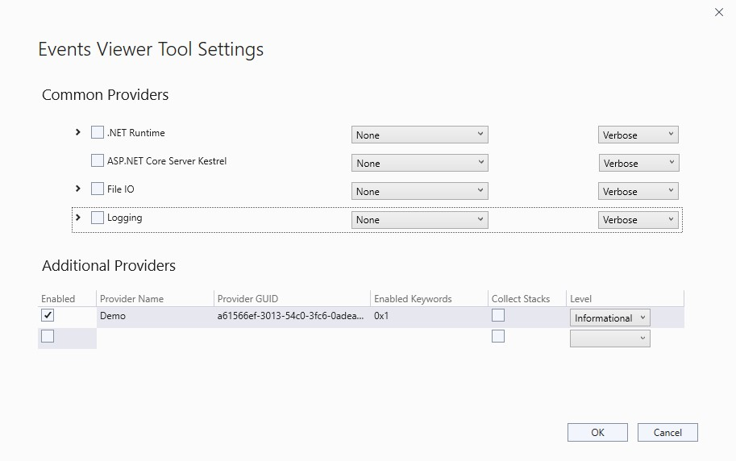
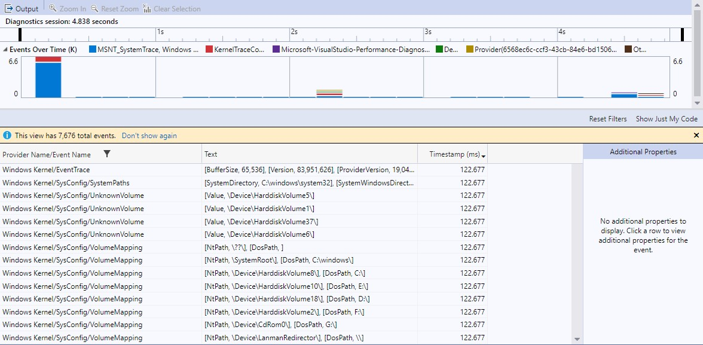
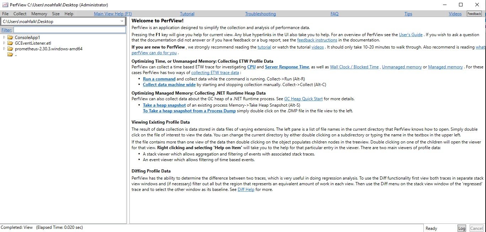
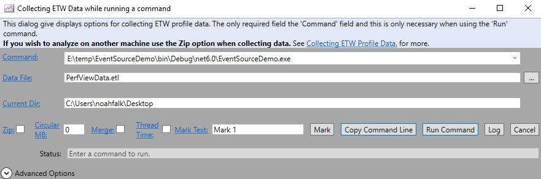
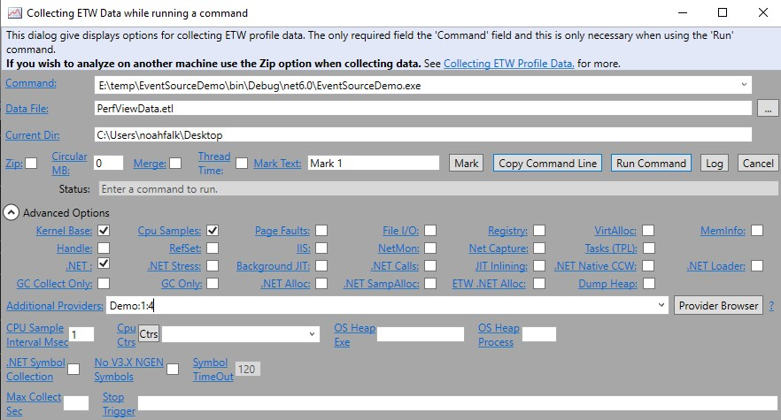
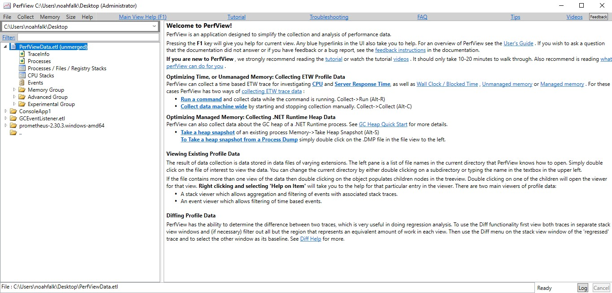
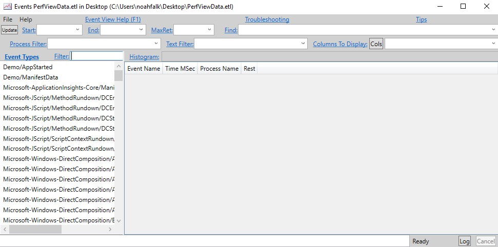
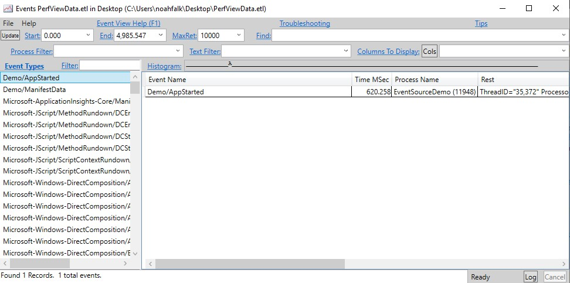

# 收集和查看事件源追踪

> 注意：
>
> 此文章只适用于 .NET Core 3.1 及以后的版本和 .NET Framework 4.5 及以上的版本

[入门指南](eventsource-getting-started.md)向您展示了如何创建一个最小的 EventSource 并在跟踪文件中收集事件。本教程展示了不同的工具如何配置在跟踪中收集哪些事件，然后查看跟踪的情况。

## 应用例子

在本教程中，你将使用以下生成事件的示例应用程序。编译一个包含以下代码的 .NET 控制台应用程序：

```c#
namespace EventSourceDemo
{
    public static class Program
    {
        public static void Main(string[] args)
        {
            DemoEventSource.Log.AppStarted("Hello World!", 12);
            DemoEventSource.Log.DebugMessage("Got here");
            DemoEventSource.Log.DebugMessage("finishing startup");
            DemoEventSource.Log.RequestStart(3);
            DemoEventSource.Log.RequestStop(3);
        }
    }

    [EventSource(Name = "Demo")]
    class DemoEventSource : EventSource
    {
        public static DemoEventSource Log { get; } = new DemoEventSource();

        [Event(1, Keywords = Keywords.Startup)]
        public void AppStarted(string message, int favoriteNumber) => WriteEvent(1, message, favoriteNumber);
        [Event(2, Keywords = Keywords.Requests)]
        public void RequestStart(int requestId) => WriteEvent(2, requestId);
        [Event(3, Keywords = Keywords.Requests)]
        public void RequestStop(int requestId) => WriteEvent(3, requestId);
        [Event(4, Keywords = Keywords.Startup, Level = EventLevel.Verbose)]
        public void DebugMessage(string message) => WriteEvent(4, message);


        public class Keywords
        {
            public const EventKeywords Startup = (EventKeywords)0x0001;
            public const EventKeywords Requests = (EventKeywords)0x0002;
        }
    }
}
```

## 配置要收集哪些事件

大多数事件收集工具使用这些配置选项来决定哪些事件应包括在跟踪中：

- 提供者名称 - 这是一个或多个事件源名称的列表。只有在这个列表中的 EventSources 上定义的事件才有资格被包含。要从前面的示例应用程序中的 DemoEventSource 类收集事件，您需要在提供者名称列表中包括 EventSource 名称 "Demo"。
- 事件粗略程度 - 对于每个提供者，你可以[定义一个收集级别](eventsource-instrumentation.md)，高于该级别的事件将从跟踪中排除。如果你在前面的例子应用程序中指定 "Demo" 提供者应以 `Informational` 级别收集，那么 DebugMessage 事件将被排除，因为它的级别更高。指定 EventLevel LogAlways(0) 是一种特殊情况，它表示应该包括任何言语水平的事件。
- 事件关键字 - 对于每个提供者，你可以定义一组关键字，只有至少有一个关键字标记的事件才会被包含。在上面的示例应用程序中，如果你指定了 Startup 关键字，那么只有 AppStarted 和 DebugMessage 事件将被包括在内。如果没有指定关键字，这是一种特殊情况，意味着带有任何关键字的事件都应该被包括在内。

### 描述提供者配置的惯例

尽管每个工具都决定了它自己的用户界面来设置追踪配置，但许多工具在将配置指定为文本字符串时有一个共同的惯例。**提供者列表被指定为以分号分隔的列表，列表中的每个提供者元素由名称、关键字和级别组成，以冒号分隔。**例如，"Demo:3:5" 确定了名为 "Demo" 的事件源，其关键词是标记位 3（`Startup` 位和 `Requests` 位）和 [EventLevel](https://learn.microsoft.com/en-us/dotnet/api/system.diagnostics.tracing.eventlevel) 5，也就是 `Verbose`。如果不需要级别或关键字过滤，许多工具还允许你省略级别和关键字。例如，"Demo::5" 只做基于级别的过滤，"Demo:3" 只做基于关键字的过滤，而 "Demo" 不做关键字或级别过滤。

## Visual Studio

[Visual Studio 分析器](https://learn.microsoft.com/en-us/visualstudio/profiling)支持收集和查看追踪。它还可以查看由其他工具预先收集的追踪，如 [dotnet-trace](https://learn.microsoft.com/en-us/dotnet/core/diagnostics/dotnet-trace)。

### 收集追踪

大多数 Visual Studio 的分析工具使用预定义的事件集，为特定的目的服务，如分析 CPU 使用或分配。为了收集带有自定义事件的跟踪，你将使用事件查看器工具。

1. 要在 Visual Studio 中打开性能分析器，选择 Alt+F2。

2. 选择“事件查看器”选项

   

3. 选择事件查看器右边的小齿轮图标，打开配置窗口。

   在"附加提供者"下面的表格中，为每个你想配置的提供者添加一行，点击"已启用"复选框，然后输入提供者名称、关键字和级别。你不需要输入提供者的 GUID；它是自动计算的。

   

4. 点击”确认“配置

5. 点击”开始“，运行 app 并开始收集日志信息。

6. 选择”停止收集“或退出程序可以停止采集日志和展示收集的数据。

### 展示追踪

Visual Studio 可以查看它自己收集的诊断信息，也可以查看在其他工具中收集的信息。要查看其他工具的追踪，请使用 **文件** > **打开**，并在文件选择器中选择一个跟踪文件。Visual Studio profiler 支持 .etl 文件（ETW 的标准格式），.nettrace 文件（EventPipe 的标准格式），以及 .diagsession 文件（Visual Studio 的标准格式）。有关在 Visual Studio中 使用跟踪文件的信息，请参阅 [Visual Studio 文档](https://learn.microsoft.com/en-us/visualstudio/profiling/events-viewer#understand-your-data)。



> 注意：
>
> Visual Studio 从 ETW 或 EventPipe 自动收集一些事件，即使它们没有被明确配置。如果你在提供者名称或事件名称栏中看到你不认识的事件，并想把它们过滤掉，请使用右边的过滤器图标，只选择你想查看的事件。

## PerfView

PerfView 是一个由 .NET 团队创建的性能工具，可以收集和查看 ETW 的跟踪。它还可以查看由其他工具收集的各种格式的跟踪文件。在本教程中，你将收集演示应用程序的 ETW 跟踪，然后在 PerfView 的事件查看器中检查收集的事件。

### 采集跟踪

1. 从发布页面下载 [PerfView](https://github.com/Microsoft/perfview/releases)。本教程是在 [PerfView 2.0.76](https://github.com/microsoft/perfview/releases/tag/P2.0.76) 版本下完成的，但任何最新版本都可以。

2. 以管理员权限启动 PerfView.exe。

   > 注意：
   >
   > ETW 跟踪收集总是需要管理员权限，但是如果你只是使用 PerfView 来查看预先存在的跟踪，那么就不需要特殊的权限。

   

3. 选择**采集**菜单，选择**运行**。这会打开新的对话框，在这里你可以输入的应用程序的路径

   

4. 为了配置特定的事件采集，打开窗口下面的**高级选项**。在**附加提供者**文本框中，使用前面描述的常规文本格式输入提供者。在这种情况下，你要输入 "Demo:1:4"，这意味着关键词标识位为 1（启动事件）和级别 4（Informational）。

   

5. 启动并运行 app 开始采集信息。当程序退出，诊断结果文件 `PerfviewData.etl` 就会保存到当前目录。

### 展示跟踪

1. 在主窗口左上方的下拉文本框中，选择包含跟踪文件的目录。然后在下面的树状视图中双击该跟踪文件。

   

2. 要调出事件查看器，双击出现在跟踪文件下方树状视图中的事件项目。

   

3. 追踪中的所有事件类型都显示在左边的列表中。双击一个事件类型，如 Demo/AppStarted，在右边的表格中显示该类型的所有事件。

   

更多关于 perfview 的使用请查看 [perfview 视频教程](https://learn.microsoft.com/en-us/shows/PerfView-Tutorial/)。

## dotnet-trace

[dotnet-trace](https://learn.microsoft.com/en-us/dotnet/core/diagnostics/dotnet-trace) 是一个跨平台的命令行工具，可以从使用 [EventPipe](https://learn.microsoft.com/en-us/dotnet/core/diagnostics/eventpipe) 追踪的 .NET Core 应用程序中收集诊断信息。它不支持查看跟踪数据，但它收集的跟踪数据可以由其他工具查看，如 [PerfView](https://learn.microsoft.com/en-us/dotnet/core/diagnostics/eventsource-collect-and-view-traces#perfview) 或 [Visual Studio](https://learn.microsoft.com/en-us/dotnet/core/diagnostics/eventsource-collect-and-view-traces#visual-studio)。dotnet-trace 还支持将其默认的 .nettrace 格式的跟踪数据转换为其他格式，如 Chromium 或 [Speedscope](https://www.speedscope.app/)。

### 采集跟踪

1. 下载并安装 [dotnet-trace](https://learn.microsoft.com/en-us/dotnet/core/diagnostics/dotnet-trace#install)

2. 运行 [dotnet-trace collect](https://learn.microsoft.com/en-us/dotnet/core/diagnostics/dotnet-trace#dotnet-trace-collect) 命名：

   ```
   E:\temp\EventSourceDemo\bin\Debug\net6.0>dotnet-trace collect --providers Demo:1:4 -- EventSourceDemo.exe
   ```

3. 输出结果如下：

   ```
   E:\temp\EventSourceDemo\bin\Debug\net6.0> dotnet-trace collect --providers Demo:1:4 -- EventSourceDemo.exe
   
   Provider Name                           Keywords            Level               Enabled By
   Demo                                    0x0000000000000001  Informational(4)    --providers
   
   Launching: EventSourceDemo.exe
   Process        : E:\temp\EventSourceDemo\bin\Debug\net6.0\EventSourceDemo.exe
   Output File    : E:\temp\EventSourceDemo\bin\Debug\net6.0\EventSourceDemo.exe_20220317_021512.nettrace
   
   [00:00:00:00]   Recording trace 0.00     (B)
   Press <Enter> or <Ctrl+C> to exit...
   
   Trace completed.
   ```

   dotnet-trace 在 `--providers` 参数中使用[常规文本格式](#描述提供者配置的惯例)来描述提供者的配置。关于如何使用 dotnet-trace 进行追踪的更多选项，请参阅 [dotnet-trace 文档](https://learn.microsoft.com/en-us/dotnet/core/diagnostics/dotnet-trace#collect-a-trace-with-dotnet-trace)。

## EventListner

[System.Diagnostics.Tracing.EventListener](https://learn.microsoft.com/en-us/dotnet/api/system.diagnostics.tracing.eventlistener) 是一个 .NET API，可以从进程中使用，以接收由 [System.Diagnostics.Tracing.EventSource](https://learn.microsoft.com/en-us/dotnet/api/system.diagnostics.tracing.eventsource) 产生的事件的回调。这个 API 可以用来创建自定义的日志工具或分析内存中的事件，而不需要将它们序列化。

要使用 `EventListener`，需要声明一个派生自 `EventListener` 的类型，调用 [EnableEvents](https://learn.microsoft.com/en-us/dotnet/api/system.diagnostics.tracing.eventlistener.enableevents) 来订阅来自任何感兴趣的 EventSource 的事件，并覆写 [OnEventWritten](https://learn.microsoft.com/en-us/dotnet/api/system.diagnostics.tracing.eventlistener.oneventwritten)，每当有新的事件发生时，它就会被调用。覆写 [OnEventSourceCreated](https://learn.microsoft.com/en-us/dotnet/api/system.diagnostics.tracing.eventlistener.oneventwritten) 通常很有用，可以发现哪些 EventSource 对象存在，但这并不是必须的。下面是一个 `EventListener` 实现的例子，它在收到消息时打印到控制台：

1. 添加如下代码到应用程序：

   ```c#
   class ConsoleWriterEventListener : EventListener
   {
       protected override void OnEventSourceCreated(EventSource eventSource)
       {
           if(eventSource.Name == "Demo")
           {
               EnableEvents(eventSource, EventLevel.Informational);
           }
       }
   
       protected override void OnEventWritten(EventWrittenEventArgs eventData)
       {
           Console.WriteLine(eventData.TimeStamp + " " + eventData.EventName);
       }
   }
   ```

2. 修改 Main 方法，创建这个 ConsoleWriterEventListener 示例对象：

   ```c#
   public static void Main(string[] args)
   {
       ConsoleWriterEventListener listener = new ConsoleWriterEventListener();
   
       DemoEventSource.Log.AppStarted("Hello World!", 12);
       DemoEventSource.Log.DebugMessage("Got here");
       DemoEventSource.Log.DebugMessage("finishing startup");
       DemoEventSource.Log.RequestStart(3);
       DemoEventSource.Log.RequestStop(3);
   }
   ```

3. 生成并运行，会输出如下内容：

   ```
   3/24/2022 9:23:35 AM AppStarted
   3/24/2022 9:23:35 AM RequestStart
   3/24/2022 9:23:35 AM RequestStop
   ```

   

