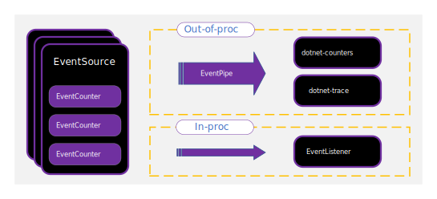

# EventCounters in .NET

这篇文章适用于：✔️ .NET Core 3.0 SDK 及以后的版本

EventCounters 是用于轻量级、跨平台和接近实时性能指标收集的 .NET API。EventCounters 是作为 Windows 上 .NET 框架的 "性能计数器" 的跨平台替代品而添加的。在这篇文章中，你将了解什么是 EventCounters，如何实现它们，以及如何消费它们。

从 .NET Core 3.0 开始，.NET运行时和一些 .NET 库使用 EventCounters 发布基本诊断信息。除了 .NET 运行时提供的 EventCounters 之外，你可以选择实现你自己的 EventCounters。EventCounters 可用于跟踪各种指标。在[内置 .NET 中的 EventCounters](available-counters.md) 中了解更多关于它们的信息。

EventCounters 作为 [EventSource](https://learn.microsoft.com/en-us/dotnet/api/system.diagnostics.tracing.eventsource) 的一部分存在，并定期自动推送给监听器工具。像 EventSource 上的所有其他事件一样，它们可以通过 [EventListener](https://learn.microsoft.com/en-us/dotnet/api/system.diagnostics.tracing.eventlistener) 和 [EventPipe](../logging-tracing/eventpipe.md) 在进程内和进程外被消费。本文重点介绍 EventCounters 的**跨平台功能**，并有意排除 PerfView 和 ETW（Event Tracing for Windows）--尽管两者都可以与 EventCounters 一起使用。



## EventCounter API 概述

EventCounters 有两个主要类别。一些计数器是 "速率" 值，如异常总数、GCs 总数和请求总数。其他计数器是 "快照" 值，如堆使用量、CPU 使用量和工作集大小。在这些类别的计数器中，有两种类型的计数器因其获取数值的方式而不同。轮询计数器通过回调来获取它们的值，而非轮询计数器的值则直接设置在计数器实例上。

这些计数器由以下实现来表示：

- [EventCounter](https://learn.microsoft.com/en-us/dotnet/api/system.diagnostics.tracing.eventcounter)
- [IncrementingEventCounter](https://learn.microsoft.com/en-us/dotnet/api/system.diagnostics.tracing.incrementingeventcounter)
- [PollingCounter](https://learn.microsoft.com/en-us/dotnet/api/system.diagnostics.tracing.pollingcounter)
- [IncrementingPollingCounter](https://learn.microsoft.com/en-us/dotnet/api/system.diagnostics.tracing.incrementingpollingcounter)

事件监听器指定了测量间隔的时间。在每个间隔结束时，每个计数器的值会被传送给监听器。计数器的实现决定了每个间隔的数值是由哪些 API 和计算来产生的。

- [EventCounter](https://learn.microsoft.com/en-us/dotnet/api/system.diagnostics.tracing.eventcounter) 记录了一组数值。[EventCounter.WriteMetric](https://learn.microsoft.com/en-us/dotnet/api/system.diagnostics.tracing.eventcounter.writemetric) 方法将一个新的值添加到该集合中。在每个区间，都会计算出该集合的统计摘要，如最小、最大和平均值。[dotnet-counters](https://learn.microsoft.com/en-us/dotnet/core/diagnostics/dotnet-counters) 工具将始终显示平均值。[EventCounter](https://learn.microsoft.com/en-us/dotnet/api/system.diagnostics.tracing.eventcounter) 对于描述一个**离散的操作集**很有用。常见的用法可能包括监控最近 IO 操作的平均字节数，或一组金融交易的平均货币价值。
- [IncrementingEventCounter](https://learn.microsoft.com/en-us/dotnet/api/system.diagnostics.tracing.incrementingeventcounter) 记录每个时间间隔的运行总数。[IncrementingEventCounter.Increment](https://learn.microsoft.com/en-us/dotnet/api/system.diagnostics.tracing.incrementingeventcounter.increment) 方法增加了总数。例如，如果在一个时间间隔内调用三次 `Increment()`，其值为 1、2 和 5，那么 8 的运行总数将被报告为这个时间间隔的计数器值。[dotnet-counters](https://learn.microsoft.com/en-us/dotnet/core/diagnostics/dotnet-counters) 工具将显示速率为记录的总数/时间。[IncrementingEventCounter](https://learn.microsoft.com/en-us/dotnet/api/system.diagnostics.tracing.incrementingeventcounter) 对于测量一个**动作发生的频率**很有用，比如每秒处理的请求数。
- [PollingCounter](https://learn.microsoft.com/en-us/dotnet/api/system.diagnostics.tracing.pollingcounter) 使用一个回调函数来决定报告的值。在每个时间间隔内，用户提供的回调函数被调用，其返回值被用作计数器的值。[PollingCounter](https://learn.microsoft.com/en-us/dotnet/api/system.diagnostics.tracing.pollingcounter) 可以用来**从外部来源查询一个指标**，例如获得磁盘上当前的空闲字节数。它还可以用来报告自定义的统计数据，这些数据可以由应用程序按需计算。例如，报告最近请求延迟的 p95 数，或者缓存的当前命中率或失误率。
- [IncrementingPollingCounter](https://learn.microsoft.com/en-us/dotnet/api/system.diagnostics.tracing.incrementingpollingcounter) 使用一个回调来确定报告的增量值。在每个时间间隔内，回调被调用，然后**当前调用和最后一次调用之间的差异就是报告值**。[dotnet-counters](https://learn.microsoft.com/en-us/dotnet/core/diagnostics/dotnet-counters) 工具总是将差值显示为一个速率，即报告值/时间。当对每个事件调用 API 不可行时，这个计数器很有用，但可以查询总的发生次数。例如，你可以报告每秒钟写入文件的字节数，即使没有每次写入字节的通知。

## 实现 EventSource

下面的代码实现了一个以 `"Sample.EventCounter.Minimal"` 提供者形式暴露的示例[事件源](https://learn.microsoft.com/en-us/dotnet/api/system.diagnostics.tracing.eventsource)。这个源包含一个代表请求处理时间的 [EventCounter](https://learn.microsoft.com/en-us/dotnet/api/system.diagnostics.tracing.eventcounter)。这样的计数器有一个名称（即它在源中的唯一ID）和一个显示名称，两者都被监听器工具使用，如 [dotnet-counter](https://learn.microsoft.com/en-us/dotnet/core/diagnostics/dotnet-counters)。

```c#
using System.Diagnostics.Tracing;

[EventSource(Name = "Sample.EventCounter.Minimal")]
public sealed class MinimalEventCounterSource : EventSource
{
    public static readonly MinimalEventCounterSource Log = new MinimalEventCounterSource();

    private EventCounter _requestCounter;

    private MinimalEventCounterSource() =>
        _requestCounter = new EventCounter("request-time", this)
        {
            DisplayName = "Request Processing Time",
            DisplayUnits = "ms"
        };

    public void Request(string url, long elapsedMilliseconds)
    {
        WriteEvent(1, url, elapsedMilliseconds);
        _requestCounter?.WriteMetric(elapsedMilliseconds);
    }

    protected override void Dispose(bool disposing)
    {
        _requestCounter?.Dispose();
        _requestCounter = null;

        base.Dispose(disposing);
    }
}
```

运行程序，然后通过 dotnet-counters 展示监测数据：

```cmd
dotnet-counters monitor --process-id 1400180 --counters Sample.EventCounter.Minimal
```

下面是展示的检测结果输出：

```cmd
Press p to pause, r to resume, q to quit.
    Status: Running

[Samples-EventCounterDemos-Minimal]
    Request Processing Time (ms)                            0.445
```

### 条件计数器

在实现 [EventSource](https://learn.microsoft.com/en-us/dotnet/api/system.diagnostics.tracing.eventsource) 时，当 [EventSource.OnEventCommand](https://learn.microsoft.com/en-us/dotnet/api/system.diagnostics.tracing.eventsource.oneventcommand) 方法被调用时，包含的计数器可以**有条件地被实例化**，其 [Command](https://learn.microsoft.com/en-us/dotnet/api/system.diagnostics.tracing.eventcommandeventargs.command#system-diagnostics-tracing-eventcommandeventargs-command) 值为 `EventCommand.Enable`。为了安全地只在计数器实例为 `null` 时才将其实例化，可以使用 [null-coalescing 赋值运算符](https://learn.microsoft.com/en-us/dotnet/csharp/language-reference/operators/null-coalescing-operator)。此外，自定义方法可以评估 [IsEnabled](https://learn.microsoft.com/en-us/dotnet/api/system.diagnostics.diagnosticsource.isenabled) 方法以确定当前事件源是否被启用。

```c#
using System.Diagnostics.Tracing;

[EventSource(Name = "Sample.EventCounter.Conditional")]
public sealed class ConditionalEventCounterSource : EventSource
{
    public static readonly ConditionalEventCounterSource Log = new ConditionalEventCounterSource();

    private EventCounter _requestCounter;

    private ConditionalEventCounterSource() { }

    protected override void OnEventCommand(EventCommandEventArgs args)
    {
        if (args.Command == EventCommand.Enable)
        {
            _requestCounter ??= new EventCounter("request-time", this)
            {
                DisplayName = "Request Processing Time",
                DisplayUnits = "ms"
            };
        }
    }

    public void Request(string url, float elapsedMilliseconds)
    {
        if (IsEnabled())
        {
            _requestCounter?.WriteMetric(elapsedMilliseconds);
        }
    }

    protected override void Dispose(bool disposing)
    {
        _requestCounter?.Dispose();
        _requestCounter = null;

        base.Dispose(disposing);
    }
}
```

> 注意
>
> 条件计数器是有条件实例化的计数器，是一种微优化。运行时在通常不使用计数器的情况下采用这种模式，以节省一小部分毫秒的时间。

### .NET Core 运行时示例计数器

在 .NET Core 运行时中，有许多很好的例子实现。下面是跟踪应用程序工作集大小的计数器的运行时实现。

```c#
var workingSetCounter = new PollingCounter(
    "working-set",
    this,
    () => (double)(Environment.WorkingSet / 1_000_000))
{
    DisplayName = "Working Set",
    DisplayUnits = "MB"
};
```

[PollingCounter](https://learn.microsoft.com/en-us/dotnet/api/system.diagnostics.tracing.pollingcounter) 报告当前映射到应用程序的进程（工作集）的物理内存量，因为它捕获了某一时刻的指标。轮询值的回调是提供的 lambda 表达式，它只是对 [System.Environment.WorkingSet](https://learn.microsoft.com/en-us/dotnet/api/system.environment.workingset#system-environment-workingset) API 的调用。[DisplayName](https://learn.microsoft.com/en-us/dotnet/api/system.diagnostics.tracing.diagnosticcounter.displayname#system-diagnostics-tracing-diagnosticcounter-displayname) 和 [DisplayUnits](https://learn.microsoft.com/en-us/dotnet/api/system.diagnostics.tracing.diagnosticcounter.displayunits#system-diagnostics-tracing-diagnosticcounter-displayunits) 是可选的属性，可以设置为帮助计数器的消费者端更清楚地显示数值。例如，[dotnet-counters](https://learn.microsoft.com/en-us/dotnet/core/diagnostics/dotnet-counters) 使用这些属性来显示更便于显示的计数器名称。

> **重要**
>
> `DisplayName` 属性无法本地化

对于 [PollingCounter](https://learn.microsoft.com/en-us/dotnet/api/system.diagnostics.tracing.pollingcounter) 和 [IncrementingPollingCounter](https://learn.microsoft.com/en-us/dotnet/api/system.diagnostics.tracing.pollingcounter)，不需要做任何其他事情。它们都是在消费者要求的时间间隔内自己轮询数值。

下面是一个使用 [IncrementingPollingCounter](https://learn.microsoft.com/en-us/dotnet/api/system.diagnostics.tracing.incrementingpollingcounter) 实现的运行时计数器的例子。

```c#
var monitorContentionCounter = new IncrementingPollingCounter(
    "monitor-lock-contention-count",
    this,
    () => Monitor.LockContentionCount
)
{
    DisplayName = "Monitor Lock Contention Count",
    DisplayRateTimeScale = TimeSpan.FromSeconds(1)
};
```

[IncrementingPollingCounter](https://learn.microsoft.com/en-us/dotnet/api/system.diagnostics.tracing.incrementingpollingcounter) 使用 [Monitor.LockContentionCount](https://learn.microsoft.com/en-us/dotnet/api/system.threading.monitor.lockcontentioncount#system-threading-monitor-lockcontentioncount) API 来报告锁争用的总计数的增量。[DisplayRateTimeScale](https://learn.microsoft.com/en-us/dotnet/api/system.diagnostics.tracing.incrementingpollingcounter.displayratetimescale#system-diagnostics-tracing-incrementingpollingcounter-displayratetimescale) 属性是可选的，但当它被使用时，可以提供一个提示，说明计数器最好以什么时间间隔显示。例如，锁争用计数最好显示为每秒计数，因此其 [DisplayRateTimeScale](https://learn.microsoft.com/en-us/dotnet/api/system.diagnostics.tracing.incrementingpollingcounter.displayratetimescale#system-diagnostics-tracing-incrementingpollingcounter-displayratetimescale) 被设置为一秒。显示率可以针对不同类型的速率计数器进行调整。

> **注意**
>
> `DisplayRateTimeScale` 无法用于 dotnet-counters，事件监听器也不要求使用它。

更多关于计数器的实现，可以查看 [.NET 运行时仓库](https://github.com/dotnet/runtime/blob/main/src/libraries/System.Private.CoreLib/src/System/Diagnostics/Tracing/RuntimeEventSource.cs)中的实现。

## 并发

> 提示
>
> EventCounters API **不保证线程安全**。当传递给 PollingCounter 或 IncrementingPollingCounter 实例的委托被多个线程调用时，你有责任保证这些委托的线程安全。

例如，考虑用下面的 EventSource 来记录请求的情况

```c#
using System;
using System.Diagnostics.Tracing;

public class RequestEventSource : EventSource
{
    public static readonly RequestEventSource Log = new RequestEventSource();

    private IncrementingPollingCounter _requestRateCounter;
    private long _requestCount = 0;

    private RequestEventSource() =>
        _requestRateCounter = new IncrementingPollingCounter("request-rate", this, () => _requestCount)
        {
            DisplayName = "Request Rate",
            DisplayRateTimeScale = TimeSpan.FromSeconds(1)
        };

    public void AddRequest() => ++ _requestCount;

    protected override void Dispose(bool disposing)
    {
        _requestRateCounter?.Dispose();
        _requestRateCounter = null;

        base.Dispose(disposing);
    }
}
```

`AddRequest()` 方法可以从请求处理程序中调用，`RequestRateCounter` 在计数器的消费者指定的时间间隔内轮询该值。然而，`AddRequest()` 方法可以被多个线程同时调用，从而给 `_requestCount` 带来竞争条件。一个线程安全的替代方法是使用 [Interlocked.Increment](https://learn.microsoft.com/en-us/dotnet/api/system.threading.interlocked.increment) 来增加 `_requestCount`。

```c#
public void AddRequest() => Interlocked.Increment(ref _requestCount);
```

为了防止 `long-字段` `_requestCount` 的撕裂式读取（torn reads）（在 32 位架构上），使用 [Interlocked.Read](https://learn.microsoft.com/en-us/dotnet/api/system.threading.interlocked.read)。

```c#
_requestRateCounter = new IncrementingPollingCounter("request-rate", this, () => Interlocked.Read(ref _requestCount))
{
    DisplayName = "Request Rate",
    DisplayRateTimeScale = TimeSpan.FromSeconds(1)
};
```

## 消费 EventCounters

有两种主要的消费 EventCounters 的方式：进程中和进程外。对 EventCounters 的消费可以区分为三个层次的各种消费技术。

- 通过 ETW 或 EventPipe 以原始流的方式传输事件：

  ETW APIs 随 Windows 操作系统而来，EventPipe 可作为 [.NET API](https://github.com/dotnet/diagnostics/blob/main/documentation/design-docs/diagnostics-client-library.md#1-attaching-to-a-process-and-dumping-out-all-the-runtime-gc-events-in-real-time-to-the-console) 或诊断 [IPC 协议](https://github.com/dotnet/diagnostics/blob/main/documentation/design-docs/ipc-protocol.md)使用。

- 将二进制事件流解码为事件：

  [TraceEvent 库](https://www.nuget.org/packages/Microsoft.Diagnostics.Tracing.TraceEvent)同时处理 ETW 和 EventPipe 流格式。

- 命令行和 GUI 工具：

  PerfView（ETW或 EventPipe）、dotnet-counters（仅 EventPipe）和 dotnet-monitor（仅 EventPipe）等工具。

### 进程外消费

在进程外消耗 EventCounters 是一种常见的方法。你可以使用 [dotnet-counters](https://learn.microsoft.com/en-us/dotnet/core/diagnostics/dotnet-counters) 以跨平台的方式通过 EventPipe 来消耗它们。`dotnet-counters` 工具是一个跨平台的 dotnet CLI 全局工具，可用于监控计数器的值。要了解如何使用 `dotnet-counters` 来监控你的计数器，请看 [dotnet-counters](https://learn.microsoft.com/en-us/dotnet/core/diagnostics/dotnet-counters)，或通过使用 [EventCounters 测量性能](https://learn.microsoft.com/en-us/dotnet/core/diagnostics/event-counter-perf)的教程进行操作。

#### dotnet-trace

`dotnet-trace` 工具可用于通过 EventPipe 消耗计数器数据。下面是一个使用 `dotnet-trace` 来收集计数器数据的例子。

```cmd
dotnet-trace collect --process-id <pid> Sample.EventCounter.Minimal:0:0:EventCounterIntervalSec=1
```

关于如何随时间收集计数器值的更多信息，请参阅 [dotnet-trace](https://learn.microsoft.com/en-us/dotnet/core/diagnostics/dotnet-trace#use-dotnet-trace-to-collect-counter-values-over-time) 文档

#### Azure Application Insights

EventCounters 可以被 Azure Monitor（特别是 Azure Application Insights）所使用。可以添加和删除计数器，并且可以自由指定自定义计数器或内置的计数器。欲了解更多信息，请参阅[自定义要采集的计数器](https://learn.microsoft.com/en-us/azure/azure-monitor/app/eventcounters#customizing-counters-to-be-collected)。

#### dotnet-monitor

`dotnet-monitor` 工具使其更容易以远程和自动化的方式从 .NET 进程中获得诊断结果。除了跟踪，它还可以监测指标，收集内存转储，并收集 GC 转储。它以 CLI 工具和 docker 镜像的形式发布。它暴露了一个 REST API，并通过 REST 调用收集诊断工件。

更多信息请见 [dotnet-monitor](https://learn.microsoft.com/en-us/dotnet/core/diagnostics/dotnet-monitor)。

### 进程内消费

你可以通过 [EventListener](https://learn.microsoft.com/en-us/dotnet/api/system.diagnostics.tracing.eventlistener) API 消耗计数器的值。EventListener 是一种过程中的方式，用于消费您的应用程序中 [EventSource](https://learn.microsoft.com/en-us/dotnet/api/system.diagnostics.tracing.eventsource) 的所有实例所写入的任何事件。关于如何使用 EventListener API 的更多信息，请参阅 [EventListener](https://learn.microsoft.com/en-us/dotnet/api/system.diagnostics.tracing.eventlistener)。

首先，产生计数器值的 EventSource 需要被启用。覆盖 [EventListener.OnEventSourceCreated](https://learn.microsoft.com/en-us/dotnet/api/system.diagnostics.tracing.eventlistener.oneventsourcecreated) 方法，当一个 EventSource 被创建时获得通知，如果这是与你的 EventCounters 正确的 EventSource，那么你可以对它调用 [EventListener.EnableEvents](https://learn.microsoft.com/en-us/dotnet/api/system.diagnostics.tracing.eventlistener.enableevents)。下面是一个覆盖的例子：

```c#
protected override void OnEventSourceCreated(EventSource source)
{
    if (!source.Name.Equals("System.Runtime"))
    {
        return;
    }

    EnableEvents(source, EventLevel.Verbose, EventKeywords.All, new Dictionary<string, string>()
    {
        ["EventCounterIntervalSec"] = "1"
    });
}
```

#### 代码例子

下面是一个示例 [EventListener](https://learn.microsoft.com/en-us/dotnet/api/system.diagnostics.tracing.eventlistener) 类，它从 .NET 运行时的 [EventSource](https://learn.microsoft.com/en-us/dotnet/api/system.diagnostics.tracing.eventsource) 中打印所有的计数器名称和值，用于每秒发布其内部计数器（`System.Runtime`）。

```c#
using System;
using System.Collections.Generic;
using System.Diagnostics.Tracing;

public class SimpleEventListener : EventListener
{
    public SimpleEventListener()
    {
    }

    protected override void OnEventSourceCreated(EventSource source)
    {
        if (!source.Name.Equals("System.Runtime"))
        {
            return;
        }

        EnableEvents(source, EventLevel.Verbose, EventKeywords.All, new Dictionary<string, string>()
        {
            ["EventCounterIntervalSec"] = "1"
        });
    }

    protected override void OnEventWritten(EventWrittenEventArgs eventData)
    {
        if (!eventData.EventName.Equals("EventCounters"))
        {
            return;
        }

        for (int i = 0; i < eventData.Payload.Count; ++ i)
        {
            if (eventData.Payload[i] is IDictionary<string, object> eventPayload)
            {
                var (counterName, counterValue) = GetRelevantMetric(eventPayload);
                Console.WriteLine($"{counterName} : {counterValue}");
            }
        }
    }

    private static (string counterName, string counterValue) GetRelevantMetric(
        IDictionary<string, object> eventPayload)
    {
        var counterName = "";
        var counterValue = "";

        if (eventPayload.TryGetValue("DisplayName", out object displayValue))
        {
            counterName = displayValue.ToString();
        }
        if (eventPayload.TryGetValue("Mean", out object value) ||
            eventPayload.TryGetValue("Increment", out value))
        {
            counterValue = value.ToString();
        }

        return (counterName, counterValue);
    }
}
```

如上所示，在调用 [EnableEvents](https://learn.microsoft.com/en-us/dotnet/api/system.diagnostics.tracing.eventlistener.enableevents) 时，你必须确保 `"EventCounterIntervalSec"` 参数被设置在 `filterPayload` 参数中。否则，计数器将无法冲出值，因为它不知道应该在哪个时间间隔内被冲出。