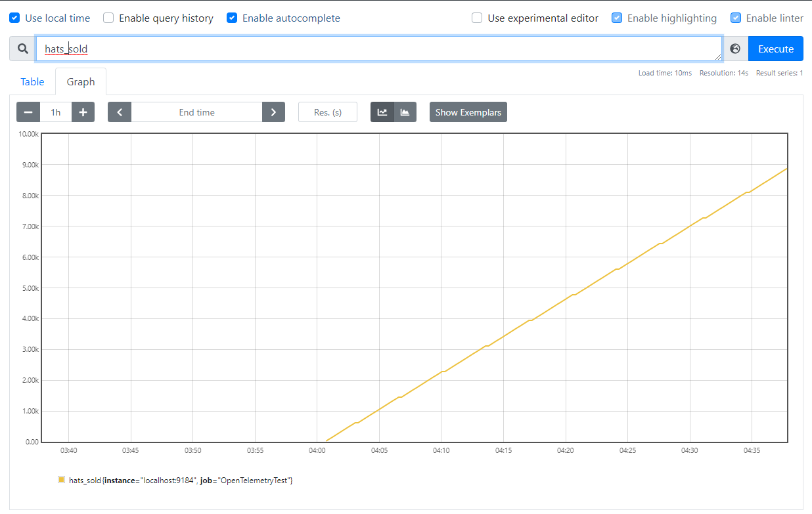
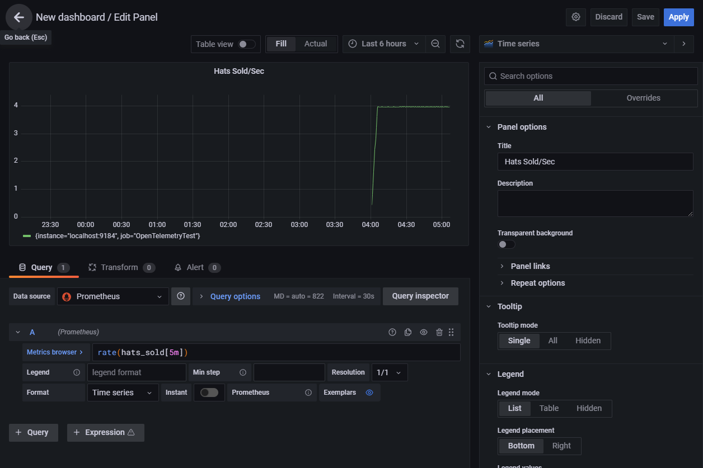

# 采集指标

这篇文章适用于： ✔️ .NET Core 3.1 及以后版本 ✔️ .NET Framework 4.6.1 及以后版本

仪表代码可以记录数字测量值，但测量值通常需要汇总、传输和存储，以创建用于监测的有用指标。这个聚集、传输和存储数据的过程被称为收集。在本教程中，我们将展示几个关于如何收集指标的例子：

- 用 OpenTelemetry 和 Prometheus 在 Grafana 中填充度量。
- 用 `dotnet-counters` 命令行工具实时查看度量。
- 使用底层的 .NET [MeterListener](https://learn.microsoft.com/en-us/dotnet/api/system.diagnostics.metrics.meterlistener) API 创建一个自定义采集工具。

关于自定义指标仪表和选项的更多信息和概述，请参阅[比较指标 API](compare-metric-apis.md)。

## 创建一个例子

要求：.NET Core 3.1 SDK 及以上

在收集指标之前，我们需要产生一些测量结果。为了简单起见，我们将创建一个小的应用程序，它有一些很小的指标。.NET 运行时也有[各种内置的指标](available-counters.md)。关于使用这里显示的 [System.Diagnostics.Metrics.Meter](https://learn.microsoft.com/en-us/dotnet/api/system.diagnostics.metrics.meter) API 创建新指标的更多信息，请参见[仪表化教程](metrics-instrumentation.md)。

```bash
dotnet new console
dotnet add package System.Diagnostics.DiagnosticSource
```

Program 的内容如下：

```c#
using System;
using System.Diagnostics.Metrics;
using System.Threading;

class Program
{
    static Meter s_meter = new Meter("HatCo.HatStore", "1.0.0");
    static Counter<int> s_hatsSold = s_meter.CreateCounter<int>("hats-sold");

    static void Main(string[] args)
    {
        Console.WriteLine("Press any key to exit");
        while(!Console.KeyAvailable)
        {
            // Pretend our store has a transaction each second that sells 4 hats
            Thread.Sleep(1000);
            s_hatsSold.Add(4);
        }
    }
}
```

## 使用 dotnet-counters 展示度量指标

关于 [dotnet-counters](https://learn.microsoft.com/en-us/dotnet/core/diagnostics/dotnet-counters) 的介绍以及安装和使用就不再赘述。直接通过该工具展示例子启动进程：

```cmd
> dotnet-counters monitor -p 19964 HatCo.HatStore
Press p to pause, r to resume, q to quit.
    Status: Running

[HatCo.HatStore]
    hats-sold (Count / 1 sec)                          4
```

我们也可以运行 dotnet-counters 指定一组不同的指标来查看 .NET 运行时的一些内置仪表：

```cmd
> dotnet-counters monitor -p 19964 System.Runtime
Press p to pause, r to resume, q to quit.
    Status: Running

[System.Runtime]
    % Time in GC since last GC (%)                                 0
    Allocation Rate (B / 1 sec)                                8,168
    CPU Usage (%)                                                  0
    Exception Count (Count / 1 sec)                                0
    GC Heap Size (MB)                                              2
    Gen 0 GC Count (Count / 1 sec)                                 0
    Gen 0 Size (B)                                         2,216,256
    Gen 1 GC Count (Count / 1 sec)                                 0
    Gen 1 Size (B)                                           423,392
    Gen 2 GC Count (Count / 1 sec)                                 0
    Gen 2 Size (B)                                           203,248
    LOH Size (B)                                             933,216
    Monitor Lock Contention Count (Count / 1 sec)                  0
    Number of Active Timers                                        1
    Number of Assemblies Loaded                                   39
    ThreadPool Completed Work Item Count (Count / 1 sec)           0
    ThreadPool Queue Length                                        0
    ThreadPool Thread Count                                        3
    Working Set (MB)                                              30
```

## 使用 OpenTelemetry 和 Prometheus 在 Grafana 展示指标

### 前提要求

- .NET Core 3.1 SDK 及以上

### 概述

[OpenTelemetry](https://opentelemetry.io/) 是一个供应商中立的开源项目，由[云原生计算基金会](https://www.cncf.io/)支持，旨在为云原生软件生成和收集遥测数据提供标准化。内置的平台度量 API 被设计为与该标准兼容，以使任何希望使用它的 .NET 开发人员能够直接进行整合。在撰写本文时，对 OpenTelemetry 指标的支持相对较新，但 [Azure Monitor](https://learn.microsoft.com/en-us/azure/azure-monitor/app/opentelemetry-overview) 和许多主要的 APM 供应商已经认可了它，并有集成计划正在进行。

这个例子显示了使用流行的 OSS [Prometheus](https://prometheus.io/) 和 [Grafana](https://grafana.com/) 项目的 OpenTelemetry 度量标准的一个现有集成。指标数据将像这样流动：

1. .NET Metric API 从 demo app 收集遥测数据。
2. OpenTelemetry 库在相同进程中运行并聚合这些遥测数据。
3. Prometheus 导出器能使这些遥测数据能以 HTTP 度量终结点的形式可用。“导出器（Exporter）”是 OpenTelemetry 对那些将遥测数据传输到供应商特定的后端的库的称呼。
4. 一个可能在不同机器上运行的 Prometheus 服务器轮询**指标终结点**，读取数据，并将其存储在数据库中以便长期保存。Prometheus 把这称为 "抓取（scraping）" 终结点。
5. Grafana 服务器可能运行在不同的机器上，查询存储在 Prometheus 中的数据，并将其显示在基于 Web 的监控仪表板上给工程师。

### 配置应用程序使用 OpenTelemetry Prometheus 导出器

给 app 添加 OpenTelemetry Prometheus 导出器：

```cmd
dotnet add package OpenTelemetry.Exporter.Prometheus --version 1.2.0-beta1
```

> **注意**
>
> Prometheus 导出器库包括对 OpenTelemetry 共享库的引用，所以这个命令隐含地将这两个库添加到应用程序中。
>
> 本教程使用的是写作时可用的 OpenTelemetry 的 Prometheus 支持的预发布版本。OpenTelemetry 项目的维护者可能会在正式发布之前进行修改。

修改 `Program.cs`，增加额外的代码配置 OpenTelemetry：

```c#
using System;
using System.Diagnostics.Metrics;
using System.Threading;
using OpenTelemetry;
using OpenTelemetry.Metrics;

class Program
{
    static Meter s_meter = new Meter("HatCo.HatStore", "1.0.0");
    static Counter<int> s_hatsSold = s_meter.CreateCounter<int>(name: "hats-sold",
                                                                unit: "Hats",
                                                                description: "The number of hats sold in our store");

    static void Main(string[] args)
    {
        using MeterProvider meterProvider = Sdk.CreateMeterProviderBuilder()
                .AddMeter("HatCo.HatStore")
                .AddPrometheusExporter(opt =>
                {
                    opt.StartHttpListener = true;
                    opt.HttpListenerPrefixes = new string[] { $"http://localhost:9184/" };
                })
                .Build();

        Console.WriteLine("Press any key to exit");
        while(!Console.KeyAvailable)
        {
            // Pretend our store has a transaction each second that sells 4 hats
            Thread.Sleep(1000);
            s_hatsSold.Add(4);
        }
    }
}
```

`AddMeter("HatCo.HatStore")` 配置了 OpenTelemetry，以传输我们的应用程序定义的仪表所收集的所有指标。`AddPrometheusExporter(...)` 将 OpenTelemetry 配置为在 9184 端口公开 Prometheus 的指标终结点并使用 HttpListener。关于 OpenTelemetry 配置选项的更多信息，请参见 [OpenTelemetry 文档](https://github.com/open-telemetry/opentelemetry-dotnet/tree/main/docs/metrics/getting-started-prometheus-grafana#collect-metrics-using-prometheus)，特别是对 ASP.NET 应用程序有用的其他托管选项。

> **注意**
>
> 在撰写本文时，OpenTelemetry 只支持使用 [System.Diagnostics.Metrics](https://learn.microsoft.com/en-us/dotnet/api/system.diagnostics.metrics) APIs 发出的度量。然而，对 [EventCounters](eventcounters/event-counters.md) 的支持正在计划之中。

运行 app：

```cmd
> dotnet run
Press any key to exit
```

### 设置并配置 Prometheus

按照 [Prometheus 的第一个步骤](https://prometheus.io/docs/introduction/first_steps/)来设置你的 Prometheus 服务器，并确认它正在工作。

修改 prometheus.yml 配置文件，使 Prometheus 能够抓取我们的示例应用程序所暴露的指标终结点。在 `scrape_configs` 部分添加这个文本：

```yml
- job_name: 'OpenTelemetryTest'
    scrape_interval: 1s # poll very quickly for a more responsive demo
    static_configs:
      - targets: ['localhost:9184']
```

如果你从默认配置开始，那么 `scrape_configs` 现在应该是这样的：

```yml
scrape_configs:
  # The job name is added as a label `job=<job_name>` to any timeseries scraped from this config.
  - job_name: "prometheus"

    # metrics_path defaults to '/metrics'
    # scheme defaults to 'http'.

    static_configs:
      - targets: ["localhost:9090"]

  - job_name: 'OpenTelemetryTest'
    scrape_interval: 1s # poll very quickly for a more responsive demo
    static_configs:
      - targets: ['localhost:9184']
```

重新加载配置或重启 Prometheus 服务器，然后确认 OpenTelemetryTest 在 Prometheus 网络门户的 `Status > Targets` 页面中处于 UP 状态。

在 Prometheus 门户网站的 "图表" 页面，在表达式文本框中输入 `hats_sold`。在图形标签中，Prometheus 应该显示 "hats-sold" 计数器的稳定增长值，这个计数器是由我们的示例应用程序发出的。



如果 Prometheus 服务器没有长时间抓取示例应用程序，您可能需要等待一段时间来积累数据。您还可以将左上角的时间范围控制调整为 “1m”(1分钟)，以便更好地查看最近的数据。

### 在 Grafana 操作面板上展示度量指标

1. 按照标准说明安装 Grafana 并将其连接到 Prometheus 数据源。

2. 通过单击 Grafana web 门户左侧工具栏上的 + 图标创建 Grafana 仪表板，然后选择 dashboard。在出现的仪表板编辑器中，输入 “Hats Sold/Sec” 作为标题，并在 PromQL 表达式字段中输入 “rate(hats_sold[5m])”。它应该是这样的：

   

3. 点击 “应用” 保存并展示应用程序的新的操作面板

   

## 使用 .NET [MeterListner](https://learn.microsoft.com/en-us/dotnet/api/system.diagnostics.metrics.meterlistener) 创建自定义采集工具

. net [MeterListener](https://learn.microsoft.com/en-us/dotnet/api/system.diagnostics.metrics.meterlistener) API 允许创建自定义的进程内逻辑来观察 [System.Diagnostics.Metrics.Meter](https://learn.microsoft.com/en-us/dotnet/api/system.diagnostics.metrics.meter) 记录的测量值。有关创建与旧 EventCounters 工具兼容的自定义逻辑的指导，请参见 [EventCounters](event-counters.md)。

修改 `Program.cs` 的代码，像这样使用 [MeterListener](https://learn.microsoft.com/en-us/dotnet/api/system.diagnostics.metrics.meterlistener)：

```c#
using System;
using System.Collections.Generic;
using System.Diagnostics.Metrics;
using System.Threading;

class Program
{
    static Meter s_meter = new Meter("HatCo.HatStore", "1.0.0");
    static Counter<int> s_hatsSold = s_meter.CreateCounter<int>(name: "hats-sold",
                                                                unit: "Hats",
                                                                description: "The number of hats sold in our store");

    static void Main(string[] args)
    {
        using MeterListener meterListener = new MeterListener();
        meterListener.InstrumentPublished = (instrument, listener) =>
        {
            if(instrument.Meter.Name == "HatCo.HatStore")
            {
                listener.EnableMeasurementEvents(instrument);
            }
        };
        meterListener.SetMeasurementEventCallback<int>(OnMeasurementRecorded);
        meterListener.Start();

        Console.WriteLine("Press any key to exit");
        while(!Console.KeyAvailable)
        {
            // Pretend our store has a transaction each second that sells 4 hats
            Thread.Sleep(1000);
            s_hatsSold.Add(4);
        }
    }

    static void OnMeasurementRecorded<T>(Instrument instrument, T measurement, ReadOnlySpan<KeyValuePair<string,object>> tags, object state)
    {
        Console.WriteLine($"{instrument.Name} recorded measurement {measurement}");
    }
}
```

运行，app 现在对每个测量都会执行我们的自定义回调：

```cmd
> dotnet run
Press any key to exit
hats-sold recorded measurement 4
hats-sold recorded measurement 4
hats-sold recorded measurement 4
hats-sold recorded measurement 4
...
```

让我们分析一下上面的例子。

```c#
using MeterListener meterListener = new MeterListener();
```

首先我们创建了一个 MeterListener 实例对象，我们将使用它来接收遥测数据。

```c#
meterListener.InstrumentPublished = (instrument, listener) =>
{
    if(instrument.Meter.Name == "HatCo.HatStore")
    {
        listener.EnableMeasurementEvents(instrument);
    }
};
```

这里我们配置了监听器将从哪些仪器接收测量结果。`InstrumentPublished` 是一个委托，它会在应用程序中创建新的仪表（instrument）时被调用。我们的委托可以检查仪表，例如检查名称，仪表或任何其他公共属性来决定是否订阅。如果我们确实想要从这个仪表接收测量，那么我们调用 `EnableMeasurementEvents` 来指示。如果您的代码有另一种方法来获取对仪表的引用，那么在任何时候使用该引用调用 `EnableMeasurementEvents()` 是合法的，但这可能并不常见。

```c#
meterListener.SetMeasurementEventCallback<int>(OnMeasurementRecorded);
...
static void OnMeasurementRecorded<T>(Instrument instrument, T measurement, ReadOnlySpan<KeyValuePair<string,object>> tags, object state)
{
    Console.WriteLine($"{instrument.Name} recorded measurement {measurement}");
}
```

接下来，我们通过调用 `SetMeasurementEventCallback`，配置了从仪表接收测量值时调用的委托。通用参数控制回调将接收的测量数据类型。例如，`Counter<int> `生成 int 度量，而 `Counter<double>` 产生 `double` 测量。仪表可以用 byte、shot、int、long、float、double 和 decimal 类型创建。我们建议**为每个数据类型注册一个回调**，除非您有特定于场景的知识，不需要所有的数据类型，比如在这个例子中。使用不同的泛型参数重复调用 `SetMeasurementEventCallback()` 可能看起来有点不寻常。这种 API 的设计方式允许 `MeterListeners` 以极低的性能开销(通常只有几纳秒)接收测量结果。

当最开始调用 `MeterListener.EnableMeasurementEvents()` 时，有机会提供 `state` 对象作为参数之一。这个对象可以是你想要的任何东西。如果您在该调用中提供 `state` 对象，那么它将与该工具一起存储，并作为回调中的 `state` 参数返回给您。这既是为了方便，也是为了优化性能。监听者通常需要为每个仪表创建一个对象，该对象将在内存中存储测量值，并使用代码对这些测量值进行计算。尽管您可以创建一个 Dictionary，将仪器映射到存储对象，并在每次测量中查找它，但这比从 `state` 访问它要慢得多。

```c#
meterListener.Start();
```

`MeterListener` 一旦配置好了，我们就需要启动它触发回调。将为流程中每个预先存在的 Instrument 调用 `InstrumentPublished` 委托。将来，任何新创建的Instrument 也将触发调用 `InstrumentPublished`。

```c#
using MeterListener meterListener = new MeterListener();
```

完成侦听后，释放侦听器将停止回调并释放对侦听器对象的所有内部引用。我们在声明 `meterListener` 时使用的 `using` 关键字导致在变量超出作用域时自动调用 `Dispose()`**。请注意，Dispose() 只是承诺它不会发起新的回调。因为回调发生在不同的线程上，所以在调用 Dispose() 返回后可能仍有回调在进行中**。如果您需要保证回调中的某个代码区域当前没有执行并且将来永远不会再次执行，那么您将需要一些额外的线程同步来强制执行。默认情况下，Dispose() 不包括同步，因为它会在每个测量回调中增加性能开销，而 `MeterListener` 被设计为一个高性能的 API。