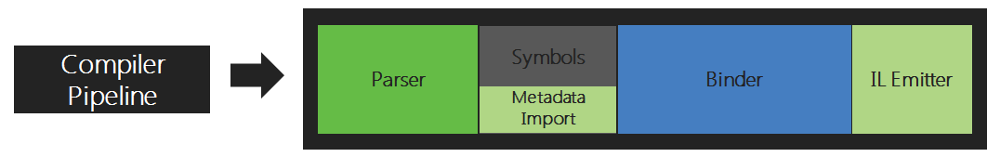
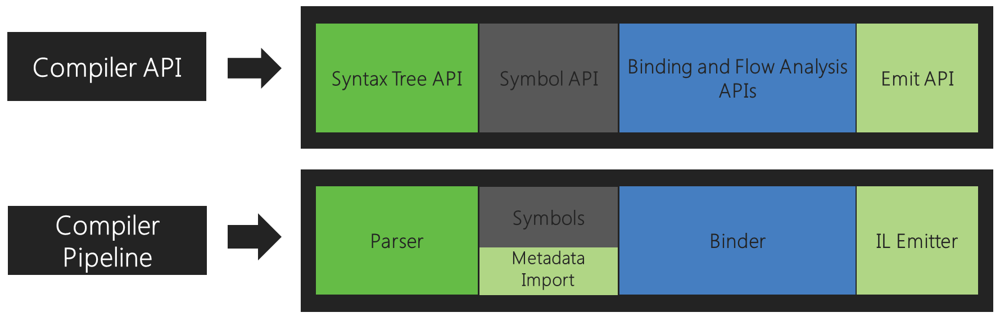
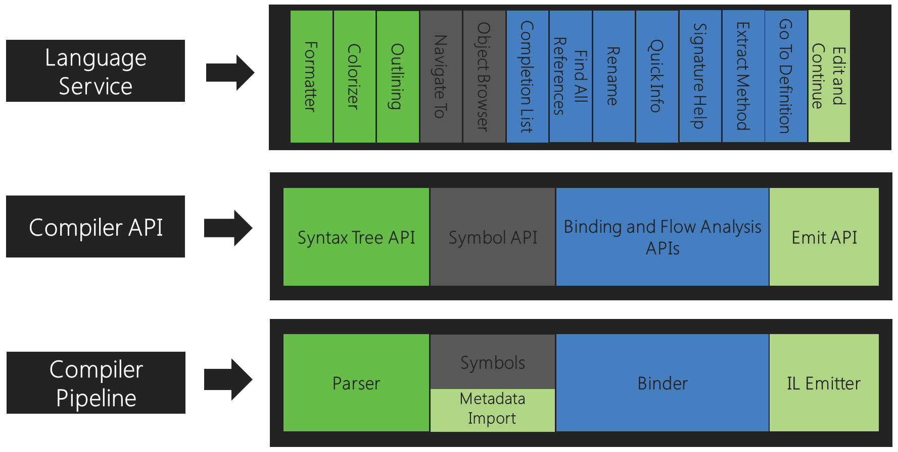

# 编译器 API 模型

编译器按照结构化规则处理您编写的代码，这些规则通常不同于人类阅读和理解代码的方式。基本了解编译器使用的模型对于理解您在构建基于 Roslyn 的工具时使用的 API 至关重要。

## 编译器管道功能区

.NET Compiler Platform SDK 通过提供反映传统编译器管道的 API 层，向作为消费者的您公开 C# 和 Visual Basic 编译器的代码分析。

此管道的每个阶段都是一个单独的组件。首先，**解析阶段**将源文本标记化并解析为遵循语言语法的句法。其次，**声明阶段**分析源和导入的元数据以形成命名符号（named symbols）。接下来，**绑定阶段**将代码中的标识符与符号匹配。最后，**发出阶段**发出一个程序集，其中包含编译器构建的所有信息。

对应于每个阶段，.NET Compiler Platform SDK 公开一个对象模型，允许访问该阶段的信息。解析阶段暴露语法树，声明阶段暴露分层符号表，绑定阶段暴露编译器语义分析的结果，发射阶段是产生 IL 字节码的 API。

每个编译器将这些组件组合在一起作为一个端到端的整体。

这些 API 与 Visual Studio 使用的 API 相同。例如，代码大纲和格式化功能使用语法树，对象浏览器和导航功能使用符号表，重构和 Go to Definition 使用语义模型，Edit and Continue 使用所有这些，包括 Emit API。

## API 层

.NET 编译器 SDK 由多个 API 层组成：编译器 API、诊断 API、脚本 API 和工作区 API。

### 编译器 API

编译器层包含对象模型，这些对象模型对应于在编译器管道的每个阶段公开的信息，包括句法（syntactic）和语义（semantic）。编译器层还包含编译器单次调用的不可变快照，包括程序集引用、编译器选项和源代码文件。有两种不同的 API，分别代表 C# 语言和 Visual Basic 语言。这两个 API 的大体相似，但针对每种语言进行了高保真度定制。该层不依赖于 Visual Studio 组件。

### 诊断 API

作为其分析的一部分，编译器可能会生成一组诊断，涵盖从语法、语义和明确分配错误到各种警告和信息诊断的所有内容。**编译器 API 层通过可扩展的 API 公开诊断信息，允许将用户定义的分析器插入编译过程**。它允许用户定义的诊断（例如由 StyleCop 等工具生成的诊断）与编译器定义的诊断一起生成。以这种方式生成诊断的好处是可以自然地与 MSBuild 和 Visual Studio 等工具集成，这些工具依赖于诊断来获得体验，例如根据策略停止构建、在编辑器中显示实时波浪线和建议代码修复。

### 脚本 API

托管和脚本 API 是编译器层的一部分。您可以使用它们来执行代码片段并积累运行时执行上下文。 C# 交互式 REPL（读取-评估-打印-循环）使用这些 API。 REPL 使您能够将 C# 用作脚本语言，在您编写代码时以交互方式执行代码。

### 工作区 API

Workspaces 层包含 Workspace API，这是对整个解决方案进行代码分析和重构的起点。它帮助您将解决方案中有关项目的所有信息组织到单个对象模型中，使您可以直接访问编译器层对象模型，而无需解析文件、配置选项或管理项目到项目的依赖关系。

此外，Workspaces 层显示了一组 API，这些 API 在实现代码分析和重构工具时使用，这些工具在 Visual Studio IDE 等主机环境中运行。示例包括查找所有引用、格式化和代码生成 API。该层不依赖于 Visual Studio 组件。

下一篇：[使用语法](work-with-syntax.md)