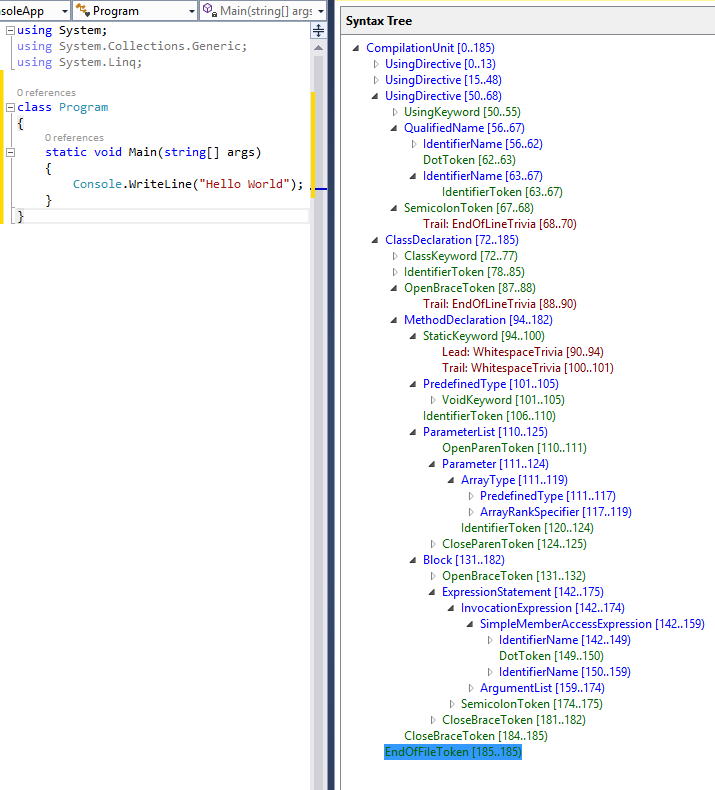

# 语法分析入门

语法 API 提供对描述 C# 或 Visual Basic 程序的数据结构的访问。这些数据结构具有足够的细节，可以完全表示任何大小的任何程序。这些结构可以描述正确编译和运行的完整程序。它们还可以在您编写程序时在编辑器中描述不完整的程序。

若要启用此丰富的表达式，构成语法 API 的数据结构和 API 必然很复杂。让我们从典型的“Hello World”程序的数据结构开始：

```c#
using System;
using System.Collections.Generic;
using System.Linq;

namespace HelloWorld
{
    class Program
    {
        static void Main(string[] args)
        {
            Console.WriteLine("Hello World!");
        }
    }
}
```

查看上面程序的文本。你认识熟悉的元素。整个文本表示单个源文件或**编译单元**。该源文件的前三行是 **using 指令**。其余源包含在**命名空间声明**中。命名空间声明包含一个子类声明。类声明包含一个**方法声明**。

语法 API 创建一个树结构，其中根表示编译单元。树中的节点表示 using  指令、命名空间声明和程序的所有其他元素。树结构一直向下到最低级别：字符串“Hello World！”是一个**字符串文本标记（string literal token）**，它是**参数(argument)**的后代。语法 API 提供对程序结构的访问。您可以查询特定的代码实践，遍历整个树以了解代码，并通过修改现有树来创建新树。

该简要说明概述了使用语法 API 可访问的信息类型。语法 API 只不过是一个正式的 API，用于描述您从 C# 中了解的熟悉的代码构造。完整功能包括有关如何设置代码格式的信息，包括换行符、空格和缩进。使用此信息，您可以完全表示由人类程序员或编译器编写和读取的代码。使用此结构使您能够在非常有意义的层面上与源代码进行交互。它不再是文本字符串，而是表示 C# 程序结构的数据。

## 了解语法树

可以使用语法 API 对 C# 代码的结构进行任何分析。语法 API 公开了用于分析和构造语法树的分析程序、语法树和实用程序。这是您搜索特定语法元素的代码或读取程序代码的方式。

**语法树（syntax tree）**是 C# 和 Visual Basic 编译器用来理解 C# 和 Visual Basic 程序的数据结构。语法树由生成项目或开发人员按 F5 时运行的同一分析器生成。语法树与语言完全保真;代码文件中的每一位信息都表示在树中。将语法树写入文本会重现已分析的确切原始文本。语法树也是不可变的;一旦创建，语法树就永远无法更改。树的使用者可以在多个线程上分析树，无需锁或其他并发措施，知道数据永远不会更改。您可以使用 API 创建新树，这些树是修改现有树的结果。

语法树的四个主要构建块是：

- [Microsoft.CodeAnalysis.SyntaxTree](https://learn.microsoft.com/en-us/dotnet/api/microsoft.codeanalysis.syntaxtree) 类，其实例表示整个解析树。[SyntaxTree](https://learn.microsoft.com/en-us/dotnet/api/microsoft.codeanalysis.syntaxtree) 是一个抽象类，具有特定于语言的派生。使用 [Microsoft.CodeAnalysis.CSharp.CSharpSyntaxTree](https://learn.microsoft.com/en-us/dotnet/api/microsoft.codeanalysis.csharp.csharpsyntaxtree)（或  [Microsoft.CodeAnalysis.VisualBasic.VisualBasicSyntaxTree](https://learn.microsoft.com/en-us/dotnet/api/microsoft.codeanalysis.visualbasic.visualbasicsyntaxtree)）类的解析方法来解析 C#（或  Visual Basic）中的文本。
- [Microsoft.CodeAnalysis.SyntaxNode](https://learn.microsoft.com/en-us/dotnet/api/microsoft.codeanalysis.syntaxnode) 类，其实例表示语法构造，如声明、语句、子句和表达式。
- [Microsoft.CodeAnalysis.SyntaxToken](https://learn.microsoft.com/en-us/dotnet/api/microsoft.codeanalysis.syntaxtoken) 结构，表示单个关键字、标识符、运算符或标点符号。
- 最后是 [Microsoft.CodeAnalysis.SyntaxTrivia](https://learn.microsoft.com/en-us/dotnet/api/microsoft.codeanalysis.syntaxtrivia) 结构，它表示语法上无关紧要的信息位，例如标记，预处理指令和注释之间的空格。

注释、标记和节点按层次结构组合，形成一个树，该树完全表示 Visual Basic 或 C# 代码片段中的所有内容。您可以使用语法可视化工具窗口查看此结构。在 Visual Studio  中，选择“视图 > 其他窗口 > 语法可视化工具”。例如，前面使用语法可视化工具检查的 C# 源文件如下图所示：

语法节点：蓝色 | 语法标记：绿色 | 语法注释：红色



通过导航此树结构，可以在代码文件中找到任何语句、表达式、标记或空格位。

虽然可以使用语法 API 在代码文件中查找任何内容，但大多数方案涉及检查小代码片段或搜索特定语句或片段。下面的两个示例显示了浏览代码结构或搜索单个语句的典型用法。

## 遍历树

可以通过两种方式检查语法树中的节点。可以遍历树以检查每个节点，也可以查询特定元素或节点。

### 手动遍历

> 注意
>
> 语法树类型使用继承来描述在程序中不同位置有效的不同语法元素。使用这些 API 通常意味着将属性或集合成员强制转换为特定的派生类型。在下面的示例中，赋值和强制转换是单独的语句，使用显式类型变量。您可以阅读代码以查看 API 的返回类型和返回对象的运行时类型。在实践中，更常见的是使用隐式类型变量并依赖 API 名称来描述所检查对象的类型。

创建新的 C# 独立代码分析工具项目：

- 在 Visual Studio 中，选择“新建>项目>文件”以显示“新建项目”对话框。
- 在“Visual C# > 扩展性”下，选择“独立代码分析工具”。
- 将项目命名为“SyntaxTreeManualTraversal”，然后单击“确定”。

您将分析前面显示的基本“Hello World！”程序。将 Hello World 程序的文本添加为 `Program` 类中的常量：

```c#
const string programText =
@"using System;
using System.Collections;
using System.Linq;
using System.Text;

namespace HelloWorld
{
    class Program
    {
        static void Main(string[] args)
        {
            Console.WriteLine(""Hello, World!"");
        }
    }
}";
```

接下来，添加以下代码，为 `programText` 常量中的代码文本生成语法树。将以下行添加到 `Main` 方法中：

```c#
SyntaxTree tree = CSharpSyntaxTree.ParseText(programText);
CompilationUnitSyntax root = tree.GetCompilationUnitRoot();
```

这两行创建树并检索该树的根节点。现在可以检查树中的节点。将这些行添加到 `Main` 方法中，以显示树中根节点的某些属性：

```c#
WriteLine($"The tree is a {root.Kind()} node.");
WriteLine($"The tree has {root.Members.Count} elements in it.");
WriteLine($"The tree has {root.Usings.Count} using statements. They are:");
foreach (UsingDirectiveSyntax element in root.Usings)
    WriteLine($"\t{element.Name}");
```

运行应用程序以查看代码发现的有关此树中的根节点的内容。

通常，您将遍历树以了解代码。在此示例中，你将分析已知的代码以探索 API。添加以下代码以检查 `root` 节点的第一个成员：

```c#
MemberDeclarationSyntax firstMember = root.Members[0];
WriteLine($"The first member is a {firstMember.Kind()}.");
var helloWorldDeclaration = (NamespaceDeclarationSyntax)firstMember;
```

该成员是 [Microsoft.CodeAnalysis.CSharp.Syntax.NamespaceDeclarationSyntax](https://learn.microsoft.com/en-us/dotnet/api/microsoft.codeanalysis.csharp.syntax.namespacedeclarationsyntax)。它表示 `namespace HelloWorld` 声明范围内的所有内容。添加以下代码以检查在 `HelloWorld` 命名空间中声明了哪些节点：

```c#
WriteLine($"There are {helloWorldDeclaration.Members.Count} members declared in this namespace.");
WriteLine($"The first member is a {helloWorldDeclaration.Members[0].Kind()}.");
```

运行程序以查看您学到了什么。

现在您知道声明是 [Microsoft.CodeAnalysis.CSharp.Syntax.ClassDeclarationSyntax](https://learn.microsoft.com/en-us/dotnet/api/microsoft.codeanalysis.csharp.syntax.classdeclarationsyntax)，请声明该类型的新变量来检查类声明。此类仅包含一个成员：`Main` 方法。添加以下代码以查找 `Main` 方法，并将其强制转换为 [Microsoft.CodeAnalysis.CSharp.Syntax.MethodDeclarationSyntax](https://learn.microsoft.com/en-us/dotnet/api/microsoft.codeanalysis.csharp.syntax.methoddeclarationsyntax)。

```c#
var programDeclaration = (ClassDeclarationSyntax)helloWorldDeclaration.Members[0];
WriteLine($"There are {programDeclaration.Members.Count} members declared in the {programDeclaration.Identifier} class.");
WriteLine($"The first member is a {programDeclaration.Members[0].Kind()}.");
var mainDeclaration = (MethodDeclarationSyntax)programDeclaration.Members[0];
```

方法声明节点包含有关该方法的所有语法信息。让我们显示 `Main` 方法的返回类型、参数的数量和类型以及方法的正文文本。添加以下代码：

```c#
WriteLine($"The return type of the {mainDeclaration.Identifier} method is {mainDeclaration.ReturnType}.");
WriteLine($"The method has {mainDeclaration.ParameterList.Parameters.Count} parameters.");
foreach (ParameterSyntax item in mainDeclaration.ParameterList.Parameters)
    WriteLine($"The type of the {item.Identifier} parameter is {item.Type}.");
WriteLine($"The body text of the {mainDeclaration.Identifier} method follows:");
WriteLine(mainDeclaration.Body?.ToFullString());

var argsParameter = mainDeclaration.ParameterList.Parameters[0];
```

运行该程序以查看您发现的有关此程序的所有信息：

```
The tree is a CompilationUnit node.
The tree has 1 elements in it.
The tree has 4 using statements. They are:
        System
        System.Collections
        System.Linq
        System.Text
The first member is a NamespaceDeclaration.
There are 1 members declared in this namespace.
The first member is a ClassDeclaration.
There are 1 members declared in the Program class.
The first member is a MethodDeclaration.
The return type of the Main method is void.
The method has 1 parameters.
The type of the args parameter is string[].
The body text of the Main method follows:
        {
            Console.WriteLine("Hello, World!");
        }
```

### 查询方法

除了遍历树之外，还可以使用 [Microsoft.CodeAnalysis.SyntaxNode](https://learn.microsoft.com/en-us/dotnet/api/microsoft.codeanalysis.syntaxnode) 上定义的查询方法来浏览语法树。熟悉 XPath 的人应该立即熟悉这些方法。可以将这些方法与 LINQ 结合使用，以快速查找树中的内容。[SyntaxNode](https://learn.microsoft.com/en-us/dotnet/api/microsoft.codeanalysis.syntaxnode) 具有查询方法，例如 [DescendantNodes](https://learn.microsoft.com/en-us/dotnet/api/microsoft.codeanalysis.syntaxnode.descendantnodes)、[AncestorsAndSelf](https://learn.microsoft.com/en-us/dotnet/api/microsoft.codeanalysis.syntaxnode.ancestorsandself) 和 [ChildNodes](https://learn.microsoft.com/en-us/dotnet/api/microsoft.codeanalysis.syntaxnode.childnodes)。

可以使用这些查询方法查找 `Main` 方法的参数，作为导航树的替代方法。将以下代码添加到 `Main` 方法的底部：

```c#
var firstParameters = from methodDeclaration in root.DescendantNodes()
                                        .OfType<MethodDeclarationSyntax>()
                      where methodDeclaration.Identifier.ValueText == "Main"
                      select methodDeclaration.ParameterList.Parameters.First();

var argsParameter2 = firstParameters.Single();

WriteLine(argsParameter == argsParameter2);
```

第一条语句使用 LINQ 表达式和 DescendantNodes 方法来查找与上一示例中相同的参数。

运行该程序，您可以看到 LINQ 表达式找到了与手动导航树相同的参数。

此示例使用 `WriteLine` 语句在遍历语法树时显示有关语法树的信息。您还可以通过在调试器下运行完成的程序来了解更多信息。您可以检查作为为 hello world 程序创建的语法树一部分的更多属性和方法。

## 语法步行者

通常，您希望在语法树中查找特定类型的所有节点，例如，文件中的每个属性声明。通过扩展 [Microsoft.CodeAnalysis.CSharp.CSharpSyntaxWalker](https://learn.microsoft.com/en-us/dotnet/api/microsoft.codeanalysis.csharp.csharpsyntaxwalker) 类并重写  [VisitPropertyDeclaration（PropertyDeclarationSyntax）](https://learn.microsoft.com/en-us/dotnet/api/microsoft.codeanalysis.csharp.csharpsyntaxvisitor.visitpropertydeclaration#microsoft-codeanalysis-csharp-csharpsyntaxvisitor-visitpropertydeclaration(microsoft-codeanalysis-csharp-syntax-propertydeclarationsyntax))方法，可以在事先不知道其结构的情况下处理语法树中的每个属性声明。[CSharpSyntaxWalker](https://learn.microsoft.com/en-us/dotnet/api/microsoft.codeanalysis.csharp.csharpsyntaxvisitor) 是一种特定类型的 [CSharpSyntaxVisiter](https://learn.microsoft.com/en-us/dotnet/api/microsoft.codeanalysis.csharp.csharpsyntaxvisitor)，它递归访问节点及其每个子节点。

此示例实现一个检查语法树的 CSharpSyntaxWalker。它收集 `using` 个指令，发现这些指令未导入 `System` 命名空间。

您可以在我们的 [GitHub 存储库](https://github.com/dotnet/samples/tree/main/csharp/roslyn-sdk/SyntaxQuickStart)中看到此示例的完成代码。GitHub 上的示例包含本教程中描述的两个项目。

与前面的示例一样，您可以定义一个字符串常量来保存要分析的程序的文本：

```c#
const string programText =
@"using System;
using System.Collections.Generic;
using System.Linq;
using System.Text;
using Microsoft.CodeAnalysis;
using Microsoft.CodeAnalysis.CSharp;

namespace TopLevel
{
    using Microsoft;
    using System.ComponentModel;

    namespace Child1
    {
        using Microsoft.Win32;
        using System.Runtime.InteropServices;

        class Foo { }
    }

    namespace Child2
    {
        using System.CodeDom;
        using Microsoft.CSharp;

        class Bar { }
    }
}";
```

此源文本包含分散在四个不同位置的 `using` 个指令：文件级、顶级命名空间和两个嵌套命名空间。此示例重点介绍使用 [CSharpSyntaxWalker](https://learn.microsoft.com/en-us/dotnet/api/microsoft.codeanalysis.csharp.csharpsyntaxwalker) 类查询代码的核心方案。访问根语法树中的每个节点以使用声明进行查找会很麻烦。相反，您可以创建一个派生类并重写仅当树中的当前节点为 using 指令时才调用的方法。您的访问者不会在任何其他节点类型上执行任何工作。此方法检查 `using` 语句中的每一个，并生成不在 `System` 命名空间中的命名空间的集合。你构建了一个 [CSharpSyntaxWalker](https://learn.microsoft.com/en-us/dotnet/api/microsoft.codeanalysis.csharp.csharpsyntaxwalker)，它检查所有 `using` 个语句，但只检查 `using` 个语句。

现在您已经定义了程序文本，您需要创建一个 `SyntaxTree` 并获取该树的根：

```c#
SyntaxTree tree = CSharpSyntaxTree.ParseText(programText);
CompilationUnitSyntax root = tree.GetCompilationUnitRoot();
```

接下来，创建一个新类。在 Visual Studio 中，选择“项目” > “添加新项”。在“添加新项”对话框中，键入 UsingCollector.cs 作为文件名。

在 `UsingCollector` 类中实现 `using` 访问者功能。首先使 `UsingCollector` 类派生自 [CSharpSyntaxWalker](https://learn.microsoft.com/en-us/dotnet/api/microsoft.codeanalysis.csharp.csharpsyntaxwalker)。

```C#
class UsingCollector : CSharpSyntaxWalker
```

需要存储来保存要收集的命名空间节点。在 `UsingCollector` 类中声明一个公共只读属性;您可以使用此变量来存储您找到的 [UsingDirectiveSyntax](https://learn.microsoft.com/en-us/dotnet/api/microsoft.codeanalysis.csharp.syntax.usingdirectivesyntax) 节点：

```c#
public ICollection<UsingDirectiveSyntax> Usings { get; } = new List<UsingDirectiveSyntax>();
```

基类 CSharpSyntaxWalker 实现了访问语法树中每个节点的逻辑。派生类重写为感兴趣的特定节点调用的方法。在这种情况下，您对任何 `using` 指令都感兴趣。这意味着您必须重写 [VisitUsingDirective（UsingDirectiveSyntax）](https://learn.microsoft.com/en-us/dotnet/api/microsoft.codeanalysis.csharp.csharpsyntaxvisitor.visitusingdirective#microsoft-codeanalysis-csharp-csharpsyntaxvisitor-visitusingdirective(microsoft-codeanalysis-csharp-syntax-usingdirectivesyntax))方法。此方法的一个参数是 [Microsoft.CodeAnalysis.CSharp.Syntax.UsingDirectiveSyntax](https://learn.microsoft.com/en-us/dotnet/api/microsoft.codeanalysis.csharp.csharpsyntaxvisitor.visitusingdirective#microsoft-codeanalysis-csharp-csharpsyntaxvisitor-visitusingdirective(microsoft-codeanalysis-csharp-syntax-usingdirectivesyntax)) 对象。这是使用访问者的一个重要优势：它们使用已转换为特定节点类型的参数调用重写的方法。Microsoft.CodeAnalysis.CSharp.Syntax.UsingDirectiveSyntax 类有一个 [Name](https://learn.microsoft.com/en-us/dotnet/api/microsoft.codeanalysis.csharp.syntax.usingdirectivesyntax.name#microsoft-codeanalysis-csharp-syntax-usingdirectivesyntax-name) 属性，用于存储要导入的命名空间的名称。它是一个 [Microsoft.CodeAnalysis.CSharp.Syntax.NameSyntax](https://learn.microsoft.com/en-us/dotnet/api/microsoft.codeanalysis.csharp.syntax.namesyntax)。在 VisitUsingDirective（UsingDirectiveSyntax） 覆盖中添加以下代码：

```C#
public override void VisitUsingDirective(UsingDirectiveSyntax node)
{
    WriteLine($"\tVisitUsingDirective called with {node.Name}.");
    if (node.Name.ToString() != "System" &&
        !node.Name.ToString().StartsWith("System."))
    {
        WriteLine($"\t\tSuccess. Adding {node.Name}.");
        this.Usings.Add(node);
    }
}
```

与前面的示例一样，您添加了各种 `WriteLine` 语句来帮助理解此方法。您可以查看何时调用它，以及每次传递给它的参数。

最后，您需要添加两行代码来创建 `UsingCollector` 并让它访问根节点，收集所有 `using` 语句。然后，添加一个 `foreach` 循环以显示收集器找到的所有 `using` 个语句：

```c#
var collector = new UsingCollector();
collector.Visit(root);
foreach (var directive in collector.Usings)
{
    WriteLine(directive.Name);
}
```

编译并运行程序。应会看到以下输出：

```
VisitUsingDirective called with System.
        VisitUsingDirective called with System.Collections.Generic.
        VisitUsingDirective called with System.Linq.
        VisitUsingDirective called with System.Text.
        VisitUsingDirective called with Microsoft.CodeAnalysis.
                Success. Adding Microsoft.CodeAnalysis.
        VisitUsingDirective called with Microsoft.CodeAnalysis.CSharp.
                Success. Adding Microsoft.CodeAnalysis.CSharp.
        VisitUsingDirective called with Microsoft.
                Success. Adding Microsoft.
        VisitUsingDirective called with System.ComponentModel.
        VisitUsingDirective called with Microsoft.Win32.
                Success. Adding Microsoft.Win32.
        VisitUsingDirective called with System.Runtime.InteropServices.
        VisitUsingDirective called with System.CodeDom.
        VisitUsingDirective called with Microsoft.CSharp.
                Success. Adding Microsoft.CSharp.
Microsoft.CodeAnalysis
Microsoft.CodeAnalysis.CSharp
Microsoft
Microsoft.Win32
Microsoft.CSharp
Press any key to continue . . .
```

祝贺！你已使用语法 API 在 C# 源代码中查找特定类型的 C# 语句和声明。