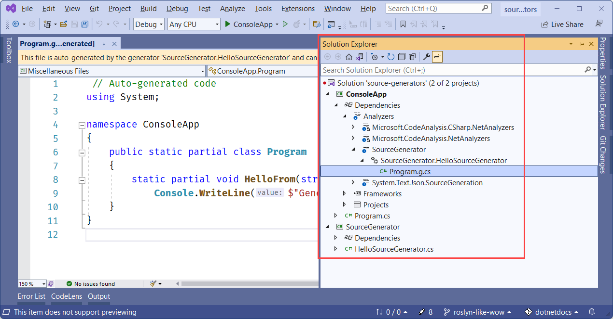
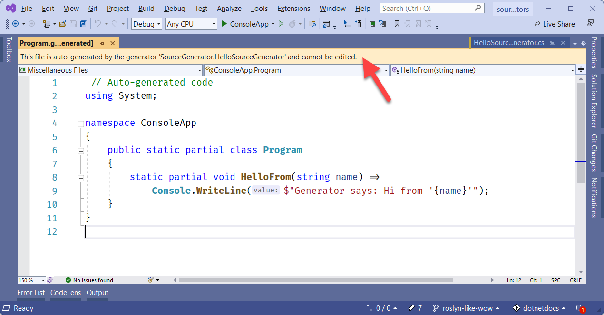

# Source Generators 源码生成器

Source Generator 作为 Roslyn 编译器 SDK 的一部分，c# 编译器的一个特性，**它允许 c# 开发人员在编译时检查用户代码，并动态生成新的 c# 源文件，添加到用户的编译中**。通过这种方式，可以让代码在编译期间运行，并检查程序以生成附加的源文件，这些源文件与其他代码一起编译。

Source Generator 是一种 c# 开发人员可以编写的新组件，它可以让你做两件主要的事情：

1. 检索正在编译的所有用户代码的编译对象。还可以自己编写代码能够很好的与正在编译的代码的语法和语义模型一起工作，就像今天的分析程序一样。
2. Source Generator 生成的 c# 源文件，可以在编译过程中添加到编译对象中去。也就是说，在当这些代码正在编译时，你可以提供额外的源代码作为输入添加到编译中去。

当这两件事结合在一起时，Source Generator 就变得非常有用。您可以使用编译器在编译期间构建的所有丰富元数据来检查用户代码，然后将 c# 代码发送回基于所分析的数据的相同编译中。如果您熟悉 Roslyn analyzer，您可以将 Source Generator 视为能够发出 c# 源代码的分析器。

Source Generator 作为编译阶段运行，运行过程如下图所示：


Source Generator 是 .NET Standard2.0 程序集，由编译器和所有分析程序一起加载。它可以在 .Net 标准组件环境中可以加载和运行使用。

> 目前，只有 .NET Standard2.0 程序集可以用 Source Generator

## 通用场景

有三种通用的方法来检查用户代码，并根据当前技术使用的分析生成信息或代码：

- 运行时反射（Runtime reflection）
- 迷惑 MSBuild 任务（Juggling MSBuild tasks）
- 中间语言编织（IL weaving）

Source Generator 可以完善上面说的所有方法。

### 运行时反射

运行时反射是一项功能强大的技术，很久以前就添加到了 .NET 中。它有无数的使用场景。一个非常常见的场景是，当应用程序启动时，执行一些用户代码分析，并使用这些数据生成东西。

例如，当你的 web 服务第一次运行时，ASP.NET Core 使用反射来发现你已经定义的结构，以便它可以 “预热（wire up）” 一些像 controllers 和 razor page 这样的东西。尽管这使您能够编写简单的代码以及强有力的抽象能力，但它伴随了一个在运行时性能损失：当您的 web 服务或应用程序第一次启动时，它不能接受任何请求信息，直到所有运行时反射代码发现代码完成后运行。尽管这种性能损失并不大，但这是一种固定的成本，你无法在自己的应用中改进自己。

使用 Source Generator，在启动阶段，控制器发现可以发生在编译时，通过分析源代码并发射代码需要“预热”的应用程序。其结果就会导致一些更快的启动时间，因为现在一个发生在运行时的动作已经变成可以进入编译时间。

### 迷惑 MSBuild 任务

Source Generator 可以通过不局限于运行时的反射来发现类型的方式来提高性能。一些场景涉及多次调用 MSBuild c# 任务（称为 CSC），以便检查编译中的数据。可以想象，多次调用编译器会影响构建应用程序的总时间。我们正在研究如何使用 Source Generator 来避免像这样同时处理 MSBuild 任务，因为 Source Generators 不仅提供了一些性能上的好处，而且还允许工具在正确的抽象级别上操作。

Source Generator 可以提供的另一个功能是避免使用一些“严格类型”的 api，例如如何在 Controller 和 Razor Page 之间使用 ASP.NET Core 路由工作。使用Source Generator，路由可以强类型化，所需的字符串可以作为编译时详细信息生成。这将减少输入错误的字符串字面值导致请求未命中正确控制器的次数。

## 开始使用 Source Generator

在本指南中，您将探索如何使用 [ISourceGenerator](https://docs.microsoft.com/en-us/dotnet/api/microsoft.codeanalysis.isourcegenerator) API 创建源生成器：

1. 创建一个 .NET 控制台应用程序。这个例子使用了 .NET6。

2. 用下面的代码替换 Program 类：

   ```c#
   namespace ConsoleApp;
   
   partial class Program
   {
       static void Main(string[] args)
       {
           HelloFrom("Generated Code");
       }
       static partial void HelloFrom(string name);
   }
   ```

3. 接下来，我们将创建一个 Source Generator 项目，该项目将实现 `partial void HelloFrom` 方法。

4. 创建一个 .NET Standard 项目，目标是 .netstandard2.0 目标框架名称(TFM)：

   ```xml
   <Project Sdk="Microsoft.NET.Sdk">
   
     <PropertyGroup>
       <TargetFramework>netstandard2.0</TargetFramework>
     </PropertyGroup>
   
     <ItemGroup>
       <PackageReference Include="Microsoft.CodeAnalysis.CSharp" Version="4.0.1" PrivateAssets="all" />
       <PackageReference Include="Microsoft.CodeAnalysis.Analyzers" Version="3.3.3" PrivateAssets="all" />
     </ItemGroup>
   
   </Project>
   ```

   > 注意：
   >
   > 创建 Source Generator 项目只能是 .NET Standard2.0 项目，否则生成器是无法正常工作的

5. 创建一个名为 HelloSourceGenerator.cs 的新 c# 文件，指定你自己的 SourceGenerator，如下所示：

   ```c#
   using Microsoft.CodeAnalysis;
   
   namespace SourceGenerator
   {
       [Generator]
       public class HelloSourceGenerator : ISourceGenerator
       {
           public void Execute(GeneratorExecutionContext context)
           {
               // Code generation goes here
           }
   
           public void Initialize(GeneratorInitializationContext context)
           {
               // No initialization required for this one
           }
       }
   }
   ```

   Source Generator 需要实现 [Microsoft.CodeAnalysis.ISourceGenerator](https://docs.microsoft.com/en-us/dotnet/api/microsoft.codeanalysis.isourcegenerator) 接口，并具有 [Microsoft.CodeAnalysis.GeneratorAttribute](https://docs.microsoft.com/en-us/dotnet/api/microsoft.codeanalysis.generatorattribute)。并不是所有的 Source Generator 都需要初始化，这就是本示例实现的情况——其中 [ISourceGenerator.Initialize](https://docs.microsoft.com/en-us/dotnet/api/microsoft.codeanalysis.isourcegenerator.initialize) 是空的。

6. 替换 [ISourceGenerator.Execute](https://docs.microsoft.com/en-us/dotnet/api/microsoft.codeanalysis.isourcegenerator.execute) 的方法，用如下实现：

   ```c#
   using Microsoft.CodeAnalysis;
   
   namespace SourceGenerator
   {
       [Generator]
       public class HelloSourceGenerator : ISourceGenerator
       {
           public void Execute(GeneratorExecutionContext context)
           {
               // Find the main method
               var mainMethod = context.Compilation.GetEntryPoint(context.CancellationToken);
   
               // Build up the source code
               string source = $@" // Auto-generated code
   using System;
   
   namespace {mainMethod.ContainingNamespace.ToDisplayString()}
   {{
       public static partial class {mainMethod.ContainingType.Name}
       {{
           static partial void HelloFrom(string name) =>
               Console.WriteLine($""Generator says: Hi from '{{name}}'"");
       }}
   }}
   ";
               var typeName = mainMethod.ContainingType.Name;
   
               // Add the source code to the compilation
               context.AddSource($"{typeName}.g.cs", source);
           }
   
           public void Initialize(GeneratorInitializationContext context)
           {
               // No initialization required for this one
           }
       }
   }
   ```

   从 context 对象中，我们可以访问编译的入口点，或者 `Main` 方法。`mainMethod` 实例是一个 [IMethodSymbol](https://docs.microsoft.com/en-us/dotnet/api/microsoft.codeanalysis.imethodsymbol)，它表示一个方法或类似方法的符号(包括构造函数、析构函数、操作符或属性/事件访问器)。从这个对象，我们可以推断出包含的名称空间(如果存在的话)和类型。本例中的 `source` 是一个内插字符串（interpolated string），它为要生成的源代码模板化，内插的整体被包含的名称空间和类型信息填充。将 `souce` 添加到带有提示名称的 `context` 中。

   > 注意
   >
   > `GeneratorExecutionContext.AddSource` 的 `hintName` 参数是任何唯一的名称。通常提供一个显式的 c# 文件扩展名，如 “.g.cs” 或 “.generated.cs” 作为名称。文件名有助于将文件标识为生成的源文件。

7. 现在我们有了一个功能正常的生成器，但需要将它连接到我们的控制台应用程序。编辑原始的控制台应用程序项目，并添加以下内容，用上面创建的 .NET Standard 项目的路径替换项目路径：

   ```xml
   <!-- Add this as a new ItemGroup, replacing paths and names appropriately -->
   <ItemGroup>
       <ProjectReference Include="..\PathTo\SourceGenerator.csproj"
                         OutputItemType="Analyzer"
                         ReferenceOutputAssembly="false" />
   </ItemGroup>
   ```

   这不是传统的项目引用，必须手动编辑以包括 `OutputItemType` 和 `ReferenceOutputAssembly` 属性。有关 `ProjectReference `的 `OutputItemType` 和 `ReferenceOutputAssembly` 属性的更多信息，请参阅 [MSBuild公共项目项:ProjectReference](https://docs.microsoft.com/en-us/visualstudio/msbuild/common-msbuild-project-items#projectreference)。

8. 现在，当您运行控制台应用程序时，您应该看到生成的代码被运行并打印到屏幕上。控制台应用程序本身并不实现 HelloFrom 方法，而是在编译期间从 source Generator 项目生成源代码。下面是应用程序的示例输出：

   ```console
   Generator says: Hi from 'Generated Code'
   ```

9. 如果您使用的是 Visual Studio，您可以看到生成的源文件。在“解决方案资源管理器”窗口中，展开“依赖项>分析器> SourceGenerator > SourceGenerator”。HelloSourceGenerator，然后双击Program.g.cs文件。

   

   当您打开这个生成的文件时，Visual Studio 将指示该文件是自动生成的，并且不能编辑。

   

## 下一步

[Source Generators Cookbook](https://github.com/dotnet/roslyn/blob/main/docs/features/source-generators.cookbook.md) 介绍了其中的一些例子，以及一些解决这些问题的推荐方法。此外，我们在 [GitHub 上提供了一组示例](https://github.com/dotnet/roslyn-sdk/tree/main/samples/CSharp/SourceGenerators)，你可以自己尝试。

你可以在这些主题中了解更多关于源生成器的信息：

- [Source Generator 设计文档](https://github.com/dotnet/roslyn/blob/main/docs/features/source-generators.md)
- [Source Generator cookbook](https://github.com/dotnet/roslyn/blob/main/docs/features/source-generators.cookbook.md)

## 原文系列

https://docs.microsoft.com/en-us/dotnet/csharp/roslyn-sdk/source-generators-overview