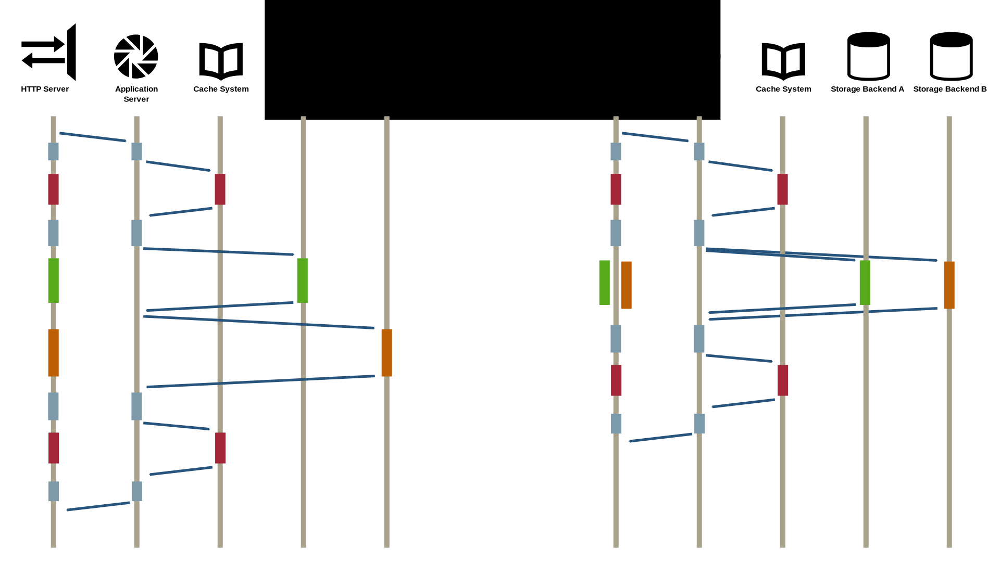
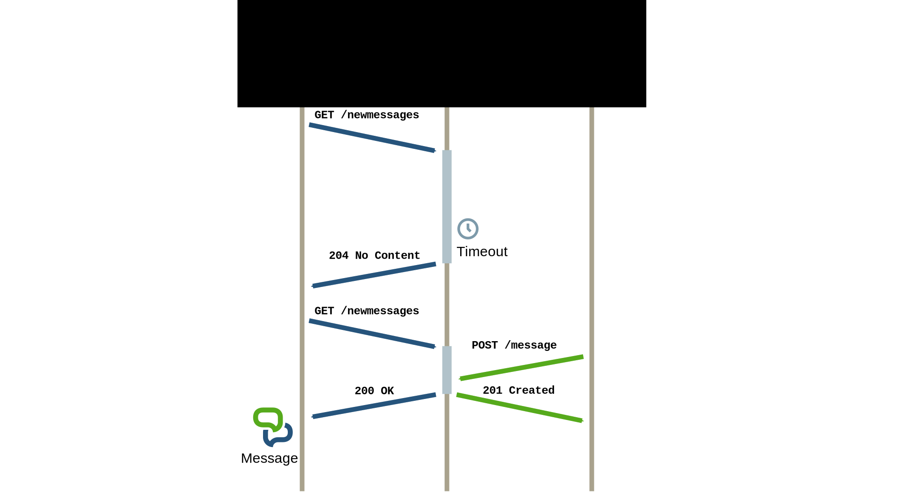

# 应用程序和业务逻辑的并发概念

上一章节，[第 4 章](webserver-architectures-for-highconcurrency.md)，讨论了作为 Web 服务器问题的连接并发性。这个挑战的特点是大量的 I/O-bound 操作，但可变状态非常有限。在本章中，我们从一个不同的角度来看待并发性，即专注于应用服务器。也就是说，负责执行应用程序实际业务逻辑的组件，由传入的请求激发。

在大规模 Web 架构中，请求的固有并行性是不可避免的。多个用户同时访问应用程序，创建大量的独立请求。因此，应用服务器是必须处理高度并发的组件。我们在本章中想要处理的主要问题是，当用于应用服务器的业务逻辑时，不同并发范式的含义和后果。这不仅包括处理并发应用程序中状态的影响，还包括特定范式对开发者的简单性和可访问性。

此外，我们不专注于特定的应用服务器实现或 Web 应用程序框架。相反，我们更一般地与并发性和并发编程的范式进行较量。这些反思适用于一般的分布式和并发编程。最终，我们在寻找一种适当的编程抽象，用于应用程序固有的并发性，这不仅允许我们开发可扩展和高性能的应用程序，同时也能在一定程度上驯服并发性的麻烦。

## 概览

应用服务器提供了一种响应式行为，能够根据传入请求生成响应。这个应用服务器组件通过高级消息（或者是远程过程调用 RPC 或类似机制）从上游 Web 服务器接收调用。因此，它与底层的连接处理或请求解析职责解耦。为了生成适当的响应，应用服务器执行与请求 URI 映射的业务逻辑。在应用服务器内部，一个请求的执行流程包括与不同的架构组件交互，如数据库和后端服务，但也包括作为应用逻辑一部分的计算操作：

- **CPU-bound 活动**
  CPU-bound 活动是那些在执行过程中主要消耗 CPU 时间的任务。通常，这些任务是在内存数据上操作的计算密集型算法。就 Web 应用而言，这适用于例如输入验证、模板渲染或即时编码/解码内容等任务。

- **I/O-bound 活动**

  I/O-bound 活动是主要受 I/O 资源限制的任务，如网络 I/O 或文件 I/O。当任务操作的是尚未（或尚不）属于其自身内存的外部数据时，通常会发生 I/O-bound 活动。在我们的架构模型中，这包括访问大多数平台组件，包括存储后端、后台服务和外部服务。



图 5.1：请求处理的执行流程。应用服务器首先查询缓存，然后分派两个独立的数据库查询，最后再次访问缓存。在左侧，执行是严格按顺序进行的。在右侧，独立操作被并行化，以改善延迟结果。

对于 Web 应用的一个请求，通常会触发这两种类型的操作，尽管实际的比例取决于应用的内部结构。许多内容丰富的 Web 应用（例如博客、维基）主要依赖于数据库操作，以及在一定程度上依赖于模板渲染。其他应用主要是 CPU-bound，如提供计算服务的 Web 服务或媒体文件转换的 Web 服务。在这两种情况下，都偏好低延迟的响应，因为它们对于良好的用户体验很重要。

与请求相关的应用逻辑通常以顺序方式实现。为了最小化延迟，应考虑并行化独立操作，如图 5.1 所示。在有向图表示中，第一个节点代表请求的到达，最后一个节点代表编译好的响应。中间的节点代表操作，如数据库操作或计算函数。控制流的分割导致并行操作，这些操作必须在稍后同步。这种模式，也称为 scatter and gather[^Hoh03]，特别适用于 I/O-bound 活动，如数据库操作和访问其他架构组件（网络 I/O）。



图 5.2：作为交互式网络应用程序一部分的待处理请求之间的协调。用户 A 的浏览器通过长时间轮询不断发送通知请求。一旦用户 B 发布了新信息，网络应用程序就会协调通知并响应两个待处理请求，从而有效地通知用户 A。

此外，请求处理可能包括与其他请求的协调和通信，这可以通过使用外部消息组件，或使用应用服务器组件的内置机制来实现。例如，对于协作性、交互性和 Web 实时应用来说，这是必需的。然后，将发送专门的请求，使服务器最终能够在稍后时间，由其他请求的行为或其他服务器端事件触发时发送响应。

本质上，现代 Web 应用利用的并发属性与早期应用中完全隔离的请求的概念不同，如图 5.2 所示。应用状态不再完全保存在数据库系统内，但在一定程度上也在其他组件中共享，甚至可能在请求之间共享。协作和交互功能以及对低延迟的需求不再允许避开同步和协调。相反，必须拥抱真正的并发性，以适应 Web 应用的应用逻辑。在本章的剩余部分，我们将研究不同的并发编程方法以及它们如何管理状态、协调和同步。然后，我们将检查并发 Web 应用如何利用这些概念。

## 基于线程、锁和共享状态的并发

命令式编程，作为结构化编程最受欢迎的形式，围绕着顺序执行和可变状态的概念构建。它直接源自冯·诺依曼架构的概念。线程通常被视为这一概念的一个延申扩展，它们使得可以同时进行多个控制流。与较重的进程相比，线程是操作系统和硬件架构提供的并行主要构建块（即超线程）。不出所料，线程是大多数编程语言中并发的主要构建块。然而，基于线程、锁和共享状态的并发编程被认为是困难且容易出错的[^Sut05]。

### 共享和可变状态的含义

从概念上讲，线程描述了一个顺序的控制流，乍一看它与其他活动是隔离的。但与进程不同的是，线程共享同一地址空间。这意味着多个独立的线程可能会同时访问同一变量和状态。更糟的是，顺序编程建立在可变状态的概念上，这意味着多个线程也可能竞争写操作。**多线程主要使用抢占式调度**。结果，多个线程之间的切换和交错是未知的。这代表了一种强烈的不确定性形式。如果不加以处理，可变状态和不确定性就会引入竞态条件的严重风险。

当两个或多个线程竞争访问临界区时，就会发生竞态条件，临界区包含了线程之间共享的状态。由于可能的交错种类繁多，竞态条件可能导致各种不一致的状态。例如，一个线程可能读取到过时的状态，而另一个线程已经在更新它。当多个线程同时更改状态时，要么其中一个更改持续存在而其他更改丢失，要么可能持续存在一个受多次更改影响的不一致状态。最终，我们需要机制来保护临界区并强制同步访问。

### 锁机制

同步的一般原语是锁，它控制对临界区的访问。有不同类型的锁，具有不同的行为和语义。信号量[^Dij65]是简单的锁，提供等待(`wait`)和信号(`signal`)功能。在进入临界区或使用共享资源之前，必须调用等待函数。一旦通过了临界区，就使用信号释放它。通过在 `wait` 调用中阻塞其他竞争者，`semaphore` 可以防止多个线程同时获取该 `semaphore`。其他标识符实现，即所谓的计数标识符，允许一定数量的线程通过。因此，二进制寄存器可视为仅限于单个活动线程的计数寄存器。其他互斥结构提供了所有权的概念，这意味着临界区段暂时由一个不同的线程拥有，该线程也是唯一能在稍后解锁临界区段的实例。

更高级的互斥构造是监视器[^Hoa74][^Lam79b]，它使用条件变量以模块化方式保护部分。通常，这些部分的粒度为对象，或方法/函数。内部条件变量允许一个阻塞的线程暂时让出并等待其他线程触发的条件修改。锁机制的一个属性是**可重入性**。当锁支持可重入性时，已经获得某个锁的线程可以再次通过该锁。这对于可能重复访问临界区的递归函数来说是一个重要属性。除了计数锁，还有区分不同访问语义的锁。读/写锁允许读取线程的共享访问，但对要求写访问的线程提供独占访问。

### 锁的后果

锁允许我们序列化对关键部分的访问。互斥的使用使临界区段内的线程具有原子行为，因为对于其他等待的线程来说，它的执行是一个单一的操作。识别易受竞赛条件影响的代码段，并谨慎地在其周围加锁，可以抑制不确定性，并实现序列化访问。

然而，锁的概念引入了另一个多线程代码的危险。当获得的锁未被释放或要获得的锁永远不可用时，不正确的锁定实际上可能会破坏应用程序。很明显，当开发人员必须明确地将 `wait` 和 `signal` 函数置于保护部分时，就会发生错误锁定。更高级的抽象，如监视器，通常提供手段来标记整个代码段以进行互斥，并隐式获取和释放锁。然而，它们仍然可能遭受锁定问题。最臭名昭著的锁定问题是所谓的死锁。当两个或多个线程以循环依赖的方式竞争锁时，就会发生死锁。在最简单的情况下，两个线程都拥有一个单独的锁，但还需要获得对方线程的锁。由于没有线程能够在不获取第二个锁的情况下前进，因此两个线程都被阻塞，无法继续。

其他锁定问题包括活锁和锁启动。与死锁类似，活锁也会阻止线程继续运行。不过，线程在活锁情况下不会被阻塞。相反，它们会随着其他相关线程的状态变化而稳定地改变状态，反过来，这些线程也会改变状态。在一个示例场景中，两个线程必须获得两个资源才能继续运行。当它们无法同时获得两个资源时，它们会返回第一个资源，然后重新尝试获得两个资源。当两个线程同时开始获取第一个资源，然后又重新启动时，就会出现活锁。活锁可视为饥饿的一种特殊情况。它一般描述的是线程因其他贪婪的线程不断索取锁或资源而反复无法获取锁或资源的情况。

尽管一些饥饿问题，如活锁，可能在运行时使用随机回退进行重试来处理，但由于非确定性，潜在的锁定问题通常非常难以检测。当使用细粒度的多个锁时，死锁的风险增加。因此，通常建议使用粗粒度的锁以避免死锁。识别大的临界区并用锁保护它们不仅确保了序列化访问。事实上，粗粒度的锁导致线程最终顺序执行。这与我们之前增加并行性的目标相反。

为了具有真正的硬件并行性，我们需要选择非常细的锁粒度，使得多个线程可以在独立的临界区中继续进行。许多小的临界区不仅增加了锁管理的开销，因为锁定管理并非免费。然而，锁的广泛使用强调了上述危险的风险。显然，选择正确的锁粒度并不容易。

除了活锁、死锁和锁饥饿的问题外，锁在实践中还有另一个困难。给定多段代码，这些代码的临界区受到锁的保护，我们不能保证这些代码的组合不会导致死锁。本质上，我们不能在没有新的锁定问题风险的情况下组合线程安全的实现。这对于较大的代码片段，如框架组件或模块，尤其重要。锁定问题可能通过坚决的开发政策来解决，这些政策严格规定了锁的使用、获取顺序和条件。然而，这些政策不能以编程方式强制执行。此外，当使用外部或闭源组件时，确保正确锁定变得不可能。

尽管如此，基于线程、共享状态和锁定的并发编程仍然是主流，并且在大多数语言中都可用。重要的是要认识到，这种方法代表了并发的低级概念。它比我们很快就会看到的其他概念更接近裸机。然而，所有这些概念仍然在底层使用线程。

### 案例研究：Java中的并发

Java 编程语言从其存在之初就提供了基于线程的并发。它实现了 Mesa 监视器[^Lam79b]用于锁定和互斥，并提供了语言核心的几个同步原语。并发行为在 Java 语言规范[^Gos12]中定义，该规范详细描述了 JMM。Java 的一致性基于发生前顺序和隐式内存屏障的概念。然而，它并不为线程提供顺序一致性，正如许多开发者错误地假设的那样。事实上，JMM 类似于对称多处理，其中多个 CPU 拥有自己的缓存，但共享一个公共主内存。当 CPU 访问内存时，它们刷新自己的缓存并最终刷新更改。从比喻的意义上讲， Java 线程类似于 CPU，主内存是线程之间的共享内存，CPU 缓存是线程本地的数据副本。刷新或刷新的过程代表了所谓的内存屏障的穿越。除了上述排序外，JMM 还根据内存屏障定义了哪些操作不能被其他线程中断（原子性），以及何时变更必须传播给其他线程（可见性）。例如，启动和结束线程或使用同步原语会触及内存屏障，但也会触及对几个具有特定特性的变量的访问（见下文）。

`synchronized` 关键字使用给定对象作为监视器来保护整个方法或一个独特的代码块。Java 监视器是可重入的，支持递归调用。此外，每个 Java 对象都可以用作监视器，因此提供了条件信号的手段。`wait()` 方法阻塞持有监视器的线程并释放监视器，以允许其他线程继续并更改条件。在这种情况下，其他线程可以使用 `notify()` 和 `notifyAll()` 向等待线程发出信号。

`volatile` 关键字规避了变量的线程本地拷贝，并在每次访问时强制从共享内存中获取新副本。它只能用于单个原子操作。例如，增加值（多次操作）不是原子的。`final` 关键字使变量不可变。不可变值对并发的好处是避免了刷新值的需要，因为它们不能再被更改。建议始终将字段设置为 `final`，除非有不这样做的理由[^Blo08]。此外，Java 提供了一组原子实体（`java.util.concurrent.atomic`），类似于 `volatile` 变量。然而，这些实体是对象，确保所有操作的原子性，并使用内部非常高效的机制，如比较和交换。

活动由 `Thread` 类表示，该类提供了诸如 `start()` 之类的线程处理方法。这个类还有几个协调方法，如 `resume()` 和 `stop()`，不幸的是这些方法被破损了，不应该使用[^Blo08]。`Runnable` 接口从 `Thread` 类中抽象出来，只拥有一个 `run()` 方法，一旦线程启动，最终由线程执行这个方法。

虽然这是 Java 中并发编程的基础，但从 Java 5 开始引入了几种高级抽象，主要是为了促进并发应用程序的开发。显式锁（`java.util.concurrent.locks`）提供比同步的隐式监视器锁更广泛的锁定操作（例如，读写锁）。并发集合，如`ConcurrentMap` 或 `BlockingQueue`，扩展了现有集合，并提供线程安全操作以及协调访问的操作。`Runnable`、`Callable` 和 `Executor` 框架提供了另一种抽象。本质上，这些类将要执行的任务与实际执行它们的实体解耦。与线程池实体（例如`ExecutorService`）结合使用，这是许多并发应用程序的非常有用的抽象。`Futures` 允许在另一个线程中异步执行 `Callable`，立即返回最终结果的代理对象。对于线程之间更复杂的协调，提供了几种高级协调原语。这包括显式计数信号量、`CountDownLatch`（由倒计时触发的屏障）和 `CyclicBarrier`（用于线程重复协调的屏障点）。在 Java 7 中，引入了 fork/join 框架[^Lea00]。该框架旨在通过产生子任务并使用分而治之的策略，轻松并行化计算密集型任务。它提供了隐式任务协调并采用工作窃取。

下面的清单显示了一个用 Java 编写的示例 Web 应用程序，使用 [jetty](http://jetty.codehaus.org/jetty/) 和 [Java Servlets](http://www.oracle.com/technetwork/java/javaee/servlet/index.html)。在启动时，CountingRequestHandler被实例化一次。请求在内部通过线程池处理，因此并发请求可能触发 `CountingRequestHandler` 的 `handle()` 方法的同时调用。每个线程都访问共享变量 `count`，因此必须使用 `synchronized` 块进行保护。这演示了监视器的使用（在这个特定案例中，使用 `AtomicLong` 类将代表一个更优雅和高效的解决方案）。

一个用  Java  编写的简约并发网络应用程序，可返回目前已处理的请求数：

```java
import java.io.IOException;
import javax.servlet.ServletException;
import javax.servlet.http.HttpServletRequest;
import javax.servlet.http.HttpServletResponse;
import org.eclipse.jetty.server.Request;
import org.eclipse.jetty.server.Server;
import org.eclipse.jetty.server.handler.AbstractHandler;

public class CountingRequestHandler extends AbstractHandler {
	
	//Variable for counting requests handled so far
	private long count = 0;
	
	public void handle(String target, Request baseRequest, 
			HttpServletRequest request, HttpServletResponse response)
			throws IOException, ServletException {
		
		response.setContentType("text/plain");
		response.setStatus(200);
		baseRequest.setHandled(true);
		
		final long current; 
		//Access and modification of a variable shared between threads.
		synchronized (this) {
			current = ++count;
		}
		
		response.getWriter().println(""+current);
	}

	public static void main(String[] args) throws Exception {
		Server server = new Server(8080);
		server.setHandler(new CountingRequestHandler());

		server.start();
		server.join();
	}
}
```

### 多线程和锁用于并发应用逻辑

在多线程应用服务器中，每个应用请求被分配一个专用线程来处理。只要不需要与其他线程之间的协调，这种编程模型非常简单。隔离视图使得将请求逻辑编程为一系列操作变得容易。此外，当请求主要执行 CPU 绑定操作时，这种方法是一个有效的选择。当请求逻辑包含 I/O 绑定操作时，延迟通常隐藏在服务器内部，因为有多个请求需要同时处理。然而，这并不加快单个请求的处理速度，它只增加了服务器的总吞吐量。为了减少单个请求的实际延迟，我们需要进一步并行化单个请求的操作。额外的线程有助于同时执行更多工作，只要操作是独立的，因此可以并行运行。实际上越多的操作是 I/O 绑定的，我们就越多地遇到[第 4 章](webserver-architectures-for-highconcurrency.md)中看到的同样问题。使用更多线程来并行化 I/O 会因为重度上下文切换和高内存消耗而导致问题。在我们的架构中，服务是通过网络访问的分离组件，这导致了对 I/O 绑定操作的强烈关注。本质上，通过并行化工作可以减少延迟，但这通常对 CPU 绑定操作更有效。对于 I/O 绑定操作，这种方法并不很好地扩展。

关于请求之间的协调问题，我们已经看到，可以使用锁定并辅以条件变量来协调线程。然而，在应用服务器中，锁定的困难和传入请求的强烈非确定性使得实现完全正确的请求间协调模式相当困难。相反，更可取的做法是依赖外部的 pub/sub 消息组件（如 redis），尽管这仍然会阻塞线程。同样，建议使用外部设施（如键/值存储）在请求之间共享状态，以规避应用服务器内部的显式锁定。这种方法的另一个优点是可以通过实例化新的应用服务器来实现透明的扩展。