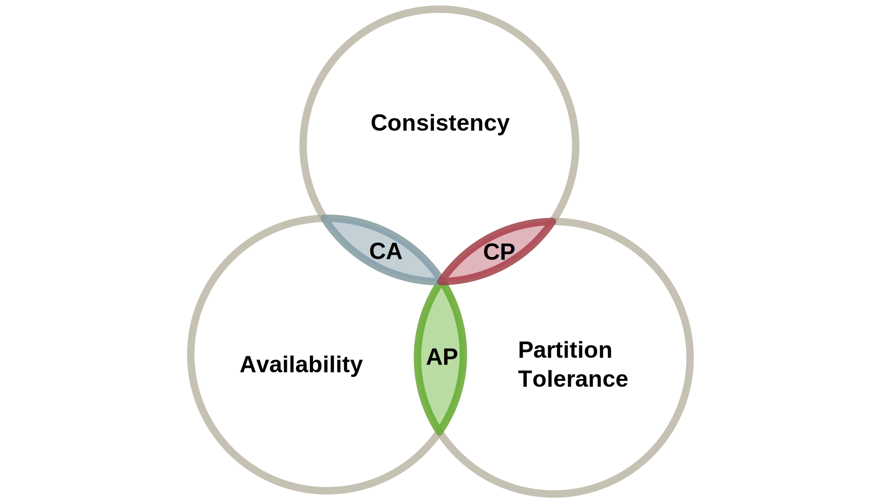

# 并发和可扩展存储后端

在前几章中,我们建议尽可能避免使用状态。我们提出的 Web 服务器内部架构基于无共享的体系结构。在编程应用逻辑时,我们倾向于将共享可变状态的使用降至最低。然而,只有少数 Web 应用程序可以完全忽略任何形式的状态。无状态设计适用于验证或计算服务,以及其他一些应用程序。但实际上,几乎所有其他 Web 应用程序都需要某种持久状态作为整体应用程序的重要组成部分。在我们的架构模型中,我们将状态处理工作外包给了专用的后端服务。

在本章中,我们将考虑并发性和可扩展性对存储后端的影响。我们将阐述在**分布式数据库系统中保证一致性的挑战**,并介绍不同的一致性模型。然后我们将概述分布式数据库系统的一些内部概念,并描述它们如何处理复制和分区。最后,我们将介绍不同类型的分布式数据库系统并评估它们的特性。

分布式数据库系统的挑战
-----------------------------

在考虑大规模 Web 应用时,我们需要可扩展且支持并发的存储后端。所谓可扩展性,我们所追求的是可提高数据容量和读/写吞吐量。在我们的模型中,应用服务器需要并行处理大量请求。由于它们依赖后端存储系统,我们同样需要应对这一级别的高并发访问。

只有采用横向扩展机制,才能持续提高吞吐量和容量。即使使用专用硬件设备,单个数据库服务器的扩展也只能达到一定的负载水平。因此,我们需要一个并发分布式系统来实现可扩展的后端存储。

后端存储必须持久保存应用程序状态,因此在读写数据时,我们也期望数据保持一定程度的一致性。我们所面对的是一个分布式系统,必须预先考虑故障情况。即使单个节点发生故障,整个存储系统仍应无缝运行并保持可用性。同样,我们执行的存储操作是作为 Web 请求的一部分,因此要求操作的低延迟。

这些一般要求导致我们遇到分布式系统的一个重要障碍,即布鲁尔(Brewer)定理关于一致性、可用性和分区容错性之间的关联。

### CAP 定理

布鲁尔于 2000 年提出了 CAP 猜想[^Bre00],后被 Gilbert 和 Lynch[^Gil02]证实为定理。布鲁尔认为,分布计算相对容易,分布式系统的难点实际上在于持久化状态。此外,他提出了分布式系统的三个不同特性,它们之间存在内在关联。

**一致性**

一致性特性描述了分布式系统所有节点对数据的一致视图。也就是说,系统保证操作具有原子特性,并且对所有节点同时传播变更,从而产生相同的结果。

**可用性** 

该特性要求系统最终对每个请求作出响应,即使在发生故障的情况下也是如此。这对读写操作都是如此。在实践中,这一特性通常被简化为在合理的时间内作出有界响应。但是, Gilbert 和 Lynch 证实了这一定理甚至适用于无界的最终响应。

**分区容错性**

该特性描述了系统能够容忍节点间的消息丢失。分区是系统节点之间的任意分裂,导致中间完全失去消息。这影响了前面的两个特性。维护一致性的机制必须应对消息丢失。根据可用性特性,任何潜在分区的每个节点都必须能够响应请求。

布鲁尔定理的核心陈述如下:

> "对于任何共享数据系统,您最多只能获得这三个特性中的两个。"

我们已经看到,所有特性都是理想的。但任何实际系统都必须在这些特性之间进行权衡,至少放弃其中一个,如图 6.1 所示。因此我们有三种不同的组合,特征显著不同。

图 6.1：根据 Brewer 定理[^Bre00]，一个分布式系统可以同时保证的不同属性。

#### 一致性与可用性（CA）

遵循这一模型的分布式系统提供一致且可用的服务，但并不容忍网络分区。在分区发生时，这些系统可能变得不一致，我们将很快看到这一点。这种组合也被称为高可用性一致性。

采用这种方法的竞争者包括大多数传统的关系数据库管理系统。**复制**是实现高可用性一致性的重要机制，如**两阶段提交协议**等事务协议被用来确保一致性。分区可能导致所谓的“脑裂”场景，其中不同的分区由于隔离而产生冲突的副本。

从这种情况恢复需要某种共识协议。这反过来又会禁止节点在没有共识的情况下提供服务。因此，我们将我们的 CA 方法转化为 CP 方法，以牺牲可用性为代价。应对网络错误的不足之处使得 CA 方法不适合较大的分布式数据库系统。

#### 一致性与分区容忍性（CP）

在一致性和分区容忍性的交集处的分布式系统提供强一致性服务。即使在分区存在的情况下，也保证了一致性。然而，分区的节点在未与可能暂时无法达到的其他节点达成协议前，可能无法响应请求。因此，可用性不能总是提供。这种属性的组合也被称为**强制一致性**。

在实践中，当必须不惜一切代价执行一致性，并且系统仍然本质上是分布式设计时，这种方法很重要。例如，在银行应用程序中，所有账户的余额是一个主要约束条件。实现这种模型的数据库系统也常常基于关系数据库系统。即使在网络错误的情况下支持一致状态，需要使用复杂的算法进行法定人数（Quorum）和多数决策（Majority decisions）。解决共识的一种协议就是 Paxos 协议 [^Lam98]。

#### 可用性与分区容忍性（AP）

始终可用且能容忍分区的分布式系统,即使在发生分区时也能维持其服务。然而,在这种情况下,可访问的节点可能会持有(暂时)不一致的状态。因此,这种特性的交集也被称为**最终一致性**。

从数据和状态的角度来看,牺牲强一致性保证乍一看似乎令人质疑。然而,许多应用程序确实可以容忍延迟的一致性特性,只要能够不惜一切代价保证可用性。在这种情况下,在开发过程中要时刻牢记最终一致的数据可能会在应用层面造成潜在的问题。遵循这种方式的著名示例有 DNS 或 Web 缓存。过时的数据(如主机映射或缓存响应)在一段时间内是可以接受的,但最终最新版本的数据会传播并清除旧条目。

总的来说,分布式系统需要在可用性、一致性和分区容忍性之间进行权衡。对于某些应用场景,牺牲强一致性以换取较高的可用性和分区容忍性是可以接受的,但开发人员需要意识到这种最终一致性可能带来的潜在问题,并在应用层采取相应的措施。

#### 对 CAP 定理的批评和一个替代模型

随着 NoSQL 运动的开始和对最终一致数据存储的兴趣增加，CAP 定理受到了一些批评。CAP 定理的一个核心问题来自于只针对网络故障的简化错误模型。数据库社区的成员如 Stonebraker[^Sto10] 对网络错误的答案过早地放弃一致性提出了质疑。

Abadi 指出了 CAP 定理的其他不足，即可用性和一致性的不对称性，以及一致性和可用性之间的一般化权衡 [^Aba10]。根据 Abadi，这在考虑没有分区的系统时变得明显。因此，Abadi 提出了一个替代模型：PACELC。它可以用来描述一个系统，在分区（P）的情况下，是专注于可用性（A）还是一致性（C），以及一个系统其它（E）情况下是专注于延迟（L）还是一致性（C）。因此，系统现在可以更精确地被分类。例如，最终一致的系统（CAP 中的 AP）可以被划分为 PA/EL 或 PA/CL 系统，提供更多关于在没有分区的情况下的常规操作模式的细节。

### 一致性模型

我们已经了解到，一致性、可用性和分区容错性无法同时在分布式系统中得到保证。从大规模 Web 架构的角度来看，这主要对存储后端很重要，因为这些组件持久地保存我们的应用状态。在构建大型 Web 架构时，我们必须在记住前述限制的同时选择存储组件。一致性是我们应用逻辑的最主要约束，因为它决定了我们期望从数据库系统中得到的一致性类型。因此，我们需要考虑不同的一致性模型及其对应用的影响。我们将审查对我们的应用来说最重要的两种主要一致性模型，我们的应用是数据库的客户端。

虽然以下两种模型通常是彼此的对立面，但值得注意的是，Brewer 提到它们实际上形成了一个光谱（spectrum）。因此，有一些方法可以在两者之间进行权衡。一些分布式数据库系统允许通过配置参数对一致性权衡进行微调。此外，大规模 Web 应用通常可以将数据存储要求划分为功能组。例如，电子商务网站可以容忍对产品评分和评论的宽松一致性保证，而对库存商品和订单则要求更强的一致性。

#### ACID

RDBMS 是目前大多数应用程序（包括网络应用程序）使用的主要数据库系统。在对数据进行操作时，它们的数据模型和内部结构与事务行为密切相关。不过，事务行为并不只与 RDBMS 有关，也可用于其他系统。一组属性描述了数据库事务通常为维护数据有效性而提供的保证 [^Hae83]。

**原子性**

该属性决定了事务是否以“全有或全无”的方式执行。事务可以是单个操作，也可以是一系列操作或子事务。因此，事务要么成功执行并改变数据库状态，要么数据库保持不变并终止所有操作。

**一致性**
就事务而言，我们将一致性定义为从一个有效状态过渡到另一个有效状态，在执行事务时绝不留下无效状态。

**隔离性**
隔离性概念保证了一个事务不会看到其他正在运行的事务的中间操作结果。本质上,这防止了并发事务之间的冲突。

**持久性**
耐久性属性保证了已执行事务的持久性。事务提交后，即使发生崩溃或其他故障，事务的结果（如状态变化）也会被保留。

严格遵循 ACID 原则会产生一个执行顺序,其效果等同于纯串行执行。换句话说,总是存在一个等价的串行事务顺序,代表了完全相同的状态。很明显,确保可串行化的顺序会对性能和并发产生负面影响,即使只使用单机也是如此。事实上,为了提高性能,有时会适度放松某些 ACID 特性。在事务之间使用较弱的隔离级别是加快事务执行速度和吞吐量的最常用机制。渐进式地,事务系统可以放弃可串行化,退而使用较弱的隔离级别,如**可重复读**、**已提交读**和**未提交读**。这些级别逐步移除范围锁、读锁和写锁(按此顺序)。因此,并发事务的隔离性降低,可以看到其他事务的部分结果,导致所谓的读现象。某些实现还通过不保证直接写入磁盘来削弱持久性特性。相反,提交的状态会先缓存在内存中,最终刷新到磁盘。这降低了延迟,但以牺牲数据完整性为代价。

一致性仍然是 ACID 模型的核心特性,不能轻易放松。各特性之间的相互依赖关系,使得移除任一特性都会影响其他特性。回顾 CAP 定理,我们已经看到了在必须容忍分区的分布式数据库系统中,一致性和可用性之间的权衡。如果选择遵循 ACID 范式的数据库系统,我们就无法再保证高可用性了。在分布式系统中使用 ACID,就需要分布式事务或类似机制来保留状态共享和分片到多个节点时的事务特性。

现在让我们重新思考,如果摆脱分布式事务的负担会怎样。由于我们讨论的是分布式系统,默认情况下我们没有全局共享状态。我们仅知晓每个节点自身过去的状态。没有全局时间、全局当下,由于操作发生在不同机器的不同时间,我们在系统层面上无法本质上具有原子操作。这削弱了隔离性,因此我们现在必须摒弃全局状态的概念。由于没有系统的即时全局状态,反过来也就危及了持久性。

总之,构建遵循 ACID 范式的分布式系统是一个巨大挑战。它需要所有相关节点之间复杂的协调和同步努力,并在整个系统内产生大量通信开销。分布式事务之所以被许多架构师惧怕,并非没有道理。尽管构建这种系统是可能的,但在这条路上,最初使用分布式数据库系统的一些动机已经减弱了。隔离性和可串行化与可扩展性和并发性是矛盾的。因此,我们现在将考虑一种替代的一致性模型,牺牲一致性来换取某些系统所需的其他特性。

#### BASE

这种替代的一致性模型基本上是一个系统所提供的可用性和分区容忍性特性的综合体,但牺牲了强一致性[^Pri08]。虽然 ACID 所提供的强一致性模型意味着对所有客户端和系统所有节点而言,写入操作后的所有后续读取都会得到新的、更新后的状态,但 BASE 模型则放松了这一点。相反,BASE 的弱一致性引入了一个不一致窗口期,在此期间更新的传播还无法得到保证。

**基本可用(Basically Available)**

即使在发生故障的情况下,系统的可用性也是 BASE 模型的一个重要特征。

**软状态 (Soft State)**
不提供强一致性,客户端在某些情况下必须接受过时的状态。

**最终一致 (Eventually Consistent)**
以“尽力而为”的方式提供一致性,尽快达到一个一致的状态。

BASE 的乐观行为代表了一种实现一致性的努力方法,同时也被认为更简单、更快速。可用性和扩展能力是以牺牲一致性为代价的主要目标。这对应用程序逻辑产生了影响,因为开发人员必须意识到过时数据的可能性。另一方面，在某些情况下，优先考虑可用性而不是一致性对应用逻辑也有好处。例如,ACID 系统的部分系统故障可能会拒绝写入操作,从而迫使应用程序以某种方式处理要写入的数据。反过来，即使在网络故障的情况下，BASE 系统也可能始终接受写入，但其他节点可能无法立即看到这些写入。宽松一致性模型的可适用性很大程度上取决于应用程序需求。银行应用程序对账户余额的严格约束与最终一致性自然不太适合。但是许多围绕社交对象和用户交互构建的 Web 应用程序实际上可以接受轻微的过时数据。当不一致窗口期的平均时间小于用户交互的请求/响应周期时间时,用户可能根本无法意识到任何不一致。

或者说，在应用程序开发中，最终一致性有几种更具体的变体，它们为开发者提供了某些类型的承诺，并允许在应用程序逻辑中更容易地推理松弛一致性。当提供因果一致性时,可能具有因果关系的操作会以相同的顺序被所有节点看到。读后写一致性(Read-Your-Writes Consistency)确保客户端在更新值之后,将永远看到新值,而不再看到旧值。会话一致性(Session Consistency)是读后写一致性的一种变体,它将这种行为限制在特定的客户端会话中。因此,它需要系统内部的会话关联性,但对于开发人员来说可能会有所帮助。单调读一致性(Monotonic Read Consistency)的保证是,在读操作之后,任何后续读取都不会返回更旧的值。类似地,单调写一致性(Monotonic Write Consistency)保证对单个客户端的写操作进行序列化。不提供这种保证会给应用程序开发人员带来严重问题,使得推理状态变得非常困难。

这些一致性可以相互组合或成为其他一致性的子集。提供单调读和读后己写两种一致性,为基于最终一致性开发应用程序奠定了合理的基础。

由于最终一致性包含了数据冲突的可能性,因此必须采用适当的解决机制。通常,冲突解决也是应用程序逻辑的一部分,而不仅仅由数据库系统提供。一般来说,冲突可以在读或写操作期间解决,也可以在后台异步解决,与客户端操作解耦。

## 分布式数据库系统内部原理

开发分布式数据库系统并不是一项简单的任务，它需要数据库领域和分布式系统领域的概念。在我们的简要概述中，我们将考察设计具有分布支持的数据库时所需的额外构建块。我们还列出了一些用于分布式数据库系统的复制和分区策略。

### 构建模块

Hellerstein 和 Stonebraker 提供了一个非常易于理解的传统数据库内部介绍[^Hel07]。这些内部包括索引和数据结构、I/O 处理组件、事务处理、并发控制、查询处理和客户端通信接口。由于这些概念对于数据库系统来说是常见的，我们将重点放在分布式数据库系统的一些必要构建模块上，包括事务管理、并发控制、数据版本控制、接口以及可伸缩的数据分区和并行数据处理。

#### 分布式事务管理

在非分布式场景中，处理并发事务通常更容易，因为所有操作都在单台机器上本地进行。分布式事务处理跨多个节点处理具有事务性行为的操作。因此，在分布式系统中，事务必须要么应用于所有参与节点，要么完全不应用于任何节点。由于网络错误、节点（部分）故障和非局部性的风险，实现分布式事务更加困难。分布式事务的一个基本组件是一个协调服务，它基于事务协议管理和协调所有参与者之间的事务。

常用的协议有 2PC 和 3PC[^Ske83]。2PC 将投票阶段和完成阶段分离，但它是阻塞的，并且不具备容错能力。3PC 通过额外的协调步骤解决了2PC 的缺点。然而，3PC 无法处理网络分区。

另一种选择是在分布式环境中使用基于法定人数(Quorum)的投票协议来提交事务 [^Ske82]。其基本思想是当大多数节点执行了事务时，将其标记为已执行。因此，必须获得中止法定人数或提交法定人数以终止事务。Paxos [^Lam98]协议系列提供了可用于基于法定人数投票的一致性解决方案。

#### 并发控制和数据版本控制

分布式数据库系统固有的并行性对于允许在不同节点上进行并发写操作的系统而言是一个问题。特别是，对网络分区的松散一致性保证和接受网络分区需要数据版本控制和控制并发操作的概念。

分布式并发控制机制通常可以分为悲观算法和乐观算法，并且可以根据使用锁、基于时间戳或混合算法进行分类。悲观算法通过对并发事务进行严格协调来提供冲突预防，而乐观算法则不期望发生常规冲突，并将冲突检查延迟到事务生命周期的末尾。基于锁的算法使用显式锁定操作以防止冲突。常用的基于锁定的算法包括传统的两阶段锁定[^Esw76]及其变体。还可以应用基于法定人数的投票，使用读和写入法定人数执行相应的操作[^Gif79]。

分布式数据库系统还利用基于时间戳的并发控制机制，例如 MVCC [^Ber81][^Ree78]。我们已经在第5章中将 MVCC 作为 STM 系统的底层实现。基于时间戳的机制使用逻辑时钟来标识数据变化或随时间变化的事务。逻辑排序允许推理操作的顺序并保护免受冲突。几个分布式数据库系统使用向量时钟[^Lam78]来对数据条目进行版本控制，以应对网络分区[^DeC07]。版本历史记录可以用来推理冲突并进行合并。

#### 数据接口和API

传统数据库系统有时完全嵌入到应用程序中，或者它们使用任意的访问协议。诸如 JDBC 或 ODBC 之类的软件组件抽象出具体的数据库协议并提供通用的 API。对于分布式数据库系统，远程访问接口是必需的。因此，通常从一开始就集成了用于通信和数据序列化的已建立的分布式技术。这些技术有助于应用程序集成和测试。

数据库调用和查询通常使用 RPC 调用或 HTTP 请求进行分派。RPC 方法使用像 Thrift [^Aga07]这样的框架绑定。使用序列化技术（如 [Thrift 自己的序列化](http://thrift.apache.org/)或 Google 的 [Protocol Buffers](http://code.google.com/p/protobuf/)）来交换数据。基于 HTTP 的 API 通常模拟了一些 REST 原则。对于序列化，使用 JSON、[BSON](http://bsonspec.org/)（二进制 JSON 表示）或 XML 等格式。尽管低级的 RPC 调用由于较少的开销而提供了稍微更好的性能，但使用基于 HTTP 的 API 引入了 HTTP 的概念，例如免费提供缓存。

#### 可拓展数据分区

图 6.2：一致散列将节点和数据项映射到同一个环中进行分区。左图显示一组数据项（灰色）映射到三个节点上。在右侧，新增节点 D 已加入系统，也被映射到环中。因此，重新分区只影响到环的一小部分。节点 D 接管了以前分配给节点 A 的两个数据项。

如果需要数据可扩展性且可用节点的数量发生变化，那么将大量数据分配到多个节点就会变得更加复杂。向外扩展意味着提供额外的节点，通常是在运行时首先提供。有时，当数据量减少时，缩回到更少的节点也很有趣。在缩小和扩大时，如何划分和分配数据需要适当的策略。

具有固定主机数量的传统设置通常通过在数据项（如密钥）上应用哈希函数来分配数据，然后将结果数乘以节点数量来计算负责该数据项的节点。这种策略简单明了，但当节点数发生变化时就会失效。由于分区密钥的改变，重新计算和重新分配所有项目是必要的，但在实践中并不合理。解决这个问题的一种方法是**一致性哈希** [^Kar97]。一致性哈希的基本思想是使用相同的散列函数将数据项和节点散列到一个共同的环中。如图 6.2 所示，该算法确定每个数据项必须由环中顺时针方向相邻的下一个节点存储。当环中添加新节点或节点离开环时，环中的一小部分会受到影响，只有这部分中的数据项必须重新分配。从本质上讲，一致性哈希是一种分区策略，可用于不同数量的节点，并提供一致的映射，防止节点数量增加时不必要的数据重新分配。

#### 并行数据处理

在分布式数据库系统中处理数据条目需要进行多项操作。例如，生成索引需要在所有数据条目和机器上执行相同的操作。在一些非关系型数据库系统中，实现索引生成是开发人员的任务，因此需要适当的编程模型来完成这种令人为难的并行任务。

*图 6.3：MapReduce 计算各阶段的示意图。map() 函数应用于所有项目，并产生中间结果。这些中间结果按键分组，使用 reduce() 函数进行合并。*

MapReduce 模型[^Dea08]是一种流行的方法，它受到函数式编程语言的启发。如图 6.3 所示，它将可能的大型数据集的并行处理分为两个步骤。`map` 函数获取数据条目并输出中间键值对。然后，按键对所有中间对进行分组。然后，对所有具有相同键值的中间对应用 `reduce` 函数，最后得到简单的值。分发、协调和执行由框架和数据库系统管理，因此开发人员只需提供映射和还原函数。利用这一原理，可以轻松完成大型数据集的计数或排序等任务。MapReduce 还可用于建立索引，可以使用已排序的中间键值对，也可以使用已排序的还原结果。

### 复制和分区策略

复制和分区是分布式数据库系统的必要概念。复制负责节点之间的数据分发。在复制的基础上，可以提高可用性，并部署故障切换机制以实现容错。复制还有助于扩展读取操作。分区可应对扩展大量数据的挑战。

#### 复制

分布式系统有多种复制形式，但并非所有形式都适用于以可用性和高并发访问为目标的数据库系统。复制机制可以是同步或异步、主动或被动的，它们具有不同的传播特性 [^Dol05][^Moi11]。

**同步复制**为操作提供原子语义，由所有运行的副本支持。这需要分布式事务协议进行协调。**异步复制**允许单个节点独立确认操作。其他节点最终会收到更新。但与同步复制不同的是，不能保证所有节点都能立即更新。异步复制可定期或非定期进行。

在**主动复制**中，所有节点都会接收并处理一个请求（如写操作），并协调它们的响应。**被动复制**则是由指定的主节点处理请求，然后更新其他节点。如果发生故障切换，则由辅助节点接管服务。

传播方面决定了如何处理来自客户端的读写操作，以及如何将更新传播到副本。在主从设置中，写操作由单个主站处理。由于网络应用发出的读取请求往往多于写入请求，许多设置都利用了这一固有特性，提供了一个主服务器和多个从服务器[^Sch08]。主服务器只负责发出写入请求，所有读取请求都会被负载均衡到其中一个从服务器上。显然，这种设置只能帮助扩展读操作，而不能扩展写操作。多主机设置允许多个节点接受写操作。这确实提高了写操作的可扩展性。不过，这需要冲突管理策略，因为对相同数据的同时写入可能会导致不一致。基于法定人数的系统[^Gif79]允许微调读取操作必须访问多少个副本、存储数据的副本数量以及必须确认更新操作的副本数量。这三个参数直接影响一致性和容错性的强度。在图 6.4 中，我们可以看到两种用于网络应用程序的复制策略示例。

*图 6.4：网络应用程序后台的两种复制设置。在左侧，我们可以看到 MySQL 经常使用的主从设置。主站处理写入，并异步更新从站。读取请求则由从属设备进行负载均衡。右侧显示的是 CouchDB 常用的复制设置。多个主站处理所有请求，并执行可能需要解决冲突的异步合并复制。*

常见的复制策略包括快照复制、事务复制、合并复制和基于语句的复制 [^Moi11]。快照复制基于定期复制所有数据条目。然后将这些快照转发并应用到副本上。事务复制采用事务行为，利用服务器之间的分布式事务进行更改。合并复制允许分区容错和离线节点，因为它能在节点最终可用时同步数据。冲突解决策略是处理冲突变更所必需的。基于语句的复制会将数据库查询转发到副本。读取查询可转发到单个实例，而包括写入操作在内的查询则会转发到所有实例。

#### 分区

有不同的分区方法可用于扩展大量数据：功能分区、垂直分区和水平分区 [^All08][^Sch08]。**功能分区**将应用数据中互不依赖的不同部分分开。例如，客户数据、产品数据和库存数据不仅存储在不同的表中，还可以存储在不同的数据库节点实例上。**垂直分区**的目标是数据分区，即把复杂的数据行有效地分配到表中。归一化和去归一化是垂直分区的典型机制。例如，“行拆分”将单个表拆分为多个表，从而将经常变化的列与静态列分开。这种拆分也能提高性能。**水平分区**（也称为分片）可解决表中存在大量行的问题。现有的表不是跨列分割现有的行，而是分割成几个结构上等同的表，并对行进行分区。虽然分区在很多情况下都能提高性能，并使大量数据更易于管理，但它也有一些缺点。要在分区数据集上提供一致的逻辑视图，往往需要在应用层面上进行多个连接操作，甚至是合并操作。因此，查找纵向和横向分区往往并非易事，需要具体了解应用程序如何访问和使用数据。

分区的设计会严重影响查找和检索数据的性能。因此，使用的分区策略会影响系统。分区通常使用分区键来实现，该键将行分配给分片。当使用哈希分区时，应用于键的哈希函数的结果会说明应使用哪个分区。列表分区提供了键到分区的固定映射。类似地，范围分区将数字范围分配给分区。不同标准的组合称为复合分区。例如，前面提到的一致散列机制可以视为散列和列表分区的组合。

虽然我们使用表、行和列来解释分区，但大部分概念也适用于非关系型数据库系统。完全基于键的存储组织使这一概念更加明显。

复制、数据分区和分片代表了正交概念，它们之间存在部分矛盾。然而，在大型数据库系统中，所有这些概念都是不可避免的基本机制。否则，系统将无法同时接受海量数据和同步读/写请求、处理故障或提供低延迟响应。因此，在实践中需要慎重权衡。

## 分布式数据库系统的类型

本节列出了用于大型网络应用程序的主要数据库系统类型。对每种类型的一般概念进行了描述，并介绍了一种示例产品。

### 关系数据库管理系统

最常见和最主要的数据存储模型是基于关系模型的思想，由 Codd [^Cod70] 在 70 年代初提出。该模型将数据存储为元组，形成一个有序的属性集。反过来，关系由元组集组成。就关系数据库系统而言，一个元组是一行，一个属性是一列，而一个关系则构成一个表。表是使用静态、规范化的数据模式定义的，不同的表可以使用外键进行引用。SQL 已成为关系数据的通用数据定义、操作和查询语言（如 SQL 99 [^Eis99]）。几乎所有关系数据库管理系统都采用了这种语言。关系数据库的实现通常依赖于事务和锁定机制的支持，以确保原子性、隔离性、一致性和持久性。这些特性对于关系模型来说至关重要，而且由于参照完整性和数据一致性问题而无法去除。

随着时间的推移，RDBMS（尤其是商业应用）的巨大成功导致许多部署对可扩展性的要求越来越高。这不仅包括用户负载、并发查询和查询计算复杂性方面的可扩展性，还包括纯数据负载方面的可扩展性。传统的扩展方法是使用更好的硬件设备，在一定时间内可以满足进一步增长的需求。但很快就会发现，迟早也要考虑向外扩展[^Rys11]。

ACID 范式与分布式系统相结合的影响使得基于关系模型构建分布式数据库系统变得非常困难。这就需要使用复杂的机制，如分布式事务，而许多开发人员都害怕这种机制，这在大多数情况下是有道理的 [^Hel09][^Alv11]。强制执行 ACID 属性需要高昂的复杂性成本，实际上，它们会迅速阻碍低延迟和高可用性。尽管复制，尤其是分区为扩展提供了基本工具，但分布式连接的概念却让分布式变得如此痛苦。单实例数据库中的连接操作可以通过数据本地性得到有效处理。在分布式数据库系统中，连接可能需要大量数据在节点之间复制，以执行连接操作所需的表扫描。这种开销在许多情况下使得这样的操作变得不可用。然而，连接操作是关系数据模型的固有特性，不能轻易放弃。另一方面，关系模型的成熟度和几十年的经验使得它仍然值得花费特别的努力和应用复杂性来扩展现有的关系系统，正如 Rys [^Rys11] 所概述的那样。

除了商业数据库领域的大公司，MySQL 也是一个不错的开源 RDBMS，在网络应用中非常流行。它支持多个后端存储引擎、广泛的 ANSI SQL 99 [^Eis99] 子集和多个查询扩展。许多网络应用主要在读取并发性和用户负载的可扩展性方面苦苦挣扎。因此，MySQL 提供了一种简单而强大的策略，即使用主服务器架构和复制。传入的查询会根据查询类型转发到实例。只读操作（即 `SELECT`）会被负载均衡到其中一个从站，而包含写操作的所有其他操作都会被转发到主站。然后，更新从主站异步复制到从站。这消除了主站不必要的负载，有助于扩展读操作。显然，这并不能扩展写操作。主从设置可以通过分区策略和更复杂的复制设置进一步扩展[^Sch08]。

MySQL Cluster 也是 MySQL 的一种集群变体。它基于节点的无共享架构，使用同步复制和自动水平数据分区。节点可以是用于存储的数据节点，也可以是用于集群配置和监控的管理节点。由于分布式设置的问题，与普通 MySQL 实例相比，MySQL 群集的功能[非常有限](http://dev.mysql.com/doc/refman/5.1/en/mysql-cluster-limitations.html)。

### 非关系型数据库管理系统

分布式非关系型存储系统种类繁多。我们概述了大规模网络应用中最流行的四种类型，当然还有很多其他类型，包括 RDF 存储、元组存储、对象数据库或基于网格的存储。

#### 键/值存储

基于键/值的存储系统的概念由来已久，它与许多编程语言中的哈希表或映射概念有关。这些存储系统只允许记录包含键和值的元组。键唯一标识一个条目，而值则是任意的数据块，在大多数情况下对数据库来说是不透明的。为了提供分布性和可扩展性，键/值存储应用了分布式哈希表的概念 [^Tan06]。键/值存储的简单数据模型提供了良好的可扩展性和性能。但是，查询机会通常非常有限，因为数据库只将键用于索引。

基于键/值原则设计的一个非常著名的存储系统是亚马逊的 Dynamo [^DeC07]。它结合了其他几种技术，提供了一种始终允许写入，但读取时可能返回过时结果的数据库系统。在分区和应用级冲突解决的情况下，这种最终一致性是通过向量时钟进行版本控制来解决的。

[Redis](http://redis.io/) 是一种开源的键/值存储，在内存中工作，但支持可选的持久性。作为一种先进的键/值存储，它为值提供了一个数据模型，并集成了发布/订阅消息通道。键/值元组的持久性可以通过快照或日志来实现。Redis 支持主从复制，可以级联，形成复制树。

#### 文档存储

文档存储与键/值存储类似。不过，它们需要使用 XML 或 JSON 等格式的结构化数据作为值。这些值被称为文档，因此得名。虽然文档使用的是结构化格式，但通常没有固定的模式定义。因此，具有复杂、不同结构的不同文档可以存储在同一个数据库中，而且文档的结构会随着时间的推移而变化。与键/值存储相比，文档存储允许更复杂的查询，因为文档属性可用于索引和查询。

[CouchDB](http://couchdb.apache.org/) 是一种流行的开源文档存储。它由 Erlang 编写，使用 JSON 作为文档格式。CouchDB 仅提供基于 HTTP 的接口，其灵感来自 REST。它使用不同的 HTTP 方法对文档进行创建/读取/更新/删除操作和查询操作。CouchDB 使用基于 MapReduce 的函数为所有文档生成索引。这些函数也是用 JavaScript 编写的，允许开发人员在迭代每个文档的任意复杂结构时生成索引。CouchDB 的一个特殊功能是其强大的复制功能。CouchDB 提供双向复制、复杂的多主复制，并专为离线使用和后期数据同步而设计。由于复制和并发写入可能会导致冲突，CouchDB 采用了一种经过调整的多版本并发控制变体 [^Ber81][^Ree78]。因此，冲突写入会导致文档变更的修订树，可以稍后处理或合并[^And10]。分片不是 CouchDB 的内置功能，但有外部解决方案可提供水平分区 [^And10]。

#### 宽列存储

宽列存储，有时也称为**稀疏表或面向列的数据库系统**，是一种按列而非按行存储数据的数据库系统。许多宽列存储的灵感来自于 BigTable [^Cha06]，这是谷歌设计的系统。BigTable 被描述为一个“稀疏的、分布式的、持久的多维排序映射”。这种映射的特点类似于键/值存储，但**键是有序的**。持久性和分布性是分布式数据库系统的明显特征。多维和稀疏的特征更为重要，因为它们定义了宽列存储的本质。多维映射本质上是映射的映射，允许嵌套数据模型。这个概念也被称为列族。稀疏性描述了一行可以在每个列族中有任意数量的列，甚至根本没有列。

除了具有深层结构和稀疏性的不同数据组织外，面向列的存储对数据库行为也有几个影响。面向列的布局可加快聚合或基于列的搜索/过滤操作，从而提高数据访问过程中 I/O 操作的效率，这是面向列存储的一大优势。由于列顺序包含来自不同行的多个值，可以应用高效的压缩技术。

本质上，宽列存储允许有效地存储和查询非常大的结构化数据集。通过减少 I/O 开销，与面向行的系统相比，查询可以更快地执行，压缩减少了存储需求。因此，对于必须进行查询的数据仓库和大型数据集来说，宽列存储尤其有意义。然而，宽列存储也有几个缺点。面向列的导向增加了插入和更新操作的成本，尤其是在不对多个条目执行批量操作的情况下。单次插入/更新导致在分散的列中进行多个写操作。

Apache [Cassandra](http://cassandra.apache.org/) 是谷歌 BigTable [^Cha06] 的一个开源实现，也融合了亚马逊 Dynamo [^DeC07] 的几个设计原则，以实现容错和数据复制。Cassandra 最初由 Facebook 开发，但已作为开源发布。一个有趣的特性是其可调的一致性。通过选择法定数级别，可以精确选择一致性，范围从积极的最终一致性模型到强一致性的阻塞读取。

#### 图数据库

图数据库系统基于图论。它们使用图结构进行数据建模，因此节点和边代表并包含数据。节点通常用于表示主要数据实体，而节点之间的边则用于描述关系。这两种类型都可以注释属性。语义网(Semantic Web)[^BL01]的出现和基于位置的服务的日益普及使图形数据库受益匪浅。这两个领域都需要实体间具有多重关系的数据建模，这在关系数据库系统中变得非常麻烦。图数据库的一个显著优势是可以为某些查询高效地遍历数据集。例如，这允许快速查询两个节点之间的最短路径和其他众所周知的基于图的计算。与许多其他数据库概念不同，图数据库没有包含所有存储项的主索引，因为**图结构代表的是一种纯关联数据结构**。这就是为什么许多图形数据库采用外部索引来支持基于文本的搜索。图形数据库还可用于面向对象的持久化，因为节点和边的概念可应用于对象和引用。因此，图形数据库规避了传统的对象-关系阻抗失配问题[^Ire09]，当面向对象的数据存储在关系数据库系统中时，这种问题就会出现。

在可扩展性方面，图形数据库遇到了相当大的挑战。基于图的数据集分片意味着将图结构分割到不同的机器上。由于图是高度易变的结构，因此很难找到合理的分区，既能将图节点分配给可用的机器，又能最大限度地降低远程节点之间的遍历成本。

流行的 Java 开源图数据库是 [neo4j](http://neo4j.org/)。它提供了图实体到 Java 对象的本地映射，以及这些结构的透明、基于磁盘的持久性。其他功能包括事务支持、内置图形遍历器和图形算法实现。除了作为 Java 应用程序的一部分进行本机集成外，neo4j 还为数据访问提供了基于 REST 的 HTTP 接口。它还提供复制和（有限的）分片支持。

## 总结

大型网络应用需要稳固的持久存储后端系统。基本要求是可用性、高性能，当然还有读写操作和数据量的可扩展性。单个数据库实例无法满足这些要求。相反，需要分布式数据库系统来支持容错、扩展和处理高并发读/写操作。

CAP 定理对分布式数据库系统提出了挑战，因为它排除了同时保证一致性、可用性和分区容错的可能性。在分布式系统中，故障是无法避免的，而是必须预料到的，因此分区容错几乎是强制性的。因此，网络应用程序需要在严格的一致性和高可用性之间进行权衡。传统的 ACID 模式倾向于强一致性，而另一种 BASE 模式则倾向于基本可用性和最终一致性。虽然确切的一致性要求取决于实际的应用场景，但一般来说，使用其中任何一种方法开发网络应用都是可行的。不过，应用程序必须了解所使用的一致性模型，尤其是在选择了宽松保证且必须容忍的情况下。

分布式数据库系统的内部结构结合了传统数据库概念和分布式系统机制，因为数据库是由多台通信机器组成的。这包括基于向量时钟的共识算法、分布式事务或修订算法。复制是可用性和容错性的重要特征。分区可满足处理大量数据并将其分配到不同物理节点的需要。

关系数据库系统是围绕关系数据元组和事务操作的概念而建立的。虽然这种模式适合许多业务应用并可用于各种场景，但还有其他数据库概念，它们具有不同的特点和自身的优势。这些概念包括简单的键/值数据组织、宽松或无模式定义、面向列的表对齐或使用图作为底层数据结构。

[^Bre00]: https://dl.acm.org/doi/10.1145/343477.343502
[^Gil02]: https://dl.acm.org/doi/10.1145/564585.564601
[^Lam98]: https://dl.acm.org/doi/10.1145/279227.279229
[^Sto10]: https://cacm.acm.org/blogcacm/errors-in-database-systems-eventual-consistency-and-the-cap-theorem/
[^Aba10]: http://dbmsmusings.blogspot.com/2010/04/problems-with-cap-and-yahoos-little.html
[^Hae83]: https://dl.acm.org/doi/10.1145/289.291
[^Ske82]: https://dl.acm.org/doi/10.5555/867558
[^Ske83]: https://dl.acm.org/doi/10.1109/TSE.1983.236608
[^Gif79]: https://dl.acm.org/doi/10.1145/800215.806583
[^Ber81]: https://dl.acm.org/doi/10.1145/356842.356846
[^Ree78]: https://dl.acm.org/doi/10.5555/889815
[^Kar97]: https://www.cs.princeton.edu/courses/archive/fall09/cos518/papers/chash.pdf
[^Dea08]: https://dl.acm.org/doi/10.1145/1327452.1327492
[^Dol05]: DOLLIMORE, Jean; KINDBERG, Tim COULOURIS, George: *Distributed Systems: Concepts and Design (4th Edition)*, Addison Wesley (2005)
[^Moi11]: https://www.researchgate.net/publication/49607406_Database_Replication_A_Survey_of_Open_Source_and_Commercial_Tools
[^Sch08]: https://www.oreilly.com/library/view/high-performance-mysql/9780596101718/
[^Cod70]: https://dl.acm.org/doi/10.1145/362384.362685
[^Rys11]: https://dl.acm.org/doi/10.1145/1953122.1953141
[^Eis99]: https://dl.acm.org/doi/10.1145/309844.310075
[^Alv11]: https://www.cidrdb.org/cidr2011/Papers/CIDR11_Paper35.pdf
[^Hel09]: https://arxiv.org/abs/0909.1788
[^And10]: https://www.oreilly.com/library/view/couchdb-the-definitive/9780596158156/
[^Cha06]: https://dl.acm.org/doi/10.1145/1365815.1365816
[^DeC07]: https://dl.acm.org/doi/abs/10.1145/1323293.1294281?preflayout=flat
[^BL01]: https://www-sop.inria.fr/acacia/cours/essi2006/Scientific%20American_%20Feature%20Article_%20The%20Semantic%20Web_%20May%202001.pdf
[^Ire09]: https://www.researchgate.net/publication/221274260_A_Classification_of_Object-Relational_Impedance_Mismatch