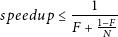

# 可伸缩性

可伸缩性是系统的一种非功能特性，它描述了系统适当处理不断增加（或减少）的工作负载的能力。根据 [Coulouris 等人]()的观点[Dol05]，“如果一个系统在资源和用户数量大幅增加时仍能保持有效，那么这个系统就是可伸缩的”。有时，可伸缩性是使用分布式系统的首要条件。此外，可伸缩性不能与原始速度或性能混为一谈。可伸缩性与其他非功能性要求（如可用性、可靠性和性能）既相互竞争又相互补充。

## 横向和纵向可伸缩性

扩展有两种基本策略--垂直扩展和水平扩展。在垂直扩展的情况下，单个节点会增加额外的资源。这样，节点就可以处理更多的工作，并提供额外的能力。额外资源包括更多或更快的 CPU、更多内存，或者在虚拟化实例中，底层机器的更多物理份额。与此相反，横向扩展为整个系统增加了更多节点。

这两种扩展方式对系统的影响各不相同。纵向扩展几乎可以直接加快系统速度，很少需要对应用程序进行特殊定制。不过，纵向扩展显然受到成本效益、物理限制和专用硬件可用性等因素的限制。横向扩展同样需要在系统内进行某种固有的分配。如果系统不能扩展到多台机器，就无法从这种扩展中受益。但如果系统支持横向扩展，理论上就可以扩展到数千台机器。这就是水平扩展对于大规模架构非常重要的原因。在这里，通常的做法是通过部署大量商品系统来实现水平扩展。此外，依靠低成本的机器和预测故障往往比高昂的专用硬件费用更经济。

考虑到网络服务器，我们可以采用这两种扩展机制。为网络服务器进程分配更多可用的系统资源可以提高其能力。此外，新硬件还能在高负载情况下提高速度。按照横向方法，我们设置了额外的网络服务器，并将接收到的请求分配给其中一个服务器。

## 可伸缩性和其他非功能性要求

在软件工程中，大型软件架构有几个重要的非功能性需求。我们将考虑与可伸缩性相关的运行时需求：**高可用性**、**可靠性**和**性能**。当系统能够提供其预期服务时，该系统是可用的。高可用性是指系统在一定时间内可用的要求。通常以正常运行时间的百分比表示，限制了系统不可用的最长时间。

可靠性是一个密切相关的要求，它描述了运行行为的时间跨度，通常用_故障间隔时间（MTBF）_来衡量。可伸缩性，即预测系统负载的增加，对这两项要求都提出了挑战。由于可伸缩性有限，系统可能会超载，这对可用性和可靠性都会造成损害。确保可用性和可靠性的基本技术是冗余和超额配置资源。从方法论的角度来看，这与横向扩展非常相似。不过，重要的是不要把可伸缩性和可用性混为一谈。为可用性和故障切换分配的备用资源不能同时用于实现可伸缩性。否则，只能同时保证一种需求。

软件架构的性能可以有多个维度，如**短响应时间（低延迟）**、**高吞吐量**和**低利用率**。同样，应用程序负载的增加可能会对需求产生负面影响。除非应用程序在设计时就考虑到了可伸缩性，并且有有效的扩展选项，否则在负载情况下性能可能会大幅下降。

请注意，在大多数网络架构方案中，上述所有要求都是可取的。但是，特别是在资源有限的情况下，必须对其中的某些要求进行权衡，而忽略其他要求。

## 可伸缩性与并发性

可伸缩性和并发性之间的关系是双重的。从一个角度来看，并发性是使应用程序具有可伸缩性的特征。负载增加与应用程序内部的并发性和并行性增加形成对立。通过并发性，应用程序可以保持运行并充分利用底层硬件。也就是说，将应用程序的执行分配到多个可用的 CPU/核心中，实现扩展。

虽然重要的是区分性能提升和可伸缩性，但我们可以应用一些规则来指出并行性对可伸缩性的积极影响。某些问题在有更多资源可用时可以更快地解决。通过加快任务的执行，我们能够同时完成更多的工作。当工作由小型、独立的任务组成时，这种方法尤其有效。

现在我们来看一下描述并行执行加速的基本定律。[Amdahl 定律]()[Goe06]（如方程2.1所示）描述了在并行执行的假设下，当向系统添加资源时可以期望的系统最大改进。其中的关键点是串行和并行子任务的比率。`N` 表示可用的处理器（或核心）数量，`F` 表示要串行执行的计算的比例。

需要注意的是，就网络服务器而言，可并行化的任务占主导地位。然而，高度交互和协作的网络应用要求请求之间加强协调，从而削弱了请求的孤立并行性。

从另一个角度看，并发机制本身也具有某种可伸缩性。基本上，这是支持越来越多的并发活动或执行流的能力，内部并发模型的表示流程和与底层概念（如线程）的相应映射。就我们的考虑而言，将传入的 HTTP 请求与此类活动联系起来也很有趣。或者更准确地说，我们如何将请求分配给并发的语言原语，以及这对网络应用程序在高负载下的可伸缩性意味着什么。

## 网络应用程序和架构的可伸缩性

如何从容应对增长是网络应用程序和架构在可伸缩性方面面临的主要挑战。这包括请求数量、流量和存储数据的增长。一般来说，增加负载是一个有意的目标，表明应用程序的使用量增加。从架构的角度来看，我们需要所谓的负载可伸缩性。这就是使其资源适应不同负载的能力。可伸缩的网络架构在设计时还应考虑到便于修改和升级/降级组件。

# 总结

我们已经看到，[万维网](www.md)是一个由相互连接的超媒体资源组成的分布式系统，它以 URI、HTTP 和 HTML 等超文本文档格式为基础。万维网的持续成功将基于[网络的应用程序](webapp.md)推到了风口浪尖。浏览器正在成为计算机中使用最多的本地应用程序，通过网络提供对大量不同应用程序的访问。即使在移动领域，专为移动使用而设计的网络应用程序也成功地挑战了本地移动应用程序。

为数百万用户设计的网络应用程序面临着非同寻常的挑战，包括合理处理固有的并行性和强大的扩展能力。

因此，[并发性](concurrency.md)不仅仅是网络架构的一个特征。它也是编程和实施大规模网络应用程序时必须遵循的重要原则，以便充分利用硬件能力。由于并发编程并非易事，我们需要适当的抽象和可用的编程模型。

大型网络架构对[可伸缩性](#可伸缩性)的要求迫使我们从一开始就考虑增长问题。以后提供的额外资源应能最大限度地提高应用程序的性能和功率。由于单个节点的纵向可扩展性有限，我们必须考虑到横向增长，这也会带来强制性分布。