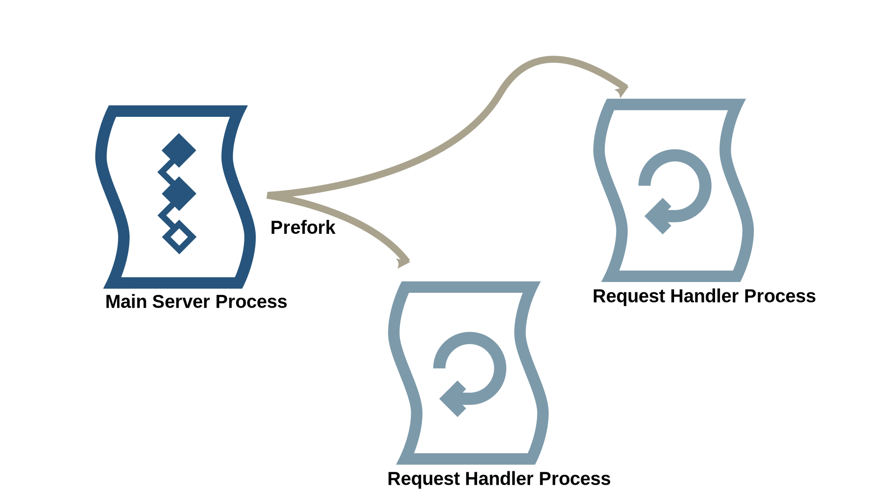
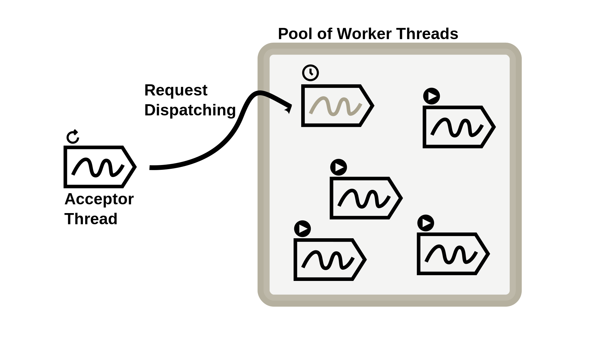
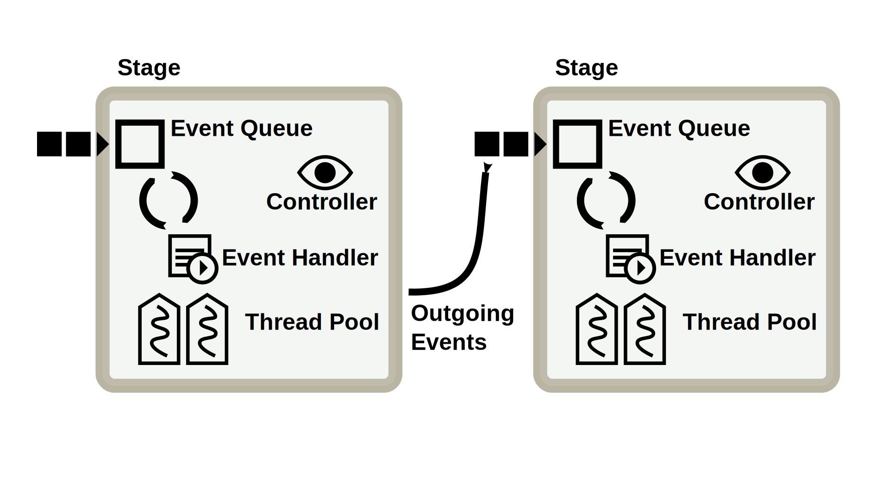

# 高并发网络架构

在这一章节，我们将深入探讨在一个网络服务器内处理众多连接时并发性问题的细节。根据我们架构模型的描述，请求处理过程与应用逻辑是分开的。因此，本章不涉及动态内容的生成，这个主题将在第5章进一步探讨。从网络服务器的视角来看，不同请求之间无需相互协调。但如果应用层面的请求之间有依赖关系——比如，一个长时间轮询的请求在等待某个应用事件，而另一个请求恰好触发了这个事件——这种情况需要在我们的应用服务器模型中得到处理。

本章将概述高性能网络服务器面对海量并发连接时遇到的并发挑战。然后，我们将了解不同的服务器架构是如何利用各种编程模型来管理并行处理、并发性以及 I/O 操作的。最终，我们将对比两种主流的并发模型——基于线程的模型和基于事件驱动的模型，以便更全面地理解它们的差异和应用场景。

## 概述

本章我们要解决的主要问题是在编程模型中将连接/请求正确映射到并发执行流。由于我们的目标是处理多个并行的 HTTP 请求，这主要涉及高度 I/O 绑定的操作。在 Web 基础设施方面，我们希望确保我们的软件实现不会轻易成为瓶颈，并在每个部署的服务器上在负载下实现高硬件资源利用率。在请求/响应和连接处理方面，有几个有趣的指标可以描述服务器的性能：

- 请求吞吐量（#/秒）
- 原始数据吞吐量（Mbps）
- 响应时间（毫秒）
- 并发连接数（#）

此外，还有以下性能统计数据需要在服务器的机器上观察：

- CPU利用率
- 内存使用情况
- 打开的套接字/文件句柄数
- 线程/进程数

重新表述我们的问题，我们希望尽可能并行处理尽可能多的请求，尽快完成，并且使用尽可能少的资源。换句话说，资源利用应该随着工作量的增加而扩展。

### 请求处理工作流程

根据我们在前一章中概述的 Web 服务器要求，我们可以将以下步骤列为处理请求的最小工作流程。附加功能，如请求日志记录或缓存，有意被省略。

1. *接受传入请求* - 在新的 HTTP 连接的情况下，首先必须建立底层的 TCP 连接。
2. *读取请求* - 需要对所有请求进行原始字节的读取（I/O 绑定），然后解析实际的 HTTP 请求（CPU 绑定）。如果请求包含实体，例如 POST 参数或文件上传，则还必须读取此附加内容。根据实现方式，Web 服务器要么缓冲实体直到完全加载，要么直接将其传输到应用服务器。前者允许内容卸载，对于慢速连接很重要，后者由于减少了延迟而很有意思。
3. *将请求分派到应用层* - 根据我们的架构模型，解析后的请求随后被发送到应用服务器。我们使用解耦的组件，因此这通常是一个基于网络的任务，使用消息传递（或其他替代方法，如 RPC）。如果是处理静态内容的 Web 服务器，则访问本地或远程文件系统。所有操作都是 I/O 绑定的。
4. *一旦可用，将生成的响应写入套接字* - 一旦生成响应（例如来自应用服务器的生成的 HTML 文件或来自文件系统的静态图像），就可以通过写入套接字将其返回给客户端。同样，Web 服务器可以缓冲响应，从而为应用服务器提供卸载。或者它直接将生成的响应传输给客户端。
5. *完成请求* - 根据通过请求/响应头和 HTTP 默认值协商的连接状态，Web 服务器要么关闭连接，要么从头开始等待客户端发送下一个请求。

### C10K问题

Kegel 在 1999 年发表了一篇具有里程碑意义的文章[[Keg06](https://berb.github.io/diploma-thesis/community/0_bibliography.html#Kegel2006)]，让“Web 服务器同时处理一万个客户端”成为可能，从而提出了*C10K问题*的概念。原始文章已经多次更新，并成为 Web 服务器可扩展性方面的重要资源。

他通过展示硬件在一定程度上可能不再是高并发连接的瓶颈来激发了他的思考。基于当时合理的硬件条件（即 500 MHz，1 GB内存，6 x 100Mbit/s），Kegel 认为同时处理 1 万个客户端完全可行，每个请求可达到 50KHz、100K字节和 60K位/秒 - 对于 4KB 的有效负载数据来说已经足够了。实际上，当时大多数服务器远未达到这个数字。然后，他研究了 Web 服务器的内部机制，特别评估了常见的 I/O 策略和线程模型。

C10K这个术语在十年后得到了进一步的强化，当时 *Urban Airship* 公司在单个节点上无法处理 50 万并发连接时遇到了困难。他们解决*C500k问题*的兴趣是基于他们的商业模式。为大量移动设备提供通知服务要求他们同时处理极高数量的空闲连接。

### I/O 操作模型

对于常规桌面应用程序，处理基于文件或网络的输入和输出通常是一项零星任务。对于我们的 Web 服务器来说，处理 I/O 操作是主要任务。操作系统提供了不同的 I/O 操作方式，我们将详细了解一下 I/O 操作模型。

在文献中，阻塞（blocking）和同步（synchronous）以及非阻塞（non-blocking）和异步（asynchronous）这两个术语通常可以互换使用，两者描述的概念非常相似。而且，这些术语在不同操作系统的不同层次上使用的含义也不同。为了至少在描述 I/O 操作时进行区分，我们将它们分开。

- **阻塞 vs. 非阻塞**

  使用这些属性，应用程序可以告诉操作系统如何访问设备。当使用阻塞模式时，I/O 操作不会在操作完成之前返回给调用者。在非阻塞模式下，所有调用都会立即返回，但只指示操作的调用状态或错误。因此，可能需要多次调用才能等待操作成功结束。

- **同步 vs. 异步**

  这些属性用于描述 I/O 操作期间的控制流程。同步调用保持控制，即在操作完成之前不返回。异步调用立即返回，允许执行其他操作。

综合这些模式，I/O 可产生四种不同的运行模式。有时，为了方便起见，会使用额外的软件层提供与实际底层模式不同的模式。

- **同步阻塞I/O**

  这是许多常规应用程序中最常见的操作模式。在这种情况下，I/O 操作是一个单独的操作，导致应用程序处于阻塞状态，直到操作完成并将数据从内核空间复制到用户空间（例如读取操作）。在内核级别上，实际的原始操作通常与其他操作多路复用。但对于应用程序本身来说，它代表了一个长时间运行的操作。这种模型不仅对开发人员来说不是直接的模型，而且还会导致应用程序进程在发出 I/O 操作时不需要 CPU 时间。这是操作系统调度程序在切换到其他进程时的方便时间。

- **同步非阻塞I/O**

  在这种模式下，应用程序以非阻塞模式访问 I/O 设备。结果，内核空间立即返回 I/O 调用。通常情况下，设备尚未准备好，调用响应指示应稍后重复调用。通过这样做，应用程序代码通常实现了忙等待行为，这可能非常低效。一旦 I/O 操作完成并且数据在用户空间可用（在读取操作的情况下），应用程序可以继续运行和使用数据。

- **异步阻塞I/O**

  令人惊讶的是，异步阻塞模型仍然使用非阻塞模式进行 I/O 操作。但是，与忙等待不同，此时使用专用的阻塞系统调用来通知 I/O 状态。有几个系统调用提供这样的功能，包括 `select`、`poll`、`epoll` 和 kqueue [[Ste03](https://berb.github.io/diploma-thesis/community/0_bibliography.html#Stevens2003)]。通过这样做，可以将多个 I/O 描述符传递给系统调用。当用于通知的阻塞系统调用的实现稳定且高效时，这是一种适用于高并发 I/O 的良好模型。

- **异步非阻塞I/O**

  这种 I/O 模型立即从 I/O 调用返回。完成后，会发出事件或执行回调。这种模型的有趣特点在于用户级别上没有阻塞或忙等待。整个操作转移到内核空间。这使得应用程序可以利用额外的 CPU 时间，同时在内核级别后台进行 I/O 操作。换句话说，应用程序可以将 I/O 操作与其他需要 CPU 的操作重叠，或者在此期间调度其他 I/O 操作。不出所料，这种模型在高并发 I/O 下也提供良好的性能。

|              | blocking     | non-blocking                    |
| ------------ | ------------ | ------------------------------- |
| 同步         | `read/write` | `read/write` using `O_NONBLOCK` |
| asynchronous | I/O 多路复用 | AIO                             |

表 4.1：Linux 中的 I/O 模型

这些模型只描述了 Linux 操作系统上的低级 I/O 操作。从更抽象的程序员角度来看，可以使用其他模型替代，但通常会带来一些性能损失。应用程序框架可以通过后台线程使用同步阻塞的方式提供 I/O 访问，但为开发人员提供基于回调的异步接口，反之亦然。

从现在开始，在大多数情况下，我们将同步阻塞的方法与其他三种方法区分开来。基于某种信号、通知或回调执行的方法，我们将其称为事件驱动或基于事件的方法。

## 服务器架构

我们已经看到了不同的套接字 I/O 模型，以及在静态内容的 Web 服务器中的文件 I/O 模型。现在，我们需要将 I/O 操作和 CPU 密集型活动（如请求解析和请求处理）合并到通用服务器架构中。

传统上有两种竞争的服务器架构，一种基于线程，另一种基于事件。随着时间的推移，出现了更复杂的变体，有时结合了两种方法。关于线程和事件哪种更适合[高性能 Web 服务器的争论]()[^Ous96][^2][^Wel01]已经持续了很长时间。经过十多年的发展，由于新的可扩展性挑战和向多核 CPU 的趋势，这个争论现在得到了加强。

在评估不同方法之前，我们介绍一般的架构，介绍正在使用的相应模式，并给出一些实际的例子。

### 基于线程的服务器架构

基于线程的方法基本上将每个传入连接与一个单独的线程（或进程）关联起来。通过这种方式，同步阻塞 I/O 是处理 I/O 的自然方式。这是一种常见的方法，得到了许多编程语言的良好支持。它还导致了一种直观的编程模型，因为处理请求所需的所有任务可以按顺序编码。此外，它通过隔离请求并隐藏并发性提供了简单的心智抽象。通过同时使用多个线程/进程，可以实现真正的并发。

在概念上，多进程和多线程架构共享相同的原则：每个新连接都由一个专用的活动处理。

#### 多进程架构

基于 UNIX 的网络服务器的传统方法是每个连接使用一个专用进程来处理连接 [^4]。这种模型也被用于第一个 HTTP 服务器，[CERN httpd](http://www.w3.org/Daemon/Implementation/)。由于进程的性质，它们迅速地隔离不同的请求，因为它们不共享内存。由于进程是相对沉重的结构，创建进程是一种昂贵的操作，服务器通常采用一种称为预派生（preforking）的策略。使用预派生时，主服务器进程在启动时预先派生出多个处理程序进程，如图4.1所示。通常，（线程安全的）套接字描述符在所有进程之间共享，并且每个进程都会阻塞等待新的连接，处理连接，然后等待下一个连接。

图 4.1：利用预分叉的多进程架构。启动时，主服务器进程会分叉出几个子进程，这些子进程随后将处理请求。各进程之间创建并共享一个套接字。每个请求处理程序都会等待新的连接，然后阻塞新的连接。

一些多进程服务器还会测量负载，并在需要时生成额外的请求。然而，重量级进程的结构限制了同时连接的最大数量。由于连接-进程映射导致的大内存占用会导致并发/内存之间的权衡。特别是在长时间运行的、部分非活动的连接（例如长轮询通知请求）的情况下，多进程架构对于并发请求的可扩展性有限。

流行的。Apache Web 服务器提供了一个基于进程预派生的强大多进程模块，Apache-MPM prefork。它仍然是基于 UNIX 的 Apache 设置的默认多进程模块。

#### 多线程架构

当合理的线程库变得可用时，出现了新的服务器架构，用轻量级线程取代了重量级进程。实际上，它们采用了每个连接一个线程的模型。尽管遵循相同的原则，多线程方法有几个重要的区别。首先，多个线程共享同一地址空间，因此共享全局变量和状态。这使得可以为所有请求处理程序实现共享功能，例如 Web 服务器内部的共享缓存用于可缓存的响应。显然，这需要正确的同步和协调。线程的另一个区别是它们更轻量级的结构，占用的内存更小。与整个进程的完整内存大小相比，线程只消耗有限的内存（即线程堆栈）。此外，线程在创建/终止时需要更少的资源。我们已经看到，在高并发的情况下，进程的维度是一个严重的问题。当将连接映射到活动时，线程通常是一个更高效的替代品。

图 4.2：使用多线程架构。专用的接受线程会阻塞新的套接字连接，接受连接并将其分派到工作池，然后继续工作。工作池提供一组线程来处理接收到的请求。工作线程要么在处理请求，要么在等待处理新请求。

实践中，常见的架构是在一组用于连接处理的线程之前放置一个单独的调度线程（有时也称为接收线程），如图4.2所示。线程池是限制服务器内最大线程数的常用方式。调度程序在套接字上阻塞以等待新的连接。一旦建立连接，连接将传递给传入连接的队列。线程池中的线程从队列中获取连接，执行请求并在队列中等待新的连接。当队列也有限时，可以限制等待连接的最大数量。额外的连接将被拒绝。尽管这种策略限制了并发性，但它提供了更可预测的延迟，并防止了过载。

Apache-MPM worker 是 Apache Web 服务器的一个多进程模块，它结合了进程和线程。该模块生成多个进程，每个进程管理自己的线程池。

#### 多线程架构的可扩展性考虑

使用每个连接一个线程的多线程服务器易于实现，并遵循简单的策略。可以使用同步阻塞 I/O 操作来自然地表示 I/O 访问。操作系统通过抢占式调度来重叠多个线程。在大多数情况下，至少一个阻塞 I/O 操作会触发调度并导致上下文切换，允许下一个线程继续执行。这是一个适用于良好并发性能的可行模型，也适用于必须执行合理数量的 CPU 密集型操作的情况。此外，多个 CPU 核心可以直接使用，因为线程和进程被调度到所有可用的核心。

在高负载下，多线程 Web 服务器消耗大量内存（由于每个连接的单个线程堆栈），而频繁的上下文切换会导致 CPU 时间的大量损失。间接的惩罚是增加了 CPU 缓存未命中的机会。减少绝对线程数可以提高每个线程的性能，但会限制最大同时连接的整体可扩展性。

### 事件驱动的服务器架构

作为同步阻塞 I/O 的替代方案，事件驱动的方法在服务器架构中也很常见。由于异步/非阻塞调用语义，需要使用其他模型来替代之前概述的每个连接一个线程的模型。常见的模型是将单个线程映射到多个连接。然后，该线程处理这些连接和请求的所有发生的事件。如图4.3所示，新事件被排队，线程执行所谓的事件循环--从队列中出队事件，处理事件，然后获取下一个事件或等待推送新事件。因此，线程执行的工作非常类似于调度程序的工作，将多个连接多路复用到单个执行流中。

图 4.3：这个概念模型展示了事件驱动架构的内部结构。单线程事件循环从队列中消耗一个又一个事件，并按顺序执行相关的事件处理程序代码。新事件由外部来源发出，如套接字或文件 I/O 通知。事件处理程序会触发 I/O 操作，最终产生新的事件。

处理事件要么需要为特定事件注册的事件处理器代码，要么基于提前与事件关联的回调的执行。线程处理的连接的不同状态通过适当的数据结构组织起来——要么是使用有限状态机显式地，要么是通过回调的延续或闭包隐式地。因此，遵循事件驱动风格的应用程序的控制流程在某种程度上是倒置的。与顺序操作不同，事件驱动程序使用一系列异步调用和回调的级联，这些回调在事件发生时执行。这种概念常常使得控制流程不那么明显，并且使调试复杂化。

事件驱动服务器架构的使用历史上依赖于操作系统级别上异步/非阻塞 I/O 操作的可用性，以及像 epoll 和 kqueue 这样的适合高性能事件通知接口。早期的基于事件的服务器实现，如 [Pai 等人的 Flash web 服务器](https://www.usenix.org/legacy/event/usenix99/full_papers/pai/pai.pdf)。

#### 非阻塞I/O多路复用模式

针对基于事件的 I/O 多路复用，已经出现了不同的模式，推荐用于处理高并发、高性能 I/O 的解决方案。这些模式通常解决网络服务处理多个并发请求的问题。

##### 反应器模式

[反应器模式](SCHMIDT, Douglas C.: Reactor: an object behavioral pattern for concurrent event demultiplexing and event handler dispatching, ACM Press/Addison-Wesley Publishing Co., New York, NY, USA (1995), 529-545)针对同步、非阻塞 I/O 处理，并依赖于事件通知接口。在启动时，遵循这种模式的应用程序注册一组资源（例如，一个套接字）和它感兴趣的事件（例如，一个新连接）。对于应用程序感兴趣的每个资源事件，必须提供一个适当的事件处理器——一个回调或钩子方法。反应器模式的核心组件是**同步事件解复用器**，它使用阻塞事件通知接口等待资源的事件。每当同步事件解复用器接收到一个事件（例如，一个新的客户端连接），它通知一个调度器并等待下一个事件。调度器通过选择关联的事件处理器并触发回调/钩子执行来处理事件。

因此，反应器模式将事件处理和多路复用的通用框架与应用程序特定的事件处理器解耦。原始模式专注于单线程执行。这要求事件处理器遵循非阻塞操作风格。否则，一个阻塞操作可以挂起整个应用程序。反应器模式的其他变体使用事件处理器的线程池。虽然这在多核平台上提高了性能，但必须考虑额外的协调和同步开销。

##### 前摄器模式

相比之下，[前摄器模式](https://www.dre.vanderbilt.edu/~schmidt/PDF/proactor.pdf)利用了真正的异步、非阻塞 I/O 操作，如 [POSIX AIO](http://www.kernel.org/doc/man-pages/online/pages/man7/aio.7.html) 所提供的接口。因此，前摄器可以被认为是之前看到的反应器模式的完全异步变体。**它包括对完成事件的支持**，而不是阻塞事件通知接口。一个主动发起者代表主应用程序线程，负责启动异步 I/O 操作。在发起这样的操作时，它总是注册一个**完成处理程序**和**完成调度程序**。异步操作的执行由异步操作处理器控制，实际上是操作系统的一部分。当 I/O 操作完成时，完成调度程序被通知。接下来，完成处理程序处理结果事件。

与反应器模式相比，一个重要的可扩展性特性是更好的多线程支持。完成处理程序的执行可以轻松地交给专用线程池。

#### 事件驱动架构的可扩展性考虑

单个线程运行事件循环并等待 I/O 通知对可扩展性的影响与之前概述的基于线程的方法不同。不将连接和线程相关联可以显著减少服务器的线程数——在极端情况下，减少到单个事件循环线程加上一些用于 I/O 的操作系统内核线程。这样我们就摆脱了过度上下文切换的开销，也不需要为每个连接分配线程栈。这在负载下减少了内存占用，并减少了 CPU 时间的浪费在上下文切换上。理想情况下，CPU 成为事件驱动网络应用程序的唯一明显瓶颈。在资源完全饱和之前，事件循环随着吞吐量的增加而扩展。一旦负载增加超过最大饱和度，事件队列开始堆积，因为事件处理线程无法匹配。在这种情况下，事件驱动方法仍然提供了充分的吞吐量，但由于过载，请求的延迟线性增加。这可能对于临时负载峰值是可以接受的，但持续过载会降低性能并使服务无法使用。一种对策是更加注重资源的调度和事件处理的解耦，正如我们很快在分析基于阶段的方法时看到的那样。

目前，我们仍然关注事件驱动架构，并将其与多核架构对齐。虽然基于线程的模型涵盖了基于 I/O 的和基于 CPU 的并发，但最初的基于事件的架构仅解决了 I/O 并发。为了利用多个 CPU 或核心，必须进一步适应事件驱动服务器。

一个明显的方法是在单个机器上实例化多个独立的服务器进程。这通常被称为 N-copy 方法，用于在具有N个 CPU/核心的主机上使用 N 个实例。在我们的案例中，一台机器将运行多个 web 服务器实例，并在负载均衡器上注册所有实例。一个不太隔离的替代方案是在所有实例之间共享服务器套接字，因此需要一些协调。例如，这种方法的一个实现是用于 node.js 的 cluster 模块，它克隆应用程序的多个实例并共享单个服务器套接字。

在架构模型中的 web 服务器有一个特定的特性——它们是无状态的，没有共享的组件。即使使用内部缓存来处理动态请求，也需要在服务器架构中进行几项更改。目前，可以接受具有单线程服务器和回调的顺序执行语义的更简单的并发模型作为架构的一部分。正是这种简单的执行模型使得单线程应用程序对开发人员具有吸引力，因为协调和同步的努力减少了，并且保证应用程序代码（即回调）不会并发运行。另一方面，这种特性从本质上阻止了在单个事件驱动应用程序内部利用多个进程。Zeldovich 等人已经用 [libasync-smp](https://www.usenix.org/legacy/publications/library/proceedings/usenix03/tech/full_papers/zeldovich/zeldovich.pdf) 解决了这个问题，这是一个利用多个进程和并行回调执行的异步编程库。简单的顺序编程模型仍然得以保留。**基本思想是使用令牌，即分配给每个回调的所谓颜色。具有不同颜色的回调可以并行执行，而具有相同颜色的回调则保证串行执行**。对所有未标记的回调使用默认颜色，使得这种方法向后兼容没有任何颜色的程序。

让我们用缓存扩展我们的 web 服务器，使用颜色来增加额外的并发。读取和解析新请求是顺序操作，但不同的请求可以同时处理。因此，每个请求获得一个不同的颜色（例如，使用套接字描述符），不同请求的解析操作实际上可以并行进行，因为它们被不同地标记了。在解析了请求之后，服务器必须检查所需的内容是否已经被缓存。否则，必须从应用服务器请求。**现在检查缓存是一个并发操作，必须顺序执行，以提供一致性**。因此，这一步为所有请求使用相同的颜色标签，指示调度程序始终串行运行这些操作，绝不并行。这个库还允许回调执行部分阻塞操作。只要操作没有用共享颜色标记，它就不会直接阻塞其他回调。该库由一个线程池和一组以颜色区分的事件队列支持。这个解决方案允许坚持传统的事件驱动编程风格，但在一定程度上引入了真正的并发。然而，它要求开发者正确标记回调。有时候，在事件驱动程序中推理执行流程已经很困难了，额外的努力可能会进一步复杂化这个问题。

### 综合方法

结合了线程和事件的方法，以及由于两种通用模型的缺点，导致了一些结合了两种特性的替代架构和库的出现。

#### 分阶段事件驱动架构（Staged Event-driven Architecture，SEDA）

Welsh 等人设计了一种形成性架构，称为 [SEDA](https://dl.acm.org/doi/10.1145/502034.502057) ，它结合了线程和事件来构建可扩展的服务器。作为一个基本概念，它将服务器逻辑划分为一系列定义良好的阶段，这些阶段通过队列连接，如图 4.4 所示。请求在处理过程中从一个阶段传递到另一个阶段。每个阶段都由一个线程或线程池支持，可以动态配置。

图 4.4：本图展示了 SEDA 的概念。在这个示例中，有两个阶段，每个阶段都有一个接收事件的队列、一个由线程池支持的事件处理程序和一个监控资源的控制器。各阶段之间的唯一交互是向管道中的下一阶段发送事件。

这种分离有利于模块化，因为阶段的流水线可以轻松地被更改和扩展。SEDA 设计的另一个非常重要的特性是资源意识和对负载的显式控制。每个阶段排队项目的大小和每个阶段的线程池的工作量提供了对整体负载因子的明确了解。在过载情况下，服务器可以调整调度参数或线程池大小。其他自适应策略包括流水线的动态重配置或有意的请求终止。当资源管理、负载内省和适应性与阶段的应用逻辑解耦时，开发条件良好的服务就简单了。从并发性的角度来看，SEDA 代表了每连接一个线程的多线程和基于事件的并发之间的混合方法。拥有一个线程（或线程池）出队并处理元素类似于事件驱动方法。使用多个具有独立线程的阶段有效地利用了多个 CPU 或核心，并趋向于多线程环境。从开发者的角度来看，某个阶段的处理代码的实现也更类似于传统的线程编程。

SEDA 的缺点是即使在最小负载的情况下，由于队列和阶段遍历也会增加延迟。在后来的[回顾](http://matt-welsh.blogspot.com/2010/07/retrospective-on-seda.html)中，Welsh 还批评了模块边界（阶段）和并发边界（队列和线程）的缺乏区分。这种分布触发了太多的上下文切换，当一个请求通过多个阶段和队列时。一个更好的解决方案是将多个阶段与公共线程池组合在一起。这减少了上下文切换并改善了响应时间。具有 I/O 操作和相对较长执行时间的阶段仍然可以被隔离。

SEDA 模型启发了几个实现，包括通用服务器框架 [Apache MINA](http://http//mina.apache.org) 和企业服务总线如 [Mule ESB](http://www.mulesoft.com/)。

#### 特殊用途库

其他方法关注了一般线程的缺点和特定可用（用户级别）线程库的问题。我们很快就会看到，线程的大多数可扩展性问题都与它们的库的不足有关。例如，von Behren 等人的 [Capriccio 线程库](https://dl.acm.org/doi/10.1145/1165389.945471)承诺通过解决主要线程问题为服务器提供可扩展的线程。广泛的上下文切换问题通过使用非抢占式调度来解决。线程要么在 I/O 操作上让步，要么在显式让步操作上让步。每个线程的栈大小是基于编译时之前的分析而限制的。这样就没有必要预先过度提供有界栈空间。然而，无限循环和递归调用的使用使得无法事先完全计算栈大小。作为一种解决方法，在代码中插入了检查点，以确定栈溢出即将发生并在这种情况下分配新的栈块。检查点在编译时插入，并且放置得当，以确保在两个检查点之间的代码内永远不会发生栈溢出。另外，应用了资源意识的调度，以防止颠簸。因此，监视 CPU、内存和文件描述符，并结合对线程资源使用的静态分析，调度被动态适应。

此外，还开发了结合线程和事件的混合库。[Li 和 Zdancewic](https://dl.acm.org/doi/10.1145/1273442.1250756)基于 Haskell 的并发单子实现了一个组合模型。编程语言 Scala 也提供了可以结合用于服务器实现的事件驱动和多线程并发。

|                                 | 基于线程              | 事件驱动                       |
| :------------------------------ | :-------------------- | ------------------------------ |
| **connection/request state**    | thread context        | state machine/continuation     |
| **main I/O model**              | synchronous/blocking  | asynchronous/non-blocking      |
| **activity flow**               | thread-per-connection | events and associated handlers |
| **primary scheduling strategy** | preemptive (OS)       | cooperative                    |
| **scheduling component**        | scheduler (OS)        | event loop                     |
| **calling semantics**           | blocking              | dispatching/awaiting events    |

表 4.2：基于线程的服务器架构与事件驱动服务器架构的主要区别

### 评估

到目前为止，我们已经考虑了构建并发 Web 服务器的不同架构原则。在为高并发使用实现服务器时，应该应用这些模型中的一个。然而，还有其他因素也会影响实现的实际性能和可扩展性。这包括编程语言、执行环境（例如虚拟机）、操作系统、可用的线程库以及用于 I/O 操作的可用手段（例如，对真正异步 I/O 的支持）。对于每种服务器架构，都可以实现可扩展的服务器实现——然而，实际要求各不相同。

[Pariag 等人](https://dl.acm.org/doi/abs/10.1145/1272996.1273021)进行了基于线程的、事件驱动的和混合管道服务器的详细性能导向比较。基于线程的服务器（knot）利用了前面提到的 Capriccio 库。事件驱动服务器（26#26server）被设计为支持套接字共享和使用 N-copy 方法的多处理器支持。最后，混合管道服务器（WatPipe）受到 SEDA 的极大启发，由四个阶段组成，用于服务 Web 请求。Pariag 及其团队然后对这三个服务器进行了测试和大量调优。最后，他们使用不同的场景对服务器进行了基准测试，包括故意的过载情况。以前的基准测试已经被用来推广[新的基于线程的或事件驱动的架构]() [^Pai99][^Wel01][^vB03a]，通常对新架构有明显的好处。Pariag 等人的广泛基准测试显示，只要进行彻底的调优和（重新）配置，所有三种架构模型都可以用于构建高度可扩展的服务器。结果还表明，使用异步 I/O 的事件驱动架构仍然比基于线程的架构有轻微的优势。

像 nginx（例如 GitHub、WordPress.com）、lighttpd（例如 YouTube、Wikipedia）或 [Tornado](http://www.tornadoweb.org/)（例如 Facebook、Quora）这样的事件驱动 Web 服务器目前非常流行，已经出现了几个遵循这种架构模式的通用框架。可用于 Java 的这类框架包括 [netty](http://www.jboss.org/netty) 和 MINA。

请注意，在本章中我们不进行自己的基准测试。Nottingham，HTTP 标准的编辑之一，撰写了一篇深入的总结，[解释了为什么即使是公正的服务器基准测试也是极其困难和昂贵的](http://www.mnot.net/blog/2011/05/18/http_benchmark_rules)。因此，我们仅专注于 Web 服务器的架构概念和设计原则，并将我们的考虑限制在 [Pariag 等人之前的结果](https://dl.acm.org/doi/abs/10.1145/1272996.1273021)。

## 线程与事件的案例

我们对服务器提出了一系列特殊要求，例如无状态。这不仅简化了实际实现，也在一定程度上影响了我们对线程与事件的考虑。在[第 5 章](concurrency-concepts-for-applications-and-business-logic.md)中，我们将从更广阔的视角关注并发编程。在本章的其余部分，我们将花一些时间仔细研究线程与事件的一般争论。这一讨论由来已久，很久以前就出现在操作系统领域。然而，高性能网络服务器一直是一个具有挑战性的话题，在此背景下，这一论点已被反复讨论过多次。

我们将介绍 Lauer 和 Needham 的二元论（duality argument），说明线程与事件之间的内在关系。然后，我们回顾了最近发表的一些文章，这些文章对这两种模式进行了比较，或为其中一种模式奔走呼号，但往往同时又把另一种模式涂黑。最后，我们对这两种模式持中立观点，并总结出它们的优缺点。

### 二元论

70 年代末，Lauer 和 Needham [^Lau79] 从进程、同步和通信的角度，对操作系统设计的两种主流编程模型进行了广泛的研究。更确切地说，他们比较了面向消息的系统和面向过程的系统。前者使用显式消息传递的少量进程，而后者则基于使用共享数据的大量小型进程。因此，面向消息的系统类似于事件驱动系统，而面向过程的系统则对应于基于线程的系统[^vB03a][^Li07]。他们的主要贡献是提出了三个重要观点：

1. 这两种模型互为对偶。用一种模型编写的程序可以直接映射到另一种模型的等效程序。
2. 这两种模型虽然使用不同的概念，提供不同的语法，但在逻辑上是等价的。
3. 如果使用相同的调度策略，用这两种模型编写的程序性能基本相同。

> 对偶：它描述了两个结构之间的一种特殊的对称关系。当说到两个模型或概念是对偶的，指的是它们之间存在一种可以通过某种转换互相映射的关系，而这种转换通常保持了一些基本的操作或性质不变。

因此，Lauer 和 Needham 提出了这两种模型的映射，从而可以面对这两种概念的构件。最重要的映射如表 4.3 所示。

| 基于线程                            |      | 基于事件                                |
| :---------------------------------- | :--- | :-------------------------------------- |
| monitor                             | ~    | event handler                           |
| scheduling                          | ~    | event loop                              |
| exported functions                  | ~    | event types accepted by event handler   |
| returning from a procedure          | ~    | dispatching a reply                     |
| executing a blocking procedure call | ~    | dispatching a message, awaiting a reply |
| waiting on condition variables      | ~    | awaiting messages                       |

表 4.3：基于线程和事件驱动概念的映射，基于 Lauer 和 Needham [^Lau79]，经过调整和重述以类似于事件驱动系统 [^vB03a][^Li07]。

在应用程序中使用这些模型之一的控制流程会生成一个独特的图，该图包含某些产生等待或阻塞的节点（例如，等待回复或等待程序返回）。这些节点之间的边代表在遍历图时执行的代码。根据对偶性论证，当实现等效逻辑时，基于线程的和事件驱动的程序产生相同的阻塞点，因此这些程序是对偶的。Von Behren 将这种图表示称为阻塞图 [^vB03a]。

Lauer 和 Needham 认为，通过替换概念并将程序从一个模型转换为另一个模型，逻辑不会受到影响，代码的语义内容因此是不变的。结果，他们声称两种概念模型是等价的，甚至在适当的执行环境下，两种模型的性能也是相同的。因此，他们建议选择正确的模型取决于实际的应用程序，通常情况下没有哪个模型更可取。

虽然这些一般概念被认为是可比的 [^vB03a][^Li07]，但对于这种映射，尤其是当它被应用于混合了其他编程概念的基于事件的系统时，也有一些批评。Von Behren [^vB03a] 指出 Lauer 和 Needham 忽视了基于事件的系统的协同调度，这是当今许多事件驱动系统的重要部分。Lauer 和 Needham 在他们的映射中也不允许任何形式的共享内存或全局数据。但事实上，许多事件驱动系统确实在少数地方使用了共享内存。

尽管有这些评论，对偶性论证通常允许我们在内在性能特性方面放松对两个系统的考虑。实际上，我们可以根据应用程序的实际需求，关注两种模型的适用性和合适性。此外，对偶性论证激励我们在性能和可扩展性方面质疑模型的实现，而不是模型本身。

接下来，我们将看一些支持一个模型或另一个模型的流行辩论，以及对每种模型的普遍批评的汇编。

### 线程案例

支持线程的人士认为，线程是大多数编程语言中占主导地位的顺序编程风格的自然延伸，用于提供并发性 [^vB03a][^vB03b][^Gus05]。从开发者的角度看，线程将要执行的工作映射到相关的控制流中。更准确地说，线程从任务本身的角度代表工作。这允许开发者在关注完成任务所需的顺序操作步骤的同时，开发并发代码。透明地执行阻塞操作和 I/O 调用使开发者免于处理低级调度细节。相反，他可以依赖操作系统和运行时环境。

线程是操作系统中众所周知且被理解的实体，并且是任何类型并行性的通用基本原语。线程也是利用真正的 CPU 并发的必要条件。因此，即使其他并发方法依赖于基于线程的实现，它们也会向开发者隐藏这一特征。

线程提供的抽象看起来简单，尤其是在任务大多是独立的且只共享有限状态时（参见多线程 Web 服务器），它显得尤为强大。线程还为并发应用程序提供了一个在语法上结构化的基本原语。

线程基系统的反对者列出了几个缺点。对于 Ousterhout 来说，他可能发表了最著名的反对线程的抨击 [^Ous96]，即使对于编程专家来说，开发正确的并发代码的极端困难是线程最有害的特征。一旦多线程系统在多个线程之间共享单一状态，协调和同步就变得必不可少。协调和同步需要锁定原语，这反过来又带来了额外的问题。错误的锁定会引入死锁或活锁，并威胁到应用程序的活性。选择正确的锁定粒度也是麻烦的来源。过粗的锁会减慢并发代码的速度，并导致顺序执行性能下降。相比之下，过细的锁增加了死锁/活锁的危险并增加了锁定开销。基于线程和锁的并发组件是不可组合的。给定两个不同的线程安全组件，它们的组合本身并不是线程安全的。例如，不知不觉中在多线程组件之间放置循环依赖可能会引入严重的死锁。

**Lee [^Lee06] 关注的是由于非确定性和抢占式调度，多线程代码缺乏可理解性和可预测性**。多线程似乎容易出错，并且非常难以调试。由多个线程的所有可能交织所导致的状态爆炸使得并发代码的合理执行分析几乎成为不可能。这主要是由抢占式调度的不可预测性引起的。因此，与 Von Behren [^vB03a] 的观点相反，Lee 认为线程确切地说不是并发执行流的好抽象。相反，线程的过于简化的抽象似乎是误导的，因为它假装代码的连续执行可能与任何实际的运行时行为都不匹配。

关于性能，我们已经了解到频繁上下文切换的缺点。同样，大量线程由于它们的线程栈需要大量内存。锁的使用产生了额外的开销。

作为回报，支持线程的阵营认为，上述提到的一些缺点实际上是由于糟糕的线程库实现和抢占式调度的本质造成的。

### 事件案例

支持事件的活动家，如 Ousterhout [^Ous96]，认为与基于线程的系统相比，事件驱动系统是高并发服务器的更合适基础。单线程事件循环的基本思想通过提供一个简单直接的并行模型来简化并发问题。

通过不使用阻塞/同步 I/O，可以重叠多个 I/O 操作，尽管只使用了一个线程。这使得 I/O 并行性成为可能，而不同时要求 CPU 并行性。这产生了多线程并发的假象，因为多个概念上的执行流似乎在同时发生（至少它们的 I/O 操作是这样）。事件处理程序代码和回调可以在没有状态并发访问的恐惧中开发。只要在回调中没有触发让步操作，回调的执行就保证是确定性的。这提供了确定性推理的感觉。调度成为一个显式操作，并且在应用程序本身内部发生。可以进行细粒度的调度调整，并可以考虑应用程序特定的要求。

事件和事件处理程序的使用产生了异步行为，这是一些开发者所青睐的。与提供一个隔离的顺序执行流的抽象不同，异步风格使 I/O 操作和 CPU 绑定操作之间的差异变得明显。

然而，对事件驱动系统也有严重的担忧。拒绝事件驱动系统的最常见原因是它们的编程风格。**事件循环和注册事件处理程序的概念产生了控制反转。代码不是以顺序操作组织的，而是以一组分散的事件处理程序和回调组织的。在非平凡的应用程序中，这导致了大量回调的连锁。Gustafsson 将事件循环顺序执行事件上的回调的概念称为 "延迟 GOTO" [^Gus05]。与提供更高抽象的线程相比，事件驱动系统因此看起来像是一种倒退。**

现有的顺序算法不能直接用于事件驱动系统。相反，每当触发 I/O 操作时，代码必须被分割并移动到不同的回调中，创建大型级联的回调链。

模糊的控制流通常伴随着在让步和恢复后保存和恢复状态的必要性。当使用不支持像闭包这样的缓解语言习惯的命令式、低级编程语言时，这一点尤其明显。线程可以将状态作为其线程栈的一部分独立于任何调度来存储。在事件驱动系统中，开发者有责任在事件处理程序之间处理和恢复状态。

线程会受到死锁或活锁的威胁，而单线程、事件驱动的应用程序则可能会被长时间运行、CPU 受限的回调、阻塞操作或拒绝让步的回调而受损。

虽然单线程事件循环模型适用于大多数 I/O 绑定的应用程序，但默认情况下，它很难利用真正的 CPU 并发性并利用多个核心（参见[第四章 2.2 小节](#多线程架构)）。

### 不同概念的混淆

Adya 等人[^Ady02]提出了线程与事件的另一个重要论点。在讨论基于线程和基于事件的编程风格时，他们得出了这些编程风格在并发性方面使用的不同管理概念。不过，他们认为这些概念经常被混淆，也与实际编程风格本身相混淆。Adya 等人指出，这使得推理适当的并发编程方法变得更加困难。概念的分离产生了五个不同的概念，其中大部分相互正交。

#### 任务管理

程序中的执行流程通常被划分为多个独立的任务，这些任务同时并存。要管理这些任务的并发执行，就需要一个管理概念，即如何像调度一样在任务间切换。串行任务管理是按顺序运行一个任务到完成，然后切换到下一个任务。虽然这种策略可以防止因孤立执行而导致的状态冲突，但却无法利用真正的并行性。此外，长时间运行的任务或等待 I/O 的任务会延迟其他待处理任务的执行。抢占式任务管理则可以同时重叠执行多个任务，并利用多个内核。不过，任务将从外部调度，因此任务并不知晓任务管理。

一个有趣的替代方案是协同任务管理，它保留了两种模式的一些优点。任务以协同和显式的方式产生，但仍然更容易对代码进行推理。单线程协同任务管理有利于处理不变式和状态。对于多线程代码，协同任务管理通常可以减少上下文切换的次数。

#### 栈管理

在讨论执行流程与关联状态之间的关系时，我们遇到了不同的概念。在基于线程的模型中，任务拥有自己的栈，因此（自动的）栈管理是一个内在的特性。基于事件的系统则需要不同的任务栈处理方式。在这种情况下，逻辑任务的执行流程是由一系列分派的事件和相应的事件处理程序执行表示的，因此没有直接的栈的概念。此外，不同的程序处理与逻辑任务对应的事件序列，因此状态处理必须分散在几个事件处理程序中。结果是，栈必须由开发者显式提供。Adya 等人将这种责任称为栈撕裂（stack ripping）。在让步之前，任务的栈必须被序列化并存储。当事件处理程序稍后继续执行时，它必须首先加载并重建相应任务的栈。

一些功能性语言，如 Scheme，提供了这方面的语言习语，如闭包或延续。闭包是封装其引用环境（即“栈”）的函数。延续是用于封装控制状态的特殊闭包。大多数低级语言，如 C，不支持这些功能性机制，因此栈撕裂仍然是一种必要的变通方法。

> 栈撕裂（stack ripping）：是一种编程技术，通常在实现异步编程模式时使用，特别是在不支持或不直接支持本地异步操作的编程环境中。它描述了一种将**函数的执行状态分解和保存的过程**，以便函数可以在未来的某个时间点恢复执行，而不是立即连续地执行。
>
> 栈撕裂的基本思想是将函数调用的状态（即它的执行上下文，包括局部变量、参数、返回地址等）存储在某个地方，然后在某个异步操作完成后再恢复这个状态。这通常涉及到以下步骤：
>
> 1. **暂停执行**：在函数的某个点，执行被暂停，通常是在启动一个异步操作之前。
> 2. **保存状态**：当前函数的状态被保存起来。这可能包括局部变量的值、程序计数器的位置等。
> 3. **退出栈**：函数退出，释放当前的栈空间。
> 4. **异步操作**：执行异步操作，如IO操作、网络请求等。
> 5. **恢复状态**：一旦异步操作完成，之前保存的函数状态被恢复，执行可以从上次暂停的地方继续。
>
> 如 C# 语言的 `async/await` 的执行异步调用到恢复调用点的处理过程。

#### I/O 管理

I/O 管理负责 I/O 操作，可以分为同步和异步管理接口。我们已经在本章前面详细考虑了这两个概念。然而，重要的是要注意，I/O 管理和任务管理是正交的概念。虽然计算操作可能在任务之间共享状态，但这通常不适用于 I/O。因此，同时执行 I/O 操作的任务可以重叠。此外，每种任务管理概念都可以与同步或异步的 I/O 管理概念结合使用。

#### 冲突管理

不同的任务管理概念提供了关于操作原子性粒度的特定协议。这对于在任务之间共享状态时保证数据的一致性至关重要。串行和在某种程度上（即单线程的）协同任务管理概念提供了一种非常简单的冲突管理形式。串行任务是独占执行的，而协同任务在所有让步操作之间提供原子语义。这使得推理不变量变得非常容易。对于抢占式任务管理，确保不变量成立更为复杂，需要同步机制。

#### 数据分区

我们已经看到，共享状态和保持一致性与任务和冲突管理都有关联。结果是，分区数据和限制性地允许访问状态可能会减少冲突的可能性。例如，线程局部状态不必共享，可以显式分区。

#### 寻找最佳点

Adya 等人提出了将管理概念分离，以有目的地争论最方便的并发编程形式，而不是粗略的线程与事件辩论 [^Ady02]。他们特别关注前两个管理原则。虽然传统的基于事件的系统主要基于协同任务管理和手动栈管理，需要栈撕裂，但基于线程的系统通常使用抢占式任务管理和自动栈管理。最终，他们倾向于一个模型，该模型使用协同任务管理，但解除了开发者的栈管理负担，如图 4.5 所示。这样的模型简化了并发反思，需要最小的冲突管理，并与两种 I/O 管理模型和谐共处。

图 4.5：根据 Adya 等人的观点[^Ady02]，通过使用协同任务管理和自动堆栈管理，实现任务管理和堆栈管理的最佳状态。

近期的一些事件驱动系统，如 Node.js，非常接近这种预期的模型。它们依赖于闭包作为语言原语，将栈数据封装进回调函数中，从而减轻了栈撕裂的工作。

Gustafsson [^Gus05] 得出了类似的结果。导致线程使用繁琐的不是线程的本质，而是抢占式调度。线程的协同调度大大减轻了线程的痛苦。非抢占式调度让我们在不需要广泛锁定的情况下保持不变量。Gustafsson 还支持 Adya 的观点，认为线程或事件的问题与协同或抢占式调度的问题是正交的。

### 结论

在我们评价不同模型之前，让我们重申我们最初的问题。我们正在寻找适用于高并发和高性能网络服务器（在我们的案例中是 Web 服务器）的编程模型。

我们详细地审视了基于线程和事件驱动的方法。我们还了解了混合方法，如 SEDA，以及使用编译器优化线程栈大小和自适应调度的高度优化的线程库。我们已经看到，使用不同方法的各种服务器可以通过调优和优化来至少提供大致相似的性能。

然而，对于大规模连接并发，使用异步/非阻塞 I/O 操作的事件驱动服务器架构似乎更受欢迎，因为它们在重度并发下提供了略微更好的可伸缩性。这样的服务器即使处理成千上万的并发连接也需要较少的内存。同时，它们不需要专门的线程库。另一方面，成熟的线程实现，如 Native POSIX 线程库 [^Mol03]，即使对于高度并发的服务器实现仍然提供合理的性能。

关于支持线程阵营和支持事件阵营之间永恒的争论，我们看到两种编程模型实际上是彼此的对偶，并且在某些限制下可以进行转换。因此，服务器使用这两种模型中的任何一种的实际性能在很大程度上取决于它执行的真实环境，包括操作系统和硬件特性。由于对偶性论点可以追溯到异步、非阻塞 I/O 操作、多核 CPU 还未普及的时代，环境的影响不可低估。

接下来，我们深入了解了线程和事件的本质，意识到在争论这两种模型时，不同的管理概念往往被混为一谈。主要是协同调度的性质，使得事件驱动系统对于高度并发的服务器如此有趣。许多低级事件驱动系统的缺点是需要栈撕裂的努力，这对于线程来说是不必要的，因为线程栈帧封装了状态。今天，功能性和多范式语言通过诸如闭包之类的语言习惯用法缓解了栈撕裂的问题。这允许在事件驱动系统中使用更得体的编程风格，尽管这种风格与线程的顺序结构相比仍然有很大不同。

总的来说，选择适当的编程模型应该基于对高并发 Web 服务器的具体需求，考虑到性能、可伸缩性、内存使用、开发复杂性和环境兼容性。同时，随着技术的进步，新的语言特性和编程范式的出现可能会进一步缓解传统并发编程的一些挑战，使得在现代多核环境中构建高性能服务器变得更加容易和有效。

## 总结

在开发高性能的服务器时，无论是采用线程、事件还是两者的结合，都已成为一种可行的可能性。然而，当传统的同步、阻塞式 I/O 模型被用于大规模 I/O 并行处理时，性能就会遭受挫折。同样，使用大量线程的做法也受到了性能损失的限制，这是由于持续的上下文切换和由于线程栈大小导致的内存消耗。另一方面，事件驱动的服务器架构则因其编程风格的可理解性较差而受到影响，并且通常不能直接利用真正的 CPU 并行性。结合型的方法尝试特别规避单一模型固有的问题，或者提出了同时结合两种模型的概念。

我们现在已经看到，基于线程和事件驱动的方法本质上是彼此的对偶，并且长期以来一直在网络服务器社区中引起分歧。获得协同调度和异步/非阻塞 I/O 操作的好处是 I/O 密集型服务器应用的主要愿望之一——然而，在线程阵营和事件阵营之间更广泛、混合的论战中，这一点往往被忽视。

[^2]: https://www.usenix.org/legacy/events/hotos03/tech/full_papers/blake/blake.pdf
[^4]: STEVENS, W. Richard; FENNER, Bill RUDOFF, Andrew M.: *Unix Network Programming, Volume 1: The Sockets Networking API (3rd Edition)*, Addison-Wesley Professional (2003)
[^Pai99]: https://www.usenix.org/legacy/event/usenix99/full_papers/pai/pai.pdf
[^Wel01]: https://dl.acm.org/doi/10.1145/502034.502057
[^vB03a]: https://web.stanford.edu/class/cs240e/papers/threads-hotos-2003.pdf
[^Lau79]: https://dl.acm.org/doi/10.1145/850657.850658
[^Li07]: https://dl.acm.org/doi/10.1145/1273442.1250756

[^vB03b]: https://dl.acm.org/doi/10.1145/1165389.945471
[^Gus05]: https://dl.acm.org/doi/10.1145/1105664.1105678
[^Ous96]: https://web.stanford.edu/~ouster/cgi-bin/papers/threads.pdf
[^Lee06]: https://dl.acm.org/doi/10.1109/MC.2006.180
[^Ady02]: https://web.eecs.umich.edu/~mosharaf/Readings/Fibers-Coop-Tasks.pdf
[^Mol03]: https://www.cs.utexas.edu/~witchel/372/lectures/POSIX_Linux_Threading.pdf

