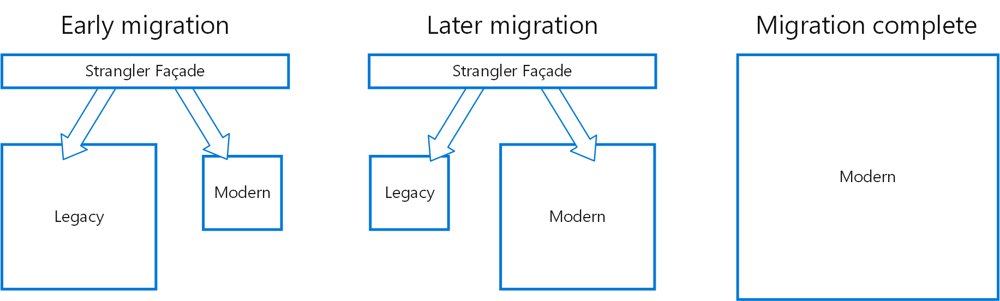

# 扼杀者模式

通过逐步用新的应用程序和服务替换特定功能，以增量方式迁移旧系统。随着旧系统中的功能被替换，新系统最终会替换旧系统的所有功能，从而扼杀旧系统并允许您停用它。

## 背景和问题

随着系统的老化，开发工具、托管技术，甚至构建它们的系统架构都可能变得越来越过时。随着新特性和功能的添加，这些应用程序的复杂性可能会急剧增加，使其更难维护或很难添加新功能。

完全替换复杂系统可能是一项艰巨的任务。通常，您需要逐步迁移到新系统，同时保留旧系统来处理尚未迁移的功能。但是，运行应用程序的两个单独版本意味着客户端必须知道特定功能的位置。每次迁移要素或服务时，都需要更新客户端以指向新位置。

## 解决方案

以增量方式将特定功能替换为新的应用程序和服务。创建一个外观（facade）代理，用于拦截进入后端旧系统的请求。代理将这些请求路由到旧应用程序或新服务。现有功能可以逐步迁移到新系统，消费者可以继续使用相同的界面，而不知道任何迁移已经发生。

此模式有助于最大程度地降低迁移风险，并随着时间的推移分散开发工作。通过外观代理安全地将用户路由到正确的应用程序，您可以按照自己喜欢的任何速度向新系统添加功能，同时确保旧版应用程序继续运行。随着时间的推移，随着功能迁移到新系统，旧系统最终会被“扼杀”，不再需要。完成此过程后，可以安全地停用旧系统。

## 问题和考虑因素

- 考虑如何处理可能被新系统和旧系统使用的服务和数据存储。确保两者都可以并行访问这些资源。
- 构建新的应用程序和服务，使其可以在未来的扼杀者迁移中轻松拦截和替换。
- 在某些时候，当迁移完成时，扼杀者外观将消失或演变为旧客户端的适配器。
- 确保外观跟上迁移。
- 确保外观不会成为单点故障或性能瓶颈。

## 何时使用此模式

在逐步将后端应用程序迁移到新体系结构时，请使用此模式。

此模式可能不合适：

- 当无法拦截对后端系统的请求时。
- 对于批量更换复杂性较低的小型系统。

## 原文链接

https://learn.microsoft.com/en-us/azure/architecture/patterns/strangler-fig