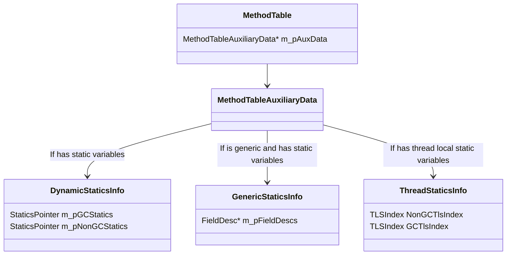
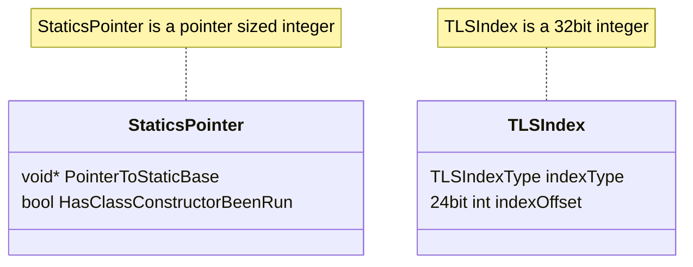
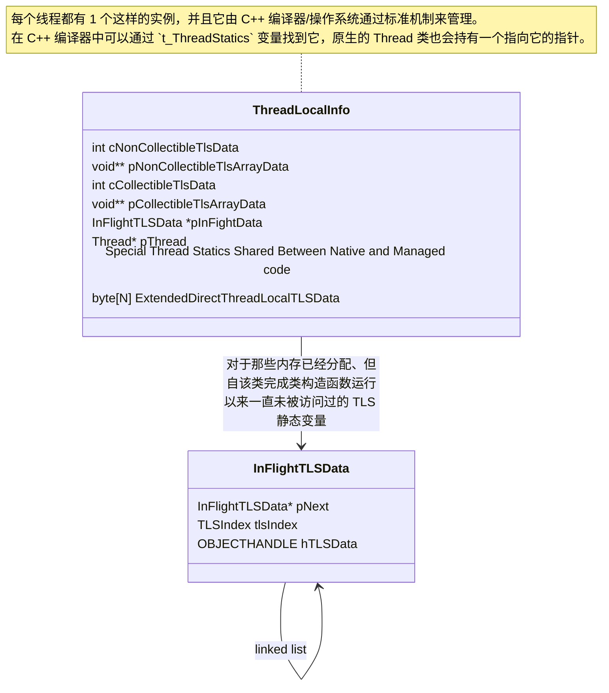

# 类型系统概述

作者：David Wrighton ([@davidwrighton](https://github.com/davidwrighton)) - 2010

# 简介

CLR 类型系统是我们对 ECMA 规范 + 扩展中描述的类型系统的表示。

## 概述

类型系统由一系列数据结构组成，其中一些在[“运行时之书”](https://github.com/dotnet/runtime/tree/main/docs/design/coreclr/botr)的其他章节中进行了描述，以及一组对这些数据结构进行操作和创建的算法。它**不是**通过反射公开的类型系统，尽管反射确实依赖于该系统。

类型系统维护的主要数据结构有：

- MethodTable
- EEClass
- MethodDesc
- FieldDesc
- TypeDesc
- ClassLoader

包含在类型系统中的主要算法有：

- **类型加载器 (Type Loader)：** 用于加载类型并创建类型系统的大部分主要数据结构。
- **CanCastTo 及类似算法：** 比较类型的功能。
- **LoadTypeHandle：** 主要用于查找类型。
- **签名解析：** 用于比较和收集有关方法和字段的信息。
- **GetMethod/FieldDesc：** 用于查找/加载方法/字段。
- **虚存根分派 (Virtual Stub Dispatch)：** 用于查找接口虚调用的目标。

还有更多辅助数据结构和算法为 CLR 的其余部分提供各种信息，但它们对于系统的整体理解不太重要。

## 组件架构

类型系统的数据结构通常会被各种算法共同使用。本文不描述类型系统的算法（因为这些算法已经或应该由其他《运行时之书》文档覆盖），但会尝试描述下面这些主要数据结构。

## 依赖关系

类型系统通常作为一项服务提供给 CLR 的许多部分，大多数核心组件都以某种形式依赖于类型系统的行为。下图描述了影响类型系统的一般数据流。它并不穷尽，但指出了主要的信息流向。

### 组件依赖

类型系统的主要依赖项如下：

- 需要 **loader（加载器）** 来获取正确的元数据以进行工作。
- **metadata system（元数据系统）** 提供元数据 API 来收集信息。
- **security system（安全系统）** 通知类型系统某些类型系统结构是否被允许（例如继承）。
- **AppDomain** 提供 LoaderAllocator 来处理类型系统数据结构的分配行为。

### 依赖于此组件的组件

有 3 个主要组件依赖于类型系统。

- JIT 接口与 JIT helper 主要依赖类型、方法和字段的查找功能。一旦找到类型系统对象，返回的数据结构会被“裁剪”为恰好能向 JIT 提供所需信息的形态。
- 反射使用类型系统，以相对简单的方式访问 ECMA 标准化概念，而我们恰好在 CLR 类型系统数据结构中对这些概念进行了捕获。
- 一般托管代码执行需要使用类型系统来完成类型比较逻辑，以及虚拟存根分发。

# 类型系统的设计

核心类型系统数据结构是表示实际已加载类型的数据结构（例如 TypeHandle、MethodTable、MethodDesc、TypeDesc、EEClass）以及允许在加载类型后查找类型的数据结构（例如 ClassLoader、Assembly、Module、RIDMaps）。

加载类型的数据结构和算法在 [Type Loader](type-loader_cn.md) 和 [MethodDesc](method-descriptor_cn.md) 的“运行时之书”章节中进行了讨论。

将这些数据结构联系在一起的是一组功能，允许 JIT/Reflection/TypeLoader/stackwalker 查找现有的类型和方法。总体思路是：这些查找应当能够由 ECMA CLI 规范中指定的元数据 token/签名轻松驱动。

最后，当找到适当的类型系统数据结构时，我们有算法从类型收集信息和/或比较两种类型。这种形式的算法的一个特别复杂的例子可以在 [虚存根分派](virtual-stub-dispatch_cn.md) 的“运行时之书”章节中找到。

## 设计目标和非目标

### 目标

- 执行期从正在运行的（非反射）代码访问所需信息要非常快。
- 编译期为生成代码而访问所需信息要直接明了。
- 垃圾回收器/栈遍历器能够在不加锁、不分配内存的情况下访问必要信息。
- 一次只加载尽可能少的类型。
- 在类型加载时，对某个给定类型加载的内容尽可能少。
- 类型系统数据结构必须可存储在 NGEN 镜像中。

### 非目标

- 元数据中的所有信息都直接反映在 CLR 数据结构中。
- 所有反射的使用都很快。

## 托管代码执行期间在运行时使用的典型算法的设计

强制转换（casting）算法是类型系统中在托管代码执行期间被大量使用的典型算法。

该算法至少有 4 个不同的入口点。每个入口点都试图提供一条不同的快速路径，以期获得尽可能好的性能。

- 对象能否被转换为某个“非类型等价”的非数组类型？
- 对象能否被转换为一个不实现泛型协变/逆变的接口类型？
- 对象能否被转换为数组类型？
- 某种类型的对象能否被转换为任意其他托管类型？

除最后一种之外，其余这些实现都通过牺牲通用性来换取更好的性能。

例如，“某个类型能否转换为父类型”是“对象能否被转换为某个非类型等价的非数组类型？”的一种变体，这段代码通过一个单循环实现，沿着单向链表向上遍历。它只能覆盖一部分可能的转换操作，但可以通过检查该转换试图强制的类型，判断这一子集是否正是所需的范围。该算法实现于 JIT helper `JIT_ChkCastClass_Portable` 中。

假设：

- 专用化实现的算法通常能带来性能提升。
- 算法的额外版本不会带来难以承受的维护问题。

## 类型系统中典型搜索算法的设计

类型系统中有许多遵循这种通用模式的算法。

类型系统通常用于查找类型。这可以通过任何数量的输入触发，例如 JIT、反射、序列化、远程处理等。

在这些情况下，类型系统的基本输入是

- 查找应当从哪个上下文开始（一个 Module 或 Assembly 指针）。
- 一个在初始上下文中描述目标类型的标识符。通常是一个 token，或者（当 Assembly 是查找上下文时）一个字符串。

算法必须首先解码标识符。

在“查找类型”的场景中，token 可能是 TypeDef token、TypeRef token、TypeSpec token，或者是一个字符串。不同的标识符会触发不同形式的查找。

- TypeDef token 会在 Module 的 RidMap 中进行查找。这只是一次简单的数组下标访问。
- TypeRef token 会先查找到该 TypeRef 所引用的 Assembly，然后以找到的 Assembly 指针和从 TypeRef 表中取得的字符串为输入，重新开始类型查找算法。
- TypeSpec token 表示必须解析一个签名才能得到信息。解析签名以获取加载该类型所需的信息。这将递归触发更多类型查找。
- 名称用于在 Assembly 之间做绑定。会在 TypeDef/ExportedTypes 表中搜索匹配项。注意：该搜索在 manifest module 对象上通过哈希表进行了优化。

从这种设计中，类型系统中搜索算法的许多共同特征是显而易见的。

- 搜索使用与元数据紧密耦合的输入。特别是，元数据令牌和字符串名称通常被传递。此外，这些搜索绑定到 Modules，它们直接映射到 .dll 和 .exe 文件。
- 使用缓存信息来提高性能。RidMap 和哈希表是优化这些查找的数据结构。
- 算法通常会根据输入分成 3–4 条不同路径。

除这一通用设计之外，还有一些额外要求叠加在其上。

- 假设：在 GC 暂停（stopped in the GC）期间，对已加载类型的查找是安全的。
- 不变式：如果某个类型已经被加载，那么对它进行查找时一定能找到。
- 问题：查找例程依赖元数据读取，这在某些场景会带来不够理想的性能。

此搜索算法是 JIT 期间使用的例程的典型代表。它有许多共同特征。

- 它使用元数据。
- 它需要在许多地方查找数据。
- 我们的数据结构中几乎没有重复的数据。
- 它通常不会递归很深，也没有循环。

这使我们能够满足性能要求，以及使用基于 IL 的 JIT 所必需的特性。

## 垃圾回收器对类型系统的要求

垃圾回收器需要有关 GC 堆中分配的类型实例的信息。这是通过指向每个托管对象头部的类型系统数据结构（MethodTable）的指针来完成的。附加到 MethodTable 的是一个描述类型实例的 GC 布局的数据结构。这种布局有两种形式（一种用于普通类型和对象数组，另一种用于值类型数组）。

- **假设：** 类型系统数据结构的生命周期超过类型系统数据结构中描述的类型的托管对象的生命周期。
- **要求：** 垃圾回收器要求在运行时挂起时执行 stack walker（堆栈遍历器）。接下来将讨论这个问题。

## Stackwalker 对类型系统的要求

stack walker/ GC stack walker 在 2 种情况下需要类型系统输入。

- 用于查找堆栈上值类型的大小。
- 用于查找堆栈上值类型内要报告的 GC 根。

由于涉及延迟加载类型的愿望以及避免生成多个版本的代码（仅通过关联的 gc 信息不同）的各种原因，CLR 当前需要遍历堆栈上方法的签名。这种需求很少被执行，因为它要求 stack walker 在非常特定的时刻执行，但是为了满足我们的可靠性目标，签名遍历器必须能够在 stackwalking 时起作用。

stack walker 大约以 3 种模式执行。

- 出于安全或异常处理原因遍历当前线程的堆栈。
- 出于 GC 目的遍历所有线程的堆栈（所有线程被 EE 挂起）。
- 为分析器遍历特定线程的堆栈（该特定线程被挂起）。

在 GC 栈遍历以及 profiler 栈遍历的场景中，由于线程被挂起，分配内存或获取大多数锁并不安全。

这促使我们在类型系统中开发出一条可依赖的路径，以满足上述要求。

类型系统实现此目标所需的规则是：

- 如果已调用方法，则被调用方法的所有值类型参数都将已加载到进程中的某个 appdomain 中。
- 在栈遍历需要对签名进行遍历之前，必须先解析“包含该签名的 Assembly”到“实现该类型的 Assembly”的引用关系。

这通过类型加载器、NGEN 镜像生成流程与 JIT 内部一套庞大且复杂的强制约束来保证。

- 问题：栈遍历器对类型系统的要求**极其**脆弱。
- 问题：在类型系统中实现栈遍历器要求，需要在类型系统中每一个可能在查找已加载类型时被触及的函数上引入一组契约违例（contract violations）。
- 问题：执行的签名遍历使用的是普通签名遍历代码。该代码在遍历签名时会尝试加载类型，但在这里使用类型加载功能时假设“不会真的触发任何类型加载”。
- 问题：栈遍历器要求不仅需要类型系统支持，也需要 Assembly 加载器支持。Loader 在满足类型系统这里的需求方面出现过多次问题。

## 静态变量

CoreCLR 中的静态变量是通过获取“静态基址（static base）”，然后通过偏移量调整它以获得指向实际值的指针来处理的。我们将 statics base 按字段定义为 non-gc 或 gc。当前 non-gc statics 指由基元类型表示的静态字段（byte、sbyte、char、int、uint、long、ulong、float、double、各种形式的指针）以及枚举。GC statics 指由类或非基元值类型表示的静态字段。对于属于 GC statics 的值类型静态字段，该静态变量实际上是一个指向该值类型装箱实例（boxed instance）的指针。

### 每个类型的静态变量信息
从 .NET 9 开始，静态变量 base 现在都与其所属的具体类型相关联。如图所示，静态数据可以从 MethodTable 出发获取：要么通过 DynamicStaticsInfo 获取 statics 指针；要么通过 ThreadStaticsInfo 获取 TLSIndex，然后与线程静态变量系统配合得到实际的线程静态 base。

在上图中可以看到，我们为 non-gc 与 gc statics、以及线程静态与普通静态分别设有字段。对于普通静态，我们使用一个指针大小的字段，同时它也编码了类构造函数是否已执行。这么做是为了在无锁的情况下以原子方式同时获取静态字段地址，并判断是否需要触发类构造函数。对于 TLS 静态，检测类构造函数是否已执行的处理更复杂，并作为线程静态基础设施的一部分进行描述。访问 DynamicStaticsInfo 与 ThreadStaticsInfo 结构时不需要任何锁，因此必须确保对这些结构字段的访问可以通过一次内存访问完成，以避免内存顺序撕裂（memory order tearing）问题。

另外值得注意的是，对于泛型类型，每个字段都有一个按类型实例分配的 FieldDesc，并不会在多个 canonical 实例之间共享。

#### 可回收静态变量的生命周期管理

最后，CoreCLR 运行时中存在可回收 Assembly 的概念，因此需要处理静态变量的生命周期管理。所选方案是构建一种特殊的 GC handle 类型，使运行时能在运行时数据结构中持有一个指向 GC 堆上某个托管对象内部（interior）的指针。

这里的行为要求是：静态变量不能让它自身所在的可回收 Assembly 保持存活。因此，可回收 statics 具有一个特殊属性：它们可以在可回收 Assembly 最终被回收之前就已存在并被终结（finalized）。如果出现某种复活（resurrection）场景，这可能导致非常令人意外的行为。

### 线程静态变量 (Thread Statics)

线程静态变量是静态变量，其生命周期定义为包含静态变量的类型的生命周期和访问静态变量的线程的生命周期中较短的一个。
它们是通过在类型上拥有一个用 `[System.Runtime.CompilerServices.ThreadStaticAttribute]` 属性修饰的静态变量来创建的。其总体方案是给该类型分配一个在所有线程上都相同的“索引”，然后在每个线程上持有一个可通过该索引高效访问的数据结构。不过，我们的实现方式还有一些特殊之处。
但是，我们的方法中有一些特殊之处。

1. 我们隔离可回收和不可回收的线程静态变量（`TLSIndexType::NonCollectible` 和 `TLSIndexType::Collectible`）
2. 我们提供了在原生 CoreCLR 代码和托管代码之间共享非 gc 线程静态变量的能力（`TLSIndexType::DirectOnThreadLocalData` 的子集）
3. 我们提供了一种极其有效的方法来访问少量非 gc 线程静态变量。（`TLSIndexType::DirectOnThreadLocalData` 的其余用法）

#### 按线程划分的静态数据结构

#### 获取线程静态变量地址的访问模式

这是 JIT 用来访问一个不属于 `DirectOnThreadLocalData` 的线程静态变量的模式。

0. 获取 TLS 索引（以某种方式）
1. 获取当前线程的 OS 管理的 TLS 块的 TLS 指针，即 `pThreadLocalData = &t_ThreadStatics`
2. 读取 1 个整数值：`pThreadLocalData->cCollectibleTlsData` 或 `pThreadLocalData->cNonCollectibleTlsData`
3. 将 `cTlsData` 与我们要查找的索引比较：`if (cTlsData < index.GetIndexOffset())`
4. 如果索引不在范围内，跳到第 11 步。
5. 从 TLS 块读取 1 个指针值：`pThreadLocalData->pCollectibleTlsArrayData` 或 `pThreadLocalData->pNonCollectibleTlsArrayData`
6. 从 TLS Array 内读取 1 个指针：`pTLSBaseAddress = *(intptr_t*)(((uint8_t*)pTlsArrayData) + index.GetIndexOffset()`
7. 如果指针为 NULL，跳到第 11 步：`if pTLSBaseAddress == NULL`
8. 如果 TLS 索引不是 Collectible 索引，则返回 `pTLSBaseAddress`
9. 如果 `ObjectFromHandle((OBJECTHANDLE)pTLSBaseAddress)` 为 NULL，跳到第 11 步
10. 返回 `ObjectFromHandle((OBJECTHANDLE)pTLSBaseAddress)`
11. 尾调用一个 helper：`return GetThreadLocalStaticBase(index)`

这是 JIT 将用于访问位于 `DirectOnThreadLocalData` 上的线程静态变量的模式
0. 以某种方式获取 TLS 索引
1. 获取当前线程的操作系统托管 TLS 块的 TLS 指针，即 `pThreadLocalData = &t_ThreadStatics`
2. 将索引偏移量添加到 ThreadLocalData 结构的开头 `pTLSBaseAddress = ((uint8_t*)pThreadLocalData) + index.GetIndexOffset()`

#### 线程静态变量的生命周期管理
不可回收线程静态变量，是定义在运行时无法回收的类型上的线程静态变量。这描述了实际观察中绝大多数线程静态变量。`DirectOnThreadLocalData` statics 是该类别的一个子集，具有特殊的优化形式，并且不需要任何 GC 上报。对于不可回收线程静态变量，ThreadLocalData 中的指针（`pNonCollectibleTlsArrayData`）指向一个托管的 `object[]`，该 `object[]` 又指向 `object[]`、`byte[]` 或 `double[]` 数组。在 GC 扫描时，只需向 GC 上报指向初始 `object[]` 的指针这一项信息。

可回收线程静态变量，是运行时可以回收的线程静态变量。这描述了定义在可被运行时回收类型上的静态变量。ThreadLocalData 中的指针（`pCollectibleTlsArrayData`）指向一块通过 `malloc` 分配的内存，其中保存着指向 `object[]`、`byte[]` 或 `double[]` 数组的指针。在 GC 扫描时，每个托管对象必须仅在“类型与线程仍然存活”的前提下被单独保持存活。这需要正确处理若干情况。

1. 如果某个可回收 Assembly 变得不再被引用，但与之关联的线程静态变量有终结器（finalizer），该对象必须移动到终结队列。
2. 如果与可回收 Assembly 关联的线程静态变量通过一系列对象引用指向该可回收 Assembly 的 LoaderAllocator，那么它必须不能成为该可回收 Assembly 被视为仍被引用的理由。
3. 如果某个可回收 Assembly 被回收，则关联的静态变量不再存在，且与该可回收 Assembly 关联的 TLSIndex 值将变为可复用。
4. 如果某个线程不再执行，则该线程关联的所有线程静态变量都不再被保持存活。

所选方案是使用两种不同的 handle 类型。为实现高效访问，存储在动态调整数组中的 handle 类型是一个 `WeakTrackResurrection` GCHandle。该 handle 实例与 TLS 数据中的 slot 关联，而不是与某个精确的实例化关联，因此当关联的可回收 Assembly 被回收、slot 被复用时，它也能被复用。另外，每个正在使用的 slot 都会有一个 `LOADERHANDLE`，它会让对象保持存活直到 LoaderAllocator 被释放。如果 LoaderAllocator 被回收，这个 `LOADERHANDLE` 会被弃用，但这没问题，因为只有在 LoaderAllocator 没有被回收时才需要清理 `LOADERHANDLE`。在线程销毁时，对于 TLS 数组中每个可回收 slot，我们会在正确的 LoaderAllocator 上显式释放对应的 `LOADERHANDLE`。

# 物理架构

类型系统的主要部分可以在以下位置找到：

- Class.cpp/inl/h – EEClass 函数和 BuildMethodTable
- MethodTable.cpp/inl/h – 用于操作 methodtables 的函数。
- TypeDesc.cpp/inl/h – 用于检查 TypeDesc 的函数
- MetaSig.cpp SigParser – 签名代码
- FieldDesc /MethodDesc – 用于检查这些数据结构的函数
- Generics – 泛型特定逻辑。
- Array – 用于处理数组处理所需特殊情况的代码
- VirtualStubDispatch.cpp/h/inl – 虚存根分派的代码
- VirtualCallStubCpu.hpp – 虚存根分派的处理器特定代码。
- threadstatics.cpp/h - 线程静态变量的处理。

主要入口点是 BuildMethodTable、LoadTypeHandleThrowing、CanCastTo\*、GetMethodDescFromMemberDefOrRefOrSpecThrowing、GetFieldDescFromMemberRefThrowing、CompareSigs 和 VirtualCallStubManager::ResolveWorkerStatic。

> ### 1. 为什么要把类型拆成 `MethodTable` 和 `EEClass`？
>
> 这是初学者最困惑的地方：既然是一个类，为什么不只用一个数据结构描述？
>
> - 设计原因：冷热数据分离 (Hot/Cold Split)
>   - **MethodTable (热数据)：** 这是程序运行过程中**每一分每一秒**都在用的数据。比如：垃圾回收（GC）需要知道对象有多大、虚函数调用（Virtual Call）需要查表、类型转换（Casting）需要检查继承关系。为了性能，`MethodTable` 被设计得极其紧凑，且放在内存中容易访问的地方。
>   - **EEClass (冷数据)：** 存储的是从元数据（Metadata）中解析出来的、**运行时不常用**的信息。比如：这个类有哪些字段名、有哪些方法签名、它实现了哪些复杂的接口列表等。这些信息只有在 JIT 编译时或者使用反射（Reflection）时才需要。
> - **总结：** 这种拆分是为了**节省内存**（不是每个对象都需要携带完整的元数据信息）和**提升运行速度**（常用的信息在内存布局上更紧凑）。
>
> ### 2. 为什么类型转换（Casting）算法要写四五个版本？
>
> 文档中提到 `CanCastTo` 有好几个入口：非数组转换、接口转换、数组转换等。
>
> - 设计原因：性能极致优化
>   - 在托管代码中，`isinst` 和 `castclass` 是极其频繁的操作。
>   - **为什么不写一个通用的算法？** 因为通用算法意味着大量的分支判断（if/else）。
>   - **做法：** 运行时会根据目标类型提前选择最优路径。比如，如果你要转换成一个普通的类（如 `object obj = (MyClass)input;`），CLR 只需要沿着 `MethodTable` 的父类链条（Parent Chain）往上找就行了，这只是一个简单的循环，速度极快。而接口转换则涉及更复杂的查表逻辑。
>
> ### 3. 为什么静态变量（Statics）的设计如此复杂？
>
> 文档用了很大篇幅讲静态变量，特别是 .NET 9 之后的 `DynamicStaticsInfo` 和 `ThreadStatics`。
>
> - 设计原因：泛型共享 (Generic Sharing) 与 隔离
>   - **泛型共享：** 在 .NET 中，`List<string>` 和 `List<object>` 可能会共享同一份代码（为了省内存）。但是，它们的静态变量**必须是独立**的。这意味着静态变量不能简单地通过一个偏移量找到，必须动态计算。
>   - **GC 安全：** 静态变量（特别是 GC 类型的变量）必须被 GC 追踪。如果一个静态变量指向一个可卸载（Collectible）程序集的对象，处理不好就会导致内存泄漏或奔溃。
>   - **线程静态变量 (ThreadStatics)：** 为了性能，JIT 会尝试用最快的指令访问线程本地存储（TLS）。文档中提到的 `DirectOnThreadLocalData` 就是为了让那些最常用的线程静态变量访问速度接近普通局部变量。
>
> ### 4. 为什么栈遍历（Stackwalker）对类型系统有极其苛刻的要求？
>
> 文档提到了“Fragile（脆弱）”和“Contract violations（违反契约）”。
>
> - 设计原因：GC 运行时的“死锁”风险
>   - 当 GC 发生时，所有的托管线程都会被暂停（Stop The World）。此时，GC 必须遍历每个线程的调用栈，找到所有的对象引用（GC Roots）。
>   - **挑战：** 遍历栈时，如果遇到一个值类型（ValueType），GC 需要知道这个值类型里哪些字段是引用类型。这需要去查类型系统。
>   - **“为什么”：** 在 GC 暂停期间，**严禁分配内存或加锁**。但类型系统的加载通常涉及文件 IO、加锁和分配内存。
>   - **权衡：** 为了解决这个矛盾，CLR 强制要求：**如果一个方法正在运行，它所涉及的所有值类型必须已经完全加载并解析好**。这样 GC 在遍历栈时，只需要读内存，不需要加载新类型。这就是为什么文档说这部分逻辑非常“脆弱”，因为它依赖于 JIT 和加载器的完美配合。

# 相关阅读

- [ECMA CLI 规范](../../../project/dotnet-standards_cn.md)
- [类型加载器](type-loader_cn.md) 运行时之书章节
- [虚存根分派](virtual-stub-dispatch_cn.md) 运行时之书章节
- [MethodDesc](method-descriptor_cn.md) 运行时之书章节
