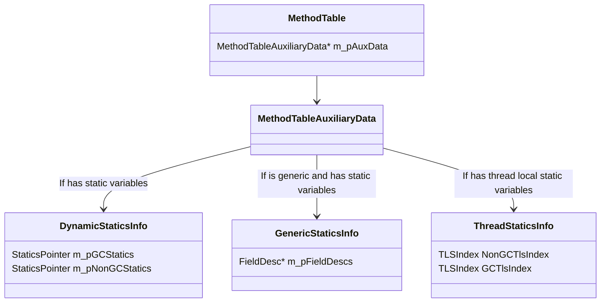
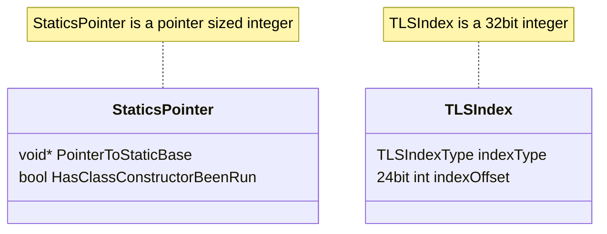
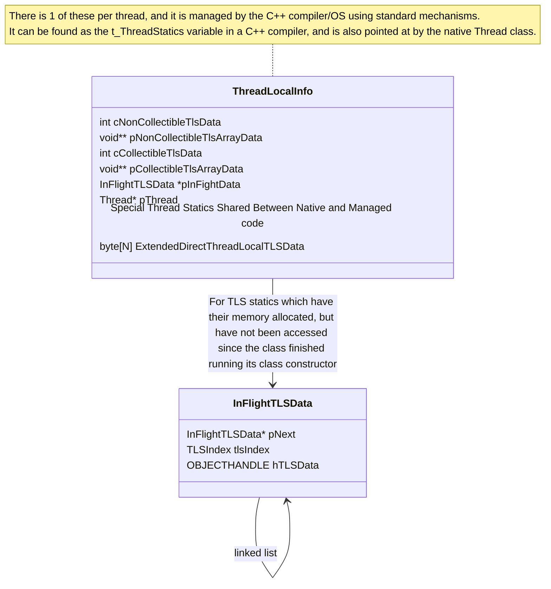

# 类型系统概述

作者：David Wrighton ([@davidwrighton](https://github.com/davidwrighton)) - 2010

# 简介

CLR 类型系统是我们对 ECMA 规范 + 扩展中描述的类型系统的表示。

## 概述

类型系统由一系列数据结构组成，其中一些在“运行时之书”的其他章节中进行了描述，以及一组对这些数据结构进行操作和创建的算法。它**不是**通过反射公开的类型系统，尽管反射确实依赖于该系统。

类型系统维护的主要数据结构有：

- MethodTable
- EEClass
- MethodDesc
- FieldDesc
- TypeDesc
- ClassLoader

包含在类型系统中的主要算法有：

- **类型加载器 (Type Loader)：** 用于加载类型并创建类型系统的大部分主要数据结构。
- **CanCastTo 及类似算法：** 比较类型的功能。
- **LoadTypeHandle：** 主要用于查找类型。
- **签名解析：** 用于比较和收集有关方法和字段的信息。
- **GetMethod/FieldDesc：** 用于查找/加载方法/字段。
- **虚存根分派 (Virtual Stub Dispatch)：** 用于查找接口虚调用的目标。

还有更多辅助数据结构和算法为 CLR 的其余部分提供各种信息，但它们对于系统的整体理解不太重要。

## 组件架构

类型系统的数据结构通常被各种算法使用。本文档不描述类型系统算法（因为有或应该有其他“运行时之书”文档来描述这些），但它确实尝试在下面描述各种主要数据结构。

## 依赖关系

类型系统通常是提供给 CLR 许多部分的服务，大多数核心组件都某种形式地依赖于类型系统的行为。此图描述了影响类型系统的一般数据流。它并不详尽，但指出了主要的信息流。

### 组件依赖

类型系统的主要依赖项如下：

- 需要 **loader（加载器）** 来获取正确的元数据以进行工作。
- **metadata system（元数据系统）** 提供元数据 API 来收集信息。
- **security system（安全系统）** 通知类型系统某些类型系统结构是否被允许（例如继承）。
- **AppDomain** 提供 LoaderAllocator 来处理类型系统数据结构的分配行为。

### 依赖于此组件的组件

有 3 个主要组件依赖于类型系统。

- **Jit 接口**和 Jit 辅助函数主要依赖于类型、方法和字段的搜索功能。一旦找到类型系统对象，返回的数据结构就已经过定制，以提供 Jit 所需的信息。
- **反射**使用类型系统来提供对 ECMA 标准化概念的相对简单的访问，我们恰好在 CLR 类型系统数据结构中捕获了这些概念。
- **通用托管代码执行**需要使用类型系统进行类型比较逻辑和虚存根分派。

# 类型系统的设计

核心类型系统数据结构是表示实际已加载类型的数据结构（例如 TypeHandle、MethodTable、MethodDesc、TypeDesc、EEClass）以及允许在加载类型后查找类型的数据结构（例如 ClassLoader、Assembly、Module、RIDMaps）。

加载类型的数据结构和算法在 [Type Loader](type-loader.md) 和 [MethodDesc](method-descriptor.md) 的“运行时之书”章节中进行了讨论。

将这些数据结构联系在一起的是一组功能，允许 JIT/Reflection/TypeLoader/stackwalker 查找现有的类型和方法。总的想法是，这些搜索应该很容易由 ECMA CLI 规范中指定的元数据令牌/签名驱动。

最后，当找到适当的类型系统数据结构时，我们有算法从类型收集信息和/或比较两种类型。这种形式的算法的一个特别复杂的例子可以在 [虚存根分派](virtual-stub-dispatch.md) 的“运行时之书”章节中找到。

## 设计目标和非目标

### 目标

- 从执行（非反射）代码访问运行时所需的信息非常快。
- 访问生成代码所需的编译时信息是直接的。
- 垃圾回收器/stackwalker 能够在不获取锁或分配内存的情况下访问必要的信息。
- 一次加载最少量的类型。
- 在类型加载时加载给定类型的最少量信息。
- 类型系统数据结构必须可存储在 NGEN 映像中。

### 非目标

- 元数据中的所有信息都直接反映在 CLR 数据结构中。
- 所有反射的使用都很快。

## 托管代码执行期间在运行时使用的典型算法的设计

转换（Casting）算法是类型系统中在托管代码执行期间被大量使用的典型算法。

此算法至少有 4 个独立的入口点。选择每个入口点是为了提供不同的快速路径，希望能实现尽可能最佳的性能。

- 对象是否可以转换为特定的非类型等效的非数组类型？
- 对象是否可以转换为不实现泛型变体的接口类型？
- 对象是否可以转换为数组类型？
- 某种类型的对象可以转换为任意其他托管类型吗？

除了最后一个之外，这些实现中的每一个都经过优化以表现得更好，代价是不完全通用。

例如，“类型是否可以转换为父类型”（这是“对象是否可以转换为特定的非类型等效的非数组类型？”的变体）代码是通过遍历单向链表的单个循环实现的。这只能搜索可能转换操作的子集，但是可以通过检查转换试图强制执行的类型来确定这是否是合适的集合。此算法在 Jit 辅助函数 JIT\_ChkCastClass\_Portable 中实现。

假设：

- 算法的专用实现在一般情况下是性能改进。
- 算法的额外版本不会提供不可克服的维护问题。

## 类型系统中典型搜索算法的设计

类型系统中有许多遵循这种通用模式的算法。

类型系统通常用于查找类型。这可以通过任何数量的输入触发，例如 JIT、反射、序列化、远程处理等。

在这些情况下，类型系统的基本输入是

- 搜索开始的上下文（Module 或 assembly 指针）。
- 描述初始上下文中被搜索类型的标识符。这通常是一个令牌或字符串（如果程序集是搜索上下文）。

算法必须首先解码标识符。

对于搜索类型的场景，令牌可以是 TypeDef 令牌、TypeRef 令牌、TypeSpec 令牌或字符串。这些不同的标识符中的每一个都将导致不同形式的查找。

- **typedef 令牌**将导致在 Module 的 RidMap 中查找。这是一个简单的数组索引。
- **typeref 令牌**将导致查找此 typeref 令牌引用的程序集，然后使用找到的程序集指针和从 typeref 表收集的字符串重新开始类型查找算法。
- **typespec 令牌**表示必须解析签名才能找到类型。解析签名以查找加载类型所需的信息。这将递归触发更多类型查找。
- **名称**用于在程序集之间进行绑定。在 TypeDef/ExportedTypes 表中搜索匹配项。注意：此搜索由清单模块对象上的哈希表优化。

从这种设计中，类型系统中搜索算法的许多共同特征是显而易见的。

- 搜索使用与元数据紧密耦合的输入。特别是，元数据令牌和字符串名称通常被传递。此外，这些搜索绑定到 Modules，它们直接映射到 .dll 和 .exe 文件。
- 使用缓存信息来提高性能。RidMap 和哈希表是优化这些查找的数据结构。
- 算法通常根据其输入有 3-4 条不同的路径。

除了这种通用设计之外，还有许多额外的要求层叠在其上。

- **假设：** 在 GC 停止时搜索已加载的类型是安全的。
- **不变式：** 如果搜索已加载的类型，它将始终被找到。
- **问题：** 搜索例程依赖于元数据读取。这在某些情况下可能会产生不足的性能。

此搜索算法是 JIT 期间使用的例程的典型代表。它有许多共同特征。

- 它使用元数据。
- 它需要在许多地方查找数据。
- 我们的数据结构中几乎没有重复的数据。
- 它通常不会递归很深，也没有循环。

这使我们能够满足性能要求，以及使用基于 IL 的 JIT 所必需的特性。

## 垃圾回收器对类型系统的要求

垃圾回收器需要有关 GC 堆中分配的类型实例的信息。这是通过指向每个托管对象头部的类型系统数据结构（MethodTable）的指针来完成的。附加到 MethodTable 的是一个描述类型实例的 GC 布局的数据结构。这种布局有两种形式（一种用于普通类型和对象数组，另一种用于值类型数组）。

- **假设：** 类型系统数据结构的生命周期超过类型系统数据结构中描述的类型的托管对象的生命周期。
- **要求：** 垃圾回收器要求在运行时挂起时执行 stack walker（堆栈遍历器）。接下来将讨论这个问题。

## Stackwalker 对类型系统的要求

stack walker/ GC stack walker 在 2 种情况下需要类型系统输入。

- 用于查找堆栈上值类型的大小。
- 用于查找堆栈上值类型内要报告的 GC 根。

由于涉及延迟加载类型的愿望以及避免生成多个版本的代码（仅通过关联的 gc 信息不同）的各种原因，CLR 当前需要遍历堆栈上方法的签名。这种需求很少被执行，因为它要求 stack walker 在非常特定的时刻执行，但是为了满足我们的可靠性目标，签名遍历器必须能够在 stackwalking 时起作用。

stack walker 大约以 3 种模式执行。

- 出于安全或异常处理原因遍历当前线程的堆栈。
- 出于 GC 目的遍历所有线程的堆栈（所有线程被 EE 挂起）。
- 为分析器遍历特定线程的堆栈（该特定线程被挂起）。

在 GC stack walking 的情况和 profiler stack walking 的情况下，由于线程挂起，分配内存或获取大多数锁是不安全的。

这导致我们开发了一条通过类型系统的路径，可以依靠该路径来遵循上述要求。

类型系统实现此目标所需的规则是：

- 如果已调用方法，则被调用方法的所有值类型参数都将已加载到进程中的某个 appdomain 中。
- 从具有签名的程序集到实现类型的程序集的程序集引用必须在作为 stack walk 的一部分进行签名遍历之前解决。

这是通过类型加载器、NGEN 映像生成过程和 JIT 中的一套广泛而复杂的强制执行来强制执行的。

- **问题：** Stackwalker 对类型系统的要求**高度**脆弱。
- **问题：** 在类型系统中实现 stack walker 要求需要在类型系统中的每个函数处违反一组契约，这些函数在搜索已加载类型时可能会被触及。
- **问题：** 执行的签名遍历是用正常的签名遍历代码完成的。此代码旨在在遍历签名时加载类型，但在这种情况下，使用类型加载功能是假设实际上不会触发类型加载。
- **问题：** Stackwalker 要求不仅需要类型系统的支持，还需要程序集加载器的支持。加载器在这里满足类型系统需求方面存在许多问题。

## 静态变量

CoreCLR 中的静态变量是通过获取“静态基址”，然后通过偏移量调整它以获得指向实际值的指针来处理的。
我们为每个字段将静态基址定义为非 gc 或 gc。
目前，非 gc 静态变量是由基元类型（byte, sbyte, char, int, uint, long, ulong, float, double, 各种形式的指针）和枚举表示的任何静态变量。
GC 静态变量是由类或非基元值类型表示的任何静态变量。
对于是 GC 静态变量的值类型静态变量，静态变量实际上是指向值类型装箱实例的指针。

### 每个类型的静态变量信息
截至 .NET 9，静态变量基址现在都与其特定类型相关联。
正如您可以从下图看到的，静态变量的数据可以通过从 `MethodTable` 开始，然后获取 `DynamicStaticsInfo` 以获得静态变量指针，或者通过获取 `ThreadStaticsInfo` 以获得 TLSIndex 来获取，然后可以将 TLSIndex 与线程静态变量系统一起使用以获得实际的线程静态基址。

在上图中，您可以看到我们有用于非 gc 和 gc 静态变量以及线程和普通静态变量的单独字段。
对于普通静态变量，我们使用单个指针大小的字段，这恰好也编码了类构造函数是否已运行。
这样做是为了允许无锁原子访问以获取静态字段地址以及确定是否需要触发类构造函数。
对于 TLS 静态变量，处理检测类构造函数是否已运行是一个更复杂的过程，作为线程静态基础设施的一部分进行描述。
无需任何锁即可访问 `DynamicStaticsInfo` 和 `ThreadStaticsInfo` 结构，因此确保可以通过单个内存访问来访问这些结构上的字段非常重要，以避免内存顺序撕裂问题。

此外，值得注意的是，对于泛型类型，每个字段都有一个 `FieldDesc`，它是按类型实例分配的，并且不被多个规范实例共享。

#### 可回收静态变量的生命周期管理

最后，我们在 CoreCLR 运行时中有可回收程序集的概念，因此我们需要处理静态变量的生命周期管理。
选择的方法是构建一种特殊的 GC 句柄类型，该类型将允许运行时在运行时数据结构中拥有指向 GC 堆上托管对象内部的指针。

这里的行为要求是，静态变量不能使其自己的可回收程序集保持存活，因此可回收静态变量具有一种特殊的属性，即它们可以在可回收程序集最终被回收之前存在并被终结。
如果存在某种复活场景，这可能会导致非常令人惊讶的行为。

### 线程静态变量 (Thread Statics)

线程静态变量是静态变量，其生命周期定义为包含静态变量的类型的生命周期和访问静态变量的线程的生命周期中较短的一个。
它们是通过在类型上拥有一个用 `[System.Runtime.CompilerServices.ThreadStaticAttribute]` 属性修饰的静态变量来创建的。
其工作原理的一般方案是为类型分配一个“索引”，该索引在所有线程上都是相同的，然后在每个线程上持有一个可以通过此索引有效访问的数据结构。
但是，我们的方法中有一些特殊之处。

1. 我们隔离可回收和不可回收的线程静态变量（`TLSIndexType::NonCollectible` 和 `TLSIndexType::Collectible`）
2. 我们提供了在原生 CoreCLR 代码和托管代码之间共享非 gc 线程静态变量的能力（`TLSIndexType::DirectOnThreadLocalData` 的子集）
3. 我们提供了一种极其有效的方法来访问少量非 gc 线程静态变量。（`TLSIndexType::DirectOnThreadLocalData` 的其余用法）

#### 每线程静态变量数据结构

#### 获取线程静态变量地址的访问模式

这是 JIT 将用于访问非 `DirectOnThreadLocalData` 的线程静态变量的模式。

0. 以某种方式获取 TLS 索引
1. 获取当前线程的操作系统托管 TLS 块的 TLS 指针，即 `pThreadLocalData = &t_ThreadStatics`
2. 读取 1 个整数值 `pThreadLocalData->cCollectibleTlsData OR pThreadLocalData->cNonCollectibleTlsData`
3. 将 cTlsData 与我们要查找的索引进行比较 `if (cTlsData < index.GetIndexOffset())`
4. 如果索引不在范围内，跳到步骤 11。
5. 从 TLS 块读取 1 个指针值 `pThreadLocalData->pCollectibleTlsArrayData` 或 `pThreadLocalData->pNonCollectibleTlsArrayData`
6. 从 TLS 数组中读取 1 个指针。`pTLSBaseAddress = *(intptr_t*)(((uint8_t*)pTlsArrayData) + index.GetIndexOffset()`
7. 如果指针为 NULL，跳到步骤 11 `if pTLSBaseAddress == NULL`
8. 如果 TLS 索引不是可回收索引，返回 pTLSBaseAddress
9. 如果 `ObjectFromHandle((OBJECTHANDLE)pTLSBaseAddress)` 为 NULL，跳到步骤 11
10. 返回 `ObjectFromHandle((OBJECTHANDLE)pTLSBaseAddress)`
11. 尾调用辅助函数 `return GetThreadLocalStaticBase(index)`

这是 JIT 将用于访问位于 `DirectOnThreadLocalData` 上的线程静态变量的模式
0. 以某种方式获取 TLS 索引
1. 获取当前线程的操作系统托管 TLS 块的 TLS 指针，即 `pThreadLocalData = &t_ThreadStatics`
2. 将索引偏移量添加到 ThreadLocalData 结构的开头 `pTLSBaseAddress = ((uint8_t*)pThreadLocalData) + index.GetIndexOffset()`

#### 线程静态变量的生命周期管理
为了效率，我们区分可回收和不可回收的线程静态变量。

不可回收的线程静态变量是在无法被运行时回收的类型上定义的线程静态变量。
这描述了实际观察到的实践中的大多数线程静态变量。
`DirectOnThreadLocalData` 静态变量是此类别的一个子集，具有特殊的优化形式，不需要任何 GC 报告。
对于不可回收的线程静态变量，`ThreadLocalData` 中的指针 (`pNonCollectibleTlsArrayData`) 是指向托管 `object[]` 的指针，该 `object[]` 指向 `object[]`、`byte[]` 或 `double[]` 数组。
在 GC 扫描时，指向初始 object[] 的指针是唯一需要向 GC 报告的细节。

可回收的线程静态变量是可以被运行时回收的线程静态变量。
这描述了在可以被运行时回收的类型上定义的静态变量。
`ThreadLocalData` 中的指针 (`pCollectibleTlsArrayData`) 是指向通过 `malloc` 分配的内存块的指针，并持有指向 `object[]`、`byte[]` 或 `double[]` 数组的指针。
在 GC 扫描时，每个托管对象只有在该类型和线程仍然存活时才必须单独保持存活。这需要正确处理几种情况。
1. 如果可回收程序集变得未被引用，但与其关联的线程静态变量具有终结器，则该对象必须移动到终结队列。
2. 如果与可回收程序集关联的线程静态变量通过一系列对象引用引用了可回收程序集的 `LoaderAllocator`，则它不得提供使可回收程序集被视为被引用的理由。
3. 如果可回收程序集被回收，则关联的静态变量不再存在，并且与该可回收程序集关联的 TLSIndex 值变得可重用。
4. 如果线程不再执行，则与该线程关联的所有线程静态变量不再保持存活。

选择的方法是使用一对不同的句柄类型。
为了高效访问，存储在动态调整数组中的句柄类型是 WeakTrackResurrection GCHandle。
此句柄实例与 TLS 数据中的槽相关联，而不是与确切的实例化相关联，因此当关联的可回收程序集被回收，然后该槽被重用时，它可以被重用。
此外，每个正在使用的槽都将有一个 `LOADERHANDLE`，它将使对象保持存活，直到 `LoaderAllocator` 被释放。
如果 `LoaderAllocator` 被回收，此 `LOADERHANDLE` 将被放弃，但这没关系，因为 `LOADERHANDLE` 仅在 `LoaderAllocator` 未被回收时才需要清理。
在线程销毁时，对于 tls 数组中的每个可回收槽，我们将在正确的 `LoaderAllocator` 上显式释放 `LOADERHANDLE`。

# 物理架构

类型系统的主要部分可以在以下位置找到：

- Class.cpp/inl/h – EEClass 函数和 BuildMethodTable
- MethodTable.cpp/inl/h – 用于操作 methodtables 的函数。
- TypeDesc.cpp/inl/h – 用于检查 TypeDesc 的函数
- MetaSig.cpp SigParser – 签名代码
- FieldDesc /MethodDesc – 用于检查这些数据结构的函数
- Generics – 泛型特定逻辑。
- Array – 用于处理数组处理所需特殊情况的代码
- VirtualStubDispatch.cpp/h/inl – 虚存根分派的代码
- VirtualCallStubCpu.hpp – 虚存根分派的处理器特定代码。
- threadstatics.cpp/h - 线程静态变量的处理。

主要入口点是 BuildMethodTable、LoadTypeHandleThrowing、CanCastTo\*、GetMethodDescFromMemberDefOrRefOrSpecThrowing、GetFieldDescFromMemberRefThrowing、CompareSigs 和 VirtualCallStubManager::ResolveWorkerStatic。

# 相关阅读

- [ECMA CLI 规范](../../../project/dotnet-standards.md)
- [类型加载器](type-loader.md) 运行时之书章节
- [虚存根分派](virtual-stub-dispatch.md) 运行时之书章节
- [MethodDesc](method-descriptor.md) 运行时之书章节
