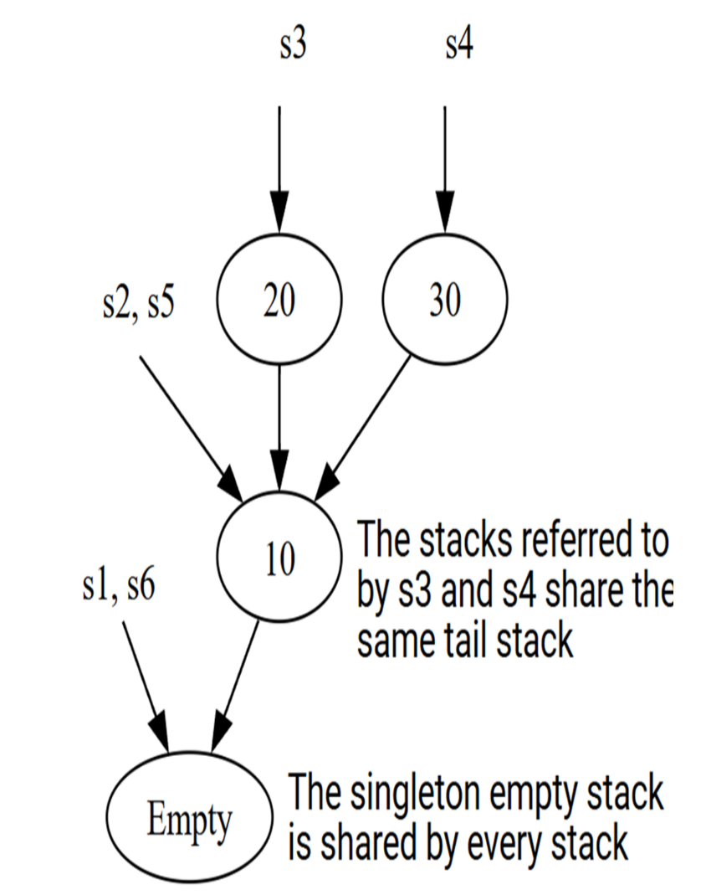
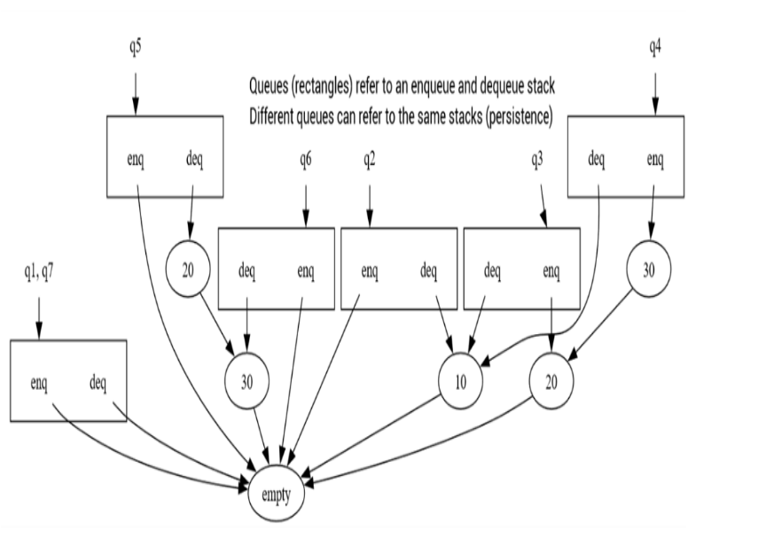
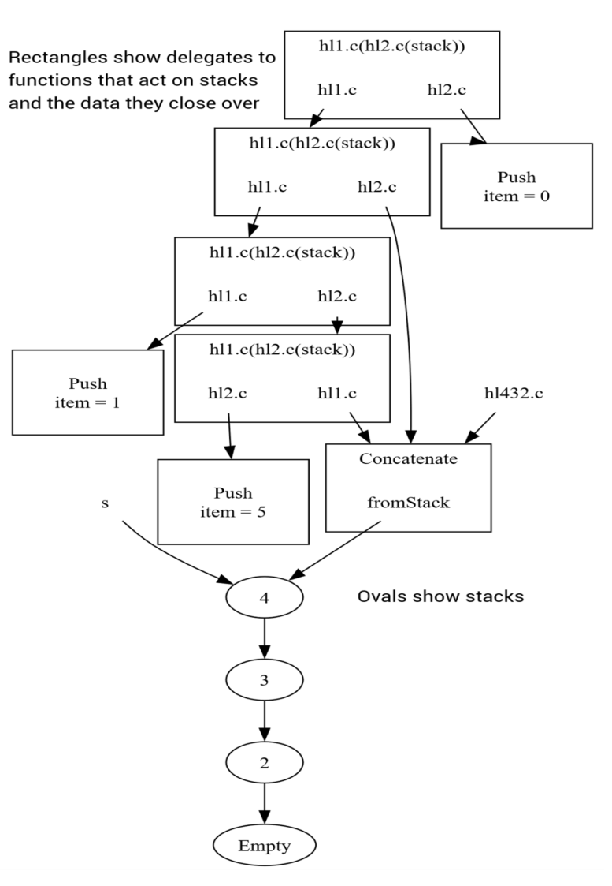

# 不可变的栈与队列

本章内容包括

- 不可变数据结构的强大优势与其微小代价
- 实现栈与队列
- 探索构建撤销–重做（undo–redo）栈的方法
- 分析时间与空间复杂度
- 实现 Hughes 列表

我们在第 1 章用一个温和的例子回顾了基础；现在我们将在那个不可变列表的基础上扩展，构建一些不同类型的列表，以展示若干不同的概念。我们会通过对链表的少量改进，构建一个不可变栈。一旦有了不可变栈，我们便能构建不可变队列，这将展示“最坏情况性能”与“摊销性能”能有多么不同。我们会探索不可变数据结构如何支持撤销–重做逻辑，以及如何在不可变数据结构之上构建一个可变接口。最后，我们会看看 Hughes 列表——一种离奇的栈实现，它乍看之下似乎根本不包含任何数据，而且其性能特征与普通栈截然不同。

在每个部分中，我们都会先定义该数据结构要解决的问题，创建接口，尝试若干实现方案，并以非正式的性能分析收尾。

不过，在开始这些内容之前，我应该先说明是什么强大的优势改变了我对编程的态度：我非常倾向于使用不可变数据结构，而不是它们的可变对应物。

## 为什么要使用不可变性？

如果你有两个数据结构，一个可变、一个不可变，而且它们“做的事情”完全相同，那么我们为什么要偏好那个**不能变**的版本？毫无疑问，我们都希望使用功能最强的工具。然而在能做选择的情况下，我几乎总是强烈偏向不可变数据结构。为什么？

### 正确性

**越少改变，越能保持一致。**

我之所以认为不可变数据结构最有说服力的理由是：**你曾经对一个不可变对象推导出的任何事实，现在依然成立，将来也依然成立。**相比之下，你对一个可变对象推导出的事实，在过去某一刻可能正确，但现在或将来可能已经不正确了。

例如：如果我们在一个不可变列表中放着数字 1、2、3，并计算它们的平均数，是 2。如果我们在一个可变列表中做同样的操作，但之后把列表改成了 1、2、30，那么你之前计算出的“平均值”反映的是过去，而不是现在。

**任何存储着关于可变数据结构事实的变量，都必须在数据发生变化后、变量再次被读取之前重新计算。**如果你没有这样做，那就一定会产生 bug。

这可不是理论问题。在我多年 C# 编译器团队的工作中，我修复了许多（包括我自己造成的）因为在分析与优化过程中不断修改程序的数据结构而产生的 bug。常见的错误是：缓存一个事实 → 修改数据结构 → 导致该事实失效 → 忘记重新计算 → 后续阶段使用了过期信息。在我们为 Roslyn 项目（https://github.com/dotnet/roslyn）彻底重写整个编译器时，我们刻意偏向使用不可变数据结构，整个类型的 bug 因而直接变得“不可能”发生。

总结来说：**不可变数据结构比可变数据结构更容易推理，因为推导不会失效。**此外，由于状态不会改变，使用不可变数据结构的代码通常更易于单元测试、调试与维护。这些理由本身就足以让我拥抱不可变性，更别提还有许多其他理由了。

### 历史记录的保存

初学面向对象编程的人常常会做一个练习：实现一个银行账户类，拥有可变余额，以及用于扣款或存款的方法。但我总觉得这很不舒服，因为现实中的银行完全不是这样追踪余额的！银行并不会在数据库里存一个“余额”数字，然后根据进出账增减。他们维护的是账本（ledger）：一份所有交易记录的列表。余额是通过实时累加账本记录计算出来的。你希望账本是不可变的：唯一合法操作是“在末尾添加新记录”；修改既有记录应当是不可能的。有些银行甚至使用只能向空白区域写入、文件本质上不可变的专用磁盘。类似的实际应用很多。现代源代码管理系统会完整保存版本历史，使得任何更改都能被回滚。不可变数据结构在此类系统中占重要地位。

### 安全性：TOCTOU 问题

前述观点在考虑安全影响时更加尖锐。安全专家称这种问题为 **TOCTOU（Time Of Check / Time Of Use）** ——检查时与使用时之间的时间差导致的问题。

设想这样一种情况：有低信任的恶意代码（比如从互联网下载的）调用高信任的系统代码，而系统代码按如下常见模式进行资源访问：

```csharp
Resource? AccessResource(ResourceName name)
{
    if (CallerHasAccess(name))
        return FetchResource(name);
    return null;
}
```

恶意代码接着做如下步骤：

1. 创建一个 `ResourceName` 对象
2. 启动一个线程，让它不停地修改该对象的内容，在“合法资源名”与“不合法资源名”之间来回切换
3. 在主线程中不断调用 `AccessResource`，直到获得不该访问的资源

最终恶意代码会撞上一次“幸运的调度”：**在检查合法性之后，但在实际获取资源之前，资源名被改成了“不合法”的那个**。高信任代码于是被欺骗，向无权访问的代码提供了受保护的资源。解决方案有许多，深度防御策略要求尽可能全部采用。其中一个很有效的缓解策略就是：**默认让对象不可变，从而阻止低信任代码在关键时刻“趁机修改”。**如果没有充分理由让一个数据结构可变，就让它保持不可变。

### 更安全的多线程

编写多线程代码最困难的问题之一，是处理共享可变状态的竞争。这几乎难到我会建议：**尽可能不要这样做！**我会尽量避免自己管理线程，如果必须使用，就会选用尽可能高层的库，让专家替我处理这些复杂性。

不可变对象的一大好处是：**它们通常可以安全地在多个线程之间共享。**因为没有线程会修改对象，因此无论线程调度如何，它们都会一致地看到相同的内容。

### 通过记忆化提升时间性能

**重复做相同的事并期待相同的结果——这正是理性的行为。**

前面提到：一旦我们在不可变数据结构上计算出某个事实，它会永久成立。如果该计算昂贵，且有可能被重复执行，那么我们可以用更多的内存换更少的时间，引入**记忆化（memoization）**。

记忆化策略：

- 函数检查自己是否以前用同样参数被调用过。
-  如果没有，就执行昂贵的操作，并记录参数与结果
-  如果记录过，就直接从缓存返回

我们将在第 4 章讨论 Gosper 的 HashLife 算法时深入运用记忆化，届时会更详细讨论基于不可变数据结构的记忆化函数。

> **警告：**
>
> 不可变数据结构的实现者常会在其成员上加入记忆化。但记忆化必然意味着缓存会被“修改”。也就是说，即使对象逻辑上不可变，如果缓存不是线程安全的，方法本身可能就不是线程安全的。务必谨慎！

### 通过持久化提升空间性能

当我向不了解不可变数据结构的开发者推介它们时，他们的第一个反应常是：“如果我需要更改，而对象不能改，那我岂不是要创建一个修改版的副本？这不是要把内存占用翻倍吗？”但事实恰恰相反。对于可变数据结构（如一个整数数组），当你修改某个元素时确实不需要新内存。

**但如果你需要“修改前”和“修改后”的版本同时存在呢？**那你就必须复制整个数组来保留原始与修改版本。

这不是理论问题！正如我们之后会看到的，许多情况下同时拥有原始与修改版的数据结构非常实用。

正因为不可变数据结构永不改变，**它们的内部结构可以被新对象安全复用**。能够高效复用内部结构以节省内存的数据结构，被称为 **持久化（persistent）** 数据结构。我们很快会看到一些例子。

### 函数式编程的态度

不可变数据结构也常被称为“纯函数式”数据结构，因为函数式语言（如 F#、OCAML、Lisp、Scheme、Haskell 等）鼓励用无副作用、只接收与返回值的函数来构建程序。函数式编程的支持者（我也是其中之一）会强调一些主要优点：可理解性、正确性、可测试性、易调试、可维护性、健壮性、安全性与性能。函数式编程的批评者（我也是其中之一）则会反驳说：现实世界会变化，用数据结构来模拟真实世界某个方面时，可变状态往往更自然。

现代商业语言（如 C#）提供了“最佳组合”：你可以根据需要混合使用函数式与命令式风格。在面向对象编程的复杂性中引入适量的函数式思维，也许是我职业早期编程习惯最重要的进化之一。动机讲了很多，那么代码是什么样子的？让我们对第 1 章的不可变链表做一些扩展与改进，开始构建一个不可变栈。

## 一个可变栈

我们在第 1 章从一个不可变链表开始；现在我们可以继续通过一些改进，保持这种温和的方式来引入不可变数据结构。第 1 章中我们已经识别出一些小的实现问题，这里我们会把它们修复掉。

在这里我还想采取一种更有原则性的方式。与其从**数据结构**本身开始——例如“列表要么为空，要么是一个元素加上一条列表”这种组织数据的机制——我们应该从设计一个**抽象数据类型（ADT）**开始。

设计 ADT 时，我们要思考：用户希望对象具有哪些功能？什么值是合法的、什么是不合法的？对象上允许执行哪些操作？这些操作的效果是什么？……等等。这些思考指导我们设计一个能够支持这些操作的**接口**。在有了接口以及对象应当具备的行为之后，我们才能去构建一个合适的数据结构来实现这些行为。本书某些部分我们会先声明接口，再实现类；某些部分则会直接实现类。不管怎样，我们始终会先考虑用户需要执行的操作。

最后，我们会检查具体实现的性能特点。

> **注意：**
>
> 许多语言的标准库已经提供了不可变集合；在 C# 中有 `System.Collections.Immutable` 命名空间。在生产环境中，你通常应当使用这些现成的实现，而不是自己重新造轮子。接下来几节的内容主要是帮助你理解这些基本不可变数据结构的底层实现方式，为后面构建更复杂、标准库中不太可能提供的数据结构打基础。

现在，让我们通过思考在**可变栈（mutable stack）**中需要哪些操作，来设计一个不可变栈：

- 创建一个新栈
- 压入（push）一个元素
- 查看（peek）栈顶元素 —— 但仅当栈非空
- 弹出（pop）栈顶元素并返回 —— 但仅当栈非空
- 检查栈是否为空，以避免对空栈执行 pop 或 peek
- 在需要“序列”的地方使用栈

要把它变成不可变版本，我喜欢先注意：哪些操作在可变栈中会导致变更？在这个例子里，只有 push 和 pop 会修改栈。在不可变栈中，这些操作不会修改对象本身，而是**返回一个执行了该操作的新对象**。我们现在已经有足够的信息来为抽象数据类型写一个接口：

清单 2.1 不可变栈接口

```csharp
interface IImStack<T> : IEnumerable<T>
{
    IImStack<T> Push(T item);
    T Peek();
    IImStack<T> Pop();
    bool IsEmpty { get; }
}
```

满足这些需求的第一个数据结构，往往是链表。在传统的 C 风格链表中，每个节点有一个值以及指向下一个节点的引用；最底部的引用为 `null`。但正如我们在第 1 章中指出的，这样做有几个问题：

- 空栈本身是一个完全合法的栈，它应该是一个**对象**，而不是一个 `null` 引用。
- 程序中允许的 `null` 引用越多，将来非法解引用 `null` 的概率也越高。

不可变数据结构往往能很自然地应用“空对象模式”（null object pattern）——用**一个合法对象**来表示空集合，而不是 `null`。此外，我们之前的实现允许用户创建多个空列表，甚至创建不合法的空列表，但不可变栈的空实例完全可以是一个**单例**，因为逻辑上它只有一个。另外，空栈的行为和非空栈的行为本质上不同。面向对象编程中的一个好原则是：

**不同的行为应放在实现同一接口的不同类中。**

让我们把这些想法结合起来，构建一个更好的链表实现，并用它来实现不可变栈：

清单 2.2 一个不可变栈

```csharp
class ImStack<T> : IImStack<T>
{
    private class EmptyStack : IImStack<T> // #A
    {
        public EmptyStack() { }
        public IImStack<T> Push(T item) => new ImStack<T>(item,
            this); // #B
        public T Peek() => throw new
            InvalidOperationException();
        public IImStack<T> Pop() => throw new
            InvalidOperationException();
        public bool IsEmpty => true;
        public IEnumerator<T> GetEnumerator()
        {
            yield break;
        }
        IEnumerator IEnumerable.GetEnumerator() =>
            GetEnumerator(); // #C
    }

    public static IImStack<T> Empty { get; } = new EmptyStack();
    // #D

    private readonly T item;
    private readonly IImStack<T> tail;

    private ImStack(T item, IImStack<T> tail) // #E
    {
        this.item = item;
        this.tail = tail;
    }

    public IImStack<T> Push(T item) => new ImStack<T>(item,
        this);
    public T Peek() => item;
    public IImStack<T> Pop() => tail;
    public bool IsEmpty => false;

    public IEnumerator<T> GetEnumerator()
    {
        for (IImStack<T> s = this; !s.IsEmpty; s = s.Pop())
            yield return s.Peek();
    }
    IEnumerator IEnumerable.GetEnumerator() => GetEnumerator();
}
```

这里我们为同一个 ADT 提供了两个实现。空栈是一个单例；对它进行 peek 或 pop 会抛出异常。非空栈则实现了经典的链表数据结构：一个元素加上一条尾部。所有构造函数在包含它们的类之外都是不可访问的，所以创建栈的唯一方式，就是从空栈开始，不断 push 和 pop，直到得到你想要的栈。

空栈在枚举时会立刻 `yield break`，因此序列会立即结束。非空栈则在栈上循环，对每个元素 `yield return`，当循环结束时自然终止。（如果你对 C# 如何在 `GetEnumerator()` 的实现中生成序列不熟悉，请参见附录 A。）

> **注意：**
>
> 与第 1 章的链表不同，这段代码完全没有使用 null 引用、可空引用类型标记（`?`）或空抑制运算符（后缀 `!`）。如果你一开始就从不使用 null 引用，那自然也就不可能错误地解引用 null！

对把逻辑拆成两个类的做法，有一个很小的批评是：`Push` 的实现被重复写了一遍。虽然思考如何避免重复自己总是有益的，但如果为了避免重复一个 27 个字符的方法而修改整个类层次结构，可能并不值得花这个时间与精力。话虽如此，在下面 2.2.1 小节中，我们会看到，消除这段重复代码除了“避免重复”之外还有其它好处。

每当我开始一个新项目时，我都会定义一堆便于“可视化输出”的扩展方法；这在调试和测试时很有帮助。（如果你对扩展方法不熟悉，请参见附录 A。）通常，我会写一个把所有实用工具都丢进去的“百宝箱式”静态类，比如下面这些可以把序列用逗号分隔、再加上括号的小流式方法。本书中我会不断往这个扩展类里添加内容；在第 9 章，我们会看看一种更加花哨的数据结构可视化方式。

清单 2.3 实用扩展方法

```csharp
static class Extensions
{
    public static string Comma<T>(this IEnumerable<T> items) =>
        string.Join(',', items);
    public static string Bracket<T>(this IEnumerable<T> items)
        =>
        "[" + items.Comma() + "]";
}
```

让我们来试试这个新的栈类。我们要演示的是：每个变量都保存着对某个不可变对象的引用；当我们在 `s2` 上做 push 得到 `s2` 之后的其他栈时，`s1` 所引用的栈内容并不会改变，`s2` 本身也不会变，依此类推：

```csharp
var s1 = ImStack<int>.Empty;
var s2 = s1.Push(10);
var s3 = s2.Push(20);
var s4 = s2.Push(30); // #A
var s5 = s4.Pop();
var s6 = s5.Pop();
Console.WriteLine(s1.Bracket());
Console.WriteLine(s2.Bracket());
Console.WriteLine(s3.Bracket());
Console.WriteLine(s4.Bracket());
Console.WriteLine(s5.Bracket());
Console.WriteLine(s6.Bracket());
```

输出结果为：

```
[]
[10]
[20, 10]
[30, 10]
[10]
[]
```

由于栈是不可变的，我们可以随意在 `s2` 上 push；这不会改变 `s2`。由于它是持久化的，我们并没有分配三个值为 10 的节点，而只是分配了一个节点，其被三个栈共享。在图 2.1 中，我们将用圆圈表示栈，用箭头表示引用；每个非空栈都指向它的尾部。

图 2.1 示例代码中的每个变量都引用了某个特定的不可变栈。拥有相同尾部的栈可以同时引用同一个不可变对象。



现在我们已经实现了代码，先快速想一想它的渐近时间性能。其实这与我们在第 1 章中对链表的分析并没有本质区别：对于空栈和非空栈，`Push`、`Peek`、`Pop` 和 `IsEmpty` 的时间复杂度都是 O(1)，也就是常数时间。

对一个包含 n 个元素的栈进行枚举时，会调用 n 次常数时间操作：`Peek`、`Pop` 和 `IsEmpty`。因此，枚举时间是 O(n)，也就是随被枚举元素个数线性增长，这也符合直觉。

在第 1 章的链表中，我们“白捡”到了一个最坏情况为 O(n) 的“值相等”实现，因为 record 会生成相等比较。由于这次实现没有使用 record，我们根本没有“值相等”可分析！（如果你确实需要值相等比较，可以实现 `IEquatable<T>`、重写 `Equals` 等，但完全没必要；基类库中的 `SequenceEquals` 扩展方法可以对任何序列做值相等比较，直接用它就好。）

我们也可以分析一下内存复杂度。一个包含 n 个元素的栈需要 O(n) 个对象。由于持久化，尾部相同的栈可以共享这部分内存。不过要注意，我们并没有对新栈的构造做记忆化（memoization）。也就是说，如果你第一次对空栈 push 10，后来又再对空栈 push 一次 10，你会得到两个不同的对象。我们会在第 4 章讨论在创建不可变对象时做记忆化的影响。

枚举过程本身除了枚举器对象之外不会分配额外对象，因此枚举在额外内存上的复杂度是 O(1)。

### 协变的不可变栈

不可变抽象数据类型用接口来表示有一个很好的好处：有时候我们可以让它们**协变（covariant）**。我们会在第 7 章详细讨论协变背后的理论。现在先从一个简单例子开始。

把一个派生类型 `Giraffe` 的对象存到基类 `Animal` 类型的变量中，这是毫无争议的。那么，能否把 `IEnumerable<Giraffe>` 存入一个 `IEnumerable<Animal>` 类型的变量呢？直觉上，“长颈鹿是一种动物，所以一串长颈鹿也是一串动物”听起来很合理，但这并不总是安全；当它是安全的时候，我们称之为**泛型协变**。支持协变的语言通常会对协变如何安全使用施加限制；在 C# 中，协变只适用于某些泛型接口和委托，并且只有当“变化”的类型参数是引用类型时才行。

此外，C# 只允许你在“安全”的前提下把接口声明为协变。`IList<T>` 并不适合做协变，理解它为什么不能协变很有教育意义，我们可以假设：**如果** `IList<T>` 是协变的，会发生什么？

清单 2.4 假想一个 `IList<T>` 是协变的世界

```csharp
IList<Tiger> tigers = new List<Tiger>();
IList<Animal> animals = tigers; // #A
animals.Add(new Giraffe());
Tiger tiger = tigers[0];
Console.WriteLine(tiger.ToString()); // #B

class Animal
{
    public override string ToString() => GetType().Name;
}
class Tiger : Animal {}
class Giraffe : Animal {}
```

我们逐行看前五行代码，看看问题出在哪里：

- 你可以把一个 `List<Tiger>` 赋值给类型为 `IList<Tiger>` 的变量。
- 我们假设可以安全地把 `IList<Tiger>` 赋值给类型为 `IList<Animal>` 的变量。
- `IList<Animal>.Add` 方法接受一个 `Animal`，因此传入一个 `Giraffe` 合法。
- 你可以通过索引从 `IList<Tiger>` 中取出一个 `Tiger`。
- 第五行打印的是 `Giraffe`，这说明我们把一个 `Giraffe` 放进了类型为 `Tiger` 的变量里。糟糕透顶！

我们从“`IList<T>` 可以安全地做协变”的假设出发，最终得到的是一个严重违反基本类型安全规则的程序：变量里存了不兼容类型的值。因此，“`IList<T>` 可以安全协变”这个假设是错误的。

那么为什么协变对 `IEnumerable<T>` 是安全的呢？因为 `IEnumerable<T>` 只提供了**读取**序列内容的方法；而 `IList<T>` 提供了诸如 `Add` 这样的**修改**方法。这个故事的寓意是：**可变性会破坏协变。**

C# 为保证类型安全而强制的规则是：协变泛型接口中，协变的类型参数只能出现在输出位置。由于 `Add` 把 `T` 作为输入，`List<T>` 就不能在 `T` 上协变。许多支持协变的语言都有类似限制。

我们不能让 `IImStack<T>` 协变，因为 `Push(T)` 把 `T` 作为输入参数。这有点可惜：如果可变性会阻止协变，我们本来会希望不可变性能**允许**协变。但这里有个小技巧！如果我们把有问题的 `Push(T)` 从接口中移出去，改成扩展方法，那么接口就变得适合做协变了，而且所有调用点都不用改；额外好处是，还顺便消除了重复的实现。

清单 2.5 一个协变的不可变栈

```csharp
interface IImStack<out T> : IEnumerable<T> // #A
{
    T Peek();              // #B
    IImStack<T> Pop();
    bool IsEmpty { get; }
}

class ImStack<T> : IImStack<T>
{
    …
    public static IImStack<T> Push(T item, IImStack<T> tail) => // #C
        new ImStack<T>(item, tail);
    …
}

static class Extensions // #D
{
    public static IImStack<T> Push<T>(this IImStack<T> stack, T item) =>
        ImStack<T>.Push(item, stack);
}
IImStack<Tiger> s1 = ImStack<Tiger>.Empty;
IImStack<Tiger> s2 = s1.Push(new Tiger());
IImStack<Tiger> s3 = s2.Push(new Tiger());
IImStack<Animal> s4 = s3;              // #E
IImStack<Animal> s5 = s4.Push(new Giraffe());
Console.WriteLine(s5.Bracket());
```

> **注意：**
>
> 协变是不可变性带来的又一个好处。不过在实践中，我并不常见有人使用这种“把输入方法移出接口、挪到扩展方法里”的技巧。我怀疑这个小把戏并不广为人知。如果你确实需要在不可变数据类型上利用协变，这是工具箱里非常好用的一件工具。我们会在第 7 章更深入地谈协变背后的理论。

现在，我们已经用良好的工程实践设计并实现了一个用链表表示的不可变栈，接下来就来看一个稍微复杂一点的问题：**我们该如何设计与实现一个不可变队列呢？**

## 队列、队列、不可变队列

我曾经有过这样一段真实的对话：
“银行人超多！我排了好长的队（queue）。”
“你排了个什么？”
“一个 queue！一个 queue！”
“保重啊！（Gesundheit! 打喷嚏时的那句祝福）”

在栈里，最近一次压入（push）的元素，会最先被弹出（pop）；而在队列里，最早入队（enqueue）的元素，会最先出队（dequeue）。我们会看到，看似只是这么一点点行为上的差异，当我们尝试用链表实现时，会带来一些很有意思的性能问题。

但别急着跳太快；我们应该先精确定义：希望一个不可变队列数据类型实现怎样的接口。我们可以像之前那样，从“可变队列”的常见操作出发，再把它们改造成适用于不可变队列的形式。或者，我们也可以注意到：不可变队列和不可变栈很像，只不过把 `Push` / `Pop` 换成了 `Enqueue` / `Dequeue` 而已。不管你选哪条路，最后都会得到类似这样的接口：

清单 2.6 一个不可变队列接口

```csharp
interface IImQueue<T> : IEnumerable<T>
{
    IImQueue<T> Enqueue(T item);
    T Peek();
    IImQueue<T> Dequeue();
    bool IsEmpty { get; }
}
```

我们可以像实现不可变栈那样，再次声明两个类：一个表示空队列，一个表示非空队列。这个做法完全没问题，如果我们想对“从空队列出队”一类错误进行自定义错误处理，这样做还特别合适。为了教学上的简化，我在这里选择只写一个实现，同时适用于空队列和非空队列，并且依赖空栈类中的错误处理逻辑，在执行非法操作时抛出异常。正如我们将看到的，在这种实现中，空队列依然是单例。

那么，我们要用什么数据结构来实现队列逻辑呢？链表对不可变栈来说非常自然，因为对同一端进行压入和弹出都是便宜的 O(1) 操作。而队列就难办一些：我们既需要在队列的一端有廉价的入队操作，又需要在另一端有廉价的出队操作。

关键的洞察在这里：如果栈能在“列表的一端”提供廉价的压入和弹出，而我们又需要在列表的“两端”都进行廉价操作，那也许我们需要的是两个栈。我们的策略是：

- 创建两个不可变栈：一个用于廉价的入队（enqueue 栈），一个用于廉价的出队（dequeue 栈）。入队操作向 enqueue 栈执行 push，出队操作从 dequeue 栈执行 pop。
-  当 dequeue 栈变空时，把 enqueue 栈里的所有元素搬到 dequeue 栈上。

看起来可行，那我们来写代码吧！

清单 2.7 一个不可变队列实现

```csharp
class ImQueue<T> : IImQueue<T>
{
    public static IImQueue<T> Empty { get; } =
        new ImQueue<T>(ImStack<T>.Empty, ImStack<T>.Empty); // #A

    private readonly IImStack<T> enqueues;
    private readonly IImStack<T> dequeues;

    private ImQueue(IImStack<T> enqueues, IImStack<T> dequeues)
    {
        this.enqueues = enqueues;
        this.dequeues = dequeues;
    }

    public IImQueue<T> Enqueue(T item) =>
        IsEmpty ?                                     // #B
            new ImQueue<T>(enqueues, dequeues.Push(item)) :
            new ImQueue<T>(enqueues.Push(item), dequeues);

    public T Peek() => dequeues.Peek();              // #C

    public IImQueue<T> Dequeue()
    {
        IImStack<T> newdeq = dequeues.Pop();         // #D
        if (!newdeq.IsEmpty)
            return new ImQueue<T>(enqueues, newdeq);
        if (enqueues.IsEmpty)
            return Empty;
        return new ImQueue<T>(ImStack<T>.Empty,
            enqueues.Reverse());                     // #E
    }

    public bool IsEmpty => dequeues.IsEmpty;

    public IEnumerator<T> GetEnumerator()
    {
        foreach (var item in dequeues)
            yield return item;
        foreach (var item in enqueues.Reverse())
            yield return item;
    }

    IEnumerator IEnumerable.GetEnumerator() => GetEnumerator();
}

static class Extensions
{
    public static IImStack<T> Reverse<T>(this IImStack<T> stack)
    {
        var result = ImStack<T>.Empty;
        for (; !stack.IsEmpty; stack = stack.Pop())
            result = result.Push(stack.Peek());
        return result;
    }
}
```

这段逻辑要比不可变栈复杂不少，但我们还是可以理清它。先从空队列开始看：和不可变栈一样，空队列是一个单例对象，不出意料地，它的 enqueue 栈和 dequeue 栈都是空的。

注意在 `Enqueue` 中我们维护了一个非常有用的不变式，之后会频繁利用它：**每一个非空队列，都有一个非空的 dequeue 栈。**这就是为什么 `Enqueue` 会先检查我们此时是不是在一个空队列上入队： 如果是，那么新队列会把这个单元素放到空的 dequeue 栈上。 否则，就把元素压入 enqueue 栈。通过保证“非空队列一定有非空的 dequeue 栈”，我们就永远不会遇到这样一种尴尬情况： 队列里只有一个元素，但这个元素却在 enqueue 栈而不在 dequeue 栈。既然这种情况一开始就不会发生，我们也就不需要为它写任何特殊处理代码。**你不用写的代码，是永远不会出 bug 的代码。**

`Dequeue` 操作是这里最复杂的部分，它有三种情况：

- 如果 dequeue 栈里有两个或更多元素，那么新队列就是旧队列，只不过 dequeue 栈被弹出一次。这是一个廉价的 O(1) 操作，也是最佳情况。
- 如果队列里恰好只有一个元素，那么结果就是我们的空队列单例 `Empty`。由于不变式的存在，我们可以通过检查“弹出后的 dequeue 栈是否为空”并再检查 enqueue 栈是否为空来识别这种情况。这两个“是否为空”的检查都很便宜。
-  否则，就是我们刚刚从 dequeue 栈中弹出了最后一个元素，而 enqueue 栈非空。这时我们就把 enqueue 栈反转，使其成为新的 dequeue 栈，从而继续保持不变式。它的代价我们稍后再分析。
- 反转 enqueue 栈的逻辑与第 1 章中“反转链表”的代码几乎一模一样，可以写成扩展方法，也可以直接放进栈类里。我通常会把不需要访问类内部状态的方法写成扩展方法，这样它可以作用于任何实现了该接口的类型。

能够把不可变链表反转真是太好了。我就知道这技能总有一天会派上用场。

现在我们已经写好代码，来看看通过若干次入队和出队创建出来的几个队列。我们画一些图来展示它们各自的 enqueue 栈和 dequeue 栈，以理解元素是如何在内部“移动”的。再次强调，由于队列是不可变的，对某个变量执行入队或出队并不会改变该变量当前引用的对象，因此我们可以放心地把每一个中间状态都打印出来。

清单 2.8 不可变队列的一些示例

```csharp
var q1 = ImQueue<int>.Empty;
var q2 = q1.Enqueue(10);
var q3 = q2.Enqueue(20);
var q4 = q3.Enqueue(30);
var q5 = q4.Dequeue();
var q6 = q5.Dequeue();
var q7 = q6.Dequeue();
Console.WriteLine(q1.Bracket());
Console.WriteLine(q2.Bracket());
Console.WriteLine(q3.Bracket());
Console.WriteLine(q4.Bracket());
Console.WriteLine(q5.Bracket());
Console.WriteLine(q6.Bracket());
Console.WriteLine(q7.Bracket());
```

这段代码产生的输出完全符合我们对队列的预期；按照我们当前的打印方式，元素是从右侧入队、从左侧出队的：

```
[]
[10]
[10, 20]
[10, 20, 30]
[20, 30]
[30]
[]
```

在图 2.2 中，我们会展示这里产生的几个不同队列的内部状态。一如既往，我们用矩形表示队列，用圆圈表示栈，用箭头表示引用；从一个栈出发的箭头指向它的尾部。

图 2.2 示例中包含六个不同的不可变队列和六个不同的不可变栈。由于数据结构是持久化且不可变的，它们可以在不同队列之间共享并复用同一个对象。



让我们逐步理解前面例子中每个队列状态的变化：

- 变量 `q1` 和 `q7` 都引用空队列；空队列包含两个空栈。
- 入队 10 构造 `q2`：10 被放入 `dequeue` 栈；`enqueue` 栈保持为空。这是“空队列入队”的特殊情况。
- 入队 20 构造 `q3`：20 被放入 `enqueue` 栈；`dequeue` 栈保持不变。
- 入队 30 构造 `q4`：30 同样被放入 `enqueue` 栈；`dequeue` 栈仍保持不变。
- 出队 10 构造 `q5`：`dequeue` 栈变空，因此将 enqueue 栈反转为新的 dequeue 栈。
- 出队 20 构造 `q6`：对 `dequeue` 栈执行 pop。
- 出队 30 构造 `q7`：队列回到两个空栈。

在这个例子中，“几乎”每个操作都只对某一个栈执行一次 push 或 pop，但“几乎”不是“全部”。你可能已经对那个潜在代价很高的 `reverse` 操作产生担忧——我也是。不可变队列的时间复杂度分析比栈更棘手，但我们完全可以搞清楚：

- `IsEmpty` 与 `Peek`直接转发到 dequeue 栈操作，都是 **O(1)**。
-  `Enqueue`执行一次栈的 `Push`，因此也是 **O(1)**。
- 枚举一个包含 n 个元素的队列枚举时间是 **O(n)**，因为反转一个最多包含 n 个元素的栈成本为 O(n)。枚举两个合计至多 n 个元素的栈也需要 O(n)。不幸的是，枚举的额外内存最坏情况下也是 **O(n)**，因为反转出的新栈可能很大。
- `Dequeue` 是最复杂的，原因当然是那个可能的 `Reverse` 调用。若 dequeue 栈至少有两个元素，则 dequeue 是 **O(1)** 最佳情况。若队列只有一个元素，则结果是空队列，只需要两次空检查，也是 **O(1)**。但若 dequeue 栈只有一个元素且 enqueue 栈非空，就必须反转 enqueue 栈。若 enqueue 栈含 n 个元素，反转就是 **O(n)** 时间与 **O(n)** 额外内存

最坏情况的 `Dequeue`（O(n)）是否很糟？这可以从两个角度辩论。

当某些操作很贵、某些很便宜时，我们应该考虑**摊销成本（amortized cost）**：就是说把整个生命周期所有操作的总成本平均到每次操作上。

对不可变队列，`Dequeue` 的**摊销时间复杂度是 O(1)**。我们可以跟踪每个被 enqueue 然后 eventually dequeue 的元素，看看每个元素经历了什么：

1. 在入队时被 push 到 enqueue 栈
2. 在反转（Reverse）时从 enqueue 栈 pop 出来
3. 在 Reverse 后 push 到新的 dequeue 栈
4. 最终被 Dequeue pop 出

每个元素只经历了两次 push + 两次 pop，都是 O(1)。所以每个元素从入队到出队的总体成本是 O(1)。

另一个推导方式（如果你对上面的解释不够信服），每当某次 `Dequeue` 导致我们反转一个大小为 n 的 enqueue 栈（成本 O(n)），接下来的n 次 Dequeue 都是 O(1)，因为都是从拥有 n 个元素的 dequeue 栈中弹出。

这说明：1 次昂贵的 `Dequeue` 成本 = O(n)；接下来 n 次便宜的 `Dequeue` 成本 = O(n)。总共 n+1 次操作成本 ≤ O(n) + O(n) = **O(n)**；平均每次仍然是 **O(1)**。因此从摊销角度看，它“一点都不坏”。

我们也可以从最坏情况角度看：仍然可能有灾难性的操作。但是，我们也要承认现实中的另一个事实：有些出队操作的代价会比其他操作贵得多。例如：如果你入队了一百万个元素，然后出队两次，则第二次出队会比第一次出队贵一百万倍。这会导致：用户偶尔看到难以预测的卡顿以及性能分析结果出现突然的峰值。虽然之后的一百万次操作都变快了，但这种“突然且不可预测的慢”在某些场景（如实时系统或高响应场景）是不被接受的。

在第 3 章，我们会看到一种队列，不仅功能更多，而且拥有比当前实现更好的**最坏情况性能**。

> **注意**
>
> 你是否注意到在我对“最坏情况被平均掉”这个论证中，有一个微妙的小漏洞？
>  我们稍后会在本章中回到这一点。
>
> （提示：与*持续不断的用户交互*以及*让昂贵操作永远不发生摊销*有关。）

## 可变封装器

不可变数据结构的好处非常多，但有时候，手里只有一个指向“可变数据结构”的引用会更方便一些。我经常使用的一种技巧，就是在不可变数据结构外面再包一层**可变封装器**。

一个可变类，里面有一个指向不可变数据结构的私有字段，就足够了。我们可以对外公开一些方法，这些方法把调用转发给底层的不可变对象，并在需要时更新这个私有字段中的引用：

清单 2.9 通过不可变实现的“可变”队列

```csharp
class Queue<T> : IEnumerable<T>
{
    private IImQueue<T> q = ImQueue<T>.Empty;

    public void Enqueue(T item)
    {
        q = q.Enqueue(item);
    }

    public T Peek() => q.Peek();

    public T Dequeue()
    {
        T item = Peek();
        q = q.Dequeue();
        return item;
    }

    public bool IsEmpty => q.IsEmpty;

    public IEnumerator<T> GetEnumerator() => q.GetEnumerator();
    IEnumerator IEnumerable.GetEnumerator() => GetEnumerator();
}
```

我通常还会加一个构造函数，它接受一个初始的不可变对象；再加一个 `Freeze` 方法，用来返回当前的不可变对象。这样就能获得“两全其美”的体验：你既拥有一个使用方便的可变构造器，又随时能得到一份不可变的快照。

在这些“不可变之上的可变封装器”玩法里，我最喜欢做的一件事就是实现撤销–重做（undo–redo）逻辑，所以我们稍微深入聊一聊这个话题。

## 撤销（undo）与重做（redo）

许多应用都需要支持撤销–重做功能，但如果你从未亲自实现过，可以先想象一下你会怎么做；事情并不总像看起来那么简单。

我们刚刚讨论了队列；队列恰好是最简单却又最不直观的数据结构之一，因为对它实现撤销–重做逻辑并不明显。假设你的程序状态里有一个**可变队列**，实现了 enqueue、dequeue 和 peek。用户做了一个操作（enqueue），后悔了，按下“撤销”。你要怎么实现？Dequeue 并不能“撤销” enqueue ——除非队列之前是空的——因此这并不能解决普遍问题。

在介绍我更偏好的方案之前，先来看两种思路：第一种是糟糕的解决办法；第二种则是典型的（但复杂的）传统解决办法。

### 建造一支“克隆军队”

如果我们为可变队列实现一个“克隆（clone）”操作，那么撤销与重做逻辑就可以很直观地实现。我们维护1 个工作队列（working）、1 个undo 栈（保存队列的克隆）和1 个 redo 栈（也保存克隆）。逻辑如下：

- 在对工作队列执行 enqueue 或 dequeue 之前，克隆队列并把克隆推入 undo 栈。清空 redo 栈
- 当用户执行 Undo，把当前工作队列推入 redo 栈，从 undo 栈弹出一个克隆替换当前工作队列
- 当用户执行 Redo，把当前工作队列推入 undo 栈，从 redo 栈弹出一个克隆替换当前工作队列

你肯定已经看到问题了。克隆队列的复杂度是 O(n)，其中 n 是随着队列越来越大，每次 enqueue 都会越来越慢。克隆需要 O(n) 额外空间，undo 栈里会积累越来越大的克隆，总体内存达到 O(n²)。这种方案无法扩展，在实际工程中几乎不会这么做。

### 使用不同的数据结构与命令模式

 可变队列这种数据结构并不具备我们所需的特性，所以也许我们用错了数据结构。在下一章，我们将看看双端队列（deque），它能够通过 `EnqueueLeft`、`DequeueLeft`、`EnqueueRight` 和 `DequeueRight` 操作以较低成本访问两端。我们不需要了解它的实现细节来讨论它，因此这里先假设我们已有这样一个类型可用。

借助一个可变 deque，我们可以用一个“工作”deque、一组“undo”命令栈和一组“redo”命令栈来实现一个可撤销/可重做的队列。“命令”是一个小的数据结构，用来表示要执行哪个操作，以及要传递哪些参数。

- 每次你入队一个元素，在 deque 上调用 `EnqueueLeft(item)`。将 `DequeueLeft()` 命令压入 undo 栈。清空 redo 栈。
- 每次你出队一个元素，在 deque 上调用 `DequeueRight()`。将 `EnqueueRight(item)` 命令压入 undo 栈。清空 redo 栈。
- 当用户执行撤销操作时，弹出 undo 栈并执行该命令。再将对应的命令压入 redo 栈。例如，如果 undo 命令是 `EnqueueRight(item)`，那么 redo 栈里就压入 `DequeueRight` 命令。
- redo 操作也是类似：弹出 redo 栈，执行该命令，并将一个新命令适当地压入 undo 栈。

如果这个方案听起来很复杂，那是因为它确实复杂。用户能够执行的每一个可撤销动作，都必须拥有与之对应的一对命令对象：一个用于撤销，一个用于重做。程序状态中使用的每一个可变数据结构都必须提供撤销每次变更的方法。实现 undo-redo 的逻辑大部分都变成了记录命令并适当地执行它们来改变程序状态。

在实际应用中，当程序状态是可变的时，undo-redo 通常就是这样实现的。如果我们愿意对程序状态使用“可变外壳包裹不可变数据结构”（mutable-over-immutable wrapper），事情可以变得简单很多。

### 使用“可变外壳包裹不可变数据结构”实现撤销与重做

我更喜欢只写一次解决通用问题的代码，然后按需复用。考虑到这一点，让我们把 undo 和 redo 栈的所有逻辑都放进一个（可变的）类里，由它帮我们维护所有 undo-redo 栈的逻辑：

**代码 2.10 将所有 undo-redo 逻辑集中在一起**

```csharp
class UndoRedo<T>
{
    private IImStack<T> undo = ImStack<T>.Empty; #A
    private IImStack<T> redo = ImStack<T>.Empty;
    public T State { get; private set; }

    public UndoRedo(T initial)
    {
        State = initial;
    }

    public void Do(T newState)
    {
        undo = undo.Push(State);
        State = newState;
        redo = ImStack<T>.Empty;
    }

    public bool CanUndo => !undo.IsEmpty;
    public T Undo()
    {
        if (!CanUndo)
            throw new InvalidOperationException();
        redo = redo.Push(State);
        State = undo.Peek();
        undo = undo.Pop();
        return State;
    }

    public bool CanRedo => !redo.IsEmpty;
    public T Redo()
    {
        if (!CanRedo)
            throw new InvalidOperationException();
        undo = undo.Push(State);
        State = redo.Peek();
        redo = redo.Pop();
        return State;
    }
}
```

有了这个辅助类，为任意不可变类型编写一个带 undo-redo 功能的可变外壳就变得非常简单：

**代码 2.11 一个可撤销的可变队列**

```csharp
class UndoRedoQueue<T> : IEnumerable<T>
{
    private UndoRedo<IImQueue<T>> q =
        new UndoRedo<IImQueue<T>>(ImQueue<T>.Empty);

    public void Enqueue(T item) => q.Do(q.State.Enqueue(item));
    public T Peek() => q.State.Peek();
    public T Dequeue()
    {
        T item = q.State.Peek();
        q.Do(q.State.Dequeue());
        return item;
    }
    public bool IsEmpty => q.State.IsEmpty;
    public bool CanUndo => q.CanUndo;
    public void Undo() => q.Undo();
    public bool CanRedo => q.CanRedo;
    public void Redo() => q.Redo();
    public IEnumerator<T> GetEnumerator() =>
        q.State.GetEnumerator();
    IEnumerator IEnumerable.GetEnumerator() => GetEnumerator();
}
```

如同前一个“可变外壳包裹不可变队列”的实现，这个类中几乎没有其他东西，只有将调用转发给底层的不可变类型。但是我们已经在不实现复杂的命令模式的情况下成功加入了 undo-redo 功能。让我们试运行一下确保它能正常工作：

**代码 2.12 使用可变且可撤销的队列**

```csharp
var u = new UndoRedoQueue<int>();
u.Enqueue(10);
u.Enqueue(20);
u.Enqueue(30);
u.Undo();
u.Redo();
u.Dequeue();
u.Undo();
```

如果在每一行都打印出 `u` 中的元素，我们将得到如下输出：

```
[]
[10]
[10, 20]
[10, 20, 30]
[10, 20]
[10, 20, 30]
[20, 30]
[10, 20, 30]
```

多亏了不可变性，我们现在能轻松地撤销和重做入队和出队操作，即使底层数据结构并不支持这些操作。但代价是什么呢？undo 和 redo 栈变大后带来的时间和空间开销可能会变得显著。

首先看看 `UndoRedo<T>` 辅助类的开销。它所有的方法和属性都是通过对其栈进行 O(1) 调用来实现的，因此额外的时间开销非常小。如果 undo 和 redo 栈中总共有 n 个元素，那么栈节点消耗的额外内存显然是 O(n)，这是完全合理的：如果有 n 个可撤销操作，我们本来就应该预期消耗 O(n) 的内存。

那存放所有这些队列的额外内存呢？毕竟，如果我们入队了 n 个元素，然后又在没有任何撤销操作的情况下将这 n 个元素都出队，我们就在 undo 栈上放了 2n 个不可变队列对象。这些队列占用了多少内存？

这里持久化特性再次帮了我们。每一个新压入 undo 栈的队列平均只增加 O(1) 的内存，因为大部分状态都与前一个队列共享！每一个新队列分配的额外内存平均非常小。

那“昂贵”的不可变队列操作呢？假设我们这样做：

- 入队 100 个元素
- 出队一个元素；这将反转那个包含 99 个元素的入队栈
- 撤销
- 重做

即使第一次执行这个操作是 O(n)，redo 操作却是 O(1)；我们实际上实现了“免费重做昂贵操作”！

> **注意**
>
> 使用命令模式的 undo-redo 实现通常无法“免费重做”。如果某次变更第一次执行很昂贵，撤销后重新执行 redo 依然同样昂贵。这是“可变外壳包裹不可变结构”方法的另一个好处。

然而，正如我在开始讨论不可变队列性能时暗示的，我们对不可变队列第一次出队操作的摊还成本分析并不完全正确。我们稍微修改一下场景，就能看出原因：

- 入队 100 个元素。
- 出队一个；反转 99 个元素的入队栈。
- 撤销；现在队列又回到包含 100 个元素的状态。
- 再出队一个；再一次反转 99 个元素的入队栈。
- 撤销；又回到 100 个元素。
- ……以此类推。

如果你重复执行昂贵操作，其成本就无法被摊还！

我们能怎么处理？有一些选择：

- 不担心。如果这种情况在实际中不太可能发生，或者队列根本不会大到反转变得昂贵，那就不必费精力解决。
- 选择更好的数据结构以改善最坏情况。在下一章我们将使用指树（finger tree）实现一个不可变 deque。它比我们使用的双栈队列更复杂，但最坏情况更便宜。
- 适当地使用记忆化（memoization）。撤销操作之所以便宜，是因为我们做的事情类似记忆化。如果这种场景既可能发生又代价太大，那么我们可以记忆化 `Reverse` 操作，用更多内存换更少时间。我们将在后面的 Gosper 算法章节中使用这种技巧。

> **进一步阅读**
>
> 关于缓解持久化数据结构最坏情况开销，这是一个非常深的主题，本书不会进一步详细讨论。如果你对这个主题感兴趣，Chris Okasaki 的《Purely Functional Data Structures》是一本值得阅读的书。

以下是按照原文结构、逐行对应的**地道中文翻译**（不擅自改变格式、不添加列表）：

------

## 休斯列表：构建时便宜，取用时付费

休斯列表（Hughes List）是一种奇怪但迷人的数据结构，它颠倒了我们对栈操作时间复杂度的通常预期：查看或弹出栈顶非常昂贵，但从任一端推入却很便宜！这种数据结构由 John Hughes 发明，也被称为“d 列表”或“差值列表（difference list）”。

### Reverse 归来

在深入休斯列表本身之前，我将对我们之前的 `Reverse` 实现做一个小改动，有了它我们可以实现一些有用的方法，用来连接两个栈，并将一个元素追加到栈的“错误端”。我们首先要创建一个名叫 `ReverseOnto` 的新方法，然后让 `Reverse` 调用它：
 代码清单 2.13 ReverseOnto 和其它方法

```c#
static class Extensions
{
	public static IImStack<T> ReverseOnto<T>(
		this IImStack<T> stack, IImStack<T> tail)
	{
		var result = tail;
		for (; !stack.IsEmpty; stack = stack.Pop())
			result = result.Push(stack.Peek());
		return result;
	}
	public static IImStack<T> Reverse<T>(
        this IImStack<T> stack) =>
        stack.ReverseOnto(ImStack<T>.Empty);
	public static IImStack<T> Concatenate<T>(
        this IImStack<T> xs, IImStack<T> ys) =>
        ys.IsEmpty ? xs : xs.Reverse().ReverseOnto(ys);
	public static IImStack<T> Append<T>(
        this IImStack<T> stack, T item) =>
        stack.Concatenate(ImStack<T>.Empty.Push(item));
}
```

- `ReverseOnto` 会反转一个栈，但会将反转后的栈推到给定的 tail 上；换句话说，`ReverseOnto` 是将一个栈的反转与另一个（未反转的）栈做连接。
- `Reverse` 只是 tail 为空时的特殊情况。
- 因此我们能够实现 `Concatenate`：通过反转左侧栈，然后再反转地推到右侧栈上，使元素最终保持原顺序。
- Append 会将一个元素推到栈的尾端，它是通过连接一个只有一个元素的栈实现的。

显然，`ReverseOnto` 的时间与空间复杂度都是 O(n)，其中 n 为左侧栈的大小，因此 `Reverse`、`Concatenate` 与 `Append` 也都是 O(n)。我在 `Concatenate` 中做了一个小优化：如果右侧栈为空，那么直接返回左侧栈。在这种特殊情况下，我们可以跳过反转左侧栈两次的 O(n) 开销。

### 柯里化与部分应用

在介绍休斯列表之前，我们还需要再提前讨论一个内容。你知道吗？任何接受两个参数的函数都可以拆成两个各接受一个参数的函数？确实如此！

```c#
Func<int, int, int> adder = (x, y) => x + y;
Console.WriteLine(adder(4, 3));
Func<int, Func<int, int>> curried = x => y => adder(x, y);
Func<int, int> add4 = curried(4);
Console.WriteLine(add4(3));
```

我们的函数 curried 是一个高阶函数：它产出一个新函数。如我们预期，两次相加都产生 7。

> **说明**
>
> Func<A, B, R> 是一个委托类型；C# 就是以此表示“函数指针”，它指向一个接受类型 A 和 B 的参数并返回 R 的函数。你也可以定义自己的委托类型，我们将在下一段代码中这么做。如果对委托类型不熟悉，可以参见附录 A。

把一个多参数函数拆成多个单参数函数叫作“柯里化（currying）”，是为了纪念逻辑学家 Haskell Curry，他尽管不是最早的发明者，但大量使用了此技术。当我们从一个双参函数开始，通过绑定左侧参数的具体值得到一个新的一参函数——比如我们将左参数绑定为 4，就像这里将两参加法器变成一个左参数固定为 4 的函数——这叫作“部分应用（partial application）”。

用一种奇怪的方式理解 curried：如果你传入一个整数 n，它返回一个将 n 加到其参数上的函数。如果你把 0 传给那个返回的函数呢？绑定到加法器左参数的值 n 就会返回；例如 `add4(0)` 明显返回 4。如果我们稍微眯起眼看，可以认为 curried 产生了某种存储 n 的东西，而用 0 调用该存储可取回 n。理解这一点有助于我们深入休斯列表！

### 实现休斯列表

我们通常认为数据结构包含数据本身：一个值和一个尾巴，一个根节点和一些子树，等等。休斯列表让人费解之处在于，它乍一看似乎根本不包含任何数据。休斯列表唯一的字段是一个委托，该委托是栈连接函数的部分应用。

休斯列表的基本思想是：不是直接将元素存入列表，而是构造一个函数，该函数在用合适的参数调用时，会通过高效地连接子列表来生成我们想要的列表。由于构造函数（function construction）总是廉价的，我们可以把昂贵的操作转化为廉价的操作：通过创建一个函数来代替实际的工作。当然，天下没有免费的午餐；我们最终延迟了工作，直到真正需要列表内容时才支付代价。

这段代码既看似简单又看似复杂。简单之处在于我们有一个仅包含单字段的结构体和十来个方法，每个方法都仅由一个表达式实现；复杂之处在于乍一看完全不知道到底发生了什么。

在上一节我们展示了如何用 0 调用一个部分应用的加法器来取回绑定的值。理解这段代码的关键洞察是：用空栈调用一个部分应用的连接函数会产生绑定的栈。

如果你第一次阅读这些代码，请特别注意传给 `Make` 的各个 lambda；这些 lambda 在逻辑上都是栈连接函数的部分应用。如果你第一次看不能完全理解，也不必担心；我当时也没懂。我们将在下文逐一剖析。

代码清单 2.14 休斯列表

```c#
struct HList : IEnumerable
{
	delegate IImStack Concat(IImStack stack);
	private readonly Concat c;
	private HList(Concat c) => this.c = c;
	private static HList Make(Concat c) => new HList(c);
	public static HList Empty { get; } = Make(stack => stack);
	public bool IsEmpty => ReferenceEquals(c, Empty.c);
	public static HList FromStack(IImStack fromStack) => 
		fromStack.IsEmpty ?
		Empty :
		Make(stack => fromStack.Concatenate(stack));
	public IImStack ToStack() => c(ImStack.Empty);
	public T Peek() => ToStack().Peek();
	public HList Pop() => FromStack(ToStack().Pop());
	private static HList Concatenate(
		HList hl1, 
		HList hl2) => hl1.IsEmpty ? hl2 : Make(stack => hl1.c(hl2.c(stack)));
	public static HList Single(T item) => Make(stack => stack.Push(item));
	public HList Push(T item) => Concatenate(Single(item), this);
	public HList Append(T item) => Concatenate(this, Single(item));
	public HList Concatenate(HList hl) => Concatenate(this, hl);
	public IEnumerator GetEnumerator() => ToStack().GetEnumerator();
	IEnumerator IEnumerable.GetEnumerator() => GetEnumerator();
}
```

这段代码非常密集。让我们一次只看几行，逐步拆解。

```
struct HList : IEnumerable
```

休斯列表只是一个围绕委托的轻量包装；没必要让它成为类，所以我把它设为 struct。由于它在逻辑上是一个序列，我让它实现 `IEnumerable<T>`。

接下来是字段与构造函数：

```c#
delegate IImStack Concat(IImStack stack);
private readonly Concat c;
private HList(Concat c) => this.c = c;
private static HList Make(Concat c) => new HList(c);
```

为了避免每次都写冗长的 `Func<IImStack, IImStack>`，我定义了一个嵌套委托类型以提升可读性。因为它做的是连接操作，所以命名为 `Concat`。

接下来三行只是字段、构造函数和一个简单的静态工厂方法，使代码更易读。

现在你可能觉得我已经彻底把重点埋没了：一个委托怎么能代表一个列表？它代表的又是什么列表？在上一节，我们展示了如何用部分应用的加法器构造出一个值的存储，并用 0 取回它：

```C#
Func<int, int, int> adder = (x, y) => x + y;
Func<int, Func<int, int>> curried = x => y => adder(x, y);
int n = 123;
Func<int, int> storage = curried(n);
Console.WriteLine(storage(0)); // prints 123
```

看起来，高阶函数 `curried` 应当用于产生做加法的函数。但我们“离经叛道”地用它构建了一个怪异的存储系统：为了存储任意数字 n，把它传给 `curried` 即可；返回的函数就将 n 储存了。要取回该数值，只需向返回的函数传入 0。这看上去绕远路，但谁也没禁止我们这么用。

休斯列表做的就是同样的怪事，只不过对象换成了栈。正如 0 是部分应用加法器的“取回值”参数，空栈就是部分应用连接函数的“取回栈”参数。继续往下看，事情会逐渐清晰。

```c#
public static HList Empty { get; } = Make(stack => stack);
public bool IsEmpty => ReferenceEquals(c, Empty.c);
```

休斯列表是一个把其所代表的列表连接到参数栈上的函数。而恒等函数就是把空列表连接到参数上的函数！因此，恒等函数就是空的休斯列表。

正如我们让空的不可变栈和空的不可变队列成为唯一对象一样，我也希望空的休斯列表是唯一的；这样我们就可以通过委托引用比较判断某个对象是否为空列表。为维持该不变性，我们必须确保每个空列表都使用相同的委托。例如，把一个普通不可变栈转换为休斯列表时：

```c#
public static HList FromStack(IImStack fromStack) =>
	fromStack.IsEmpty ?
	Empty :
	Make(stack => fromStack.Concatenate(stack));
```

这个工厂方法将普通不可变栈转成休斯列表。如果栈为空，则返回唯一的空休斯列表；如果非空，则需要对连接方法做部分应用。

> **说明**
>
> C# 有一个容易被忽略的便利特性：当将扩展方法转换为委托时，它会自动对第一个参数做部分应用；所以我们可以更简洁地写成 `Make(fromStack.Concatenate)`。不过用 lambda 写在这里，更便于后面的复杂度分析理解。

接下来是三个需要将休斯列表转回“正常”不可变栈的方法：

```c#
public IImStack ToStack() => c(ImStack.Empty);
public T Peek() => ToStack().Peek();
public HList Pop() => FromStack(ToStack().Pop());
```

正如 `storage(0)` 会返回 123，我们也可以通过用空栈调用连接委托来取回休斯列表所表示的栈。一旦拿到栈，就可以 `Peek` 或 `Pop`。

休斯列表核心功能在这段看似简单的方法中：

```c#
private static HList Concatenate(HList hl1, HList hl2) => 
	hl1.IsEmpty ? hl2 : Make(stack => hl1.c(hl2.c(stack)));
```

我们希望构造一个表示 hl1 与 hl2 连接结果的休斯列表。如果 hl1 为空，我们直接返回 hl2。否则，我们需要一个函数，它接受一个栈并返回—— hl1 所代表的栈，连接上 hl2 所代表的栈，再连接参数栈。连续两次连接等价于连续两次调用委托：`stack => hl1.c(hl2.c(stack))`。

单元素休斯列表是什么？就是接受一个栈并把某个单元素推入其左端的函数——而这正是 `Push` 的含义！

```c#
public static HList Single(T item) =>
	Make(stack => stack.Push(item));
```

有了这两个辅助方法，我们就可以简洁地实现 `Push`、`Append`与 `Concatenate`：

```c#
public HList Push(T item) => Concatenate(Single(item), this);
public HList Append(T item) => Concatenate(this, Single(item));
public HList Concatenate(HList hl) => Concatenate(this, hl);
```

最后是实现 `IEnumerable` 的部分：转成普通栈后遍历。

```c#
public IEnumerator GetEnumerator() =>
	ToStack().GetEnumerator();
IEnumerator IEnumerable.GetEnumerator() => GetEnumerator();
```

### 休斯列表的复杂度

显然，`Make`、`IsEmpty`、`FromStack`、两个版本的 `Concatenate`、`Single`、`Push` 和 `Append` 都是 O(1) 的。它们只做引用比较和委托构造，这些全是 O(1) 操作，与列表大小无关。

这正是休斯列表有趣且有用之处：通过不断 `Push`、`Append` 和 `Concatenate` 构建大列表时，每步的成本与列表大小完全无关！
连接操作始终是相同成本，与列表规模无关——与普通栈的 O(n) 级连接完全不同。在许多场景中，大列表是在被读取前由许多部分构建而成的，而休斯列表为此提供了廉价且灵活的方法。

同样显然，`Peek`、`Pop` 与枚举的主要开销在于调用 `ToStack`，而该方法只做一件事：调用委托。因此要理解它们的复杂度，我们必须理解委托本身的复杂度。而此委托只在四处被创建：

```c#
Make(stack => stack)
Make(stack => stack.Push(item))
Make(stack => fromStack.Concatenate(stack))
Make(stack => hl1.c(hl2.c(stack)))
```

前两个显然是 O(1)，它们分别表示零元素列表和单元素列表。我们之前推导出 `Concatenate` 扩展方法的时间与空间复杂度为 O(n)，其中 n 为 `fromStack` 的大小；`stack` 的大小无关紧要，因为只有 `fromStack` 可能被反转。也就是说，它是关于“被表示的列表”的 O(n)、而不是关于“传入的参数栈”。（当然，如果参数栈为空，还能跳过反转。）

因此我们已知，每个委托的复杂度是关于其所代表列表大小的 O(n)。那第四个情况是否特殊？在第四种情况下，假设 hl1 大小为 n1，hl2 大小为 n2。进一步假设 hl2.c 的开销是 O(n2)，与参数栈大小无关；hl1.c 的开销是 O(n1)，与 hl2.c(stack) 的大小无关。则该委托任意一次调用的总复杂度为 O(n1+n2)。而 n1+n2 正是该委托所代表的列表的大小，因为该列表是 hl1 与 hl2 的连接。因此第四种委托的开销也是关于所代表列表大小的 O(n)。

### 数据结构中的数据在哪里？

休斯列表能在没有其它数据结构的情况下，仅靠一个指向委托的引用来表示一个列表并对其进行操作，看起来不可思议。似乎有某种魔法；魔法的秘密在于仔细思考这行代码：

```c#
private static HList Concatenate(HList hl1, HList hl2) =>
    hl1.IsEmpty ? hl2 : Make(stack => hl1.c(hl2.c(stack)));
```

在幕后，C# 编译器会生成等价于以下逻辑的代码：

```c#
private class Closure
{
    public HList hl1;
    public HList hl2;
    public IImStack M(IImStack stack)
    {
    	return this.hl1.c(this.hl2.c(stack));
    }
}
private static HList Concatenate(HList hl1, HList hl2)
{
    Closure closure = new Closure();
    closure.hl1 = hl1;
    closure.hl2 = hl2;
    if (closure.hl1.IsEmpty)
    	return closure.hl2;
    return Make(new Concat(closure.M));
}
```

这时数据结构的真相就显现了！连接操作的闭包类很像一棵二叉树的节点，其中 hl1 和 hl2 是左右子节点的引用。类似地，这两行也创建了捕获 item 和 fromStack 的闭包对象：

```c#
Make(stack => stack.Push(item))
Make(stack => fromStack.Concatenate(stack));
```

我们通过一个例子来画出所有闭包，就能看到真实的数据结构长什么样。

```c#
var s = ImStack.Empty.Push(2).Push(3).Push(4);
var hl432 = HList.FromStack(s);
var hl = hl432.Push(5).Append(1).Concatenate(hl432).Append(0);
Console.WriteLine(hl.Bracket());
```

如预期，这段代码输出 `[5,4,3,2,1,4,3,2,0]`。所有闭包的图示非常有启发性。我们用矩形表示委托，并用 lambda 的主体或函数名称标记。每个矩形显示自动生成的闭包类的字段及其引用的内容。包含值的椭圆代表栈。箭头表示栈或委托的引用。

图 2.3 休斯列表本质上是一个二叉图！由 lambda 生成的委托拥有自动生成的闭包类，其字段 hl1 和 hl2 分别引用被连接的左右列表。



当我们在上面的休斯列表上调用 ToStack 时，逐步在脑中模拟一遍发生的事情会非常有帮助。它会把空栈传给图中最顶层的那个委托。随后，该委托又把空栈传给其右侧的委托，后者将 0 推入该栈并返回它；此时我们就获得了栈底的那个值。然后，这个栈又被传给左侧的委托。随着对该图的递归遍历继续进行，我们会逐步将后续的各个元素依次推入最终得到的栈中。

### 再谈几点性能方面的考虑

我们已经指出，在评估算法复杂度时，时间和内存都是需要考虑的资源。休斯列表给了我们一个机会去思考另一个重要但尚未提及的资源：栈深度。一个完全通过对 n 个元素调用 `Push` 和 `Append` 构造出来的休斯列表，在调用 `ToStack` 时会消耗 O(n) 的调用栈空间，而在 .NET 中调用栈的大小是固定分配的；即便只有几千个元素的列表，也可能触发栈溢出异常。

本章一开始的不可变栈和队列实现并未在实现中使用递归；我们可以改用循环。不幸的是，休斯列表做不到这一点，因为它的数据结构被藏在委托的闭包里。对于这个委托，你唯一能做的事情就是——调用它！

说到性能：我们已经展示 `Push`、`Append`、`Concatenate` 和 `IsEmpty` 都是 O(1)，但 `Pop` 是 O(n)，因为它必须调用 `ToStack`。难道我们不能也把 Pop 做成 O(1) 吗？似乎我们应该可以设计出一种连接委托，让它把“弹出”的执行也延迟到之后调用 `ToStack` 时再做。为什么不这么干呢？在往下读之前，先自己想一想。

让 Pop 延迟执行有两个主要问题：

- 如果 Pop 被延迟，那么 `ToStack` 的复杂度就会变成 O(n)，其中 n 是所有推入和弹出操作的总次数，而不是结果栈的大小。为了得到一个很小的结果栈，可能会经历数量巨大的推入与弹出操作。
-  如果 Pop 是 O(1)，那么 `IsEmpty` 就无法再通过引用比较来实现了。举个例子，`HList<int>.Empty.Push(10).Pop()` 是一个空列表，但仅通过检查 `Pop` 产生的那个委托，我们完全没法知道这一事实。我们不得不通过调用 `ToStack`，并检查得到的栈是否为空来实现 `IsEmpty`。

休斯列表擅长通过不断推入、追加与连接来累积列表，因此这些操作才是需要做到与列表大小无关（或者说次线性）的。

### 反转链表

现在我们可以观察到一个有趣的事实：休斯列表本身就是一个把一个栈追加到另一个栈上的函数。那么“把一个栈的反转追加到另一个栈上”的函数是什么？我们之前已经实现过它了；它就是我们的那个小辅助函数 `ReverseOnto`！让我们对 `FromStack` 做一个很小的改动，来创建一个新的休斯列表工厂方法：

```c#
public static HList<T> Reverse(IImStack<T> fromStack) =>
	fromStack.IsEmpty ?
 	Empty :
 	Make(stack => fromStack.ReverseOnto(stack));
```

这个方法同样只是在构造一个委托，因此本身运行时间是 O(1)——当然，对它调用 `ToStack` 时会以 O(n) 时间运行，正如你所预料的那样；天下没有免费的午餐。下次有面试官要你实现“反转一个列表”时，就告诉 TA：如果可以使用休斯列表的话，不管被反转的列表多大，我都能在 O(1) 时间内完成。看看对方会不会说你“错了”。

## 小结

- 不可变数据结构比对应的可变数据结构更易于推理，并且往往更加安全
- 结构共享（持久化）使不可变数据结构在空间上更高效
- 不可变数据结构在时间上也可以做到高效，但要当心某些操作代价很高时带来的陷阱
- 当程序状态是不可变的时，实现“撤销/重做”操作会非常直接
- 休斯列表通过在未来以最优的顺序执行操作，改变了原本看似昂贵操作的性能成本，但也使得像 `Pop` 这样原本廉价的操作变得昂贵。天下没有免费的午餐，但成本可以被推迟到未来支付。
- 我们依然还没有一个真正的双端队列（deque），也就是在列表两端推入与弹出都很便宜的结构。下一章我们将使用指树（finger trees）来实现一个这样的 deque。