# 一个不可变的双端队列

**本章内容包括**

-  一个双端队列（deque）很容易想象，但实现起来却更难
- 使用链表很有诱惑力，但不切实际
- 更好的数据结构是 *finger tree*（指树）
- 指树还可以进行廉价的拼接

不可变双端队列的接口是对单端队列数据类型的直接扩展，但找到一个能让我们在列表两端都能低成本添加和删除元素的数据结构并不容易。天真的方法是构造一个可以双向链接的链表，虽然很诱人，但我们会看到其性能很糟糕。而且，如果能以某种方式避免前一章队列实现中出队操作需要 O(n) 的最坏情况，那就太好了。总之，我们需要更聪明一点地选择数据结构来实现这些抽象数据类型。

*Finger tree* 是一种修改树结构的策略，它使得树中的某些节点——称为“指针”（fingers）——总能以很低的代价访问，因为它们总是靠近树根。通过在树的左右两侧放置指针，并以递归方式实现 deque 的中心，我们可以实现一个双端队列，使得所谓的“最坏情况”操作在列表大小为 n 时是 O(lg n)，而不是 O(n)；这可是巨大的改进。但我特别喜欢 finger tree 的地方是，我们可以利用 C# 的泛型系统来干净地表示它。这个数据结构改变了我对泛型的看法。

最后：在上一章我们看到 Hughes list 可以实现两个列表的 O(1) 拼接操作，但这其实有些投机取巧，因为它真正做的只是构造一个日后执行 O(n) 拼接操作的函数。我们将在本章末尾看到如何在次线性时间内拼接两个双端队列。

## 一个不可变 deque 的 ADT

在设计数据结构之前，我们应当先设计其抽象数据类型。我们可以把栈看作一个列表，我们向左端推入元素，并从同一端查看或弹出。类似地，队列是一个从左端入队、从右端查看或出队的列表。双端队列（简称 deque）允许在两端执行 push、peek 和 pop 操作。（或者说在两端 enqueue 和 dequeue；为了接口的一致性，我们依旧选择使用“栈”的术语。）

我们可以把这些操作称为 `PushLeft`、`PushRight`、`PopLeft` 和 `PopRight`。我们还需要一种方式从左端和右端查看元素；我们就简单叫它们 `Left` 和 `Right`。我们需要一种方式判断 deque 是否为空。最后，如果 deque 能作为一个序列使用就更好了，因此它应当是可枚举的。

这已经足够写出一个接口了。与所有不可变类型一样，那些通常会改变数据结构的操作将返回一个全新的对象：

**代码清单 3.1：一个不可变 deque 接口**

```csharp
public interface IDeque<T> : IEnumerable<T>
{
    IDeque<T> PushLeft(T item);
    IDeque<T> PushRight(T item);
    IDeque<T> PopLeft();
    IDeque<T> PopRight();
    T Left();
    T Right();
    bool IsEmpty { get; }
}
```

deque 实现了 `IEnumerable<T>`，这对于列表类型来说是一个不错的特性，但这要求我们决定从哪个方向来枚举列表。我们选择从左到右。

## 一个糟糕而天真的实现

在上一章的代码清单 2.7 中，我们使用两个栈实现了一个队列，从而在左端获得廉价的 push，在右端获得廉价的 pop，但代价是偶尔需要进行一次 O(n) 的栈反转。任何试图使用多个栈从而在双端获得廉价访问的方案都会造成过多的反转操作而效率低下。我们需要一个更好的数据结构！让我们提出一个递归定义：一个 deque 要么是：

- 空的，或者
- 单个元素，或者
- 一个左元素，后跟一个 deque，后跟一个右元素。

看起来挺合理！它非常像链表，但在两端都有链接。让我们先别想太多，写个简单实现试试。和之前一样，我们会在主类型里定义一个空 deque 的单例类型，同时再加上一个单元素 deque 类型：

**代码清单 3.2：天真的空 deque 和单元素 deque**

```csharp
public sealed class Deque<T> : IDeque<T>
{
    private sealed class EmptyDeque : IDeque<T>
    {
        public IDeque<T> PushLeft(T item) => new SingleDeque(item);
        public IDeque<T> PushRight(T item) => new SingleDeque(item);
        public IDeque<T> PopLeft() =>
            throw new InvalidOperationException();
        public IDeque<T> PopRight() =>
            throw new InvalidOperationException();
        public T Left() => throw new InvalidOperationException();
        public T Right() => throw new InvalidOperationException();
        public bool IsEmpty => true;
        public IEnumerator<T> GetEnumerator()
        {
            yield break;
        }
        IEnumerator IEnumerable.GetEnumerator() => GetEnumerator();
    }

    public static IDeque<T> Empty { get; } = new EmptyDeque();

    private record SingleDeque(T item) : IDeque<T>
    {
        public IDeque<T> PushLeft(T newItem) =>
            new Deque<T>(newItem, Empty, item);
        public IDeque<T> PushRight(T newItem) =>
            new Deque<T>(item, Empty, newItem);
        public IDeque<T> PopLeft() => Empty;
        public IDeque<T> PopRight() => Empty;
        public T Left() => item;
        public T Right() => item;
        public bool IsEmpty => false;
        public IEnumerator<T> GetEnumerator()
        {
            yield return item;
        }
        IEnumerator IEnumerable.GetEnumerator() => GetEnumerator();
    }
```

这里不会有什么意外。空 deque 在 pop 或 peek 时会抛异常，在 push 时会生成一个单元素 deque。一个公共静态单例提供空 deque。单元素 deque 在 pop 时返回空 deque，在 peek 时返回其唯一元素，在 push 时生成一个两端为给定元素、中间为空 deque 的新 deque。我把单元素 deque 定义为 record 类是为了少写些样板代码；我们稍后还会好好利用这种技巧。

主类同样不会让人意外：

**代码清单 3.3：天真的左元素–中间–右元素 deque**

```csharp
public sealed class Deque<T> : IDeque<T>
{
    […]
    private readonly T left;
    private readonly IDeque<T> middle;
    private readonly T right;

    private Deque(T left, IDeque<T> middle, T right)
    {
        this.left = left;
        this.middle = middle;
        this.right = right;
    }

    public IDeque<T> PushLeft(T item) =>
        new Deque<T>(item, middle.PushLeft(left), right); // #A

    public IDeque<T> PushRight(T item) =>
        new Deque<T>(left, middle.PushRight(right), item);

    public IDeque<T> PopLeft() =>
        middle.IsEmpty ?
            new SingleDeque(right) :
            new Deque<T>(middle.Left(), middle.PopLeft(), right);

    public IDeque<T> PopRight() =>
        middle.IsEmpty ?
            new SingleDeque(left) :
            new Deque<T>(left, middle.PopRight(), middle.Right());

    public T Left() => left;
    public T Right() => right;
    public bool IsEmpty => false;

    public IEnumerator<T> GetEnumerator()
    {
        yield return left;
        foreach (var item in middle)
            yield return item;
        yield return right;
    }

    IEnumerator IEnumerable.GetEnumerator() => GetEnumerator();
}
```

我们可以廉价地访问两端，而中间 deque 用作其他元素的存储；每次在某一端加入新元素，之前的端元素就进入新 deque 的中间。你能看出这个看似正确的实现有什么大问题吗？

逻辑没有问题，但性能在多个方面都糟糕透顶！简单的例子就能说明原因。假设我们有整数 deque：1, 2, 3, 4, 5, 6, 7, 8，然后我们往右端 push 一个 9。前后数据结构如下：

**图 3.1：在右端 push 9 前后的两个不可变 deque。deque 以椭圆表示，内部包含左值和右值，单元素 deque 则只包含一个值。每个 deque 都指向其中间 deque。**

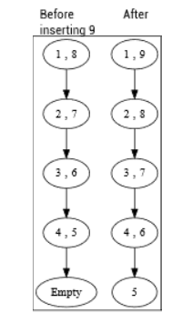

这个数据结构一点都不具有持久性！（回想一下，这里所谓的“持久性”是指：不可变数据结构的新版本能够复用前一版本的大部分内容。）我们实际上是分配了一个全新的双端队列，而且每次从任一端进行 push 或 pop 操作时都会这样做。由于每次 push 或 pop 分配的节点数量与双端队列大小的一半成正比，因此 push 和 pop 在时间和额外内存上的开销始终都是 O(n)。

此外，我们对 `GetEnumerator` 的天真递归实现会在栈空间上消耗 O(n)，而且——可怕的是——在时间上达到 O(n²)。

这个天真的实现看起来似乎说得过去，但其性能特征却与我们想要的恰好相反，并没有比现有的队列实现更好。我们真正需要的是在数据结构的选择上更聪明一些。

## 指针树（finger tree）

想象一下一个树形数据结构：有一个根节点，一些节点是没有子节点的“叶子”，一些节点则有子节点，等等。我们经常会看到这样的树：有些叶子离根节点很远，而有些则相对较浅。如果你从根开始遍历树，那么到达浅层节点的代价就更低。指针树（finger tree）确保某些特定的节点——称为“指针”（fingers）——总是靠近根节点。并且，任何其他节点越接近某个指针，它就越浅。对于一个双端队列来说，我们希望这些指针是树中最左端和最右端的节点；一个节点离两端越近，它就越浅；越接近中间，它就越深。

我们不会直接从头设计指针树数据结构，而是继续不断地攻击“如何构建一个高效的不可变双端队列”这个问题，然后你会看到指针树数据结构是如何自然地从中浮现出来的。

我们那个天真的初始尝试的问题在于：每一次 push 操作都会“溢出”到中间部分，而中间部分又会溢出到它的中间，如此反复，以至于每一次溢出都是昂贵的。拥有一个左端、一个右端和一个中间双端队列，让元素“溢出”到中间的这个想法本身其实非常好，但我们需要让这些昂贵的溢出操作变得更不频繁。我们先做一个辅助数据结构，让双端队列的左右两端有更多“空间”容纳廉价的溢出，然后再看看怎样利用这个新的助手让中间部分也变得更便宜。

### 第一步：mini-deque

为了在左侧和右侧“腾出空间”，我们需要一个辅助的抽象数据类型。我打算把这个 ADT 称为 mini-deque，或者简称 mini。mini 的行为类似 deque：你可以从左边和右边 push 和 pop，但 mini 受到限制：它只能恰好容纳一、二、三或四个元素。不存在空的 mini；尝试对一个只含一个元素的 mini 做 pop，或者对一个已有四个元素的 mini 做 push，都是错误。我们当然可以把 mini-deque 定义成可以容纳多于四个元素，但我们的指针树实现只需要四个，所以就保持在四个即可。

由于 mini-deque 的契约与 deque 不同，我会为 mini 专门创建一个新的接口，以强调给读代码的人看：这些东西并不是真正的 deque。另外，我们还需要一种快速方式来确定 mini-deque 的大小，因此我会把这个也加到接口里。

我们可以用 record 这种“快捷方式”来实现接口，本质上就是在一到四个元素的元组之上加一层接口实现。就像之前那些实现细节的辅助类一样，我会把这些辅助代码嵌套在主类的代码内部：

Listing 3.4 The mini-deque

```csharp
public sealed class Deque<T> : IDeque<T>
{
    private interface IMini : IEnumerable<T>
    {
        public int Size { get; }
        public IMini PushLeft(T item);
        public IMini PushRight(T item);
        public IMini PopLeft();
        public IMini PopRight();
        public T Left();
        public T Right();
    }

    private record One(T item1) : IMini
    {
        public int Size => 1;
        public IMini PushLeft(T item) => new Two(item, item1);
        public IMini PushRight(T item) => new Two(item1, item);
        public IMini PopLeft() => throw new InvalidOperationException();
        public IMini PopRight() => throw new InvalidOperationException();
        public T Left() => item1;
        public T Right() => item1;
        public IEnumerator<T> GetEnumerator()
        {
            yield return item1;
        }
        IEnumerator IEnumerable.GetEnumerator() => GetEnumerator();
    }

    private record Two(T item1, T item2) : IMini
    {
        public int Size => 2;
        public IMini PushLeft(T item) => new Three(item, item1, item2);
        public IMini PushRight(T item) => new Three(item1, item2, item);
        public IMini PopLeft() => new One(item2);
        public IMini PopRight() => new One(item1);
        public T Left() => item1;
        public T Right() => item2;
        public IEnumerator<T> GetEnumerator()
        {
            yield return item1;
            yield return item2;
        }
        IEnumerator IEnumerable.GetEnumerator() => GetEnumerator();
    }

    private record Three(T item1, T item2, T item3) : IMini
    {
        public int Size => 3;
        public IMini PushLeft(T item) =>
            new Four(item, item1, item2, item3);
        public IMini PushRight(T item) =>
            new Four(item1, item2, item3, item);
        public IMini PopLeft() => new Two(item2, item3);
        public IMini PopRight() => new Two(item1, item2);
        public T Left() => item1;
        public T Right() => item3;
        public IEnumerator<T> GetEnumerator()
        {
            yield return item1;
            yield return item2;
            yield return item3;
        }
        IEnumerator IEnumerable.GetEnumerator() => GetEnumerator();
    }

    private record Four(T item1, T item2, T item3, T item4) : IMini
    {
        public int Size => 4;
        public IMini PushLeft(T item) =>
            throw new InvalidOperationException();
        public IMini PushRight(T item) =>
            throw new InvalidOperationException();
        public IMini PopLeft() => new Three(item2, item3, item4);
        public IMini PopRight() => new Three(item1, item2, item3);
        public T Left() => item1;
        public T Right() => item4;
        public IEnumerator<T> GetEnumerator()
        {
            yield return item1;
            yield return item2;
            yield return item3;
            yield return item4;
        }
        IEnumerator IEnumerable.GetEnumerator() => GetEnumerator();
    }
}
```

我相信你会同意，这是一段非常无聊的代码，完全就是字面意义上的实现：用最直接的方式实现了一个不可变的 mini-deque，大小只能是一、二、三或四。

### 对 deque 的新定义

现在我们已经有了 mini-deque 这个辅助类型，就可以给 deque 一个新的递归定义了。一个元素 deque 要么是：

- 一个空 deque，或者
- 一个只包含单个元素的 deque，或者
- 一个左侧 mini，后面跟着一个中间的 mini 的 deque，最后是一个右侧 mini。

注意，中间部分是一个由 mini 组成的 deque，而不是由元素组成的 deque。这正是让这个数据结构变得“块状（chunky）”的关键！我们的策略是每次以一、二、三或四个元素为一组来处理数据，原因有两个：

- 首先，想想当我们不断向某一侧 push 元素，而该 deque 已经有一些元素时，会发生什么。那一侧的 mini 在其中只有一、二或三个元素时，总是可以继续 push 的。也就是说，平均来看，在我们向 deque push 元素的操作中，有一半以上的情况只需要对对应一侧的 mini 做 push；完全不需要碰中间部分。大多数时候，mini 里还有空间可以放一个新元素！类似地，当我们在 pop 时，在一半以上的情况下，被 pop 的那一侧并不会是一个需要特殊处理的一元素 mini，从而避免出现非法的空 mini；如果其中有二、三或四个元素，我们就可以对相应一侧的 mini 做 pop，而不需要碰中间部分。通过这个策略，超过一半的 push 和 pop 操作都同时变得廉价（因为创建新的 mini 是 O(1)）并且非常“持久”（因为其余所有数据结构部分在新 deque 中都被复用）。
- 其次，当我们 push 时，如果 mini 已经没有空间了（因为它已经有四个元素），我们就可以把其中三个元素“打包成块”，作为一个整体 push 到中间部分。这些元素块接着又会被中间的 deque 组织成“块的块”，依此类推。这个数据结构会在 deque 的中间把块变得越来越大，同时保持最两端的“指针”易于操作且开销低。

显然，第二个策略只有在被 push 到中间的“块”总是多于一个元素时才成立。在最初的实现中，我会加一个限制：这个“mini 的 deque”实际上始终是一个由 Three 组成的 deque，因为在这个限制下，代码会更容易编写和分析。等我们为抽象数据类型添加“拼接（concatenation）”操作时，会稍微放宽一点这个限制，但依然会确保我们永远不会在 deque 的中间创建只包含一个元素的“块”。

既然策略已经有了，我们该怎么实现它呢？看起来我们似乎仍然和之前处在差不多的境地，只不过现在更“块状”了一些。之前是一个右侧单个元素、中间一个元素 deque，以及一个左侧单个元素；现在则是一个包含一到四个元素的右侧 mini、中间一个 mini 的 deque（我会限制它每个 mini 都正好包含三个元素），再加上一个同样包含一到四个元素的左侧 mini。这怎么就更好了呢？我们来看一下代码，看看它是如何工作的。

在我们天真的实现中，`EmptyDeque` 保持不变，我就不再重复那段代码了。`SingleDeque` 相比最初的实现只做了轻微修改；我们在这里把这个变化单独拿出来看看。在第一次尝试的单元素 deque 代码中，每当我们 push 一个新元素时，都创建了一个多元素 deque，其中有一个左元素、一个右元素，还有一个空的中间 deque：

```csharp
public IDeque<T> PushLeft(T newItem) =>
    new Deque<T>(newItem, Empty, item);
public IDeque<T> PushRight(T newItem) =>
    new Deque<T>(item, Empty, newItem);
```

现在我们做同样的事情，只不过这次我们需要的是左、右两个 mini，以及一个空的“mini 的 deque”作为中间部分，而不是一个“元素的 deque”。

```csharp
public IDeque<T> PushLeft(T newItem) =>
    new Deque<T>(new One(newItem), Deque<IMini>.Empty, new
        One(item));
public IDeque<T> PushRight(T newItem) =>
    new Deque<T>(new One(item), Deque<IMini>.Empty, new
        One(newItem));
```

其余关于单元素 deque 的代码保持不变。多元素 deque 则按如下方式实现：

Listing 3.5 The deque of minis

```csharp
public sealed class Deque<T> : IDeque<T>
{ […]
    private readonly IMini left;
    private readonly IDeque<IMini> middle; #A
    private readonly IMini right;
    private Deque(IMini left, IDeque<IMini> middle, IMini right)
    {
        this.left = left;
        this.middle = middle;
        this.right = right;
    }
    public IDeque<T> PushLeft(T value) =>
        left.Size < 4 ?
            new Deque<T>(left.PushLeft(value), middle, right) :
            new Deque<T>(
                new Two(value, left.Left()),
                middle.PushLeft(left.PopLeft()), #B
                right);
    public IDeque<T> PushRight(T value) =>
        right.Size < 4 ?
            new Deque<T>(left, middle, right.PushRight(value)) :
            new Deque<T>(
                left,
                middle.PushRight(right.PopRight()), #C
                new Two(right.Right(), value));
    public IDeque<T> PopLeft()
    {
        if (left.Size > 1)
            return new Deque<T>(left.PopLeft(), middle, right);
        if (!middle.IsEmpty)
            return new Deque<T>(middle.Left(), middle.PopLeft(),
                right);
        if (right.Size > 1)
            return new Deque<T>(
                new One(right.Left()), middle, right.PopLeft());
        return new SingleDeque(right.Left());
    }
    public IDeque<T> PopRight()
    {
        if (right.Size > 1)
            return new Deque<T>(left, middle, right.PopRight());
        if (!middle.IsEmpty)
            return new Deque<T>(left, middle.PopRight(),
                middle.Right());
        if (left.Size > 1)
            return new Deque<T>(
                left.PopRight(), middle, new One(left.Right()));
        return new SingleDeque(left.Right());
    }
    public T Left() => left.Left();
    public T Right() => right.Right();
    public bool IsEmpty => false;
    public IEnumerator<T> GetEnumerator()
    {
        foreach (var item in left)
            yield return item;
        foreach (var mini in middle)
            foreach(var item in mini)
                yield return item;
        foreach (var item in right)
            yield return item;
    }
    IEnumerator IEnumerable.GetEnumerator() => GetEnumerator();
}
```

我们来逐行分析一下左侧的 push 和 pop 逻辑；右侧的代码是完全对称的，只是左右互换，所以理解了一个就等于理解了另一个。先看 push：

```csharp
left.Size < 4 ?
    new Deque<T>(left.PushLeft(value), middle, right) :
    new Deque<T>(
        new Two(value, left.Left()),
        middle.PushLeft(left.PopLeft()),
        right);
```

mini 最多可以容纳四个元素；如果左侧 mini 还有空间，我们就构造一个左侧 mini 变大了 1 的新 deque，复用原有的 middle 和 right，从而实现持久化。

如果左侧 mini 已经是一个 Four，那我们就从中取出三个元素组装成一个 Three，把它 push 到 middle 中，然后把新元素和剩下的那一个元素组成一个 Two。这样我们就维持住了“只有 Three 会被放进 mini 的 deque 中”这个不变式。

pop 的代码稍微复杂一些，因为要考虑四种情况：

```csharp
if (left.Size > 1)
    return new Deque<T>(left.PopLeft(), middle, right);
if (!middle.IsEmpty)
    return new Deque<T>(middle.Left(), middle.PopLeft(), right);
if (right.Size > 1)
    return new Deque<T>(new One(right.Left()), middle,
        right.PopLeft());
return new SingleDeque(right.Left());
```

- mini 里从来不会是空的。如果左侧 mini 里有不止一个元素，那我们只需要把最左边的那个拿掉，再用缩小后的 mini 和原样的 middle、right 重新组合出一个新的 deque，就能完成操作。否则……
- 左侧 mini 是一个 One。如果 middle 非空，也就是说左 mini 已经不能再 pop，否则会变成非法的空 mini。幸运的是，如果 middle 里还有东西，那里面的每个元素都是一个 Three。我们可以从 middle 里取出一个 Three，把它作为新的左 mini，再把 middle 的剩余部分接上即可。
- 左侧 mini 只剩一个元素，中间部分也为空，但右侧 mini 有多于一个元素。此时两边中只有右侧还有“富余”。我们就从右 mini 中借一个元素出来，作为新的左 mini（所以新左 mini 是 One），右 mini 自己则执行一次 pop，整体结构仍然保持合法。否则……
- 此时左、右两个 mini 都是 One，并且 middle 为空。这意味着整个 deque 只有两个元素。因此 pop 过后，只剩一个元素，自然应该返回一个 `SingleDeque`。

## 可视化这个数据结构

我们来看一个具体示例，并在几个关键步骤把数据结构画出来。假设我们从一个空的 `Deque<char>` 开始，然后依次 push 一些字符：先把 U push 到左边，然后把 V push 到右边，再把 T、S、R push 到左边，最后把 W、X、Y push 到右边：

```csharp
var deque = Deque<char>.Empty
    .PushLeft('U').PushRight('V').PushLeft('T').PushLeft('S')
    .PushLeft('R').PushRight('W').PushRight('X').PushRight('Y');
```

那么，最终的数据结构会是什么样子？我们会得到一个 deque：左侧是一个 Four，中间是一个空的 mini deque，右侧也是一个 Four。在下面的示意图中，我会用矩形框住多元素 deque，并在框的顶部标注它的类型；我会用椭圆框住 minis、SingleDeque 和 EmptyDeque；箭头表示引用。

图 3.2：一个包含八个元素的 deque，其左侧 mini 可容纳四个元素，右侧 mini 也有四个元素，而中间部分为空。

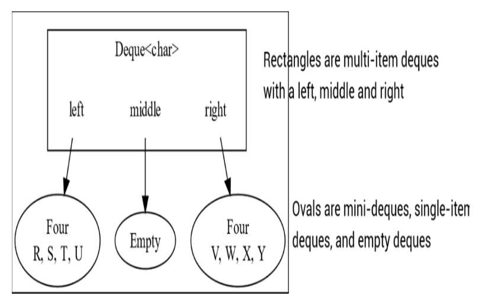

我们可以把此时的结构看成是一个“二层”的 deque，其中第二层（middle）还是空的。
 现在假设我们继续操作，先把 Q push 到左边，再把 Z push 到右边：

```csharp
deque = deque.PushLeft('Q');
deque = deque.PushRight('Z');
```

当我们把 Q push 到左侧时，由于左侧的 Four 已经满了，我们会把其中**最右边的三个元素**取出来组成一个 Three，并把这个 Three push 到 middle 中去。middle 原本是 Empty，因此现在变成了一个 Single（但注意，这是 *mini 的 deque*，不是 char 的 deque）。push Z 到右侧时的情况完全对称：右侧 mini（VWXY）也已满，因此我们取出其中最左边的三个元素组成一个 Three，把它 push 到 middle。最终，middle 里会有两个元素，且这两个都是 Three。

图 3.3：第一幅图表示 push Q 后的 9 元素 deque：左 mini RSTU 装不下 Q，因此把 STU 组成的 Three push 到 middle（一个 mini 的 deque）；第二幅图表示 push Z 后，右 mini VWXY 装不下 Z，因此把 VWX 组成的 Three push 到 middle。最终 middle 中有两个 Three：结构是左边一个 One（里面装一个 Three），中间 Empty，右边一个 One（里面装一个 Three）。

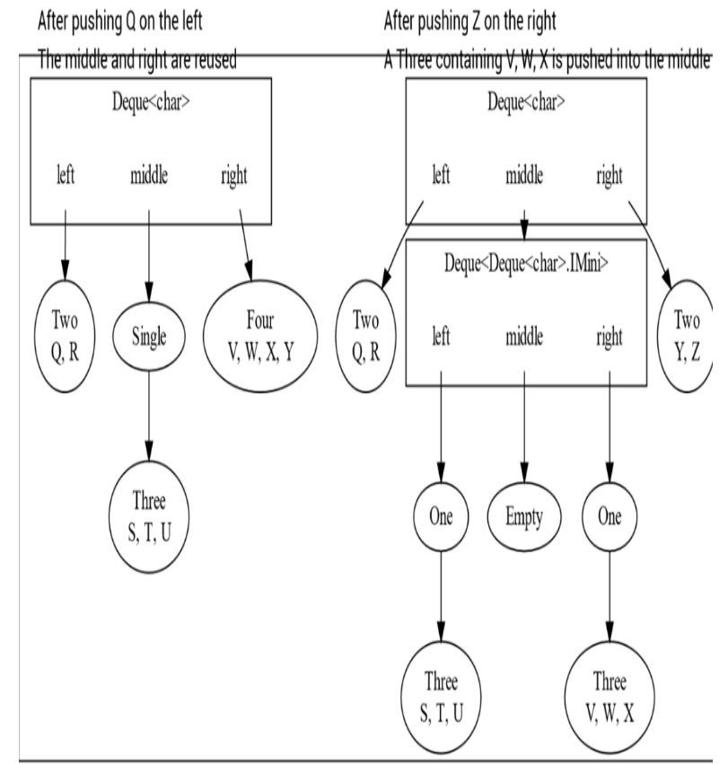

现在我们得到的是一个“三层”的 deque，而第三层依然是空的。假设我们继续往左边 push：P、O、N、…、F

```csharp
deque = deque.PushLeft('P').PushLeft('O').PushLeft('N')
    .PushLeft('M').PushLeft('L').PushLeft('K').PushLeft('J')
    .PushLeft('I').PushLeft('H').PushLeft('G').PushLeft('F');
```

一开始，在左边我们有 Q 和 R 组成的 Two；当我们 push P 和 O 时，左 mini 会逐渐填满；当再 push N 时，左 mini 达到了无法再增长的状态，于是我们把其中三个元素（P、Q、R）组成一个 Three，并 push 到 middle——而 middle 的左侧 mini 还留有空间。记住：**middle 里的元素不是 chars，而是 Three（mini）。**

所以每当我们在最顶层的 deque 左侧 push 三个新的字符，就会产生一个新的 Three 被 push 到第二层中。最终，我们会把 PQR, MNO 和 JKL 三个 `Three` push 到 middle，这些 Three 会被 middle 依次放在它自己的左侧 mini 里。

图 3.4：一个拥有 21 个元素的 deque。在最顶层的 deque 上，每 push 一个新元素：如果左 mini 还没满，我们只需把 mini 变大，其他部分完全复用；当试图向已经满的 Four 把第五个元素塞进去时，我们会把其中三个元素变成 Three 放入 middle，并让左 mini 重新变成 Two。middle 作为一个 mini 的 deque，又会把这些 Three 放进它自己的左 mini 中，而这个 mini 此时也变得相当“饱满”。

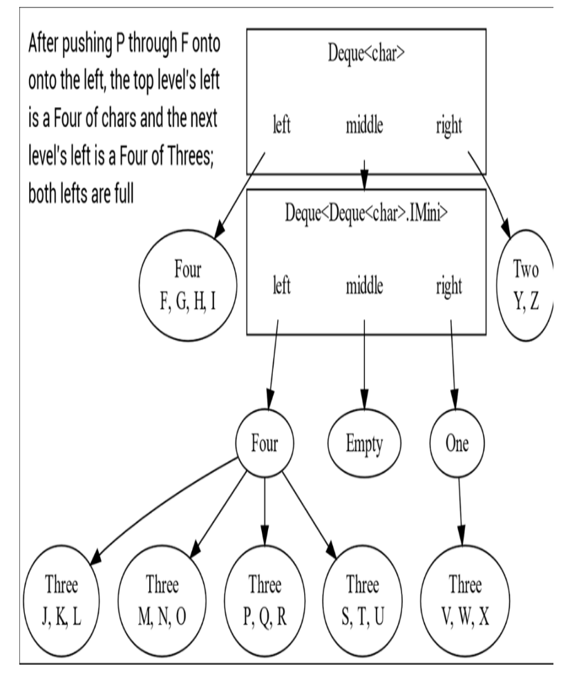

当我们把 E push 到第一层的左侧时，会发生什么？

```csharp
deque = deque.PushLeft('E');
```

最顶层左边的那个 Four 已经装不下了，所以我们会从中取出三个元素 GHI 组成一个 Three，push 到第二层中去。但此时第二层 deque 左侧的 Four 也已经满了，于是我们再把那里的三个元素（也就是三个 Three）打包成一个“三个 Three 组成的 Three”，并把它 push 到第三层，于是第三层就变成了一个 Single。

图 3.5：一个包含 22 个元素的 deque：第二层的左 mini 发生了溢出，我们因此创建了一个“单元素的 deque-of-minis-of-minis”，用来存放这三个 Three。注意，从根节点走到任意叶子所经过的箭头数量，在最左、最右两端是最少的，而在中间位置是最多的。

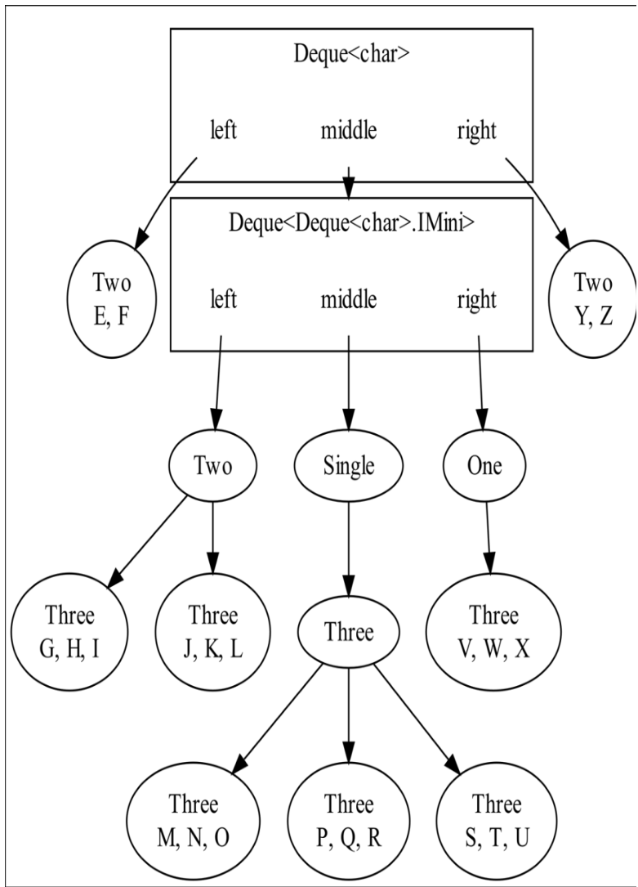

从图 3.5 我们已经能够非常清晰地看到 finger tree 的结构是如何自然浮现出来的。我们正在构建的，是一种**只能在两端插入元素，但在两端永远不会变深的树形结构**。在整个序列中，那些最靠左和最靠右的字符始终放在最顶层的 mini 中；只有中间部分会逐渐变深，但它们的构造方式和顶层完全一致：它们也会尽量把自己最左、最右的元素保持在根附近，只有在必须溢出时才会让自己的 middle 更深，而其 middle 又按同样规则继续递归下去。

此外，注意一个关键现象：

- 最顶层左/右两端的 mini 各自只能容纳 1～4 个字符；
- 下一层（middle 的层级）左/右两端的 mini 则容纳的是 Three，也就是 3、6、9、12 个字符；
- 而且要等到“第五个 Three”被推入它们时才会产生溢出。

换句话说，**随着树的层级加深，两侧作为“缓冲区”的 mini 会呈指数级变大**。这保证了整棵树的深度成长非常缓慢：越往下，每层左、右两端为避免溢出所预留的空间越大，需要更多的元素才能让它们真正变深。这正是 finger tree 的本质所在：
**树的两端总是浅的，中间逐层变深，但变深的速度被指数级增长的缓冲区牢牢控制，从而保持高效的持久化结构。**

## deque 的摊还性能分析

让我们回顾一下之前不断从左侧向 deque 中 push 时所观察到的行为规律：

- 每 3 次左侧 push 中，有 2 次只会更新顶层 deque 的左 mini；middle 和 right 都保持不变。我们把这种开销记为“1 次更新”，因为只更新了第 1 层的左 mini。剩下的 1 次会发生溢出，导致一个 Three 被 push 到第二层 deque（middle）中。
- 接着观察第二层（middle）自身的行为：每 3 次向 middle push（即来自溢出的 push），有 2 次只更新第二层 deque 的左 mini。这时的总开销应算作“2 次更新”，因为我们同时更新了第 1 层和第 2 层。剩下 1 次会进一步溢出，把一个“三个 Three 组成的 Three” push 到第三层 deque 中。
- 继续这样分析下去：在第三层也是同样模式：2/3 的 push 会更新三层的左 mini（即 3 次更新），1/3 的 push 会促使更深一层被创建或更新

于是我们得到一个非常清晰的分布，平均来看：

- 2/3 的 push 只更新 1 层
- 2/9 的 push 更新 2 层
- 2/27 的 push 更新 3 层
- 2/81 的 push 更新 4 层
- …
- 2/(3ᵈ) 的 push 更新 d 层

如果你想一想弹出（pop）操作是如何工作的，你会发现弹出操作的成本分布也是一样的。三分之二的时间里，一个 pop 只需要更新第一层；剩下的时间里，我们需要从中间弹出一个 `Three`，依此类推。

记得我们在上一章讨论的不可变队列吗？它对所有入队和出队操作的摊销成本都是 O(1)，但最坏情况下，当内部栈需要反转时，某些出队操作可能会花费与队列大小 n 成正比的 O(n) 成本。而现在这种数据结构让我们取得了巨大的改进！任何 push 或 pop 的最坏情况在时间和额外空间上的成本都是 O(log₃ n)，其中 n 是 deque 中的元素数量。这个最坏情况的代价非常低，而且更好的是，如果我们有 n 次 push（或 pop），最坏情况大概只会发生两次左右。

如果我们把这种极其罕见、成本又很低的最坏情况在大量 push 和 pop 上平均化，那么摊销成本就是 O(1)。最坏情况的代价保持很低，而且随着 deque 的规模变大，这种最坏情况发生得越来越少。

那么额外的存储空间呢？

- 一个包含三个元素的 Three，相比只存这三个元素本身，会增加一个对象的开销。
- 一个 `Three` 的 `Three`，包含九个元素，会额外增加四个对象的开销：一个外层的 `Three` 和它的三个子 `Three`。
- 一个 `Three` of `Three` of `Three`，包含 27 个元素，会增加 13 个对象的开销。
- 依此类推；如果一个由 `Three` 组成、深度为 d 的树中存储了 3ᵈ 个元素，那么我们会有 (3ᵈ - 1) / 2 个额外对象。

额外对象的数量总是少于最终存储的元素数量的一半；因此，对 deque 中每个存储元素来说，额外存储平均为 O(1)，整体额外存储为 O(n)，这是合理的。deque 是持久化（persistent）的吗？当然是！对于一个大的 deque，大多数左侧的 push 和 pop 只会重建左侧的 minis；中间和右侧在新 deque 中通常保持不变，而中间部分又是存放大多数元素的地方。当然，对于右侧的 push 和 pop 也是一样；这时左侧和中间大多数时候不会被重建。

既然我们确保了树的深度为 O(log₃ n)，那么我们就知道，所有在这个数据结构上运行的递归算法只会消耗很少的调用栈；即便 deque 中有数十亿个元素，也不会导致栈溢出。

> **注意**
>
> 还要注意的是，我们实现了一种能够保证树深度很浅的结构，而不需要维护任何复杂的树平衡不变式。相比传统的平衡树算法，比如红黑树或 AVL 树，这里要考虑的复杂情况非常少。

## 我们是在滥用类型系统吗？

我们习惯了那种递归类型定义，比如“一个链表要么为空，要么是一个头元素加上一个尾链表”；让一个类型的成员本身也是该类型，这看起来非常自然、毫无争议。

但你可能注意到了，本章的递归定义有一点不太一样。当我们说“一个 deque 要么为空，要么是单元素，要么是一个左 mini、接着一个由 minis 组成的 middle deque、再接着一个右 mini”时，我们并没有让某个成员直接是它自己的类型；我们让成员成为一个“更大”的类型！也就是说，如果我们有一个四层深的字符 deque，那么：

- 这个 deque 的类型是 `Deque<char>.IMini>`，并且
- 它的 middle 的类型是 `IDeque<Deque<char>.IMini>`，并且
- 它的 middle 的类型又是 `IDeque<Deque<Deque<char>.IMini>.IMini>`，并且
- 它的 middle 的类型又是 `IDeque<Deque<Deque<Deque<char>.IMini>.IMini>.IMini>`，…

依此类推！这似乎永无止境。随着 deque 变得越来越大，middle 的类型也越来越长。看起来这里存在着一个类型无限递归、无限扩张的情况。这难道不会给编译器带来麻烦吗？运行时又会不会出问题？

在 C++ 这种使用模板（templates）的语言中，编译器会将每一次模板的构造都展开成更多的源代码，然后再编译它们；在这种语言里，这种不断增长的类型确实可能会给编译器造成灾难。但在 C# 和 Java 中，泛型类型是真正的“泛型”。.NET 运行时和 JVM 都通过巧妙的代码重用，能够在运行时处理任意数量的泛型类型实例。

此外，在我们的情况里，类型在实践中并不会变得很深。树的深度是 O(log₃ n)，其中 n 是 deque 的大小，因此即便 deque 中有数百万个元素，类型的嵌套深度也只是几十层，这对系统来说是完全可承受的。

## 双端队列的连接

连接（Concatenation）是列表抽象数据类型中常见的操作，但对许多数据结构来说，它是一个开销昂贵的操作。如果我们想把连接操作加入我们的 deque ADT，会怎样？如果我们有两个 deques，X 和 Y，我们可以用线性时间将它们无脑地连接起来。只要把其中一个的元素全部推入另一个即可：

```c#
IDeque<T> result = x;
foreach(T item in y)
    result = result.PushRight(item);
```

我们能否把两个 deque 的连接做到比线性时间更快？在前一章中，我们看到 Hughes 列表为我们提供了两个栈的 O(1) 连接，无论它们的大小是多少，但那有点作弊，因为我们真正做的只是延迟构造连接后的栈，并在之后支付线性代价。幸运的是，我们可以通过稍微弱化我们的不变式，让两个指针树（finger tree）双端队列之间真正做到廉价的连接：我们不再要求每个 mini-deque 都必须是由 Three 组成的 deque，而是要求它可以是由 Three 和/或 Two 组成的 deque。我们可以通过以下更改来实现：

首先，我们需要在接口中添加一个新成员：我们添加一个 `Concatenate` 方法，它接受要连接到 this 右侧的 deque items，并返回结果：

```c#
public interface IDeque<T> : IEnumerable<T>
{
    […]
    IDeque<T> Concatenate(IDeque<T> items);
}
```

我们实现 mini-deque 来作为 deque 左右两侧的“缓冲区”，并为大小一、二、三和四的 deque 实现了 push 和 pop。我们仍将限定 mini-deque 到这些大小，但我们需要能够将 minis 彼此连接，这就出现了问题。将一个 Three 连接到一个 One 可以产生一个 Four，但如果连接两个 Three 呢？

我们要做的是创建一个特殊的连接方法，它返回一个 minis 的序列，其中每个 mini 都是 Two 或 Three。之后我们会看到它的用处；下面的代码清单 3.6 展示了该方法在每个 mini-deque 类中的实现。每个 mini-deque 类中的其他代码保持不变。

**代码清单 3.6 将 minis 连接成 Twos 和 Threes**

```c#
public sealed class Deque<T> : IDeque<T>
{
    private interface IMini : IEnumerable<T>
    {
        […]
        public IEnumerable<IMini> TwosAndThrees(IMini mini);
    }

    private record One(T item1) : IMini
    {
        […]
        public IEnumerable<IMini> TwosAndThrees(IMini mini) =>
            mini switch
            {
                One or Two => [mini.PushLeft(Left())],            #A
                _ => [PushRight(mini.Left()), mini.PopLeft()]      #B
            };
    }

    private record Two(T item1, T item2) : IMini
    {
        […]
        public IEnumerable<IMini> TwosAndThrees(IMini mini) =>
            mini switch
            {
                One => [PushRight(mini.Left())],                  #C
                Two or Three => [this, mini],                     #D
                _ => [PushRight(mini.Left()), mini.PopLeft()]      #E
            };
    }

    private record Three(T item1, T item2, T item3) : IMini
    {
        […]
        public IEnumerable<IMini> TwosAndThrees(IMini mini) =>
            mini switch
            {
                One => [PopRight(), mini.PushLeft(Right())],         #F
                Two or Three => [this, mini],                         #G
                _ => [this,
                      mini.PopRight().PopRight(),
                      mini.PopLeft().PopLeft()]                       #H
            };
    }

    private record Four(T item1, T item2, T item3, T item4) : IMini
    {
        […]
        public IEnumerable<IMini> TwosAndThrees(IMini mini) =>
            mini switch
            {
                One or Two => [PopRight(), mini.PushLeft(Right())],    #I
                Three     => [PopRight().PopRight(),
                               PopLeft().PopLeft(), mini],             #J
                _ => [PopRight().PopRight(),
                      PopLeft().PopLeft().PushRight(mini.Left()),
                      mini.PopLeft()]                                 #K
            };
    }
}
```

现在我们有三个类 —— `EmptyDeque`、`SingleDeque` 和 `Deque` —— 用来实现新的 `Concatenate` 方法。在空 deque 上实现连接是简单的，它就是一个恒等操作：

```c#
private sealed class EmptyDeque : IDeque<T>
{
    […]
    public IDeque<T> Concatenate(IDeque<T> items) => items;
}
```

在单元素 deque 上实现连接几乎同样简单；我们只需把唯一的元素推到我们希望连接上去的 deque 的左侧：

```c#
private record SingleDeque(T item) : IDeque<T>
{
    […]
    public IDeque<T> Concatenate(IDeque<T> items) =>
        items.PushLeft(item);
}
```

对于多元素 deque 的连接有两种情况。

- 如果我们连接两个多元素 deque，显然结果也会是一个多元素 deque。左 deque 的 left 和右 deque 的 right 都可原样复用；最难的是构造新的 middle。为了创建新的 middle，我们从左 deque 的 right 和右 deque 的 left 中构造一个 Twos 和 Threes 的序列。我们首先将这些 Twos 和 Threes 推入左 deque 的 middle 的右侧。最终，通过对右 deque 的 middle 调用 Concatenate，我们得到新的 middle。参见图 3.6 了解这一情况。
- 如果我们连接一个多元素 deque 和其它任何 deque，我们只需将右侧 deque 的所有元素推入左 deque 的左侧即可。

在这两种情况下，我们都需要把一个元素序列推入 deque 的右侧，因此我实现了一个方便的扩展方法 `PushRightMany`，它利用 `Aggregate` 扩展方法来完成这项工作。

**代码清单 3.7 多元素 deque 的连接实现**

```c#
public sealed class Deque<T> : IDeque<T>
{
    […]
    public IDeque<T> Concatenate(IDeque<T> items) =>
        right is Deque<T> r ?
            new Deque<T>(
                left,
                middle.PushRightMany(right.TwosAndThrees(r.left))
                      .Concatenate(r.middle),
                r.right) :
            this.PushRightMany(items);
}

static class Extensions
{
    public static IDeque<T> PushRightMany<T>(
        this IDeque<T> deque, IEnumerable<T> items) =>
        items.Aggregate(deque, (d, item) => d.PushRight(item));
}
```

以上解释可能有点令人困惑；我们来看图 3.6。假设我们要连接两个多元素的 `Deque<char>`，每个都包含 13 个字符：

图 3.6 一个场景，展示如何把两个 13 项的 deque 连接在一起。

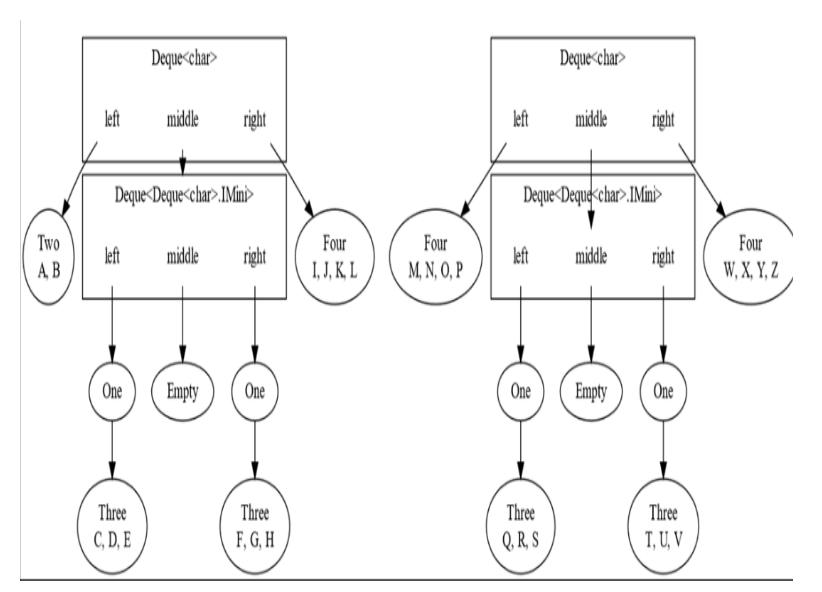

我们首先要做的，是从需要放入连接后 deque 的 middle 的两个 `Four` 中创建一个由 `Two` 和 `Three` 组成的序列。

Figure 3.7 将两个 `Four` 转换成一个 `Two`、一个 `Three` 和一个 `Three`

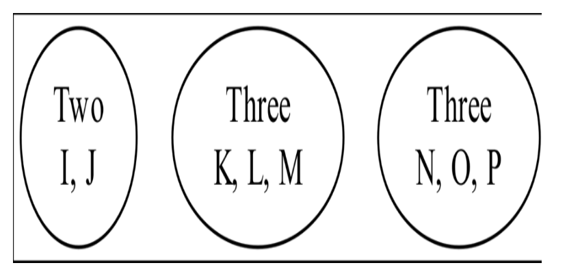

接着我们将这三个 mini 推入左侧 deque 的 `middle` 中，从而生成第一个中间 deque:
Figure 3.8 将 Twos 和 Threes 的序列推入左侧 deque 的 middle 后得到的结果。

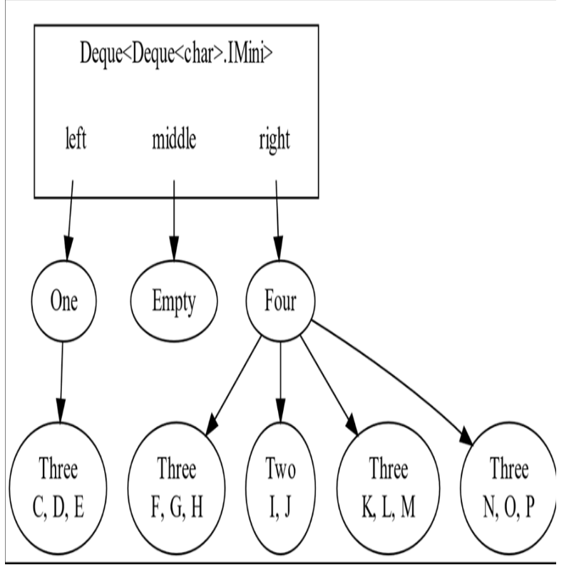

现在，我们可以通过递归来解决这个问题：把第一个中间 deque 与右侧 deque 的 middle 连接起来。Figure 3.9 展示了新的连接问题：
Figure 3.9 我们已经把连接问题缩小成一个更小的问题，而这个问题可以递归解决。

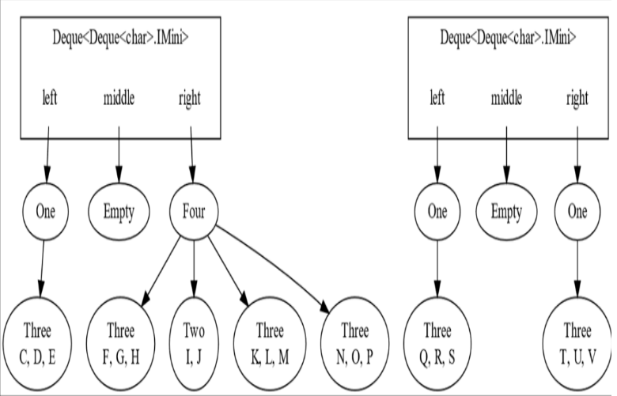

我们再次取左侧 deque 的 `right` 中的 `Four`，以及右侧 deque 的 `left` 中的 `One`，并将它们分解成 `Two` 和 `Three`：
Figure 3.10 将一个 Four 和一个 One 分解，变成一个 Two 和一个 Three

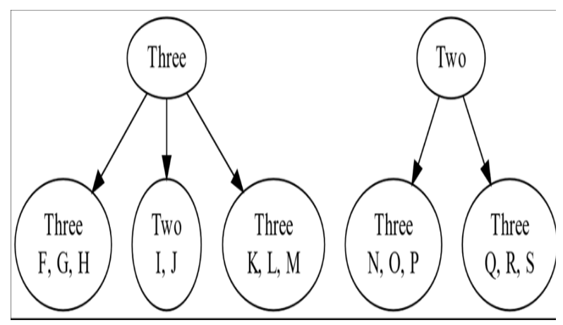

然后我们将它们推入第一个中间 deque 的 middle，从而生成第二个中间 deque，如图 3.11 所示。
Figure 3.11 第二个中间 deque 是将 Three 和 Two 推入第一个中间 deque 的 middle（该 middle 为空）后得到的。结果是一个包含两个元素的 deque。

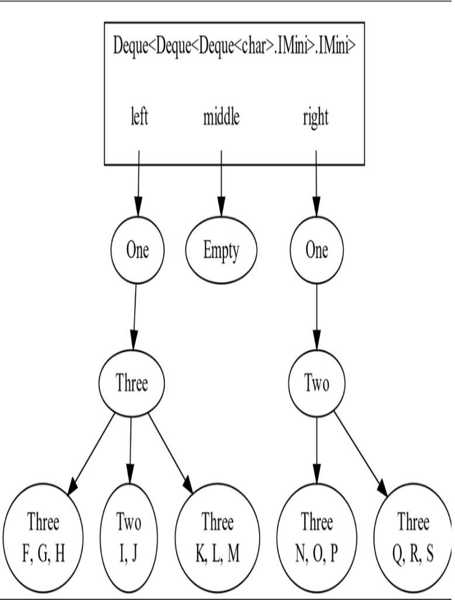

随后，将第二个中间 deque 与图 3.9 中右侧 deque 的 `middle` 进行连接，而该 `middle` 为空，因此递归结束。图 3.11 中展示的 deque 现在成为第三个中间 deque 的 middle，如图 3.12 所示：
Figure 3.12 这是图 3.9 所示连接问题的解决方案。我们取图 3.11 中的 deque 作为 middle，并取正在连接的两个 deque 的 left 和 right。

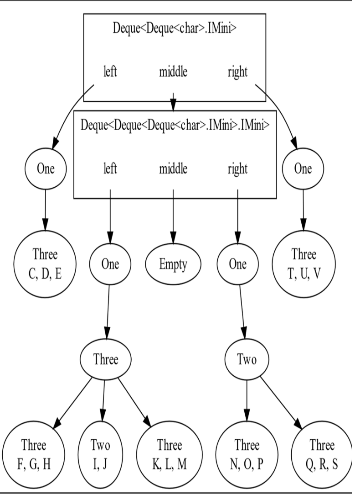

最后，我们取图 3.6 中两个原始 deque 的 `left` 和 `right`，再加上我们刚在图 3.12 中构建的 deque，将它们组合起来，形成最终的连接结果：
Figure 3.13 图 3.6 给出的连接问题的解决方案。

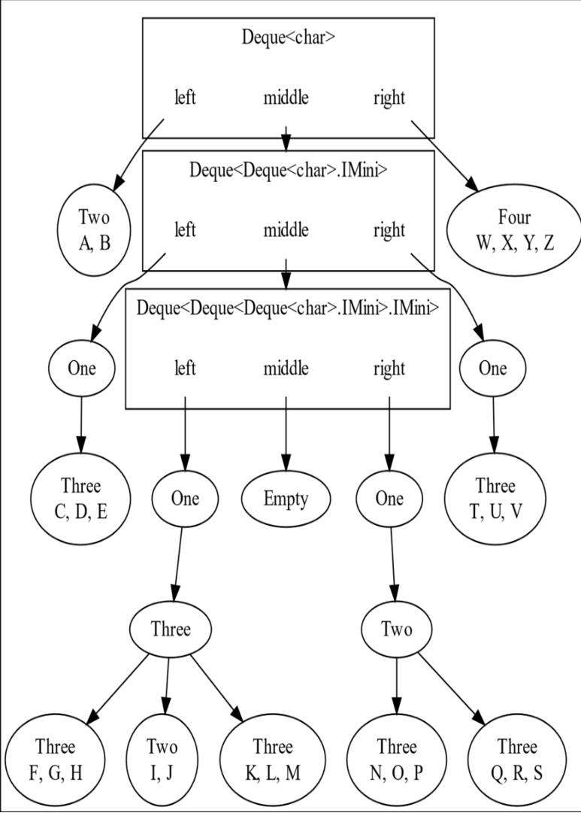

在原始的两个要连接的 deque 中，字符 I、J、K、L、M、N、O 和 P 位于各自 deque 的左右端，因此都存储在树的顶层。在连接后的 deque 中，它们现在位于距离根最远的节点中。这正是我们应该预期的；它们位于最终序列的中间部分，因此被移动到了树最深的地方。

这是一段复杂的过程，看起来我们沿途构造了许多中间数据结构。此外，我们还弱化了一个重要的不变式；我们现在允许 middle deque 中同时存在 Two 和 Three。接下来让我们看看这一变化的影响，以及连接操作的性能。

